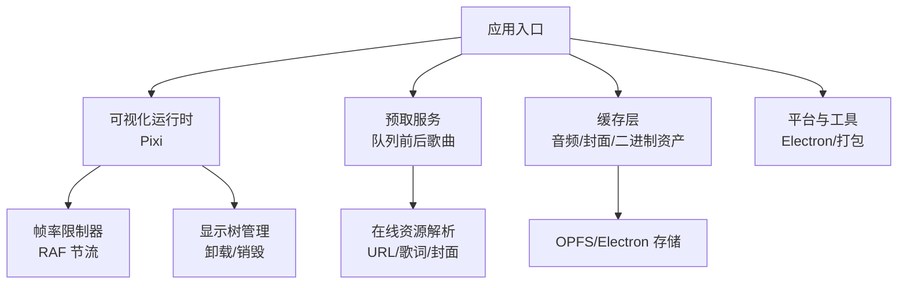
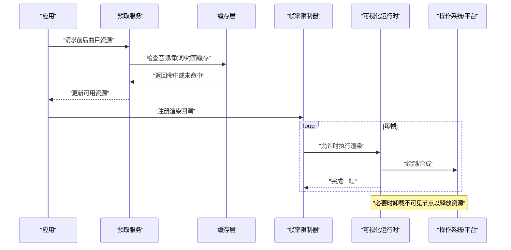
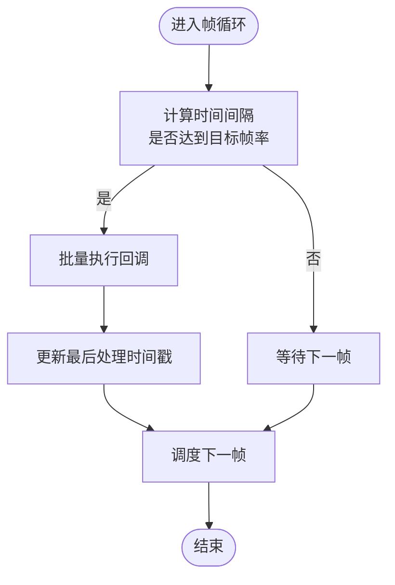
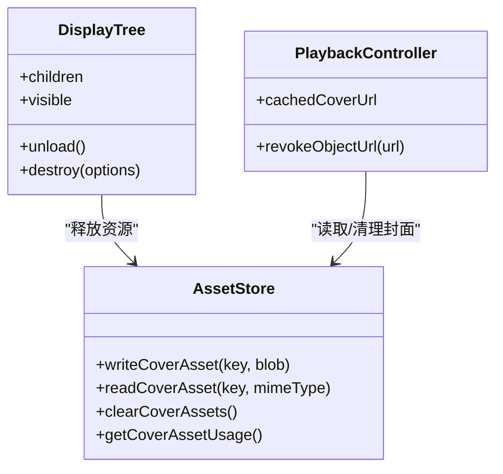
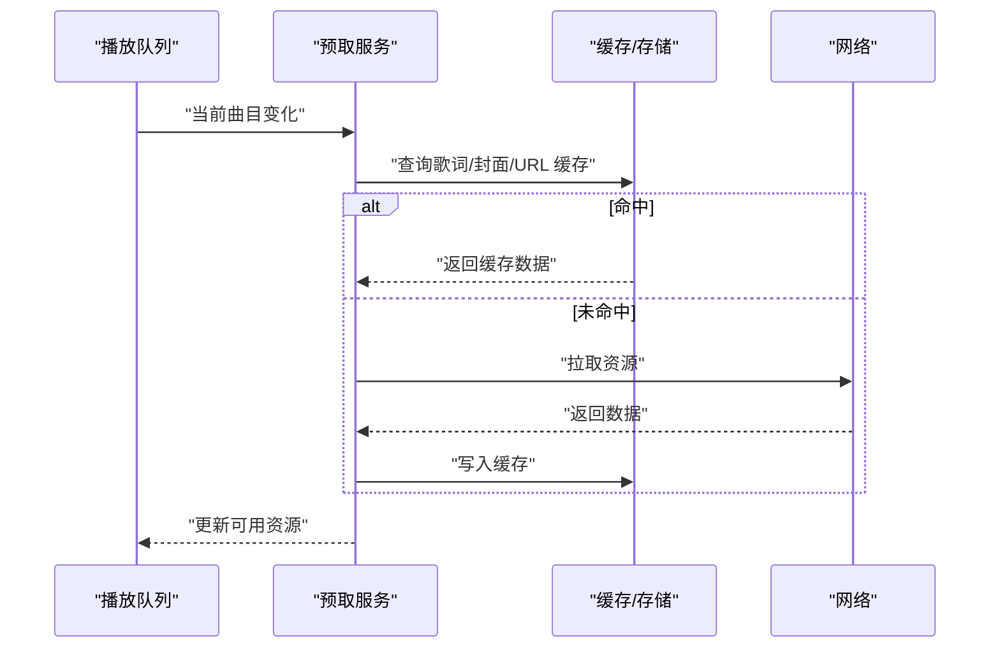
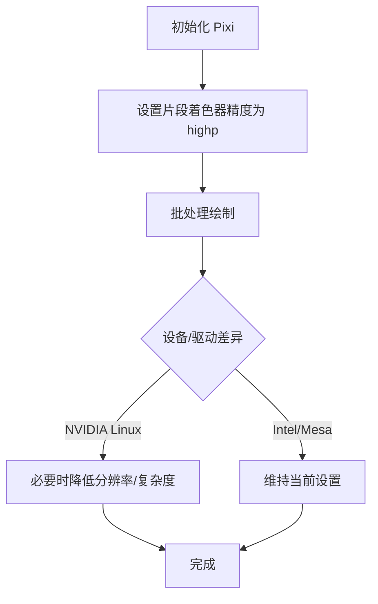
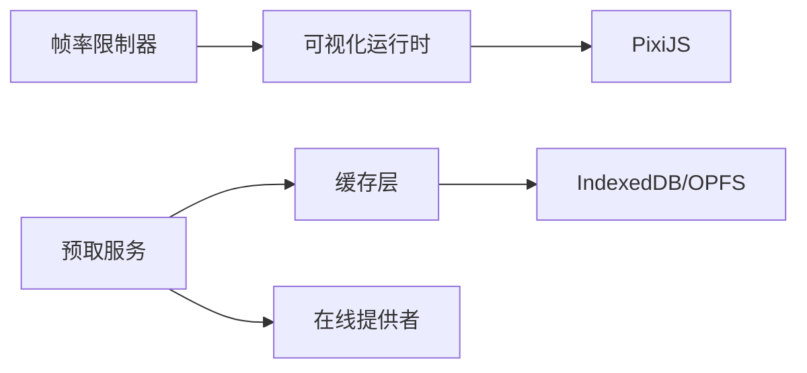

# 性能优化

<cite>
**本文引用的文件**
- [src/utils/frameRateLimiter.ts](file://src/utils/frameRateLimiter.ts)
- [src/components/visualizer/pixiDisplayResources.ts](file://src/components/visualizer/pixiDisplayResources.ts)
- [src/services/audioCache.ts](file://src/services/audioCache.ts)
- [src/services/coverCache.ts](file://src/services/coverCache.ts)
- [src/components/folia-grid/gridItemVisibility.ts](file://src/components/folia-grid/gridItemVisibility.ts)
- [src/components/visualizer/loadPixi.ts](file://src/components/visualizer/loadPixi.ts)
- [src/services/prefetchService.ts](file://src/services/prefetchService.ts)
- [src/components/visualizer/useVisPlaygroundPreviewPlayback.ts](file://src/components/visualizer/useVisPlaygroundPreviewPlayback.ts)
- [src/hooks/useLibraryPlaybackController.ts](file://src/hooks/useLibraryPlaybackController.ts)
- [src/components/remote/useRemoteCoverArt.ts](file://src/components/remote/useRemoteCoverArt.ts)
- [src/components/app/overlays/now-playing-toast/pulsingBorderProgressShader.ts](file://src/components/app/overlays/now-playing-toast/pulsingBorderProgressShader.ts)
- [src/components/visualizer/tempera/temperaMotion.ts](file://src/components/visualizer/tempera/temperaMotion.ts)
- [src/components/visualizer/sonnet/sonnetGuides.ts](file://src/components/visualizer/sonnet/sonnetGuides.ts)
- [src/components/command-palette/CommandPaletteQueueList.tsx](file://src/components/command-palette/CommandPaletteQueueList.tsx)
- [src/components/modal/SettingsModal.tsx](file://src/components/modal/SettingsModal.tsx)
- [src/services/binaryAssetStore.ts](file://src/services/binaryAssetStore.ts)
- [electron/analysis/modelPaths.cjs](file://electron/analysis/modelPaths.cjs)
- [package.json](file://package.json)
</cite>

## 目录
1. [简介](#简介)
2. [项目结构](#项目结构)
3. [核心组件](#核心组件)
4. [架构总览](#架构总览)
5. [详细组件分析](#详细组件分析)
6. [依赖关系分析](#依赖关系分析)
7. [性能考量](#性能考量)
8. [故障排查指南](#故障排查指南)
9. [结论](#结论)
10. [附录](#附录)

## 简介
本指南聚焦于可视化系统的性能优化，围绕帧率控制与渲染优化、内存管理与资源释放、资源预加载与缓存、GPU 加速实践、性能监控与分析工具使用，以及多设备平台适配策略展开。文档基于仓库中实际实现进行提炼，提供可操作的优化建议与图示说明，帮助开发者在复杂可视化场景下稳定获得高帧率与低延迟体验。

## 项目结构
本项目将可视化渲染、音频缓存、封面缓存、预取服务、帧率限制等能力分散在多个模块中：
- 渲染层：基于 PixiJS 的可视化运行时，包含显示树卸载、着色器精度设置、动画循环等。
- 数据与缓存层：音频与封面的本地缓存、二进制资产存储、预取服务。
- 控制与调度层：全局帧率限制、可视项可见性判断、命令面板滚动节流等。
- 平台与工具：Electron 模型路径解析、打包脚本与运行参数、手动探针任务。

**图表来源**
- [src/utils/frameRateLimiter.ts:63-129](file://src/utils/frameRateLimiter.ts#L63-L129)
- [src/components/visualizer/pixiDisplayResources.ts:10-36](file://src/components/visualizer/pixiDisplayResources.ts#L10-L36)
- [src/services/prefetchService.ts:24-39](file://src/services/prefetchService.ts#L24-L39)
- [src/services/audioCache.ts:39-121](file://src/services/audioCache.ts#L39-L121)
- [src/services/coverCache.ts:44-129](file://src/services/coverCache.ts#L44-L129)
- [electron/analysis/modelPaths.cjs:82-113](file://electron/analysis/modelPaths.cjs#L82-L113)

**章节来源**
- [src/utils/frameRateLimiter.ts:1-197](file://src/utils/frameRateLimiter.ts#L1-L197)
- [src/components/visualizer/pixiDisplayResources.ts:1-37](file://src/components/visualizer/pixiDisplayResources.ts#L1-L37)
- [src/services/prefetchService.ts:1-544](file://src/services/prefetchService.ts#L1-L544)
- [src/services/audioCache.ts:1-121](file://src/services/audioCache.ts#L1-L121)
- [src/services/coverCache.ts:1-130](file://src/services/coverCache.ts#L1-L130)
- [electron/analysis/modelPaths.cjs:78-118](file://electron/analysis/modelPaths.cjs#L78-L118)

## 核心组件
- 帧率限制器：通过拦截 requestAnimationFrame，按配置帧率批量执行回调，避免每帧都触发重绘，降低 CPU/GPU 压力。
- 显示树卸载：在可视区域外或容器切换时，递归调用 unload/destroy，释放纹理与 GPU 资源，减少内存占用。
- 音频缓存：优先 Electron 文件缓存，回退到 IndexedDB；写入后通知监听者，支持迁移与清理。
- 封面缓存：统一读取 OPFS/Electron 二进制资产，兼容旧 Blob 格式，提供 URL 生成与清理接口。
- 预取服务：对当前曲目的前后若干曲目进行轻量资源预取（URL、歌词、封面），并受 TTL 与 LRU 限制，避免过度占用内存。
- 网格项可见性：根据类型过滤可隐藏项，配合虚拟化列表减少渲染开销。
- 着色器精度：在 Pixi 初始化前提升片段着色器精度为 highp，避免 fp16 溢出导致的黑屏/噪点问题。

**章节来源**
- [src/utils/frameRateLimiter.ts:22-54](file://src/utils/frameRateLimiter.ts#L22-L54)
- [src/components/visualizer/pixiDisplayResources.ts:10-36](file://src/components/visualizer/pixiDisplayResources.ts#L10-L36)
- [src/services/audioCache.ts:39-121](file://src/services/audioCache.ts#L39-L121)
- [src/services/coverCache.ts:44-129](file://src/services/coverCache.ts#L44-L129)
- [src/services/prefetchService.ts:24-39](file://src/services/prefetchService.ts#L24-L39)
- [src/components/folia-grid/gridItemVisibility.ts:1-17](file://src/components/folia-grid/gridItemVisibility.ts#L1-L17)
- [src/components/visualizer/loadPixi.ts:1-37](file://src/components/visualizer/loadPixi.ts#L1-L37)

## 架构总览
下图展示了从应用启动到可视化渲染的关键路径：预取服务准备资源，缓存层提供本地命中，帧率限制器协调渲染节奏，显示树按需卸载释放资源，Electron 平台能力参与存储与模型可用性判断。

**图表来源**
- [src/services/prefetchService.ts:405-493](file://src/services/prefetchService.ts#L405-L493)
- [src/services/audioCache.ts:39-121](file://src/services/audioCache.ts#L39-L121)
- [src/services/coverCache.ts:44-129](file://src/services/coverCache.ts#L44-L129)
- [src/utils/frameRateLimiter.ts:63-129](file://src/utils/frameRateLimiter.ts#L63-L129)
- [src/components/visualizer/pixiDisplayResources.ts:10-36](file://src/components/visualizer/pixiDisplayResources.ts#L10-L36)

## 详细组件分析

### 帧率控制与渲染优化
- 全局 RAF 节流：通过拦截 window.requestAnimationFrame/cancelAnimationFrame，维护一个回调队列，仅在允许的帧间隔内执行，支持动态调整目标帧率（关闭/60/90/120）。
- 批量执行：每帧收集所有待执行回调并一次性调用，减少调度开销。
- 平滑滚动与对齐：命令面板列表滚动时使用 requestAnimationFrame 对齐滚动位置，避免抖动。
- 可视化预览播放：使用 requestAnimationFrame 驱动频谱与动画，并在退出时取消，防止泄漏。

**图表来源**
- [src/utils/frameRateLimiter.ts:42-54](file://src/utils/frameRateLimiter.ts#L42-L54)
- [src/utils/frameRateLimiter.ts:63-129](file://src/utils/frameRateLimiter.ts#L63-L129)

**章节来源**
- [src/utils/frameRateLimiter.ts:1-197](file://src/utils/frameRateLimiter.ts#L1-L197)
- [src/components/command-palette/CommandPaletteQueueList.tsx:71-85](file://src/components/command-palette/CommandPaletteQueueList.tsx#L71-L85)
- [src/components/visualizer/useVisPlaygroundPreviewPlayback.ts:72-88](file://src/components/visualizer/useVisPlaygroundPreviewPlayback.ts#L72-L88)

### 内存管理与资源释放
- 显示树卸载：遍历子节点，调用 unload/destroy，确保纹理与 GPU 资源被释放，避免内存泄漏。
- 对象 URL 生命周期：在切换封面或发布媒体源时及时撤销 Object URL，防止内存增长。
- 二进制资产清理：提供覆盖范围统计与清空接口，便于用户主动释放空间。
- 迁移与降级：旧版 Blob 缓存自动迁移至新存储后端，失败时保持兼容。

**图表来源**
- [src/components/visualizer/pixiDisplayResources.ts:10-36](file://src/components/visualizer/pixiDisplayResources.ts#L10-L36)
- [src/services/binaryAssetStore.ts:140-173](file://src/services/binaryAssetStore.ts#L140-L173)
- [src/hooks/useLibraryPlaybackController.ts:177-200](file://src/hooks/useLibraryPlaybackController.ts#L177-L200)

**章节来源**
- [src/components/visualizer/pixiDisplayResources.ts:1-37](file://src/components/visualizer/pixiDisplayResources.ts#L1-L37)
- [src/services/binaryAssetStore.ts:140-173](file://src/services/binaryAssetStore.ts#L140-L173)
- [src/hooks/useLibraryPlaybackController.ts:177-200](file://src/hooks/useLibraryPlaybackController.ts#L177-L200)

### 资源预加载与管理机制
- 预取窗口：默认向前两首、向后一首，仅预取轻量资源（URL、歌词、封面），避免解码与重型分析。
- TTL 与 LRU：URL 有效期 20 分钟，超过则失效；内存缓存超过阈值时驱逐最久未使用项。
- 异步与空闲调度：使用 requestIdleCallback 或 setTimeout 非阻塞执行，避免阻塞主线程。
- 歌词与封面缓存：优先 IndexedDB/二进制资产，失败时回退网络请求；封面颜色提取结果按 URL 缓存，减少重复计算。

**图表来源**
- [src/services/prefetchService.ts:24-39](file://src/services/prefetchService.ts#L24-L39)
- [src/services/prefetchService.ts:159-373](file://src/services/prefetchService.ts#L159-L373)
- [src/services/prefetchService.ts:405-493](file://src/services/prefetchService.ts#L405-L493)
- [src/components/remote/useRemoteCoverArt.ts:37-134](file://src/components/remote/useRemoteCoverArt.ts#L37-L134)

**章节来源**
- [src/services/prefetchService.ts:1-544](file://src/services/prefetchService.ts#L1-L544)
- [src/components/remote/useRemoteCoverArt.ts:30-134](file://src/components/remote/useRemoteCoverArt.ts#L30-L134)

### GPU 加速最佳实践
- 着色器精度：在 Pixi 初始化前设置 preferredFragmentPrecision 为 highp，避免 fp16 溢出导致黑屏或噪点。
- 批处理渲染：通过帧率限制器合并回调，减少 draw call 与状态切换；利用 Pixi 的容器与批处理特性组织层级。
- 硬件加速配置：Electron 构建时可启用 SwiftShader 或系统原生图形后端，结合打包脚本与环境变量选择合适模式。

**图表来源**
- [src/components/visualizer/loadPixi.ts:1-37](file://src/components/visualizer/loadPixi.ts#L1-L37)
- [package.json:35-42](file://package.json#L35-L42)

**章节来源**
- [src/components/visualizer/loadPixi.ts:1-37](file://src/components/visualizer/loadPixi.ts#L1-L37)
- [package.json:35-42](file://package.json#L35-L42)

### 性能监控与分析工具
- 手动探针：提供可视化内存探针任务，用于定位内存峰值与泄漏点。
- 设置页缓存统计：展示各类缓存占用（封面、媒体、分析），支持分类清理与全量清理。
- 日志与告警：关键路径输出警告信息，便于快速定位问题。

**章节来源**
- [package.json:35-42](file://package.json#L35-L42)
- [src/components/modal/SettingsModal.tsx:742-786](file://src/components/modal/SettingsModal.tsx#L742-L786)

### 不同设备与平台适配策略
- 移动端：降低可视化复杂度、限制帧率、减少纹理尺寸，避免过度渲染。
- 低配置设备：启用 SwiftShader 或降级图形后端，关闭重型特效（如噪声滤镜、复杂轨迹）。
- 跨平台兼容性：Electron 模型可用性检测，不支持的平台在设置页明确提示；封面代理与 CORS 处理保证跨域资源访问。

**章节来源**
- [electron/analysis/modelPaths.cjs:82-113](file://electron/analysis/modelPaths.cjs#L82-L113)
- [src/services/coverCache.ts:23-42](file://src/services/coverCache.ts#L23-L42)

## 依赖关系分析
- 帧率限制器依赖全局 window 对象与本地存储键，提供统一的 RAF 抽象。
- 预取服务依赖在线音乐提供者、歌词解析、自动匹配与回放增益信息。
- 缓存层依赖数据库与二进制资产存储，支持迁移与清理。
- 可视化运行时依赖 Pixi 与显示树管理，确保资源正确释放。

**图表来源**
- [src/utils/frameRateLimiter.ts:63-129](file://src/utils/frameRateLimiter.ts#L63-L129)
- [src/services/prefetchService.ts:159-373](file://src/services/prefetchService.ts#L159-L373)
- [src/services/audioCache.ts:39-121](file://src/services/audioCache.ts#L39-L121)
- [src/components/visualizer/loadPixi.ts:1-37](file://src/components/visualizer/loadPixi.ts#L1-L37)

**章节来源**
- [src/utils/frameRateLimiter.ts:1-197](file://src/utils/frameRateLimiter.ts#L1-L197)
- [src/services/prefetchService.ts:1-544](file://src/services/prefetchService.ts#L1-L544)
- [src/services/audioCache.ts:1-121](file://src/services/audioCache.ts#L1-L121)
- [src/components/visualizer/loadPixi.ts:1-37](file://src/components/visualizer/loadPixi.ts#L1-L37)

## 性能考量
- 帧率控制：在高负载场景下将帧率限制为 60/90，显著降低 CPU/GPU 压力；在高性能设备上可开启 120。
- 渲染优化：使用批量渲染与视锥剔除（通过显示树可见性控制），减少无效绘制。
- 内存管理：及时卸载不可见节点、撤销不再使用的 Object URL，定期清理缓存。
- 资源预取：合理设置预取窗口与 TTL，避免过多并发请求与内存占用。
- GPU 加速：确保着色器精度正确，必要时降低分辨率或关闭重型特效。
- 平台适配：根据设备能力动态调整策略，提供降级路径与用户可控选项。

[本节为通用指导，不直接分析具体文件]

## 故障排查指南
- 黑屏/噪点：检查 Pixi 初始化顺序与着色器精度设置，确认未在编译前降级为 mediump。
- 内存泄漏：确认显示树卸载逻辑是否被执行，Object URL 是否及时撤销。
- 卡顿/掉帧：检查帧率限制器是否生效，是否存在过多同步操作阻塞主线程。
- 缓存异常：验证二进制资产存储读写流程，清理损坏条目并重新迁移。
- 预取失败：关注网络错误与 TTL 过期，必要时强制刷新并记录日志。

**章节来源**
- [src/components/visualizer/loadPixi.ts:1-37](file://src/components/visualizer/loadPixi.ts#L1-L37)
- [src/components/visualizer/pixiDisplayResources.ts:10-36](file://src/components/visualizer/pixiDisplayResources.ts#L10-L36)
- [src/utils/frameRateLimiter.ts:56-61](file://src/utils/frameRateLimiter.ts#L56-L61)
- [src/services/coverCache.ts:44-129](file://src/services/coverCache.ts#L44-L129)
- [src/services/prefetchService.ts:405-493](file://src/services/prefetchService.ts#L405-L493)

## 结论
通过在帧率控制、渲染优化、内存管理、资源预取、GPU 加速与平台适配等方面采取系统化措施，可在复杂可视化场景中显著提升性能与稳定性。建议结合项目中的实际实现持续监控与调优，针对不同设备与使用场景制定差异化策略，确保用户体验的一致性与流畅性。

[本节为总结，不直接分析具体文件]

## 附录
- 相关配置与脚本：
  - 开发/打包脚本中包含 Electron 图形模式与环境变量，便于在不同平台上测试与部署。
  - 手动探针任务可用于定位内存与渲染问题。

**章节来源**
- [package.json:35-42](file://package.json#L35-L42)