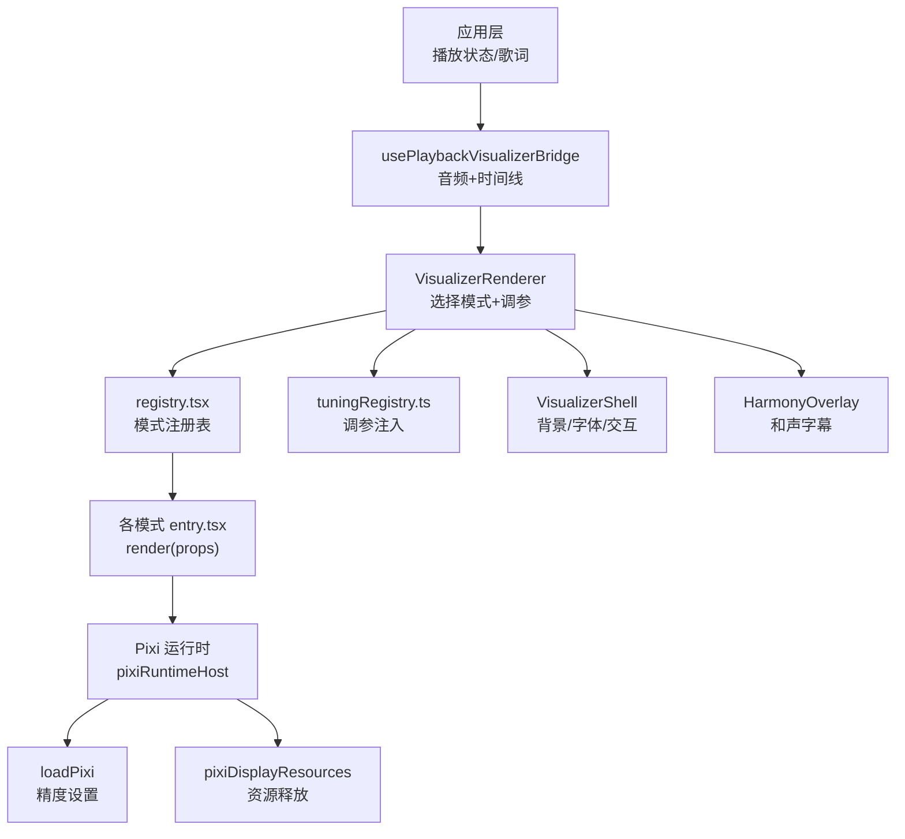
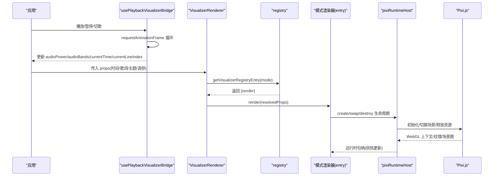
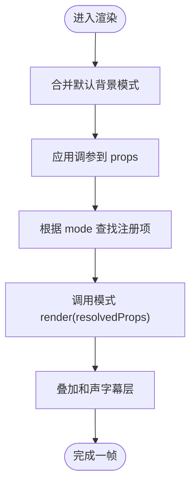
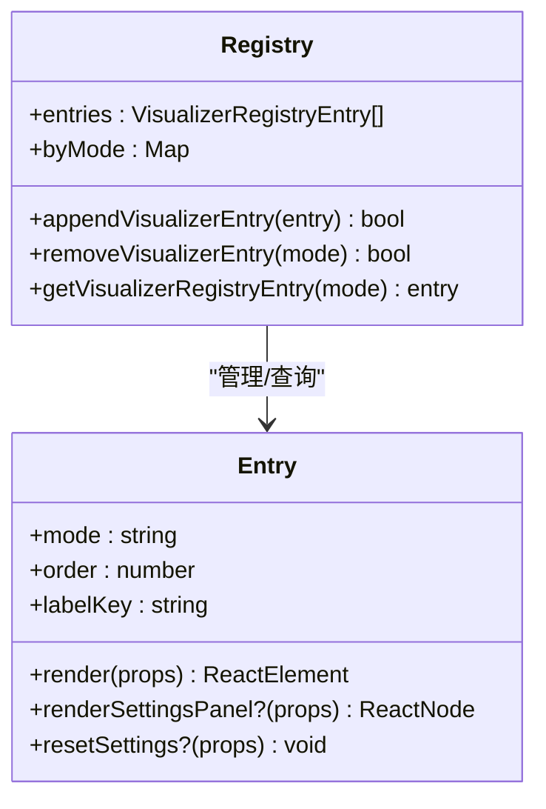
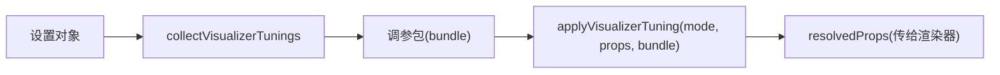
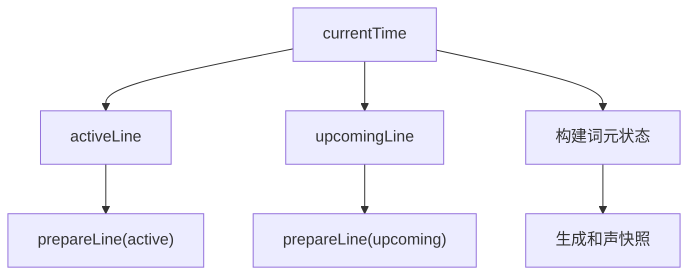
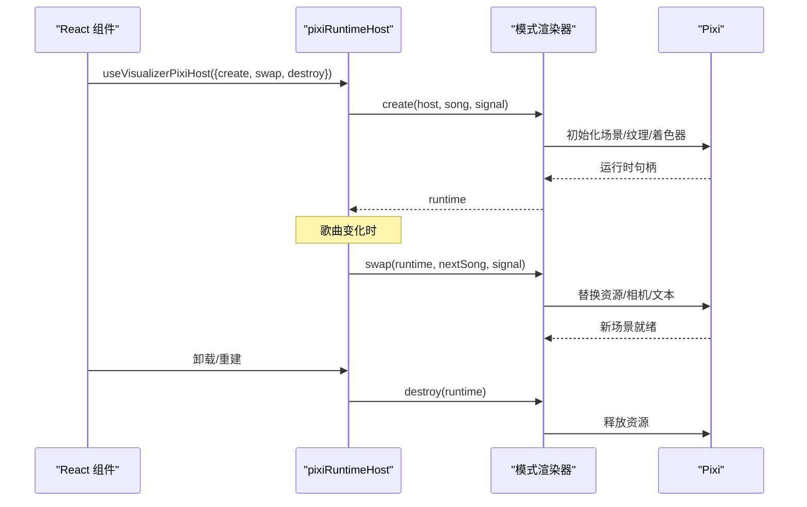
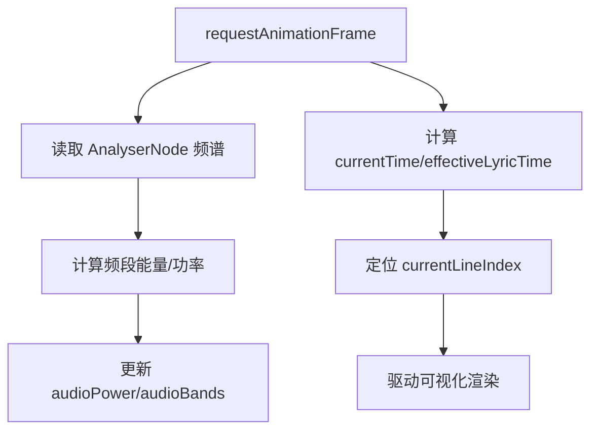
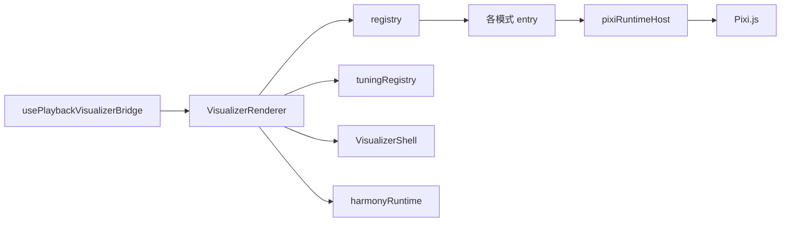

# 渲染架构

<cite>
**本文引用的文件**
- [VisualizerRenderer.tsx](file://src/components/visualizer/VisualizerRenderer.tsx)
- [registry.tsx](file://src/components/visualizer/registry.tsx)
- [definition.ts](file://src/components/visualizer/definition.ts)
- [tuningRegistry.ts](file://src/components/visualizer/tuningRegistry.ts)
- [runtime.ts](file://src/components/visualizer/runtime.ts)
- [pixiRuntimeHost.ts](file://src/components/visualizer/pixiRuntimeHost.ts)
- [loadPixi.ts](file://src/components/visualizer/loadPixi.ts)
- [pixiDisplayResources.ts](file://src/components/visualizer/pixiDisplayResources.ts)
- [harmonyRuntime.ts](file://src/components/visualizer/harmonyRuntime.ts)
- [VisualizerShell.tsx](file://src/components/visualizer/VisualizerShell.tsx)
- [usePlaybackVisualizerBridge.ts](file://src/hooks/usePlaybackVisualizerBridge.ts)
- [package.json](file://package.json)
</cite>

## 目录
1. [简介](#简介)
2. [项目结构](#项目结构)
3. [核心组件](#核心组件)
4. [架构总览](#架构总览)
5. [详细组件分析](#详细组件分析)
6. [依赖关系分析](#依赖关系分析)
7. [性能考量](#性能考量)
8. [故障排查指南](#故障排查指南)
9. [结论](#结论)
10. [附录](#附录)

## 简介
本技术文档聚焦 Folia Player 的可视化渲染架构，围绕 VisualizerRenderer 组件的设计模式与实现原理展开，系统阐述组件注册机制、属性传递系统、生命周期管理；解析 Pixi.js 与 Three.js 的集成方式（含 Canvas/WebGL 渲染优化、GPU 加速与资源管理）；说明可视化运行时环境的关键技术（音频数据流处理、帧率控制、内存管理）；并提供可视化组件开发规范（接口定义、配置选项、事件系统）以及性能监控与调试工具使用指南，帮助开发者理解并优化可视化效果。

## 项目结构
可视化子系统位于 src/components/visualizer，采用“按模式分目录 + 集中注册”的组织方式：
- 每个可视化模式拥有独立目录（如 classic、sonnet、tempera 等），包含 entry.tsx（注册）、tuning.ts（调参适配）、具体渲染实现。
- 公共基础设施集中在顶层：
  - 定义与注册：definition.ts、registry.tsx、tuningRegistry.ts
  - 运行时辅助：runtime.ts、harmonyRuntime.ts
  - Pixi 宿主与资源：pixiRuntimeHost.ts、loadPixi.ts、pixiDisplayResources.ts
  - 外壳与背景：VisualizerShell.tsx、backgrounds/*
- 播放桥接在 hooks/usePlaybackVisualizerBridge.ts，负责音频频谱、时间轴与歌词行索引驱动可视化。

图表来源
- [VisualizerRenderer.tsx:13-27](file://src/components/visualizer/VisualizerRenderer.tsx#L13-L27)
- [registry.tsx:15-53](file://src/components/visualizer/registry.tsx#L15-L53)
- [tuningRegistry.ts:64-72](file://src/components/visualizer/tuningRegistry.ts#L64-L72)
- [pixiRuntimeHost.ts:37-142](file://src/components/visualizer/pixiRuntimeHost.ts#L37-L142)
- [loadPixi.ts:32-35](file://src/components/visualizer/loadPixi.ts#L32-L35)
- [pixiDisplayResources.ts:10-36](file://src/components/visualizer/pixiDisplayResources.ts#L10-L36)

章节来源
- [VisualizerRenderer.tsx:1-47](file://src/components/visualizer/VisualizerRenderer.tsx#L1-L47)
- [registry.tsx:1-106](file://src/components/visualizer/registry.tsx#L1-L106)
- [definition.ts:32-95](file://src/components/visualizer/definition.ts#L32-L95)
- [tuningRegistry.ts:18-99](file://src/components/visualizer/tuningRegistry.ts#L18-L99)
- [pixiRuntimeHost.ts:1-144](file://src/components/visualizer/pixiRuntimeHost.ts#L1-L144)
- [loadPixi.ts:1-37](file://src/components/visualizer/loadPixi.ts#L1-L37)
- [pixiDisplayResources.ts:1-37](file://src/components/visualizer/pixiDisplayResources.ts#L1-L37)
- [VisualizerShell.tsx:11-195](file://src/components/visualizer/VisualizerShell.tsx#L11-L195)
- [usePlaybackVisualizerBridge.ts:55-279](file://src/hooks/usePlaybackVisualizerBridge.ts#L55-L279)

## 核心组件
- VisualizerRenderer：统一入口，负责合并默认背景模式、应用调参、根据模式从注册表获取 render 函数并渲染，同时叠加和声字幕层。
- registry：集中发现与构建可视化模式注册表，支持内置与运行时追加/移除，提供 byMode 查询与排序列表。
- definition：定义共享属性、设置面板、重置接口与注册项契约，确保各模式遵循统一协议。
- tuningRegistry：纯数据驱动的调参适配器集合，将外部设置的调参注入到 props，避免渲染器直接耦合设置存储。
- runtime：歌词行计算与预热窗口工具，提供 active/upcoming/recentCompleted 行与预取策略。
- pixiRuntimeHost：封装 Pixi 运行时的“创建-交换-销毁”生命周期，支持歌曲切换时原地 swap，避免重建 WebGL 上下文导致的闪烁。
- loadPixi：在首次导入 Pixi 前设置全局片段着色器精度为 highp，规避特定平台 mediump 溢出导致的黑边问题。
- pixiDisplayResources：对 Pixi 显示树进行可寻址的卸载与销毁，保证资源及时释放且不影响可回溯性。
- harmonyRuntime：基于当前时间与歌词行生成和声字幕快照，用于顶部字幕层的离散状态渲染。
- VisualizerShell：统一外壳，负责背景层、字体注入、返回按钮与热点区域交互，使渲染器专注歌词布局。
- usePlaybackVisualizerBridge：requestAnimationFrame 循环，读取 AnalyserNode 频谱，计算频段能量与功率，更新 currentTime/currentLineIndex，驱动可视化。

章节来源
- [VisualizerRenderer.tsx:13-42](file://src/components/visualizer/VisualizerRenderer.tsx#L13-L42)
- [registry.tsx:15-106](file://src/components/visualizer/registry.tsx#L15-L106)
- [definition.ts:32-183](file://src/components/visualizer/definition.ts#L32-L183)
- [tuningRegistry.ts:18-99](file://src/components/visualizer/tuningRegistry.ts#L18-L99)
- [runtime.ts:35-158](file://src/components/visualizer/runtime.ts#L35-L158)
- [pixiRuntimeHost.ts:37-142](file://src/components/visualizer/pixiRuntimeHost.ts#L37-L142)
- [loadPixi.ts:32-35](file://src/components/visualizer/loadPixi.ts#L32-L35)
- [pixiDisplayResources.ts:10-36](file://src/components/visualizer/pixiDisplayResources.ts#L10-L36)
- [harmonyRuntime.ts:26-118](file://src/components/visualizer/harmonyRuntime.ts#L26-L118)
- [VisualizerShell.tsx:50-195](file://src/components/visualizer/VisualizerShell.tsx#L50-L195)
- [usePlaybackVisualizerBridge.ts:86-279](file://src/hooks/usePlaybackVisualizerBridge.ts#L86-L279)

## 架构总览
可视化渲染由“播放桥接 → 渲染器 → 模式注册表 → 运行时宿主 → 图形后端”构成闭环。播放桥接以 requestAnimationFrame 驱动，实时采集音频频谱与时间戳，更新 MotionValue 与歌词行索引；渲染器根据模式与调参选择具体渲染器；模式通过注册表动态发现；Pixi 运行时通过宿主统一管理生命周期，支持歌曲切换时的原地替换；资源管理保证显存与纹理池的正确释放。

图表来源
- [usePlaybackVisualizerBridge.ts:86-279](file://src/hooks/usePlaybackVisualizerBridge.ts#L86-L279)
- [VisualizerRenderer.tsx:13-42](file://src/components/visualizer/VisualizerRenderer.tsx#L13-L42)
- [registry.tsx:49-53](file://src/components/visualizer/registry.tsx#L49-L53)
- [pixiRuntimeHost.ts:72-142](file://src/components/visualizer/pixiRuntimeHost.ts#L72-L142)

## 详细组件分析

### VisualizerRenderer 与属性传递系统
- 职责：合并默认背景模式、应用调参、选择模式渲染、叠加和声字幕。
- 属性传递：
  - 接收通用属性（时间、歌词、主题、音频带、字幕相关开关、调参包等）。
  - 通过 applyVisualizerTuning 将调参注入到 props，确保渲染器无需感知设置存储。
  - 通过 registry 的 byMode 查找对应模式的 render 函数并调用。
  - 将 resolvedProps 中必要的字幕参数传递给 VisualizerHarmonyOverlay。

图表来源
- [VisualizerRenderer.tsx:13-42](file://src/components/visualizer/VisualizerRenderer.tsx#L13-L42)
- [tuningRegistry.ts:64-72](file://src/components/visualizer/tuningRegistry.ts#L64-L72)
- [registry.tsx:49-53](file://src/components/visualizer/registry.tsx#L49-L53)

章节来源
- [VisualizerRenderer.tsx:13-42](file://src/components/visualizer/VisualizerRenderer.tsx#L13-L42)
- [definition.ts:32-95](file://src/components/visualizer/definition.ts#L32-L95)
- [tuningRegistry.ts:64-72](file://src/components/visualizer/tuningRegistry.ts#L64-L72)
- [registry.tsx:49-53](file://src/components/visualizer/registry.tsx#L49-L53)

### 组件注册机制（registry 与 entry）
- 自动发现：通过 import.meta.glob 扫描各模式 entry.tsx，构建 entries 与 byMode。
- 去重与排序：检测重复 mode，按 order 排序输出。
- 运行时扩展：appendVisualizerEntry/removeVisualizerEntry 支持 mod 动态贡献与移除，避免重建。
- 默认回退：getVisualizerRegistryEntry 在无匹配时回退到默认模式。

图表来源
- [registry.tsx:15-106](file://src/components/visualizer/registry.tsx#L15-L106)
- [definition.ts:165-183](file://src/components/visualizer/definition.ts#L165-L183)

章节来源
- [registry.tsx:15-106](file://src/components/visualizer/registry.tsx#L15-L106)
- [definition.ts:165-183](file://src/components/visualizer/definition.ts#L165-L183)

### 调参系统（tuningRegistry）
- 纯数据映射：每种模式提供 adapter.apply(props, tuning)，将设置值转换为渲染所需属性。
- 收集与注入：collectVisualizerTunings 从设置对象提取 bundle；applyVisualizerTuningsToSettings 反向写入 UI 草稿。
- 解耦：渲染器不直接访问设置存储，仅消费 props。

图表来源
- [tuningRegistry.ts:76-99](file://src/components/visualizer/tuningRegistry.ts#L76-L99)
- [tuningRegistry.ts:64-72](file://src/components/visualizer/tuningRegistry.ts#L64-L72)

章节来源
- [tuningRegistry.ts:18-99](file://src/components/visualizer/tuningRegistry.ts#L18-L99)

### 运行时辅助（runtime 与 harmonyRuntime）
- runtime：
  - 计算最近已完成行、下一行、未来 N 行，支持预热窗口（lead time）提前准备。
  - prepareActiveAndUpcoming 统一主动行与即将行的预处理流程。
- harmonyRuntime：
  - 根据当前时间生成和声字幕快照，将歌词词元按等待/活跃/已过/静态分类，便于上层高效渲染。

图表来源
- [runtime.ts:35-158](file://src/components/visualizer/runtime.ts#L35-L158)
- [harmonyRuntime.ts:50-118](file://src/components/visualizer/harmonyRuntime.ts#L50-L118)

章节来源
- [runtime.ts:35-158](file://src/components/visualizer/runtime.ts#L35-L158)
- [harmonyRuntime.ts:26-118](file://src/components/visualizer/harmonyRuntime.ts#L26-L118)

### Pixi 集成与生命周期（pixiRuntimeHost、loadPixi、pixiDisplayResources）
- 生命周期：
  - create：异步创建运行时（可能加载资源/编译着色器），成功后缓存 runtimeRef。
  - swap：歌曲切换时原地替换，避免重建 WebGL 上下文导致画面空洞。
  - destroy：组件卸载或重建时清理。
- 并发与竞态：
  - drainSong 串行化歌曲切换，丢弃过时请求，失败时保留上一首画面。
  - AbortSignal 取消过期任务。
- 精度与兼容性：
  - loadPixi 在首次导入 Pixi 前设置 preferredFragmentPrecision=highp，避免 NVIDIA Linux 下 mediump 溢出导致的黑三角。
- 资源管理：
  - unloadPixiDisplayTree 递归卸载显示节点，setPixiDisplayTreeVisibility 在不可见时触发卸载，destroyPixiContainerChildren 安全销毁容器子树。

图表来源
- [pixiRuntimeHost.ts:37-142](file://src/components/visualizer/pixiRuntimeHost.ts#L37-L142)
- [loadPixi.ts:32-35](file://src/components/visualizer/loadPixi.ts#L32-L35)
- [pixiDisplayResources.ts:10-36](file://src/components/visualizer/pixiDisplayResources.ts#L10-L36)

章节来源
- [pixiRuntimeHost.ts:37-142](file://src/components/visualizer/pixiRuntimeHost.ts#L37-L142)
- [loadPixi.ts:32-35](file://src/components/visualizer/loadPixi.ts#L32-L35)
- [pixiDisplayResources.ts:10-36](file://src/components/visualizer/pixiDisplayResources.ts#L10-L36)

### 播放桥接与帧率控制（usePlaybackVisualizerBridge）
- 帧循环：使用 requestAnimationFrame 驱动，保证与屏幕刷新同步。
- 音频数据流：
  - 从 AnalyserNode 读取频率域数据，划分频段（bass/lowMid/mid/vocal/treble）并计算能量，归一化后写入 MotionValue。
  - 无信号时提供“呼吸”动画，保持视觉连贯。
- 时间轴与歌词：
  - 根据实际播放源（nowPlaying/playerCap/stage lyrics）计算 effectiveLyricTime，定位当前歌词行索引。
  - 支持循环模式与阶段式时钟同步。

图表来源
- [usePlaybackVisualizerBridge.ts:86-279](file://src/hooks/usePlaybackVisualizerBridge.ts#L86-L279)

章节来源
- [usePlaybackVisualizerBridge.ts:86-279](file://src/hooks/usePlaybackVisualizerBridge.ts#L86-L279)

### 外壳与背景（VisualizerShell）
- 统一外壳：注入字体、透明度、背景层、返回按钮与热点区域交互。
- 背景渲染：委托给 VisualizerBackgroundRenderer，支持静态/动态模式与暂停状态。
- 交互：仅在靠近角落时显示返回按钮，触控引导提示右下角热点。

章节来源
- [VisualizerShell.tsx:50-195](file://src/components/visualizer/VisualizerShell.tsx#L50-L195)

## 依赖关系分析
- 运行时依赖：
  - Pixi.js：用于高性能 2D/3D 混合渲染（WebGL2/WebGPU），通过 loadPixi 统一精度设置。
  - Three.js：作为项目依赖存在（package.json），可用于 3D 场景扩展（当前可视化主路径以 Pixi 为主）。
- 模块耦合：
  - VisualizerRenderer 依赖 registry 与 tuningRegistry，低耦合于具体模式。
  - pixiRuntimeHost 抽象了 Pixi 生命周期，模式只需实现 create/swap/destroy。
  - 播放桥接与可视化通过 MotionValue 与共享属性解耦。

图表来源
- [usePlaybackVisualizerBridge.ts:86-279](file://src/hooks/usePlaybackVisualizerBridge.ts#L86-L279)
- [VisualizerRenderer.tsx:13-42](file://src/components/visualizer/VisualizerRenderer.tsx#L13-L42)
- [registry.tsx:15-106](file://src/components/visualizer/registry.tsx#L15-L106)
- [tuningRegistry.ts:64-99](file://src/components/visualizer/tuningRegistry.ts#L64-L99)
- [pixiRuntimeHost.ts:37-142](file://src/components/visualizer/pixiRuntimeHost.ts#L37-L142)
- [package.json:216-217](file://package.json#L216-L217)

章节来源
- [package.json:216-217](file://package.json#L216-L217)
- [usePlaybackVisualizerBridge.ts:86-279](file://src/hooks/usePlaybackVisualizerBridge.ts#L86-L279)
- [VisualizerRenderer.tsx:13-42](file://src/components/visualizer/VisualizerRenderer.tsx#L13-L42)
- [registry.tsx:15-106](file://src/components/visualizer/registry.tsx#L15-L106)
- [tuningRegistry.ts:64-99](file://src/components/visualizer/tuningRegistry.ts#L64-L99)
- [pixiRuntimeHost.ts:37-142](file://src/components/visualizer/pixiRuntimeHost.ts#L37-L142)

## 性能考量
- 帧率控制：
  - 使用 requestAnimationFrame 保证与显示器刷新同步，避免掉帧与撕裂。
  - 播放桥接在过渡期（automix blend）仍维持可见信号，防止卡顿。
- GPU 加速与精度：
  - Pixi 默认片段精度提升为 highp，避免 NVIDIA Linux 下 mediump 溢出导致的黑边。
  - 合理使用纹理池与场景复用，减少重建成本。
- 资源管理：
  - 显示树不可见时触发卸载，避免显存泄漏。
  - 歌曲切换通过 swap 原地替换，避免销毁重建带来的画面空洞。
- 内存与 CPU：
  - 歌词行预热窗口减少突发计算。
  - 频段能量计算采用简单累加与幂次校正，开销可控。
- 建议：
  - 大纹理按需加载与压缩，避免一次性加载全部资源。
  - 复杂滤镜链考虑降采样或延迟执行。
  - 使用性能埋点统计 create/swap/destroy 耗时与帧耗时。

[本节为通用指导，不直接分析具体文件]

## 故障排查指南
- 初始化失败：
  - 现象：模式无法渲染，控制台报错。
  - 排查：检查 pixiRuntimeHost 的 onFailedChange 回调是否被触发；确认 loadPixi 已正确设置精度。
- 歌曲切换卡顿/黑屏：
  - 现象：切歌时画面短暂空白或长时间闪烁。
  - 排查：确认 swap 是否成功；检查 drainSong 是否被中断；验证资源释放是否正确。
- 黑三角/黑边：
  - 现象：Linux+NVIDIA 出现对角黑三角。
  - 排查：确认已在首次导入 Pixi 前设置 highp；检查自定义着色器是否覆盖精度声明。
- 资源泄漏：
  - 现象：长时间使用后内存增长。
  - 排查：检查 setPixiDisplayTreeVisibility 与 destroyPixiContainerChildren 是否被调用；确认 unload 逻辑完整。
- 音频无响应：
  - 现象：频谱不变，视觉效果静止。
  - 排查：确认 AnalyserNode 可用；检查 isTransitionAudible 与播放状态分支；核对频段计算逻辑。

章节来源
- [pixiRuntimeHost.ts:87-124](file://src/components/visualizer/pixiRuntimeHost.ts#L87-L124)
- [loadPixi.ts:32-35](file://src/components/visualizer/loadPixi.ts#L32-L35)
- [pixiDisplayResources.ts:10-36](file://src/components/visualizer/pixiDisplayResources.ts#L10-L36)
- [usePlaybackVisualizerBridge.ts:96-140](file://src/hooks/usePlaybackVisualizerBridge.ts#L96-L140)

## 结论
Folia Player 的可视化渲染架构通过清晰的职责分离与模块化设计，实现了高可扩展性与高性能：
- 渲染器与模式解耦，注册表与调参系统提供统一的扩展点。
- Pixi 运行时宿主保障生命周期稳定与资源高效管理。
- 播放桥接以 requestAnimationFrame 驱动，结合歌词行预热与和声字幕快照，保证流畅体验。
- 针对多平台的精度与兼容性问题提供了稳健方案。
建议在新增模式时严格遵循接口契约，合理拆分资源与计算，充分利用预热与原地替换机制，以获得最佳性能与稳定性。

[本节为总结性内容，不直接分析具体文件]

## 附录

### 可视化组件开发规范
- 接口定义：
  - 遵循 VisualizerSharedProps 提供的属性集，包括时间、歌词、主题、音频带、字幕开关、调参等。
  - 如需设置面板，实现 renderSettingsPanel 与 resetSettings。
- 配置选项：
  - 通过 tuning.ts 暴露可调参数，并在 apply 中映射到渲染所需属性。
  - 使用 previewSeed 与 previewStartOffset 控制预览行为。
- 事件系统：
  - 通过 props 回调（如 onBack、onLyricLineSeek、onPlayerPanelGuideHotspotChange）与父组件交互。
  - 使用 MotionValue 驱动动画，避免频繁 setState。
- 生命周期：
  - 若使用 Pixi，实现 create/swap/destroy，并通过 pixiRuntimeHost 管理。
  - 使用 pixiDisplayResources 管理显示树资源，确保不可见时卸载。
- 性能：
  - 避免每帧重建场景；使用纹理池与几何复用。
  - 利用预热窗口与批量更新减少抖动。

章节来源
- [definition.ts:32-183](file://src/components/visualizer/definition.ts#L32-L183)
- [tuningRegistry.ts:18-99](file://src/components/visualizer/tuningRegistry.ts#L18-L99)
- [pixiRuntimeHost.ts:37-142](file://src/components/visualizer/pixiRuntimeHost.ts#L37-L142)
- [pixiDisplayResources.ts:10-36](file://src/components/visualizer/pixiDisplayResources.ts#L10-L36)

### 性能监控与调试工具
- 监控指标：
  - 帧耗时、create/swap/destroy 耗时、纹理数量、GPU 内存占用。
  - 音频频段能量范围与峰值，避免饱和。
- 调试方法：
  - 在 pixiRuntimeHost 中添加日志，记录切换耗时与错误堆栈。
  - 在播放桥接中打印有效时间、当前行索引与频谱范围。
  - 使用浏览器性能面板录制关键帧，定位瓶颈。
- 常见问题定位：
  - 黑三角/黑边：检查精度设置与着色器。
  - 资源泄漏：检查卸载与销毁路径。
  - 卡顿：检查是否每帧重建场景或加载大量资源。

章节来源
- [pixiRuntimeHost.ts:87-124](file://src/components/visualizer/pixiRuntimeHost.ts#L87-L124)
- [usePlaybackVisualizerBridge.ts:96-140](file://src/hooks/usePlaybackVisualizerBridge.ts#L96-L140)
- [loadPixi.ts:32-35](file://src/components/visualizer/loadPixi.ts#L32-L35)