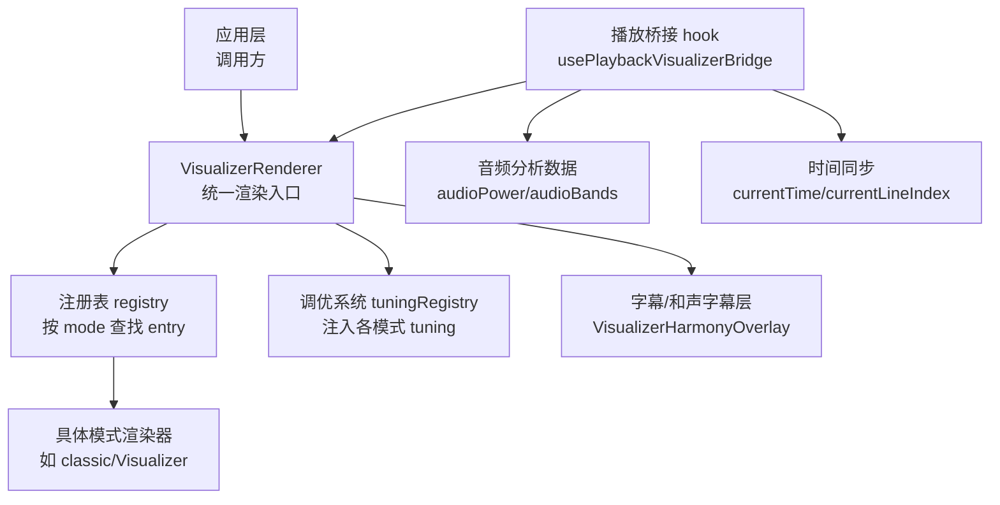
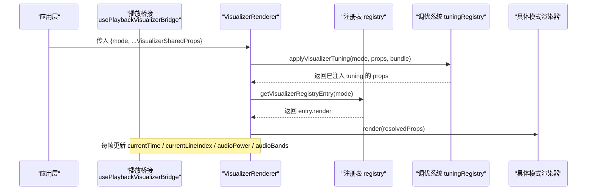
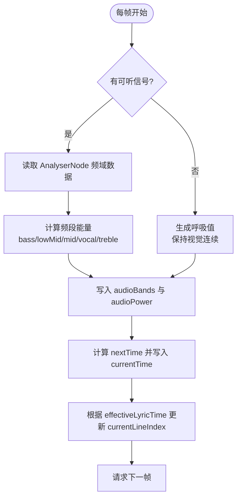
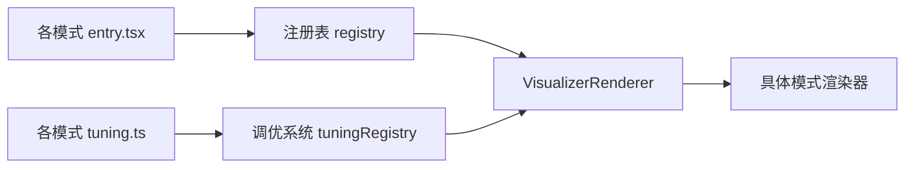

# 可视化开发规范与接口

<cite>
**本文引用的文件**
- [definition.ts](file://src/components/visualizer/definition.ts)
- [registry.tsx](file://src/components/visualizer/registry.tsx)
- [tuningRegistry.ts](file://src/components/visualizer/tuningRegistry.ts)
- [runtime.ts](file://src/components/visualizer/runtime.ts)
- [VisualizerRenderer.tsx](file://src/components/visualizer/VisualizerRenderer.tsx)
- [classic/entry.tsx](file://src/components/visualizer/classic/entry.tsx)
- [classic/tuning.ts](file://src/components/visualizer/classic/tuning.ts)
- [usePlaybackVisualizerBridge.ts](file://src/hooks/usePlaybackVisualizerBridge.ts)
</cite>

## 目录
1. [简介](#简介)
2. [项目结构](#项目结构)
3. [核心组件](#核心组件)
4. [架构总览](#架构总览)
5. [详细组件分析](#详细组件分析)
6. [依赖关系分析](#依赖关系分析)
7. [性能考量](#性能考量)
8. [故障排查指南](#故障排查指南)
9. [结论](#结论)
10. [附录](#附录)

## 简介
本文件面向希望为播放器实现自定义可视化模式的开发者，系统化说明可视化系统的类型契约、注册机制、调优系统、渲染管线以及与播放系统的集成方式。重点覆盖：
- VisualizerSharedProps 接口的全部属性含义与使用建议（音频数据、主题配置、歌词显示等）
- VisualizerRegistryEntry 注册结构的字段要求（模式定义、渲染函数、设置面板等）
- VisualizerTuningKind 类型系统与内置可视化类型的调优参数组织方式
- 组件生命周期最佳实践（初始化、更新、销毁）
- TypeScript 类型使用示例与约束
- 与播放系统的集成要点（时间同步、音频分析数据获取）

## 项目结构
可视化子系统位于 src/components/visualizer 下，采用“按模式分目录 + 集中注册”的组织方式：
- 每个可视化模式拥有独立的 entry.tsx 用于注册
- 统一的类型与运行时工具集中在 definition.ts、runtime.ts、tuningRegistry.ts
- 渲染入口由 VisualizerRenderer.tsx 统一调度，并叠加字幕/和声字幕层
- 播放桥接在 hooks/usePlaybackVisualizerBridge.ts 中完成音频分析与时间同步

图表来源
- [VisualizerRenderer.tsx:13-43](file://src/components/visualizer/VisualizerRenderer.tsx#L13-L43)
- [registry.tsx:18-43](file://src/components/visualizer/registry.tsx#L18-L43)
- [tuningRegistry.ts:64-72](file://src/components/visualizer/tuningRegistry.ts#L64-L72)
- [usePlaybackVisualizerBridge.ts:86-140](file://src/hooks/usePlaybackVisualizerBridge.ts#L86-L140)

章节来源
- [VisualizerRenderer.tsx:1-47](file://src/components/visualizer/VisualizerRenderer.tsx#L1-L47)
- [registry.tsx:1-106](file://src/components/visualizer/registry.tsx#L1-L106)
- [tuningRegistry.ts:1-99](file://src/components/visualizer/tuningRegistry.ts#L1-L99)
- [usePlaybackVisualizerBridge.ts:1-279](file://src/hooks/usePlaybackVisualizerBridge.ts#L1-L279)

## 核心组件
本节聚焦可视化子系统的核心类型与模块职责：
- VisualizerSharedProps：所有可视化渲染器共享的输入属性，包含时间、歌词、主题、音频数据、字幕控制、背景配置、各模式调优参数等
- VisualizerRegistryEntry：可视化模式注册项，声明模式标识、排序、预览种子、调优种类、渲染函数以及可选的设置面板与重置逻辑
- VisualizerTuningKind：可视化调优种类的联合类型，限定支持的内置模式族
- VisualizerTuningBundle/Adapter：将不同模式的调优数据以纯数据结构形式传递，并通过适配器在渲染边界注入到 props
- VisualizerRenderer：统一渲染入口，负责应用调优、选择背景默认模式、调用具体渲染器并叠加字幕层
- usePlaybackVisualizerBridge：每帧驱动音频分析与时间同步，产出 MotionValue 形式的 audioPower/audioBands/currentTime/currentLineIndex

章节来源
- [definition.ts:32-95](file://src/components/visualizer/definition.ts#L32-L95)
- [definition.ts:165-183](file://src/components/visualizer/definition.ts#L165-L183)
- [tuningRegistry.ts:20-43](file://src/components/visualizer/tuningRegistry.ts#L20-L43)
- [VisualizerRenderer.tsx:13-43](file://src/components/visualizer/VisualizerRenderer.tsx#L13-L43)
- [usePlaybackVisualizerBridge.ts:86-140](file://src/hooks/usePlaybackVisualizerBridge.ts#L86-L140)

## 架构总览
可视化渲染流程从应用层传入 mode 与共享 props，经注册表解析出对应渲染器，并在渲染前通过调优系统注入该模式的 tuning 数据；同时，播放桥接在 requestAnimationFrame 循环中持续更新 currentTime、currentLineIndex 与音频分析数据，供渲染器消费。

图表来源
- [VisualizerRenderer.tsx:17-27](file://src/components/visualizer/VisualizerRenderer.tsx#L17-L27)
- [registry.tsx:52-53](file://src/components/visualizer/registry.tsx#L52-L53)
- [tuningRegistry.ts:64-72](file://src/components/visualizer/tuningRegistry.ts#L64-L72)
- [usePlaybackVisualizerBridge.ts:86-140](file://src/hooks/usePlaybackVisualizerBridge.ts#L86-L140)

## 详细组件分析

### VisualizerSharedProps 属性详解
- 时间与歌词
  - currentTime: 当前播放时间（MotionValue<number>），由播放桥接每帧更新
  - currentLineIndex: 当前歌词行索引，用于高亮或定位
  - lines: 歌词行数组，供渲染器布局与动画
  - showText: 是否显示文本（歌词/标题等）
  - subtitleContentMode: 字幕内容模式（如原文/翻译/双语等）
  - hideTranslationSubtitle/showSubtitleTranslation: 控制翻译字幕显示
- 主题与外观
  - theme/subtitleTheme: 主/副主题对象，提供颜色、字体等
  - isDaylight: 日间模式标志，影响配色策略
  - visualizerOpacity/backgroundStaticMode/staticMode: 透明度与静态模式开关
  - background: 背景配置（含模式与参数）
  - lyricsFontScale/subtitleFontScale/subtitleOverlayOpacity/harmonySubtitleBackground: 字体缩放与字幕叠加样式
- 音频数据
  - audioPower: 整体音频能量（MotionValue<number>），常用于驱动缩放/发光等
  - audioBands: 频段数据（bass/lowMid/mid/vocal/treble/spectrum），用于频谱或均衡可视化
- 歌曲元信息与媒体资源
  - songTitle/songArtist/songAlbum/coverUrl: 当前曲目信息
  - temperaLayerImageAssets: 特定场景下的内联图片资源（OBS 上下文隔离时使用）
- 调优参数
  - visualizerTunings: 全局调优包，按模式键名注入对应 tuning
  - 各模式专属 tuning 及变更回调（如 classicTuning/cappellaTuning/monetTuning 等）
- 交互与状态
  - paused: 暂停状态
  - onBack/onLyricLineSeek: 导航与歌词跳转回调
  - isPreviewMode/isPlayerChromeHidden/alwaysShowBackButton: 预览与 UI chrome 控制
  - onPlayerPanelGuideHotspotChange: 面板引导热点变化通知
  - seed: 随机种子，保证预览一致性
  - isPanelOpen: 设置面板打开状态

章节来源
- [definition.ts:32-95](file://src/components/visualizer/definition.ts#L32-L95)

### VisualizerRegistryEntry 注册结构
- 必需字段
  - mode: 可视化模式标识（字符串枚举）
  - order: 排序权重，决定在列表中的位置
  - labelKey/labelFallback: 国际化标签键与回退文本
  - previewSeed/previewStartOffset: 预览用的随机种子与起始偏移
  - tuningKind: 调优种类，映射到 VisualizerTuningKind
  - render: 渲染函数，接收 VisualizerSharedProps 并返回 ReactElement
- 可选字段
  - renderSettingsPanel: 设置面板渲染函数，接收 VisualizerSettingsPanelProps
  - resetSettings: 重置设置回调，接收 VisualizerSettingsResetProps

示例参考
- 经典模式的 entry 展示了最小可用注册结构，包括 mode、order、labelKey、previewSeed、previewStartOffset、tuningKind、render、renderSettingsPanel、resetSettings

章节来源
- [definition.ts:165-183](file://src/components/visualizer/definition.ts#L165-L183)
- [classic/entry.tsx:8-21](file://src/components/visualizer/classic/entry.tsx#L8-L21)

### VisualizerTuningKind 类型系统与调优注入
- 类型系统
  - VisualizerTuningKind 是支持的调优种类联合类型，涵盖 none、classic、cadenza、partita、fume、claddagh、cappella、tilt、monet、diorama、pendolo、sonnet、tempera
- 调优适配与注入
  - VisualizerTuningMap 将每种模式映射到其 tuning 类型
  - VisualizerTuningAdapter 提供 settingsKey/settingsSetterKey/apply，用于从设置中收集与回写 tuning
  - applyVisualizerTuning 根据 mode 查找对应 adapter，并将 tuning 注入到 props 中
  - collectVisualizerTunings/applyVisualizerTuningsToSettings 支持设置与运行时双向同步

章节来源
- [definition.ts:30-30](file://src/components/visualizer/definition.ts#L30-L30)
- [tuningRegistry.ts:20-43](file://src/components/visualizer/tuningRegistry.ts#L20-L43)
- [tuningRegistry.ts:64-99](file://src/components/visualizer/tuningRegistry.ts#L64-L99)
- [classic/tuning.ts:1-5](file://src/components/visualizer/classic/tuning.ts#L1-L5)

### 组件生命周期管理指南
- 初始化
  - 在父组件中准备 VisualizerSharedProps，确保 currentTime/currentLineIndex/audioPower/audioBands 等 MotionValue 已创建
  - 通过 VisualizerRenderer 传入 mode 与 props，内部会应用调优并选择背景默认模式
- 更新
  - 播放桥接在 requestAnimationFrame 中更新 currentTime/currentLineIndex 与音频数据，触发重渲染
  - 若切换模式或主题，应重新计算相关 props（如 theme/subtitleTheme/background）
- 销毁
  - 当组件卸载时，播放桥接会在 effect 清理中取消 requestAnimationFrame，避免内存泄漏
  - 对于外部资源（如图片、字体、Canvas/WebGL 资源），应在卸载阶段释放

章节来源
- [VisualizerRenderer.tsx:17-27](file://src/components/visualizer/VisualizerRenderer.tsx#L17-L27)
- [usePlaybackVisualizerBridge.ts:270-277](file://src/hooks/usePlaybackVisualizerBridge.ts#L270-L277)

### TypeScript 类型使用示例（路径指引）
- 注册自定义可视化模式
  - 参考路径：[classic/entry.tsx:8-21](file://src/components/visualizer/classic/entry.tsx#L8-L21)
  - 需导出 defineVisualizer({...}) 并满足 VisualizerRegistryEntry 约束
- 声明并注入调优
  - 参考路径：[classic/tuning.ts:1-5](file://src/components/visualizer/classic/tuning.ts#L1-L5)
  - 使用 defineVisualizerTuning 声明 adapter，并在 apply 中将 tuning 注入 props
- 消费共享属性
  - 参考路径：[definition.ts:32-95](file://src/components/visualizer/definition.ts#L32-L95)
  - 在渲染器中读取 currentTime/audioBands/theme/lines 等属性进行绘制

章节来源
- [classic/entry.tsx:8-21](file://src/components/visualizer/classic/entry.tsx#L8-L21)
- [classic/tuning.ts:1-5](file://src/components/visualizer/classic/tuning.ts#L1-L5)
- [definition.ts:32-95](file://src/components/visualizer/definition.ts#L32-L95)

### 与播放系统的集成（时间同步与音频分析）
- 时间同步
  - 播放桥接根据实际音频元素或舞台时钟计算 nextTime，并写入 currentTime/currentLineIndex
  - 支持多上下文：主播放、NowPlaying 舞台、PlayerCap、歌词舞台等
  - 处理循环与结束：到达末尾时根据 loop 模式决定是否复位或暂停
- 音频分析数据
  - 通过 AnalyserNode 获取频率数据，计算 bass/lowMid/mid/vocal/treble 能量并写入 audioBands
  - 聚合低频能量作为 audioPower，无信号时提供呼吸动画值以保持视觉连续性
- 歌词同步
  - 基于 effectiveLyricTime（考虑歌词时间偏移）查找最新活跃歌词行并更新 currentLineIndex

图表来源
- [usePlaybackVisualizerBridge.ts:86-140](file://src/hooks/usePlaybackVisualizerBridge.ts#L86-L140)
- [usePlaybackVisualizerBridge.ts:142-237](file://src/hooks/usePlaybackVisualizerBridge.ts#L142-L237)

章节来源
- [usePlaybackVisualizerBridge.ts:86-237](file://src/hooks/usePlaybackVisualizerBridge.ts#L86-L237)

## 依赖关系分析
- 注册表依赖
  - 通过 import.meta.glob 自动发现各模式的 entry.tsx，构建有序列表与 byMode 映射
  - 提供 hasVisualizerMode/getVisualizerRegistryEntry/getVisualizerModeLabel 等查询方法
  - 支持运行时追加/移除条目（供 mod 系统贡献）
- 调优系统依赖
  - 通过 import.meta.glob 自动发现各模式的 tuning.ts，构建适配器集合
  - 提供 applyVisualizerTuning/collectVisualizerTunings/applyVisualizerTuningsToSettings 等工具
- 渲染器依赖
  - VisualizerRenderer 依赖注册表与调优系统，负责组合 resolvedProps 并调用具体渲染器
  - 同时叠加字幕/和声字幕层，统一处理字幕显示逻辑

图表来源
- [registry.tsx:16-43](file://src/components/visualizer/registry.tsx#L16-L43)
- [tuningRegistry.ts:53-72](file://src/components/visualizer/tuningRegistry.ts#L53-L72)
- [VisualizerRenderer.tsx:17-27](file://src/components/visualizer/VisualizerRenderer.tsx#L17-L27)

章节来源
- [registry.tsx:16-106](file://src/components/visualizer/registry.tsx#L16-L106)
- [tuningRegistry.ts:53-99](file://src/components/visualizer/tuningRegistry.ts#L53-L99)
- [VisualizerRenderer.tsx:13-43](file://src/components/visualizer/VisualizerRenderer.tsx#L13-L43)

## 性能考量
- 每帧更新
  - 播放桥接使用 requestAnimationFrame，避免阻塞 UI；注意在组件卸载时清理
  - 音频分析仅在存在可听信号时执行，减少无效计算
- 数据传递
  - 使用 MotionValue 传递高频更新的数值（currentTime/audioPower/audioBands），降低 React 重渲染成本
- 预取与预热
  - runtime.ts 提供 shouldPreheatLine 与 prepareActiveAndUpcoming，帮助渲染器提前准备下一行数据，提升流畅度
- 资源管理
  - 背景与图片资源按需加载，OBS 场景下通过 temperaLayerImageAssets 避免跨上下文存储访问

章节来源
- [usePlaybackVisualizerBridge.ts:270-277](file://src/hooks/usePlaybackVisualizerBridge.ts#L270-L277)
- [runtime.ts:90-120](file://src/components/visualizer/runtime.ts#L90-L120)

## 故障排查指南
- 重复模式注册
  - 现象：启动时报错提示重复模式
  - 原因：多个 entry 声明了相同的 mode
  - 解决：检查各 entry.tsx 的 mode 字段唯一性
- 缺少默认导出
  - 现象：报错提示缺失 default export
  - 原因：entry.tsx 未正确导出 defineVisualizer(...)
  - 解决：确保默认导出完整
- 调优未生效
  - 现象：设置面板修改后无效果
  - 原因：未正确声明 settingsKey/settingsSetterKey 或未在 apply 中注入 props
  - 解决：核对 tuning.ts 的 adapter 配置与 apply 逻辑
- 时间不同步
  - 现象：歌词与画面不同步
  - 原因：lyricTimelineOffsetMs 未正确设置或歌词时间计算异常
  - 解决：检查播放桥接中的 effectiveLyricTime 计算与 lyricCurrentTime 写入

章节来源
- [registry.tsx:18-33](file://src/components/visualizer/registry.tsx#L18-L33)
- [tuningRegistry.ts:76-99](file://src/components/visualizer/tuningRegistry.ts#L76-L99)
- [usePlaybackVisualizerBridge.ts:142-148](file://src/hooks/usePlaybackVisualizerBridge.ts#L142-L148)

## 结论
本规范明确了可视化子系统的类型契约、注册机制、调优系统与渲染管线，提供了与播放系统集成的关键路径与最佳实践。遵循上述约定可实现稳定、高性能且易扩展的自定义可视化模式。

## 附录
- 快速上手清单
  - 新建模式目录并添加 entry.tsx，使用 defineVisualizer 注册
  - 如需调优，新增 tuning.ts 并使用 defineVisualizerTuning 声明适配器
  - 在渲染器中消费 VisualizerSharedProps，结合 currentTime/audioBands/theme/lines 进行绘制
  - 通过 VisualizerRenderer 挂载到应用层，并确保播放桥接正常工作
- 常用路径参考
  - 注册入口：[classic/entry.tsx:8-21](file://src/components/visualizer/classic/entry.tsx#L8-L21)
  - 调优适配器：[classic/tuning.ts:1-5](file://src/components/visualizer/classic/tuning.ts#L1-L5)
  - 共享属性定义：[definition.ts:32-95](file://src/components/visualizer/definition.ts#L32-L95)
  - 渲染入口：[VisualizerRenderer.tsx:13-43](file://src/components/visualizer/VisualizerRenderer.tsx#L13-L43)
  - 播放桥接：[usePlaybackVisualizerBridge.ts:86-237](file://src/hooks/usePlaybackVisualizerBridge.ts#L86-L237)