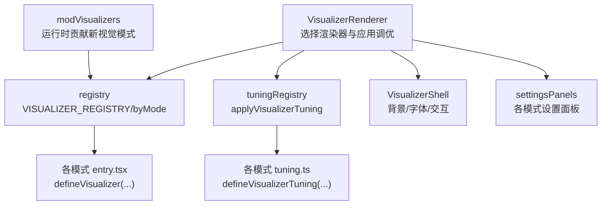
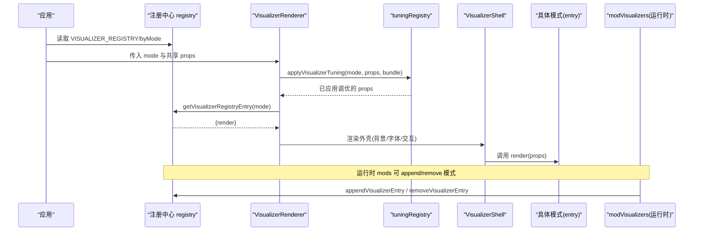
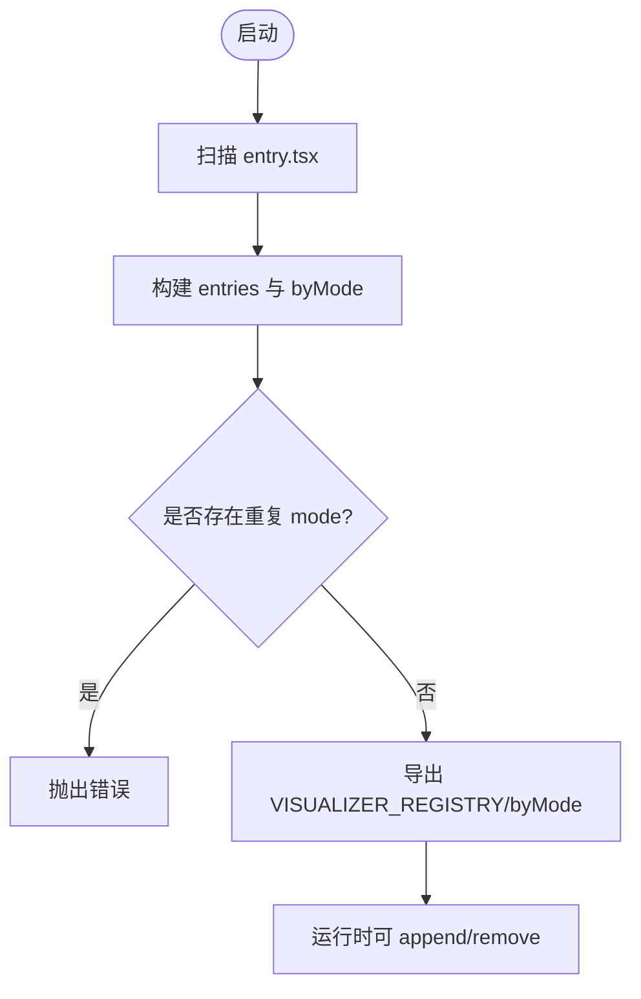
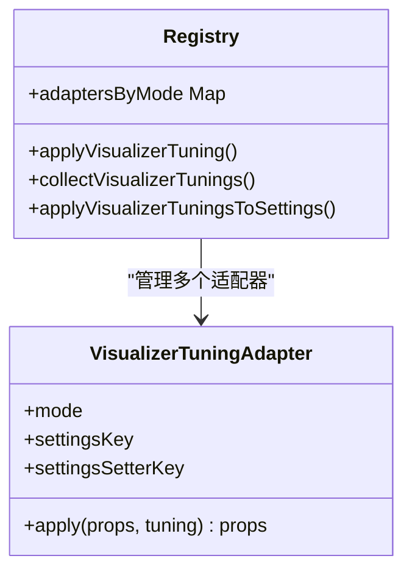
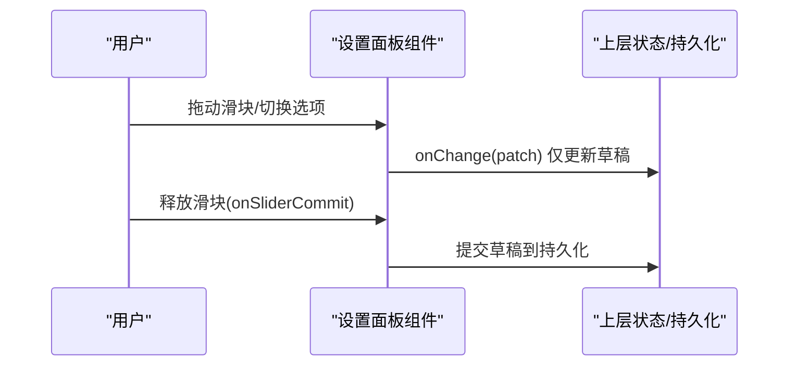
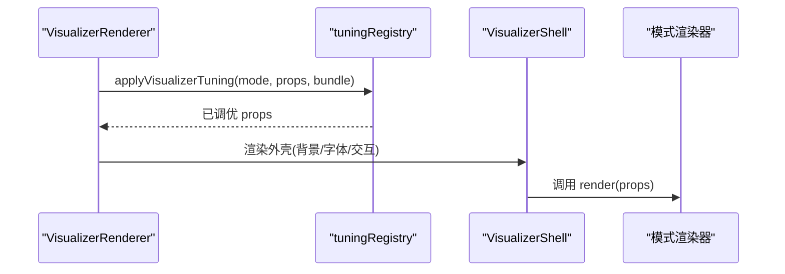
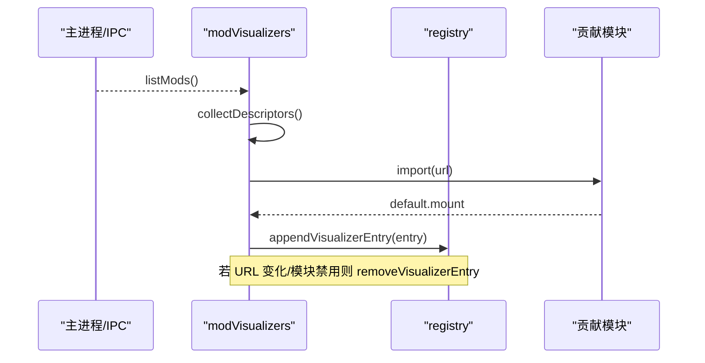
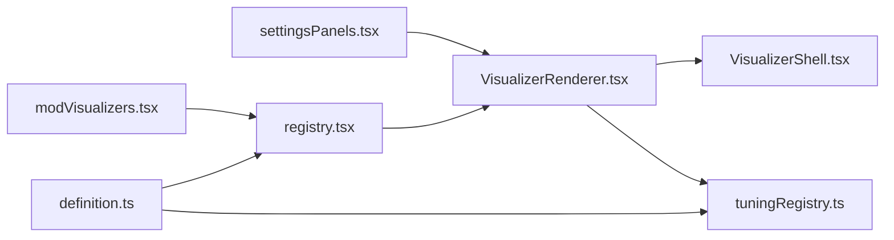

# 可视化注册与配置系统

<cite>
**本文引用的文件**
- [src/components/visualizer/definition.ts](file://src/components/visualizer/definition.ts)
- [src/components/visualizer/registry.tsx](file://src/components/visualizer/registry.tsx)
- [src/components/visualizer/tuningRegistry.ts](file://src/components/visualizer/tuningRegistry.ts)
- [src/components/visualizer/settingsPanels.tsx](file://src/components/visualizer/settingsPanels.tsx)
- [src/components/visualizer/VisualizerRenderer.tsx](file://src/components/visualizer/VisualizerRenderer.tsx)
- [src/components/visualizer/VisualizerShell.tsx](file://src/components/visualizer/VisualizerShell.tsx)
- [src/components/visualizer/runtime.ts](file://src/components/visualizer/runtime.ts)
- [src/components/visualizer/classic/entry.tsx](file://src/components/visualizer/classic/entry.tsx)
- [src/components/visualizer/classic/tuning.ts](file://src/components/visualizer/classic/tuning.ts)
- [src/components/visualizer/diorama/entry.tsx](file://src/components/visualizer/diorama/entry.tsx)
- [src/components/visualizer/monet/entry.tsx](file://src/components/visualizer/monet/entry.tsx)
- [src/components/visualizer/sonnet/entry.tsx](file://src/components/visualizer/sonnet/entry.tsx)
- [src/mods/modVisualizers.tsx](file://src/mods/modVisualizers.tsx)
</cite>

## 目录
1. [简介](#简介)
2. [项目结构](#项目结构)
3. [核心组件](#核心组件)
4. [架构总览](#架构总览)
5. [详细组件分析](#详细组件分析)
6. [依赖关系分析](#依赖关系分析)
7. [性能考量](#性能考量)
8. [故障排查指南](#故障排查指南)
9. [结论](#结论)
10. [附录：完整注册示例与最佳实践](#附录完整注册示例与最佳实践)

## 简介
本文件系统性地梳理可视化注册与配置体系，覆盖以下关键主题：
- 可视化组件的注册机制：通过 defineVisualizer 声明模式、渲染器与设置面板；由构建期自动发现并集中装配。
- 动态加载与扩展：支持插件（mods）在运行时贡献新的可视化模式，无需重新构建应用。
- 调优注册表 tuningRegistry：以纯数据适配器形式将“参数绑定、实时更新、配置持久化”解耦到各模式。
- 设置面板系统 settingsPanels：统一的 UI 组件生成、事件处理、状态管理与重置能力。
- 集成点：与主题系统、用户偏好、OBS 透明导出等场景的协作方式。
- 调试与测试：如何验证注册流程、动态加载与设置变更链路。

## 项目结构
可视化子系统位于 src/components/visualizer，采用“按模式分目录 + 统一注册中心”的组织方式：
- 每个可视化模式拥有 entry.tsx（注册）、tuning.ts（可选，参数适配）、以及具体实现。
- registry.tsx 负责扫描所有 entry.tsx 并构建全局注册表。
- tuningRegistry.ts 提供 defineVisualizerTuning 与 apply/collect/applyToSettings 等工具。
- settingsPanels.tsx 提供各模式的设置面板组件。
- VisualizerRenderer.tsx 是渲染入口，负责注入背景默认值、应用调优、选择渲染器。
- VisualizerShell.tsx 提供通用外壳（背景层、字体、返回按钮、交互热区）。
- runtime.ts 提供歌词行计算、预热窗口等通用运行时辅助。

图表来源
- [src/components/visualizer/VisualizerRenderer.tsx:13-27](file://src/components/visualizer/VisualizerRenderer.tsx#L13-L27)
- [src/components/visualizer/registry.tsx:15-43](file://src/components/visualizer/registry.tsx#L15-L43)
- [src/components/visualizer/tuningRegistry.ts:49-74](file://src/components/visualizer/tuningRegistry.ts#L49-L74)
- [src/components/visualizer/VisualizerShell.tsx:120-195](file://src/components/visualizer/VisualizerShell.tsx#L120-L195)
- [src/mods/modVisualizers.tsx:132-158](file://src/mods/modVisualizers.tsx#L132-L158)

章节来源
- [src/components/visualizer/registry.tsx:15-43](file://src/components/visualizer/registry.tsx#L15-L43)
- [src/components/visualizer/definition.ts:165-183](file://src/components/visualizer/definition.ts#L165-L183)

## 核心组件
- 定义与契约：VisualizerSharedProps、VisualizerRegistryEntry、VisualizerSettingsPanelProps 等类型定义了渲染器、设置面板与重置能力的统一接口。
- 注册中心：通过 import.meta.glob 自动发现 ./*/entry.tsx，去重并按 order 排序，暴露 byMode 查询与列表迭代。
- 调优注册表：为每种模式提供 settingsKey/settingsSetterKey/apply，支持收集与回写设置。
- 渲染器：VisualizerRenderer 负责应用背景默认值、调用 applyVisualizerTuning、再交由对应 render 函数渲染。
- 外壳：VisualizerShell 统一管理背景层、字体栈、返回按钮与交互热区，降低各模式重复逻辑。
- 运行时：runtime.ts 提供歌词行定位、预热线程窗口、活跃/即将行准备等通用能力。

章节来源
- [src/components/visualizer/definition.ts:32-95](file://src/components/visualizer/definition.ts#L32-L95)
- [src/components/visualizer/definition.ts:97-183](file://src/components/visualizer/definition.ts#L97-L183)
- [src/components/visualizer/registry.tsx:15-53](file://src/components/visualizer/registry.tsx#L15-L53)
- [src/components/visualizer/tuningRegistry.ts:18-74](file://src/components/visualizer/tuningRegistry.ts#L18-L74)
- [src/components/visualizer/VisualizerRenderer.tsx:13-27](file://src/components/visualizer/VisualizerRenderer.tsx#L13-L27)
- [src/components/visualizer/VisualizerShell.tsx:120-195](file://src/components/visualizer/VisualizerShell.tsx#L120-L195)
- [src/components/visualizer/runtime.ts:35-120](file://src/components/visualizer/runtime.ts#L35-L120)

## 架构总览
下图展示了从“模式注册 → 渲染 → 调优 → 设置面板 → 动态扩展”的端到端流程。

图表来源
- [src/components/visualizer/VisualizerRenderer.tsx:13-27](file://src/components/visualizer/VisualizerRenderer.tsx#L13-L27)
- [src/components/visualizer/registry.tsx:15-53](file://src/components/visualizer/registry.tsx#L15-L53)
- [src/components/visualizer/tuningRegistry.ts:64-74](file://src/components/visualizer/tuningRegistry.ts#L64-L74)
- [src/components/visualizer/VisualizerShell.tsx:120-195](file://src/components/visualizer/VisualizerShell.tsx#L120-L195)
- [src/mods/modVisualizers.tsx:132-158](file://src/mods/modVisualizers.tsx#L132-L158)

## 详细组件分析

### 可视化注册机制（defineVisualizer 与自动发现）
- 每个模式通过 entry.tsx 使用 defineVisualizer 声明 mode、order、labelKey、previewSeed、tuningKind、render、可选 renderSettingsPanel 与 resetSettings。
- registry.tsx 使用 import.meta.glob('./*/entry.tsx', { eager: true }) 一次性导入所有 entry，构建 entries 与 byMode 映射，并校验重复 mode。
- 提供 hasVisualizerMode、getVisualizerRegistryEntry、getVisualizerModeLabel、getVisualizerPreviewStartOffset、getVisualizerScopedSeed 等查询工具。
- 运行时可通过 appendVisualizerEntry/removeVisualizerEntry 动态增删模式，供 mod 系统使用。

图表来源
- [src/components/visualizer/registry.tsx:15-43](file://src/components/visualizer/registry.tsx#L15-L43)
- [src/components/visualizer/registry.tsx:79-105](file://src/components/visualizer/registry.tsx#L79-L105)
- [src/components/visualizer/definition.ts:165-183](file://src/components/visualizer/definition.ts#L165-L183)

章节来源
- [src/components/visualizer/registry.tsx:15-53](file://src/components/visualizer/registry.tsx#L15-L53)
- [src/components/visualizer/registry.tsx:79-105](file://src/components/visualizer/registry.tsx#L79-L105)
- [src/components/visualizer/definition.ts:165-183](file://src/components/visualizer/definition.ts#L165-L183)

### 调优注册表（tuningRegistry）工作原理
- 每个模式可提供一个 tuning.ts，使用 defineVisualizerTuning 声明：
  - mode：目标模式
  - settingsKey：设置存储中的键名
  - settingsSetterKey：用于批量写入设置的 setter 键名
  - apply：将 tuning 合并进 props 的具体逻辑
- collectVisualizerTunings(settings) 从全局 settings 中抽取各模式 tuning 形成 bundle。
- applyVisualizerTuningsToSettings(settings, bundle) 将 bundle 通过 setter 写回。
- applyVisualizerTuning(mode, props, bundle) 在渲染时按模式应用对应 tuning。

图表来源
- [src/components/visualizer/tuningRegistry.ts:18-74](file://src/components/visualizer/tuningRegistry.ts#L18-L74)

章节来源
- [src/components/visualizer/tuningRegistry.ts:18-99](file://src/components/visualizer/tuningRegistry.ts#L18-L99)

### 设置面板系统（settingsPanels）
- 提供 Classic、Partita、Fume、Cappella 等模式专属的设置面板组件。
- 统一接收 t、theme、isDaylight、controlCardBg、rangeInputClass、onSliderPointerDown/onSliderCommit 等属性，保证一致的交互体验。
- 使用 PresetGroup 封装开关/单选控件，滑块通过 onSliderPointerDown/onSliderCommit 分离草稿更新与提交，避免频繁持久化。
- 对复杂面板（如 Cappella）提供自定义资源导入/清理流程与预览槽位。

图表来源
- [src/components/visualizer/settingsPanels.tsx:24-129](file://src/components/visualizer/settingsPanels.tsx#L24-L129)
- [src/components/visualizer/settingsPanels.tsx:130-245](file://src/components/visualizer/settingsPanels.tsx#L130-L245)
- [src/components/visualizer/settingsPanels.tsx:252-427](file://src/components/visualizer/settingsPanels.tsx#L252-L427)
- [src/components/visualizer/settingsPanels.tsx:441-800](file://src/components/visualizer/settingsPanels.tsx#L441-L800)

章节来源
- [src/components/visualizer/settingsPanels.tsx:24-800](file://src/components/visualizer/settingsPanels.tsx#L24-L800)

### 渲染管线与外壳
- VisualizerRenderer：
  - 注入背景默认模式，调用 applyVisualizerTuning 合并调优。
  - 根据 mode 获取对应 render 并渲染，同时叠加副标题/和声字幕层。
- VisualizerShell：
  - 统一处理背景层、字体栈、透明度、返回按钮、触摸引导热区。
  - 将 audioPower/audioBands/seed/staticMode/paused 等透传给背景渲染。
- runtime：
  - 提供最近完成行、下一行、预热线程窗口、活跃/即将行准备等工具，帮助渲染器高效布局与预热。

图表来源
- [src/components/visualizer/VisualizerRenderer.tsx:13-27](file://src/components/visualizer/VisualizerRenderer.tsx#L13-L27)
- [src/components/visualizer/VisualizerShell.tsx:120-195](file://src/components/visualizer/VisualizerShell.tsx#L120-L195)
- [src/components/visualizer/runtime.ts:35-120](file://src/components/visualizer/runtime.ts#L35-L120)

章节来源
- [src/components/visualizer/VisualizerRenderer.tsx:13-27](file://src/components/visualizer/VisualizerRenderer.tsx#L13-L27)
- [src/components/visualizer/VisualizerShell.tsx:120-195](file://src/components/visualizer/VisualizerShell.tsx#L120-L195)
- [src/components/visualizer/runtime.ts:35-120](file://src/components/visualizer/runtime.ts#L35-L120)

### 动态加载与插件扩展（mods）
- modVisualizers 监听主进程模块状态，收集 visualizers 描述符，动态 import 贡献模块。
- 将贡献转换为 VisualizerRegistryEntry，并通过 appendVisualizerEntry 加入注册表。
- 当模块 URL 变化或模块被禁用/卸载时，removeVisualizerEntry 移除旧条目，确保运行时一致性。
- 贡献模块遵循 mount(element, props) 约定，生命周期由 React 托管。

图表来源
- [src/mods/modVisualizers.tsx:106-158](file://src/mods/modVisualizers.tsx#L106-L158)
- [src/components/visualizer/registry.tsx:79-105](file://src/components/visualizer/registry.tsx#L79-L105)

章节来源
- [src/mods/modVisualizers.tsx:106-158](file://src/mods/modVisualizers.tsx#L106-L158)
- [src/components/visualizer/registry.tsx:79-105](file://src/components/visualizer/registry.tsx#L79-L105)

## 依赖关系分析
- 低耦合：模式通过 entry.tsx 只依赖 definition 与自身实现；tuning.ts 只依赖 tuningRegistry。
- 集中式注册：registry.tsx 作为唯一装配点，屏蔽 discovery 细节。
- 运行时扩展：modVisualizers 通过 registry 的 append/remove 与主流程无缝集成。
- 设置与渲染解耦：settingsPanels 仅负责 UI 与回调，实际持久化由上层 store 负责；tuningRegistry 负责将设置映射到 props。

图表来源
- [src/components/visualizer/definition.ts:165-183](file://src/components/visualizer/definition.ts#L165-L183)
- [src/components/visualizer/registry.tsx:15-53](file://src/components/visualizer/registry.tsx#L15-L53)
- [src/components/visualizer/tuningRegistry.ts:49-74](file://src/components/visualizer/tuningRegistry.ts#L49-L74)
- [src/components/visualizer/VisualizerRenderer.tsx:13-27](file://src/components/visualizer/VisualizerRenderer.tsx#L13-L27)
- [src/components/visualizer/VisualizerShell.tsx:120-195](file://src/components/visualizer/VisualizerShell.tsx#L120-L195)
- [src/mods/modVisualizers.tsx:132-158](file://src/mods/modVisualizers.tsx#L132-L158)
- [src/components/visualizer/settingsPanels.tsx:24-800](file://src/components/visualizer/settingsPanels.tsx#L24-L800)

章节来源
- [src/components/visualizer/registry.tsx:15-53](file://src/components/visualizer/registry.tsx#L15-L53)
- [src/components/visualizer/tuningRegistry.ts:49-74](file://src/components/visualizer/tuningRegistry.ts#L49-L74)
- [src/mods/modVisualizers.tsx:132-158](file://src/mods/modVisualizers.tsx#L132-L158)

## 性能考量
- 构建期全量导入 entry：import.meta.glob({ eager: true }) 减少运行时开销，但会增加首包体积；适合模式数量可控的场景。
- 调优应用仅在渲染边界进行：applyVisualizerTuning 轻量合并，避免在高频循环中执行。
- 滑块拖拽分离草稿与提交：onSliderPointerDown/onSliderCommit 降低持久化频率，提升交互流畅度。
- 背景与字体统一在 Shell 层处理：减少各模式重复计算与样式冲突。
- 预热线程窗口：shouldPreheatLine 基于相对时间窗口控制预热，避免过早/过晚导致的浪费。

[本节为通用指导，不直接分析具体文件]

## 故障排查指南
- 重复模式报错：当两个 entry 声明相同 mode 时，registry 会抛出错误。检查各 entry 的 mode 是否唯一。
- 缺少默认导出：entry 必须默认导出 defineVisualizer(...) 的结果，否则构建时会报错。
- 动态加载失败：mod 贡献模块缺失 default.mount 或 URL 不可达时，会在控制台输出警告并跳过该模式。
- 设置未生效：确认 tuning.ts 的 settingsKey/settingsSetterKey 与上层设置键一致；必要时使用 collect/applyToSettings 核对映射。
- 预览异常：检查 previewSeed 与 previewStartOffset 是否与模式语义匹配；必要时调整 getVisualizerPreviewStartOffset 的计算。

章节来源
- [src/components/visualizer/registry.tsx:18-33](file://src/components/visualizer/registry.tsx#L18-L33)
- [src/mods/modVisualizers.tsx:142-156](file://src/mods/modVisualizers.tsx#L142-L156)
- [src/components/visualizer/tuningRegistry.ts:76-99](file://src/components/visualizer/tuningRegistry.ts#L76-L99)

## 结论
该可视化注册与配置系统通过“声明式注册 + 自动发现 + 运行时扩展”的设计，实现了：
- 清晰的模式边界与统一的渲染契约
- 灵活的参数调优与设置面板
- 安全的动态加载与版本隔离
- 良好的性能与可维护性
开发者可据此快速新增可视化模式、扩展插件生态，并与主题、用户偏好、OBS 等系统集成。

[本节为总结性内容，不直接分析具体文件]

## 附录：完整注册示例与最佳实践

### 简单波形显示（Classic）
- 注册：classic/entry.tsx 使用 defineVisualizer 声明 mode、order、labelKey、tuningKind、render 与 renderSettingsPanel。
- 调优：classic/tuning.ts 使用 defineVisualizerTuning 将 classicTuning 注入 props。
- 设置面板：ClassicSettingsPanel 提供词旋转、呼吸浮动、字间距等选项。

章节来源
- [src/components/visualizer/classic/entry.tsx:8-21](file://src/components/visualizer/classic/entry.tsx#L8-L21)
- [src/components/visualizer/classic/tuning.ts:1-5](file://src/components/visualizer/classic/tuning.ts#L1-L5)
- [src/components/visualizer/settingsPanels.tsx:24-129](file://src/components/visualizer/settingsPanels.tsx#L24-L129)

### 复杂 3D 场景（Diorama）
- 注册：diorama/entry.tsx 声明 3D 歌词飞行镜头与粒子效果，并提供 DioramaSettingsPanel。
- 特点：camera speed、motion amount、geometry visibility、particles 等可调。

章节来源
- [src/components/visualizer/diorama/entry.tsx:9-22](file://src/components/visualizer/diorama/entry.tsx#L9-L22)

### 海报风格（Monet）
- 注册：monet/entry.tsx 将 lyricsFontScale 合并到 monetTuning.fontScale，并挂载 MonetSettingsPanel。
- 适用：封面/海报类静态为主的视觉呈现。

章节来源
- [src/components/visualizer/monet/entry.tsx:9-34](file://src/components/visualizer/monet/entry.tsx#L9-L34)

### 日文 MG PV 导演（Sonnet）
- 注册：sonnet/entry.tsx 强调 WebGL 上下文复用，避免 song 切换时重建导致帧空。
- 设置：SonnetSettingsPanel 提供精细控制。

章节来源
- [src/components/visualizer/sonnet/entry.tsx:9-26](file://src/components/visualizer/sonnet/entry.tsx#L9-L26)

### 运行时动态扩展（Mods）
- 步骤：
  1) 在 mod 清单中声明 visualizers（含 mode、url、order、label）。
  2) 贡献模块提供 default.mount(element, props)。
  3) modVisualizers 动态 import 并 appendVisualizerEntry。
  4) 若 URL 变化或模块禁用，removeVisualizerEntry 清理。
- 注意：mode id 需带前缀以避免覆盖内置模式；重复模式会被拒绝。

章节来源
- [src/mods/modVisualizers.tsx:106-158](file://src/mods/modVisualizers.tsx#L106-L158)
- [src/components/visualizer/registry.tsx:79-105](file://src/components/visualizer/registry.tsx#L79-L105)

### 与其他系统的集成
- 主题系统：VisualizerShell 根据 theme 注入字体栈与权重；设置面板使用 theme 与 isDaylight 控制外观。
- 用户偏好：tuningRegistry 通过 settingsKey/settingsSetterKey 与上层设置存储对接，支持 collect/applyToSettings。
- OBS 透明导出：VisualizerSharedProps 支持 temperaLayerImageAssets 等跨上下文资源传递。

章节来源
- [src/components/visualizer/VisualizerShell.tsx:120-195](file://src/components/visualizer/VisualizerShell.tsx#L120-L195)
- [src/components/visualizer/definition.ts:32-95](file://src/components/visualizer/definition.ts#L32-L95)
- [src/components/visualizer/tuningRegistry.ts:76-99](file://src/components/visualizer/tuningRegistry.ts#L76-L99)

### 调试与测试方法
- 单元测试：针对 registry 的去重与排序、tuningRegistry 的 apply/collect/applyToSettings 行为编写用例。
- UI 测试：使用 Playwright 验证设置面板交互（滑块拖拽、提交、重置）与渲染结果。
- 手动探针：dev/probe 目录下提供多种探针页面，可用于验证不同模式的设置与渲染。
- 日志与断言：在 modVisualizers 的动态加载路径添加 console.warn 捕获失败原因；在 registry 中打印 entries/byMode 快照。

章节来源
- [src/mods/modVisualizers.tsx:142-156](file://src/mods/modVisualizers.tsx#L142-L156)
- [src/components/visualizer/registry.tsx:18-33](file://src/components/visualizer/registry.tsx#L18-L33)
- [src/components/visualizer/tuningRegistry.ts:76-99](file://src/components/visualizer/tuningRegistry.ts#L76-L99)