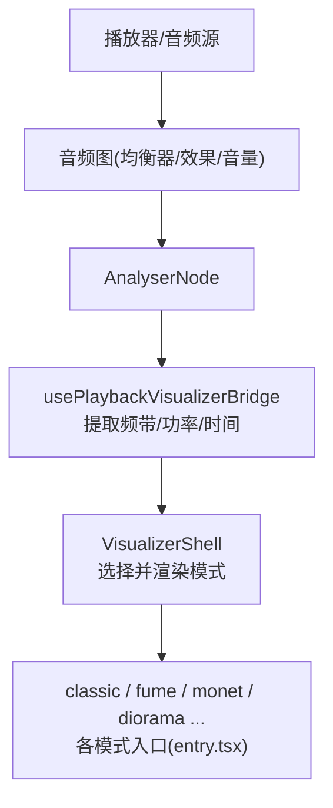
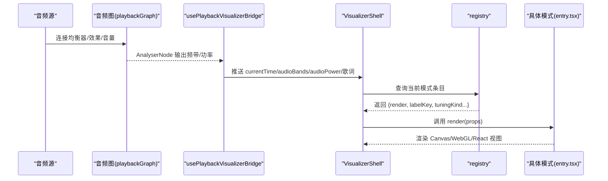
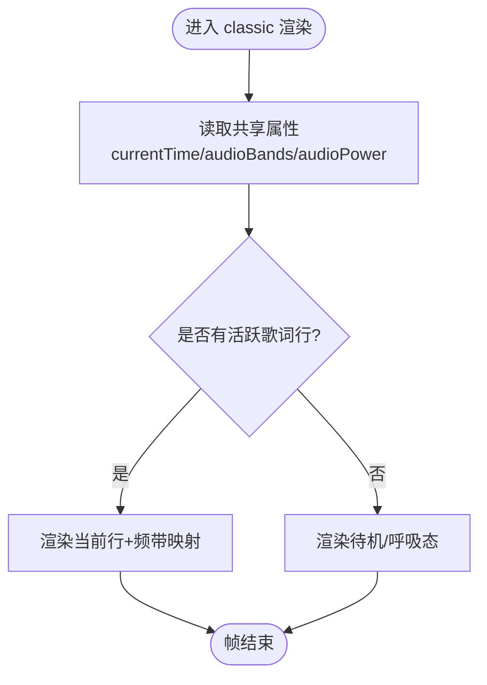
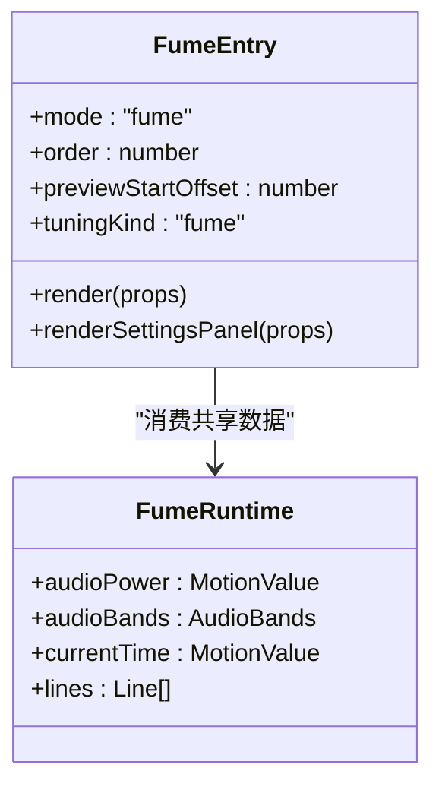
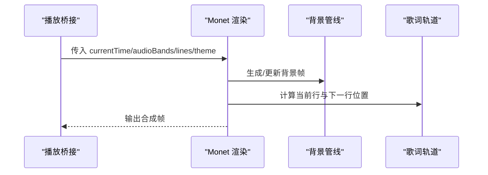
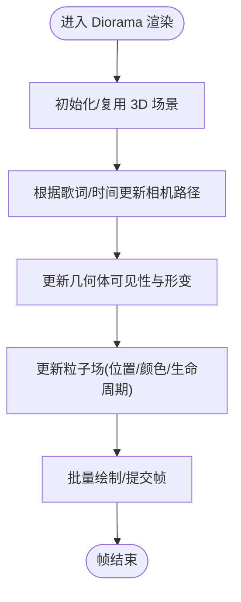
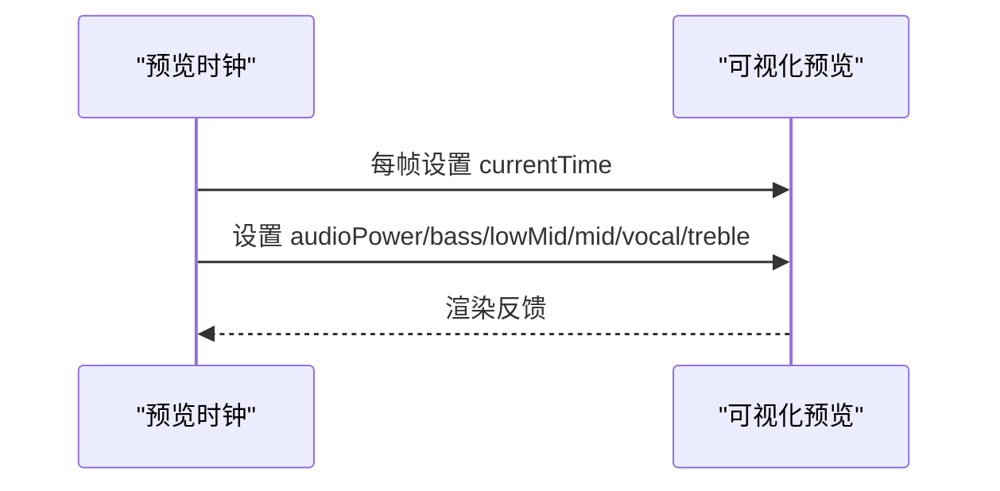
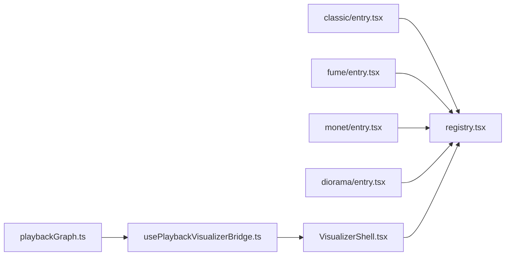

# 完整开发示例教程

<cite>
**本文引用的文件**
- [README.md](file://README.md)
- [package.json](file://package.json)
- [src/components/visualizer/definition.ts](file://src/components/visualizer/definition.ts)
- [src/components/visualizer/runtime.ts](file://src/components/visualizer/runtime.ts)
- [src/components/visualizer/registry.tsx](file://src/components/visualizer/registry.tsx)
- [src/components/visualizer/VisualizerShell.tsx](file://src/components/visualizer/VisualizerShell.tsx)
- [src/hooks/usePlaybackVisualizerBridge.ts](file://src/hooks/usePlaybackVisualizerBridge.ts)
- [src/services/playbackGraph.ts](file://src/services/playbackGraph.ts)
- [src/components/visualizer/classic/entry.tsx](file://src/components/visualizer/classic/entry.tsx)
- [src/components/visualizer/fume/entry.tsx](file://src/components/visualizer/fume/entry.tsx)
- [src/components/visualizer/monet/entry.tsx](file://src/components/visualizer/monet/entry.tsx)
- [src/components/visualizer/diorama/entry.tsx](file://src/components/visualizer/diorama/entry.tsx)
- [src/components/modal/theme-park/useThemeParkPreviewClock.ts](file://src/components/modal/theme-park/useThemeParkPreviewClock.ts)
</cite>

## 目录
1. [简介](#简介)
2. [项目结构](#项目结构)
3. [核心组件](#核心组件)
4. [架构总览](#架构总览)
5. [详细组件分析](#详细组件分析)
6. [依赖关系分析](#依赖关系分析)
7. [性能考虑](#性能考虑)
8. [故障排查指南](#故障排查指南)
9. [结论](#结论)
10. [附录](#附录)

## 简介
本教程面向希望从零开始构建音乐可视化效果的开发者，以本项目为基础，提供从“最简单波形显示”到“复杂粒子系统”的渐进式学习路径。我们将解析内置可视化模式（经典、烟雾、肖像、立体场景等）的实现思路，涵盖音频数据处理、Canvas 绘制、WebGL 渲染、动画控制与性能优化，并给出发布与分享自定义可视化的完整流程。

## 项目结构
- 可视化子系统位于 src/components/visualizer，采用“按模式分目录 + 统一注册表”的组织方式。每个模式通过 entry.tsx 暴露一个 VisualizerRegistryEntry，由 registry.tsx 自动发现并构建运行时可用列表。
- 播放与可视化桥接在 hooks/usePlaybackVisualizerBridge.ts 中完成，负责将音频频带、功率、时间轴与歌词状态注入到各可视化模式中。
- 音频图在 services/playbackGraph.ts 中构建，确保 AnalyserNode 处于链路末端，使可视化始终反映实际听到的声音。
- 预览时钟在 theme-park 中使用正弦波模拟音频数据，便于在无真实音频时调试可视化效果。

图表来源
- [src/services/playbackGraph.ts:76-98](file://src/services/playbackGraph.ts#L76-L98)
- [src/hooks/usePlaybackVisualizerBridge.ts:56-93](file://src/hooks/usePlaybackVisualizerBridge.ts#L56-L93)
- [src/components/visualizer/registry.tsx:15-43](file://src/components/visualizer/registry.tsx#L15-L43)

章节来源
- [README.md:66-151](file://README.md#L66-L151)
- [package.json:17-50](file://package.json#L17-L50)

## 核心组件
- 可视化契约与共享属性：定义所有模式共享的输入（当前时间、歌词行、主题、音频功率与频带、封面、字体缩放、子标题等），以及设置面板与重置能力。
- 运行时工具：提供“最近已完成行”“下一行”“预热窗口”等通用计算，帮助各模式高效决定要渲染的行与预加载时机。
- 模式注册表：集中发现与排序所有可视化模式，支持默认模式、预览种子、预览起始偏移、国际化标签等元信息。
- 外壳容器：根据当前模式实例化对应渲染器，并传入统一的上下文数据。

章节来源
- [src/components/visualizer/definition.ts:32-95](file://src/components/visualizer/definition.ts#L32-L95)
- [src/components/visualizer/runtime.ts:35-120](file://src/components/visualizer/runtime.ts#L35-L120)
- [src/components/visualizer/registry.tsx:15-59](file://src/components/visualizer/registry.tsx#L15-L59)
- [src/components/visualizer/VisualizerShell.tsx:184-197](file://src/components/visualizer/VisualizerShell.tsx#L184-L197)

## 架构总览
下图展示了从音频信号到可视化的端到端数据流，以及模式注册与选择机制。

图表来源
- [src/services/playbackGraph.ts:76-98](file://src/services/playbackGraph.ts#L76-L98)
- [src/hooks/usePlaybackVisualizerBridge.ts:56-93](file://src/hooks/usePlaybackVisualizerBridge.ts#L56-L93)
- [src/components/visualizer/registry.tsx:15-59](file://src/components/visualizer/registry.tsx#L15-L59)
- [src/components/visualizer/definition.ts:165-183](file://src/components/visualizer/definition.ts#L165-L183)

## 详细组件分析

### 经典模式（classic）
- 目标：提供简洁直观的频谱/波形类可视化，适合入门与教学。
- 实现要点：
  - 通过 entry.tsx 注册为 'classic'，指定顺序、预览种子与设置面板。
  - 使用共享 props 获取音频功率与频带，结合 runtime 工具确定当前行与下一行，进行轻量级绘制。
  - 可配合背景层或简单 Canvas 绘制，逐步引入批处理与对象池。

图表来源
- [src/components/visualizer/classic/entry.tsx:8-21](file://src/components/visualizer/classic/entry.tsx#L8-L21)
- [src/components/visualizer/runtime.ts:35-120](file://src/components/visualizer/runtime.ts#L35-L120)

章节来源
- [src/components/visualizer/classic/entry.tsx:1-22](file://src/components/visualizer/classic/entry.tsx#L1-L22)

### 烟雾效果（fume）
- 目标：基于噪声场与粒子/纹理混合的流动烟雾视觉，强调氛围与节奏响应。
- 实现要点：
  - entry.tsx 注册 'fume'，提供预览起始偏移与设置面板。
  - 通常结合 WebGL/着色器或高性能 Canvas 绘制，利用音频功率驱动密度/速度/颜色。
  - 建议采用对象池管理粒子，减少 GC 压力；使用批处理合并绘制调用。

图表来源
- [src/components/visualizer/fume/entry.tsx:9-23](file://src/components/visualizer/fume/entry.tsx#L9-L23)
- [src/components/visualizer/definition.ts:32-95](file://src/components/visualizer/definition.ts#L32-L95)

章节来源
- [src/components/visualizer/fume/entry.tsx:1-24](file://src/components/visualizer/fume/entry.tsx#L1-L24)

### 肖像模式（monet）
- 目标：以肖像图像为核心，叠加歌词轨道、浮动装饰与背景管线，营造电影感。
- 实现要点：
  - entry.tsx 注册 'monet'，对字体缩放进行适配，并提供专属设置面板。
  - 通过共享属性接入歌词与音频数据，结合背景管线与跨淡入出实现平滑过渡。
  - 适合使用分层渲染：背景层、肖像层、歌词层、字幕层，按需启用静态模式降低开销。

图表来源
- [src/components/visualizer/monet/entry.tsx:9-34](file://src/components/visualizer/monet/entry.tsx#L9-L34)
- [src/components/visualizer/runtime.ts:35-120](file://src/components/visualizer/runtime.ts#L35-L120)

章节来源
- [src/components/visualizer/monet/entry.tsx:1-35](file://src/components/visualizer/monet/entry.tsx#L1-L35)

### 立体场景（diorama）
- 目标：程序化 3D 歌词穿越镜头，结合相机路径、几何体与粒子系统，打造沉浸式空间。
- 实现要点：
  - entry.tsx 注册 'diorama'，提供 3D 场景渲染与丰富的参数面板。
  - 典型技术栈：Three.js/React Three Fiber + 自定义着色器 + GPU 粒子。
  - 关键优化：视锥剔除、实例化渲染、GPU 加速、对象池、帧率限制。

图表来源
- [src/components/visualizer/diorama/entry.tsx:9-22](file://src/components/visualizer/diorama/entry.tsx#L9-L22)

章节来源
- [src/components/visualizer/diorama/entry.tsx:1-23](file://src/components/visualizer/diorama/entry.tsx#L1-L23)

### 预览与无音频调试
- 当没有真实音频时，可使用主题公园预览时钟生成模拟的音频功率与频带，便于快速验证可视化逻辑。
- 该时钟循环推进 currentTime，并以正弦波叠加不同频率分量，模拟低频到高频的能量变化。

图表来源
- [src/components/modal/theme-park/useThemeParkPreviewClock.ts:27-64](file://src/components/modal/theme-park/useThemeParkPreviewClock.ts#L27-L64)

章节来源
- [src/components/modal/theme-park/useThemeParkPreviewClock.ts:27-64](file://src/components/modal/theme-park/useThemeParkPreviewClock.ts#L27-L64)

## 依赖关系分析
- 模式注册表依赖各模式的 entry.tsx，通过动态导入收集并去重，保证唯一性。
- 播放桥接依赖音频图，确保 AnalyserNode 在链路末端，从而获得真实的频域/时域数据。
- 各模式均依赖 definition 中的共享属性类型，保证一致的数据契约。

图表来源
- [src/components/visualizer/registry.tsx:15-43](file://src/components/visualizer/registry.tsx#L15-L43)
- [src/services/playbackGraph.ts:76-98](file://src/services/playbackGraph.ts#L76-L98)
- [src/hooks/usePlaybackVisualizerBridge.ts:56-93](file://src/hooks/usePlaybackVisualizerBridge.ts#L56-L93)
- [src/components/visualizer/VisualizerShell.tsx:184-197](file://src/components/visualizer/VisualizerShell.tsx#L184-L197)

章节来源
- [src/components/visualizer/registry.tsx:15-106](file://src/components/visualizer/registry.tsx#L15-L106)
- [src/services/playbackGraph.ts:76-98](file://src/services/playbackGraph.ts#L76-L98)

## 性能考虑
- 对象池：对频繁创建销毁的对象（如粒子、临时向量、纹理块）使用对象池，减少 GC 抖动。
- 批处理：合并绘制调用，减少状态切换；在 Canvas 中尽量使用路径批绘，在 WebGL 中使用实例化渲染。
- GPU 加速：将物理/变换计算移至着色器或 GPU 缓冲区，CPU 仅做必要控制。
- 帧率限制：在高负载模式下限制最大帧率，避免过度渲染导致掉帧。
- 资源复用：背景、纹理、几何体在模式切换时尽量复用，避免重复加载。
- 预热策略：利用 runtime 的预热窗口提前准备下一行的布局/资源，降低首帧卡顿。

[本节为通用指导，不直接分析具体文件]

## 故障排查指南
- 音频数据异常：确认音频图链路顺序，确保 AnalyserNode 在效果链之后、输出之前。
- 预览无效：检查预览时钟是否被暂停或覆盖；确认 currentTime 与频带值是否在合理范围。
- 模式未显示：检查 registry 是否正确发现 entry.tsx；确认 mode 唯一且未被重复注册。
- 性能下降：开启静态模式或降低粒子数量；检查是否存在不必要的重绘与资源重建。

章节来源
- [src/services/playbackGraph.ts:76-98](file://src/services/playbackGraph.ts#L76-L98)
- [src/components/modal/theme-park/useThemeParkPreviewClock.ts:27-64](file://src/components/modal/theme-park/useThemeParkPreviewClock.ts#L27-L64)
- [src/components/visualizer/registry.tsx:15-43](file://src/components/visualizer/registry.tsx#L15-L43)

## 结论
本教程以项目现有可视化子系统为基础，提供了从简单到复杂的可视化开发路径。通过清晰的契约、统一的注册表与播放桥接，开发者可以专注于模式本身的创意实现，同时借助运行时工具与性能优化手段，获得稳定流畅的体验。推荐初学者从 classic 起步，逐步过渡到 fume、monet、diorama 等更复杂的模式。

## 附录
- 新增自定义可视化步骤：
  - 在 src/components/visualizer 下新建目录，编写 entry.tsx，使用 defineVisualizer 注册模式。
  - 在 entry.tsx 中声明 mode、order、labelKey、previewSeed、previewStartOffset、tuningKind，并实现 render 与可选的设置面板。
  - 复用 definition 中的共享属性与 runtime 工具，确保与播放桥接一致。
  - 运行开发脚本验证预览与交互，必要时使用预览时钟进行无音频调试。
- 打包与发布：
  - 使用 package.json 中的构建脚本进行 Web 或 Electron 打包。
  - 如需桌面分发，参考 electron-builder 配置与平台特定产物。
  - 文档编写：为新模式补充 README 与参数说明，便于用户理解与二次开发。

章节来源
- [package.json:17-50](file://package.json#L17-L50)
- [src/components/visualizer/definition.ts:165-183](file://src/components/visualizer/definition.ts#L165-L183)
- [src/components/visualizer/registry.tsx:15-59](file://src/components/visualizer/registry.tsx#L15-L59)