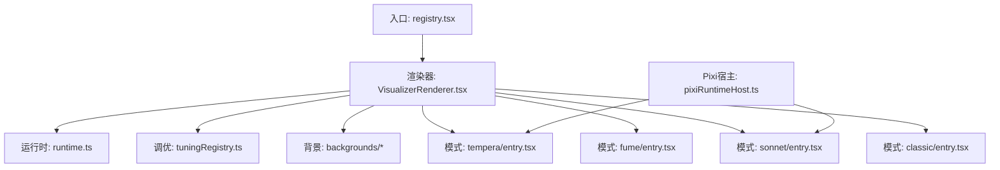
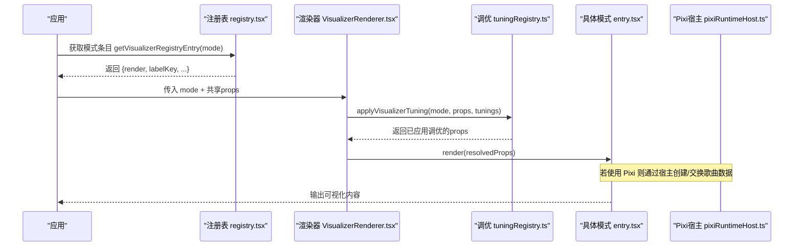
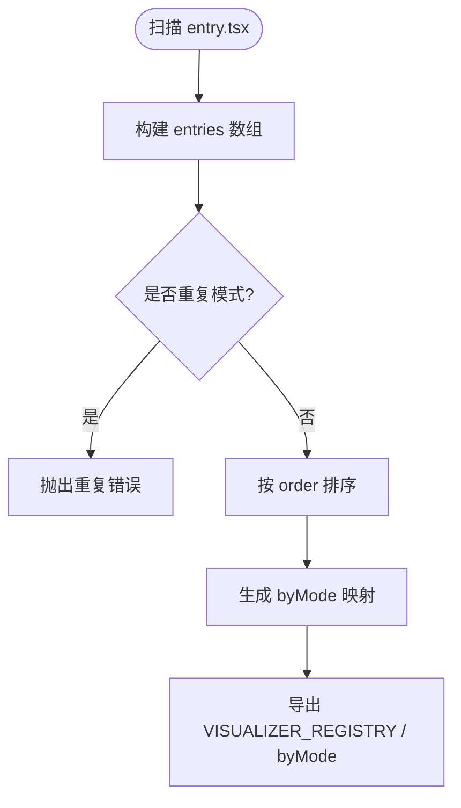
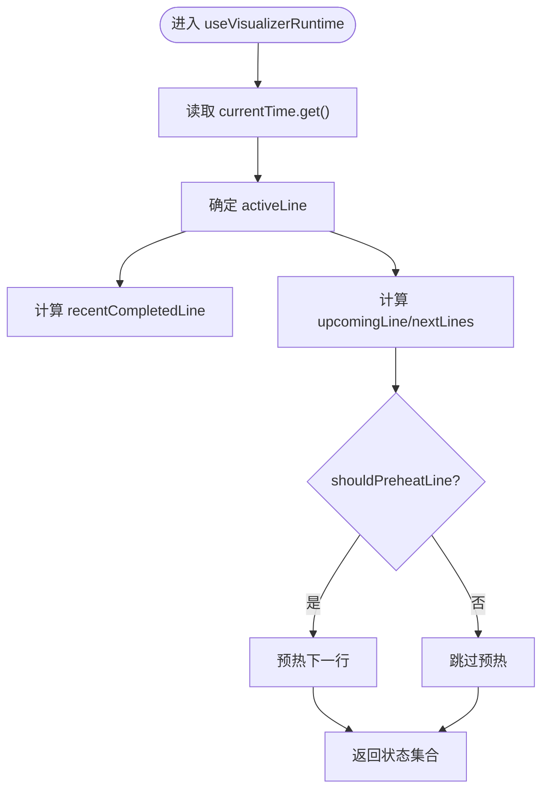
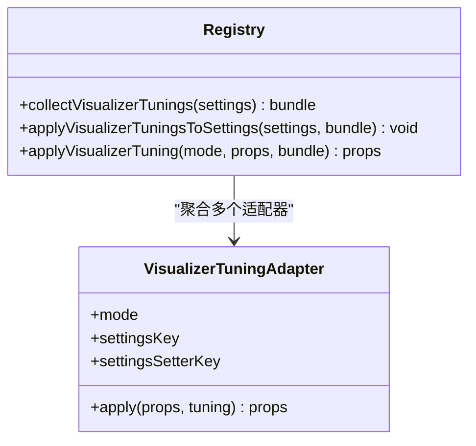
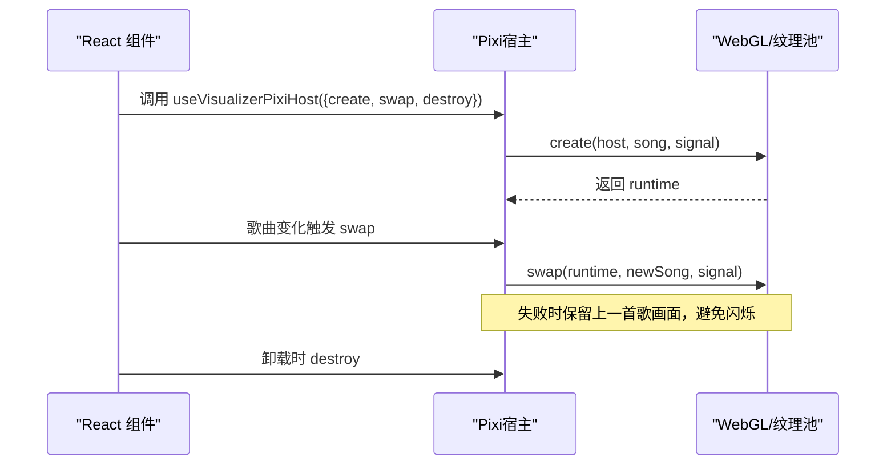
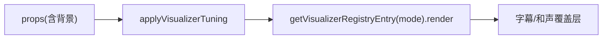
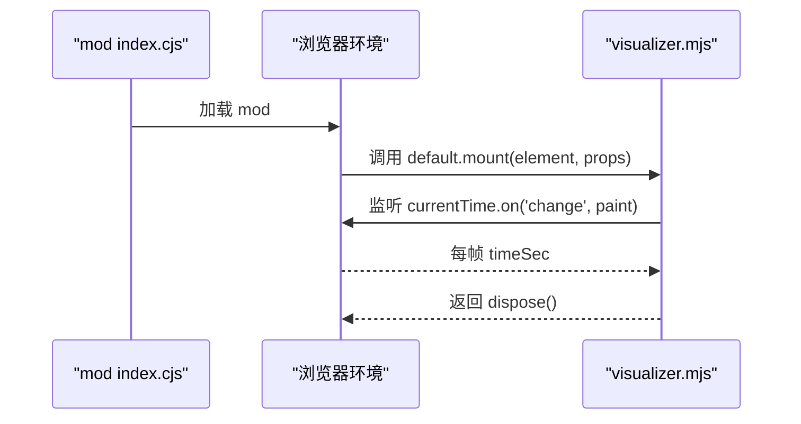
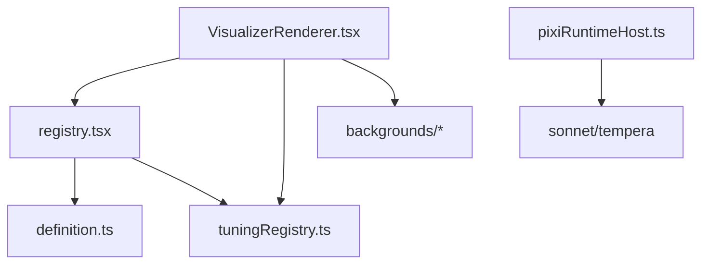

# 自定义可视化开发

<cite>
**本文引用的文件**
- [definition.ts](file://src/components/visualizer/definition.ts)
- [registry.tsx](file://src/components/visualizer/registry.tsx)
- [runtime.ts](file://src/components/visualizer/runtime.ts)
- [VisualizerRenderer.tsx](file://src/components/visualizer/VisualizerRenderer.tsx)
- [pixiRuntimeHost.ts](file://src/components/visualizer/pixiRuntimeHost.ts)
- [tuningRegistry.ts](file://src/components/visualizer/tuningRegistry.ts)
- [settingsPanels.tsx](file://src/components/visualizer/settingsPanels.tsx)
- [classic/entry.tsx](file://src/components/visualizer/classic/entry.tsx)
- [sample-aurora-visualizer/index.cjs](file://mods/sample-aurora-visualizer/index.cjs)
- [sample-aurora-visualizer/visualizer.mjs](file://mods/sample-aurora-visualizer/visualizer.mjs)
- [visualizerMemory.probe.tsx](file://dev/probes/visualizerMemory.probe.tsx)
</cite>

## 目录
1. [简介](#简介)
2. [项目结构](#项目结构)
3. [核心组件](#核心组件)
4. [架构总览](#架构总览)
5. [详细组件分析](#详细组件分析)
6. [依赖关系分析](#依赖关系分析)
7. [性能考量](#性能考量)
8. [故障排查指南](#故障排查指南)
9. [结论](#结论)
10. [附录](#附录)

## 简介
本指南面向希望为 Folia 播放器开发“自定义可视化”的开发者，围绕以下目标展开：
- 可视化组件的开发规范：接口定义、属性配置、生命周期管理
- 可视化注册机制：组件注册、模式定义、参数绑定
- 可视化调优系统：参数调节、实时预览、配置持久化
- 完整示例：从简单波形到复杂 3D 场景（音频数据、图形渲染、用户交互）
- 调试与测试：定位问题、性能优化
- 发布与分享：打包格式、依赖管理、版本控制最佳实践

## 项目结构
可视化子系统位于 src/components/visualizer，采用“按模式分目录 + 集中注册”的组织方式：
- 每个可视化模式一个子目录（如 classic、fume、sonnet、tempera 等），内部包含 entry.tsx（注册）、tuning.ts（调优适配器）、以及具体实现
- 集中式注册表 registry.tsx 通过模块扫描自动发现所有 entry.tsx，构建可用模式列表
- 运行时 runtime.ts 提供歌词行计算、预热窗口等通用能力
- 渲染器 VisualizerRenderer.tsx 负责应用调优并调用对应模式的 render
- 背景层 backgrounds/* 独立于主可视化，可单独选择与配置
- Pixi 宿主 pixiRuntimeHost.ts 为需要 WebGL/Pixi 的重型可视化提供“一次创建、歌曲切换时原地替换”的生命周期管理
- 设置面板 settingsPanels.tsx 提供各模式的可视化参数调节 UI
- 插件侧 mods/* 支持以 ESM 贡献非 React 的可视化（如 aurora-text）

图表来源
- [registry.tsx:15-43](file://src/components/visualizer/registry.tsx#L15-L43)
- [VisualizerRenderer.tsx:13-27](file://src/components/visualizer/VisualizerRenderer.tsx#L13-L27)
- [tuningRegistry.ts:53-72](file://src/components/visualizer/tuningRegistry.ts#L53-L72)
- [runtime.ts:124-157](file://src/components/visualizer/runtime.ts#L124-L157)
- [pixiRuntimeHost.ts:37-143](file://src/components/visualizer/pixiRuntimeHost.ts#L37-L143)

章节来源
- [registry.tsx:15-43](file://src/components/visualizer/registry.tsx#L15-L43)
- [VisualizerRenderer.tsx:13-27](file://src/components/visualizer/VisualizerRenderer.tsx#L13-L27)
- [tuningRegistry.ts:53-72](file://src/components/visualizer/tuningRegistry.ts#L53-L72)
- [runtime.ts:124-157](file://src/components/visualizer/runtime.ts#L124-L157)
- [pixiRuntimeHost.ts:37-143](file://src/components/visualizer/pixiRuntimeHost.ts#L37-L143)

## 核心组件
- 可视化共享接口与注册项
  - VisualizerSharedProps：统一输入（时间、歌词、主题、音频能量/频段、封面、种子、静态模式、字幕选项、调优包等）
  - VisualizerRegistryEntry：描述一个可视化的模式、排序、标签、预览种子、调优类型、render、设置面板、重置逻辑
  - defineVisualizer：用于声明式注册 entry
- 注册表
  - 通过 import.meta.glob 扫描 ./*/entry.tsx，去重并按 order 排序，提供 byMode 查询、默认模式、预览偏移、作用域种子等工具
  - 支持运行时追加/移除条目，供 mod 动态贡献
- 运行时
  - 提供当前行、最近完成行、下一行、预热线程窗口等计算；useVisualizerRuntime 封装常用状态
- 渲染器
  - 将调优应用到 props，注入默认背景模式，调用具体模式的 render，并叠加字幕/和声字幕覆盖层
- Pixi 宿主
  - 为需要 WebGL 的可视化提供“创建一次、歌曲切换时 swap 新数据”的宿主，避免重建上下文导致的闪烁与资源丢失
- 调优系统
  - 每种模式提供 tuning.ts 适配器，集中管理该模式的参数键名、设置键名、apply 函数
  - collectVisualizerTunings/applyVisualizerTuningsToSettings 在设置与运行时之间双向转换
- 设置面板
  - 各模式对应的 SettingsPanel 组件，提供滑块、开关、预设组、导入/清空等操作，配合 onSliderPointerDown/onSliderCommit 实现拖拽草稿与提交

章节来源
- [definition.ts:32-183](file://src/components/visualizer/definition.ts#L32-L183)
- [registry.tsx:15-106](file://src/components/visualizer/registry.tsx#L15-L106)
- [runtime.ts:33-157](file://src/components/visualizer/runtime.ts#L33-L157)
- [VisualizerRenderer.tsx:13-47](file://src/components/visualizer/VisualizerRenderer.tsx#L13-L47)
- [pixiRuntimeHost.ts:11-143](file://src/components/visualizer/pixiRuntimeHost.ts#L11-L143)
- [tuningRegistry.ts:18-99](file://src/components/visualizer/tuningRegistry.ts#L18-L99)
- [settingsPanels.tsx:24-800](file://src/components/visualizer/settingsPanels.tsx#L24-L800)

## 架构总览
下图展示了从注册到渲染、再到调优与 Pixi 宿主的整体流程。

图表来源
- [registry.tsx:49-70](file://src/components/visualizer/registry.tsx#L49-L70)
- [VisualizerRenderer.tsx:17-27](file://src/components/visualizer/VisualizerRenderer.tsx#L17-L27)
- [tuningRegistry.ts:64-72](file://src/components/visualizer/tuningRegistry.ts#L64-L72)
- [pixiRuntimeHost.ts:37-143](file://src/components/visualizer/pixiRuntimeHost.ts#L37-L143)

## 详细组件分析

### 组件注册与模式定义
- 每个模式提供一个 entry.tsx，使用 defineVisualizer 声明：
  - mode：唯一标识
  - order：排序权重
  - labelKey/labelFallback：显示名称
  - previewSeed/previewStartOffset：预览与循环播放起始点
  - tuningKind：关联的调优类型
  - render：React 渲染函数
  - renderSettingsPanel：可选的设置面板
  - resetSettings：可选的复位逻辑
- 注册表通过 glob 扫描自动发现，重复模式会抛错，确保唯一性

图表来源
- [registry.tsx:15-43](file://src/components/visualizer/registry.tsx#L15-L43)

章节来源
- [classic/entry.tsx:8-21](file://src/components/visualizer/classic/entry.tsx#L8-L21)
- [registry.tsx:15-43](file://src/components/visualizer/registry.tsx#L15-L43)

### 运行时与歌词驱动
- useVisualizerRuntime 提供：
  - currentTimeValue：当前时间
  - activeLine：当前歌词行
  - recentCompletedLine：最近完成的行（用于过渡期保持译文可见）
  - upcomingLine/nextLines：即将出现的行，便于预取或预热
- shouldPreheatLine 基于“提前量窗口”决定是否预热下一行，避免每帧昂贵计算

图表来源
- [runtime.ts:124-157](file://src/components/visualizer/runtime.ts#L124-L157)
- [runtime.ts:90-101](file://src/components/visualizer/runtime.ts#L90-L101)

章节来源
- [runtime.ts:33-157](file://src/components/visualizer/runtime.ts#L33-L157)

### 调优系统与参数绑定
- 每种模式提供 tuning.ts 适配器，暴露：
  - mode：模式名
  - settingsKey：设置存储键
  - settingsSetterKey：设置面板回调键
  - apply：将调优合并进 props 的纯函数
- 运行时通过 applyVisualizerTuning 将 bundle 中的调优应用到 props
- collectVisualizerTunings 从全局设置收集各模式调优；applyVisualizerTuningsToSettings 将 bundle 写回设置回调

图表来源
- [tuningRegistry.ts:18-99](file://src/components/visualizer/tuningRegistry.ts#L18-L99)

章节来源
- [tuningRegistry.ts:18-99](file://src/components/visualizer/tuningRegistry.ts#L18-L99)
- [settingsPanels.tsx:24-800](file://src/components/visualizer/settingsPanels.tsx#L24-L800)

### Pixi 宿主与生命周期
- useVisualizerPixiHost 提供：
  - create(host, song, signal)：异步创建运行时（如 WebGL 上下文、纹理池）
  - swap(runtime, song, signal)：在不销毁上下文的情况下切换到新歌曲
  - destroy(runtime)：释放资源
  - drainSong：快速切歌时丢弃旧任务，只保留最新歌曲
- 适用于 sonnet、tempera 等重型可视化，避免频繁重建导致闪烁与内存抖动

图表来源
- [pixiRuntimeHost.ts:37-143](file://src/components/visualizer/pixiRuntimeHost.ts#L37-L143)

章节来源
- [pixiRuntimeHost.ts:11-143](file://src/components/visualizer/pixiRuntimeHost.ts#L11-L143)

### 渲染管线与背景叠加
- VisualizerRenderer 负责：
  - 应用调优（含背景模式默认值）
  - 调用具体模式的 render
  - 叠加字幕/和声字幕覆盖层
- 背景层由 backgrounds/* 提供，可与主可视化解耦

图表来源
- [VisualizerRenderer.tsx:17-42](file://src/components/visualizer/VisualizerRenderer.tsx#L17-L42)

章节来源
- [VisualizerRenderer.tsx:13-47](file://src/components/visualizer/VisualizerRenderer.tsx#L13-L47)

### 插件式可视化（非 React）
- 通过 mods 机制贡献可视化：Node 端 index.cjs 仅做激活日志，实际动画在 visualizer.mjs 中以 ESM 形式运行
- 提供 mount(element, props) 接口，订阅 currentTime.on('change') 进行逐帧绘制，返回清理函数

图表来源
- [sample-aurora-visualizer/index.cjs:1-10](file://mods/sample-aurora-visualizer/index.cjs#L1-L10)
- [sample-aurora-visualizer/visualizer.mjs:1-81](file://mods/sample-aurora-visualizer/visualizer.mjs#L1-L81)

章节来源
- [sample-aurora-visualizer/index.cjs:1-10](file://mods/sample-aurora-visualizer/index.cjs#L1-L10)
- [sample-aurora-visualizer/visualizer.mjs:1-81](file://mods/sample-aurora-visualizer/visualizer.mjs#L1-L81)

## 依赖关系分析
- 低耦合高内聚：
  - 注册表与具体模式解耦，新增模式只需添加 entry.tsx
  - 调优系统通过适配器隔离不同模式的参数结构
  - Pixi 宿主抽象了 WebGL 生命周期，降低模式实现复杂度
- 外部依赖：
  - framer-motion：MotionValue 驱动时间与动画
  - i18n：多语言标签
  - lucide-react：图标
  - PixiJS（间接）：部分模式使用 WebGL 渲染

图表来源
- [registry.tsx:15-43](file://src/components/visualizer/registry.tsx#L15-L43)
- [VisualizerRenderer.tsx:17-27](file://src/components/visualizer/VisualizerRenderer.tsx#L17-L27)
- [tuningRegistry.ts:53-72](file://src/components/visualizer/tuningRegistry.ts#L53-L72)
- [pixiRuntimeHost.ts:37-143](file://src/components/visualizer/pixiRuntimeHost.ts#L37-L143)

章节来源
- [registry.tsx:15-43](file://src/components/visualizer/registry.tsx#L15-L43)
- [VisualizerRenderer.tsx:17-27](file://src/components/visualizer/VisualizerRenderer.tsx#L17-L27)
- [tuningRegistry.ts:53-72](file://src/components/visualizer/tuningRegistry.ts#L53-L72)
- [pixiRuntimeHost.ts:37-143](file://src/components/visualizer/pixiRuntimeHost.ts#L37-L143)

## 性能考量
- 歌词行预热：使用 shouldPreheatLine 的提前量窗口，避免每行切换时的昂贵计算阻塞主线程
- Pixi 宿主复用：通过 swap 而非重建，减少 WebGL 上下文与纹理池重建带来的卡顿与内存峰值
- 音频驱动：使用 MotionValue 传递 audioPower/audioBands，避免不必要的重渲染
- 背景层与主可视化分离：按需渲染背景，减少无关开销
- 预览与测试：使用 visualizerMemory.probe 加速时间轴与合成歌词，评估稳态内存占用与峰值

章节来源
- [runtime.ts:90-101](file://src/components/visualizer/runtime.ts#L90-L101)
- [pixiRuntimeHost.ts:66-96](file://src/components/visualizer/pixiRuntimeHost.ts#L66-L96)
- [visualizerMemory.probe.tsx:92-168](file://dev/probes/visualizerMemory.probe.tsx#L92-L168)

## 故障排查指南
- 重复模式报错：检查 entry.tsx 的 mode 是否唯一
- 缺少默认导出：确保 entry.tsx 使用 defineVisualizer 并默认导出
- Pixi 初始化失败：查看 onFailedChange 回调，确认 create 中资源加载与信号中止处理
- 歌词不更新：确认 currentLineIndex 与 lines 同步，且 useVisualizerRuntime 的依赖正确
- 调优未生效：检查 tuning.ts 的 settingsKey 是否与设置存储一致，bundle 是否正确传入 applyVisualizerTuning
- 预览异常：核对 previewSeed 与 previewStartOffset，确保与模式预期一致

章节来源
- [registry.tsx:18-33](file://src/components/visualizer/registry.tsx#L18-L33)
- [pixiRuntimeHost.ts:120-124](file://src/components/visualizer/pixiRuntimeHost.ts#L120-L124)
- [tuningRegistry.ts:64-72](file://src/components/visualizer/tuningRegistry.ts#L64-L72)

## 结论
Folia 的可视化子系统提供了清晰的接口与可扩展的注册机制，结合调优系统与 Pixi 宿主，既能满足轻量级文本可视化，也能支撑复杂的 3D 与 WebGL 场景。通过统一的共享属性、运行时工具与设置面板，开发者可以专注于视觉表现与交互细节，而无需关心底层生命周期与资源管理。借助探针与测试方法，可在开发阶段有效定位问题并优化性能。

## 附录
- 开发步骤建议
  - 新建模式目录，编写 entry.tsx 与 tuning.ts
  - 实现 render 与设置面板，接入调优回调
  - 如需 WebGL，使用 pixiRuntimeHost 管理生命周期
  - 使用 registry 提供的工具进行预览与测试
- 发布与分享
  - 打包格式：遵循 mods 约定，Node 端 index.cjs 负责激活，浏览器端 ESM 提供可视化
  - 依赖管理：避免引入大型依赖；必要时通过 CDN 或懒加载
  - 版本控制：明确 apiVersion 与兼容性说明，避免破坏现有模式
  - 文档与示例：提供使用说明、参数说明与截图/视频