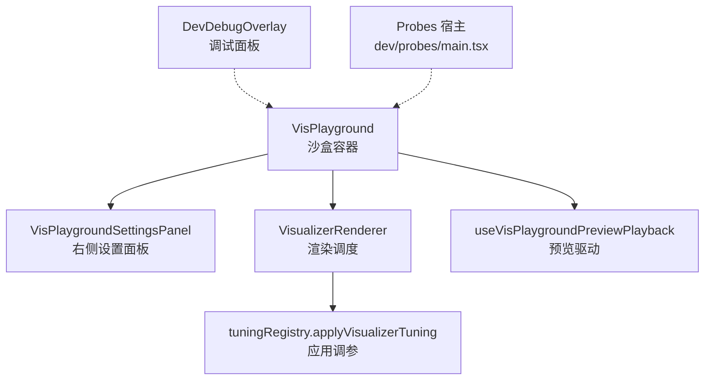
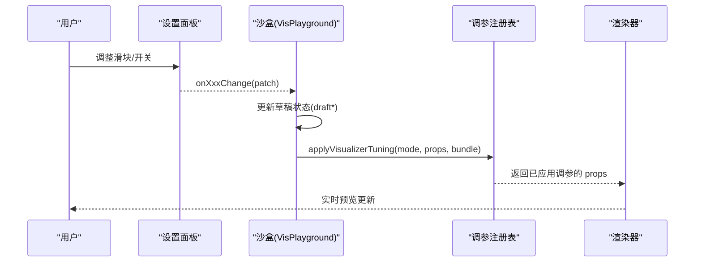
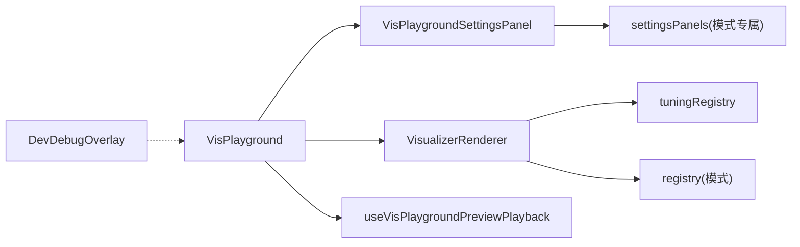

# 调优系统与调试工具

<cite>
**本文引用的文件**
- [VisPlayground.tsx](file://src/components/visualizer/VisPlayground.tsx)
- [VisPlaygroundSettingsPanel.tsx](file://src/components/visualizer/VisPlaygroundSettingsPanel.tsx)
- [settingsPanels.tsx](file://src/components/visualizer/settingsPanels.tsx)
- [tuningRegistry.ts](file://src/components/visualizer/tuningRegistry.ts)
- [VisualizerRenderer.tsx](file://src/components/visualizer/VisualizerRenderer.tsx)
- [useVisPlaygroundPreviewPlayback.ts](file://src/components/visualizer/useVisPlaygroundPreviewPlayback.ts)
- [DevDebugOverlay.tsx](file://src/components/DevDebugOverlay.tsx)
- [main.tsx](file://dev/probes/main.tsx)
- [registry.ts](file://dev/probes/registry.ts)
- [visualizerMemory.probe.tsx](file://dev/probes/visualizerMemory.probe.tsx)
</cite>

## 目录
1. [简介](#简介)
2. [项目结构](#项目结构)
3. [核心组件](#核心组件)
4. [架构总览](#架构总览)
5. [详细组件分析](#详细组件分析)
6. [依赖关系分析](#依赖关系分析)
7. [性能与调优建议](#性能与调优建议)
8. [故障排查指南](#故障排查指南)
9. [结论](#结论)
10. [附录：自定义可视化调试界面接入指南](#附录自定义可视化调试界面接入指南)

## 简介
本文件面向“可视化调优系统”和“调试工具集”，系统性说明以下主题：
- 调优参数的设计原理：数值范围、默认值、变化监听、提交时机等。
- VisPlayground 可视化沙盒的使用方法：实时预览、参数调节、效果对比。
- 调试工具集：性能监控、内存使用、渲染统计等诊断能力。
- 完整调优工作流：从参数探索到最终配置落盘。
- 常见问题定位：性能瓶颈、渲染异常、内存泄漏等。
- 如何为自定义可视化添加专属调试界面和优化建议。

## 项目结构
围绕可视化调优与调试，关键代码集中在以下位置：
- 可视化沙盒与设置面板：src/components/visualizer/VisPlayground*.tsx、settingsPanels.tsx
- 调参注册与注入：src/components/visualizer/tuningRegistry.ts
- 渲染入口：src/components/visualizer/VisualizerRenderer.tsx
- 预览驱动：src/components/visualizer/useVisPlaygroundPreviewPlayback.ts
- 调试面板：src/components/DevDebugOverlay.tsx
- 开发探针（独立宿主）：dev/probes/*

图表来源
- [VisPlayground.tsx:289-614](file://src/components/visualizer/VisPlayground.tsx#L289-L614)
- [VisualizerRenderer.tsx:13-43](file://src/components/visualizer/VisualizerRenderer.tsx#L13-L43)
- [tuningRegistry.ts:64-72](file://src/components/visualizer/tuningRegistry.ts#L64-L72)
- [useVisPlaygroundPreviewPlayback.ts:22-88](file://src/components/visualizer/useVisPlaygroundPreviewPlayback.ts#L22-L88)
- [DevDebugOverlay.tsx:603-766](file://src/components/DevDebugOverlay.tsx#L603-L766)
- [main.tsx:16-53](file://dev/probes/main.tsx#L16-L53)

章节来源
- [VisPlayground.tsx:289-614](file://src/components/visualizer/VisPlayground.tsx#L289-L614)
- [VisualizerRenderer.tsx:13-43](file://src/components/visualizer/VisualizerRenderer.tsx#L13-L43)
- [tuningRegistry.ts:64-72](file://src/components/visualizer/tuningRegistry.ts#L64-L72)
- [useVisPlaygroundPreviewPlayback.ts:22-88](file://src/components/visualizer/useVisPlaygroundPreviewPlayback.ts#L22-L88)
- [DevDebugOverlay.tsx:603-766](file://src/components/DevDebugOverlay.tsx#L603-L766)
- [main.tsx:16-53](file://dev/probes/main.tsx#L16-L53)

## 核心组件
- VisPlayground：可视化沙盒主容器，负责状态管理、预览驱动、字体与背景配置、各模式调参的草稿与提交。
- VisPlaygroundSettingsPanel：右侧设置面板，提供通用设置、背景设置、可视化模式设置、字幕设置的分组 UI。
- settingsPanels.tsx：各可视化模式的专属设置面板（Classic、Partita、Fume、Cappella 等）。
- tuningRegistry.ts：纯数据形式的调参适配器注册表，将不同模式的调参以统一接口应用到渲染属性。
- VisualizerRenderer：根据当前模式选择具体渲染器，并应用调参。
- useVisPlaygroundPreviewPlayback：在沙盒中模拟时间轴与音频带，驱动可视化预览。
- DevDebugOverlay：可拖拽调试窗口，包含控制台、内存、播放、歌词、主题、Sonnet 布局等诊断页签。
- Probes 宿主：独立页面用于挂载单个组件进行真实浏览器环境下的验证与回归。

章节来源
- [VisPlayground.tsx:289-614](file://src/components/visualizer/VisPlayground.tsx#L289-L614)
- [VisPlaygroundSettingsPanel.tsx:307-800](file://src/components/visualizer/VisPlaygroundSettingsPanel.tsx#L307-L800)
- [settingsPanels.tsx:24-800](file://src/components/visualizer/settingsPanels.tsx#L24-L800)
- [tuningRegistry.ts:18-99](file://src/components/visualizer/tuningRegistry.ts#L18-L99)
- [VisualizerRenderer.tsx:13-43](file://src/components/visualizer/VisualizerRenderer.tsx#L13-L43)
- [useVisPlaygroundPreviewPlayback.ts:22-88](file://src/components/visualizer/useVisPlaygroundPreviewPlayback.ts#L22-L88)
- [DevDebugOverlay.tsx:603-766](file://src/components/DevDebugOverlay.tsx#L603-L766)
- [main.tsx:16-53](file://dev/probes/main.tsx#L16-L53)

## 架构总览
调优系统采用“沙盒 + 设置面板 + 调参注册表 + 渲染器”的分层架构：
- 沙盒负责收集用户交互产生的“草稿参数”，并在合适时机提交到上层状态或持久化。
- 设置面板按模块组织控件，支持重置、范围校验、即时反馈。
- 调参注册表以“适配器”形式解耦不同可视化模式的参数映射，避免在渲染器中硬编码分支。
- 渲染器统一接收已应用的参数，调用对应模式的 render 函数完成绘制。

图表来源
- [VisPlaygroundSettingsPanel.tsx:448-800](file://src/components/visualizer/VisPlaygroundSettingsPanel.tsx#L448-L800)
- [VisPlayground.tsx:436-549](file://src/components/visualizer/VisPlayground.tsx#L436-L549)
- [tuningRegistry.ts:64-72](file://src/components/visualizer/tuningRegistry.ts#L64-L72)
- [VisualizerRenderer.tsx:13-43](file://src/components/visualizer/VisualizerRenderer.tsx#L13-L43)

## 详细组件分析

### VisPlayground：可视化沙盒
职责
- 维护所有模式的“草稿参数”（draft*），并提供统一的 reset 入口。
- 通过 useVisPlaygroundPreviewPlayback 驱动 currentTime、音频带、频谱等 MotionValue，实现无 React State 的高频更新。
- 对部分参数做范围钳制（如字体缩放、相机速度、辉光强度等），保证输入安全。
- 管理字体选择、上传、回退栈；管理背景透明度、字幕样式等通用设置。
- 将草稿参数打包为 visualizerTunings，传递给渲染器。

关键机制
- 数值范围与默认值：多处 clamp 函数限制输入范围，确保视觉稳定与性能可控。
- 变化监听：useMotionValueEvent 监听 currentTime 变化，联动高亮当前行。
- 提交时机：拖动滑块时仅更新草稿，释放指针后再 commit，减少重排与重绘。

章节来源
- [VisPlayground.tsx:206-216](file://src/components/visualizer/VisPlayground.tsx#L206-L216)
- [VisPlayground.tsx:436-549](file://src/components/visualizer/VisPlayground.tsx#L436-L549)
- [VisPlayground.tsx:601-624](file://src/components/visualizer/VisPlayground.tsx#L601-L624)
- [VisPlayground.tsx:646-665](file://src/components/visualizer/VisPlayground.tsx#L646-L665)

### VisPlaygroundSettingsPanel：设置面板
职责
- 提供“通用/背景/可视化/字幕”四大分区，每个分区支持重置。
- 封装 PresetGroup、ToggleRow 等基础控件，统一样式与行为。
- 将用户操作转换为 onXxxChange 回调，交由沙盒处理。

典型交互
- 字体大小、字重、不透明度等通过 range 输入，配合 onPointerDown/onPointerUp 控制提交时机。
- 背景模式切换由 backgroundActions.onModeChange 触发。
- 可视化模式切换由 onVisualizerModeChange 触发。

章节来源
- [VisPlaygroundSettingsPanel.tsx:183-277](file://src/components/visualizer/VisPlaygroundSettingsPanel.tsx#L183-L277)
- [VisPlaygroundSettingsPanel.tsx:448-800](file://src/components/visualizer/VisPlaygroundSettingsPanel.tsx#L448-L800)

### settingsPanels.tsx：模式专属设置
职责
- Classic、Partita、Fume、Cappella 等模式各自提供一组参数控件。
- 对参数进行合理钳制与组合逻辑（如 staggerMin/staggerMax 的互锁）。
- 提供导入/清空自定义资源的能力（如 Cappella 表情包、头像包）。

示例要点
- Partita 的 staggerMin/staggerMax 相互约束，防止非法区间。
- Fume 的 cameraSpeed、glowIntensity、heroScale 等均有明确范围。
- Cappella 支持内置/自定义表情与头像源切换，并提供预览与导入流程。

章节来源
- [settingsPanels.tsx:24-129](file://src/components/visualizer/settingsPanels.tsx#L24-L129)
- [settingsPanels.tsx:130-245](file://src/components/visualizer/settingsPanels.tsx#L130-L245)
- [settingsPanels.tsx:252-427](file://src/components/visualizer/settingsPanels.tsx#L252-L427)
- [settingsPanels.tsx:441-800](file://src/components/visualizer/settingsPanels.tsx#L441-L800)

### tuningRegistry.ts：调参注册表
职责
- 定义 VisualizerTuningAdapter 接口，将每种模式的调参与渲染属性映射。
- 自动发现 *./*/tuning.ts 模块，构建适配器映射。
- 提供 applyVisualizerTuning、collectVisualizerTunings、applyVisualizerTuningsToSettings 等工具函数。

设计优势
- 解耦：渲染器无需感知具体模式细节，只关心“已应用调参后的 props”。
- 扩展：新增模式只需实现一个 adapter，即可被自动注册与应用。

章节来源
- [tuningRegistry.ts:18-99](file://src/components/visualizer/tuningRegistry.ts#L18-L99)

### VisualizerRenderer：渲染调度
职责
- 接收 mode 与共享 props，调用 applyVisualizerTuning 应用调参。
- 根据模式选择对应渲染器，并叠加字幕/和声覆盖层。

章节来源
- [VisualizerRenderer.tsx:13-43](file://src/components/visualizer/VisualizerRenderer.tsx#L13-L43)

### useVisPlaygroundPreviewPlayback：预览驱动
职责
- 基于 requestAnimationFrame 推进 currentTime，并生成模拟的音频带与频谱。
- 支持暂停/恢复、循环时长、播放 key 变更时的偏移重置。

章节来源
- [useVisPlaygroundPreviewPlayback.ts:22-88](file://src/components/visualizer/useVisPlaygroundPreviewPlayback.ts#L22-L88)

### DevDebugOverlay：调试面板
职责
- 提供多页签调试视图：Console、Memory、Playback、Lyrics、Theme、Sonnet。
- 内存页签采样 performance.memory，记录堆使用、DOM 节点数、GC 次数等。
- Lyrics 页签展示当前/下一行的时间窗、揭示状态、渲染保持等指标。
- Sonnet 页签展示布局片段、重叠计数、相机参数等。

章节来源
- [DevDebugOverlay.tsx:603-766](file://src/components/DevDebugOverlay.tsx#L603-L766)
- [DevDebugOverlay.tsx:774-800](file://src/components/DevDebugOverlay.tsx#L774-L800)

### Probes 宿主与内存台架
- dev/probes/main.tsx：独立宿主，支持 ?probe=<id> 挂载单个组件，启用 StrictMode 复现问题。
- dev/probes/registry.ts：自动发现 *.probe.tsx 并注册。
- dev/probes/visualizerMemory.probe.tsx：为单个可视化提供加速时间轴的内存/性能台架，便于横向对比与回归。

章节来源
- [main.tsx:16-53](file://dev/probes/main.tsx#L16-L53)
- [registry.ts:1-24](file://dev/probes/registry.ts#L1-L24)
- [visualizerMemory.probe.tsx:92-181](file://dev/probes/visualizerMemory.probe.tsx#L92-L181)

## 依赖关系分析
- VisPlayground 依赖：
  - 设置面板（VisPlaygroundSettingsPanel）
  - 渲染器（VisualizerRenderer）
  - 预览驱动（useVisPlaygroundPreviewPlayback）
  - 调参注册表（tuningRegistry）
- 设置面板依赖：
  - 各模式专属设置（settingsPanels.tsx）
  - 背景注册表（backgrounds/registry）
- 渲染器依赖：
  - 调参注册表（tuningRegistry）
  - 模式注册表（registry）
- 调试面板依赖：
  - 控制台日志缓冲（consoleLogBuffer）
  - 可拖拽窗口（DraggableDebugWindow）

图表来源
- [VisPlayground.tsx:289-614](file://src/components/visualizer/VisPlayground.tsx#L289-L614)
- [VisualizerRenderer.tsx:13-43](file://src/components/visualizer/VisualizerRenderer.tsx#L13-L43)
- [tuningRegistry.ts:64-72](file://src/components/visualizer/tuningRegistry.ts#L64-L72)
- [settingsPanels.tsx:24-800](file://src/components/visualizer/settingsPanels.tsx#L24-L800)

章节来源
- [VisPlayground.tsx:289-614](file://src/components/visualizer/VisPlayground.tsx#L289-L614)
- [VisualizerRenderer.tsx:13-43](file://src/components/visualizer/VisualizerRenderer.tsx#L13-L43)
- [tuningRegistry.ts:64-72](file://src/components/visualizer/tuningRegistry.ts#L64-L72)
- [settingsPanels.tsx:24-800](file://src/components/visualizer/settingsPanels.tsx#L24-L800)

## 性能与调优建议
- 参数范围与默认值
  - 字体缩放：限制在 0.85~1.4，避免过大导致布局抖动与重排。
  - 相机速度、辉光强度、文本保持比例等：均做了合理钳制，防止极端值引发性能退化。
  - Partita 的 staggerMin/staggerMax：相互约束，保证最小值不大于最大值。
- 提交时机优化
  - 拖动滑块时使用 onPointerDown/onPointerUp 控制提交，减少高频 setState 与重绘。
  - 纹理分辨率等敏感参数在拖动期间保持持久值，释放后再应用，避免 backing surface 频繁重建。
- 预览驱动
  - 使用 MotionValue 驱动高频动画，避免 React State 带来的额外开销。
  - 使用 requestAnimationFrame 推进时间轴，保证帧率友好。
- 调试辅助
  - 使用 DevDebugOverlay 的 Memory 页签观察堆增长、DOM 节点变化、GC 次数。
  - 使用 Lyrics 页签检查行时间窗、揭示延迟、渲染保持等。
  - 使用 Sonnet 页签检查布局重叠、相机参数、段落信息。
  - 使用 Probes 宿主与 visualizerMemory.probe.tsx 进行长时间运行与进程级内存采样。

章节来源
- [VisPlayground.tsx:206-216](file://src/components/visualizer/VisPlayground.tsx#L206-L216)
- [VisPlayground.tsx:530-535](file://src/components/visualizer/VisPlayground.tsx#L530-L535)
- [settingsPanels.tsx:141-170](file://src/components/visualizer/settingsPanels.tsx#L141-L170)
- [useVisPlaygroundPreviewPlayback.ts:52-87](file://src/components/visualizer/useVisPlaygroundPreviewPlayback.ts#L52-L87)
- [DevDebugOverlay.tsx:641-691](file://src/components/DevDebugOverlay.tsx#L641-L691)
- [DevDebugOverlay.tsx:774-800](file://src/components/DevDebugOverlay.tsx#L774-L800)
- [visualizerMemory.probe.tsx:92-181](file://dev/probes/visualizerMemory.probe.tsx#L92-L181)

## 故障排查指南
- 性能瓶颈
  - 现象：拖动滑块卡顿、预览掉帧。
  - 排查：打开 DevDebugOverlay 的 Memory 页签，关注 usedHeap、domNodes、gcCount；检查是否频繁重建纹理或图层。
  - 解决：降低纹理分辨率、减少复杂特效、合并状态更新、避免在拖动过程中触发昂贵操作。
- 渲染异常
  - 现象：字幕错位、文字重叠、布局错乱。
  - 排查：使用 Lyrics 页签查看当前/下一行的 startTime/endTime/renderEndTime；使用 Sonnet 页签检查 segment 重叠计数。
  - 解决：调整 staggerMin/staggerMax、wordSpacing、cameraTrackingMode 等参数；必要时冻结帧逐像素比对。
- 内存泄漏
  - 现象：长时间运行后内存持续增长。
  - 排查：使用 DevDebugOverlay 的 Memory 页签观察趋势；使用 Probes 宿主与 visualizerMemory.probe.tsx 进行长时间运行测试；结合手动脚本采集进程工作集。
  - 解决：检查是否有未清理的定时器、事件监听、缓存对象；避免在高频路径创建大对象；合理使用资源生命周期。
- 字体与字幕问题
  - 现象：字体不可用、字幕样式不一致。
  - 排查：检查字体回退栈、继承设置；确认系统字体查询是否可用；上传自定义字体是否成功。
  - 解决：调整字体回退顺序；在移动端使用上传字体替代方案；确认字幕字体继承与权重设置。

章节来源
- [DevDebugOverlay.tsx:641-691](file://src/components/DevDebugOverlay.tsx#L641-L691)
- [DevDebugOverlay.tsx:774-800](file://src/components/DevDebugOverlay.tsx#L774-L800)
- [visualizerMemory.probe.tsx:92-181](file://dev/probes/visualizerMemory.probe.tsx#L92-L181)
- [VisPlayground.tsx:672-708](file://src/components/visualizer/VisPlayground.tsx#L672-L708)

## 结论
本调优系统通过沙盒、设置面板、调参注册表与渲染器的分层设计，实现了可视化参数的集中管理与实时预览。配合调试工具集（控制台、内存、播放、歌词、主题、Sonnet 布局）与 Probes 宿主，开发者可以高效定位性能瓶颈、渲染异常与内存问题，并完成从参数探索到最终配置的完整工作流。对于自定义可视化，可通过注册调参适配器与提供专属设置面板，无缝融入现有体系。

## 附录：自定义可视化调试界面接入指南
步骤
- 注册调参适配器
  - 在对应模式下实现 VisualizerTuningAdapter，声明 mode、settingsKey、settingsSetterKey、apply。
  - 将适配器放入 *./*/tuning.ts，将被自动发现并注册。
- 提供专属设置面板
  - 在 settingsPanels.tsx 中新增组件，暴露必要的参数控件与范围钳制。
  - 通过 onXxxChange 回调将 patch 提交给上层状态。
- 集成到沙盒
  - 在 VisPlaygroundSettingsPanel 中引入并渲染该面板，绑定对应的回调与重置按钮。
  - 在沙盒中维护 draft* 状态，并在合适时机提交到持久化或上层状态。
- 调试与验证
  - 使用 DevDebugOverlay 的相应页签验证参数效果。
  - 使用 Probes 宿主与 visualizerMemory.probe.tsx 进行长时间运行与内存采样。
  - 如需快速验证，可在 URL 中添加 ?probe=visualizerMemory&vis=<mode> 启动内存台架。

章节来源
- [tuningRegistry.ts:18-99](file://src/components/visualizer/tuningRegistry.ts#L18-L99)
- [settingsPanels.tsx:24-800](file://src/components/visualizer/settingsPanels.tsx#L24-L800)
- [VisPlaygroundSettingsPanel.tsx:657-733](file://src/components/visualizer/VisPlaygroundSettingsPanel.tsx#L657-L733)
- [visualizerMemory.probe.tsx:92-181](file://dev/probes/visualizerMemory.probe.tsx#L92-L181)