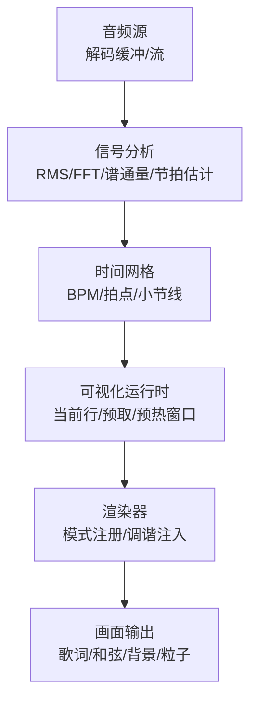
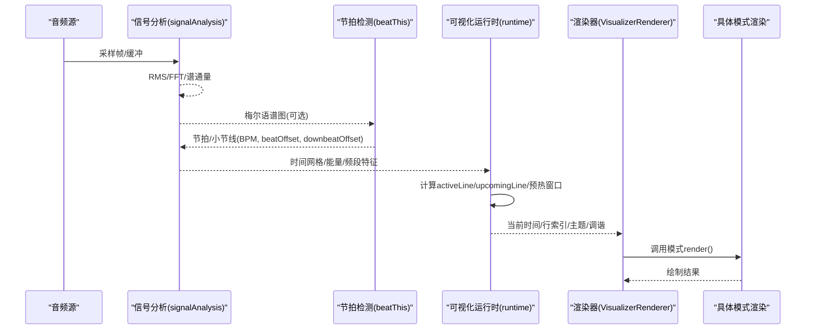
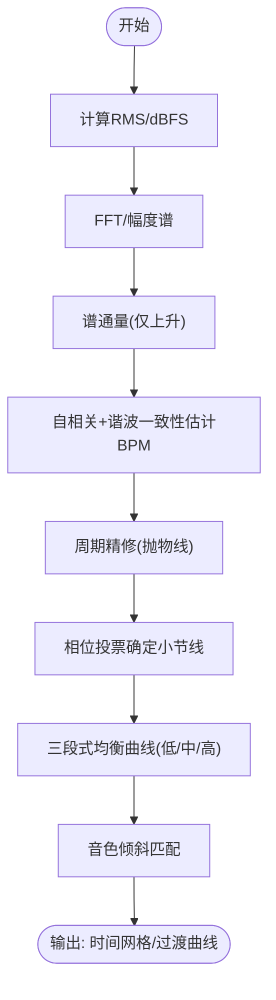
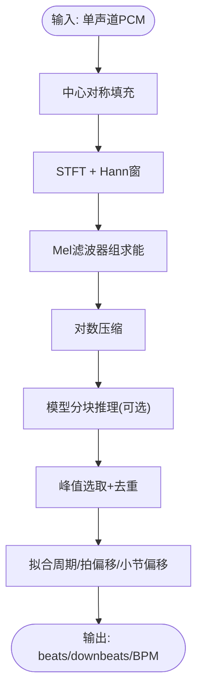
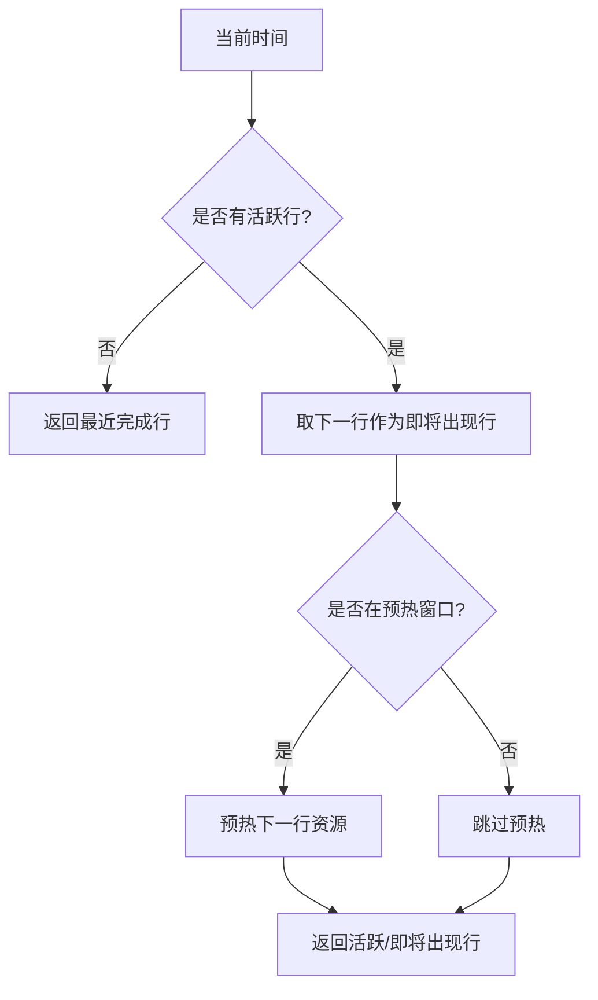
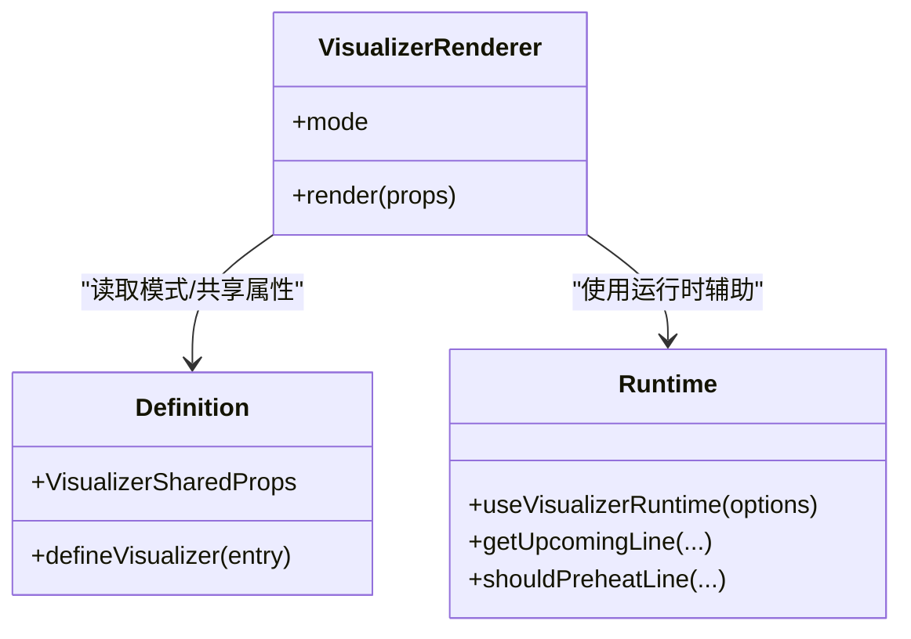
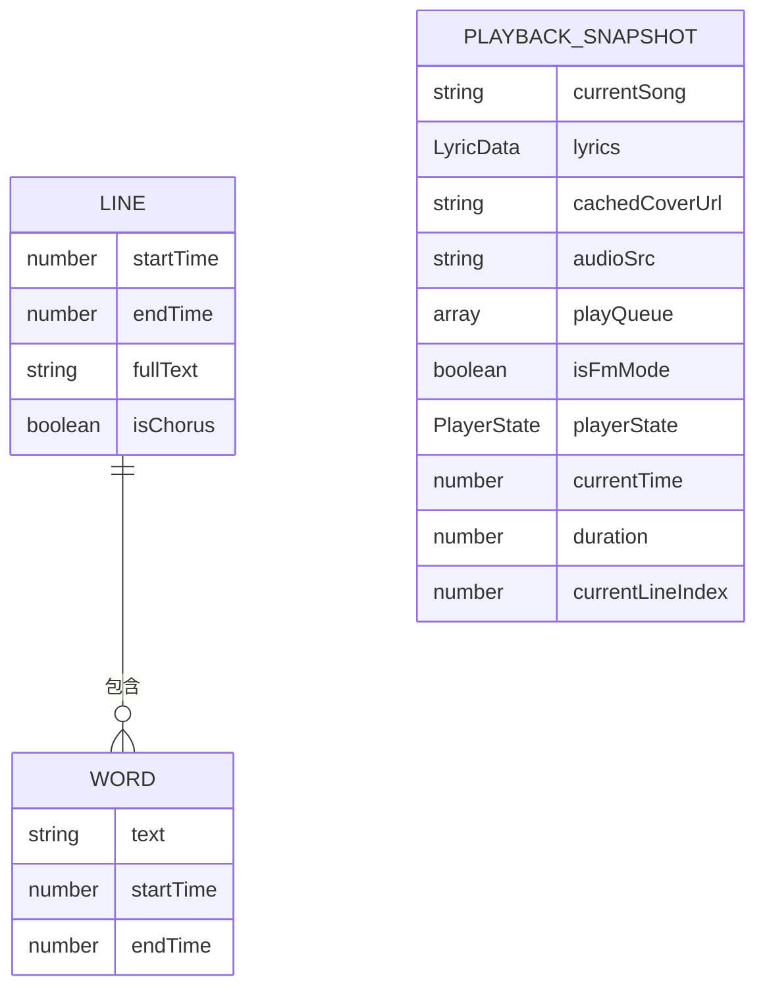
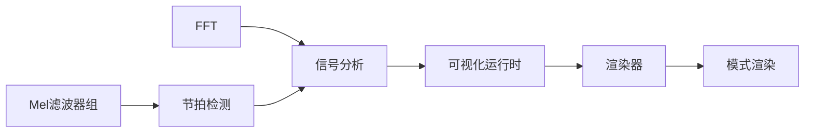

# 音频到视觉映射

<cite>
**本文引用的文件**
- [signalAnalysis.ts](file://src/services/automix/signalAnalysis.ts)
- [beatThis.ts](file://src/services/automix/beatThis.ts)
- [definition.ts](file://src/components/visualizer/definition.ts)
- [runtime.ts](file://src/components/visualizer/runtime.ts)
- [VisualizerRenderer.tsx](file://src/components/visualizer/VisualizerRenderer.tsx)
- [types.ts](file://src/types.ts)
- [appPlayback.ts](file://src/types/appPlayback.ts)
</cite>

## 目录
1. [简介](#简介)
2. [项目结构](#项目结构)
3. [核心组件](#核心组件)
4. [架构总览](#架构总览)
5. [详细组件分析](#详细组件分析)
6. [依赖关系分析](#依赖关系分析)
7. [性能与实时处理](#性能与实时处理)
8. [故障排查指南](#故障排查指南)
9. [结论](#结论)
10. [附录](#附录)

## 简介
本技术文档聚焦于“音频数据到视觉效果映射”的完整链路：从音频信号的特征提取（频谱、节拍、和弦/调性线索、情绪/风格推断）到可视化渲染的数据归一化、曲线拟合与插值，再到实时处理的工程实践（缓冲区管理、延迟优化、精度控制），以及调试工具与不同音乐类型的映射策略。本项目在自动混音与可视化子系统之间共享同一套信号分析与时间网格能力，确保跨模块的一致性与可验证性。

## 项目结构
围绕音频到视觉映射的关键代码分布在以下位置：
- 信号分析与节拍/拍线估计：services/automix/signalAnalysis.ts、services/automix/beatThis.ts
- 可视化运行时与渲染入口：components/visualizer/runtime.ts、components/visualizer/VisualizerRenderer.tsx、components/visualizer/definition.ts
- 类型契约与播放状态：types.ts、types/appPlayback.ts

图表来源
- [signalAnalysis.ts:40-110](file://src/services/automix/signalAnalysis.ts#L40-L110)
- [beatThis.ts:103-158](file://src/services/automix/beatThis.ts#L103-L158)
- [runtime.ts:124-157](file://src/components/visualizer/runtime.ts#L124-L157)
- [VisualizerRenderer.tsx:13-27](file://src/components/visualizer/VisualizerRenderer.tsx#L13-L27)

章节来源
- [signalAnalysis.ts:1-120](file://src/services/automix/signalAnalysis.ts#L1-L120)
- [beatThis.ts:1-160](file://src/services/automix/beatThis.ts#L1-L160)
- [runtime.ts:1-158](file://src/components/visualizer/runtime.ts#L1-L158)
- [VisualizerRenderer.tsx:1-47](file://src/components/visualizer/VisualizerRenderer.tsx#L1-L47)
- [definition.ts:32-95](file://src/components/visualizer/definition.ts#L32-L95)
- [types.ts:53-80](file://src/types.ts#L53-L80)
- [appPlayback.ts:47-58](file://src/types/appPlayback.ts#L47-L58)

## 核心组件
- 信号分析层
  - 能量与响度：RMS、dBFS、K加权响度（LUFS）、静音阈值
  - 频谱与 onset：自实现 FFT、谱通量（Spectral Flux）
  - 节拍与速度：自相关估计、谐波一致性、周期精修、相位投票确定小节线
  - 三段式均衡过渡：低/中/高频独立交叉淡入淡出、低音交换、音色倾斜匹配
- 节拍检测层（Beat This!）
  - Mel 语谱图构建（Slaney mel、三角滤波器组、对数压缩）
  - 分块推理与拼接、峰值选取与去重、统一网格拟合（BPM、拍偏移、小节偏移）
- 可视化运行时
  - 当前行/下一行/最近完成行的选择与预热窗口
  - 将时间轴与歌词行对齐，为渲染提供稳定输入
- 渲染与调谐
  - 模式注册表与共享属性注入
  - 各模式的调谐参数合并与覆盖

章节来源
- [signalAnalysis.ts:40-110](file://src/services/automix/signalAnalysis.ts#L40-L110)
- [signalAnalysis.ts:165-309](file://src/services/automix/signalAnalysis.ts#L165-L309)
- [signalAnalysis.ts:320-469](file://src/services/automix/signalAnalysis.ts#L320-L469)
- [signalAnalysis.ts:584-596](file://src/services/automix/signalAnalysis.ts#L584-L596)
- [signalAnalysis.ts:626-664](file://src/services/automix/signalAnalysis.ts#L626-L664)
- [beatThis.ts:103-158](file://src/services/automix/beatThis.ts#L103-L158)
- [beatThis.ts:202-238](file://src/services/automix/beatThis.ts#L202-L238)
- [beatThis.ts:378-413](file://src/services/automix/beatThis.ts#L378-L413)
- [runtime.ts:35-120](file://src/components/visualizer/runtime.ts#L35-L120)
- [definition.ts:32-95](file://src/components/visualizer/definition.ts#L32-L95)
- [VisualizerRenderer.tsx:13-27](file://src/components/visualizer/VisualizerRenderer.tsx#L13-L27)

## 架构总览
下图展示从音频到可视化的端到端流程：音频帧经信号分析得到能量、频谱、节拍与小节线；可视化运行时根据当前时间与歌词行计算活跃/即将出现的行；渲染器按模式与调谐参数驱动画面。

图表来源
- [signalAnalysis.ts:40-110](file://src/services/automix/signalAnalysis.ts#L40-L110)
- [beatThis.ts:103-158](file://src/services/automix/beatThis.ts#L103-L158)
- [beatThis.ts:202-238](file://src/services/automix/beatThis.ts#L202-L238)
- [runtime.ts:124-157](file://src/components/visualizer/runtime.ts#L124-L157)
- [VisualizerRenderer.tsx:13-27](file://src/components/visualizer/VisualizerRenderer.tsx#L13-L27)

## 详细组件分析

### 信号分析：频谱、节拍、小节线与三段式过渡
- 频谱与 onset
  - 自实现基2 FFT，用于幅度谱计算
  - 谱通量仅统计能量上升段，避免衰减拖尾造成周期性误判
- 节拍与速度估计
  - 基于 onset 包络的自相关，结合谐波一致性（2x/3x/4x）与先验（120 BPM 附近）提升鲁棒性
  - 抛物线精修周期，相位投票确定小节线（四拍制为主）
- 三段式均衡过渡
  - 低频在交叉点处“交换”而非平滑过渡，避免低频打架
  - 高频在退出侧做滚降，减少镲片/齿音叠加
  - 中频保持整体交叉淡入淡出，保证听感连贯
  - 音色倾斜（tilt）使进入侧短暂匹配离开侧的中高频形状，降低音色突变

图表来源
- [signalAnalysis.ts:40-110](file://src/services/automix/signalAnalysis.ts#L40-L110)
- [signalAnalysis.ts:165-309](file://src/services/automix/signalAnalysis.ts#L165-L309)
- [signalAnalysis.ts:539-574](file://src/services/automix/signalAnalysis.ts#L539-L574)
- [signalAnalysis.ts:584-596](file://src/services/automix/signalAnalysis.ts#L584-L596)

章节来源
- [signalAnalysis.ts:40-110](file://src/services/automix/signalAnalysis.ts#L40-L110)
- [signalAnalysis.ts:165-309](file://src/services/automix/signalAnalysis.ts#L165-L309)
- [signalAnalysis.ts:320-469](file://src/services/automix/signalAnalysis.ts#L320-L469)
- [signalAnalysis.ts:539-596](file://src/services/automix/signalAnalysis.ts#L539-L596)
- [signalAnalysis.ts:626-664](file://src/services/automix/signalAnalysis.ts#L626-L664)

### 节拍检测：Mel 语谱图与 Beat This! 后处理
- Mel 语谱图
  - Slaney mel 滤波器组，对数压缩，中心对称填充，STFT 窗函数
  - 异步分帧并定期让出 UI 线程，避免卡顿
- 峰值选取与去重
  - 局部窗口内取正峰值，相邻重复峰合并为均值
  - 小节拍/强拍分别处理，并将强拍对齐到最近节拍
- 网格拟合
  - 以最后节拍为锚，估计周期与拍偏移；统计小节间隔得出每小节拍数
  - 尾部单独估计 outro BPM，用于收尾阶段的过渡策略

图表来源
- [beatThis.ts:103-158](file://src/services/automix/beatThis.ts#L103-L158)
- [beatThis.ts:202-238](file://src/services/automix/beatThis.ts#L202-L238)
- [beatThis.ts:378-413](file://src/services/automix/beatThis.ts#L378-L413)

章节来源
- [beatThis.ts:103-158](file://src/services/automix/beatThis.ts#L103-L158)
- [beatThis.ts:202-238](file://src/services/automix/beatThis.ts#L202-L238)
- [beatThis.ts:378-413](file://src/services/automix/beatThis.ts#L378-L413)

### 可视化运行时：行选择与预热
- 行选择
  - 根据当前时间与行起止时间，确定 activeLine 与 upcomingLine
  - 若无活跃行，返回最近完成的行以保持字幕显示连续性
- 预热窗口
  - 基于提前量（lead time）判断是否预热下一行资源，避免首帧卡顿
- 运行时 Hook
  - 封装常用计算，向渲染器暴露稳定的时间、行与预览集合

图表来源
- [runtime.ts:35-120](file://src/components/visualizer/runtime.ts#L35-L120)
- [runtime.ts:124-157](file://src/components/visualizer/runtime.ts#L124-L157)

章节来源
- [runtime.ts:35-120](file://src/components/visualizer/runtime.ts#L35-L120)
- [runtime.ts:124-157](file://src/components/visualizer/runtime.ts#L124-L157)

### 渲染与调谐：模式注册与参数注入
- 渲染入口
  - 通过模式标识解析对应渲染函数，并注入背景模式默认值
  - 同时挂载和弦/字幕叠加层，支持翻译/罗马音等子标题模式
- 共享属性
  - 包含当前时间、行集合、主题、音频功率与频带、字体缩放、透明度、暂停态等
- 调谐系统
  - 每种模式有独立的调谐参数集，运行时合并用户设置与默认值

图表来源
- [VisualizerRenderer.tsx:13-27](file://src/components/visualizer/VisualizerRenderer.tsx#L13-L27)
- [definition.ts:32-95](file://src/components/visualizer/definition.ts#L32-L95)
- [runtime.ts:124-157](file://src/components/visualizer/runtime.ts#L124-L157)

章节来源
- [VisualizerRenderer.tsx:13-27](file://src/components/visualizer/VisualizerRenderer.tsx#L13-L27)
- [definition.ts:32-95](file://src/components/visualizer/definition.ts#L32-L95)
- [runtime.ts:124-157](file://src/components/visualizer/runtime.ts#L124-L157)

### 数据模型与播放上下文
- 歌词行与词级时间戳
  - Line/Word 提供起止时间与文本，支撑逐字/逐行渲染
- 播放快照
  - PlaybackSnapshot 包含当前歌曲、歌词、封面、队列、播放状态、时间与行索引，便于跨窗口/阶段同步

图表来源
- [types.ts:53-80](file://src/types.ts#L53-L80)
- [appPlayback.ts:47-58](file://src/types/appPlayback.ts#L47-L58)

章节来源
- [types.ts:53-80](file://src/types.ts#L53-L80)
- [appPlayback.ts:47-58](file://src/types/appPlayback.ts#L47-L58)

## 依赖关系分析
- 信号分析对 FFT、谱通量、K加权、三段式均衡曲线存在内部依赖
- 节拍检测依赖 Mel 语谱图与模型推理（Electron 主进程桥接），并提供网格供上层使用
- 可视化运行时依赖行集合与时间，向渲染器提供稳定输入
- 渲染器依赖模式注册表与调谐系统，组合背景与字幕叠加层

图表来源
- [signalAnalysis.ts:40-110](file://src/services/automix/signalAnalysis.ts#L40-L110)
- [beatThis.ts:103-158](file://src/services/automix/beatThis.ts#L103-L158)
- [runtime.ts:124-157](file://src/components/visualizer/runtime.ts#L124-L157)
- [VisualizerRenderer.tsx:13-27](file://src/components/visualizer/VisualizerRenderer.tsx#L13-L27)

章节来源
- [signalAnalysis.ts:40-110](file://src/services/automix/signalAnalysis.ts#L40-L110)
- [beatThis.ts:103-158](file://src/services/automix/beatThis.ts#L103-L158)
- [runtime.ts:124-157](file://src/components/visualizer/runtime.ts#L124-L157)
- [VisualizerRenderer.tsx:13-27](file://src/components/visualizer/VisualizerRenderer.tsx#L13-L27)

## 性能与实时处理
- 缓冲区与分块
  - Mel 语谱图分帧计算，按预算定期让出 UI 线程，避免长任务阻塞
  - 节拍检测采用固定长度分块（如 30 秒）与重叠拼接，保证模型输入尺寸限制下的稳定性
- 延迟优化
  - 预热窗口提前加载下一行资源，减少首帧延迟
  - 三段式均衡曲线在交叉点附近保持能量恒定，避免中间凹陷导致的感知延迟
- 精度控制
  - 周期精修（抛物线拟合）与多倍谐波一致性，提高 BPM 估计精度
  - 相位投票在小节线判定上更稳健，避免漂移累积
- 内存与计算
  - 复用滤波器组与汉宁窗，减少重复分配
  - 谱通量仅统计上升段，降低噪声影响与后续处理复杂度

章节来源
- [beatThis.ts:103-158](file://src/services/automix/beatThis.ts#L103-L158)
- [beatThis.ts:248-329](file://src/services/automix/beatThis.ts#L248-L329)
- [signalAnalysis.ts:165-309](file://src/services/automix/signalAnalysis.ts#L165-L309)
- [runtime.ts:88-120](file://src/components/visualizer/runtime.ts#L88-L120)

## 故障排查指南
- 无节拍/无小节线
  - 检查输入片段长度是否满足最小要求（至少若干拍）
  - 确认 onset 包络能量是否足够，避免静音或极弱信号导致自相关失败
  - 若使用 Beat This!，确认模型权重可用且推理通道正常
- 过渡不自然
  - 调整三段式均衡曲线的低音交换宽度与高频滚降强度
  - 检查音色倾斜是否过大导致进入侧被过度压制
- 可视化卡顿
  - 确认预热窗口是否开启，下一行资源是否及时预热
  - 检查 Mel 语谱图计算是否频繁让出 UI 线程，避免长时间阻塞
- 音量跳变/削波
  - 检查交叉淡入淡出曲线的头空间预留（BLEND_HEADROOM_DB）
  - 核对 K 加权响度与 LUFS 偏移是否一致，避免离线与在线测量不一致

章节来源
- [signalAnalysis.ts:320-469](file://src/services/automix/signalAnalysis.ts#L320-L469)
- [signalAnalysis.ts:584-596](file://src/services/automix/signalAnalysis.ts#L584-L596)
- [beatThis.ts:423-469](file://src/services/automix/beatThis.ts#L423-L469)
- [runtime.ts:88-120](file://src/components/visualizer/runtime.ts#L88-L120)

## 结论
本项目将信号分析、节拍检测与可视化运行时解耦为清晰层次：信号层提供鲁棒的能量、频谱与时间网格；节拍层通过 Mel 语谱图与模型推理增强节拍/小节线精度；运行时层负责行选择与预热；渲染层按模式与调谐生成画面。三段式均衡过渡与音色倾斜确保听觉与视觉的一致性。通过分块计算、预热窗口与周期精修，系统在实时场景下兼顾流畅与准确。

## 附录
- 不同音乐类型的映射策略建议
  - 古典音乐：强调小节线与段落结构，适当增大预热窗口，降低高频滚降以避免乐器泛音丢失
  - 流行音乐：注重节拍与副歌能量，适度提高低音交换宽度，增强副歌段的视觉强度
  - 电子音乐：强化高频细节与瞬态响应，缩短预热窗口以提升即时性，增加高频滚降以突出节奏变化
- 调试工具
  - 使用运行时提供的“最近完成行/即将出现行”接口，验证行切换逻辑
  - 观察三段式均衡曲线与音色倾斜参数，评估过渡自然度
  - 对比 Beat This! 输出的节拍/小节线与手动标注，校准网格精度

[本节为概念性总结，不直接分析具体文件]