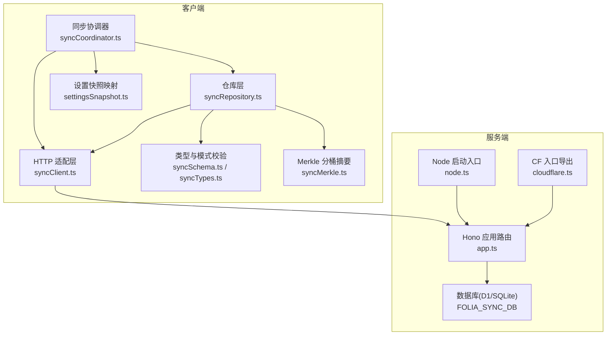
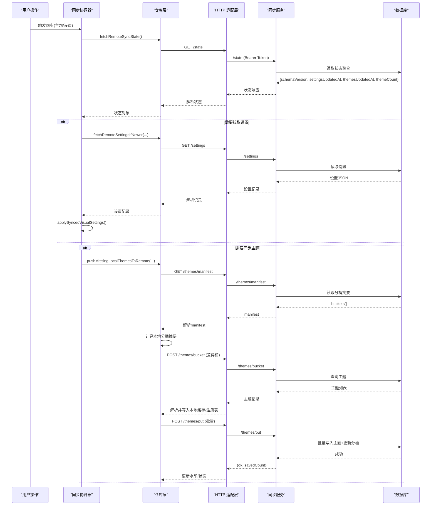
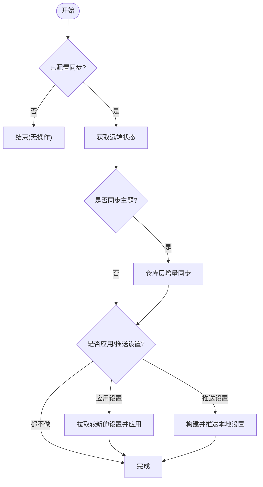
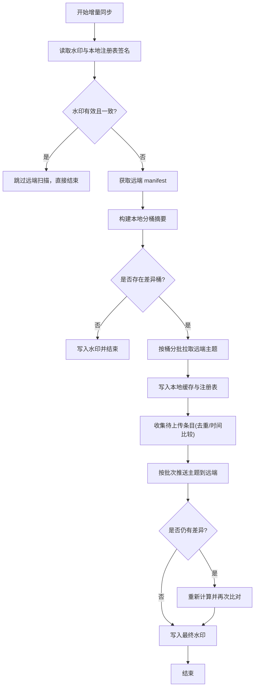
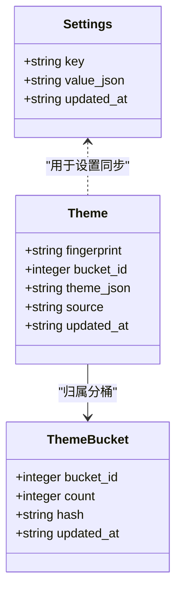
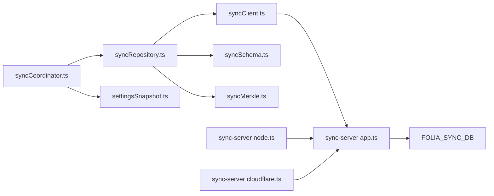

# 同步服务

<cite>
**本文引用的文件**
- [app.ts](file://sync-server/src/app.ts)
- [node.ts](file://sync-server/src/node.ts)
- [cloudflare.ts](file://sync-server/src/cloudflare.ts)
- [package.json](file://sync-server/package.json)
- [wrangler.toml](file://sync-server/wrangler.toml)
- [sync-server.Dockerfile](file://deploy/docker/images/sync-server.Dockerfile)
- [entrypoint.sh](file://deploy/docker/sync-server/entrypoint.sh)
- [syncCoordinator.ts](file://src/services/sync/syncCoordinator.ts)
- [syncClient.ts](file://src/services/sync/syncClient.ts)
- [syncRepository.ts](file://src/services/sync/syncRepository.ts)
- [settingsSnapshot.ts](file://src/services/sync/settingsSnapshot.ts)
- [syncSchema.ts](file://src/services/sync/syncSchema.ts)
- [syncTypes.ts](file://src/services/sync/syncTypes.ts)
- [syncMerkle.ts](file://src/services/sync/syncMerkle.ts)
</cite>

## 目录
1. [简介](#简介)
2. [项目结构](#项目结构)
3. [核心组件](#核心组件)
4. [架构总览](#架构总览)
5. [详细组件分析](#详细组件分析)
6. [依赖关系分析](#依赖关系分析)
7. [性能考虑](#性能考虑)
8. [故障排查指南](#故障排查指南)
9. [结论](#结论)
10. [附录](#附录)

## 简介
本技术文档围绕 Folia Player 的“用户自托管同步服务”展开，系统性解析客户端-服务器模型、增量同步与冲突解决、数据一致性保证、可同步数据类型（主题设置、播放历史、收藏列表等）、云端与本地部署方案（Cloudflare Workers Serverless、Docker 容器化、Node.js 自托管）、同步协议与安全机制（认证、传输安全、数据校验），以及性能优化策略（增量同步、批量传输、缓存）和容错恢复（网络异常、数据冲突）。

## 项目结构
同步能力由“前端客户端层”和“后端同步服务”两部分组成：
- 前端客户端层：负责配置管理、状态协调、增量差异计算、批量上传下载、本地缓存与注册表维护。
- 后端同步服务：基于 Hono 提供 REST API，使用 D1（或本地 SQLite 模拟）持久化设置与主题记录，并维护分桶摘要以支持高效增量同步。

**图示来源**
- [syncCoordinator.ts:1-215](file://src/services/sync/syncCoordinator.ts#L1-L215)
- [syncClient.ts:1-152](file://src/services/sync/syncClient.ts#L1-L152)
- [syncRepository.ts:1-515](file://src/services/sync/syncRepository.ts#L1-L515)
- [syncSchema.ts:1-237](file://src/services/sync/syncSchema.ts#L1-L237)
- [syncTypes.ts:1-115](file://src/services/sync/syncTypes.ts#L1-L115)
- [settingsSnapshot.ts:1-114](file://src/services/sync/settingsSnapshot.ts#L1-L114)
- [syncMerkle.ts:1-50](file://src/services/sync/syncMerkle.ts#L1-L50)
- [app.ts:1-523](file://sync-server/src/app.ts#L1-L523)
- [node.ts:1-85](file://sync-server/src/node.ts#L1-L85)
- [cloudflare.ts:1-3](file://sync-server/src/cloudflare.ts#L1-L3)

**章节来源**
- [syncCoordinator.ts:1-215](file://src/services/sync/syncCoordinator.ts#L1-L215)
- [syncClient.ts:1-152](file://src/services/sync/syncClient.ts#L1-L152)
- [syncRepository.ts:1-515](file://src/services/sync/syncRepository.ts#L1-L515)
- [app.ts:1-523](file://sync-server/src/app.ts#L1-L523)
- [node.ts:1-85](file://sync-server/src/node.ts#L1-L85)
- [cloudflare.ts:1-3](file://sync-server/src/cloudflare.ts#L1-L3)

## 核心组件
- 同步协调器：编排启动时同步、手动触发同步、导入导出、设置拉取与推送。
- HTTP 适配层：封装对远端服务的健康检查、状态查询、设置与主题的读写、分页列举。
- 仓库层：实现增量同步的核心逻辑（水印、分桶差异、批量拉取/推送、本地缓存与注册表维护）。
- 类型与模式校验：防御性解析远端返回数据，确保 schema 兼容与字段合法。
- 设置快照映射：将 UI 设置状态序列化为可同步记录，并在客户端应用远端设置。
- Merkle 分桶摘要：通过分桶计数与哈希快速判断本地与远端主题集合的差异。
- 服务端路由：提供 /state、/settings、/themes/* 等接口，维护 settings、themes、theme_buckets 三张表。

**章节来源**
- [syncCoordinator.ts:1-215](file://src/services/sync/syncCoordinator.ts#L1-L215)
- [syncClient.ts:1-152](file://src/services/sync/syncClient.ts#L1-L152)
- [syncRepository.ts:1-515](file://src/services/sync/syncRepository.ts#L1-L515)
- [syncSchema.ts:1-237](file://src/services/sync/syncSchema.ts#L1-L237)
- [settingsSnapshot.ts:1-114](file://src/services/sync/settingsSnapshot.ts#L1-L114)
- [syncMerkle.ts:1-50](file://src/services/sync/syncMerkle.ts#L1-L50)
- [app.ts:1-523](file://sync-server/src/app.ts#L1-L523)

## 架构总览
采用客户端-服务器模型：
- 客户端通过 Bearer Token 认证访问服务端 REST API。
- 服务端使用 D1（或本地 SQLite 模拟）存储设置与主题，并通过分桶摘要加速增量同步。
- 客户端在本地维护“主题注册表”与“水印”，结合远端 manifest 进行分桶差异比较，仅拉取/推送变更部分。

**图示来源**
- [syncCoordinator.ts:95-150](file://src/services/sync/syncCoordinator.ts#L95-L150)
- [syncRepository.ts:146-459](file://src/services/sync/syncRepository.ts#L146-L459)
- [syncClient.ts:64-151](file://src/services/sync/syncClient.ts#L64-L151)
- [app.ts:326-518](file://sync-server/src/app.ts#L326-L518)

## 详细组件分析

### 同步协调器（syncCoordinator.ts）
- 职责：初始化同步、测试连接、拉取远端设置、执行主题同步、导出/导入库包。
- 关键流程：
  - 启动时调用一次轻量主题同步（默认不应用远端设置、不推送本地设置）。
  - 手动同步时按选项决定是否应用远端设置与推送本地设置。
  - 导出/导入支持将本地与远端主题合并为统一包，便于迁移与备份。

**图示来源**
- [syncCoordinator.ts:50-150](file://src/services/sync/syncCoordinator.ts#L50-L150)

**章节来源**
- [syncCoordinator.ts:1-215](file://src/services/sync/syncCoordinator.ts#L1-L215)

### HTTP 适配层（syncClient.ts）
- 职责：封装所有与同步服务的 HTTP 交互，统一添加 Authorization 头、错误处理与响应解析。
- 主要方法：
  - 健康检查、状态查询、设置读写、主题批量获取/提交、按桶获取、分页列举。
- 错误处理：非 2xx 响应抛出带状态码的错误；204 返回 null。

**章节来源**
- [syncClient.ts:1-152](file://src/services/sync/syncClient.ts#L1-L152)

### 仓库层（syncRepository.ts）
- 职责：实现增量同步算法、本地缓存与注册表维护、水印机制、批量拉取/推送。
- 关键设计：
  - 水印：记录远端主题更新时间、主题数量与本地注册表签名，避免重复扫描。
  - 分桶差异：对比本地与远端分桶摘要（count/hash/updatedAt），仅处理差异桶。
  - 批量拉取：按桶分批请求，限制单次大小，降低带宽与内存压力。
  - 批量推送：按固定批次大小提交主题，减少请求次数。
  - 本地缓存：主题内容存入缓存，注册表记录指纹、缓存键、更新时间与来源。
  - 历史兼容：自动迁移旧版网易云主题同步记录。

**图示来源**
- [syncRepository.ts:335-459](file://src/services/sync/syncRepository.ts#L335-L459)

**章节来源**
- [syncRepository.ts:1-515](file://src/services/sync/syncRepository.ts#L1-L515)

### 设置快照映射（settingsSnapshot.ts）
- 职责：将 UI 设置状态序列化为可同步记录，并将远端设置应用到本地状态。
- 覆盖范围：可视化器模式、背景模式、透明度、字幕显示、字体样式与回退族、各可视化器调优参数、主页布局与卡片风格等。

**章节来源**
- [settingsSnapshot.ts:1-114](file://src/services/sync/settingsSnapshot.ts#L1-L114)

### 类型与模式校验（syncSchema.ts / syncTypes.ts）
- 职责：防御性解析远端 JSON，确保 schemaVersion 兼容、字段类型与取值合法。
- 关键点：
  - 严格校验设置记录、主题记录、远端状态、主题清单、导出包结构。
  - 对可选字段进行空值与边界值保护，避免脏数据污染本地状态。

**章节来源**
- [syncSchema.ts:1-237](file://src/services/sync/syncSchema.ts#L1-L237)
- [syncTypes.ts:1-115](file://src/services/sync/syncTypes.ts#L1-L115)

### Merkle 分桶摘要（syncMerkle.ts）
- 职责：为每个指纹生成稳定分桶 ID，统计每桶的主题数量、最新更新时间与 XOR 哈希。
- 用途：快速判断本地与远端主题集合是否一致，定位差异桶，减少不必要的数据传输。

**章节来源**
- [syncMerkle.ts:1-50](file://src/services/sync/syncMerkle.ts#L1-L50)

### 服务端路由与数据模型（app.ts）
- 路由：
  - /health：健康检查，返回 schemaVersion 与后端标识。
  - /state：返回设置更新时间、主题更新时间与主题总数。
  - /settings：GET 读取、PUT 写入视觉设置（基于 updated_at 的乐观更新）。
  - /themes/get：按指纹批量获取主题。
  - /themes/put：批量写入主题，同时更新分桶摘要（count/hash/updated_at）。
  - /themes/bucket：按桶 ID 批量获取主题。
  - /themes/list：游标分页列举主题。
- 数据模型：
  - settings：key/value_json/updated_at。
  - themes：fingerprint/bucket_id/theme_json/source/updated_at。
  - theme_buckets：bucket_id/count/hash/updated_at。
- 安全：
  - 全局 CORS 允许跨域。
  - 所有 API 路由受 Bearer Token 保护。
  - 强制 SYNC_TOKEN 长度至少 8 位。

**图示来源**
- [app.ts:47-76](file://sync-server/src/app.ts#L47-L76)

**章节来源**
- [app.ts:1-523](file://sync-server/src/app.ts#L1-L523)

## 依赖关系分析
- 客户端依赖：
  - 协调器依赖仓库层与设置快照映射。
  - 仓库层依赖 HTTP 适配层、类型校验、Merke 分桶摘要、本地缓存与注册表。
- 服务端依赖：
  - Hono 路由与中间件（CORS、Bearer 认证）。
  - D1/SQLite 数据库抽象，批处理语句提升写入性能。
  - Node 启动入口加载 .env 环境变量，绑定数据库与令牌。

**图示来源**
- [syncCoordinator.ts:1-215](file://src/services/sync/syncCoordinator.ts#L1-L215)
- [syncRepository.ts:1-515](file://src/services/sync/syncRepository.ts#L1-L515)
- [syncClient.ts:1-152](file://src/services/sync/syncClient.ts#L1-L152)
- [syncSchema.ts:1-237](file://src/services/sync/syncSchema.ts#L1-L237)
- [syncMerkle.ts:1-50](file://src/services/sync/syncMerkle.ts#L1-L50)
- [app.ts:1-523](file://sync-server/src/app.ts#L1-L523)
- [node.ts:1-85](file://sync-server/src/node.ts#L1-L85)
- [cloudflare.ts:1-3](file://sync-server/src/cloudflare.ts#L1-L3)

**章节来源**
- [syncCoordinator.ts:1-215](file://src/services/sync/syncCoordinator.ts#L1-L215)
- [syncRepository.ts:1-515](file://src/services/sync/syncRepository.ts#L1-L515)
- [app.ts:1-523](file://sync-server/src/app.ts#L1-L523)
- [node.ts:1-85](file://sync-server/src/node.ts#L1-L85)

## 性能考虑
- 增量同步：
  - 通过水印与分桶摘要避免全量扫描，仅在差异桶间拉取主题。
  - 使用游标分页列举主题，控制单次页面大小。
- 批量传输：
  - 主题批量提交与按桶批量获取，减少请求次数与握手开销。
  - 服务端使用批处理语句写入主题与更新分桶摘要。
- 缓存策略：
  - 本地缓存主题内容，注册表记录指纹与缓存键，避免重复下载。
  - 设置应用前进行防御性解析，减少无效更新。
- 压缩与体积：
  - 当前未启用显式压缩；可通过网关（如 Nginx）开启 gzip/br 以提升传输效率。
- 并发与限流：
  - 客户端按批次顺序提交，避免瞬时高并发；可根据网络状况调整批次大小。

[本节为通用指导，无需特定文件引用]

## 故障排查指南
- 认证失败：
  - 确认客户端配置的 workerBaseUrl 与 authToken 与服务端 SYNC_TOKEN 一致。
  - 服务端会拒绝弱口令（少于 8 位），需调整配置。
- 网络异常：
  - 客户端在非 2xx 响应时抛出带状态码的错误；上层应捕获并重试。
  - 建议在网络不稳定时增加重试与退避策略。
- 数据不一致：
  - 若出现主题不一致，检查水印是否被正确写入；必要时清除水印后重新同步。
  - 服务端基于 updated_at 的乐观更新，确保客户端携带正确的更新时间戳。
- 数据库问题：
  - 自托管 Node 环境需确保 .env 中 SYNC_TOKEN 存在且满足长度要求。
  - Docker 镜像暴露端口与数据卷挂载路径，确保持久化目录可写。

**章节来源**
- [syncClient.ts:38-62](file://src/services/sync/syncClient.ts#L38-L62)
- [app.ts:129-143](file://sync-server/src/app.ts#L129-L143)
- [node.ts:31-45](file://sync-server/src/node.ts#L31-L45)

## 结论
该同步服务通过客户端-服务器模型、分桶摘要与水印机制实现了高效的增量同步与冲突解决；通过严格的类型校验与基于时间的乐观更新保障数据一致性；支持多种部署方式以满足不同场景需求。建议在网关层启用压缩与限流，客户端侧完善重试与退避策略，以获得更稳定的同步体验。

[本节为总结性内容，无需特定文件引用]

## 附录

### 部署方案
- Cloudflare Workers Serverless：
  - 入口导出应用，绑定 D1 数据库，配置 wrangler 与密钥。
- Docker 容器化：
  - 多阶段构建，生产镜像暴露端口与数据卷，使用 entrypoint 以非 root 运行。
- Node.js 自托管：
  - 从 .env 加载环境变量，启动本地 SQLite 模拟 D1，监听端口提供服务。

**章节来源**
- [wrangler.toml:1-13](file://sync-server/wrangler.toml#L1-L13)
- [sync-server.Dockerfile:1-36](file://deploy/docker/images/sync-server.Dockerfile#L1-L36)
- [entrypoint.sh:1-7](file://deploy/docker/sync-server/entrypoint.sh#L1-L7)
- [node.ts:1-85](file://sync-server/src/node.ts#L1-L85)
- [package.json:1-34](file://sync-server/package.json#L1-L34)

### 同步协议与安全机制
- 认证：
  - 客户端通过 Authorization: Bearer <token> 访问 API。
  - 服务端强制校验 token 长度，防止弱口令。
- 传输安全：
  - 建议使用 HTTPS 或 TLS 终止于网关；当前代码启用 CORS 允许跨域。
- 数据校验：
  - 客户端对远端返回进行防御性解析，确保 schema 兼容与字段合法。
  - 服务端对输入进行严格校验，非法数据将被拒绝。

**章节来源**
- [syncClient.ts:38-62](file://src/services/sync/syncClient.ts#L38-L62)
- [app.ts:121-143](file://sync-server/src/app.ts#L121-L143)
- [syncSchema.ts:1-237](file://src/services/sync/syncSchema.ts#L1-L237)

### 可同步数据类型
- 主题设置：
  - 包括可视化器模式、背景模式、透明度、字幕显示、字体样式与回退族、各可视化器调优参数、主页布局与卡片风格等。
- 主题内容：
  - 以指纹为键，包含主题 JSON、更新时间与来源（手动/自动/回退/编辑）。
- 播放历史与收藏列表：
  - 当前仓库未实现相关同步接口；如需扩展，可在服务端新增对应表与客户端相应 API。

**章节来源**
- [settingsSnapshot.ts:1-114](file://src/services/sync/settingsSnapshot.ts#L1-L114)
- [syncTypes.ts:27-80](file://src/services/sync/syncTypes.ts#L27-L80)
- [app.ts:47-76](file://sync-server/src/app.ts#L47-L76)