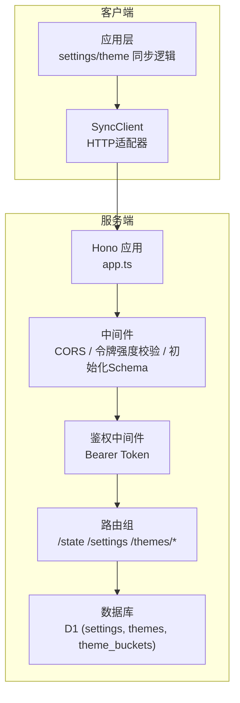
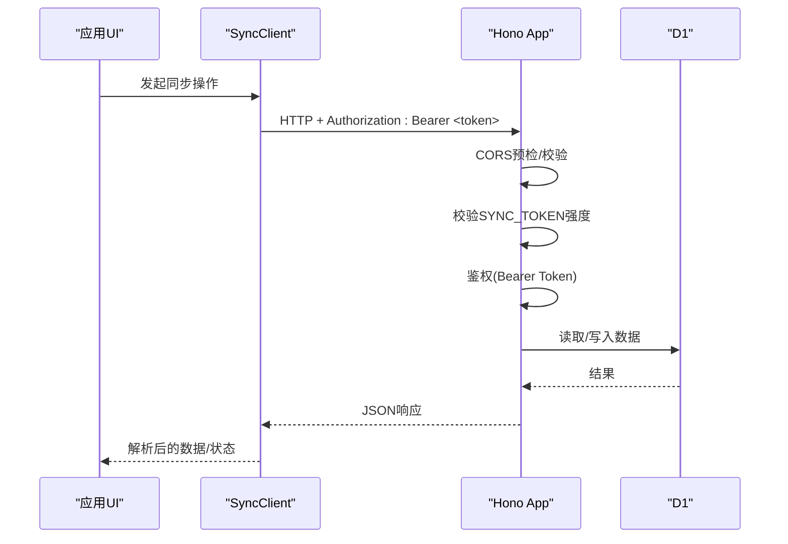
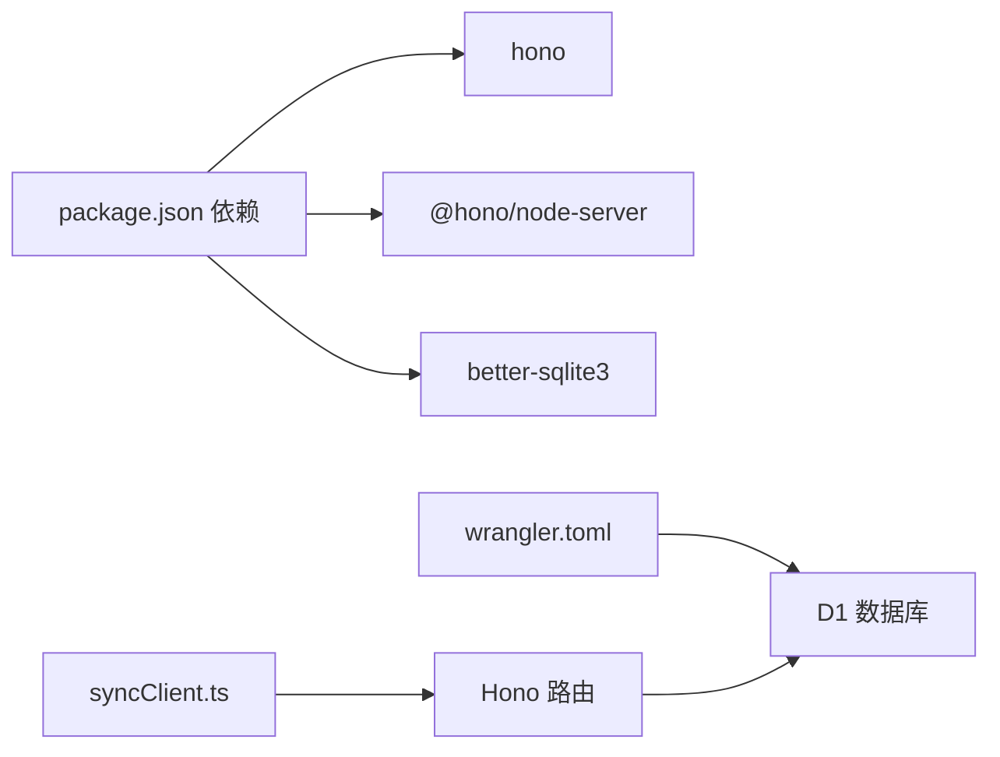

# API接口设计

<cite>
**本文引用的文件**
- [sync-server/src/app.ts](file://sync-server/src/app.ts)
- [sync-server/package.json](file://sync-server/package.json)
- [sync-server/wrangler.toml](file://sync-server/wrangler.toml)
- [src/services/sync/syncClient.ts](file://src/services/sync/syncClient.ts)
- [src/services/sync/syncTypes.ts](file://src/services/sync/syncTypes.ts)
- [src/services/sync/settingsSnapshot.ts](file://src/services/sync/settingsSnapshot.ts)
</cite>

## 目录
1. [简介](#简介)
2. [项目结构](#项目结构)
3. [核心组件](#核心组件)
4. [架构总览](#架构总览)
5. [详细端点分析](#详细端点分析)
6. [依赖关系分析](#依赖关系分析)
7. [性能与扩展性](#性能与扩展性)
8. [故障排查指南](#故障排查指南)
9. [结论](#结论)
10. [附录：API参考与调用示例](#附录api参考与调用示例)

## 简介
本技术文档面向Folia Player同步服务（基于Hono的RESTful API），全面解析认证机制（Bearer Token）、CORS配置、以及所有核心端点的设计原理与实现细节。涵盖健康检查、状态查询、设置同步、主题管理（manifest、get、put、bucket、list）等接口，说明请求/响应格式、参数校验规则、错误处理策略，并提供完整的调用示例与安全最佳实践。

## 项目结构
同步服务后端位于 sync-server 目录，使用 Hono 框架提供 RESTful API，并通过 Cloudflare D1（或本地模拟D1）持久化数据。前端通过 src/services/sync 下的客户端库与后端交互。

图表来源
- [sync-server/src/app.ts:1-143](file://sync-server/src/app.ts#L1-L143)
- [src/services/sync/syncClient.ts:34-62](file://src/services/sync/syncClient.ts#L34-L62)

章节来源
- [sync-server/src/app.ts:1-143](file://sync-server/src/app.ts#L1-L143)
- [sync-server/package.json:1-34](file://sync-server/package.json#L1-L34)
- [sync-server/wrangler.toml:1-13](file://sync-server/wrangler.toml#L1-L13)

## 核心组件
- Hono 应用与全局中间件：启用CORS、校验SYNC_TOKEN强度、按需初始化数据库Schema。
- 鉴权中间件：对 /state、/settings、/themes/* 等API路径统一进行Bearer Token验证。
- 数据模型与持久化：
  - settings：键值存储，key固定为“visual”，value_json保存可视化设置JSON，updated_at记录更新时间。
  - themes：按fingerprint分桶存储主题，包含source与updated_at。
  - theme_buckets：维护每个桶的count、hash、updated_at，用于增量同步与清单查询。
- 客户端适配：统一封装fetch请求，自动附加Authorization头，并做基础类型解析与错误包装。

章节来源
- [sync-server/src/app.ts:121-143](file://sync-server/src/app.ts#L121-L143)
- [sync-server/src/app.ts:318-324](file://sync-server/src/app.ts#L318-L324)
- [sync-server/src/app.ts:47-78](file://sync-server/src/app.ts#L47-L78)
- [src/services/sync/syncClient.ts:34-62](file://src/services/sync/syncClient.ts#L34-L62)

## 架构总览
整体采用“客户端-服务端”分离架构：
- 客户端通过SyncClient以Bearer Token访问后端API。
- 服务端通过Hono中间件链完成CORS、安全校验、鉴权与路由分发。
- 数据层使用D1表结构保障一致性，并通过批量写入与分桶索引优化大规模主题同步。

图表来源
- [sync-server/src/app.ts:121-143](file://sync-server/src/app.ts#L121-L143)
- [sync-server/src/app.ts:318-324](file://sync-server/src/app.ts#L318-L324)
- [src/services/sync/syncClient.ts:34-62](file://src/services/sync/syncClient.ts#L34-L62)

## 详细端点分析

### 通用约定
- 认证：除根路径外的API均需要Authorization: Bearer <SYNC_TOKEN>。
- 内容类型：请求体为application/json；响应为application/json。
- CORS：允许跨域，支持GET/POST/PUT/OPTIONS，允许Authorization与Content-Type头。
- 版本：schemaVersion用于前后端协议兼容。

章节来源
- [sync-server/src/app.ts:121-143](file://sync-server/src/app.ts#L121-L143)
- [sync-server/src/app.ts:318-324](file://sync-server/src/app.ts#L318-L324)

### GET /health
- 功能：健康检查，返回服务可用性与后端标识。
- 认证：不需要。
- 请求：无。
- 响应：
  - ok: boolean
  - schemaVersion: number
  - backend: string
- 错误：无业务错误；若环境未正确配置（如缺少TOKEN），会在其他受保护路由触发。

章节来源
- [sync-server/src/app.ts:316-316](file://sync-server/src/app.ts#L316-L316)

### GET /state
- 功能：查询远端同步状态，包括设置最后更新时间、主题最后更新时间与主题总数。
- 认证：需要Bearer Token。
- 请求：无。
- 响应：
  - schemaVersion: number
  - settingsUpdatedAt: string|null
  - themesUpdatedAt: string|null
  - themeCount: number
- 错误：鉴权失败时由中间件返回401。

章节来源
- [sync-server/src/app.ts:326-340](file://sync-server/src/app.ts#L326-L340)

### GET /settings
- 功能：获取已同步的可视化设置快照。
- 认证：需要Bearer Token。
- 请求：无。
- 响应：null 或 对象（对应SyncedVisualSettings）。
- 错误：鉴权失败返回401。

章节来源
- [sync-server/src/app.ts:342-348](file://sync-server/src/app.ts#L342-L348)

### PUT /settings
- 功能：同步设置快照，覆盖更新。
- 认证：需要Bearer Token。
- 请求体：
  - schemaVersion: number（必须等于服务端SCHEMA_VERSION）
  - updatedAt: string（ISO时间字符串）
  - data: object（可视化设置字段集合）
- 响应：{ ok: true }
- 错误：
  - 400 invalid_settings：当请求体缺失或字段不合法（schemaVersion不匹配、updatedAt非字符串、data非对象）。
- 语义：仅当传入的updatedAt大于等于已有记录时才更新，避免回滚。

章节来源
- [sync-server/src/app.ts:352-371](file://sync-server/src/app.ts#L352-L371)

### GET /themes/manifest
- 功能：获取主题清单，包含各桶的计数、哈希与更新时间，用于客户端增量同步。
- 认证：需要Bearer Token。
- 请求：无。
- 响应：
  - schemaVersion: number
  - bucketCount: number
  - buckets: 数组，每项含 bucketId、count、hash、updatedAt
- 错误：鉴权失败返回401。

章节来源
- [sync-server/src/app.ts:104-119](file://sync-server/src/app.ts#L104-L119)
- [sync-server/src/app.ts:350-350](file://sync-server/src/app.ts#L350-L350)

### POST /themes/get
- 功能：批量获取指定指纹的主题。
- 认证：需要Bearer Token。
- 请求体：
  - fingerprints: string[]（去重、过滤空串，最多500条）
- 响应：{ themes: SyncedThemeRecord[] }
- 错误：鉴权失败返回401。

章节来源
- [sync-server/src/app.ts:373-386](file://sync-server/src/app.ts#L373-L386)

### POST /themes/put
- 功能：批量写入主题，支持增量更新与桶统计维护。
- 认证：需要Bearer Token。
- 请求体：
  - themes: 数组，每项需包含 fingerprint、theme、updatedAt、source（可选，默认manual）
- 响应：{ ok: true, savedCount: number }
- 错误：
  - 400 invalid_themes：当任一主题项不合法或超过批次上限（500）。
- 行为：
  - 根据fingerprint计算bucket_id，更新themes表。
  - 维护theme_buckets的count、hash、updated_at，用于增量同步。
  - 使用批处理语句减少IO开销。

章节来源
- [sync-server/src/app.ts:80-93](file://sync-server/src/app.ts#L80-L93)
- [sync-server/src/app.ts:388-474](file://sync-server/src/app.ts#L388-L474)

### POST /themes/bucket
- 功能：按桶ID批量拉取主题，适合增量同步场景。
- 认证：需要Bearer Token。
- 请求体：
  - bucketIds: number[]（整数且范围[0, 255]，最多32个）
- 响应：{ themes: SyncedThemeRecord[] }
- 错误：鉴权失败返回401。

章节来源
- [sync-server/src/app.ts:476-494](file://sync-server/src/app.ts#L476-L494)

### POST /themes/list
- 功能：分页列出主题，基于fingerprint游标排序。
- 认证：需要Bearer Token。
- 请求体：
  - cursor: string（可选，初始为空字符串）
  - limit: number（默认500，最大1000）
- 响应：
  - themes: SyncedThemeRecord[]
  - cursor: string|null（下一页游标）
- 错误：鉴权失败返回401。

章节来源
- [sync-server/src/app.ts:496-518](file://sync-server/src/app.ts#L496-L518)

## 依赖关系分析
- 运行时依赖：
  - hono：Web框架与中间件生态。
  - @hono/node-server：Node.js运行环境适配。
  - better-sqlite3：本地开发/测试用SQLite引擎（在Node模式下）。
- 部署配置：
  - wrangler.toml：Cloudflare Workers配置，绑定D1数据库。
- 客户端依赖：
  - 前端通过SyncClient统一封装HTTP请求与类型解析。

图表来源
- [sync-server/package.json:20-24](file://sync-server/package.json#L20-L24)
- [sync-server/wrangler.toml:5-12](file://sync-server/wrangler.toml#L5-L12)
- [src/services/sync/syncClient.ts:34-62](file://src/services/sync/syncClient.ts#L34-L62)

章节来源
- [sync-server/package.json:1-34](file://sync-server/package.json#L1-L34)
- [sync-server/wrangler.toml:1-13](file://sync-server/wrangler.toml#L1-L13)

## 性能与扩展性
- 批量写入：/themes/put 使用批处理语句减少数据库往返。
- 分桶索引：按fingerprint哈希到固定数量桶，提升增量同步效率。
- 限制与防抖：
  - 主题批量上限500，桶请求上限32，列表分页limit上限1000。
  - 输入去重与类型校验，避免恶意或异常负载。
- 可扩展点：
  - 可引入缓存层（如Redis）加速热点清单查询。
  - 可增加限流中间件防止滥用。
  - 可审计日志接入集中式日志系统。

[本节为通用指导，无需具体文件引用]

## 故障排查指南
- 401 未授权：
  - 检查Authorization头是否正确携带Bearer Token。
  - 确认服务端SYNC_TOKEN已配置且长度≥8。
- 400 invalid_settings：
  - 确保请求体包含schemaVersion、updatedAt与data字段，且类型正确。
- 400 invalid_themes：
  - 检查themes数组中每项是否包含fingerprint、theme、updatedAt，source可选。
  - 控制批次大小不超过500。
- 连接失败：
  - 检查workerBaseUrl是否正确，网络可达。
  - 确认CORS允许的来源与方法。

章节来源
- [sync-server/src/app.ts:129-135](file://sync-server/src/app.ts#L129-L135)
- [sync-server/src/app.ts:352-371](file://sync-server/src/app.ts#L352-L371)
- [sync-server/src/app.ts:388-393](file://sync-server/src/app.ts#L388-L393)

## 结论
该同步服务API以Hono为核心，结合严格的Bearer Token鉴权与CORS配置，提供了健壮的设置与主题同步能力。通过分桶与批量写入优化了大规模主题同步的性能与可靠性。前端通过统一的SyncClient简化了调用与错误处理。建议在生产环境中强化令牌管理、输入校验与监控告警，以确保服务的安全与稳定。

[本节为总结，无需具体文件引用]

## 附录：API参考与调用示例

### 认证与CORS
- 认证：Authorization: Bearer <SYNC_TOKEN>
- CORS：允许Origin *，方法GET/POST/PUT/OPTIONS，头Authorization/Content-Type

章节来源
- [sync-server/src/app.ts:121-127](file://sync-server/src/app.ts#L121-L127)
- [sync-server/src/app.ts:318-324](file://sync-server/src/app.ts#L318-L324)

### 端点速查
- GET /health
  - 响应：{ ok, schemaVersion, backend }
- GET /state
  - 响应：{ schemaVersion, settingsUpdatedAt, themesUpdatedAt, themeCount }
- GET /settings
  - 响应：null 或 可视化设置对象
- PUT /settings
  - 请求体：{ schemaVersion, updatedAt, data }
  - 响应：{ ok: true }
- GET /themes/manifest
  - 响应：{ schemaVersion, bucketCount, buckets }
- POST /themes/get
  - 请求体：{ fingerprints: string[] }
  - 响应：{ themes: SyncedThemeRecord[] }
- POST /themes/put
  - 请求体：{ themes: [{ fingerprint, theme, updatedAt, source? }] }
  - 响应：{ ok: true, savedCount }
- POST /themes/bucket
  - 请求体：{ bucketIds: number[] }
  - 响应：{ themes: SyncedThemeRecord[] }
- POST /themes/list
  - 请求体：{ cursor?, limit? }
  - 响应：{ themes, cursor }

章节来源
- [sync-server/src/app.ts:316-518](file://sync-server/src/app.ts#L316-L518)

### 调用示例（概念性）
- 健康检查
  - 方法：GET
  - URL：/health
  - 响应：{ ok: true, schemaVersion: 1, backend: "hono-sync" }
- 获取状态
  - 方法：GET
  - URL：/state
  - 头：Authorization: Bearer <token>
  - 响应：{ schemaVersion: 1, settingsUpdatedAt: "...", themesUpdatedAt: "...", themeCount: 123 }
- 同步设置
  - 方法：PUT
  - URL：/settings
  - 头：Authorization: Bearer <token>, Content-Type: application/json
  - 请求体：{ schemaVersion: 1, updatedAt: "2024-01-01T00:00:00Z", data: { ... } }
  - 响应：{ ok: true }
- 获取主题清单
  - 方法：GET
  - URL：/themes/manifest
  - 头：Authorization: Bearer <token>
  - 响应：{ schemaVersion: 1, bucketCount: 256, buckets: [...] }
- 批量获取主题
  - 方法：POST
  - URL：/themes/get
  - 头：Authorization: Bearer <token>, Content-Type: application/json
  - 请求体：{ fingerprints: ["fp1","fp2"] }
  - 响应：{ themes: [...] }
- 批量写入主题
  - 方法：POST
  - URL：/themes/put
  - 头：Authorization: Bearer <token>, Content-Type: application/json
  - 请求体：{ themes: [{ fingerprint:"fp1", theme:{...}, updatedAt:"...", source:"auto" }] }
  - 响应：{ ok: true, savedCount: 1 }
- 按桶获取主题
  - 方法：POST
  - URL：/themes/bucket
  - 头：Authorization: Bearer <token>, Content-Type: application/json
  - 请求体：{ bucketIds: [0,1] }
  - 响应：{ themes: [...] }
- 分页列出主题
  - 方法：POST
  - URL：/themes/list
  - 头：Authorization: Bearer <token>, Content-Type: application/json
  - 请求体：{ cursor: "", limit: 500 }
  - 响应：{ themes: [...], cursor: "next-fp" }

章节来源
- [sync-server/src/app.ts:316-518](file://sync-server/src/app.ts#L316-L518)
- [src/services/sync/syncClient.ts:64-151](file://src/services/sync/syncClient.ts#L64-L151)

### 安全与最佳实践
- 令牌管理
  - SYNC_TOKEN长度至少8位，建议使用强随机字符串。
  - 生产环境通过环境变量或密钥管理服务注入。
- 输入校验
  - 严格校验schemaVersion、updatedAt、数据类型与范围。
  - 限制批量大小与分页上限，防止资源耗尽。
- 传输安全
  - 强制HTTPS，避免明文传输Token。
- 审计与监控
  - 记录关键操作日志（如设置更新、主题写入）。
  - 监控错误率与延迟，及时告警。

章节来源
- [sync-server/src/app.ts:129-135](file://sync-server/src/app.ts#L129-L135)
- [sync-server/src/app.ts:352-371](file://sync-server/src/app.ts#L352-L371)
- [sync-server/src/app.ts:388-393](file://sync-server/src/app.ts#L388-L393)