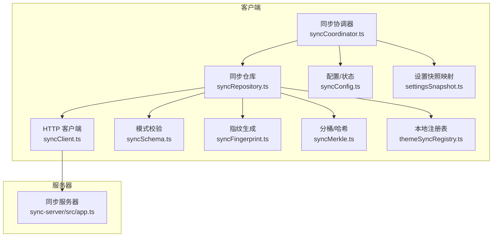
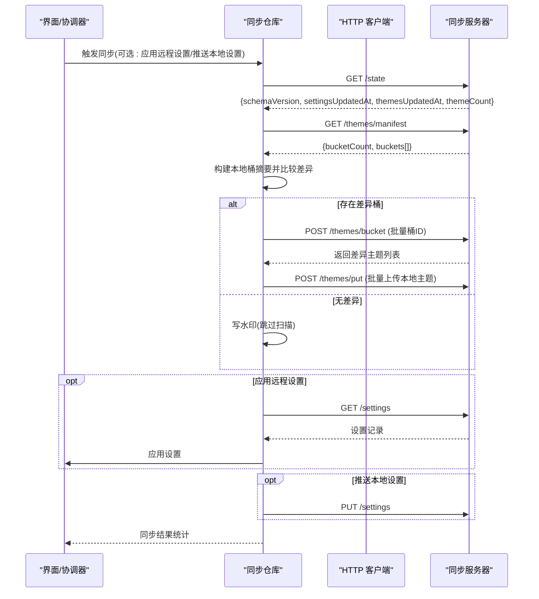
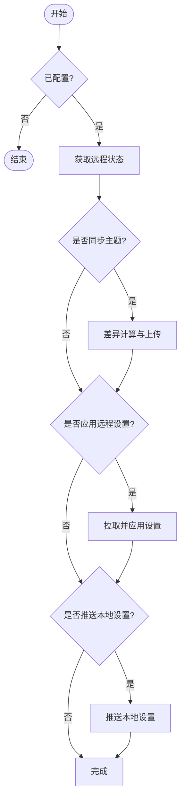
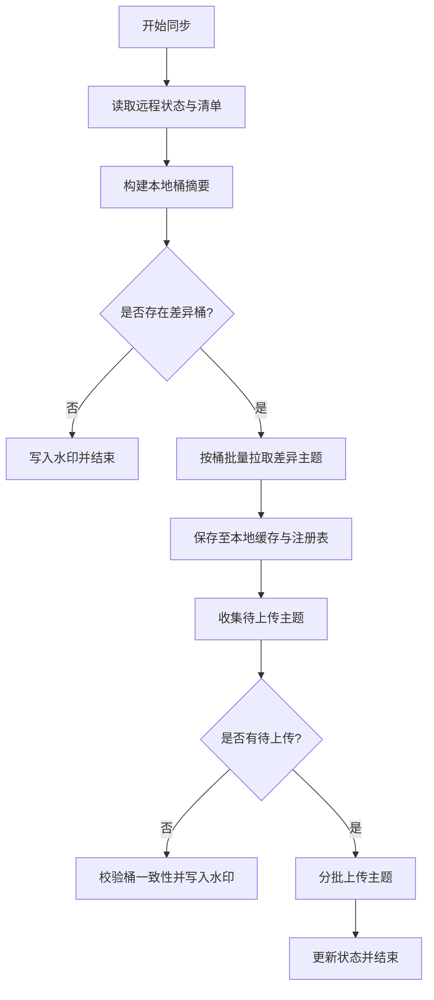
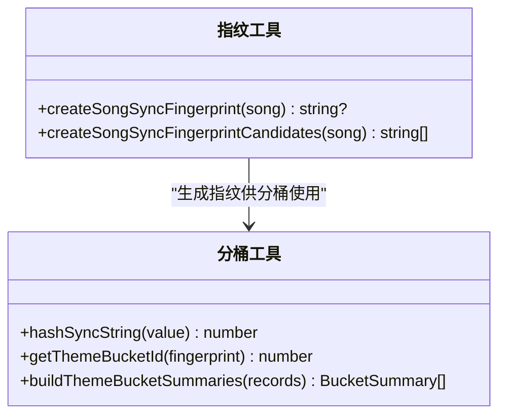
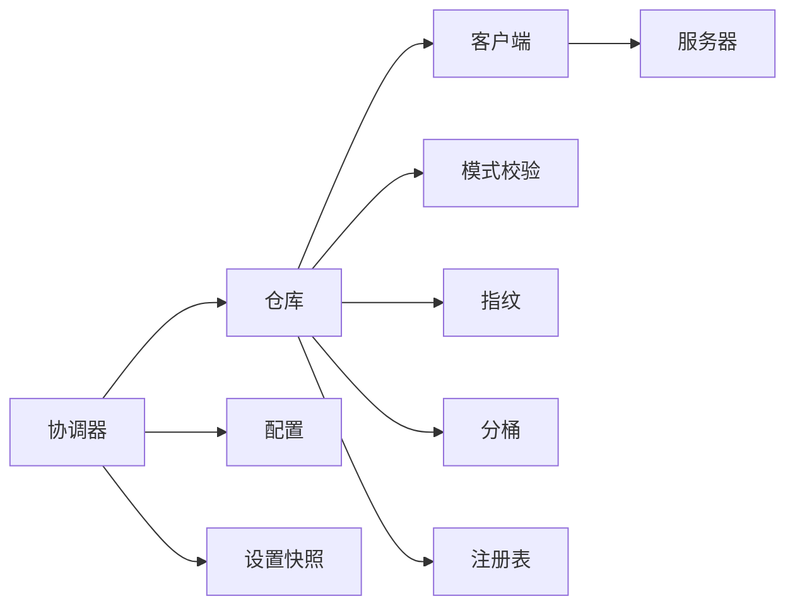

# 同步协议

<cite>
**本文引用的文件**
- [syncCoordinator.ts](file://src/services/sync/syncCoordinator.ts)
- [syncClient.ts](file://src/services/sync/syncClient.ts)
- [syncRepository.ts](file://src/services/sync/syncRepository.ts)
- [syncTypes.ts](file://src/services/sync/syncTypes.ts)
- [syncSchema.ts](file://src/services/sync/syncSchema.ts)
- [syncConfig.ts](file://src/services/sync/syncConfig.ts)
- [settingsSnapshot.ts](file://src/services/sync/settingsSnapshot.ts)
- [syncFingerprint.ts](file://src/services/sync/syncFingerprint.ts)
- [syncMerkle.ts](file://src/services/sync/syncMerkle.ts)
- [themeSyncRegistry.ts](file://src/services/sync/themeSyncRegistry.ts)
- [app.ts](file://sync-server/src/app.ts)
</cite>

## 目录
1. [简介](#简介)
2. [项目结构](#项目结构)
3. [核心组件](#核心组件)
4. [架构总览](#架构总览)
5. [详细组件分析](#详细组件分析)
6. [依赖关系分析](#依赖关系分析)
7. [性能考量](#性能考量)
8. [故障排查指南](#故障排查指南)
9. [结论](#结论)
10. [附录：数据交换格式示例](#附录数据交换格式示例)

## 简介
本技术文档面向 Folia Player 的“主题与设置”跨设备同步协议，覆盖客户端-服务器端的设计原理、增量同步算法、冲突解决策略、版本控制机制；并深入解析同步协调器的工作流程（状态检查、差异计算、批量数据传输）、主题分桶算法（指纹哈希、桶ID分配、增量更新检测）、断点续传、重试策略与错误恢复方案。文末提供协议流程图与数据交换格式示例，以及性能优化建议与最佳实践。

## 项目结构
同步功能由前端服务层与用户自托管的同步服务器组成：
- 前端服务层位于 src/services/sync，包含协调器、HTTP 客户端、仓库、类型与模式校验、指纹与分桶工具、本地注册表等模块。
- 同步服务器位于 sync-server/src/app.ts，基于 Hono 实现 REST API，使用 D1 数据库持久化设置与主题记录，并提供主题清单与按桶拉取能力。

**图表来源**
- [syncCoordinator.ts:1-215](file://src/services/sync/syncCoordinator.ts#L1-L215)
- [syncRepository.ts:1-515](file://src/services/sync/syncRepository.ts#L1-L515)
- [syncClient.ts:1-152](file://src/services/sync/syncClient.ts#L1-L152)
- [syncSchema.ts:1-237](file://src/services/sync/syncSchema.ts#L1-L237)
- [syncFingerprint.ts:1-103](file://src/services/sync/syncFingerprint.ts#L1-L103)
- [syncMerkle.ts:1-50](file://src/services/sync/syncMerkle.ts#L1-L50)
- [themeSyncRegistry.ts:1-210](file://src/services/sync/themeSyncRegistry.ts#L1-L210)
- [syncConfig.ts:1-111](file://src/services/sync/syncConfig.ts#L1-L111)
- [settingsSnapshot.ts:1-114](file://src/services/sync/settingsSnapshot.ts#L1-L114)
- [app.ts:1-523](file://sync-server/src/app.ts#L1-L523)

**章节来源**
- [syncCoordinator.ts:1-215](file://src/services/sync/syncCoordinator.ts#L1-L215)
- [syncRepository.ts:1-515](file://src/services/sync/syncRepository.ts#L1-L515)
- [syncClient.ts:1-152](file://src/services/sync/syncClient.ts#L1-L152)
- [syncSchema.ts:1-237](file://src/services/sync/syncSchema.ts#L1-L237)
- [syncFingerprint.ts:1-103](file://src/services/sync/syncFingerprint.ts#L1-L103)
- [syncMerkle.ts:1-50](file://src/services/sync/syncMerkle.ts#L1-L50)
- [themeSyncRegistry.ts:1-210](file://src/services/sync/themeSyncRegistry.ts#L1-L210)
- [syncConfig.ts:1-111](file://src/services/sync/syncConfig.ts#L1-L111)
- [settingsSnapshot.ts:1-114](file://src/services/sync/settingsSnapshot.ts#L1-L114)
- [app.ts:1-523](file://sync-server/src/app.ts#L1-L523)

## 核心组件
- 同步协调器：负责启动时自动同步、手动触发同步、导出/导入库包、应用远程设置等编排逻辑。
- HTTP 客户端：封装对同步服务器的请求，统一鉴权、响应解析与错误处理。
- 同步仓库：高级同步操作，包括状态获取、增量差异计算、按桶拉取、批量上传、本地缓存与注册表维护。
- 指纹与分桶：为歌曲生成稳定指纹，将主题记录映射到固定数量的桶中，用于高效差异比对。
- 设置快照：将 UI 设置映射为可同步的 JSON 文档，并在接收时安全地应用到本地状态。
- 本地注册表：跟踪本地可同步的主题缓存条目，支持历史迁移与去重。
- 配置与状态：持久化同步配置与运行时状态，提供事件通知。
- 服务器端：提供健康检查、状态查询、设置读写、主题清单、按指纹/桶批量读取/写入、分页列表等接口。

**章节来源**
- [syncCoordinator.ts:1-215](file://src/services/sync/syncCoordinator.ts#L1-L215)
- [syncClient.ts:1-152](file://src/services/sync/syncClient.ts#L1-L152)
- [syncRepository.ts:1-515](file://src/services/sync/syncRepository.ts#L1-L515)
- [syncFingerprint.ts:1-103](file://src/services/sync/syncFingerprint.ts#L1-L103)
- [syncMerkle.ts:1-50](file://src/services/sync/syncMerkle.ts#L1-L50)
- [settingsSnapshot.ts:1-114](file://src/services/sync/settingsSnapshot.ts#L1-L114)
- [themeSyncRegistry.ts:1-210](file://src/services/sync/themeSyncRegistry.ts#L1-L210)
- [syncConfig.ts:1-111](file://src/services/sync/syncConfig.ts#L1-L111)
- [app.ts:1-523](file://sync-server/src/app.ts#L1-L523)

## 架构总览
同步协议采用“清单+增量”的分桶模型：
- 服务器维护主题清单（每个桶的计数、哈希、最近更新时间）。
- 客户端计算本地主题的桶摘要并与服务器清单对比，仅拉取差异桶中的主题。
- 上传时按指纹去重，批量提交，服务器端原子更新主题与桶摘要。
- 设置通过时间戳比较进行单向合并（较新的覆盖旧的），避免回滚。

**图表来源**
- [syncCoordinator.ts:95-149](file://src/services/sync/syncCoordinator.ts#L95-L149)
- [syncRepository.ts:335-459](file://src/services/sync/syncRepository.ts#L335-L459)
- [syncClient.ts:64-152](file://src/services/sync/syncClient.ts#L64-L152)
- [app.ts:326-518](file://sync-server/src/app.ts#L326-L518)

## 详细组件分析

### 同步协调器（syncCoordinator.ts）
- 职责：初始化同步、测试连接、拉取远程设置、执行主题同步、导出/导入库包。
- 关键流程：
  - 启动时调用一次主题同步（默认不应用远程设置、不推送本地设置）。
  - 手动同步时可选择是否应用远程设置或推送本地设置。
  - 导出/导入库包会合并本地与远端主题记录，生成标准格式的 bundle。
- 错误处理：捕获异常并更新运行状态，抛出无效导入的错误。

**图表来源**
- [syncCoordinator.ts:50-149](file://src/services/sync/syncCoordinator.ts#L50-L149)

**章节来源**
- [syncCoordinator.ts:1-215](file://src/services/sync/syncCoordinator.ts#L1-L215)

### HTTP 客户端（syncClient.ts）
- 职责：封装所有与同步服务器的通信，统一鉴权头、JSON 解析与错误包装。
- 关键接口：
  - 健康检查、状态查询、主题清单、设置读写、按指纹批量获取、按桶批量获取、分页列表。
- 错误处理：非 2xx 响应抛出带状态码的自定义错误；204 返回 null。

**章节来源**
- [syncClient.ts:1-152](file://src/services/sync/syncClient.ts#L1-L152)

### 同步仓库（syncRepository.ts）
- 职责：高级同步操作，包括水印机制、差异计算、批量拉取/上传、本地缓存与注册表维护。
- 增量同步算法：
  - 读取远程状态与主题清单。
  - 构建本地主题桶摘要（计数、哈希、最近更新时间）。
  - 与服务器清单逐项比较，识别差异桶。
  - 按桶批量拉取差异主题，合并到本地缓存与注册表。
  - 收集需要上传的本地主题，分批提交至服务器。
  - 若上传后桶一致，则写入水印以跳过后续扫描。
- 断点续传与重试：
  - 通过水印记录远程主题更新时间与本地注册表签名，避免重复全量扫描。
  - 批量大小限制（主题批次、桶请求大小）降低单次负载。
  - 失败路径保持幂等（PUT/INSERT ... ON CONFLICT），可安全重试。
- 冲突解决：
  - 设置：服务端以 updatedAt 为准，较新覆盖旧值。
  - 主题：服务端按 fingerprint 主键 upsert，保留较新版本（updatedAt 比较）。

**图表来源**
- [syncRepository.ts:335-459](file://src/services/sync/syncRepository.ts#L335-L459)

**章节来源**
- [syncRepository.ts:1-515](file://src/services/sync/syncRepository.ts#L1-L515)

### 指纹与分桶（syncFingerprint.ts, syncMerkle.ts）
- 指纹生成：
  - 在线歌曲优先使用 providerId + mediaId 的稳定标识。
  - 离线/其他来源使用标题、艺术家、时长（归一化到 5 秒取整）组合成稳定字符串。
  - 针对网易云提供额外候选指纹以提升匹配率。
- 分桶算法：
  - 使用确定性哈希函数对指纹求哈希，模 256 得到桶 ID。
  - 每个桶维护计数、哈希（XOR 聚合指纹+更新时间）、最近更新时间。
  - 客户端与服务端使用相同算法，保证差异比对一致。

**图表来源**
- [syncFingerprint.ts:73-103](file://src/services/sync/syncFingerprint.ts#L73-L103)
- [syncMerkle.ts:10-49](file://src/services/sync/syncMerkle.ts#L10-L49)

**章节来源**
- [syncFingerprint.ts:1-103](file://src/services/sync/syncFingerprint.ts#L1-L103)
- [syncMerkle.ts:1-50](file://src/services/sync/syncMerkle.ts#L1-L50)

### 设置快照（settingsSnapshot.ts）
- 将 UI 设置状态映射为可同步的 JSON 文档，包含可视化器模式、背景、字体、字幕、调音等字段。
- 接收远程设置时，逐项安全地应用到本地状态，兼容新旧字段（如 visualizerTunings 与旧版 tuning 字段）。

**章节来源**
- [settingsSnapshot.ts:1-114](file://src/services/sync/settingsSnapshot.ts#L1-L114)

### 本地注册表（themeSyncRegistry.ts）
- 维护本地可同步主题的记录（指纹、缓存键、更新时间、来源）。
- 支持从旧 localStorage 注册表迁移到 IndexedDB，避免丢失历史数据。
- 提供按歌曲注册、查询、批量插入等功能。

**章节来源**
- [themeSyncRegistry.ts:1-210](file://src/services/sync/themeSyncRegistry.ts#L1-L210)

### 配置与状态（syncConfig.ts）
- 持久化同步配置（启用标志、服务器地址、令牌）与运行时状态（空闲/同步中/成功/错误、最后同步时间、错误信息）。
- 通过事件通知订阅者配置或状态变更。

**章节来源**
- [syncConfig.ts:1-111](file://src/services/sync/syncConfig.ts#L1-L111)

### 服务器端（sync-server/src/app.ts）
- 路由与权限：
  - 健康检查、状态查询、设置读写、主题清单、按指纹/桶批量读取/写入、分页列表。
  - 所有 API 受 Bearer Token 保护，根路径提供仪表盘（需 dashboard token）。
- 数据模型：
  - settings：key/value_json/updated_at。
  - themes：fingerprint（主键）、bucket_id、theme_json、source、updated_at。
  - theme_buckets：bucket_id（主键）、count、hash、updated_at。
- 增量更新：
  - 写入主题时计算桶的差异（计数增减、哈希 XOR 更新、最近更新时间取最大）。
  - 设置写入使用 ON CONFLICT 条件更新，确保较新版本覆盖旧版本。

**章节来源**
- [app.ts:1-523](file://sync-server/src/app.ts#L1-L523)

## 依赖关系分析
- 协调器依赖仓库、配置、设置快照；仓库依赖客户端、指纹、分桶、注册表、模式校验；客户端依赖模式校验；服务器端独立实现 API。
- 耦合点：
  - 分桶算法在客户端与服务器端必须保持一致（相同的哈希函数与桶数量）。
  - 模式校验确保前后端数据结构兼容，防止非法数据进入系统。
  - 水印机制减少重复扫描，提升性能。

**图表来源**
- [syncCoordinator.ts:1-215](file://src/services/sync/syncCoordinator.ts#L1-L215)
- [syncRepository.ts:1-515](file://src/services/sync/syncRepository.ts#L1-L515)
- [syncClient.ts:1-152](file://src/services/sync/syncClient.ts#L1-L152)
- [syncSchema.ts:1-237](file://src/services/sync/syncSchema.ts#L1-L237)
- [syncFingerprint.ts:1-103](file://src/services/sync/syncFingerprint.ts#L1-L103)
- [syncMerkle.ts:1-50](file://src/services/sync/syncMerkle.ts#L1-L50)
- [themeSyncRegistry.ts:1-210](file://src/services/sync/themeSyncRegistry.ts#L1-L210)
- [syncConfig.ts:1-111](file://src/services/sync/syncConfig.ts#L1-L111)
- [app.ts:1-523](file://sync-server/src/app.ts#L1-L523)

**章节来源**
- [syncCoordinator.ts:1-215](file://src/services/sync/syncCoordinator.ts#L1-L215)
- [syncRepository.ts:1-515](file://src/services/sync/syncRepository.ts#L1-L515)
- [syncClient.ts:1-152](file://src/services/sync/syncClient.ts#L1-L152)
- [syncSchema.ts:1-237](file://src/services/sync/syncSchema.ts#L1-L237)
- [syncFingerprint.ts:1-103](file://src/services/sync/syncFingerprint.ts#L1-L103)
- [syncMerkle.ts:1-50](file://src/services/sync/syncMerkle.ts#L1-L50)
- [themeSyncRegistry.ts:1-210](file://src/services/sync/themeSyncRegistry.ts#L1-L210)
- [syncConfig.ts:1-111](file://src/services/sync/syncConfig.ts#L1-L111)
- [app.ts:1-523](file://sync-server/src/app.ts#L1-L523)

## 性能考量
- 分桶差异比对：将主题空间划分为固定数量桶，仅对差异桶进行拉取，显著减少网络传输。
- 批量操作：主题上传/拉取均支持批量，降低请求开销；桶请求限制单次大小，避免过大负载。
- 水印机制：记录远程主题更新时间与本地注册表签名，避免重复全量扫描。
- 幂等写入：服务端使用主键与条件更新，支持安全重试与断点续传。
- 建议：
  - 合理调整批次大小与分页限制，平衡吞吐与延迟。
  - 在网络不稳定环境下，结合重试与退避策略（可在上层封装）。
  - 监控桶差异数量与同步耗时，定位热点桶或异常增长。

[本节为通用指导，无需具体文件引用]

## 故障排查指南
- 常见问题：
  - 无法连接：检查服务器地址与令牌是否正确，健康检查接口是否可达。
  - 同步无变化：确认水印是否生效，检查本地与远端桶摘要是否一致。
  - 设置未应用：核对 schemaVersion 与 updatedAt，确保较新版本被接受。
  - 主题未上传：检查指纹生成是否稳定，确认本地缓存与注册表存在有效条目。
- 错误恢复：
  - 网络错误：客户端抛出带状态码的错误，上层可据此重试。
  - 数据校验失败：模式校验拒绝非法数据，检查前后端 schema 兼容性。
  - 并发冲突：服务端以 updatedAt 决定胜负，确保最终一致性。

**章节来源**
- [syncClient.ts:19-62](file://src/services/sync/syncClient.ts#L19-L62)
- [syncSchema.ts:95-237](file://src/services/sync/syncSchema.ts#L95-L237)
- [app.ts:352-474](file://sync-server/src/app.ts#L352-L474)

## 结论
Folia 的同步协议通过稳定的指纹、分桶差异比对、批量传输与幂等写入，实现了高效可靠的跨设备主题与设置同步。协调器编排清晰，仓库层实现增量同步与水印优化，服务器端提供简洁的 REST API 与强一致的数据模型。该设计兼顾性能与鲁棒性，适合多设备场景下的个性化主题与视觉设置同步。

[本节为总结，无需具体文件引用]

## 附录：数据交换格式示例
以下为典型请求/响应的简化示例（字段含义见类型定义）：

- 健康检查
  - 请求：GET /health
  - 响应：{ ok: true, schemaVersion: 1, backend: "hono-sync" }

- 状态查询
  - 请求：GET /state
  - 响应：{ schemaVersion: 1, settingsUpdatedAt: "2024-01-01T00:00:00Z", themesUpdatedAt: "2024-01-01T00:00:00Z", themeCount: 123 }

- 主题清单
  - 请求：GET /themes/manifest
  - 响应：{ schemaVersion: 1, bucketCount: 256, buckets: [{ bucketId: 0, count: 10, hash: "12345", updatedAt: "..." }, ...] }

- 按指纹批量获取主题
  - 请求：POST /themes/get
  - 请求体：{ fingerprints: ["provider:id:123", "metadata|title|artist|120"] }
  - 响应：{ themes: [{ fingerprint: "...", theme: {...}, source: "manual", updatedAt: "..." }, ...] }

- 按桶批量获取主题
  - 请求：POST /themes/bucket
  - 请求体：{ bucketIds: [0, 1, 2] }
  - 响应：{ themes: [...] }

- 批量上传主题
  - 请求：POST /themes/put
  - 请求体：{ themes: [{ fingerprint: "...", theme: {...}, source: "edited", updatedAt: "..." }, ...] }
  - 响应：{ ok: true, savedCount: N }

- 设置读写
  - 请求：GET /settings
  - 响应：{ schemaVersion: 1, updatedAt: "...", data: {...} }
  - 请求：PUT /settings
  - 请求体：{ schemaVersion: 1, updatedAt: "...", data: {...} }
  - 响应：{ ok: true }

以上格式与字段约束由类型与模式校验共同保障，详见类型定义与解析函数。

**章节来源**
- [syncTypes.ts:1-115](file://src/services/sync/syncTypes.ts#L1-L115)
- [syncSchema.ts:95-237](file://src/services/sync/syncSchema.ts#L95-L237)
- [app.ts:316-518](file://sync-server/src/app.ts#L316-L518)