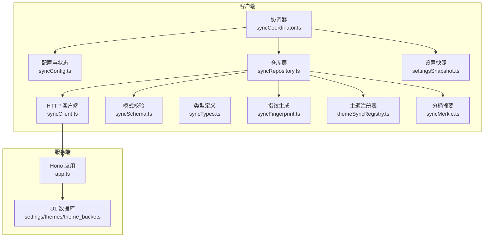
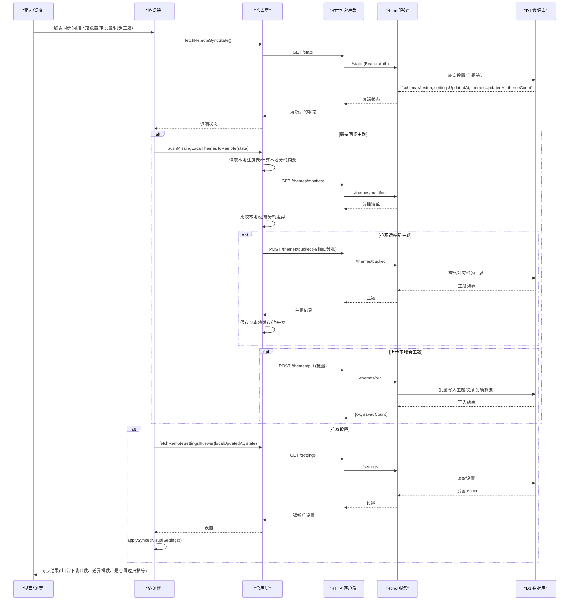
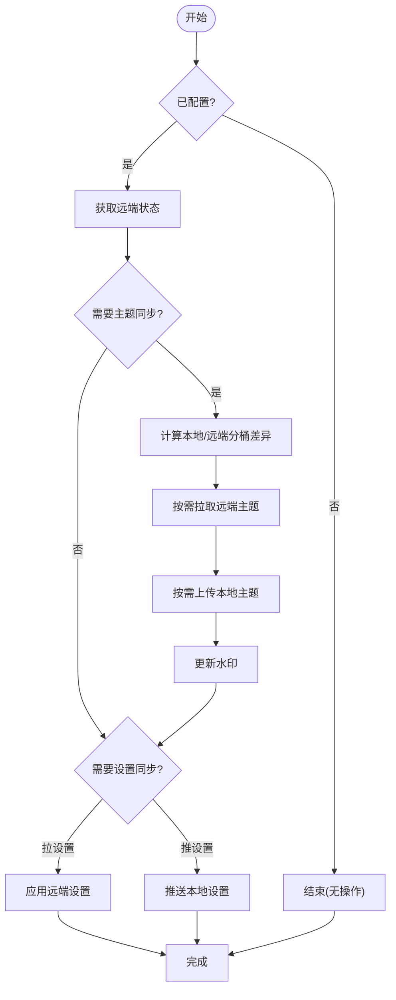
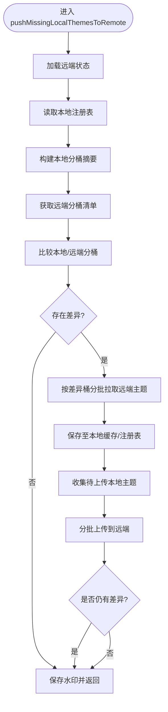
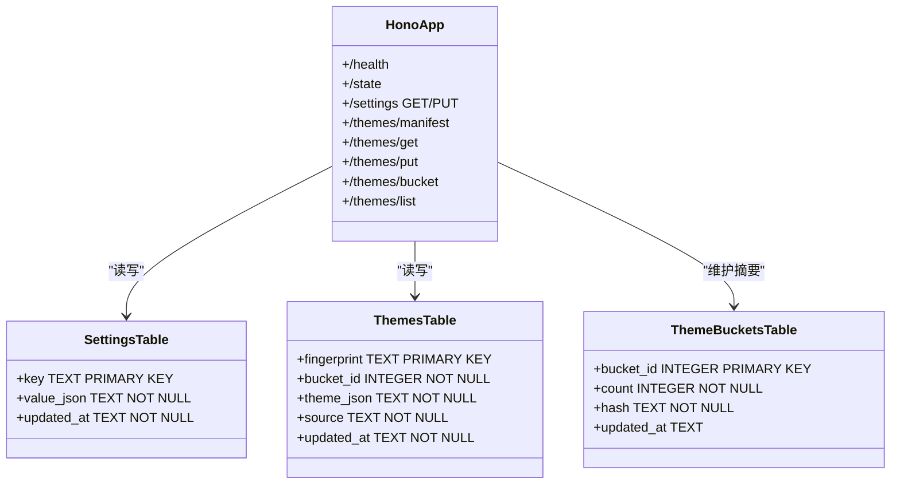
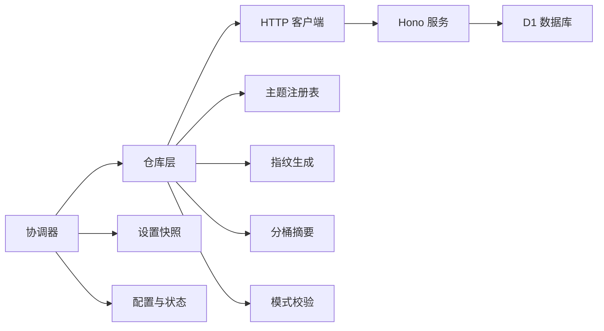

# 同步架构设计

<cite>
**本文引用的文件**
- [syncCoordinator.ts](file://src/services/sync/syncCoordinator.ts)
- [syncClient.ts](file://src/services/sync/syncClient.ts)
- [syncTypes.ts](file://src/services/sync/syncTypes.ts)
- [syncSchema.ts](file://src/services/sync/syncSchema.ts)
- [syncRepository.ts](file://src/services/sync/syncRepository.ts)
- [settingsSnapshot.ts](file://src/services/sync/settingsSnapshot.ts)
- [syncConfig.ts](file://src/services/sync/syncConfig.ts)
- [syncFingerprint.ts](file://src/services/sync/syncFingerprint.ts)
- [themeSyncRegistry.ts](file://src/services/sync/themeSyncRegistry.ts)
- [syncMerkle.ts](file://src/services/sync/syncMerkle.ts)
- [app.ts](file://sync-server/src/app.ts)
</cite>

## 目录
1. [简介](#简介)
2. [项目结构](#项目结构)
3. [核心组件](#核心组件)
4. [架构总览](#架构总览)
5. [详细组件分析](#详细组件分析)
6. [依赖关系分析](#依赖关系分析)
7. [性能考量](#性能考量)
8. [故障排查指南](#故障排查指南)
9. [结论](#结论)
10. [附录](#附录)

## 简介
本技术文档围绕 Folia Player 的“主题与设置”同步系统展开，重点解析客户端-服务器模型、基于 Hono 的 RESTful API、D1 数据库表结构设计（settings、themes、theme_buckets）、分布式数据一致性保证机制。同时深入说明同步协调器的工作原理：增量同步算法、冲突解决策略、版本控制机制；以及主题分桶算法的实现细节（指纹哈希计算、桶 ID 分配、批量更新优化）。文末提供架构图与数据流图，并包含错误处理、重试机制、断点续传等容错设计建议。

## 项目结构
同步系统由客户端与服务端两部分组成：
- 客户端位于 src/services/sync 下，负责配置管理、状态协调、指纹生成、本地缓存/注册表维护、与远端 API 交互、增量差异计算与合并。
- 服务端位于 sync-server/src/app.ts，基于 Hono 暴露健康检查、状态查询、设置读写、主题清单/批量获取/批量写入/分页列表等接口，并使用 D1 持久化。

**图表来源**
- [syncCoordinator.ts:1-215](file://src/services/sync/syncCoordinator.ts#L1-L215)
- [syncRepository.ts:1-515](file://src/services/sync/syncRepository.ts#L1-L515)
- [syncClient.ts:1-152](file://src/services/sync/syncClient.ts#L1-L152)
- [syncSchema.ts:1-237](file://src/services/sync/syncSchema.ts#L1-L237)
- [syncTypes.ts:1-115](file://src/services/sync/syncTypes.ts#L1-L115)
- [settingsSnapshot.ts:1-114](file://src/services/sync/settingsSnapshot.ts#L1-L114)
- [syncConfig.ts:1-111](file://src/services/sync/syncConfig.ts#L1-L111)
- [syncFingerprint.ts:1-103](file://src/services/sync/syncFingerprint.ts#L1-L103)
- [themeSyncRegistry.ts:1-210](file://src/services/sync/themeSyncRegistry.ts#L1-L210)
- [syncMerkle.ts:1-50](file://src/services/sync/syncMerkle.ts#L1-L50)
- [app.ts:1-523](file://sync-server/src/app.ts#L1-L523)

**章节来源**
- [syncCoordinator.ts:1-215](file://src/services/sync/syncCoordinator.ts#L1-L215)
- [app.ts:1-523](file://sync-server/src/app.ts#L1-L523)

## 核心组件
- 配置与状态：集中管理同步服务地址、鉴权令牌、运行时状态（空闲/同步中/成功/错误），并通过事件通知 UI。
- 协调器：编排启动时自动同步、手动触发同步、导出/导入库包、拉取/推送设置与主题。
- 仓库层：实现增量同步的核心逻辑，包括水印（watermark）机制、分桶差异对比、批量拉取/推送、本地注册表维护。
- HTTP 客户端：封装对远端 Hono 服务的请求，统一鉴权头、响应解析与错误包装。
- 模式校验：防御性解析远端返回的 JSON，确保 schemaVersion、字段类型与取值范围合法。
- 设置快照：将前端设置状态映射为可同步的视觉设置对象，并提供反向应用到状态的方法。
- 指纹生成：为歌曲生成稳定的同步键（支持在线源媒体ID与元数据指纹），用于跨设备一致的主题关联。
- 主题注册表：记录本地可安全同步的主题缓存条目，支持历史迁移与去重。
- 分桶摘要：使用确定性哈希构建主题分桶摘要，用于快速发现远端与本地的差异。

**章节来源**
- [syncConfig.ts:1-111](file://src/services/sync/syncConfig.ts#L1-L111)
- [syncCoordinator.ts:1-215](file://src/services/sync/syncCoordinator.ts#L1-L215)
- [syncRepository.ts:1-515](file://src/services/sync/syncRepository.ts#L1-L515)
- [syncClient.ts:1-152](file://src/services/sync/syncClient.ts#L1-L152)
- [syncSchema.ts:1-237](file://src/services/sync/syncSchema.ts#L1-L237)
- [settingsSnapshot.ts:1-114](file://src/services/sync/settingsSnapshot.ts#L1-L114)
- [syncFingerprint.ts:1-103](file://src/services/sync/syncFingerprint.ts#L1-L103)
- [themeSyncRegistry.ts:1-210](file://src/services/sync/themeSyncRegistry.ts#L1-L210)
- [syncMerkle.ts:1-50](file://src/services/sync/syncMerkle.ts#L1-L50)

## 架构总览
整体采用“客户端-服务器”模型：
- 客户端通过 SyncClient 调用 Hono 提供的 RESTful API，完成健康检查、状态查询、设置读写、主题清单/批量获取/批量写入/分页列表等操作。
- 服务端使用 D1 存储 settings、themes、theme_buckets 三张表，并通过批处理语句高效更新主题与分桶摘要。
- 增量同步通过“水印 + 分桶摘要”实现：客户端维护本地注册表签名与远端主题更新时间戳/数量，仅在分桶不一致时进行细粒度差异同步。

**图表来源**
- [syncCoordinator.ts:95-150](file://src/services/sync/syncCoordinator.ts#L95-L150)
- [syncRepository.ts:335-459](file://src/services/sync/syncRepository.ts#L335-L459)
- [syncClient.ts:64-152](file://src/services/sync/syncClient.ts#L64-L152)
- [app.ts:316-518](file://sync-server/src/app.ts#L316-L518)

## 详细组件分析

### 协调器（syncCoordinator.ts）
- 职责：初始化同步、测试连接、拉取/推送设置、执行主题同步、导出/导入库包。
- 关键流程：
  - initializeSyncCoordinator：启动时执行一次主题同步（默认不拉设置、不推设置）。
  - syncNow：串行化执行，避免重复同步；根据选项决定是否拉/推设置与主题；完成后派发事件通知 UI。
  - pullRemoteVisualSettings：仅当远端设置较新时应用，并更新本地时间戳。
  - export/import：将设置与主题打包为可移植的 bundle，支持校验与回写远端。

**图表来源**
- [syncCoordinator.ts:95-150](file://src/services/sync/syncCoordinator.ts#L95-L150)
- [syncRepository.ts:335-459](file://src/services/sync/syncRepository.ts#L335-L459)

**章节来源**
- [syncCoordinator.ts:1-215](file://src/services/sync/syncCoordinator.ts#L1-L215)

### 仓库层（syncRepository.ts）
- 职责：实现增量同步的核心算法，包括水印机制、分桶差异对比、批量拉取/推送、本地注册表维护。
- 关键机制：
  - 水印（watermark）：记录远端主题更新时间、主题总数、本地注册表签名，避免重复扫描。
  - 分桶差异：比较本地与远端分桶的 count/hash/updatedAt，仅对差异桶进行细粒度同步。
  - 批量拉取：按固定大小（如 32）分批请求 /themes/bucket，减少网络往返。
  - 批量上传：按固定大小（如 100）分批提交 /themes/put，降低单次负载。
  - 本地注册表：维护 fingerprint -> cacheKey 的映射，支持历史迁移与去重。

**图表来源**
- [syncRepository.ts:335-459](file://src/services/sync/syncRepository.ts#L335-L459)

**章节来源**
- [syncRepository.ts:1-515](file://src/services/sync/syncRepository.ts#L1-L515)

### HTTP 客户端（syncClient.ts）
- 职责：封装对远端 Hono 服务的请求，统一添加 Authorization 头、解析 JSON、处理 204 空响应、抛出带状态的错误。
- 主要接口：
  - /health：健康检查
  - /state：获取远端状态
  - /settings：GET/PUT 设置
  - /themes/manifest：获取主题分桶清单
  - /themes/get：按指纹批量获取主题
  - /themes/put：批量写入主题
  - /themes/bucket：按桶ID批量获取主题
  - /themes/list：分页列出主题

**章节来源**
- [syncClient.ts:1-152](file://src/services/sync/syncClient.ts#L1-L152)

### 模式校验（syncSchema.ts）
- 职责：防御性解析远端返回的数据，严格校验 schemaVersion、字段类型与取值范围，确保下游逻辑安全。
- 关键点：
  - 设置记录：校验 schemaVersion、updatedAt、data 结构与字段合法性。
  - 主题记录：校验 fingerprint、updatedAt、theme 结构，source 白名单过滤。
  - 分桶清单：校验 bucketId、count、hash、updatedAt 等。
  - 导出包：校验 kind、schemaVersion、exportedAt、themes/settings 结构。

**章节来源**
- [syncSchema.ts:1-237](file://src/services/sync/syncSchema.ts#L1-L237)

### 设置快照（settingsSnapshot.ts）
- 职责：将前端设置状态映射为可同步的视觉设置对象，并提供反向应用到状态的方法。
- 关键点：
  - buildSyncedVisualSettings：提取需要同步的字段（字体、透明度、背景模式、调音等）。
  - applySyncedVisualSettings：将远端设置逐项应用到当前状态，兼容旧版字段。

**章节来源**
- [settingsSnapshot.ts:1-114](file://src/services/sync/settingsSnapshot.ts#L1-L114)

### 指纹生成（syncFingerprint.ts）
- 职责：为歌曲生成稳定的同步键，使主题在不同设备上保持一致关联。
- 关键点：
  - 在线源：使用 providerId:mediaId 作为主键。
  - 本地/其他源：使用标题、艺术家、时长（取整到5秒）组合成元数据指纹。
  - 候选指纹：优先匹配精确ID，其次回退到元数据指纹，提高命中率。

**章节来源**
- [syncFingerprint.ts:1-103](file://src/services/sync/syncFingerprint.ts#L1-L103)

### 主题注册表（themeSyncRegistry.ts）
- 职责：记录本地可安全同步的主题缓存条目，支持历史迁移与去重。
- 关键点：
  - 从 localStorage 迁移到 IndexedDB，保留较新的记录。
  - 为每首歌曲建立 fingerprint -> cacheKey 的映射，便于后续同步与查找。
  - 提供批量 upsert 与按指纹查找能力。

**章节来源**
- [themeSyncRegistry.ts:1-210](file://src/services/sync/themeSyncRegistry.ts#L1-L210)

### 分桶摘要（syncMerkle.ts）
- 职责：构建确定性的主题分桶摘要，用于快速发现远端与本地的差异。
- 关键点：
  - 固定桶数量（256），使用 hashSyncString(fingerprint) % 256 计算桶ID。
  - 每个桶维护 count、hash（XOR 聚合 fingerprint+updatedAt）、updatedAt（最新时间）。
  - 与远端清单比较时，若 count/hash/updatedAt 均相等，则认为该桶无需同步。

**章节来源**
- [syncMerkle.ts:1-50](file://src/services/sync/syncMerkle.ts#L1-L50)

### 服务端（Hono + D1）
- 职责：提供 RESTful API，使用 D1 持久化设置与主题，维护分桶摘要，支持批量写入与分页查询。
- 表结构：
  - settings：key（PRIMARY KEY）、value_json、updated_at
  - themes：fingerprint（PRIMARY KEY）、bucket_id、theme_json、source、updated_at
  - theme_buckets：bucket_id（PRIMARY KEY）、count、hash、updated_at
- 索引：idx_themes_updated_at、idx_themes_bucket_id
- 关键接口：
  - /health：健康检查
  - /state：返回 schemaVersion、settingsUpdatedAt、themesUpdatedAt、themeCount
  - /settings：GET/PUT（带 schemaVersion 校验与时间戳覆盖）
  - /themes/manifest：返回所有桶的摘要
  - /themes/get：按指纹批量获取主题
  - /themes/put：批量写入主题，并原子更新分桶摘要（count 累加、hash XOR、updated_at 取最大）
  - /themes/bucket：按桶ID批量获取主题
  - /themes/list：分页列出主题（cursor 基于 fingerprint）

**图表来源**
- [app.ts:47-78](file://sync-server/src/app.ts#L47-L78)
- [app.ts:316-518](file://sync-server/src/app.ts#L316-L518)

**章节来源**
- [app.ts:1-523](file://sync-server/src/app.ts#L1-L523)

## 依赖关系分析
- 协调器依赖仓库层、配置、设置快照、类型定义。
- 仓库层依赖 HTTP 客户端、注册表、指纹生成、分桶摘要、模式校验。
- HTTP 客户端依赖类型定义与模式校验。
- 服务端依赖 D1 数据库，提供统一的 API 访问入口。

**图表来源**
- [syncCoordinator.ts:1-215](file://src/services/sync/syncCoordinator.ts#L1-L215)
- [syncRepository.ts:1-515](file://src/services/sync/syncRepository.ts#L1-L515)
- [syncClient.ts:1-152](file://src/services/sync/syncClient.ts#L1-L152)
- [app.ts:1-523](file://sync-server/src/app.ts#L1-L523)

**章节来源**
- [syncCoordinator.ts:1-215](file://src/services/sync/syncCoordinator.ts#L1-L215)
- [syncRepository.ts:1-55](file://src/services/sync/syncRepository.ts#L1-L55)

## 性能考量
- 增量同步：通过水印与分桶摘要避免全量扫描，仅在差异桶内拉取/推送主题。
- 批量操作：客户端按固定批次（如 100）上传主题，服务端按固定批次（如 32）拉取主题，降低网络与数据库压力。
- 分桶哈希：使用确定性哈希聚合 fingerprint 与 updatedAt，保证不同顺序输入得到相同摘要，提升对比效率。
- 索引优化：服务端对 themes.updated_at、themes.bucket_id 建立索引，加速查询与排序。
- 分页列表：/themes/list 使用 cursor（基于 fingerprint）分页，避免一次性加载大量数据。

[本节为通用性能讨论，不直接分析具体文件]

## 故障排查指南
- 连接失败：检查 workerBaseUrl 与 authToken 是否正确配置；调用 /health 验证服务可达。
- 认证失败：确认服务端 SYNC_TOKEN 长度至少 8 位，客户端 Authorization 头携带正确 Bearer Token。
- 数据不一致：查看远端 /state 的 settingsUpdatedAt 与 themesUpdatedAt，确认本地水印是否过期；必要时清除水印重新扫描。
- 主题未生效：检查主题指纹是否稳定（在线源使用 providerId:mediaId，本地源使用元数据指纹）；确认本地注册表是否存在对应缓存。
- 批量写入失败：检查 /themes/put 的请求体格式与数量限制（MAX_THEME_BATCH_SIZE）；服务端会返回 invalid_themes 错误。
- 分页拉取中断：使用 /themes/list 的 cursor 继续下一页，直到 cursor 为 null。

**章节来源**
- [syncConfig.ts:75-77](file://src/services/sync/syncConfig.ts#L75-L77)
- [syncClient.ts:38-62](file://src/services/sync/syncClient.ts#L38-L62)
- [app.ts:129-135](file://sync-server/src/app.ts#L129-L135)
- [app.ts:388-474](file://sync-server/src/app.ts#L388-L474)
- [app.ts:496-518](file://sync-server/src/app.ts#L496-L518)

## 结论
Folia Player 的同步系统通过“水印 + 分桶摘要”的增量同步机制，结合稳定的指纹生成与严格的模式校验，实现了高效、可靠的主题与设置同步。服务端基于 Hono 与 D1 提供了简洁的 RESTful API，并通过批量写入与索引优化保障性能。客户端协调器统一管理同步流程，支持导出/导入库包，便于跨设备迁移。整体架构清晰、可扩展性强，适合在分布式环境中部署与维护。

[本节为总结性内容，不直接分析具体文件]

## 附录

### 数据模型（D1 表结构）
- settings：key（主键）、value_json（设置JSON）、updated_at（更新时间）
- themes：fingerprint（主键）、bucket_id（分桶ID）、theme_json（主题JSON）、source（来源：manual/auto/fallback/edited）、updated_at（更新时间）
- theme_buckets：bucket_id（主键）、count（主题数量）、hash（分桶哈希）、updated_at（最近更新时间）

**章节来源**
- [app.ts:47-78](file://sync-server/src/app.ts#L47-L78)

### 版本控制与兼容性
- 全局 schemaVersion：客户端与服务端均使用同一版本号，确保协议兼容。
- 设置记录：包含 schemaVersion 与 updatedAt，服务端仅在 excluded.updated_at >= settings.updated_at 时覆盖。
- 主题记录：服务端通过 ON CONFLICT 与 updated_at 条件更新，避免旧覆盖新。

**章节来源**
- [syncTypes.ts:7-8](file://src/services/sync/syncTypes.ts#L7-L8)
- [app.ts:352-371](file://sync-server/src/app.ts#L352-L371)
- [app.ts:435-474](file://sync-server/src/app.ts#L435-L474)

### 错误处理与重试建议
- 客户端：统一抛出 SyncClientError，包含 HTTP 状态码；上层可根据状态码决定重试策略（如 5xx 指数退避）。
- 服务端：参数校验失败返回 400，认证失败返回 500（弱令牌）或 401（Bearer 认证中间件）。
- 重试机制：建议在仓库层对网络异常与 5xx 错误实施指数退避重试，最多重试次数可配置。
- 断点续传：利用 /themes/list 的 cursor 与 /themes/bucket 的分桶拉取，支持中断后从上次位置继续。

**章节来源**
- [syncClient.ts:19-27](file://src/services/sync/syncClient.ts#L19-L27)
- [syncClient.ts:38-62](file://src/services/sync/syncClient.ts#L38-L62)
- [app.ts:129-135](file://sync-server/src/app.ts#L129-L135)
- [app.ts:388-474](file://sync-server/src/app.ts#L388-L474)
- [app.ts:496-518](file://sync-server/src/app.ts#L496-L518)