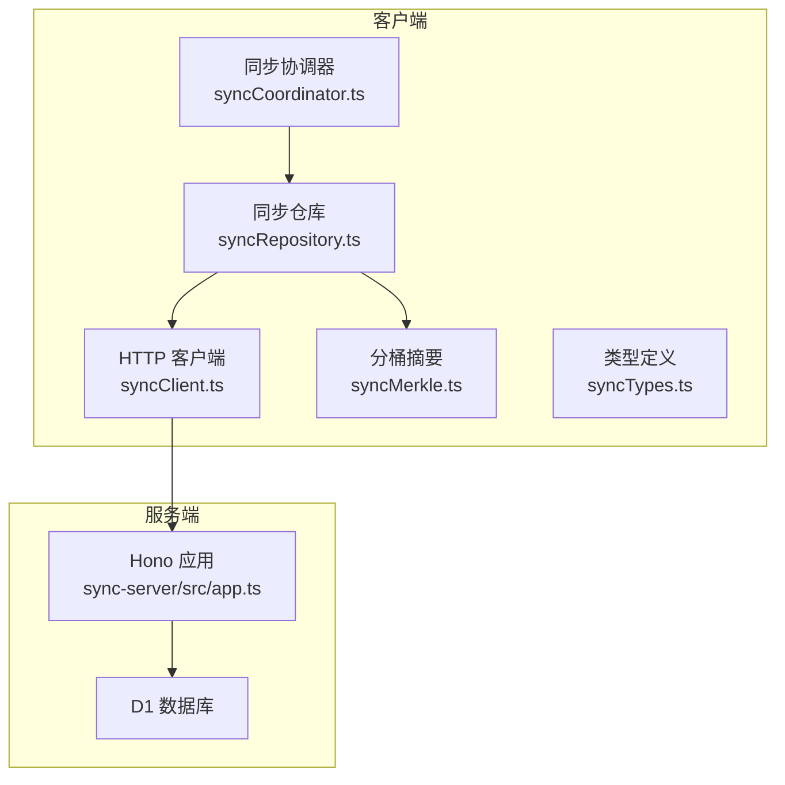
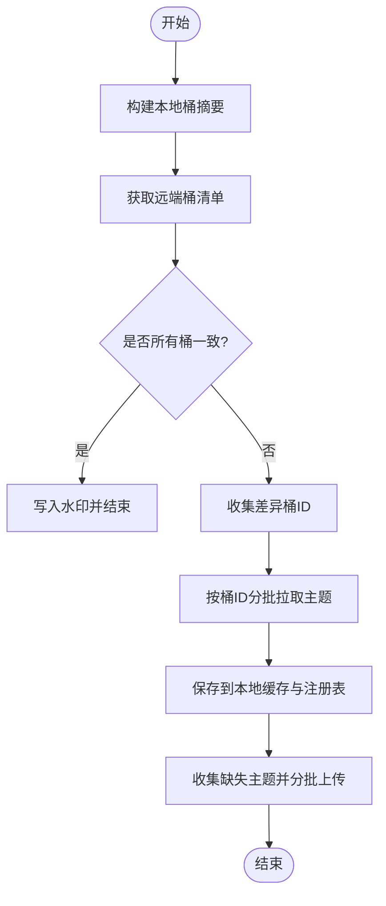
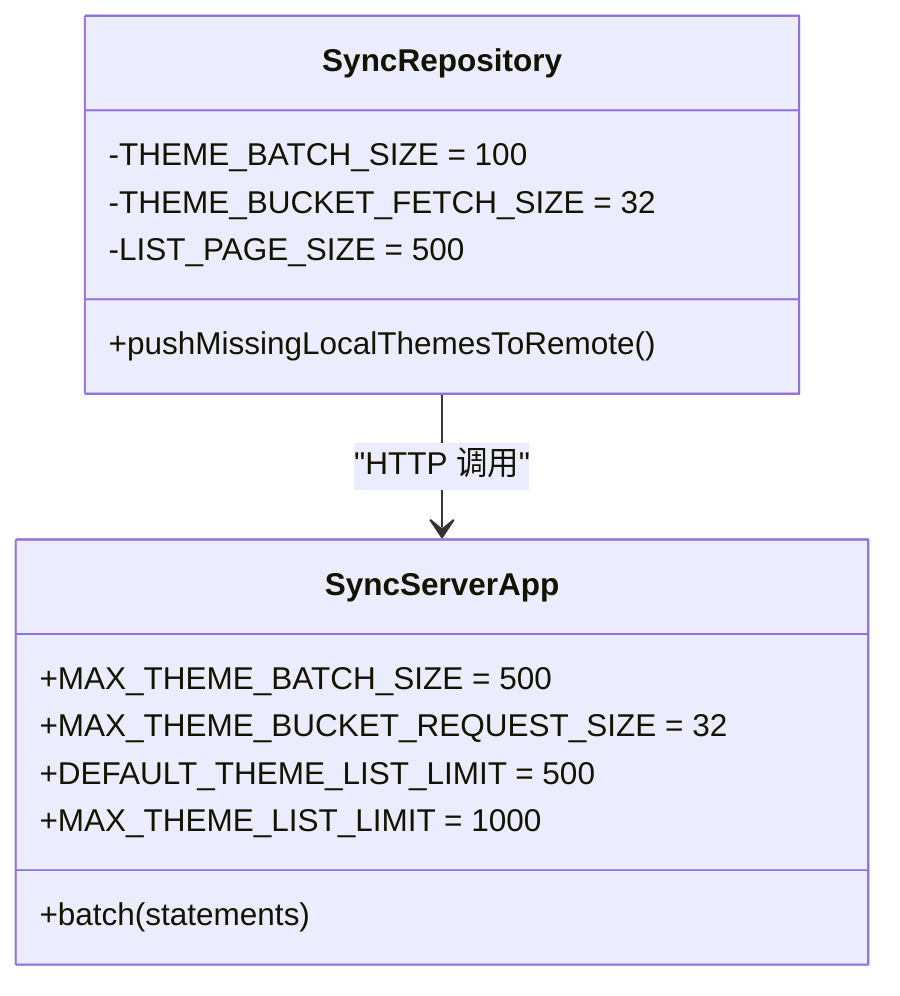
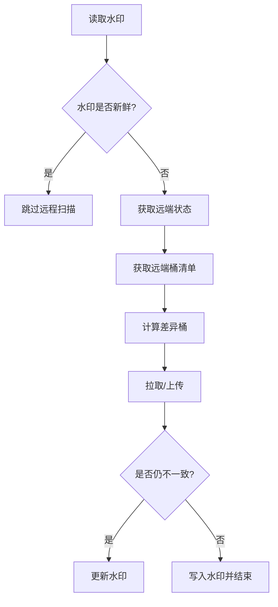
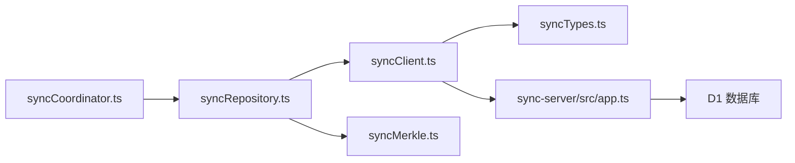

# 性能优化

<cite>
**本文引用的文件**
- [syncMerkle.ts](file://src/services/sync/syncMerkle.ts)
- [syncRepository.ts](file://src/services/sync/syncRepository.ts)
- [syncClient.ts](file://src/services/sync/syncClient.ts)
- [syncCoordinator.ts](file://src/services/sync/syncCoordinator.ts)
- [syncTypes.ts](file://src/services/sync/syncTypes.ts)
- [app.ts](file://sync-server/src/app.ts)
- [StorageSettingsSection.tsx](file://src/components/modal/settings/StorageSettingsSection.tsx)
- [automix-memory-optimization.md](file://docs/automix-memory-optimization.md)
- [MODELS.md](file://src/services/automix/MODELS.md)
- [benchmark_chorus.js](file://benchmark_chorus.js)
</cite>

## 目录
1. [简介](#简介)
2. [项目结构](#项目结构)
3. [核心组件](#核心组件)
4. [架构总览](#架构总览)
5. [详细组件分析](#详细组件分析)
6. [依赖关系分析](#依赖关系分析)
7. [性能考量](#性能考量)
8. [故障排查指南](#故障排查指南)
9. [结论](#结论)
10. [附录](#附录)

## 简介
本技术文档聚焦 Folia Player 同步系统的性能优化，围绕以下关键点展开：
- 批量操作优化策略：客户端与服务端的双向批处理、分桶拉取与写入限制、内存占用控制。
- 主题分桶算法：256 个桶的分布策略、哈希冲突处理、增量差异计算与查询优化。
- 增量同步机制：通过水印（watermark）与桶摘要（bucket manifest）减少网络传输与数据库操作。
- 缓存策略、连接与请求管理、异步处理等关键技术。
- 性能监控指标、瓶颈分析方法与调优建议，并给出基准测试思路与对比数据参考。

## 项目结构
Folia 同步系统由“客户端服务层 + 服务端 API”两部分组成：
- 客户端侧
  - 协调器：负责启动时自动同步、用户触发同步、设置项同步。
  - 仓库层：封装主题上传/下载、分桶差异比对、本地注册表与水印持久化。
  - 客户端 HTTP 适配：统一鉴权、分页、解析响应。
  - 分桶摘要：基于指纹与更新时间构建确定性桶摘要，用于增量比对。
- 服务端侧
  - Hono 路由：提供健康检查、状态、主题清单、按桶拉取、列表分页、批量写入等接口。
  - D1 数据库：主题表、桶统计表、索引与批量写入。

图表来源
- [syncCoordinator.ts:50-150](file://src/services/sync/syncCoordinator.ts#L50-L150)
- [syncRepository.ts:335-459](file://src/services/sync/syncRepository.ts#L335-L459)
- [syncClient.ts:64-152](file://src/services/sync/syncClient.ts#L64-L152)
- [syncMerkle.ts:6-50](file://src/services/sync/syncMerkle.ts#L6-L50)
- [app.ts:104-119](file://sync-server/src/app.ts#L104-L119)

章节来源
- [syncCoordinator.ts:50-150](file://src/services/sync/syncCoordinator.ts#L50-L150)
- [syncRepository.ts:39-459](file://src/services/sync/syncRepository.ts#L39-L459)
- [syncClient.ts:1-152](file://src/services/sync/syncClient.ts#L1-L152)
- [syncMerkle.ts:1-50](file://src/services/sync/syncMerkle.ts#L1-L50)
- [app.ts:1-200](file://sync-server/src/app.ts#L1-L200)

## 核心组件
- 同步协调器：编排启动时的主题同步、设置项拉取/推送，维护同步状态与事件广播。
- 同步仓库：实现增量同步的核心逻辑，包括水印读取/写入、本地注册表签名、分桶差异计算、批量上传与分页拉取。
- 客户端 HTTP 适配：统一鉴权、错误处理、分页与批量接口调用。
- 分桶摘要：使用固定 256 桶的哈希映射，生成确定性的计数、最新时间与 XOR 哈希摘要，支持快速差异检测。
- 服务端 API：提供主题清单、按桶拉取、列表分页、批量写入与桶统计更新。

章节来源
- [syncCoordinator.ts:50-150](file://src/services/sync/syncCoordinator.ts#L50-L150)
- [syncRepository.ts:39-459](file://src/services/sync/syncRepository.ts#L39-L459)
- [syncClient.ts:1-152](file://src/services/sync/syncClient.ts#L1-L152)
- [syncMerkle.ts:1-50](file://src/services/sync/syncMerkle.ts#L1-L50)
- [app.ts:104-119](file://sync-server/src/app.ts#L104-L119)

## 架构总览
下图展示一次完整的增量同步流程：客户端获取远程状态与清单，计算本地与远端的桶差异，仅对差异桶进行拉取；上传缺失主题时使用批处理限制；服务端以批量语句写入主题与桶统计。

```mermaid
sequenceDiagram
participant UI as "设置界面"
participant Coord as "同步协调器"
participant Repo as "同步仓库"
participant Client as "HTTP 客户端"
participant Server as "服务端 API"
participant DB as "D1 数据库"
UI->>Coord : 触发同步
Coord->>Repo : pushMissingLocalThemesToRemote()
Repo->>Client : getRemoteState()
Client-->>Repo : 远程状态
Repo->>Client : getRemoteThemeManifest()
Client-->>Repo : 桶清单
Repo->>Repo : 构建本地桶摘要并比较差异
alt 存在差异桶
Repo->>Client : getRemoteThemesByBuckets(分桶拉取)
Client->>Server : POST /themes/bucket
Server->>DB : SELECT ... WHERE bucket_id IN (...)
DB-->>Server : 主题行
Server-->>Client : 主题数组
Client-->>Repo : 主题记录
Repo->>Repo : 保存至本地缓存与注册表
Repo->>Client : putRemoteThemes(分批上传)
Client->>Server : POST /themes/put
Server->>DB : batch(INSERT/UPDATE themes, theme_buckets)
DB-->>Server : 写入结果
Server-->>Client : {ok, savedCount}
else 无差异
Repo->>Repo : 写水印并跳过扫描
end
Coord-->>UI : 同步完成摘要
```

图表来源
- [syncCoordinator.ts:95-150](file://src/services/sync/syncCoordinator.ts#L95-L150)
- [syncRepository.ts:335-459](file://src/services/sync/syncRepository.ts#L335-L459)
- [syncClient.ts:118-152](file://src/services/sync/syncClient.ts#L118-L152)
- [app.ts:425-522](file://sync-server/src/app.ts#L425-L522)

## 详细组件分析

### 主题分桶算法与增量同步
- 分桶数量与哈希：固定 256 个桶，使用一致性哈希函数将指纹映射到桶 ID，保证跨进程/版本的可重复性。
- 桶摘要字段：每个桶包含 count（条目数）、hash（XOR 累积哈希）、updatedAt（该桶内最新更新时间）。
- 差异计算：客户端构建本地桶摘要并与远端清单逐项比较，仅当任一字段不一致时视为差异桶。
- 查询优化：仅对差异桶发起拉取，避免全量扫描；服务端按桶 ID 列表查询并按指纹排序返回。

图表来源
- [syncMerkle.ts:6-50](file://src/services/sync/syncMerkle.ts#L6-L50)
- [syncRepository.ts:374-459](file://src/services/sync/syncRepository.ts#L374-L459)
- [app.ts:476-494](file://sync-server/src/app.ts#L476-L494)

章节来源
- [syncMerkle.ts:6-50](file://src/services/sync/syncMerkle.ts#L6-L50)
- [syncRepository.ts:374-459](file://src/services/sync/syncRepository.ts#L374-L459)
- [app.ts:476-494](file://sync-server/src/app.ts#L476-L494)

### 批量操作优化策略
- 客户端批量上传：
  - 使用固定批次大小（例如每批 100 条）循环上传，避免单次请求过大导致超时或内存峰值过高。
  - 在合并本地与远端记录后，仅对确实缺失或更新的条目进行上传。
- 服务端批量写入：
  - 将多条 INSERT/UPDATE 语句组装为批处理一次性提交，显著降低事务开销与网络往返。
  - 同时更新主题表与桶统计表，保持 count、hash、updated_at 的一致性。
- 分桶拉取限制：
  - 客户端每次最多请求 32 个桶，防止单次查询过大；服务端也限制最大请求尺寸。
- 列表分页：
  - 导出/导入场景使用游标分页，默认页大小 500，上限 1000，平衡吞吐与内存占用。

图表来源
- [syncRepository.ts:39-45](file://src/services/sync/syncRepository.ts#L39-L45)
- [app.ts:23-28](file://sync-server/src/app.ts#L23-L28)
- [app.ts:433-473](file://sync-server/src/app.ts#L433-L473)

章节来源
- [syncRepository.ts:39-459](file://src/services/sync/syncRepository.ts#L39-L459)
- [app.ts:23-28](file://sync-server/src/app.ts#L23-L28)
- [app.ts:433-473](file://sync-server/src/app.ts#L433-L473)

### 增量同步机制与水印
- 水印键：本地存储包含远端主题更新时间、远端主题总数、本地注册表签名。
- 新鲜度判断：若水印与远端状态一致且本地注册表未变化，则跳过远程主题扫描。
- 差异确认：即使上传了缺失主题，也会重新计算本地桶摘要并与远端对比，确保最终一致后再写水印。
- 设置项同步：通过时间戳比较决定是否拉取/推送，避免无效网络请求。

图表来源
- [syncRepository.ts:73-144](file://src/services/sync/syncRepository.ts#L73-L144)
- [syncRepository.ts:360-459](file://src/services/sync/syncRepository.ts#L360-L459)

章节来源
- [syncRepository.ts:73-144](file://src/services/sync/syncRepository.ts#L73-L144)
- [syncRepository.ts:360-459](file://src/services/sync/syncRepository.ts#L360-L459)

### 缓存策略与本地存储
- 主题缓存：按指纹派生缓存键，落盘双主题对象，避免重复网络请求。
- 注册表：维护指纹、缓存键、更新时间与来源，便于增量比对与导出/导入。
- 历史迁移：兼容旧版网易云主题同步记录，迁移到新的注册表结构。
- 播放上下文缓存：根据当前播放歌曲键缓存主题，提升热路径性能。

章节来源
- [syncRepository.ts:190-237](file://src/services/sync/syncRepository.ts#L190-L237)
- [syncRepository.ts:270-283](file://src/services/sync/syncRepository.ts#L270-L283)
- [syncRepository.ts:477-515](file://src/services/sync/syncRepository.ts#L477-L515)

### 连接与请求管理
- 统一鉴权：所有请求携带 Authorization 头，服务端校验令牌长度。
- 错误处理：客户端抛出带状态码的错误对象，便于上层区分网络错误与业务错误。
- 分页与限流：列表分页与分桶拉取均有限制，避免大请求导致的内存与带宽压力。
- 并发控制：协调器内部使用标志位防止重复同步。

章节来源
- [syncClient.ts:19-62](file://src/services/sync/syncClient.ts#L19-L62)
- [syncCoordinator.ts:95-150](file://src/services/sync/syncCoordinator.ts#L95-L150)
- [app.ts:129-143](file://sync-server/src/app.ts#L129-L143)

### 异步处理与用户体验
- 协调器在同步完成后派发自定义事件，通知界面刷新主题列表。
- 设置界面提供手动测试连接、立即同步、导出/导入等操作，并在过程中显示状态与消息。
- 长耗时任务（如导出/导入）采用异步执行，避免阻塞 UI。

章节来源
- [syncCoordinator.ts:128-142](file://src/services/sync/syncCoordinator.ts#L128-L142)
- [StorageSettingsSection.tsx:131-225](file://src/components/modal/settings/StorageSettingsSection.tsx#L131-L225)

## 依赖关系分析
- 模块耦合：
  - 协调器依赖仓库与配置；仓库依赖客户端、分桶摘要、注册表与缓存；客户端依赖类型定义与解析器；服务端依赖 D1 与中间件。
- 外部依赖：
  - Hono 框架、CORS、Bearer 认证、D1 数据库。
- 潜在风险：
  - 分桶哈希函数需保持一致，否则无法正确增量比对。
  - 批处理大小与分页大小需根据实际数据规模调整，避免 OOM 或超时。

图表来源
- [syncCoordinator.ts:1-215](file://src/services/sync/syncCoordinator.ts#L1-L215)
- [syncRepository.ts:1-515](file://src/services/sync/syncRepository.ts#L1-L515)
- [syncClient.ts:1-152](file://src/services/sync/syncClient.ts#L1-L152)
- [syncMerkle.ts:1-50](file://src/services/sync/syncMerkle.ts#L1-L50)
- [syncTypes.ts:1-115](file://src/services/sync/syncTypes.ts#L1-L115)
- [app.ts:1-200](file://sync-server/src/app.ts#L1-L200)

章节来源
- [syncCoordinator.ts:1-215](file://src/services/sync/syncCoordinator.ts#L1-L215)
- [syncRepository.ts:1-515](file://src/services/sync/syncRepository.ts#L1-L515)
- [syncClient.ts:1-152](file://src/services/sync/syncClient.ts#L1-L152)
- [syncMerkle.ts:1-50](file://src/services/sync/syncMerkle.ts#L1-L50)
- [syncTypes.ts:1-115](file://src/services/sync/syncTypes.ts#L1-L115)
- [app.ts:1-200](file://sync-server/src/app.ts#L1-L200)

## 性能考量
- 批量操作
  - 客户端上传批次大小（例如 100），服务端批处理上限（例如 500），有效降低事务与网络开销。
  - 分桶拉取批次大小（例如 32），避免单次查询过大。
- 内存使用
  - 通过分页与分桶限制控制内存峰值；导出/导入使用游标分页。
  - 主题对象序列化/反序列化尽量复用键与缓存，减少重复计算。
- 网络传输
  - 增量同步基于水印与桶清单，仅在差异桶时拉取主题，显著减少传输量。
  - 列表分页与限制最大请求尺寸，避免超大响应。
- 数据库操作
  - 服务端使用批量语句写入主题与桶统计，减少多次 I/O。
  - 建立索引以加速按更新时间与桶 ID 的查询。
- 异步与并发
  - 协调器防止重复同步；设置界面异步执行长耗时任务。
- 监控与基准
  - 可结合浏览器性能 API 与日志统计同步耗时、传输字节、批次数、差异桶数。
  - 参考通用基准脚本模式（如歌词行处理基准）设计同步性能测试，对比不同批次大小与分页大小的影响。

[本节为通用指导，不直接分析具体文件]

## 故障排查指南
- 连接失败
  - 检查服务端令牌长度与 CORS 配置；客户端统一错误对象包含状态码。
- 同步卡住或重复
  - 协调器内部标志位防止重复；检查水印是否正确写入。
- 数据不一致
  - 核对分桶哈希函数与服务端是否一致；确认桶清单与本地摘要比较逻辑。
- 内存溢出
  - 调整批次大小与分页大小；检查主题对象大小与缓存键命中情况。
- 数据库写入失败
  - 检查 D1 批处理语句与约束；确认索引是否存在。

章节来源
- [syncClient.ts:19-62](file://src/services/sync/syncClient.ts#L19-L62)
- [syncCoordinator.ts:95-150](file://src/services/sync/syncCoordinator.ts#L95-L150)
- [app.ts:129-143](file://sync-server/src/app.ts#L129-L143)

## 结论
Folia 同步系统通过“分桶摘要 + 水印 + 批量操作”的组合策略，实现了高效的增量同步与稳定的性能表现。256 个桶的分布策略保证了差异检测的准确性与可扩展性；客户端与服务端的批处理限制有效控制了内存与网络开销；分页与缓存进一步提升了热路径性能。配合合理的监控与基准测试，可在不同数据规模下持续优化。

[本节为总结，不直接分析具体文件]

## 附录
- 基准测试思路
  - 设计针对同步流程的基准脚本：测量不同批次大小（如 50/100/200）下的端到端耗时、网络传输量、内存峰值。
  - 对比分桶拉取批次大小（如 16/32/64）对吞吐与延迟的影响。
  - 参考现有基准脚本结构（如歌词行处理基准），构造大规模主题数据集进行压测。
- 相关优化参考
  - 内存优化实践：关闭运行时内存复用、分离推理进程、单会话持久化等，可作为其他高内存任务的借鉴。

章节来源
- [benchmark_chorus.js:1-90](file://benchmark_chorus.js#L1-L90)
- [automix-memory-optimization.md:1-118](file://docs/automix-memory-optimization.md#L1-L118)
- [MODELS.md:132-145](file://src/services/automix/MODELS.md#L132-L145)