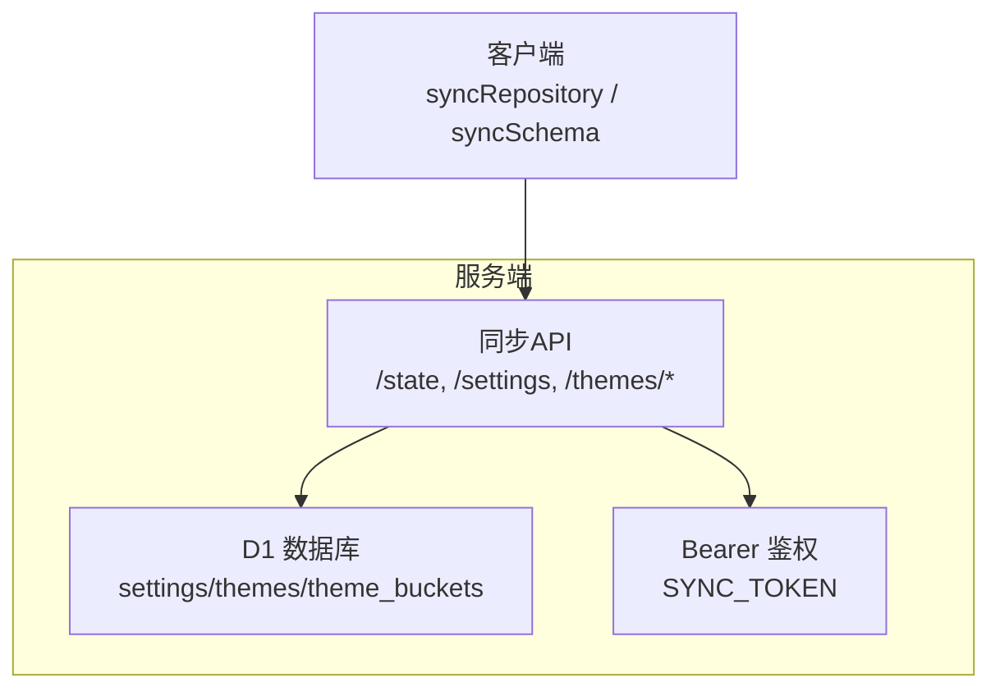
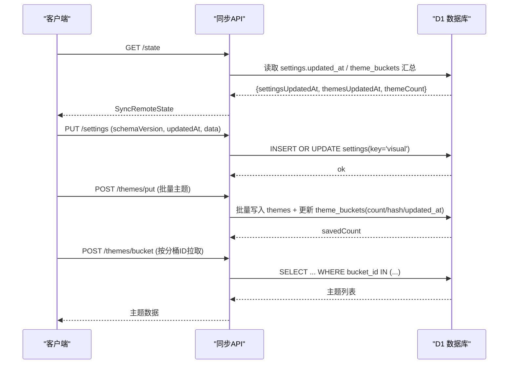
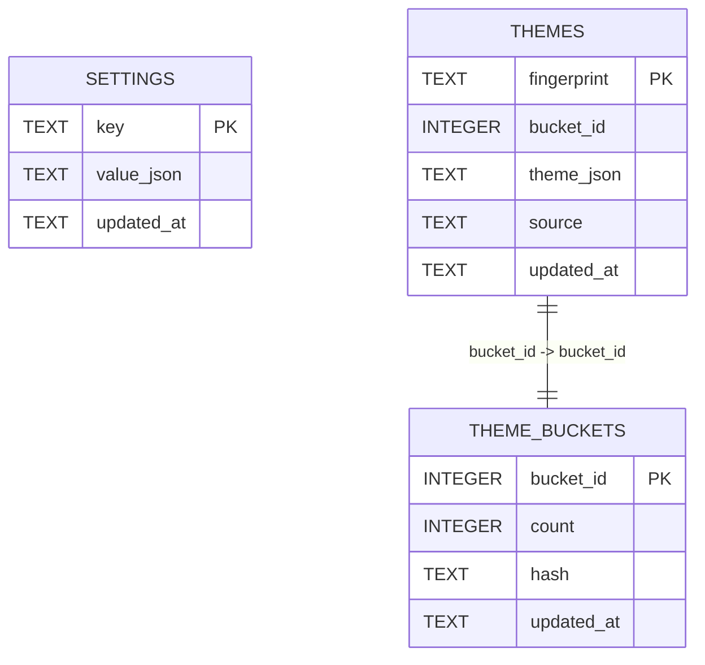
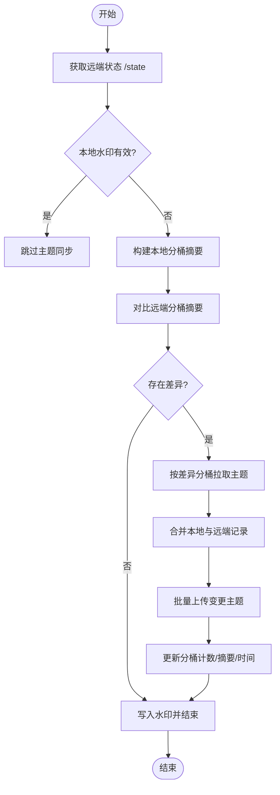

# 数据库设计

<cite>
**本文引用的文件**
- [app.ts](file://sync-server/src/app.ts)
- [d1-emulator.ts](file://sync-server/src/d1-emulator.ts)
- [syncRepository.ts](file://src/services/sync/syncRepository.ts)
- [syncSchema.ts](file://src/services/sync/syncSchema.ts)
- [syncTypes.ts](file://src/services/sync/syncTypes.ts)
- [syncMerkle.ts](file://src/services/sync/syncMerkle.ts)
- [themeSyncRegistry.ts](file://src/services/sync/themeSyncRegistry.ts)
</cite>

## 目录
1. [简介](#简介)
2. [项目结构](#项目结构)
3. [核心组件](#核心组件)
4. [架构总览](#架构总览)
5. [详细组件分析](#详细组件分析)
6. [依赖关系分析](#依赖关系分析)
7. [性能考虑](#性能考虑)
8. [故障排查指南](#故障排查指南)
9. [结论](#结论)
10. [附录](#附录)

## 简介
本技术文档聚焦 Folia Player 同步服务的 D1 数据库设计，围绕三张核心表展开：settings（用户设置存储）、themes（主题数据存储）、theme_buckets（主题分桶统计）。文档将详细说明字段定义、数据类型选择、主键与索引策略，解释 idx_themes_updated_at 与 idx_themes_bucket_id 的作用与优化效果；阐述数据迁移机制与版本控制策略；并提供表关系图、ER 图以及 SQL 建表语句和数据操作示例，帮助读者快速理解并正确使用该数据库。

## 项目结构
同步服务由前端客户端与服务端两部分组成：
- 服务端（sync-server）：基于 Hono 的轻量 API 服务，使用 Cloudflare D1（或本地 SQLite 模拟器）持久化数据，负责 schema 初始化、鉴权、CRUD 与清单/分桶查询。
- 客户端（src/services/sync）：负责与远端同步 settings 与 themes，构建差异（基于分桶摘要），批量上传/下载，维护本地注册表与水印，保证幂等与一致性。



图表来源
- [app.ts:121-143](file://sync-server/src/app.ts#L121-L143)
- [app.ts:316-520](file://sync-server/src/app.ts#L316-L520)

章节来源
- [app.ts:1-523](file://sync-server/src/app.ts#L1-L523)
- [syncRepository.ts:1-515](file://src/services/sync/syncRepository.ts#L1-L515)

## 核心组件
- 数据模型与协议
  - 统一类型契约：SyncedSettingsRecord、SyncedThemeRecord、SyncRemoteState、SyncThemeManifest、SyncLibraryExportBundle 等，确保前后端对 JSON 结构的共识。
  - 解析器：对远端返回进行严格校验与归一化，拒绝非法字段与错误时间戳。
- 同步协调
  - 客户端通过分桶摘要（Merkle-like）计算本地与远端的差异，仅拉取/推送变更的分桶，减少带宽与写入。
  - 本地注册表记录指纹到缓存键的映射，支持增量同步与幂等更新。
- 服务端持久化
  - 首次访问时自动创建三张表及索引，提供状态、设置、主题清单、按指纹/分桶获取、分页列表等接口。

章节来源
- [syncTypes.ts:1-115](file://src/services/sync/syncTypes.ts#L1-L115)
- [syncSchema.ts:1-237](file://src/services/sync/syncSchema.ts#L1-L237)
- [syncMerkle.ts:1-38](file://src/services/sync/syncMerkle.ts#L1-L38)
- [syncRepository.ts:1-515](file://src/services/sync/syncRepository.ts#L1-L515)
- [app.ts:47-78](file://sync-server/src/app.ts#L47-L78)

## 架构总览
下图展示了从客户端发起同步到服务端落库的关键流程，包括状态探测、设置同步、主题差异比对与批量写入。



图表来源
- [app.ts:326-371](file://sync-server/src/app.ts#L326-L371)
- [app.ts:388-474](file://sync-server/src/app.ts#L388-L474)
- [app.ts:476-494](file://sync-server/src/app.ts#L476-L494)
- [syncRepository.ts:146-177](file://src/services/sync/syncRepository.ts#L146-L177)
- [syncRepository.ts:335-459](file://src/services/sync/syncRepository.ts#L335-L459)

## 详细组件分析

### 表结构设计（settings、themes、theme_buckets）
- settings
  - key TEXT PRIMARY KEY：固定为 'visual'，作为唯一标识。
  - value_json TEXT NOT NULL：JSON 字符串，存储视觉设置对象。
  - updated_at TEXT NOT NULL：ISO 时间戳，用于冲突解决与增量同步。
- themes
  - fingerprint TEXT PRIMARY KEY：主题唯一指纹（如 netease:id:... 或通用编码）。
  - bucket_id INTEGER NOT NULL：根据指纹哈希计算的 0..255 分桶编号。
  - theme_json TEXT NOT NULL：主题双态数据 JSON。
  - source TEXT NOT NULL：来源枚举（manual/auto/fallback/edited）。
  - updated_at TEXT NOT NULL：更新时间戳。
- theme_buckets
  - bucket_id INTEGER PRIMARY KEY：分桶编号（0..255）。
  - count INTEGER NOT NULL：该分桶内主题数量。
  - hash TEXT NOT NULL：分桶内容摘要（位运算 XOR 累积），用于快速比对差异。
  - updated_at TEXT：该分桶最新更新时间（可为空）。

章节来源
- [app.ts:47-78](file://sync-server/src/app.ts#L47-L78)
- [syncTypes.ts:69-100](file://src/services/sync/syncTypes.ts#L69-L100)

### 字段定义与约束说明
- 主键
  - settings.key 唯一标识设置项，当前仅承载 'visual'。
  - themes.fingerprint 唯一标识一条主题记录。
  - theme_buckets.bucket_id 唯一标识一个分桶。
- 非空约束
  - 所有业务关键字段均设为 NOT NULL，避免脏数据。
- 时间戳语义
  - updated_at 用于“较新者胜”的合并策略，客户端与服务端均以 ISO 字符串比较。
- 分桶算法
  - 使用确定性哈希函数对 fingerprint 求模得到 bucket_id（0..255），保证两端一致。
  - 分桶摘要 hash 采用位运算累积，便于增量更新与快速比对。

章节来源
- [syncMerkle.ts:10-21](file://src/services/sync/syncMerkle.ts#L10-L21)
- [app.ts:30-39](file://sync-server/src/app.ts#L30-L39)

### 索引设计与优化
- idx_themes_updated_at ON themes(updated_at)
  - 作用：加速按更新时间排序/过滤的查询（例如列出最近更新的条目、判断是否需全量扫描）。
  - 优化效果：在分页列表、增量拉取场景下减少全表扫描，提升吞吐。
- idx_themes_bucket_id ON themes(bucket_id)
  - 作用：加速按分桶 ID 批量拉取主题的查询（/themes/bucket）。
  - 优化效果：避免对 themes 全表扫描，显著降低大表下的查询延迟。

章节来源
- [app.ts:74-76](file://sync-server/src/app.ts#L74-L76)
- [app.ts:476-494](file://sync-server/src/app.ts#L476-L494)

### 数据迁移机制与版本控制
- 服务端 Schema 版本
  - 常量 SCHEMA_VERSION=1，健康检查与健康页暴露版本信息，便于客户端兼容性判断。
  - ensureSchema 在首次请求时执行 CREATE TABLE IF NOT EXISTS 与索引创建，幂等安全。
- 客户端协议版本
  - SYNC_SCHEMA_VERSION=1，所有导出/导入包与远端状态均携带版本号，解析器会拒绝不兼容的数据。
- 本地注册表迁移
  - 旧版 localStorage 中的主题同步注册表会被迁移至 IndexedDB 的 theme_registry，避免覆盖已有更晚时间的记录。
- 水印与去重
  - 客户端维护本地水印（remoteThemesUpdatedAt、remoteThemeCount、localRegistrySignature），当远端状态未变化且本地注册表签名一致时跳过同步。
  - 写入时使用“ON CONFLICT ... WHERE excluded.updated_at >= ...”实现幂等更新，避免重复传输。

章节来源
- [app.ts:23-28](file://sync-server/src/app.ts#L23-L28)
- [app.ts:137-143](file://sync-server/src/app.ts#L137-L143)
- [syncTypes.ts:7-8](file://src/services/sync/syncTypes.ts#L7-L8)
- [syncSchema.ts:25-26](file://src/services/sync/syncSchema.ts#L25-L26)
- [themeSyncRegistry.ts:73-108](file://src/services/sync/themeSyncRegistry.ts#L73-L108)
- [syncRepository.ts:135-144](file://src/services/sync/syncRepository.ts#L135-L144)

### ER 图与表关系


图表来源
- [app.ts:47-78](file://sync-server/src/app.ts#L47-L78)

### 关键流程时序（主题同步差异与批量写入）


图表来源
- [syncRepository.ts:335-459](file://src/services/sync/syncRepository.ts#L335-L459)
- [syncMerkle.ts:30-38](file://src/services/sync/syncMerkle.ts#L30-L38)
- [app.ts:388-474](file://sync-server/src/app.ts#L388-L474)

## 依赖关系分析
- 客户端依赖
  - syncRepository 依赖 syncClient（HTTP 调用）、syncMerkle（分桶摘要）、themeSyncRegistry（本地注册表）、db（IndexedDB 缓存）。
  - syncSchema 负责对外部返回数据的严格解析与归一化。
- 服务端依赖
  - app 路由层依赖 D1 抽象（实际运行于 Cloudflare D1，本地开发可用 better-sqlite3 模拟）。
  - 分桶逻辑在服务端与客户端保持一致（相同的哈希与桶数），确保差异计算正确。

```mermaid
graph LR
Repo["syncRepository"] --> Client["syncClient"]
Repo --> Merkle["syncMerkle"]
Repo --> Registry["themeSyncRegistry"]
Repo --> DB["IndexedDB/Cache"]
App["Hono 应用"] --> D1["D1 抽象"]
Merkle < --> App
```

图表来源
- [syncRepository.ts:1-515](file://src/services/sync/syncRepository.ts#L1-L515)
- [syncMerkle.ts:1-38](file://src/services/sync/syncMerkle.ts#L1-L38)
- [app.ts:1-28](file://sync-server/src/app.ts#L1-L28)

章节来源
- [syncRepository.ts:1-515](file://src/services/sync/syncRepository.ts#L1-L515)
- [app.ts:1-523](file://sync-server/src/app.ts#L1-L523)

## 性能考虑
- 分桶差异同步
  - 通过 256 个分桶将主题空间均匀划分，仅对差异分桶进行拉取/推送，显著降低网络与写入开销。
- 批量写入
  - 服务端使用 batch 提交多条语句，减少事务切换与锁竞争，提高吞吐。
- 索引利用
  - idx_themes_bucket_id 加速按分桶查询；idx_themes_updated_at 加速按时间排序/过滤。
- 幂等更新
  - 使用 updated_at 条件更新，避免重复写入与不必要的分桶摘要重算。
- 本地缓存与水印
  - 客户端缓存主题与注册表，配合水印避免无谓同步。

[本节为通用指导，无需具体文件引用]

## 故障排查指南
- 无法连接或鉴权失败
  - 检查 SYNC_TOKEN 是否配置且长度足够；确认 CORS 允许的来源与方法。
- 设置未生效
  - 确认 settings 表中 key='visual' 的记录是否存在且 updated_at 合理；核对客户端 schemaVersion 与服务端一致。
- 主题不同步
  - 查看 /state 返回的 themesUpdatedAt 与 themeCount；检查本地水印是否导致跳过同步；确认分桶摘要是否一致。
- 写入无效
  - 检查 PUT /settings 与 POST /themes/put 的请求体是否符合协议；确认 updated_at 是否大于等于现有值。

章节来源
- [app.ts:129-143](file://sync-server/src/app.ts#L129-L143)
- [app.ts:352-371](file://sync-server/src/app.ts#L352-L371)
- [app.ts:388-474](file://sync-server/src/app.ts#L388-L474)
- [syncSchema.ts:95-166](file://src/services/sync/syncSchema.ts#L95-L166)

## 结论
本设计通过三张表与分桶摘要机制，实现了高效、可扩展的用户设置与主题同步方案。严格的协议版本控制与解析器保证了跨环境兼容性；合理的索引与批量写入策略提升了性能；本地水印与幂等更新确保了同步的一致性与鲁棒性。建议在生产环境中保持两端哈希与桶数一致，并定期评估索引与批大小以匹配数据规模增长。

[本节为总结，无需具体文件引用]

## 附录

### SQL 建表语句（参考）
- settings
  - 字段：key(TEXT, PK), value_json(TEXT, NOT NULL), updated_at(TEXT, NOT NULL)
- themes
  - 字段：fingerprint(TEXT, PK), bucket_id(INTEGER, NOT NULL), theme_json(TEXT, NOT NULL), source(TEXT, NOT NULL), updated_at(TEXT, NOT NULL)
  - 索引：idx_themes_updated_at ON themes(updated_at)，idx_themes_bucket_id ON themes(bucket_id)
- theme_buckets
  - 字段：bucket_id(INTEGER, PK), count(INTEGER, NOT NULL), hash(TEXT, NOT NULL), updated_at(TEXT)

章节来源
- [app.ts:47-78](file://sync-server/src/app.ts#L47-L78)

### 数据操作示例（概念性）
- 插入/更新设置
  - 使用 INSERT ... ON CONFLICT(key) DO UPDATE SET value_json, updated_at WHERE excluded.updated_at >= settings.updated_at
- 批量写入主题
  - 对每条主题执行 INSERT ... ON CONFLICT(fingerprint) DO UPDATE SET ... WHERE excluded.updated_at >= themes.updated_at
  - 同时按分桶聚合更新 theme_buckets 的 count、hash 与 updated_at
- 按分桶拉取主题
  - SELECT ... FROM themes WHERE bucket_id IN (?, ?, ...) ORDER BY fingerprint ASC
- 分页列出主题
  - SELECT ... FROM themes WHERE fingerprint > ? ORDER BY fingerprint ASC LIMIT ?

章节来源
- [app.ts:352-371](file://sync-server/src/app.ts#L352-L371)
- [app.ts:388-474](file://sync-server/src/app.ts#L388-L474)
- [app.ts:476-518](file://sync-server/src/app.ts#L476-L518)

### 本地 D1 模拟（开发调试）
- 使用 better-sqlite3 实现的 D1Emulator 提供 prepare/batch 能力，便于本地开发与测试。
- 开启 WAL 模式以提升并发读写性能。

章节来源
- [d1-emulator.ts:1-50](file://sync-server/src/d1-emulator.ts#L1-L50)