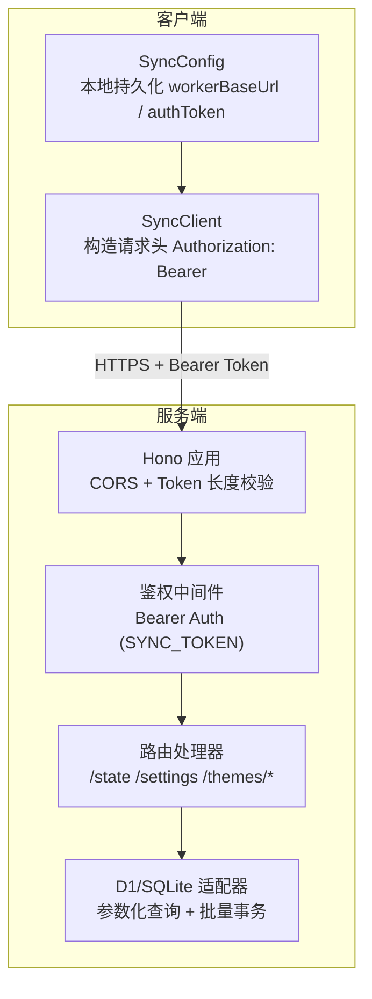
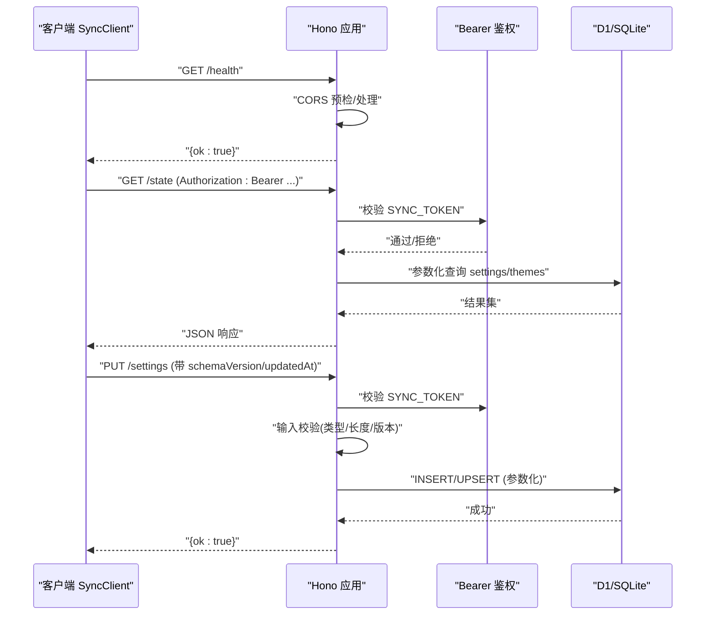
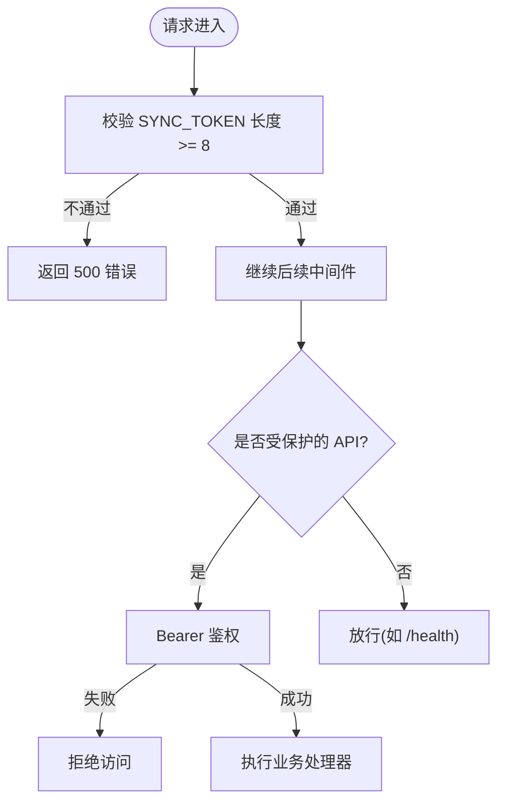
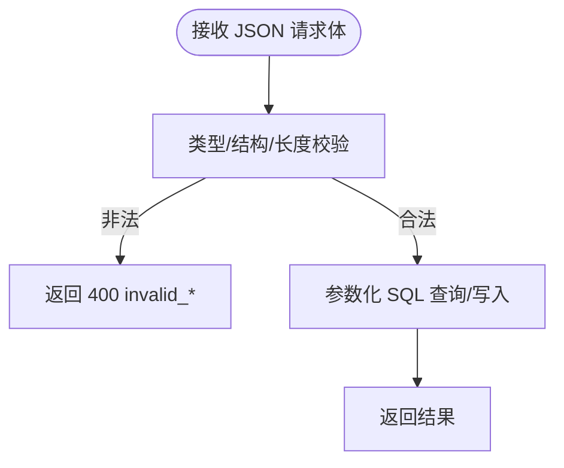
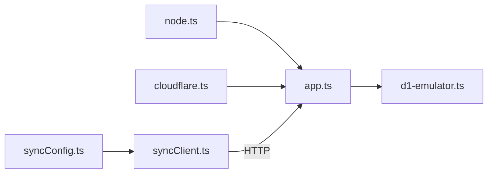

# 安全机制

<cite>
**本文引用的文件**
- [app.ts](file://sync-server/src/app.ts)
- [node.ts](file://sync-server/src/node.ts)
- [d1-emulator.ts](file://sync-server/src/d1-emulator.ts)
- [cloudflare.ts](file://sync-server/src/cloudflare.ts)
- [package.json](file://sync-server/package.json)
- [syncClient.ts](file://src/services/sync/syncClient.ts)
- [syncConfig.ts](file://src/services/sync/syncConfig.ts)
</cite>

## 目录
1. [简介](#简介)
2. [项目结构](#项目结构)
3. [核心组件](#核心组件)
4. [架构总览](#架构总览)
5. [详细组件分析](#详细组件分析)
6. [依赖关系分析](#依赖关系分析)
7. [性能与安全权衡](#性能与安全权衡)
8. [故障排查指南](#故障排查指南)
9. [结论](#结论)
10. [附录：配置与最佳实践](#附录配置与最佳实践)

## 简介
本技术文档聚焦 Folia Player 同步服务的安全机制，围绕身份认证、数据传输安全、数据存储安全、API 安全防护以及安全运维最佳实践进行系统化说明。内容基于同步服务端（Hono）与客户端（浏览器/桌面端）的实际实现，涵盖 Bearer Token 认证、CORS 跨域、输入校验、SQL 注入防护、数据库访问控制、密钥管理与日志脱敏等主题，并提供可操作的排障建议与加固指引。

## 项目结构
同步服务由两部分组成：
- 服务端：基于 Hono 的轻量 API 服务，支持 Cloudflare Workers 与 Node.js 两种运行环境；使用 D1（或本地 SQLite 模拟器）存储设置与主题数据。
- 客户端：浏览器/桌面端的同步客户端，负责携带 Bearer Token 发起请求、解析响应并持久化本地配置与状态。

图示来源
- [app.ts:121-143](file://sync-server/src/app.ts#L121-L143)
- [app.ts:318-324](file://sync-server/src/app.ts#L318-L324)
- [app.ts:326-518](file://sync-server/src/app.ts#L326-L518)
- [d1-emulator.ts:12-48](file://sync-server/src/d1-emulator.ts#L12-L48)
- [syncClient.ts:38-62](file://src/services/sync/syncClient.ts#L38-L62)
- [syncConfig.ts:49-77](file://src/services/sync/syncConfig.ts#L49-L77)

章节来源
- [app.ts:121-143](file://sync-server/src/app.ts#L121-L143)
- [app.ts:318-324](file://sync-server/src/app.ts#L318-L324)
- [d1-emulator.ts:12-48](file://sync-server/src/d1-emulator.ts#L12-L48)
- [syncClient.ts:38-62](file://src/services/sync/syncClient.ts#L38-L62)
- [syncConfig.ts:49-77](file://src/services/sync/syncConfig.ts#L49-L77)

## 核心组件
- 身份认证与授权
  - 全局 Token 强度校验：要求 SYNC_TOKEN 至少 8 位，否则直接拒绝服务。
  - Bearer Token 鉴权：所有 API 路由通过 bearerAuth 中间件校验 Authorization 头中的 token 与服务端配置的 SYNC_TOKEN 是否一致。
  - 管理面板令牌：可选的 DASHBOARD_TOKEN，用于只读仪表盘访问控制。
- 跨域与传输层
  - CORS：允许 GET/POST/PUT/OPTIONS，允许 Authorization 与 Content-Type 头，origin 为 *（生产部署建议收紧）。
  - HTTPS：推荐在网关/CDN 层强制 HTTPS；Node 自托管可通过反向代理启用 TLS。
- 输入校验与防注入
  - 严格的 JSON 结构校验与类型检查，限制批量大小与分页上限。
  - 全部 SQL 使用参数化绑定，避免拼接字符串，防止 SQL 注入。
- 数据存储与访问控制
  - 使用 D1 或本地 SQLite（WAL 模式），通过参数化语句与批处理事务写入。
  - 仅暴露最小必要接口，敏感字段以 JSON 文本存储，未做额外加密（见“数据存储安全”建议）。
- 客户端安全
  - 统一封装 fetch，自动附加 Authorization 头；错误码非 2xx 抛出异常。
  - 本地持久化 workerBaseUrl 与 authToken，需配合前端安全策略（如仅可信页面读取）。

章节来源
- [app.ts:129-135](file://sync-server/src/app.ts#L129-L135)
- [app.ts:123-127](file://sync-server/src/app.ts#L123-L127)
- [app.ts:318-324](file://sync-server/src/app.ts#L318-L324)
- [app.ts:352-371](file://sync-server/src/app.ts#L352-L371)
- [app.ts:373-494](file://sync-server/src/app.ts#L373-L494)
- [d1-emulator.ts:12-48](file://sync-server/src/d1-emulator.ts#L12-L48)
- [syncClient.ts:38-62](file://src/services/sync/syncClient.ts#L38-L62)
- [syncConfig.ts:49-77](file://src/services/sync/syncConfig.ts#L49-L77)

## 架构总览
下图展示从客户端到服务端再到数据库的完整调用链与安全控制点。

图示来源
- [app.ts:121-143](file://sync-server/src/app.ts#L121-L143)
- [app.ts:318-324](file://sync-server/src/app.ts#L318-L324)
- [app.ts:326-371](file://sync-server/src/app.ts#L326-L371)
- [d1-emulator.ts:12-48](file://sync-server/src/d1-emulator.ts#L12-L48)
- [syncClient.ts:38-62](file://src/services/sync/syncClient.ts#L38-L62)

## 详细组件分析

### 身份认证与权限控制
- 全局 Token 强度校验：启动时与服务端中间件双重校验 SYNC_TOKEN 长度，弱口令直接返回错误。
- Bearer Token 鉴权：所有 API 路由统一挂载 bearerAuth，确保只有持有正确 token 的请求进入业务逻辑。
- 管理面板保护：根路径 / 提供可选的 DASHBOARD_TOKEN 查询参数校验，未命中则返回 404。

图示来源
- [app.ts:129-135](file://sync-server/src/app.ts#L129-L135)
- [app.ts:318-324](file://sync-server/src/app.ts#L318-L324)
- [app.ts:146-152](file://sync-server/src/app.ts#L146-L152)

章节来源
- [app.ts:129-135](file://sync-server/src/app.ts#L129-L135)
- [app.ts:318-324](file://sync-server/src/app.ts#L318-L324)
- [app.ts:146-152](file://sync-server/src/app.ts#L146-L152)

### 数据传输安全
- CORS 配置：允许常见方法与头部，便于跨域调试；生产环境建议限定 origin 与白名单域名。
- HTTPS 强制：建议在网关/CDN 层强制 HTTPS；Node 自托管通过反向代理（如 Nginx/Traefik）启用 TLS。
- 请求签名验证：当前未实现请求签名；如需增强，可在网关层引入 HMAC 签名校验或短期一次性令牌。

章节来源
- [app.ts:123-127](file://sync-server/src/app.ts#L123-L127)

### 输入校验与 SQL 注入防护
- 严格类型与结构校验：对 settings、themes 等请求体进行类型检查与字段存在性校验，拒绝非法结构。
- 批量与分页限制：限制 themes 批量提交数量与列表分页上限，防止资源滥用。
- 参数化查询：所有 SQL 均通过 prepare/bind 传入参数，杜绝字符串拼接，有效防御 SQL 注入。

图示来源
- [app.ts:352-371](file://sync-server/src/app.ts#L352-L371)
- [app.ts:373-494](file://sync-server/src/app.ts#L373-L494)
- [d1-emulator.ts:12-48](file://sync-server/src/d1-emulator.ts#L12-L48)

章节来源
- [app.ts:352-371](file://sync-server/src/app.ts#L352-L371)
- [app.ts:373-494](file://sync-server/src/app.ts#L373-L494)
- [d1-emulator.ts:12-48](file://sync-server/src/d1-emulator.ts#L12-L48)

### 数据存储安全
- 数据库访问控制：通过环境变量注入数据库实例，仅服务内部可访问；Node 模式下使用本地 SQLite 文件（WAL 模式）。
- 敏感信息加密：当前以 JSON 文本形式存储设置与主题，未做额外加密；建议对敏感字段在服务端落盘前进行加密或使用 KMS 管理的密钥。
- 备份与恢复：建议定期备份 SQLite 文件或迁移至云端托管数据库，并对备份文件实施访问控制与加密。

章节来源
- [node.ts:31-47](file://sync-server/src/node.ts#L31-L47)
- [d1-emulator.ts:1-10](file://sync-server/src/d1-emulator.ts#L1-L10)
- [app.ts:47-78](file://sync-server/src/app.ts#L47-L78)

### 客户端安全实现
- 统一请求封装：所有请求自动附加 Authorization: Bearer <token>，非 2xx 响应抛出结构化错误。
- 本地配置持久化：workerBaseUrl 与 authToken 保存在 localStorage；建议结合应用级访问控制与最小权限原则。
- 连接测试与健康检查：通过 /health 快速验证连通性与后端能力。

章节来源
- [syncClient.ts:38-62](file://src/services/sync/syncClient.ts#L38-L62)
- [syncClient.ts:64-78](file://src/services/sync/syncClient.ts#L64-L78)
- [syncConfig.ts:49-77](file://src/services/sync/syncConfig.ts#L49-L77)

## 依赖关系分析
- 运行时与环境
  - Node.js 版本要求：>=24.0.0。
  - 依赖库：Hono、@hono/node-server、better-sqlite3、wrangler（Cloudflare 开发/部署）。
- 模块耦合
  - app.ts 定义路由、中间件与数据处理逻辑，依赖 d1-emulator.ts 提供的 D1 兼容接口。
  - node.ts 负责加载 .env、初始化 SQLite 并启动 HTTP 服务，注入环境变量与数据库实例。
  - cloudflare.ts 将 app 作为 Worker 入口导出。
  - 客户端 syncClient.ts 与 syncConfig.ts 构成统一的 HTTP 适配与配置持久化。

图示来源
- [package.json:20-31](file://sync-server/package.json#L20-L31)
- [node.ts:1-8](file://sync-server/src/node.ts#L1-L8)
- [cloudflare.ts:1-3](file://sync-server/src/cloudflare.ts#L1-L3)
- [app.ts:1-21](file://sync-server/src/app.ts#L1-L21)
- [d1-emulator.ts:1-10](file://sync-server/src/d1-emulator.ts#L1-L10)
- [syncClient.ts:1-15](file://src/services/sync/syncClient.ts#L1-L15)
- [syncConfig.ts:1-16](file://src/services/sync/syncConfig.ts#L1-L16)

章节来源
- [package.json:20-31](file://sync-server/package.json#L20-L31)
- [node.ts:1-8](file://sync-server/src/node.ts#L1-L8)
- [cloudflare.ts:1-3](file://sync-server/src/cloudflare.ts#L1-L3)
- [app.ts:1-21](file://sync-server/src/app.ts#L1-L21)
- [d1-emulator.ts:1-10](file://sync-server/src/d1-emulator.ts#L1-L10)
- [syncClient.ts:1-15](file://src/services/sync/syncClient.ts#L1-L15)
- [syncConfig.ts:1-16](file://src/services/sync/syncConfig.ts#L1-L16)

## 性能与安全权衡
- 批量写入与事务：使用 batch 与事务提升写入吞吐，同时减少锁竞争；注意合理控制批次大小以避免单次请求过大。
- 分页与游标：主题列表采用游标分页，限制最大页大小，平衡带宽与延迟。
- CORS 放宽与风险：开发阶段 origin=* 便于调试，生产应严格限制来源域名，降低 CSRF 与跨站滥用风险。
- 日志与审计：当前日志包含更新时间戳，未输出敏感数据；建议在生产开启结构化日志与访问审计，并脱敏任何可能泄露的标识符。

[本节为通用指导，不直接引用具体文件]

## 故障排查指南
- 启动失败：确认已设置 SYNC_TOKEN 且长度不少于 8 位；Node 模式会打印错误并退出。
- 401/403 鉴权失败：检查客户端 Authorization 头是否正确携带 Bearer Token；服务端 SYNC_TOKEN 是否一致。
- CORS 错误：确认请求方法/头在允许范围内；生产环境请收紧 origin。
- 数据库写入失败：检查 D1/SQLite 可用性与权限；关注参数化查询是否正确使用 bind。
- 健康检查：通过 /health 验证服务可用性。

章节来源
- [node.ts:31-47](file://sync-server/src/node.ts#L31-L47)
- [app.ts:129-135](file://sync-server/src/app.ts#L129-L135)
- [app.ts:123-127](file://sync-server/src/app.ts#L123-L127)
- [app.ts:316-316](file://sync-server/src/app.ts#L316-L316)

## 结论
Folia 同步服务在认证、跨域、输入校验与 SQL 注入防护方面具备基础而有效的安全措施。生产部署建议进一步收紧 CORS、强制 HTTPS、实现请求签名、对敏感数据进行加密存储，并完善日志审计与访问控制。客户端侧应避免明文长期保存高价值凭证，结合最小权限与可信环境使用。

[本节为总结性内容，不直接引用具体文件]

## 附录：配置与最佳实践
- 密钥管理
  - 使用环境变量或平台密钥管理服务（如 Cloudflare Secrets、KMS）管理 SYNC_TOKEN 与 DASHBOARD_TOKEN。
  - 禁止将密钥提交至代码仓库；Node 模式使用 .env 文件并限制文件权限。
- 传输安全
  - 在网关/CDN 层强制 HTTPS；必要时启用 HSTS。
  - 生产环境将 CORS origin 限制为已知域名。
- 输入与速率限制
  - 保持现有输入校验与批量限制；在网关层增加 IP/用户维度的速率限制，抵御暴力破解与滥用。
- 数据安全
  - 对敏感字段在服务端落盘前进行加密；定期备份并加密备份文件。
  - 数据库最小权限原则，仅服务进程可访问。
- 日志与审计
  - 记录访问日志与关键操作时间戳；避免记录敏感信息。
  - 集中收集日志，设置告警阈值与异常检测。
- 漏洞检测与修复
  - 定期扫描依赖漏洞并升级；对第三方库启用安全更新策略。
  - 对新增接口进行安全评审，遵循最小暴露原则。
  - 建立回归测试用例覆盖鉴权、输入校验与边界条件。

[本节为通用指导，不直接引用具体文件]