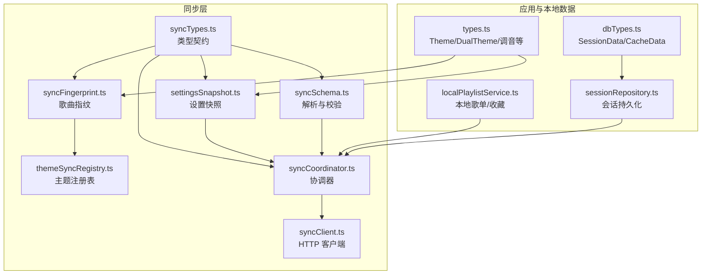
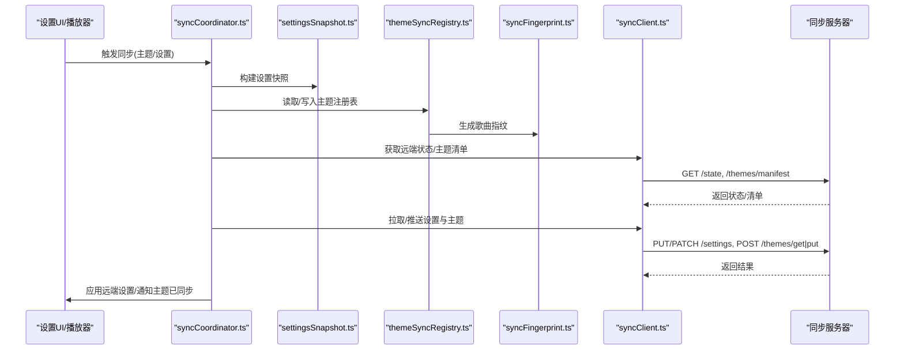
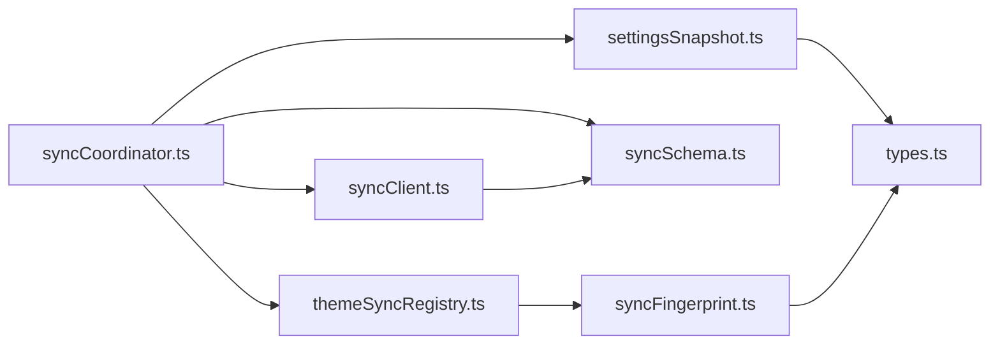

# 数据类型定义

<cite>
**本文引用的文件**
- [syncTypes.ts](file://src/services/sync/syncTypes.ts)
- [syncSchema.ts](file://src/services/sync/syncSchema.ts)
- [settingsSnapshot.ts](file://src/services/sync/settingsSnapshot.ts)
- [themeSyncRegistry.ts](file://src/services/sync/themeSyncRegistry.ts)
- [syncFingerprint.ts](file://src/services/sync/syncFingerprint.ts)
- [syncCoordinator.ts](file://src/services/sync/syncCoordinator.ts)
- [syncClient.ts](file://src/services/sync/syncClient.ts)
- [types.ts](file://src/types.ts)
- [localPlaylistService.ts](file://src/services/localPlaylistService.ts)
- [sessionRepository.ts](file://src/services/repositories/sessionRepository.ts)
- [dbTypes.ts](file://src/services/dbTypes.ts)
</cite>

## 目录
1. [简介](#简介)
2. [项目结构](#项目结构)
3. [核心组件](#核心组件)
4. [架构总览](#架构总览)
5. [详细组件分析](#详细组件分析)
6. [依赖关系分析](#依赖关系分析)
7. [性能考虑](#性能考虑)
8. [故障排查指南](#故障排查指南)
9. [结论](#结论)
10. [附录](#附录)

## 简介
本文件聚焦 Folia Player 的“可同步数据类型”与“主题数据指纹/来源标记”，覆盖设置数据（settings）、主题数据（themes）以及本地播放历史、收藏列表等核心业务数据的类型定义、字段约束、验证规则与迁移策略。同时说明 schemaVersion 的作用、向后兼容性保证、数据迁移策略，并给出序列化格式规范与安全存储建议。

## 项目结构
与同步相关的数据类型与处理逻辑主要分布在以下模块：
- 类型契约与导出包：syncTypes.ts
- 防御性解析与版本校验：syncSchema.ts
- 设置快照构建与应用：settingsSnapshot.ts
- 主题指纹与注册表：syncFingerprint.ts、themeSyncRegistry.ts
- 协调器与客户端：syncCoordinator.ts、syncClient.ts
- 通用类型与本地库：types.ts、localPlaylistService.ts、sessionRepository.ts、dbTypes.ts

图表来源
- [syncTypes.ts:1-115](file://src/services/sync/syncTypes.ts#L1-L115)
- [syncSchema.ts:1-237](file://src/services/sync/syncSchema.ts#L1-L237)
- [settingsSnapshot.ts:1-114](file://src/services/sync/settingsSnapshot.ts#L1-L114)
- [syncFingerprint.ts:1-103](file://src/services/sync/syncFingerprint.ts#L1-L103)
- [themeSyncRegistry.ts:1-210](file://src/services/sync/themeSyncRegistry.ts#L1-L210)
- [syncCoordinator.ts:1-215](file://src/services/sync/syncCoordinator.ts#L1-L215)
- [syncClient.ts:1-152](file://src/services/sync/syncClient.ts#L1-L152)
- [types.ts:83-112](file://src/types.ts#L83-L112)
- [localPlaylistService.ts:1-370](file://src/services/localPlaylistService.ts#L1-L370)
- [sessionRepository.ts:1-35](file://src/services/repositories/sessionRepository.ts#L1-L35)
- [dbTypes.ts:1-23](file://src/services/dbTypes.ts#L1-L23)

章节来源
- [syncTypes.ts:1-115](file://src/services/sync/syncTypes.ts#L1-L115)
- [syncSchema.ts:1-237](file://src/services/sync/syncSchema.ts#L1-L237)
- [settingsSnapshot.ts:1-114](file://src/services/sync/settingsSnapshot.ts#L1-L114)
- [syncFingerprint.ts:1-103](file://src/services/sync/syncFingerprint.ts#L1-L103)
- [themeSyncRegistry.ts:1-210](file://src/services/sync/themeSyncRegistry.ts#L1-L210)
- [syncCoordinator.ts:1-215](file://src/services/sync/syncCoordinator.ts#L1-L215)
- [syncClient.ts:1-152](file://src/services/sync/syncClient.ts#L1-L152)
- [types.ts:83-112](file://src/types.ts#L83-L112)
- [localPlaylistService.ts:1-370](file://src/services/localPlaylistService.ts#L1-L370)
- [sessionRepository.ts:1-35](file://src/services/repositories/sessionRepository.ts#L1-L35)
- [dbTypes.ts:1-23](file://src/services/dbTypes.ts#L1-L23)

## 核心组件
- 同步类型契约：定义可同步的设置记录、主题记录、远程状态、导出包等核心数据结构。
- 防御性解析：对来自远端或导入包的 JSON 进行严格校验与规范化，确保 schemaVersion 一致、字段类型安全。
- 设置快照：将 UI 设置映射为可同步的视觉设置对象，并提供反向应用能力。
- 主题指纹与注册表：基于歌曲元数据或在线源 ID 生成稳定指纹，维护本地缓存键到指纹的映射。
- 协调器：编排启动同步、手动同步、导入导出、设置拉取/推送等流程。
- HTTP 客户端：封装与用户自建同步服务器的通信，统一鉴权与响应解析。

章节来源
- [syncTypes.ts:1-115](file://src/services/sync/syncTypes.ts#L1-L115)
- [syncSchema.ts:1-237](file://src/services/sync/syncSchema.ts#L1-L237)
- [settingsSnapshot.ts:1-114](file://src/services/sync/settingsSnapshot.ts#L1-L114)
- [syncFingerprint.ts:1-103](file://src/services/sync/syncFingerprint.ts#L1-L103)
- [themeSyncRegistry.ts:1-210](file://src/services/sync/themeSyncRegistry.ts#L1-L210)
- [syncCoordinator.ts:1-215](file://src/services/sync/syncCoordinator.ts#L1-L215)
- [syncClient.ts:1-152](file://src/services/sync/syncClient.ts#L1-L152)

## 架构总览
下图展示从 UI 设置到远端同步的主题与设置数据流，包括指纹生成、注册表维护、协调器调度与客户端请求。

图表来源
- [syncCoordinator.ts:50-150](file://src/services/sync/syncCoordinator.ts#L50-L150)
- [settingsSnapshot.ts:9-58](file://src/services/sync/settingsSnapshot.ts#L9-L58)
- [themeSyncRegistry.ts:145-175](file://src/services/sync/themeSyncRegistry.ts#L145-L175)
- [syncFingerprint.ts:73-103](file://src/services/sync/syncFingerprint.ts#L73-L103)
- [syncClient.ts:64-152](file://src/services/sync/syncClient.ts#L64-L152)

## 详细组件分析

### 设置数据（Settings）
- 可同步字段集合：包含跟随系统主题、可视化模式、背景/透明度、字幕显示与字体、各可视化器调音参数、主页布局与卡片样式等。
- 记录包装：每条设置记录包含 schemaVersion、updatedAt、data（具体设置）。
- 构建与应用：
  - 构建：从 UI 设置状态映射为 SyncedVisualSettings，并收集可视化器调音。
  - 应用：按字段逐一调用设置更新方法，兼容旧版逐字段调音键与新集中式 visualizerTunings。
- 签名与比较：通过 JSON 字符串化生成的签名用于快速判断是否需要推送。

字段与约束要点
- 布尔开关：followSystemTheme、hidePlayerTranslationSubtitle、showSubtitleTranslation、subtitleOverlayBackground、subtitleFontInheritsLyrics 等。
- 枚举值：visualizerMode、subtitleContentMode（translation/romanization/none）、homeLayoutStyle（carousel/grid）、grid3dCardStyle（image/card）。
- 数值范围：backgroundOpacity、visualizerOpacity、lyricsFontScale、fontWeight（100-900）。
- 可选空值：visualizerBackgroundMode 可为 null；urlBackgroundSelectedId 可为 null。
- 数组：lyricsFontFallbackFamilies、subtitleFontFallbackFamilies、urlBackgroundList。
- 调音对象：visualizerTunings 与各可视化器独立 tuning 字段兼容。

章节来源
- [syncTypes.ts:27-73](file://src/services/sync/syncTypes.ts#L27-L73)
- [settingsSnapshot.ts:9-114](file://src/services/sync/settingsSnapshot.ts#L9-L114)
- [syncSchema.ts:43-105](file://src/services/sync/syncSchema.ts#L43-L105)

### 主题数据（Themes）
- 记录结构：fingerprint、theme（DualTheme）、updatedAt、source。
- 来源标记 source：
  - auto：由 AI 自动生成。
  - fallback：回退主题（例如无匹配时）。
  - edited：用户编辑后的主题。
  - manual：其他来源或兜底。
- 指纹算法：
  - 在线歌曲：使用 providerId + mediaId 的稳定标识。
  - 本地/其他：基于归一化的标题、艺术家、时长（按秒取整到5秒）拼接而成。
  - 网易云兼容：额外支持 netease:id:<id> 形式的指纹。
- 注册表：维护 fingerprint -> cacheKey 的映射，便于在本地缓存中定位主题资源；支持从 localStorage 迁移至 IndexedDB。

章节来源
- [syncTypes.ts:75-80](file://src/services/sync/syncTypes.ts#L75-L80)
- [syncFingerprint.ts:8-103](file://src/services/sync/syncFingerprint.ts#L8-L103)
- [themeSyncRegistry.ts:10-210](file://src/services/sync/themeSyncRegistry.ts#L10-L210)
- [syncSchema.ts:107-135](file://src/services/sync/syncSchema.ts#L107-L135)

### 播放历史与收藏列表
- 播放历史：当前代码未暴露独立的“播放历史”同步类型；已完整播放的歌曲音频与封面会被缓存到媒体缓存中，以便后续快速加载。
- 收藏列表：以“本地歌单”形式实现，其中“收藏歌曲”是一个特殊的本地歌单（isFavorite），通过 songIds 维护收藏曲目。
- 会话数据：当前会话中的歌词、临时主题、封面 URL 等保存在会话表中，不直接参与跨设备同步。

章节来源
- [playedTrackCache.ts:1-76](file://src/services/playedTrackCache.ts#L1-L76)
- [localPlaylistService.ts:1-370](file://src/services/localPlaylistService.ts#L1-L370)
- [sessionRepository.ts:1-35](file://src/services/repositories/sessionRepository.ts#L1-L35)
- [dbTypes.ts:1-23](file://src/services/dbTypes.ts#L1-L23)

### 数据版本管理与迁移
- schemaVersion：所有可同步数据均携带 schemaVersion，解析时强制与 SYNC_SCHEMA_VERSION 一致，否则拒绝该数据。
- 向后兼容：
  - 解析器对未知字段采用“存在即接受”的策略（如各 tuning 字段），对新字段保持向前兼容。
  - 设置记录在应用时优先使用集中式 visualizerTunings，若不存在则回退到旧版逐字段 tuning。
- 迁移策略：
  - 主题注册表从 localStorage 迁移到 IndexedDB，避免覆盖已有更新的行。
  - 本地歌单在读取时进行规范化与修复（去重、主键修正、时间戳补齐），必要时写回缓存。

章节来源
- [syncTypes.ts:7](file://src/services/sync/syncTypes.ts#L7)
- [syncSchema.ts:25-105](file://src/services/sync/syncSchema.ts#L25-L105)
- [settingsSnapshot.ts:91-113](file://src/services/sync/settingsSnapshot.ts#L91-L113)
- [themeSyncRegistry.ts:46-108](file://src/services/sync/themeSyncRegistry.ts#L46-L108)
- [localPlaylistService.ts:145-258](file://src/services/localPlaylistService.ts#L145-L258)

### 序列化格式规范
- 设置记录：
  - schemaVersion: 数字，必须等于 SYNC_SCHEMA_VERSION。
  - updatedAt: ISO 日期字符串。
  - data: 符合 SyncedVisualSettings 的对象。
- 主题记录：
  - fingerprint: 非空字符串。
  - theme: DualTheme 对象（light/dark 均为 Theme）。
  - updatedAt: ISO 日期字符串。
  - source: 限定为 auto/fallback/edited/manual 之一，非法值将被规范化为 manual。
- 导出包：
  - kind: 固定为 folia-sync-export。
  - schemaVersion/exportedAt/themes/settings 同上。

章节来源
- [syncTypes.ts:69-114](file://src/services/sync/syncTypes.ts#L69-L114)
- [syncSchema.ts:95-166](file://src/services/sync/syncSchema.ts#L95-L166)

### 安全与存储考虑
- 传输安全：客户端请求统一附加 Authorization: Bearer token，服务端需启用 HTTPS。
- 数据完整性：所有远端返回数据经解析器校验 schemaVersion 与字段类型，失败即丢弃。
- 本地存储：
  - 主题注册表与歌单使用 IndexedDB/缓存机制，具备迁移与修复能力。
  - 会话数据仅保留短期必要信息，避免敏感内容长期驻留。
- 压缩与加密：
  - 当前代码未内置压缩/加密；建议在网络层启用 TLS，并在服务端对敏感数据进行加密存储。
  - 如需离线备份，可在导出包层面增加压缩与加密步骤（不在当前仓库范围内）。

章节来源
- [syncClient.ts:38-62](file://src/services/sync/syncClient.ts#L38-L62)
- [syncSchema.ts:17-41](file://src/services/sync/syncSchema.ts#L17-L41)
- [themeSyncRegistry.ts:72-108](file://src/services/sync/themeSyncRegistry.ts#L72-L108)
- [localPlaylistService.ts:212-258](file://src/services/localPlaylistService.ts#L212-L258)

## 依赖关系分析
- syncCoordinator 依赖 settingsSnapshot、syncClient、syncSchema 与主题注册表，负责编排同步流程。
- syncClient 依赖 syncSchema 进行响应解析，统一错误处理。
- themeSyncRegistry 依赖 syncFingerprint 生成稳定键，并读写数据库。
- 设置与主题类型均来自 syncTypes，主题渲染与调音类型来自 types.ts。

图表来源
- [syncCoordinator.ts:1-215](file://src/services/sync/syncCoordinator.ts#L1-L215)
- [settingsSnapshot.ts:1-114](file://src/services/sync/settingsSnapshot.ts#L1-L114)
- [syncClient.ts:1-152](file://src/services/sync/syncClient.ts#L1-L152)
- [syncSchema.ts:1-237](file://src/services/sync/syncSchema.ts#L1-L237)
- [themeSyncRegistry.ts:1-210](file://src/services/sync/themeSyncRegistry.ts#L1-L210)
- [syncFingerprint.ts:1-103](file://src/services/sync/syncFingerprint.ts#L1-L103)
- [types.ts:83-112](file://src/types.ts#L83-L112)

## 性能考虑
- 指纹计算：对本地歌曲使用归一化文本与取整时长，降低噪声并提升稳定性。
- 批量拉取：主题拉取支持按指纹或桶（bucket）批量获取，减少往返次数。
- 增量同步：通过 schemaVersion 与 updatedAt 控制是否拉取设置，避免重复应用。
- 本地缓存：已完整播放的音频与封面被缓存，减少重复下载。

章节来源
- [syncFingerprint.ts:57-103](file://src/services/sync/syncFingerprint.ts#L57-L103)
- [syncClient.ts:87-152](file://src/services/sync/syncClient.ts#L87-L152)
- [syncCoordinator.ts:65-83](file://src/services/sync/syncCoordinator.ts#L65-L83)
- [playedTrackCache.ts:30-76](file://src/services/playedTrackCache.ts#L30-L76)

## 故障排查指南
- 同步失败：检查网络与 token，查看协调器设置的 lastError 与状态。
- 设置未生效：确认解析器是否通过 schemaVersion 校验；检查字段是否在允许范围内。
- 主题未同步：核对指纹是否稳定；确认注册表是否成功写入；检查远端主题清单与桶差异。
- 导入导出失败：校验导出包 kind 与 schemaVersion；检查 themes/settings 是否为合法结构。

章节来源
- [syncCoordinator.ts:95-150](file://src/services/sync/syncCoordinator.ts#L95-L150)
- [syncSchema.ts:95-166](file://src/services/sync/syncSchema.ts#L95-L166)
- [syncClient.ts:19-62](file://src/services/sync/syncClient.ts#L19-L62)

## 结论
Folia Player 的可同步数据类型以强类型契约与防御性解析为核心，确保跨设备同步的一致性与健壮性。设置数据聚焦可视化与字幕体验，主题数据通过稳定指纹与来源标记实现可追溯与可迁移。协调器与客户端提供清晰的同步编排与通信抽象。对于播放历史与收藏，当前以本地缓存与本地歌单为主，未来可按需扩展为可同步实体。

## 附录

### 关键类型速览
- SyncedSettingsRecord：schemaVersion、updatedAt、data（SyncedVisualSettings）。
- SyncedThemeRecord：fingerprint、theme（DualTheme）、updatedAt、source。
- SyncRemoteState：schemaVersion、settingsUpdatedAt、themesUpdatedAt、themeCount。
- SyncLibraryExportBundle：kind、schemaVersion、exportedAt、settings、themes。

章节来源
- [syncTypes.ts:69-114](file://src/services/sync/syncTypes.ts#L69-L114)

### 主题来源标记含义与场景
- auto：AI 自动生成的主题，适合首次或批量生成。
- fallback：当无法生成或匹配时的回退主题，保证界面可用。
- edited：用户对主题进行编辑后产生，体现个性化。
- manual：其他来源或兜底，常用于兼容旧数据或外部导入。

章节来源
- [syncTypes.ts:12](file://src/services/sync/syncTypes.ts#L12)
- [syncSchema.ts:117-124](file://src/services/sync/syncSchema.ts#L117-L124)

### 主题指纹算法摘要
- 在线歌曲：providerId:id:mediaId。
- 本地/其他：sourceKind|title|artists|roundedDurationSec。
- 网易云兼容：netease:id:songId。

章节来源
- [syncFingerprint.ts:47-103](file://src/services/sync/syncFingerprint.ts#L47-L103)