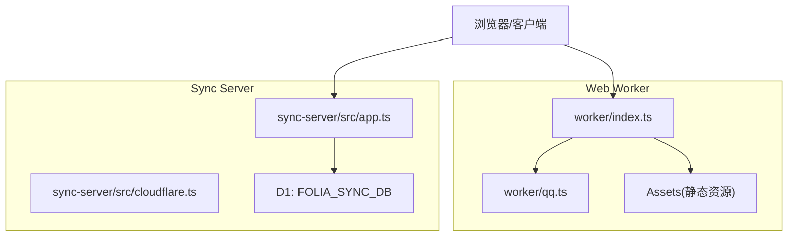
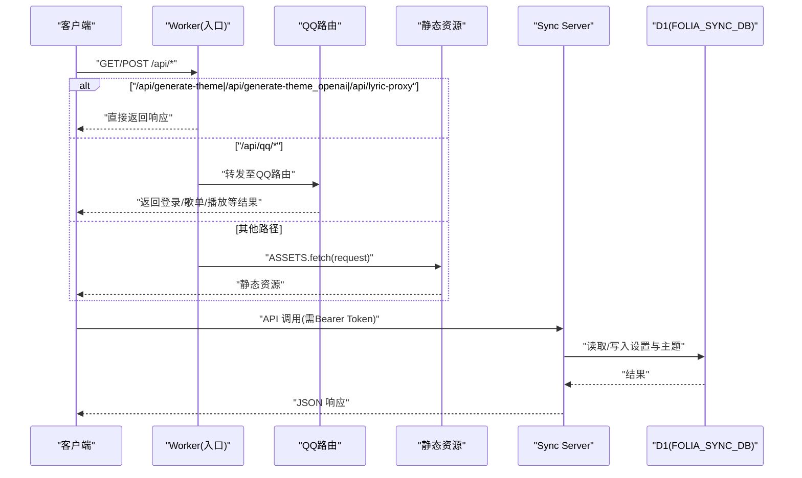
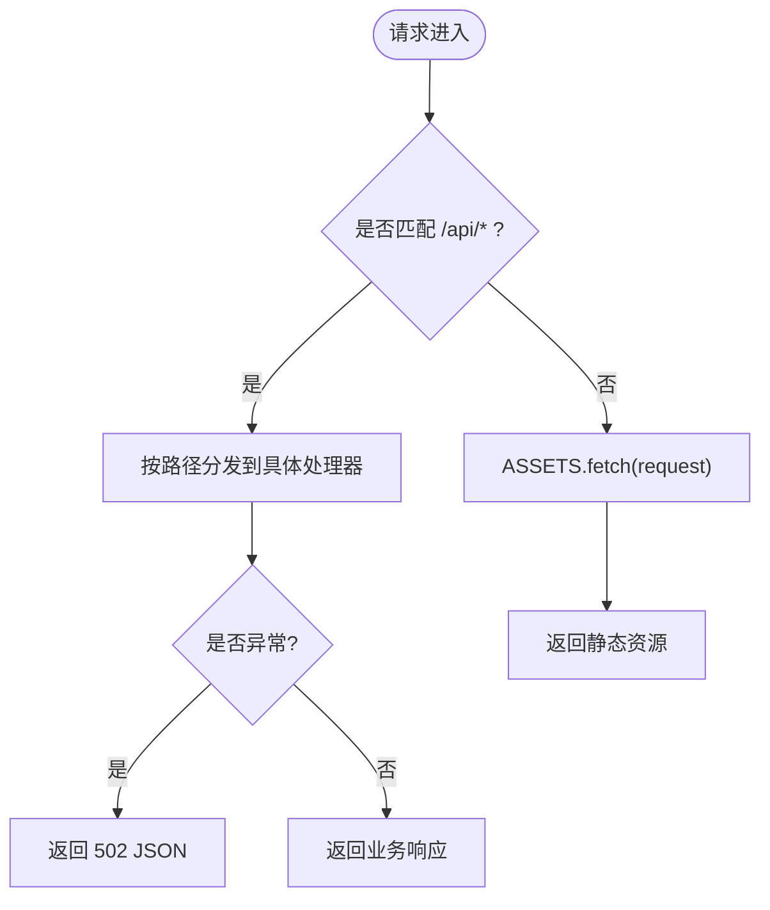
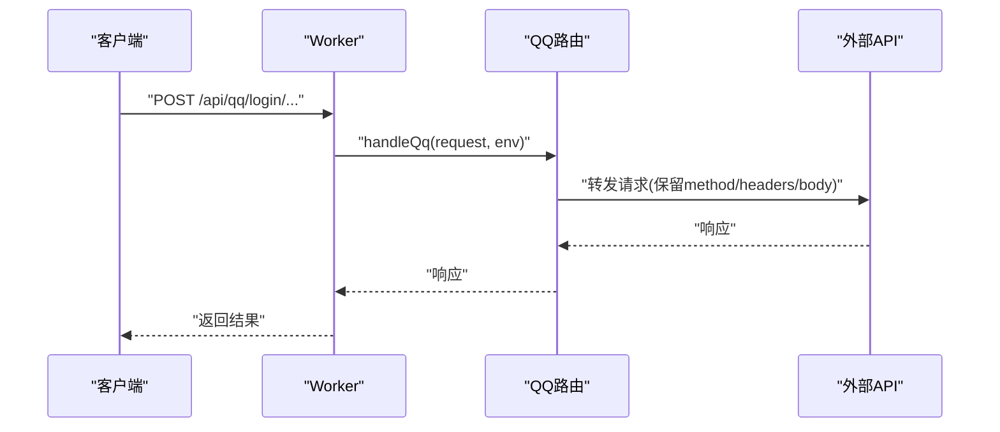
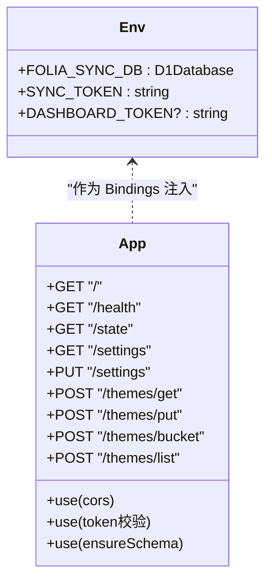
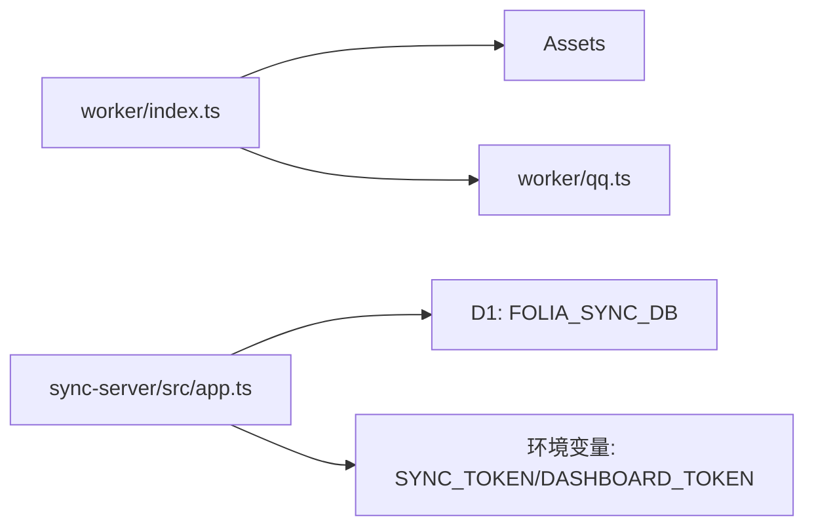

# Cloudflare Workers Serverless部署

<cite>
**本文引用的文件**
- [wrangler.jsonc](file://wrangler.jsonc)
- [worker/index.ts](file://worker/index.ts)
- [worker/qq.ts](file://worker/qq.ts)
- [sync-server/wrangler.toml](file://sync-server/wrangler.toml)
- [sync-server/src/app.ts](file://sync-server/src/app.ts)
- [sync-server/src/cloudflare.ts](file://sync-server/src/cloudflare.ts)
- [sync-server/package.json](file://sync-server/package.json)
- [README.md](file://README.md)
- [docs/qq-music-deployment.md](file://docs/qq-music-deployment.md)
</cite>

## 目录
1. [简介](#简介)
2. [项目结构](#项目结构)
3. [核心组件](#核心组件)
4. [架构总览](#架构总览)
5. [详细组件分析](#详细组件分析)
6. [依赖关系分析](#依赖关系分析)
7. [性能与生产优化](#性能与生产优化)
8. [故障排查指南](#故障排查指南)
9. [结论](#结论)
10. [附录：部署清单与命令](#附录部署清单与命令)

## 简介
本指南面向在 Cloudflare Workers 上以 Serverless 方式部署本项目，并配套部署可选的“同步服务（Sync Server）”。内容涵盖：
- 配置 wrangler 配置文件（Workers 项目设置、环境变量、D1 数据库绑定等）
- 安全令牌 SYNC_TOKEN 与 DASHBOARD_TOKEN 的生成与配置方法
- Cloudflare 账户注册、Workers 创建、D1 数据库初始化步骤
- 域名绑定、SSL 证书、CDN 优化等生产环境最佳实践
- 监控 Workers 性能、查看日志、处理错误等运维操作

## 项目结构
仓库包含两个可独立部署的 Cloudflare 相关部分：
- Web Worker：提供静态资源托管与若干 API（主题生成、歌词代理、QQ 音乐路由等），入口为 worker/index.ts，构建产物通过 Assets 托管。
- Sync Server：基于 Hono 的轻量同步服务，支持 Cloudflare Workers + D1 部署，入口为 sync-server/src/cloudflare.ts，配置模板在 sync-server/wrangler.toml。

图表来源
- [worker/index.ts:1-64](file://worker/index.ts#L1-L64)
- [worker/qq.ts:1-135](file://worker/qq.ts#L1-L135)
- [sync-server/src/app.ts:121-523](file://sync-server/src/app.ts#L121-L523)
- [sync-server/src/cloudflare.ts:1-3](file://sync-server/src/cloudflare.ts#L1-L3)

章节来源
- [wrangler.jsonc:1-20](file://wrangler.jsonc#L1-L20)
- [worker/index.ts:1-64](file://worker/index.ts#L1-L64)
- [sync-server/wrangler.toml:1-13](file://sync-server/wrangler.toml#L1-L13)
- [sync-server/src/app.ts:121-523](file://sync-server/src/app.ts#L121-L523)
- [sync-server/src/cloudflare.ts:1-3](file://sync-server/src/cloudflare.ts#L1-L3)

## 核心组件
- Web Worker 入口：统一路由分发，优先处理 /api/* 路径，其余回退到静态资源。
- QQ 音乐路由：封装第三方 serverless 接口，支持微信扫码；可选启用 Durable Object 支持 QQ 扫码。
- Sync Server：提供受 Bearer Token 保护的同步 API，使用 D1 存储设置与主题数据，并提供 Dashboard 页面。

章节来源
- [worker/index.ts:31-62](file://worker/index.ts#L31-L62)
- [worker/qq.ts:15-135](file://worker/qq.ts#L15-L135)
- [sync-server/src/app.ts:121-523](file://sync-server/src/app.ts#L121-L523)

## 架构总览
下图展示请求从客户端到 Worker/Sync Server 再到 D1 的完整流程，以及关键中间件与鉴权点。

图表来源
- [worker/index.ts:31-62](file://worker/index.ts#L31-L62)
- [worker/qq.ts:109-135](file://worker/qq.ts#L109-L135)
- [sync-server/src/app.ts:121-523](file://sync-server/src/app.ts#L121-L523)

## 详细组件分析

### Web Worker 路由与静态资源
- 入口统一处理 /api/* 路由，失败时降级为 502 避免影响静态资源。
- 非 /api/* 的请求由 ASSETS 提供静态资源，适用于 SPA 模式。

图表来源
- [worker/index.ts:31-62](file://worker/index.ts#L31-L62)

章节来源
- [worker/index.ts:31-62](file://worker/index.ts#L31-L62)

### QQ 音乐路由（Cloudflare）
- 将宿主前缀下的请求还原为后端识别的路径，透传方法与头，注入服务端密钥。
- 默认仅支持微信扫码；如需 QQ 扫码，需在部署时添加 Durable Object 绑定与迁移。

图表来源
- [worker/qq.ts:109-135](file://worker/qq.ts#L109-L135)

章节来源
- [worker/qq.ts:1-135](file://worker/qq.ts#L1-L135)
- [docs/qq-music-deployment.md:103-208](file://docs/qq-music-deployment.md#L103-L208)

### Sync Server（Hono + D1）
- 全局中间件校验 SYNC_TOKEN 长度，保护所有 API。
- 首次访问自动确保 D1 表结构存在（settings、themes、theme_buckets）。
- 提供 /health、/state、/settings、/themes/* 等受鉴权保护的接口。
- 提供 Dashboard 页面，需 DASHBOARD_TOKEN 验证。

图表来源
- [sync-server/src/app.ts:17-21](file://sync-server/src/app.ts#L17-L21)
- [sync-server/src/app.ts:121-523](file://sync-server/src/app.ts#L121-L523)

章节来源
- [sync-server/src/app.ts:121-523](file://sync-server/src/app.ts#L121-L523)

## 依赖关系分析
- Web Worker 依赖：
  - 静态资源（Assets）
  - 可选的外部 AI 密钥（Gemini/OpenAI）
  - QQ 音乐 serverless 库
- Sync Server 依赖：
  - Hono 框架与 CORS、Bearer Auth
  - D1 数据库（FOLIA_SYNC_DB）
  - 环境变量：SYNC_TOKEN、DASHBOARD_TOKEN

图表来源
- [worker/index.ts:1-64](file://worker/index.ts#L1-L64)
- [sync-server/src/app.ts:17-21](file://sync-server/src/app.ts#L17-L21)

章节来源
- [sync-server/package.json:1-33](file://sync-server/package.json#L1-L33)

## 性能与生产优化
- 路由优先级：通过 run_worker_first 让 /api/* 优先执行，减少静态资源误匹配带来的开销。
- 静态资源：开启 single-page-application 模式，提升 SPA 体验。
- 数据库：D1 批量写入与索引优化（如 themes.updated_at、themes.bucket_id）。
- 鉴权：全局 TOKEN 校验，避免未授权访问。
- 缓存与压缩：在 Cloudflare 控制台开启 Gzip/Brotli、缓存策略与 CDN 加速。
- 域名与 SSL：绑定自有域名，启用 Always Use HTTPS、HTTP/2、HTTP/3。
- 限流与防护：结合 Cloudflare 防火墙规则与速率限制，防止滥用。

章节来源
- [wrangler.jsonc:11-18](file://wrangler.jsonc#L11-L18)
- [sync-server/src/app.ts:47-78](file://sync-server/src/app.ts#L47-L78)
- [sync-server/src/app.ts:121-143](file://sync-server/src/app.ts#L121-L143)

## 故障排查指南
- Web Worker 常见问题
  - /api/qq 返回 502：检查 QQ 路由异常捕获逻辑与上游可用性。
  - 静态资源 404：确认 Assets 目录与 not_found_handling 配置。
- Sync Server 常见问题
  - 401/403：检查 Authorization 头中的 Bearer Token 是否与 SYNC_TOKEN 一致。
  - 500 弱令牌：SYNC_TOKEN 长度不足会被拒绝。
  - Dashboard 无法访问：确认 DASHBOARD_TOKEN 与查询参数 token 一致。
- 日志与监控
  - 在 Cloudflare 控制台查看 Workers 日志与指标。
  - 使用 /health 与 /state 进行健康检查与状态观测。

章节来源
- [worker/index.ts:47-59](file://worker/index.ts#L47-L59)
- [sync-server/src/app.ts:129-143](file://sync-server/src/app.ts#L129-L143)
- [sync-server/src/app.ts:145-153](file://sync-server/src/app.ts#L145-L153)
- [sync-server/src/app.ts:316-340](file://sync-server/src/app.ts#L316-L340)

## 结论
本指南提供了在 Cloudflare Workers 上部署 Web Worker 与可选 Sync Server 的完整路径，包括 wrangler 配置、环境变量与安全令牌管理、D1 数据库绑定、域名与 SSL 配置、CDN 优化及运维监控要点。按照本文步骤，可在无服务器环境下快速上线并稳定运行。

## 附录：部署清单与命令

### 一、Cloudflare 账户与基础准备
- 注册 Cloudflare 账户并登录控制台。
- 在 Workers & Pages 中创建新的 Worker。
- 如需 Sync Server，先在 D1 中创建数据库（名称建议与绑定名一致，例如 folia-sync）。

### 二、配置 wrangler 文件
- Web Worker（根目录）
  - 主要配置项：name、main、compatibility_date、define、assets（directory、binding、not_found_handling、run_worker_first）。
  - 参考路径：[wrangler.jsonc:1-20](file://wrangler.jsonc#L1-L20)
- Sync Server（sync-server 子目录）
  - 复制示例模板为本地配置，填写 database_name 与 database_id。
  - 参考路径：[sync-server/wrangler.toml:1-13](file://sync-server/wrangler.toml#L1-L13)

### 三、环境变量与安全令牌
- Web Worker
  - 可选密钥：GEMINI_API_KEY、OPENAI_API_KEY、OPENAI_API_URL、OPENAI_API_MODEL、OPENAI_API_TEMPERATURE。
  - QQ 音乐：VITE_QQ_API_BASE（构建时变量）、QQ_SESSION_SECRET（Secret）。
  - 参考路径：[worker/index.ts:20-29](file://worker/index.ts#L20-L29)、[docs/qq-music-deployment.md:103-158](file://docs/qq-music-deployment.md#L103-L158)
- Sync Server
  - SYNC_TOKEN：至少 8 位，用于 Bearer 鉴权。
  - DASHBOARD_TOKEN：可选，用于 Dashboard 访问控制。
  - 参考路径：[sync-server/src/app.ts:17-21](file://sync-server/src/app.ts#L17-L21)、[sync-server/src/app.ts:129-143](file://sync-server/src/app.ts#L129-L143)、[sync-server/src/app.ts:145-153](file://sync-server/src/app.ts#L145-L153)

### 四、D1 数据库初始化
- 在 Cloudflare D1 中创建数据库（名称与 wrangler.toml 中 database_name 一致）。
- 首次访问 Sync Server 会自动确保表结构存在（settings、themes、theme_buckets）。
- 参考路径：[sync-server/src/app.ts:47-78](file://sync-server/src/app.ts#L47-L78)

### 五、部署命令（Wrangler）
- 安装依赖（如需要）：npm install
- 构建前端（Web Worker）：根据项目脚本构建到 dist 目录（见 assets.directory）
- 部署 Web Worker：npx wrangler deploy
- 部署 Sync Server：cd sync-server && npx wrangler deploy
- 设置 Secret（以 Sync Server 为例）：npx wrangler secret put SYNC_TOKEN
- 参考路径：[sync-server/package.json:10-15](file://sync-server/package.json#L10-L15)

### 六、域名绑定与 SSL/CDN
- 在 Workers 页面绑定自有域名，启用 Always Use HTTPS。
- 在 DNS 区域管理中正确解析域名到 Worker。
- 开启 Gzip/Brotli、HTTP/2、HTTP/3 以提升性能。
- 使用 Cloudflare Cache Rules 对静态资源实施合适的缓存策略。

### 七、监控、日志与排错
- 在 Cloudflare 控制台查看 Workers 日志与指标。
- 使用 /health 与 /state 进行健康检查。
- 若出现 502/401/403，优先检查路由与鉴权配置。
- 参考路径：[worker/index.ts:47-59](file://worker/index.ts#L47-L59)、[sync-server/src/app.ts:316-340](file://sync-server/src/app.ts#L316-L340)

### 八、QQ 音乐扫码登录（可选）
- 默认仅支持微信扫码。
- 如需 QQ 扫码，需在部署时添加 Durable Object 绑定与迁移（类名与绑定名必须严格匹配）。
- 参考路径：[docs/qq-music-deployment.md:162-208](file://docs/qq-music-deployment.md#L162-L208)