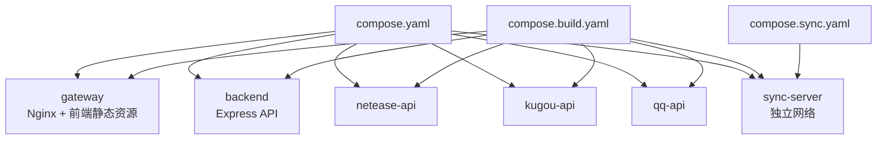
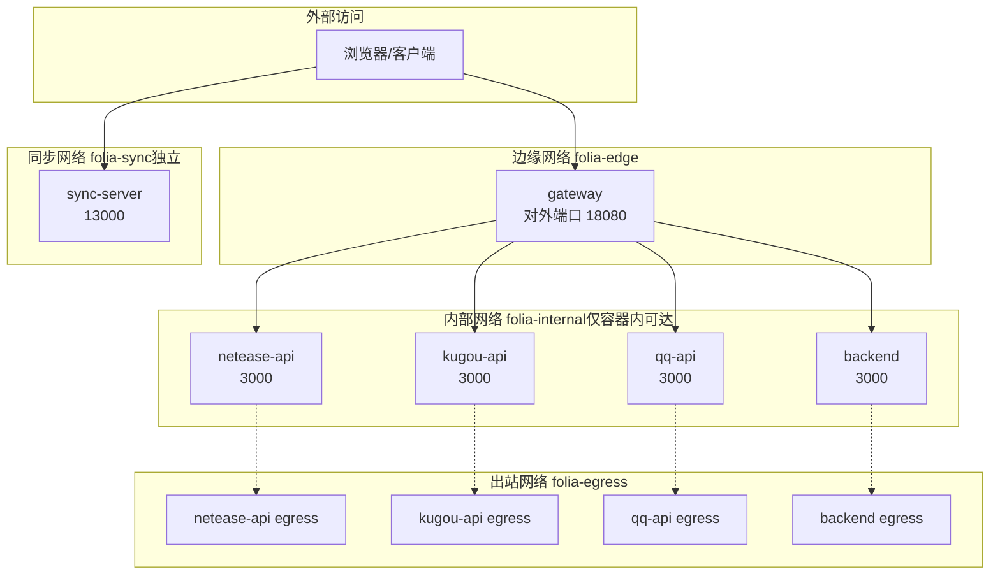
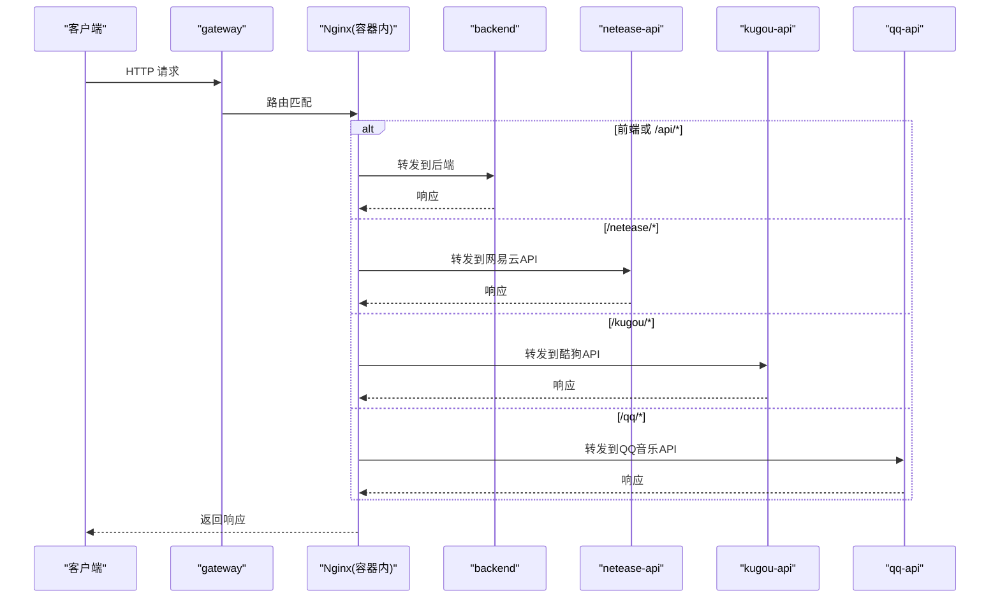
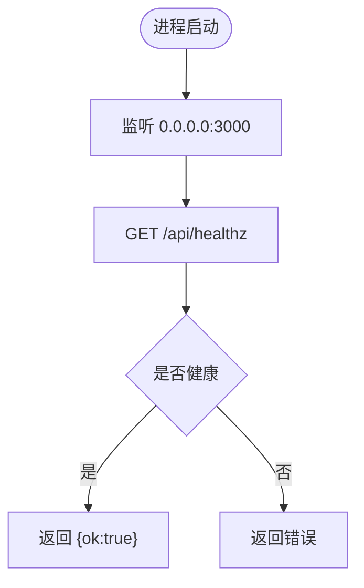
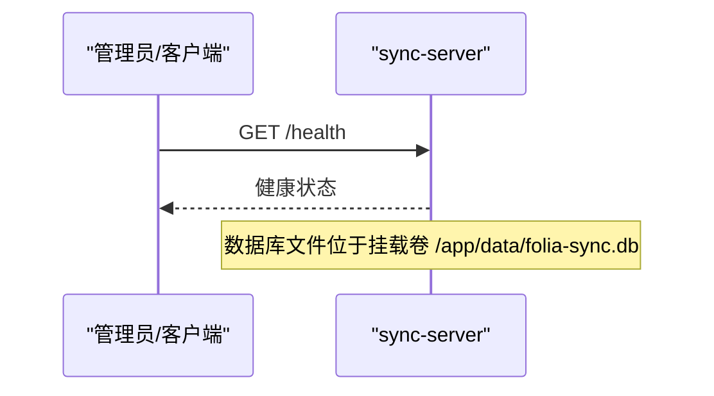
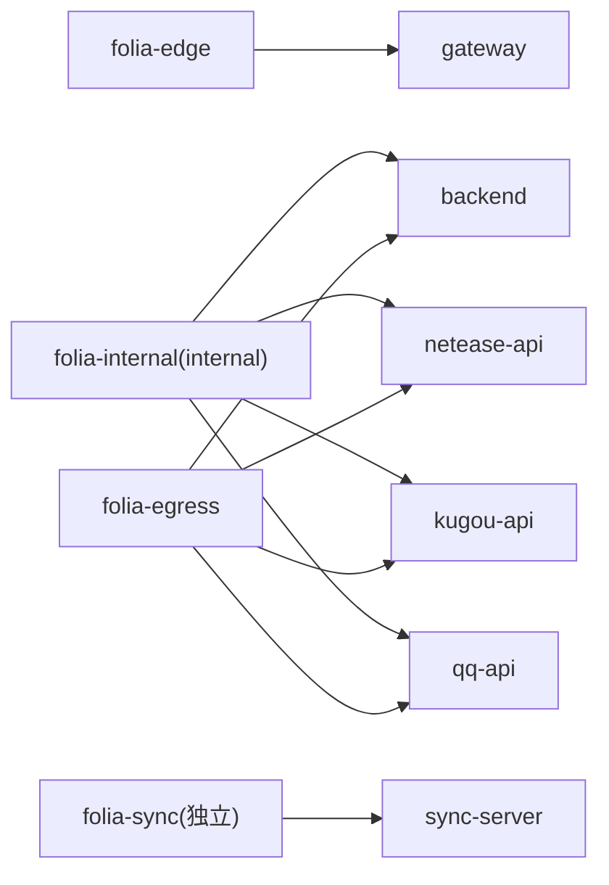
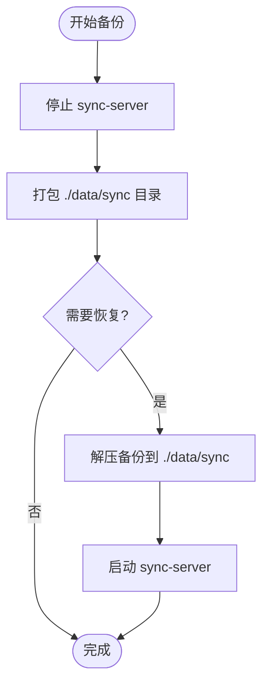

# Docker容器化部署

<cite>
**本文引用的文件**
- [deploy/docker/README.md](file://deploy/docker/README.md)
- [deploy/docker/compose.yaml](file://deploy/docker/compose.yaml)
- [deploy/docker/compose.sync.yaml](file://deploy/docker/compose.sync.yaml)
- [deploy/docker/compose.build.yaml](file://deploy/docker/compose.build.yaml)
- [deploy/docker/images/gateway.Dockerfile](file://deploy/docker/images/gateway.Dockerfile)
- [deploy/docker/images/backend.Dockerfile](file://deploy/docker/images/backend.Dockerfile)
- [deploy/docker/images/sync-server.Dockerfile](file://deploy/docker/images/sync-server.Dockerfile)
- [deploy/docker/gateway/entrypoint.sh](file://deploy/docker/gateway/entrypoint.sh)
- [deploy/docker/sync-server/entrypoint.sh](file://deploy/docker/sync-server/entrypoint.sh)
- [deploy/docker/backend/server.mjs](file://deploy/docker/backend/server.mjs)
- [deploy/docker/scripts/smoke-test.sh](file://deploy/docker/scripts/smoke-test.sh)
</cite>

## 目录
1. [简介](#简介)
2. [项目结构](#项目结构)
3. [核心组件](#核心组件)
4. [架构总览](#架构总览)
5. [详细组件分析](#详细组件分析)
6. [依赖关系与网络隔离](#依赖关系与网络隔离)
7. [环境变量配置指南](#环境变量配置指南)
8. [数据持久化与备份](#数据持久化与备份)
9. [健康检查、重启策略与资源限制](#健康检查重启策略与资源限制)
10. [故障排查](#故障排查)
11. [性能调优建议](#性能调优建议)
12. [结论](#结论)

## 简介
本指南面向使用 Docker Compose 部署 Folia Web 栈的生产与开发场景，覆盖网关、后端 API、各音乐提供商 API（网易云、酷狗、QQ 音乐）以及独立同步服务（Sync Server）的编排、网络、安全、持久化与健康检查等关键主题。文档重点说明：
- 通过 compose.yaml 一次性拉起完整 Web 堆栈；
- 通过 compose.sync.yaml 仅运行 Sync Server；
- 通过 compose.build.yaml 切换为本地构建镜像；
- 环境变量中 SYNC_TOKEN、DASHBOARD_TOKEN、数据库路径等关键参数；
- 内部服务间通信的安全隔离与外部访问控制；
- 健康检查、重启策略、资源限制等高级选项；
- 常见故障定位与性能优化建议。

## 项目结构
部署相关的关键文件集中在 deploy/docker 目录下：
- compose.yaml：发布版完整堆栈编排（网关、后端、三个音乐 API、Sync Server）。
- compose.sync.yaml：仅包含 Sync Server，便于单独开发与调试。
- compose.build.yaml：将 compose.yaml 中的镜像替换为本地构建镜像，用于本地验证。
- images/*：各服务的 Dockerfile，定义构建与运行环境。
- gateway/entrypoint.sh：网关启动时根据运行时变量生成 Nginx 配置并启动。
- sync-server/entrypoint.sh：准备数据目录并以非 root 用户运行 Sync Server。
- backend/server.mjs：后端 API 的 Express 入口，暴露 /api/healthz 等接口。
- scripts/smoke-test.sh：启动本地构建堆栈并校验公开入口和网络隔离。

**图示来源**
- [deploy/docker/compose.yaml:1-179](file://deploy/docker/compose.yaml#L1-L179)
- [deploy/docker/compose.build.yaml:1-40](file://deploy/docker/compose.build.yaml#L1-L40)
- [deploy/docker/compose.sync.yaml:1-31](file://deploy/docker/compose.sync.yaml#L1-L31)

**章节来源**
- [deploy/docker/README.md:1-184](file://deploy/docker/README.md#L1-L184)
- [deploy/docker/compose.yaml:1-179](file://deploy/docker/compose.yaml#L1-L179)

## 核心组件
- 网关（gateway）：对外暴露 Web 端口，负责静态资源与反向代理到后端及音乐 API。
- 后端 API（backend）：提供主题生成、歌词代理等 API，健康检查端点 /api/healthz。
- 网易云 API（netease-api）：网易云音乐能力封装。
- 酷狗 API（kugou-api）：酷狗音乐能力封装。
- QQ 音乐 API（qq-api）：QQ 音乐能力封装，支持扫码登录态持久化。
- 同步服务（sync-server）：独立的同步服务，持有 SQLite 数据库，对外暴露健康检查 /health。

**章节来源**
- [deploy/docker/compose.yaml:4-163](file://deploy/docker/compose.yaml#L4-L163)
- [deploy/docker/backend/server.mjs:1-31](file://deploy/docker/backend/server.mjs#L1-L31)

## 架构总览
Web 网关仅暴露一个对外端口，内部服务通过 Docker 网络互访。Sync Server 位于独立网络，不与 Web 内部服务互通，客户端直接连接 Sync Server。

**图示来源**
- [deploy/docker/compose.yaml:30-179](file://deploy/docker/compose.yaml#L30-L179)

**章节来源**
- [deploy/docker/README.md:5-63](file://deploy/docker/README.md#L5-L63)
- [deploy/docker/compose.yaml:169-179](file://deploy/docker/compose.yaml#L169-L179)

## 详细组件分析

### 网关（gateway）
- 职责：提供前端静态资源、按路径转发至后端与音乐 API；根据运行时变量动态生成 Nginx 配置。
- 关键行为：
  - 启动脚本校验并标准化 AI 提供者，生成只写临时目录的 Nginx 配置后启动。
  - 健康检查通过 /healthz 探测。
  - 挂载 tmpfs 提升安全性与可写性。
- 对外暴露：端口由 FOLIA_HTTP_BIND/FOLIA_HTTP_PORT 控制。

**图示来源**
- [deploy/docker/gateway/entrypoint.sh:1-21](file://deploy/docker/gateway/entrypoint.sh#L1-L21)
- [deploy/docker/compose.yaml:4-35](file://deploy/docker/compose.yaml#L4-L35)

**章节来源**
- [deploy/docker/gateway/entrypoint.sh:1-21](file://deploy/docker/gateway/entrypoint.sh#L1-L21)
- [deploy/docker/images/gateway.Dockerfile:1-37](file://deploy/docker/images/gateway.Dockerfile#L1-L37)
- [deploy/docker/compose.yaml:4-35](file://deploy/docker/compose.yaml#L4-L35)

### 后端 API（backend）
- 职责：提供主题生成、歌词代理等 API，暴露 /api/healthz。
- 关键行为：
  - 以 Express 应用形式运行，监听 3000 端口。
  - 健康检查通过 fetch 调用 /api/healthz 判定。
  - 仅暴露内部端口，不映射宿主机端口。

**图示来源**
- [deploy/docker/backend/server.mjs:1-31](file://deploy/docker/backend/server.mjs#L1-L31)
- [deploy/docker/compose.yaml:36-61](file://deploy/docker/compose.yaml#L36-L61)

**章节来源**
- [deploy/docker/backend/server.mjs:1-31](file://deploy/docker/backend/server.mjs#L1-L31)
- [deploy/docker/images/backend.Dockerfile:1-28](file://deploy/docker/images/backend.Dockerfile#L1-L28)
- [deploy/docker/compose.yaml:36-61](file://deploy/docker/compose.yaml#L36-L61)

### 网易云 API（netease-api）
- 职责：网易云音乐能力封装。
- 关键行为：
  - 健康检查通过根路径探测。
  - 可通过环境变量启用通用解锁功能。
  - 仅暴露内部端口，不映射宿主机端口。

**章节来源**
- [deploy/docker/compose.yaml:63-86](file://deploy/docker/compose.yaml#L63-L86)

### 酷狗 API（kugou-api）
- 职责：酷狗音乐能力封装。
- 关键行为：
  - 健康检查通过根路径探测。
  - 仅暴露内部端口，不映射宿主机端口。

**章节来源**
- [deploy/docker/compose.yaml:88-110](file://deploy/docker/compose.yaml#L88-L110)

### QQ 音乐 API（qq-api）
- 职责：QQ 音乐能力封装，支持扫码登录态持久化。
- 关键行为：
  - 健康检查通过 /login/status 探测。
  - 使用具名卷 qq-api-state 持久化装置识别值与可选加密会话。
  - 仅暴露内部端口，不映射宿主机端口。

**章节来源**
- [deploy/docker/compose.yaml:112-137](file://deploy/docker/compose.yaml#L112-L137)
- [deploy/docker/README.md:89-103](file://deploy/docker/README.md#L89-L103)

### 同步服务（sync-server）
- 职责：独立同步服务，持有 SQLite 数据库，对外暴露健康检查 /health。
- 关键行为：
  - 启动脚本准备数据目录并以非 root 用户运行。
  - 数据目录通过卷挂载到宿主机。
  - 健康检查通过 /health 探测。
  - 独立网络 folia-sync，不与 Web 内部网络互通。

**图示来源**
- [deploy/docker/sync-server/entrypoint.sh:1-7](file://deploy/docker/sync-server/entrypoint.sh#L1-L7)
- [deploy/docker/compose.yaml:139-163](file://deploy/docker/compose.yaml#L139-L163)

**章节来源**
- [deploy/docker/sync-server/entrypoint.sh:1-7](file://deploy/docker/sync-server/entrypoint.sh#L1-L7)
- [deploy/docker/images/sync-server.Dockerfile:1-36](file://deploy/docker/images/sync-server.Dockerfile#L1-L36)
- [deploy/docker/compose.yaml:139-163](file://deploy/docker/compose.yaml#L139-L163)

## 依赖关系与网络隔离
- 启动顺序：gateway 依赖 backend、netease-api、kugou-api、qq-api 健康检查通过后再启动。
- 网络划分：
  - folia-edge：网关所在网络，对外暴露端口。
  - folia-internal：内部服务网络，标记为 internal，禁止外部访问。
  - folia-egress：允许出站访问的网络。
  - folia-sync：Sync Server 独立网络，不与 Web 内部网络互通。
- 端口暴露：
  - 仅 gateway 和 sync-server 映射宿主机端口。
  - backend、netease-api、kugou-api、qq-api 仅 expose 内部端口。

**图示来源**
- [deploy/docker/compose.yaml:30-179](file://deploy/docker/compose.yaml#L30-L179)

**章节来源**
- [deploy/docker/compose.yaml:21-35](file://deploy/docker/compose.yaml#L21-L35)
- [deploy/docker/compose.yaml:169-179](file://deploy/docker/compose.yaml#L169-L179)
- [deploy/docker/scripts/smoke-test.sh:44-57](file://deploy/docker/scripts/smoke-test.sh#L44-L57)

## 环境变量配置指南
以下为关键环境变量及其作用与默认值（来自编排与文档）：
- 镜像与版本
  - FOLIA_IMAGE_NAMESPACE：镜像命名空间，缺失时拒绝启动。
  - FOLIA_STACK_VERSION：Web 堆栈统一版本，默认 latest。
  - FOLIA_SYNC_VERSION：Sync Server 独立版本，默认 latest。
- 网关与绑定
  - FOLIA_HTTP_BIND / FOLIA_HTTP_PORT：网关监听地址与端口，默认 0.0.0.0:18080。
  - FOLIA_AI_PROVIDER：AI 提供者，支持 google/gemini/openai，默认 google。
  - FOLIA_FORWARD_CLIENT_IP：是否把浏览器 IP 转发给音乐平台，默认 false。
  - ENABLE_GENERAL_UNBLOCK：网易云通用解锁开关，默认 false。
- QQ 音乐
  - QQ_AUTH_SESSION_PATH / QQ_SESSION_SECRET：同时设置后保存加密登录态到 qq-api-state 卷。
- 同步服务
  - FOLIA_SYNC_BIND / FOLIA_SYNC_PORT：Sync Server 监听地址与端口，默认 0.0.0.0:13000。
  - FOLIA_SYNC_DATA_DIR：SQLite 持久化目录，默认 ./data/sync。
  - SYNC_TOKEN：Sync 客户端 Bearer Token，至少八位，必填。
  - DASHBOARD_TOKEN：Sync Server 隐藏看板 Token，可选。

注意事项：
- 未填写 FOLIA_IMAGE_NAMESPACE 时，Compose 会拒绝启动。
- 修改 FOLIA_AI_PROVIDER 后重建 gateway 容器即可生效。
- 保持 FOLIA_FORWARD_CLIENT_IP=false 可避免 LAN/Docker 地址出现在登录地点。
- QQ 音乐镜像不转发浏览器 IP，不受该开关影响。

**章节来源**
- [deploy/docker/README.md:64-87](file://deploy/docker/README.md#L64-L87)
- [deploy/docker/compose.yaml:8-147](file://deploy/docker/compose.yaml#L8-L147)

## 数据持久化与备份
- 卷挂载
  - qq-api-state：持久化 QQ 音乐装置识别值与可选加密会话。
  - FOLIA_SYNC_DATA_DIR：默认 ./data/sync，映射到容器 /app/data，存放 SQLite 数据库。
- 权限设置
  - 同步服务启动脚本会将 /app/data 所有者设置为 node:node，确保写入权限。
  - 网关缓存目录使用 tmpfs 并设置 uid/gid/mode。
- 备份策略
  - 停止 Sync Server 后打包 data/sync 目录进行备份。
  - 恢复时将备份内容放回对应目录并重启服务。

**图示来源**
- [deploy/docker/README.md:150-156](file://deploy/docker/README.md#L150-L156)
- [deploy/docker/sync-server/entrypoint.sh:1-7](file://deploy/docker/sync-server/entrypoint.sh#L1-L7)
- [deploy/docker/compose.yaml:149-152](file://deploy/docker/compose.yaml#L149-L152)

**章节来源**
- [deploy/docker/compose.yaml:123-125](file://deploy/docker/compose.yaml#L123-L125)
- [deploy/docker/compose.yaml:149-152](file://deploy/docker/compose.yaml#L149-L152)
- [deploy/docker/sync-server/entrypoint.sh:1-7](file://deploy/docker/sync-server/entrypoint.sh#L1-L7)
- [deploy/docker/README.md:150-156](file://deploy/docker/README.md#L150-L156)

## 健康检查、重启策略与资源限制
- 健康检查
  - gateway：/healthz。
  - backend：/api/healthz。
  - netease-api/kugou-api：根路径。
  - qq-api：/login/status。
  - sync-server：/health。
- 重启策略
  - 所有服务均配置 restart: unless-stopped，保证异常退出后自动恢复。
- 资源限制
  - 当前编排未显式设置 CPU/内存限制，可在 Compose 中按需添加 deploy.resources 或 runtime 级别限制。
- 安全加固
  - read_only: true 配合 tmpfs 提升安全性。
  - security_opt: no-new-privileges:true 防止提权。

**章节来源**
- [deploy/docker/compose.yaml:6-20](file://deploy/docker/compose.yaml#L6-L20)
- [deploy/docker/compose.yaml:51-56](file://deploy/docker/compose.yaml#L51-L56)
- [deploy/docker/compose.yaml:76-81](file://deploy/docker/compose.yaml#L76-L81)
- [deploy/docker/compose.yaml:100-105](file://deploy/docker/compose.yaml#L100-L105)
- [deploy/docker/compose.yaml:127-132](file://deploy/docker/compose.yaml#L127-L132)
- [deploy/docker/compose.yaml:154-159](file://deploy/docker/compose.yaml#L154-L159)

## 故障排查
常用诊断命令与步骤：
- 查看服务状态与日志：
  - docker compose ps
  - docker compose logs --tail=200 gateway backend netease-api kugou-api qq-api sync-server
- 健康检查：
  - curl http://127.0.0.1:18080/healthz
  - curl http://127.0.0.1:18080/api/healthz
  - curl http://127.0.0.1:18080/qq/login/status
  - curl http://127.0.0.1:13000/health
- 本地镜像验证：
  - 使用 compose.build.yaml 与 smoke-test.sh 验证构建与网络隔离。

常见问题定位要点：
- 若网关无法访问，检查 FOLIA_HTTP_BIND/FOLIA_HTTP_PORT 与防火墙规则。
- 若后端不可用，检查 /api/healthz 与后端日志。
- 若音乐 API 不可用，检查各自健康检查端点与日志。
- 若 Sync Server 不可用，检查 /health 与数据目录权限。

**章节来源**
- [deploy/docker/README.md:158-167](file://deploy/docker/README.md#L158-L167)
- [deploy/docker/scripts/smoke-test.sh:33-57](file://deploy/docker/scripts/smoke-test.sh#L33-L57)

## 性能调优建议
- 反向代理终止 HTTPS：
  - 推荐在 NAS 现有反向代理上终止 TLS，并将 Host、X-Forwarded-Host、X-Forwarded-Proto、X-Forwarded-For 传递给容器。
  - 将 FOLIA_HTTP_BIND 与 FOLIA_SYNC_BIND 改为 127.0.0.1，避免绕过代理。
- 浏览器安全上下文：
  - HTTP 下部分能力降级（如 File System Access API、Service Worker/PWA、OPFS、音频设备枚举），建议使用 HTTPS。
- 网络与端口：
  - 仅暴露必要端口，减少攻击面。
  - 使用内部网络隔离敏感服务。
- 资源与存储：
  - 根据负载调整容器 CPU/内存限制。
  - 合理设置 tmpfs 大小与卷挂载策略，避免磁盘瓶颈。
- 更新与维护：
  - 固定版本标签以确保可复现部署；回滚时指定先前版本。

**章节来源**
- [deploy/docker/README.md:105-138](file://deploy/docker/README.md#L105-L138)
- [deploy/docker/README.md:139-148](file://deploy/docker/README.md#L139-L148)

## 结论
通过 compose.yaml 可一键拉起完整的 Folia Web 堆栈，结合 compose.sync.yaml 与 compose.build.yaml 满足独立运行与本地构建需求。借助多网络隔离、健康检查、重启策略与安全加固，系统具备生产可用性与可维护性。按本文的环境变量、持久化与故障排查指南操作，可快速完成部署与运维。