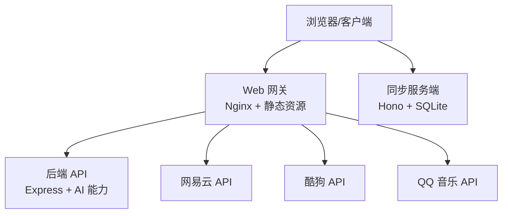
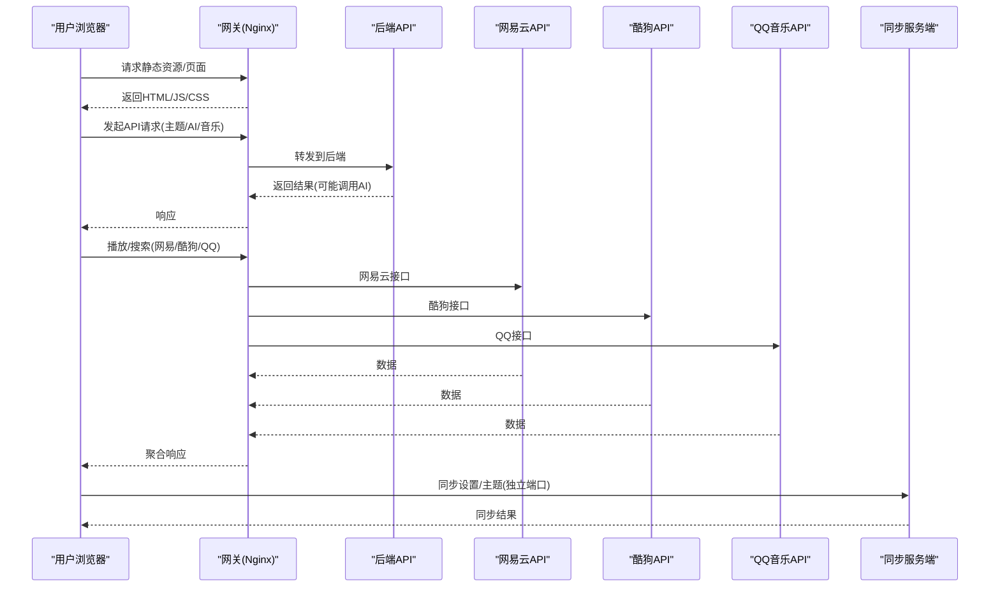
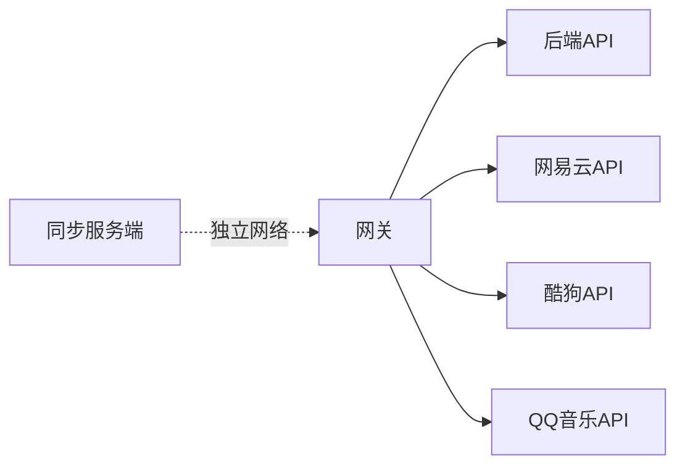

# Node.js自托管部署

<cite>
**本文引用的文件**
- [package.json](file://package.json)
- [README.md](file://README.md)
- [docs/technical.md](file://docs/technical.md)
- [deploy/docker/README.md](file://deploy/docker/README.md)
- [deploy/docker/compose.yaml](file://deploy/docker/compose.yaml)
- [deploy/docker/gateway/entrypoint.sh](file://deploy/docker/gateway/entrypoint.sh)
- [deploy/docker/backend/package.json](file://deploy/docker/backend/package.json)
- [deploy/docker/netease-api/package.json](file://deploy/docker/netease-api/package.json)
- [deploy/docker/kugou-api/package.json](file://deploy/docker/kugou-api/package.json)
- [deploy/docker/qq-api/package.json](file://deploy/docker/qq-api/package.json)
- [sync-server/package.json](file://sync-server/package.json)
- [sync-server/install.sh](file://sync-server/install.sh)
- [sync-server/install.ps1](file://sync-server/install.ps1)
</cite>

## 目录
1. [简介](#简介)
2. [项目结构](#项目结构)
3. [核心组件](#核心组件)
4. [架构总览](#架构总览)
5. [详细组件分析](#详细组件分析)
6. [依赖关系分析](#依赖关系分析)
7. [性能与容量规划](#性能与容量规划)
8. [故障排查指南](#故障排查指南)
9. [结论](#结论)
10. [附录：环境变量与配置清单](#附录：环境变量与配置清单)

## 简介
本指南面向希望在自有服务器上以 Node.js 环境自托管 Folia Web 及其配套服务（后端 API、在线音乐接口、可选的同步服务端）的运维人员。内容涵盖系统环境要求、安装方式（一键脚本与手动）、配置文件与环境变量、服务启停与日常运维、进程守护方案，以及日志管理、性能监控与故障排查的最佳实践。

## 项目结构
仓库提供两种主要自托管形态：
- Docker Compose 全栈：包含网关、后端、网易云/酷狗/QQ 音乐接口、独立同步服务端，对外仅暴露网关与同步服务端口，内部服务通过容器网络互访。
- Node.js 直接运行：适用于本地或不便使用 Docker 的环境，可通过脚本自动安装依赖并使用 PM2 守护。

图表来源
- [deploy/docker/compose.yaml:4-163](file://deploy/docker/compose.yaml#L4-L163)
- [deploy/docker/gateway/entrypoint.sh:1-20](file://deploy/docker/gateway/entrypoint.sh#L1-L20)

章节来源
- [deploy/docker/README.md:1-184](file://deploy/docker/README.md#L1-L184)
- [deploy/docker/compose.yaml:1-179](file://deploy/docker/compose.yaml#L1-L179)

## 核心组件
- Web 网关：负责静态资源与反向代理，注入 AI 提供商配置，暴露健康检查端点。
- 后端 API：提供主题生成等后端能力，依赖 AI 密钥。
- 在线音乐接口：网易云、酷狗、QQ 音乐三个独立服务，分别由对应 npm 包驱动。
- 同步服务端：可选，用于跨设备同步外观设置与 AI 主题库，支持 Node 直跑、Docker、Cloudflare Workers。

章节来源
- [deploy/docker/compose.yaml:4-163](file://deploy/docker/compose.yaml#L4-L163)
- [deploy/docker/backend/package.json:1-14](file://deploy/docker/backend/package.json#L1-L14)
- [deploy/docker/netease-api/package.json:1-9](file://deploy/docker/netease-api/package.json#L1-L9)
- [deploy/docker/kugou-api/package.json:1-9](file://deploy/docker/kugou-api/package.json#L1-L9)
- [deploy/docker/qq-api/package.json:1-9](file://deploy/docker/qq-api/package.json#L1-L9)
- [sync-server/package.json:1-34](file://sync-server/package.json#L1-L34)

## 架构总览
Folia Web 采用“网关 + 多服务”的解耦架构。网关统一对外暴露，内部服务通过 Docker 网络隔离访问；同步服务独立部署，客户端直连。AI 能力通过后端 API 调用外部模型服务，密钥不进入前端静态资源。

图表来源
- [deploy/docker/compose.yaml:4-163](file://deploy/docker/compose.yaml#L4-L163)
- [deploy/docker/gateway/entrypoint.sh:1-20](file://deploy/docker/gateway/entrypoint.sh#L1-L20)

## 详细组件分析

### 系统环境与前置条件
- Node.js 版本：>=24.0.0（根工程与多个子模块均声明该引擎要求）。
- npm：用于安装依赖与构建产物。
- 操作系统：Linux/Windows/macOS 均可；Docker Compose 需要 Docker Engine 24+ 与 Compose v2。
- 浏览器安全上下文：生产建议使用 HTTPS，以便启用 PWA、文件系统访问、音频设备等能力。

章节来源
- [package.json:14-16](file://package.json#L14-L16)
- [sync-server/package.json:7-9](file://sync-server/package.json#L7-L9)
- [deploy/docker/README.md:7-10](file://deploy/docker/README.md#L7-L10)
- [deploy/docker/README.md:105-137](file://deploy/docker/README.md#L105-L137)

### 安装方式一：一键安装（推荐）
- 使用仓库提供的安装脚本，可选择 Node(PM2)、Docker、Cloudflare Workers 三种部署路径。脚本会自动检测并安装 Node.js/npm/PM2，创建 .env，构建并启动服务。
- Windows 提供 PowerShell 脚本，功能与 Bash 脚本一致。

操作步骤要点
- Linux/macOS：执行 sync-server 目录下的 install.sh，选择 Node (PM2) 或 Docker。
- Windows：执行 sync-server 目录下的 install.ps1，选择 Node (PM2) 或 Docker。
- 脚本会提示输入 SYNC_TOKEN，并自动生成 DASHBOARD_TOKEN（用于网页看板）。

章节来源
- [sync-server/install.sh:28-137](file://sync-server/install.sh#L28-L137)
- [sync-server/install.ps1:311-327](file://sync-server/install.ps1#L311-L327)

### 安装方式二：手动安装
- 安装 Node.js >=24 与 npm。
- 在 sync-server 目录下执行依赖安装与构建：
  - npm install
  - npm run build:node
- 创建 .env 文件，填写必要环境变量（见附录）。
- 使用 PM2 启动：
  - pm2 start dist/node.js --name folia-sync-server
  - pm2 save
  - pm2 startup（开机自启）

章节来源
- [sync-server/package.json:10-15](file://sync-server/package.json#L10-L15)
- [sync-server/install.sh:97-130](file://sync-server/install.sh#L97-L130)
- [sync-server/install.ps1:183-229](file://sync-server/install.ps1#L183-L229)

### 配置文件与环境变量
- Web 网关：通过环境变量注入 AI 提供商（google/gemini/openai），并在入口脚本中校验与转换。
- 后端 API：接收 AI 密钥与模型参数（如 OpenAI 兼容接口的 key、url、model、temperature）。
- 在线音乐接口：可配置是否转发客户端 IP、是否启用通用解锁等。
- 同步服务端：SYNC_TOKEN（必填，至少8位）、DASHBOARD_TOKEN（可选）、PORT、DB_PATH。

章节来源
- [deploy/docker/gateway/entrypoint.sh:4-20](file://deploy/docker/gateway/entrypoint.sh#L4-L20)
- [deploy/docker/compose.yaml:36-61](file://deploy/docker/compose.yaml#L36-L61)
- [deploy/docker/compose.yaml:63-137](file://deploy/docker/compose.yaml#L63-L137)
- [deploy/docker/compose.yaml:139-163](file://deploy/docker/compose.yaml#L139-L163)
- [docs/technical.md:143-159](file://docs/technical.md#L143-L159)

### 服务启动、停止、重启
- Docker Compose：
  - 启动：docker compose up -d --wait
  - 停止：docker compose down
  - 重启：docker compose restart <service>
  - 查看状态：docker compose ps
  - 查看日志：docker compose logs -f <service>
- PM2：
  - 启动：pm2 start dist/node.js --name folia-sync-server
  - 停止：pm2 stop folia-sync-server
  - 重启：pm2 restart folia-sync-server
  - 日志：pm2 logs folia-sync-server

章节来源
- [deploy/docker/README.md:46-63](file://deploy/docker/README.md#L46-L63)
- [deploy/docker/README.md:139-167](file://deploy/docker/README.md#L139-L167)
- [sync-server/install.sh:112-130](file://sync-server/install.sh#L112-L130)
- [sync-server/install.ps1:192-215](file://sync-server/install.ps1#L192-L215)

### 进程管理与守护
- PM2：适合 Node 直跑场景，具备日志轮转、进程列表保存、开机自启等功能。
- systemd：可将 PM2 管理的进程作为系统服务，或使用 PM2 的 startup 命令生成服务单元。
- Docker：compose 中已配置 healthcheck 与 restart policy，便于容器级自愈。

章节来源
- [deploy/docker/compose.yaml:4-163](file://deploy/docker/compose.yaml#L4-L163)
- [sync-server/install.sh:117-130](file://sync-server/install.sh#L117-L130)
- [sync-server/install.ps1:199-215](file://sync-server/install.ps1#L199-L215)

### 日志管理
- Docker：使用 docker compose logs 查看各服务输出；建议结合日志收集工具集中管理。
- PM2：启用 pm2-logrotate 进行日志轮转，限制单文件大小与保留份数。
- 健康检查：网关与健康端点可用于探针与告警。

章节来源
- [deploy/docker/README.md:158-167](file://deploy/docker/README.md#L158-L167)
- [sync-server/install.sh:117-123](file://sync-server/install.sh#L117-L123)
- [deploy/docker/compose.yaml:15-20](file://deploy/docker/compose.yaml#L15-L20)

### 性能监控与优化建议
- 资源限制：为容器设置 CPU/内存限制，避免争用。
- 缓存与静态资源：利用 CDN 或反向代理缓存静态资源，减少网关压力。
- 并发与连接池：根据业务峰值调整上游 API 的连接与超时策略。
- 监控指标：关注网关健康端点、后端 API 健康端点、同步服务健康端点的可用性。

[本节为通用指导，无需特定文件引用]

## 依赖关系分析
- 网关依赖后端与三个音乐接口健康状态，确保服务间顺序启动。
- 后端依赖 AI 密钥与模型参数，影响主题生成质量与稳定性。
- 同步服务依赖 SQLite 数据库文件持久化，需保证卷挂载正确。

图表来源
- [deploy/docker/compose.yaml:4-163](file://deploy/docker/compose.yaml#L4-L163)

章节来源
- [deploy/docker/compose.yaml:21-35](file://deploy/docker/compose.yaml#L21-L35)
- [deploy/docker/compose.yaml:139-163](file://deploy/docker/compose.yaml#L139-L163)

## 性能与容量规划
- 网关：建议绑定内网地址并通过反向代理终止 HTTPS，提升安全性与性能。
- 后端：合理配置 AI 模型的 temperature 与超时，避免长耗时请求阻塞。
- 音乐接口：控制并发与重试策略，避免触发上游限流。
- 同步服务：SQLite 适合中小规模；高并发场景考虑迁移至更合适的存储。

[本节为通用指导，无需特定文件引用]

## 故障排查指南
- 健康检查：
  - 网关：/healthz、/api/healthz、/runtime-config.js
  - 后端：/api/healthz
  - 同步服务：/health
- 常见问题：
  - 浏览器安全上下文不足导致功能降级：改用 HTTPS 并确保证书链可信。
  - QQ 登录态异常：检查装置状态卷与加密会话配置。
  - AI 生成失败：核对密钥与模型参数，确认网络可达。
- 诊断命令：
  - docker compose ps/logs
  - curl 健康端点
  - pm2 logs

章节来源
- [deploy/docker/README.md:55-63](file://deploy/docker/README.md#L55-L63)
- [deploy/docker/README.md:105-137](file://deploy/docker/README.md#L105-L137)
- [deploy/docker/README.md:158-167](file://deploy/docker/README.md#L158-L167)

## 结论
通过 Docker Compose 或 Node(PM2) 两种方式，均可完成 Folia Web 及其配套服务的自托管部署。建议在生产环境使用 HTTPS、合理的反向代理与进程守护方案，并结合健康检查与日志轮转实现稳定运维。同步服务可根据规模选择合适的部署形态与存储方案。

[本节为总结性内容，无需特定文件引用]

## 附录：环境变量与配置清单
- Web 网关
  - FOLIA_AI_PROVIDER：google/gemini/openai
  - FOLIA_HTTP_BIND/FOLIA_HTTP_PORT：监听地址与端口
- 后端 API
  - PORT：服务端口
  - GEMINI_API_KEY/OpenAI 相关密钥与模型参数
- 在线音乐接口
  - HOST/PORT：服务监听
  - FOLIA_FORWARD_CLIENT_IP：是否转发客户端 IP
  - ENABLE_GENERAL_UNBLOCK：网易云通用解锁开关
- 同步服务端
  - SYNC_TOKEN：客户端鉴权令牌（必填，至少8位）
  - DASHBOARD_TOKEN：网页看板访问令牌（可选）
  - PORT/DB_PATH：服务端口与数据库路径

章节来源
- [deploy/docker/README.md:64-87](file://deploy/docker/README.md#L64-L87)
- [deploy/docker/compose.yaml:36-163](file://deploy/docker/compose.yaml#L36-L163)
- [docs/technical.md:143-159](file://docs/technical.md#L143-L159)