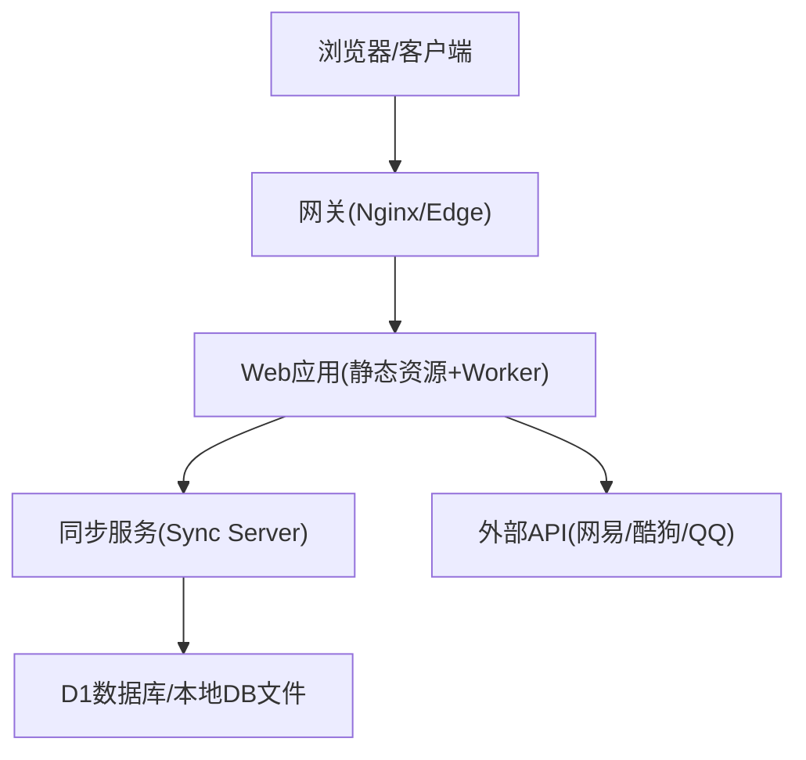
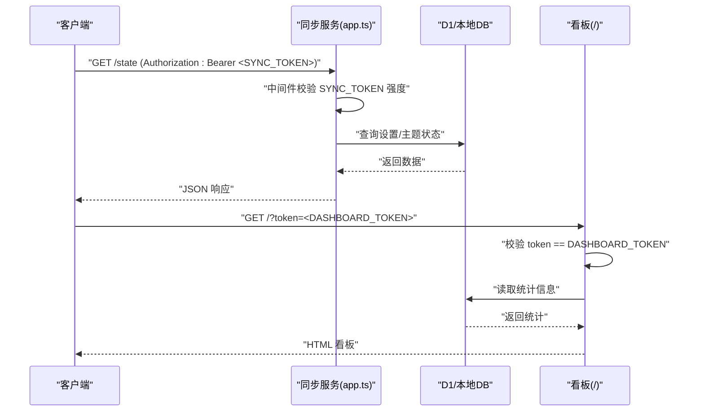
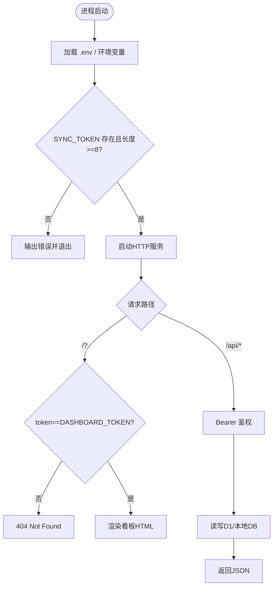
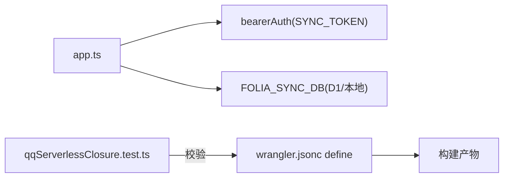

# 环境变量与安全配置

<cite>
**本文引用的文件**
- [sync-server/src/app.ts](file://sync-server/src/app.ts)
- [sync-server/src/node.ts](file://sync-server/src/node.ts)
- [sync-server/wrangler.toml](file://sync-server/wrangler.toml)
- [wrangler.jsonc](file://wrangler.jsonc)
- [deploy/docker/compose.yaml](file://deploy/docker/compose.yaml)
- [src/services/runtimeConfig.ts](file://src/services/runtimeConfig.ts)
- [public/runtime-config.js](file://public/runtime-config.js)
- [docs/technical.md](file://docs/technical.md)
- [test/unit/onlineMusic/qqServerlessClosure.test.ts](file://test/unit/onlineMusic/qqServerlessClosure.test.ts)
- [src/components/modal/settings/StorageSettingsSection.tsx](file://src/components/modal/settings/StorageSettingsSection.tsx)
</cite>

## 目录
1. [简介](#简介)
2. [项目结构](#项目结构)
3. [核心组件](#核心组件)
4. [架构总览](#架构总览)
5. [详细组件分析](#详细组件分析)
6. [依赖关系分析](#依赖关系分析)
7. [性能与安全性考量](#性能与安全性考量)
8. [故障排查指南](#故障排查指南)
9. [结论](#结论)
10. [附录：配置模板与验证工具](#附录配置模板与验证工具)

## 简介
本文件聚焦本项目的环境变量与安全配置，覆盖同步服务（Sync Server）的认证令牌、管理面板访问令牌、数据库绑定与连接、Web 运行时配置、AI 提供商密钥等。文档提供不同部署方式（Docker、Cloudflare Workers、Node.js 本地）的配置示例，说明安全最佳实践，并给出常见配置错误的排查方法与解决方案。

## 项目结构
与“环境变量与安全配置”直接相关的代码与配置主要分布在以下位置：
- 同步服务后端（Hono + D1/Node 自托管）：定义并校验 SYNC_TOKEN、DASHBOARD_TOKEN、端口与数据库路径等。
- Cloudflare Workers 配置：绑定 D1 数据库、定义 Worker 入口与兼容性日期。
- Docker Compose：为 Web、API、各音乐源 API 以及 Sync Server 注入环境变量，暴露端口与数据卷。
- Web 前端运行时配置：通过 window.__FOLIA_RUNTIME_CONFIG__ 或 Vite 构建时变量注入 AI 提供商等运行时信息。
- 技术文档：列出 Web 端所需的环境变量（网易云、酷狗、QQ、AI 相关）。

图表来源
- [deploy/docker/compose.yaml:1-179](file://deploy/docker/compose.yaml#L1-L179)
- [sync-server/src/app.ts:121-143](file://sync-server/src/app.ts#L121-L143)
- [sync-server/wrangler.toml:1-13](file://sync-server/wrangler.toml#L1-L13)

章节来源
- [deploy/docker/compose.yaml:1-179](file://deploy/docker/compose.yaml#L1-L179)
- [sync-server/src/app.ts:121-143](file://sync-server/src/app.ts#L121-L143)
- [sync-server/wrangler.toml:1-13](file://sync-server/wrangler.toml#L1-L13)

## 核心组件
- 同步服务认证与鉴权
  - 所有 API 路由受 Bearer Token 保护，Token 来自环境变量 SYNC_TOKEN。
  - 启动阶段对 SYNC_TOKEN 进行存在性与强度校验（长度至少 8 位）。
- 管理面板访问控制
  - 根路径 / 作为轻量看板，需要查询参数 token 与 DASHBOARD_TOKEN 一致才可访问。
- 数据库绑定
  - Cloudflare 环境通过 binding FOLIA_SYNC_DB 注入 D1 数据库实例。
  - Node.js 自托管使用本地文件模拟 D1（DB_PATH），默认生成在 sync-server 同级目录。
- Web 运行时配置
  - 前端优先读取 window.__FOLIA_RUNTIME_CONFIG__.aiProvider，否则回退到 Vite 构建时的 VITE_AI_PROVIDER。
  - public/runtime-config.js 为非 Docker 部署的空壳，实际值由构建期变量注入。
- Web 端环境变量（Vite/平台）
  - 网易云、酷狗、QQ 音乐 API 地址；QQ session 加密密钥；AI 提供商与对应密钥/模型/温度等。

章节来源
- [sync-server/src/app.ts:17-21](file://sync-server/src/app.ts#L17-L21)
- [sync-server/src/app.ts:129-135](file://sync-server/src/app.ts#L129-L135)
- [sync-server/src/app.ts:145-152](file://sync-server/src/app.ts#L145-L152)
- [sync-server/src/app.ts:318-324](file://sync-server/src/app.ts#L318-L324)
- [sync-server/src/node.ts:31-45](file://sync-server/src/node.ts#L31-L45)
- [sync-server/src/node.ts:77-84](file://sync-server/src/node.ts#L77-L84)
- [src/services/runtimeConfig.ts:1-16](file://src/services/runtimeConfig.ts#L1-L16)
- [public/runtime-config.js:1-2](file://public/runtime-config.js#L1-L2)
- [docs/technical.md:143-168](file://docs/technical.md#L143-L168)

## 架构总览
下图展示请求从客户端到同步服务的鉴权流程，以及看板访问控制。

图表来源
- [sync-server/src/app.ts:129-135](file://sync-server/src/app.ts#L129-L135)
- [sync-server/src/app.ts:145-152](file://sync-server/src/app.ts#L145-L152)
- [sync-server/src/app.ts:318-324](file://sync-server/src/app.ts#L318-L324)
- [sync-server/src/app.ts:326-340](file://sync-server/src/app.ts#L326-L340)

## 详细组件分析

### 同步服务（Sync Server）环境变量
- 必需变量
  - SYNC_TOKEN：用于客户端与服务端之间的 Bearer 鉴权。要求非空且长度至少 8 位。
  - PORT：服务监听端口（Node 自托管默认 3000）。
  - DB_PATH：本地数据库文件路径（Node 自托管使用，默认 ./folia-sync.db）。
- 可选变量
  - DASHBOARD_TOKEN：管理面板访问令牌，未设置则看板功能不可用。
- 行为说明
  - 启动时若缺失 SYNC_TOKEN 或长度不足，将报错退出。
  - 所有 API 路由强制启用 Bearer 鉴权，中间件会拒绝弱口令。
  - 看板根路径需携带 ?token= 与 DASHBOARD_TOKEN 匹配才返回页面。

图表来源
- [sync-server/src/node.ts:10-45](file://sync-server/src/node.ts#L10-L45)
- [sync-server/src/node.ts:77-84](file://sync-server/src/node.ts#L77-L84)
- [sync-server/src/app.ts:129-135](file://sync-server/src/app.ts#L129-L135)
- [sync-server/src/app.ts:145-152](file://sync-server/src/app.ts#L145-L152)
- [sync-server/src/app.ts:318-324](file://sync-server/src/app.ts#L318-L324)

章节来源
- [sync-server/src/node.ts:10-45](file://sync-server/src/node.ts#L10-L45)
- [sync-server/src/node.ts:77-84](file://sync-server/src/node.ts#L77-L84)
- [sync-server/src/app.ts:129-135](file://sync-server/src/app.ts#L129-L135)
- [sync-server/src/app.ts:145-152](file://sync-server/src/app.ts#L145-L152)
- [sync-server/src/app.ts:318-324](file://sync-server/src/app.ts#L318-L324)

### Cloudflare Workers 配置
- 数据库绑定
  - wrangler.toml 中声明 d1_databases，binding 名称为 FOLIA_SYNC_DB，指向具体数据库实例。
- 入口与兼容性
  - main 指向 src/cloudflare.ts，compatibility_date 指定运行环境版本。
- 变量注入
  - 通过 Wrangler Secrets 注入 SYNC_TOKEN、DASHBOARD_TOKEN 等敏感变量（服务端代码通过 c.env 获取）。

章节来源
- [sync-server/wrangler.toml:1-13](file://sync-server/wrangler.toml#L1-L13)
- [sync-server/src/app.ts:17-21](file://sync-server/src/app.ts#L17-L21)

### Docker Compose 环境变量
- Web 网关
  - FOLIA_AI_PROVIDER：选择 AI 提供商（google/openai）。
- 后端 API
  - GEMINI_API_KEY、OPENAI_API_KEY、OPENAI_API_URL、OPENAI_API_MODEL、OPENAI_API_TEMPERATURE。
- 音乐源 API
  - netease-api/kugou-api：HOST、PORT、FOLIA_FORWARD_CLIENT_IP、ENABLE_GENERAL_UNBLOCK。
  - qq-api：PORT、QQ_AUTH_STATE_PATH、QQ_AUTH_SESSION_PATH、QQ_SESSION_SECRET。
- 同步服务
  - PORT、DB_PATH、SYNC_TOKEN（必填）、DASHBOARD_TOKEN（可选）。
  - 健康检查与端口映射、数据卷挂载。

章节来源
- [deploy/docker/compose.yaml:1-179](file://deploy/docker/compose.yaml#L1-L179)

### Web 前端运行时配置
- 优先级
  - 优先读取 window.__FOLIA_RUNTIME_CONFIG__.aiProvider。
  - 其次回退到 Vite 构建时变量 VITE_AI_PROVIDER。
- 空壳注入
  - public/runtime-config.js 在非 Docker 部署下提供空对象，避免运行时引用错误。

章节来源
- [src/services/runtimeConfig.ts:1-16](file://src/services/runtimeConfig.ts#L1-L16)
- [public/runtime-config.js:1-2](file://public/runtime-config.js#L1-L2)

### Web 端环境变量（Vite/平台）
- 必需/常用
  - VITE_NETEASE_API_BASE：网易云 API 地址。
  - VITE_KUGOU_API_BASE：酷狗 API 地址（Electron 不使用）。
  - VITE_QQ_API_BASE：QQ 音乐 API 地址；可填 /api/qq 使用内置 serverless 入口。
  - VITE_AI_PROVIDER：AI 提供商（google 或 openai）。
- 可选/条件必需
  - QQ_SESSION_SECRET：serverless 形态下加密登录态用的服务端密钥（不加 VITE_ 前缀）。
  - QQ_SESSION_SECRET_PREVIOUS：轮换旧密钥时兼容验证。
  - GEMINI_API_KEY：使用 Gemini 时需要。
  - OPENAI_API_KEY/URL/MODEL/TEMPERATURE：使用 OpenAI 兼容接口时需要。

章节来源
- [docs/technical.md:143-168](file://docs/technical.md#L143-L168)

### 前端设置中的同步服务接入
- 用户可在设置界面开启“同步服务”，填写 workerBaseUrl（例如 https://your-domain.workers.dev）。
- 该 URL 将用于与自建或托管的同步服务通信，配合 SYNC_TOKEN 完成鉴权。

章节来源
- [src/components/modal/settings/StorageSettingsSection.tsx:288-326](file://src/components/modal/settings/StorageSettingsSection.tsx#L288-L326)

## 依赖关系分析
- 同步服务对环境的依赖
  - Hono 中间件 bearerAuth 依赖 c.env.SYNC_TOKEN。
  - 看板路由依赖 c.env.DASHBOARD_TOKEN。
  - 数据库操作依赖 c.env.FOLIA_SYNC_DB（Cloudflare）或 Node 自托管的本地 DB。
- Cloudflare 构建期常量
  - wrangler.jsonc 中 define 字段用于替换 process.env.* 常量，确保打包产物不包含敏感信息。
- 测试约束
  - 针对 QQ serverless 闭包的测试会扫描源码中对 process.env 的引用，并要求在 wrangler 配置中显式 define，避免遗漏。

图表来源
- [sync-server/src/app.ts:318-324](file://sync-server/src/app.ts#L318-L324)
- [wrangler.jsonc:1-20](file://wrangler.jsonc#L1-L20)
- [test/unit/onlineMusic/qqServerlessClosure.test.ts:74-103](file://test/unit/onlineMusic/qqServerlessClosure.test.ts#L74-L103)

章节来源
- [sync-server/src/app.ts:318-324](file://sync-server/src/app.ts#L318-L324)
- [wrangler.jsonc:1-20](file://wrangler.jsonc#L1-L20)
- [test/unit/onlineMusic/qqServerlessClosure.test.ts:74-103](file://test/unit/onlineMusic/qqServerlessClosure.test.ts#L74-L103)

## 性能与安全性考量
- 令牌强度
  - SYNC_TOKEN 必须至少 8 位，建议更长且随机，避免字典攻击。
- 最小权限
  - 仅对必要路由启用鉴权；看板仅在需要时启用 DASHBOARD_TOKEN。
- 网络安全
  - 生产环境建议使用反向代理（Nginx/CDN）限制来源 IP、启用 HTTPS。
  - Docker 网络隔离：内部网络仅允许必要服务互通，避免将敏感端口暴露至公网。
- 密钥管理
  - 敏感变量（API Key、Session Secret、SYNC_TOKEN）应通过平台密钥管理（如 Wrangler Secrets、CI/CD 密钥库）注入，不写入仓库。
- 构建期常量
  - 使用 wrangler.jsonc 的 define 将构建期常量注入，避免在产物中泄露环境变量名或值。

[本节为通用指导，无需特定文件来源]

## 故障排查指南
- 启动时报错缺少 SYNC_TOKEN
  - 现象：进程启动失败并提示环境变量缺失。
  - 处理：确认 .env 或运行环境已设置 SYNC_TOKEN，且长度不少于 8 位。
- 看板无法访问
  - 现象：访问 /?token=xxx 返回 404。
  - 处理：确认 DASHBOARD_TOKEN 已设置，且请求参数 token 与之完全一致。
- API 鉴权失败
  - 现象：调用 /state、/settings 等接口返回鉴权错误。
  - 处理：检查请求头 Authorization 是否包含正确的 Bearer Token（即 SYNC_TOKEN）。
- Cloudflare 部署后变量未生效
  - 现象：线上行为与本地不一致。
  - 处理：使用 wrangler secret put 更新 SECRET；确认 wrangler.toml 中 D1 绑定正确；检查构建期 define 是否覆盖预期变量。
- Web 端 AI 提供商未生效
  - 现象：AI 功能未按预期工作。
  - 处理：确认 window.__FOLIA_RUNTIME_CONFIG__.aiProvider 或 VITE_AI_PROVIDER 已正确注入；检查 public/runtime-config.js 是否被正确引入。

章节来源
- [sync-server/src/node.ts:31-45](file://sync-server/src/node.ts#L31-L45)
- [sync-server/src/app.ts:129-135](file://sync-server/src/app.ts#L129-L135)
- [sync-server/src/app.ts:145-152](file://sync-server/src/app.ts#L145-L152)
- [sync-server/src/app.ts:318-324](file://sync-server/src/app.ts#L318-L324)
- [src/services/runtimeConfig.ts:1-16](file://src/services/runtimeConfig.ts#L1-L16)

## 结论
本项目围绕同步服务与 Web 运行时提供了完善的环境变量体系与安全机制。通过严格的令牌校验、看板访问控制、数据库绑定与 Docker/Workers 多环境支持，既保证了易用性，也兼顾了安全性。建议在生产环境中遵循最小权限原则、使用平台密钥管理与反向代理加固，并定期轮换敏感令牌。

[本节为总结，无需特定文件来源]

## 附录：配置模板与验证工具

### 环境变量清单与用途
- 同步服务
  - SYNC_TOKEN：客户端与服务端鉴权令牌（必需，≥8 位）。
  - DASHBOARD_TOKEN：管理面板访问令牌（可选）。
  - PORT：服务端口（Node 自托管默认 3000）。
  - DB_PATH：本地数据库文件路径（Node 自托管）。
- Cloudflare Workers
  - FOLIA_SYNC_DB：D1 数据库绑定（通过 wrangler.toml 配置）。
  - SYNC_TOKEN、DASHBOARD_TOKEN：通过 Wrangler Secrets 注入。
- Docker Compose
  - Web 网关：FOLIA_AI_PROVIDER。
  - 后端 API：GEMINI_API_KEY、OPENAI_API_KEY、OPENAI_API_URL、OPENAI_API_MODEL、OPENAI_API_TEMPERATURE。
  - 音乐源 API：netease/kugou 的 HOST/PORT/FORWARD/UNBLOCK；qq 的 SESSION_SECRET、STATE/SSESSION 路径。
  - 同步服务：PORT、DB_PATH、SYNC_TOKEN、DASHBOARD_TOKEN。
- Web 端（Vite/平台）
  - VITE_NETEASE_API_BASE、VITE_KUGOU_API_BASE、VITE_QQ_API_BASE。
  - QQ_SESSION_SECRET、QQ_SESSION_SECRET_PREVIOUS。
  - VITE_AI_PROVIDER、GEMINI_API_KEY、OPENAI_*。

章节来源
- [sync-server/src/node.ts:31-45](file://sync-server/src/node.ts#L31-L45)
- [sync-server/src/app.ts:17-21](file://sync-server/src/app.ts#L17-L21)
- [sync-server/wrangler.toml:1-13](file://sync-server/wrangler.toml#L1-L13)
- [deploy/docker/compose.yaml:1-179](file://deploy/docker/compose.yaml#L1-L179)
- [docs/technical.md:143-168](file://docs/technical.md#L143-L168)

### 不同部署方式的配置示例
- Docker Compose
  - 在 compose.yaml 中为各服务注入环境变量，并通过 volumes 持久化数据。
  - 同步服务需设置 SYNC_TOKEN（必填）和可选 DASHBOARD_TOKEN。
- Cloudflare Workers
  - 在 wrangler.toml 中绑定 D1 数据库。
  - 使用 wrangler secret put 设置 SYNC_TOKEN、DASHBOARD_TOKEN。
- Node.js 本地
  - 创建 .env 文件，填入 SYNC_TOKEN、DASHBOARD_TOKEN、PORT、DB_PATH。
  - 启动脚本会自动加载 .env 并校验令牌强度。

章节来源
- [deploy/docker/compose.yaml:139-163](file://deploy/docker/compose.yaml#L139-L163)
- [sync-server/wrangler.toml:1-13](file://sync-server/wrangler.toml#L1-L13)
- [sync-server/src/node.ts:10-45](file://sync-server/src/node.ts#L10-L45)

### 安全最佳实践
- 令牌生成
  - 使用强随机数生成器创建 SYNC_TOKEN 与 DASHBOARD_TOKEN，长度建议 ≥16 位。
- 权限控制
  - 仅开放必要的 API 路由；看板仅在必要时启用，并通过反向代理限制来源。
- 网络安全
  - 启用 HTTPS；限制 CORS 来源；使用防火墙/安全组限制端口访问。
- 密钥管理
  - 不在仓库中提交 .env；使用 CI/CD 或平台密钥管理服务注入敏感变量。
- 构建期常量
  - 使用 wrangler.jsonc 的 define 注入构建期常量，避免泄露环境变量名。

[本节为通用指导，无需特定文件来源]

### 配置模板
- Node.js 自托管 .env 示例键
  - SYNC_TOKEN、DASHBOARD_TOKEN、PORT、DB_PATH
- Cloudflare Workers
  - wrangler.toml 中 d1_databases 绑定 FOLIA_SYNC_DB；Secrets 注入 SYNC_TOKEN、DASHBOARD_TOKEN
- Docker Compose
  - 在 services.sync-server.environment 中设置 PORT、DB_PATH、SYNC_TOKEN、DASHBOARD_TOKEN
- Web 端 .env.local（开发）
  - VITE_NETEASE_API_BASE、VITE_KUGOU_API_BASE、VITE_QQ_API_BASE、VITE_AI_PROVIDER、GEMINI_API_KEY、OPENAI_*

章节来源
- [sync-server/src/node.ts:10-45](file://sync-server/src/node.ts#L10-L45)
- [sync-server/wrangler.toml:1-13](file://sync-server/wrangler.toml#L1-L13)
- [deploy/docker/compose.yaml:139-163](file://deploy/docker/compose.yaml#L139-L163)
- [docs/technical.md:143-168](file://docs/technical.md#L143-L168)

### 验证工具与方法
- 健康检查
  - 同步服务提供 /health 接口，可用于容器健康检查与连通性验证。
- 看板验证
  - 访问 /?token=<DASHBOARD_TOKEN> 确认看板可用。
- 鉴权验证
  - 使用 curl 或 Postman 调用 /state，带上 Authorization: Bearer <SYNC_TOKEN>，期望返回 JSON。
- 构建期常量验证
  - 检查 wrangler.jsonc 的 define 是否覆盖了预期的 process.env.* 引用，避免打包产物中出现未定义变量。

章节来源
- [sync-server/src/app.ts:316-324](file://sync-server/src/app.ts#L316-L324)
- [sync-server/src/app.ts:145-152](file://sync-server/src/app.ts#L145-L152)
- [wrangler.jsonc:1-20](file://wrangler.jsonc#L1-L20)