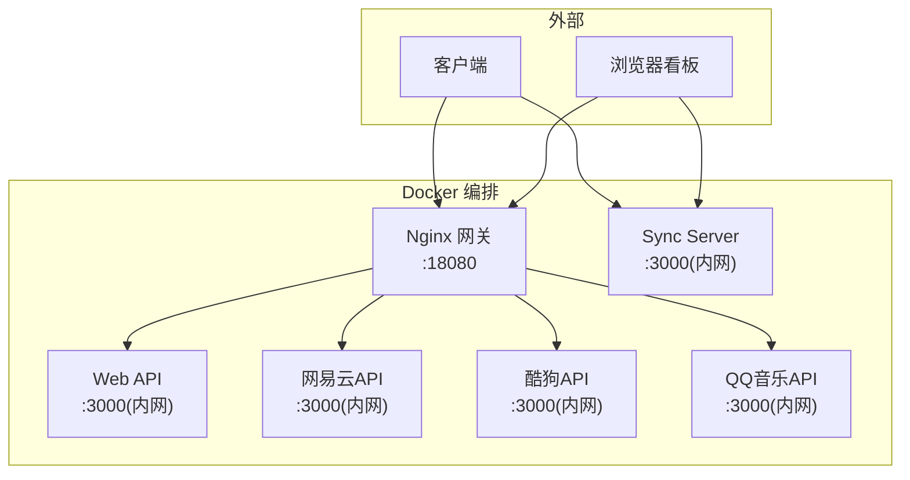
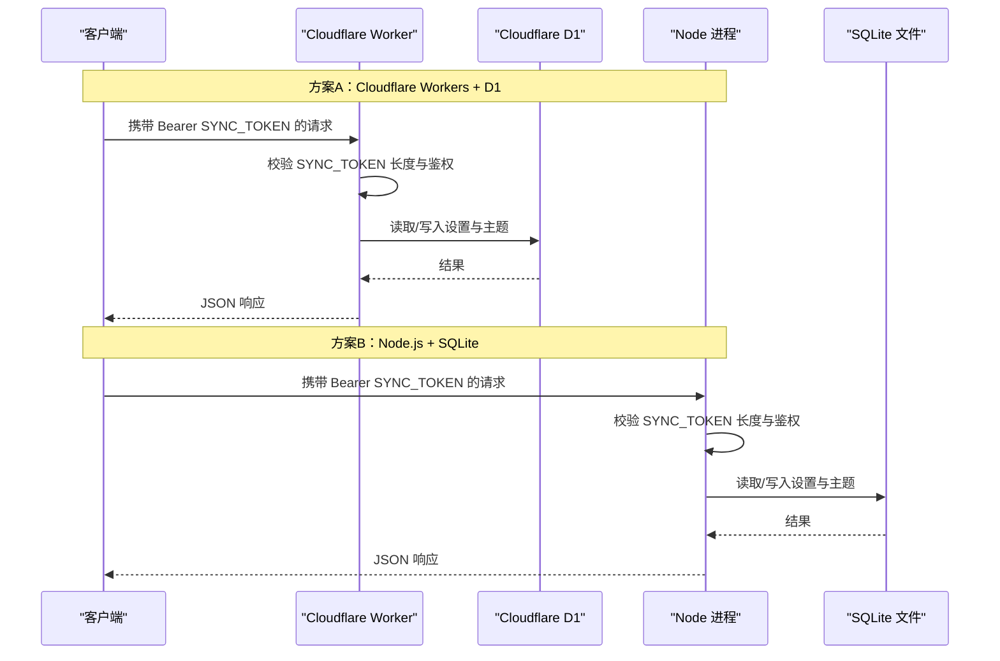
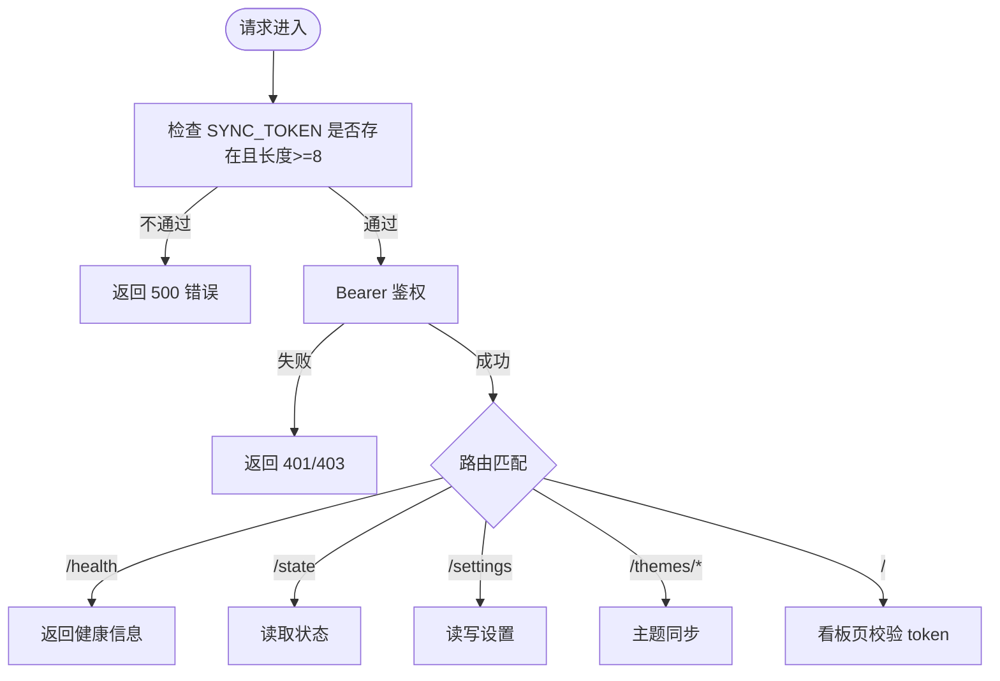
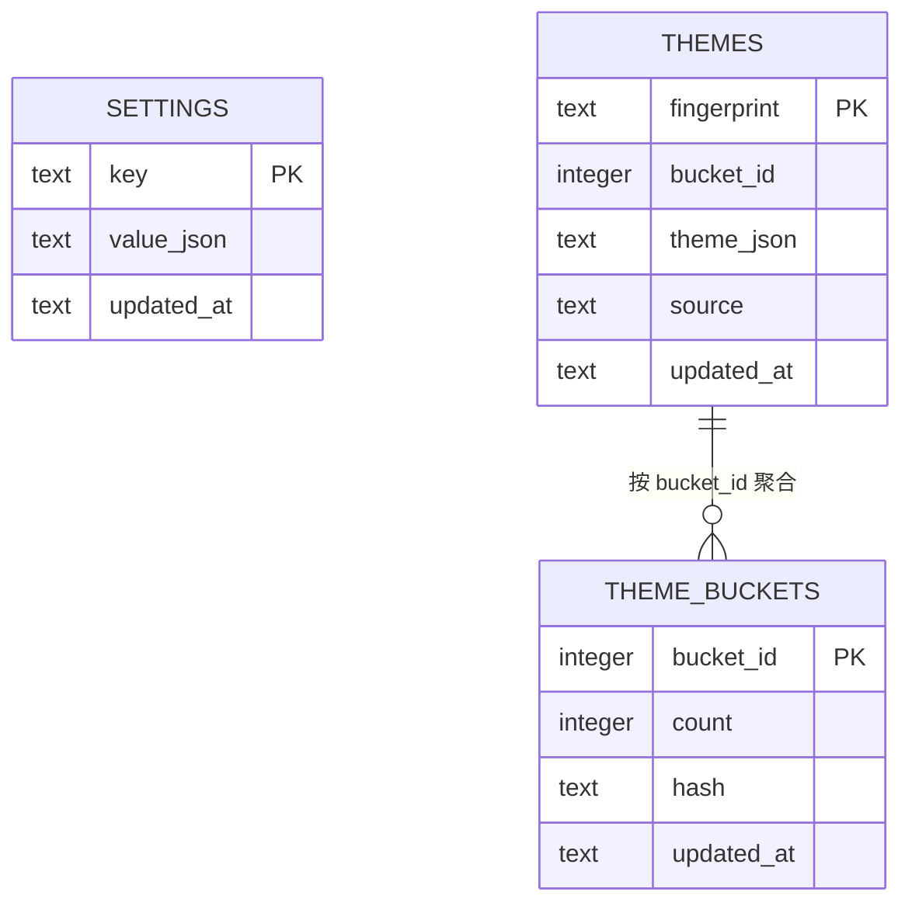
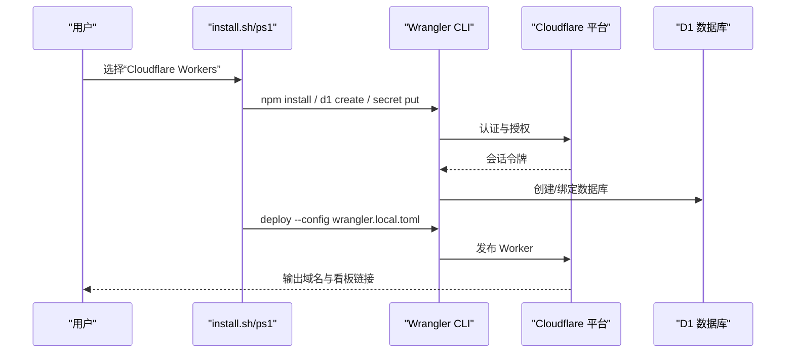
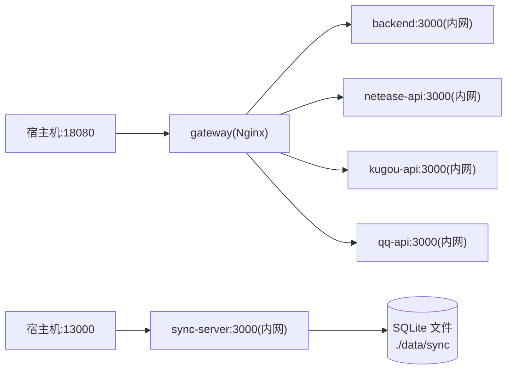
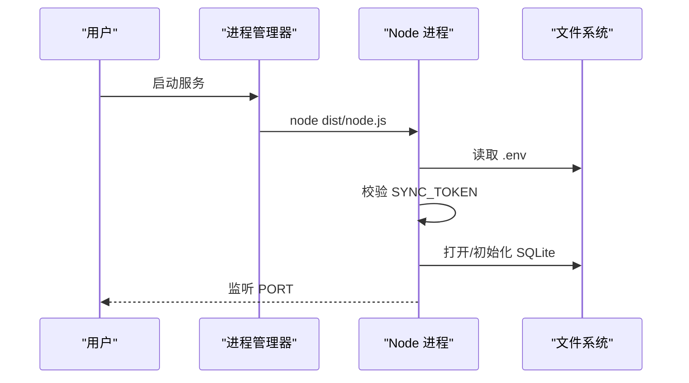
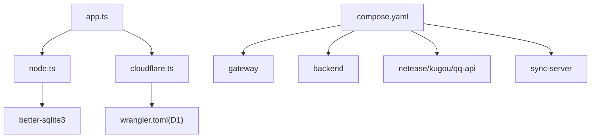

# 部署指南

<cite>
**本文引用的文件**
- [sync-server/README.md](file://sync-server/README.md)
- [deploy/docker/README.md](file://deploy/docker/README.md)
- [deploy/docker/compose.yaml](file://deploy/docker/compose.yaml)
- [deploy/docker/compose.sync.yaml](file://deploy/docker/compose.sync.yaml)
- [deploy/docker/images/sync-server.Dockerfile](file://deploy/docker/images/sync-server.Dockerfile)
- [deploy/docker/sync-server/entrypoint.sh](file://deploy/docker/sync-server/entrypoint.sh)
- [deploy/docker/gateway/nginx.conf.template](file://deploy/docker/gateway/nginx.conf.template)
- [sync-server/package.json](file://sync-server/package.json)
- [sync-server/wrangler.toml](file://sync-server/wrangler.toml)
- [sync-server/src/app.ts](file://sync-server/src/app.ts)
- [sync-server/src/node.ts](file://sync-server/src/node.ts)
- [sync-server/src/cloudflare.ts](file://sync-server/src/cloudflare.ts)
- [sync-server/install.sh](file://sync-server/install.sh)
- [sync-server/install.ps1](file://sync-server/install.ps1)
</cite>

## 目录
1. [简介](#简介)
2. [项目结构](#项目结构)
3. [核心组件](#核心组件)
4. [架构总览](#架构总览)
5. [详细组件分析](#详细组件分析)
6. [依赖关系分析](#依赖关系分析)
7. [性能与容量规划](#性能与容量规划)
8. [故障排查指南](#故障排查指南)
9. [结论](#结论)
10. [附录：环境变量与配置速查](#附录环境变量与配置速查)

## 简介
本指南面向需要部署 Folia Player 同步服务的运维与开发者，覆盖三种主流部署方案：Cloudflare Workers Serverless、Docker 容器化、Node.js 自托管。文档重点说明环境准备、依赖安装、关键环境变量（SYNC_TOKEN、DASHBOARD_TOKEN、数据库连接）、服务启动流程，以及 Docker Compose 编排中的网络、数据持久化与健康检查等高级选项。同时提供监控、排错与性能调优建议，帮助在生产环境中稳定运行同步服务。

## 项目结构
Folia 同步服务位于 sync-server 目录，支持多端同构：同一套路由与数据访问模型在 Cloudflare D1/Workers 与 Node.js + SQLite 环境下均可运行。Docker 编排将 Web 网关、后端 API、在线音乐接口与独立的 Sync Server 组合在一起，对外仅暴露 Web 网关与 Sync Server 端口，内部服务通过 Docker 网络互访。

图表来源
- [deploy/docker/compose.yaml:4-163](file://deploy/docker/compose.yaml#L4-L163)
- [deploy/docker/gateway/nginx.conf.template:24-83](file://deploy/docker/gateway/nginx.conf.template#L24-L83)

章节来源
- [deploy/docker/README.md:1-63](file://deploy/docker/README.md#L1-L63)
- [deploy/docker/compose.yaml:1-179](file://deploy/docker/compose.yaml#L1-L179)

## 核心组件
- 路由与应用逻辑：Hono 应用定义健康检查、鉴权中间件、设置与主题同步 API，以及隐藏看板页面。
- 存储抽象：Cloudflare D1 与本地 SQLite 通过统一接口访问；Node 模式使用 D1 兼容层。
- 入口适配：Cloudflare 入口直接导出 Hono 应用；Node 入口负责加载 .env、校验 Token、创建 SQLite 实例并启动 HTTP 服务。
- 部署脚本：提供交互式安装向导，自动完成依赖安装、Token 生成、D1 创建与 Secret 注入、镜像构建与服务启动。

章节来源
- [sync-server/src/app.ts:121-523](file://sync-server/src/app.ts#L121-L523)
- [sync-server/src/node.ts:1-85](file://sync-server/src/node.ts#L1-L85)
- [sync-server/src/cloudflare.ts:1-3](file://sync-server/src/cloudflare.ts#L1-L3)
- [sync-server/install.sh:28-239](file://sync-server/install.sh#L28-L239)
- [sync-server/install.ps1:311-328](file://sync-server/install.ps1#L311-L328)

## 架构总览
下图展示 Cloudflare Workers 与 Docker 两种部署路径下的请求流与数据存储位置。

图表来源
- [sync-server/src/app.ts:129-143](file://sync-server/src/app.ts#L129-L143)
- [sync-server/src/app.ts:315-523](file://sync-server/src/app.ts#L315-L523)
- [sync-server/src/node.ts:31-85](file://sync-server/src/node.ts#L31-L85)
- [sync-server/wrangler.toml:5-12](file://sync-server/wrangler.toml#L5-L12)

## 详细组件分析

### 安全与鉴权
- 全局中间件强制要求 SYNC_TOKEN 存在且长度不小于 8 位，否则返回错误。
- 所有 API 路由受 Bearer Token 保护；根路径 / 为隐藏看板，需查询参数 token 匹配 DASHBOARD_TOKEN。
- Node 启动时若缺失或过短也会直接退出，避免弱口令上线。

图表来源
- [sync-server/src/app.ts:129-143](file://sync-server/src/app.ts#L129-L143)
- [sync-server/src/app.ts:145-313](file://sync-server/src/app.ts#L145-L313)
- [sync-server/src/app.ts:315-523](file://sync-server/src/app.ts#L315-L523)
- [sync-server/src/node.ts:31-45](file://sync-server/src/node.ts#L31-L45)

章节来源
- [sync-server/src/app.ts:121-523](file://sync-server/src/app.ts#L121-L523)
- [sync-server/src/node.ts:31-45](file://sync-server/src/node.ts#L31-L45)

### 数据模型与同步协议
- 表结构：settings（键值+更新时间）、themes（指纹、分桶ID、JSON、来源、更新时间）、theme_buckets（分桶计数、哈希、更新时间）。
- 索引：按 updated_at 与 bucket_id 建立索引以优化查询。
- 协议约束：schemaVersion=1；主题 manifest 固定 256 个 bucket；批量写入上限 500；bucket 请求最多 32；完整列表分页默认 500，最大 1000。

图表来源
- [sync-server/src/app.ts:47-78](file://sync-server/src/app.ts#L47-L78)
- [sync-server/src/app.ts:104-119](file://sync-server/src/app.ts#L104-L119)
- [sync-server/src/app.ts:373-518](file://sync-server/src/app.ts#L373-L518)

章节来源
- [sync-server/src/app.ts:47-78](file://sync-server/src/app.ts#L47-L78)
- [sync-server/src/app.ts:104-119](file://sync-server/src/app.ts#L104-L119)
- [sync-server/src/app.ts:373-518](file://sync-server/src/app.ts#L373-L518)

### 部署方案一：Cloudflare Workers Serverless
- 前置条件：Cloudflare 账号、Node.js 24+、npm。
- 推荐方式：使用安装脚本自动创建 D1、生成 wrangler.local.toml、注入 SECRET、部署到边缘。
- 手动步骤要点：登录 Wrangler、创建 D1、复制模板为本地配置、替换 database_id、注入 SYNC_TOKEN 与 DASHBOARD_TOKEN、执行部署命令。
- 访问看板：Worker 域名/?token=DASHBOARD_TOKEN。

图表来源
- [sync-server/install.sh:171-233](file://sync-server/install.sh#L171-L233)
- [sync-server/install.ps1:271-309](file://sync-server/install.ps1#L271-L309)
- [sync-server/wrangler.toml:5-12](file://sync-server/wrangler.toml#L5-L12)

章节来源
- [sync-server/README.md:50-213](file://sync-server/README.md#L50-L213)
- [sync-server/install.sh:171-233](file://sync-server/install.sh#L171-L233)
- [sync-server/install.ps1:271-309](file://sync-server/install.ps1#L271-L309)
- [sync-server/wrangler.toml:1-13](file://sync-server/wrangler.toml#L1-L13)

### 部署方案二：Docker 容器化
- 快速启动：下载 compose.yaml 与 .env 模板，填入 SYNC_TOKEN，拉取镜像并启动。
- 端口映射：Web 网关 18080，Sync Server 13000。
- 数据持久化：Sync Server 的 SQLite 文件挂载至宿主机目录（默认 ./data/sync）。
- 网络隔离：gateway/backend/netease/kugou/qq-api 通过内部网络互通；sync-server 独立网络，不与其他内部服务互通。
- 健康检查：各服务均配置 healthcheck，便于编排管理。

图表来源
- [deploy/docker/compose.yaml:4-163](file://deploy/docker/compose.yaml#L4-L163)
- [deploy/docker/compose.yaml:165-179](file://deploy/docker/compose.yaml#L165-L179)
- [deploy/docker/README.md:55-79](file://deploy/docker/README.md#L55-L79)

章节来源
- [deploy/docker/README.md:7-87](file://deploy/docker/README.md#L7-L87)
- [deploy/docker/compose.yaml:139-163](file://deploy/docker/compose.yaml#L139-L163)
- [deploy/docker/images/sync-server.Dockerfile:14-36](file://deploy/docker/images/sync-server.Dockerfile#L14-L36)
- [deploy/docker/sync-server/entrypoint.sh:1-7](file://deploy/docker/sync-server/entrypoint.sh#L1-L7)

### 部署方案三：Node.js 自托管
- 环境要求：Node.js >= 24，npm/pnpm。
- 环境变量：在 sync-server/.env 中设置 SYNC_TOKEN、DASHBOARD_TOKEN、PORT、DB_PATH。
- 启动方式：npm run start:node；生产可用 PM2 守护。
- 数据库：better-sqlite3 本地文件，路径由 DB_PATH 控制。

图表来源
- [sync-server/package.json:10-16](file://sync-server/package.json#L10-L16)
- [sync-server/src/node.ts:10-47](file://sync-server/src/node.ts#L10-L47)
- [sync-server/install.sh:59-137](file://sync-server/install.sh#L59-L137)
- [sync-server/install.ps1:183-229](file://sync-server/install.ps1#L183-L229)

章节来源
- [sync-server/README.md:249-284](file://sync-server/README.md#L249-L284)
- [sync-server/src/node.ts:10-85](file://sync-server/src/node.ts#L10-L85)
- [sync-server/package.json:1-34](file://sync-server/package.json#L1-L34)

## 依赖关系分析
- 运行时依赖：Hono、@hono/node-server、better-sqlite3；开发依赖包含 TypeScript、Wrangler、Cloudflare Workers 类型。
- 入口与适配：app.ts 提供路由与业务逻辑；node.ts 负责 Node 环境启动；cloudflare.ts 作为 Worker 入口导出应用。
- 编排依赖：compose.yaml 定义了 gateway、backend、netease-api、kugou-api、qq-api、sync-server 的服务间依赖与健康检查；networks 实现内外网隔离。

图表来源
- [sync-server/src/app.ts:1-4](file://sync-server/src/app.ts#L1-L4)
- [sync-server/src/node.ts:1-7](file://sync-server/src/node.ts#L1-L7)
- [sync-server/src/cloudflare.ts:1-3](file://sync-server/src/cloudflare.ts#L1-L3)
- [sync-server/wrangler.toml:5-12](file://sync-server/wrangler.toml#L5-L12)
- [deploy/docker/compose.yaml:4-163](file://deploy/docker/compose.yaml#L4-L163)

章节来源
- [sync-server/package.json:20-32](file://sync-server/package.json#L20-L32)
- [deploy/docker/compose.yaml:4-163](file://deploy/docker/compose.yaml#L4-L163)

## 性能与容量规划
- 请求限制与批处理：主题批量写入上限 500，bucket 请求最多 32，完整列表分页默认 500、最大 1000，避免单次过大负载。
- 数据库索引：按 updated_at 与 bucket_id 建索引，提升增量同步与统计查询效率。
- 容器资源：Gateway 与 API 服务启用只读文件系统、tmpfs 临时目录，降低磁盘写放大；健康检查间隔与超时合理配置，利于快速发现异常。
- 网络隔离：内部服务通过 internal 网络通信，减少不必要的外部暴露面。
- 反向代理：建议在 NAS 或边缘网关终止 HTTPS，传递 Host、X-Forwarded-* 头，确保前端安全上下文与正确路由。

章节来源
- [sync-server/src/app.ts:23-28](file://sync-server/src/app.ts#L23-L28)
- [sync-server/src/app.ts:47-78](file://sync-server/src/app.ts#L47-L78)
- [deploy/docker/compose.yaml:15-20](file://deploy/docker/compose.yaml#L15-L20)
- [deploy/docker/README.md:105-137](file://deploy/docker/README.md#L105-L137)

## 故障排查指南
- 启动失败（Node）：检查 .env 是否包含 SYNC_TOKEN 且长度≥8；确认 DB_PATH 可写；查看控制台错误提示。
- 鉴权失败：确认客户端 Authorization 头携带正确的 Bearer Token；看板访问需 ?token=DASHBOARD_TOKEN。
- 健康检查失败：使用 curl 检查 /health、/api/healthz、/runtime-config.js 等端点；查看对应容器日志。
- 数据持久化：确认 volumes 挂载路径存在且权限正确；备份前停止 sync-server 再打包数据目录。
- 网络问题：确认 compose 网络名称一致；gateway 与内部服务在同一 internal 网络；sync-server 独立网络不与其它内部服务互通。
- 更新与回滚：修改 .env 版本变量后重新 pull 并 up；必要时固定版本号进行严格复现。

章节来源
- [sync-server/src/node.ts:31-45](file://sync-server/src/node.ts#L31-L45)
- [sync-server/src/app.ts:129-143](file://sync-server/src/app.ts#L129-L143)
- [deploy/docker/README.md:139-167](file://deploy/docker/README.md#L139-L167)
- [deploy/docker/compose.yaml:154-163](file://deploy/docker/compose.yaml#L154-L163)

## 结论
Folia 同步服务提供了统一的 API 与数据模型，支持 Cloudflare Workers Serverless、Docker 容器化与 Node.js 自托管三种部署方式。通过严格的 Token 校验、合理的批处理与索引设计、以及完善的编排与健康检查，可在不同场景下获得高可用与易维护的运行体验。建议在生产环境使用 HTTPS 反向代理、定期备份数据库、结合速率限制与日志轮转策略，以获得更稳健的运维效果。

## 附录：环境变量与配置速查
- 通用环境变量
  - SYNC_TOKEN：必填，客户端鉴权 Bearer Token，至少 8 位。
  - DASHBOARD_TOKEN：选填，隐藏看板访问令牌。
  - PORT：服务监听端口（Node/Docker 默认 3000）。
  - DB_PATH：SQLite 文件路径（Node/Docker）。
- Docker Compose 相关
  - FOLIA_IMAGE_NAMESPACE：镜像命名空间。
  - FOLIA_STACK_VERSION / FOLIA_SYNC_VERSION：镜像版本。
  - FOLIA_HTTP_BIND / FOLIA_HTTP_PORT：网关绑定地址与端口。
  - FOLIA_SYNC_BIND / FOLIA_SYNC_PORT：Sync Server 绑定地址与端口。
  - FOLIA_SYNC_DATA_DIR：SQLite 持久化目录。
  - FOLIA_AI_PROVIDER：AI 提供商（google/gemini/openai）。
  - ENABLE_GENERAL_UNBLOCK：网易云解锁开关。
  - QQ_AUTH_SESSION_PATH / QQ_SESSION_SECRET：QQ 登录态加密保存路径与密钥。
- Cloudflare Workers
  - wrangler.toml：Worker 名称、入口、兼容性日期、D1 绑定与 database_id。
  - Secret：通过 wrangler secret put 注入 SYNC_TOKEN 与 DASHBOARD_TOKEN。

章节来源
- [deploy/docker/README.md:64-87](file://deploy/docker/README.md#L64-L87)
- [deploy/docker/compose.yaml:143-151](file://deploy/docker/compose.yaml#L143-L151)
- [sync-server/wrangler.toml:5-12](file://sync-server/wrangler.toml#L5-L12)
- [sync-server/README.md:10-47](file://sync-server/README.md#L10-L47)
- [sync-server/README.md:287-323](file://sync-server/README.md#L287-L323)