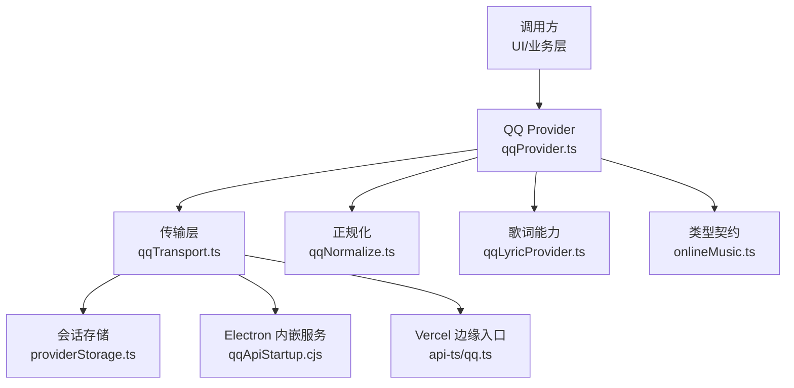
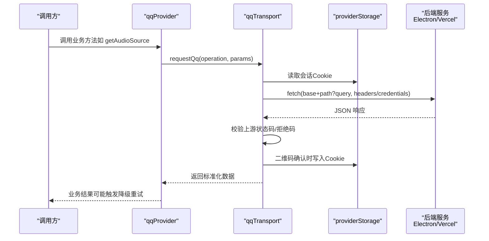
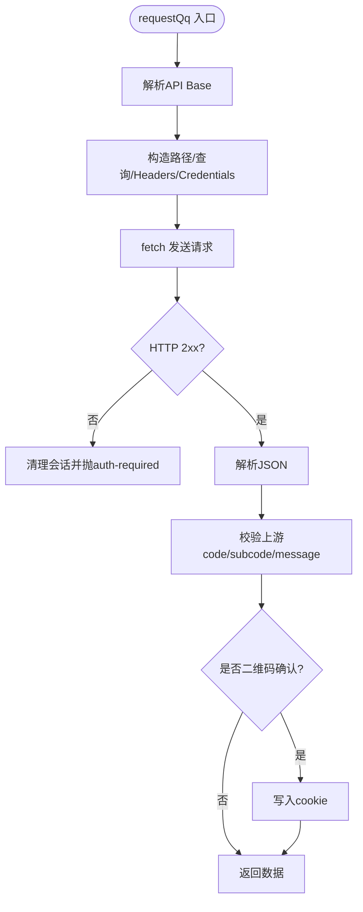
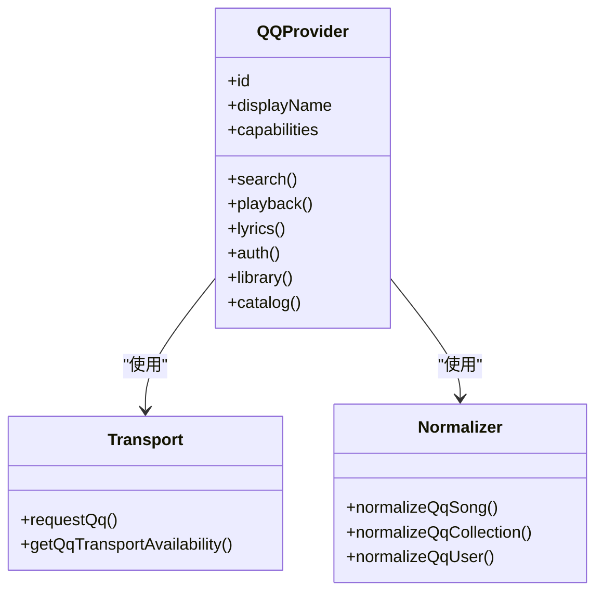
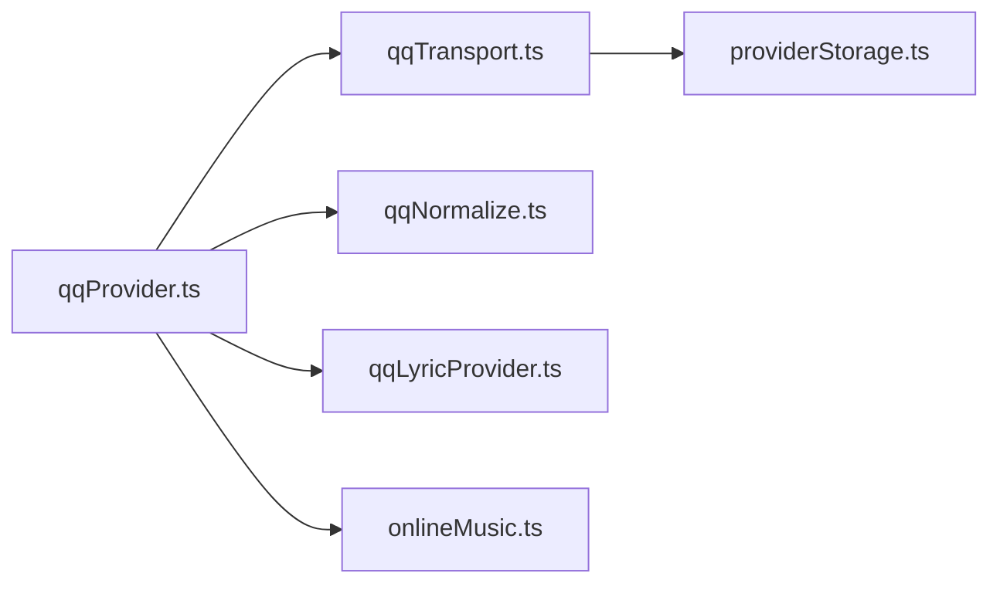

# API封装层

<cite>
**本文引用的文件**
- [qqProvider.ts](file://src/services/onlineMusic/qqProvider.ts)
- [qqTransport.ts](file://src/services/onlineMusic/qqTransport.ts)
- [qqNormalize.ts](file://src/services/onlineMusic/qqNormalize.ts)
- [qqLyricProvider.ts](file://src/utils/lyrics/providers/qqLyricProvider.ts)
- [onlineMusic.ts](file://src/types/onlineMusic.ts)
- [appPlaybackHelpers.ts](file://src/utils/appPlaybackHelpers.ts)
- [providerStorage.ts](file://src/services/onlineMusic/providerStorage.ts)
- [qqApiStartup.cjs](file://electron/qqApiStartup.cjs)
- [qq.ts（Vercel入口）](file://api-ts/qq.ts)
</cite>

## 目录
1. [简介](#简介)
2. [项目结构](#项目结构)
3. [核心组件](#核心组件)
4. [架构总览](#架构总览)
5. [详细组件分析](#详细组件分析)
6. [依赖关系分析](#依赖关系分析)
7. [性能与网络优化](#性能与网络优化)
8. [故障排查指南](#故障排查指南)
9. [结论](#结论)
10. [附录：API方法参考](#附录api方法参考)

## 简介
本文件系统性说明 QQ 音乐 API 的封装实现，覆盖 HTTP 请求封装、响应数据转换、错误处理、传输层原理（请求拦截、会话管理、同源/跨源策略）、以及音频质量降级策略。同时提供搜索、播放、收藏、评论（通过歌词能力体现）、专辑、歌手、歌单等资源的获取与处理逻辑，并给出完整的 API 方法参考。

## 项目结构
QQ 音乐相关代码主要分布在以下模块：
- 传输层：负责统一发起请求、鉴权头注入、同源/跨源策略、上游状态校验、会话持久化
- Provider 层：面向上层暴露统一的在线音乐能力（搜索、播放、歌词、认证、库、目录）
- 正规化层：将上游异构数据结构统一为内部标准模型
- 歌词子模块：复用既有歌词搜索与解密能力
- Electron 启动器：在桌面端内嵌启动 qq-music-api 服务
- Vercel 入口：边缘运行时转发请求到后端 serverless

图表来源
- [qqProvider.ts:1-665](file://src/services/onlineMusic/qqProvider.ts#L1-L665)
- [qqTransport.ts:1-245](file://src/services/onlineMusic/qqTransport.ts#L1-L245)
- [providerStorage.ts:1-65](file://src/services/onlineMusic/providerStorage.ts#L1-L65)
- [qqApiStartup.cjs:1-166](file://electron/qqApiStartup.cjs#L1-L166)
- [qq.ts（Vercel入口）:1-38](file://api-ts/qq.ts#L1-L38)

章节来源
- [qqProvider.ts:1-665](file://src/services/onlineMusic/qqProvider.ts#L1-L665)
- [qqTransport.ts:1-245](file://src/services/onlineMusic/qqTransport.ts#L1-L245)
- [qqNormalize.ts:1-322](file://src/services/onlineMusic/qqNormalize.ts#L1-L322)
- [qqLyricProvider.ts:1-212](file://src/utils/lyrics/providers/qqLyricProvider.ts#L1-L212)
- [onlineMusic.ts:1-338](file://src/types/onlineMusic.ts#L1-L338)
- [appPlaybackHelpers.ts:1-200](file://src/utils/appPlaybackHelpers.ts#L1-L200)
- [providerStorage.ts:1-65](file://src/services/onlineMusic/providerStorage.ts#L1-L65)
- [qqApiStartup.cjs:1-166](file://electron/qqApiStartup.cjs#L1-L166)
- [qq.ts（Vercel入口）:1-38](file://api-ts/qq.ts#L1-L38)

## 核心组件
- 传输层（qqTransport.ts）
  - 统一操作枚举与路由映射
  - 解析 API Base（Electron 内嵌端口或环境变量）
  - 会话 Cookie 提取与同源/跨源差异化传递（Header vs Query）
  - 统一错误分类（网络、未登录、无效响应）
  - 上游状态码检查（专辑/歌手路由的特殊层级）
  - 二维码确认时持久化会话
- Provider（qqProvider.ts）
  - 搜索、播放、歌词、认证、用户库、目录（歌单/专辑/歌手）
  - 音频质量降级策略（标准→高→无损/Hi-Res）
  - 资源详情与分页、本地切片适配上游不可分页接口
  - 登录通道发现与缓存、二维码生命周期控制
- 正规化（qqNormalize.ts）
  - 歌曲、专辑、歌手、歌单的字段抽取与兼容
  - 封面 URL 生成规则（photo_new）
  - catalogRef 稳定身份标识
- 歌词（qqLyricProvider.ts）
  - 搜索与下载/解密（QRC），词行格式检测与合唱效果应用
- 类型契约（onlineMusic.ts）
  - 统一的能力声明、错误类型、页面结构、音频源、用户/集合模型
- 会话存储（providerStorage.ts）
  - 命名空间化的 localStorage 读写，支持旧键迁移
- Electron 启动器（qqApiStartup.cjs）
  - 动态加载 qq-music-api，监听端口，错误隔离
- Vercel 入口（api-ts/qq.ts）
  - Edge 运行时转发，路径还原与环境透传

章节来源
- [qqTransport.ts:1-245](file://src/services/onlineMusic/qqTransport.ts#L1-L245)
- [qqProvider.ts:1-665](file://src/services/onlineMusic/qqProvider.ts#L1-L665)
- [qqNormalize.ts:1-322](file://src/services/onlineMusic/qqNormalize.ts#L1-L322)
- [qqLyricProvider.ts:1-212](file://src/utils/lyrics/providers/qqLyricProvider.ts#L1-L212)
- [onlineMusic.ts:1-338](file://src/types/onlineMusic.ts#L1-L338)
- [providerStorage.ts:1-65](file://src/services/onlineMusic/providerStorage.ts#L1-L65)
- [qqApiStartup.cjs:1-166](file://electron/qqApiStartup.cjs#L1-L166)
- [qq.ts（Vercel入口）:1-38](file://api-ts/qq.ts#L1-L38)

## 架构总览
整体采用“Provider + Transport”分层：
- Provider 专注业务编排与数据归一
- Transport 专注网络细节、鉴权、错误与上游协议差异
- 正规化层屏蔽上游字段差异
- 歌词能力复用既有实现
- Electron/Vercel 双部署形态由传输层自动选择

图表来源
- [qqProvider.ts:171-222](file://src/services/onlineMusic/qqProvider.ts#L171-L222)
- [qqTransport.ts:200-245](file://src/services/onlineMusic/qqTransport.ts#L200-L245)
- [providerStorage.ts:33-65](file://src/services/onlineMusic/providerStorage.ts#L33-L65)

## 详细组件分析

### 传输层（qqTransport.ts）
- 操作与路由
  - 集中定义所有支持的 operation 与对应后端路径
  - 特殊参数拼接（如 music_play/song_info 的路径参数）
- 基址解析
  - Electron 环境：通过 window.electron.getQqPort 动态获取内嵌服务端口
  - Web 环境：读取 VITE_QQ_API_BASE，要求必须配置
- 会话与鉴权
  - 从 providerStorage 读取 qqmusic_session 字符串
  - 同源部署：提取 token 放入自定义 Header X-QQ-Session
  - 跨源部署：以 query cookie= 形式传递
  - 401 清理会话并抛出 auth-required
- 上游状态校验
  - 专辑/歌手路由存在多层 code 节点，需逐层检查并抛错
- 二维码会话持久化
  - login_qr_check 返回确认码时，持久化 cookie

图表来源
- [qqTransport.ts:42-83](file://src/services/onlineMusic/qqTransport.ts#L42-L83)
- [qqTransport.ts:85-109](file://src/services/onlineMusic/qqTransport.ts#L85-L109)
- [qqTransport.ts:119-157](file://src/services/onlineMusic/qqTransport.ts#L119-L157)
- [qqTransport.ts:166-245](file://src/services/onlineMusic/qqTransport.ts#L166-L245)

章节来源
- [qqTransport.ts:1-245](file://src/services/onlineMusic/qqTransport.ts#L1-L245)

### Provider（qqProvider.ts）
- 搜索
  - 复用歌词搜索能力，返回标准化歌曲列表
- 播放
  - 按质量优先级尝试 music_play，失败则降级
  - 对空链接但成功响应的情况做区分，避免误判为可重试
- 歌词
  - 基于 qqMid 与 songId 拉取并解密歌词
- 认证
  - 登录状态、登出、二维码流程（key/create/check/cancel）
  - 登录通道发现与缓存，避免 UI 闪烁
- 用户库
  - 歌单、收藏专辑、喜欢歌曲 ID 列表（分页/本地切片）
- 目录
  - 歌单详情与曲目、专辑详情与曲目、歌手详情/歌曲/专辑
  - 针对上游不可分页接口进行本地切片
- 资源引用补全
  - 搜索返回的条目可能缺少 mid，按需回查 song_info 补齐 catalogRef

图表来源
- [qqProvider.ts:593-665](file://src/services/onlineMusic/qqProvider.ts#L593-L665)
- [qqTransport.ts:159-164](file://src/services/onlineMusic/qqTransport.ts#L159-L164)
- [qqNormalize.ts:94-153](file://src/services/onlineMusic/qqNormalize.ts#L94-L153)

章节来源
- [qqProvider.ts:1-665](file://src/services/onlineMusic/qqProvider.ts#L1-L665)

### 正规化（qqNormalize.ts）
- 歌曲
  - 稳定身份：songmid；显示用 id：优先数字 songId，否则 songmid
  - 专辑/歌手信息抽取，封面 URL 生成
  - sourceRef.providerData 保留关键 mid 信息
- 专辑/歌手/歌单
  - 兼容多种字段名与层级
  - 时间戳兼容（日期串/秒级epoch/毫秒数）
  - catalogRef 用于导航与缓存水合

章节来源
- [qqNormalize.ts:1-322](file://src/services/onlineMusic/qqNormalize.ts#L1-L322)

### 歌词（qqLyricProvider.ts）
- 搜索：DoSearchForQQMusicLite，返回 item_song
- 获取歌词：GetPlayLyricInfo，支持 QRC/QRC翻译/罗马音
- 解密：qrcDecrypt，格式检测与合唱效果应用

章节来源
- [qqLyricProvider.ts:1-212](file://src/utils/lyrics/providers/qqLyricProvider.ts#L1-L212)

### Electron 启动器（qqApiStartup.cjs）
- 动态 require qq-music-api，设置必要环境变量
- 等待服务器监听完成，捕获绑定错误
- 暴露 close 方法安全关闭服务

章节来源
- [qqApiStartup.cjs:1-166](file://electron/qqApiStartup.cjs#L1-L166)

### Vercel 入口（api-ts/qq.ts）
- Edge 运行时，将 /api/qq?path=... 还原为后端路径
- 透传 method/headers/body，保留 X-QQ-Session
- 注入 QQ_SESSION_SECRET 等环境变量

章节来源
- [qq.ts（Vercel入口）:1-38](file://api-ts/qq.ts#L1-L38)

## 依赖关系分析
- Provider 依赖 Transport 进行网络访问
- Transport 依赖 providerStorage 存取会话
- Provider 依赖 Normalizer 统一数据模型
- 歌词能力独立于主传输层，直接访问 u.y.qq.com（Electron直连或代理）
- 类型契约贯穿各层，保证一致性

图表来源
- [qqProvider.ts:1-665](file://src/services/onlineMusic/qqProvider.ts#L1-L665)
- [qqTransport.ts:1-245](file://src/services/onlineMusic/qqTransport.ts#L1-L245)
- [providerStorage.ts:1-65](file://src/services/onlineMusic/providerStorage.ts#L1-L65)
- [qqNormalize.ts:1-322](file://src/services/onlineMusic/qqNormalize.ts#L1-L322)
- [qqLyricProvider.ts:1-212](file://src/utils/lyrics/providers/qqLyricProvider.ts#L1-L212)
- [onlineMusic.ts:1-338](file://src/types/onlineMusic.ts#L1-L338)

章节来源
- [qqProvider.ts:1-665](file://src/services/onlineMusic/qqProvider.ts#L1-L665)
- [qqTransport.ts:1-245](file://src/services/onlineMusic/qqTransport.ts#L1-L245)
- [providerStorage.ts:1-65](file://src/services/onlineMusic/providerStorage.ts#L1-L65)
- [qqNormalize.ts:1-322](file://src/services/onlineMusic/qqNormalize.ts#L1-L322)
- [qqLyricProvider.ts:1-212](file://src/utils/lyrics/providers/qqLyricProvider.ts#L1-L212)
- [onlineMusic.ts:1-338](file://src/types/onlineMusic.ts#L1-L338)

## 性能与网络优化
- 音频质量降级策略
  - 标准音质：仅尝试 128k
  - 高音质：优先 320k，失败回退 128k
  - 无损/Hi-Res：优先 flac，失败回退 320k，再失败 128k
  - 对上游返回空链接但成功的情况做区分，避免误判为可重试
- 请求去重
  - 同一首歌的详情请求在同一时刻去重，避免重复网络开销
- 本地切片
  - 对于上游不可分页的接口（如歌单详情、专辑详情），一次性拉取后本地切片
- 会话与鉴权
  - 同源走 Header，跨源走 Query，减少预检与跨域问题
  - 二维码确认后持久化会话，减少重复登录
- 歌词能力
  - 复用既有搜索与解密链路，避免重复实现
- 播放恢复
  - 基于媒体路径去重防止 vkey/guid 变化导致的无限重试循环

章节来源
- [qqProvider.ts:35-55](file://src/services/onlineMusic/qqProvider.ts#L35-L55)
- [qqProvider.ts:124-136](file://src/services/onlineMusic/qqProvider.ts#L124-L136)
- [qqProvider.ts:171-222](file://src/services/onlineMusic/qqProvider.ts#L171-L222)
- [qqTransport.ts:101-109](file://src/services/onlineMusic/qqTransport.ts#L101-L109)
- [qqTransport.ts:159-164](file://src/services/onlineMusic/qqTransport.ts#L159-L164)
- [appPlaybackHelpers.ts:94-118](file://src/utils/appPlaybackHelpers.ts#L94-L118)

## 故障排查指南
- 未配置 API Base
  - 现象：提示未配置 VITE_QQ_API_BASE
  - 处理：确保环境变量正确设置或在 Electron 中启动内嵌服务
- 401 未登录
  - 现象：请求返回 401，自动清理会话
  - 处理：重新扫码登录，确认 cookie 已持久化
- 上游拒绝（专辑/歌手）
  - 现象：HTTP 200 但响应体包含 code/subcode 非零
  - 处理：查看具体 code/message，修正参数或权限
- 二维码过期/被拒
  - 现象：check 返回 800 且携带 upstreamCode/retryAfterMs
  - 处理：提示用户刷新二维码
- 播放无可用链接
  - 现象：music_play 返回空 url 或全部失败
  - 处理：检查账号权限/地区限制，观察日志中的 upstreamRefusedPlayLink

章节来源
- [qqTransport.ts:78-83](file://src/services/onlineMusic/qqTransport.ts#L78-L83)
- [qqTransport.ts:227-245](file://src/services/onlineMusic/qqTransport.ts#L227-L245)
- [qqProvider.ts:240-276](file://src/services/onlineMusic/qqProvider.ts#L240-L276)
- [qqProvider.ts:364-388](file://src/services/onlineMusic/qqProvider.ts#L364-L388)
- [qqProvider.ts:171-222](file://src/services/onlineMusic/qqProvider.ts#L171-L222)

## 结论
该封装通过清晰的 Provider/Transport 分层，实现了 QQ 音乐的多端部署（Electron/Vercel）、稳定的鉴权与会话管理、健壮的上游错误处理与降级策略，以及对复杂上游接口的本地切片适配。配合正规化层与类型契约，保证了上层业务的一致性与可维护性。

## 附录：API方法参考
以下为 QQ Provider 对外暴露的主要能力与方法（名称与职责来自源码导出对象）：

- 搜索
  - searchSongs(query, limit, offset) → Promise<ProviderPage<UnifiedSong>>
- 播放
  - getSongDetail(id) → Promise<UnifiedSong | null>
  - getAudioSource(song, quality) → Promise<ProviderAudioSource | null>
- 歌词
  - getLyrics(song) → Promise<ProviderLyricsResult>
- 认证
  - getLoginStatus() → Promise<ProviderUser | null>
  - logout() → Promise<void>
  - getQrLoginMethods() → QrLoginMethod[]
  - resolveQrLoginMethods() → Promise<QrLoginMethod[]>
  - getQrKey(methodId?) → Promise<string>
  - createQr(key) → Promise<string>
  - checkQr(key) → Promise<QrLoginState>
  - cancelQr(key) → Promise<void>
  - getQrTtlMs() → number
- 用户库
  - getUserPlaylists(userId, limit, offset) → Promise<ProviderPage<ProviderCollection>>
  - getLikedSongIds(userId) → Promise<MediaId[]>
  - getUserAlbums(userId, limit, offset) → Promise<ProviderPage<ProviderCollection>>
- 目录
  - canResolveSongCatalogRefs(song) → boolean
  - resolveSongCatalogRefs(song) → Promise<UnifiedSong>
  - getPlaylistTracks(id, limit, offset, collection?) → Promise<ProviderPage<UnifiedSong>>
  - getAlbumDetail(id, collection?) → Promise<ProviderCollection | null>
  - getAlbumTracks(id, limit?, offset?, collection?) → Promise<ProviderPage<UnifiedSong>>
  - getArtistDetail(id) → Promise<ProviderCollection | null>
  - getArtistSongs(id, limit, offset) → Promise<ProviderPage<UnifiedSong>>
  - getArtistAlbums(id, limit, offset) → Promise<ProviderPage<ProviderCollection>>

章节来源
- [qqProvider.ts:593-665](file://src/services/onlineMusic/qqProvider.ts#L593-L665)
- [onlineMusic.ts:201-316](file://src/types/onlineMusic.ts#L201-L316)