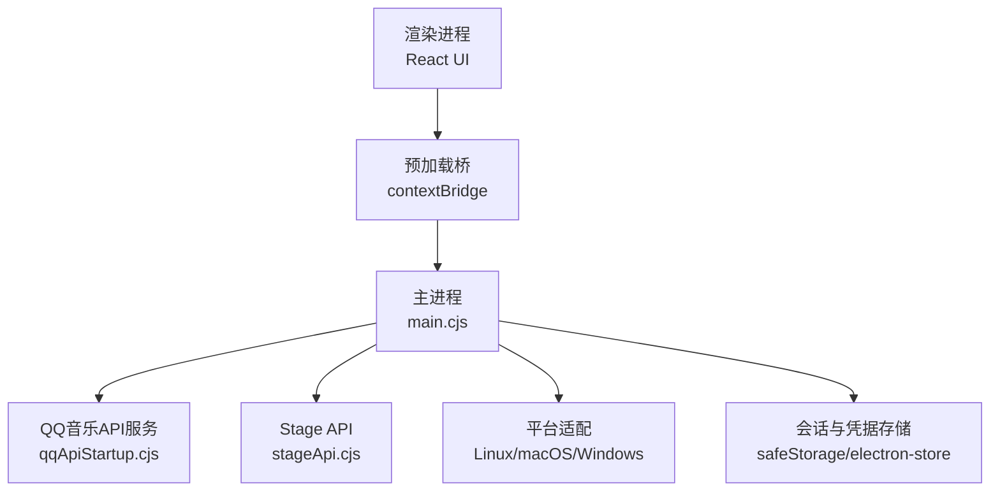
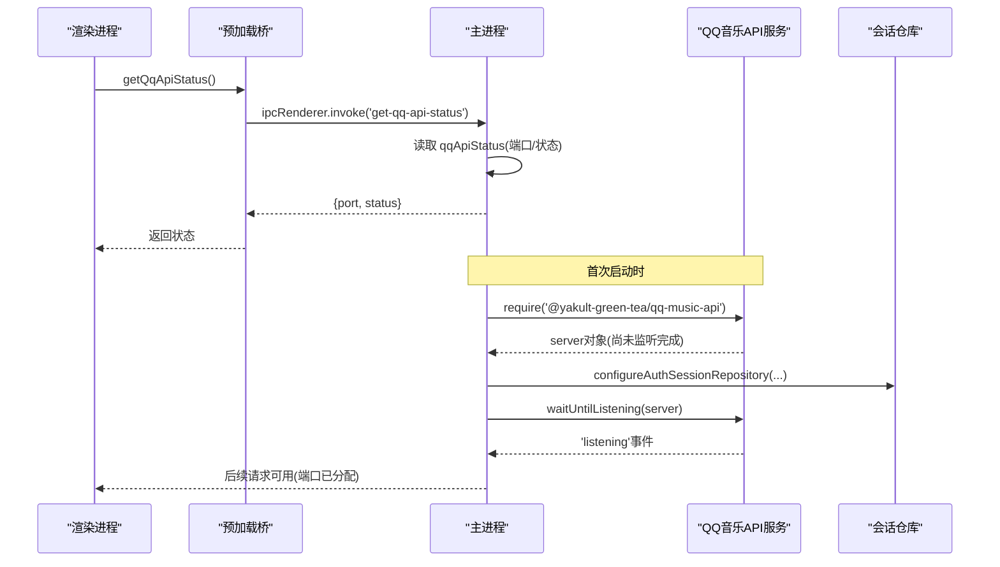
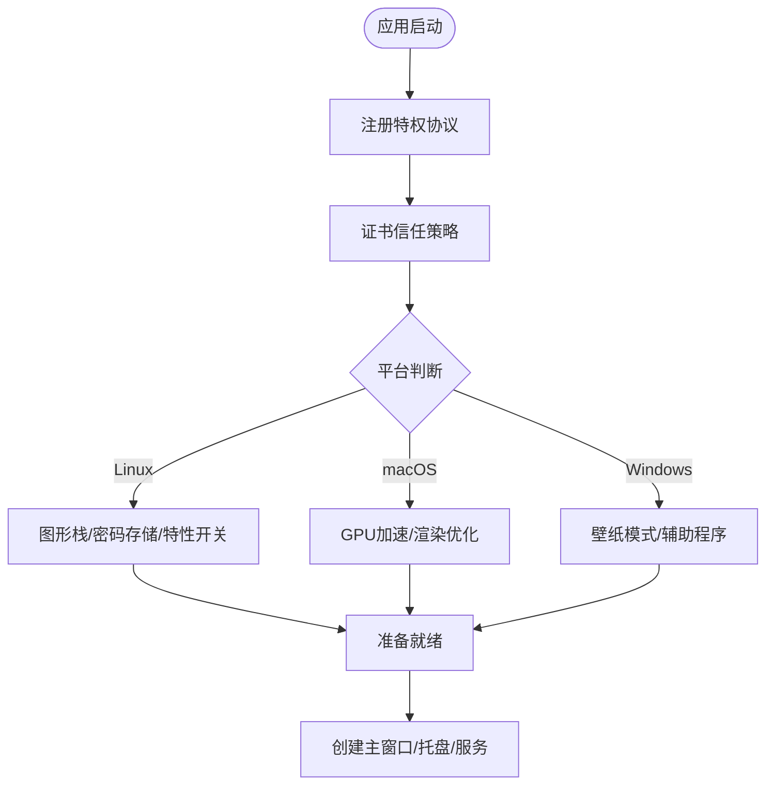
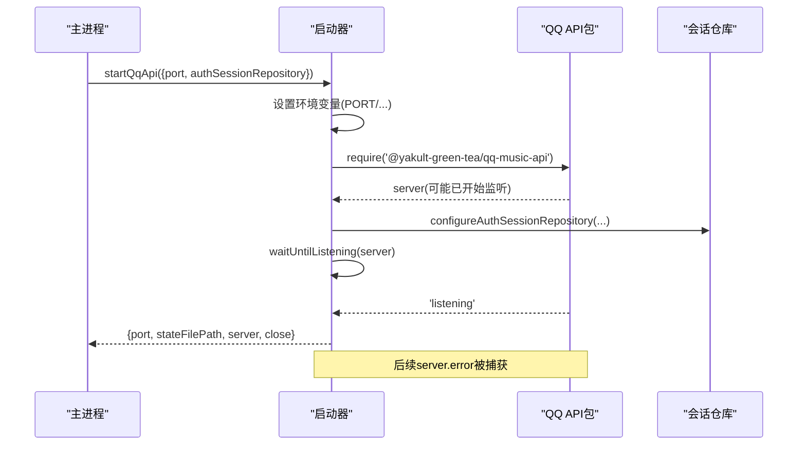
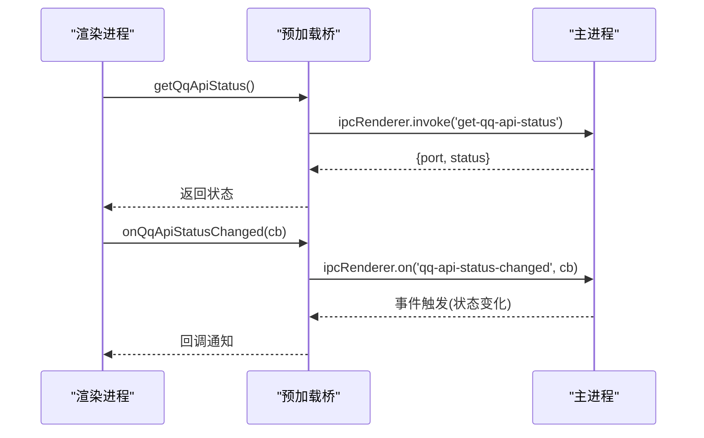
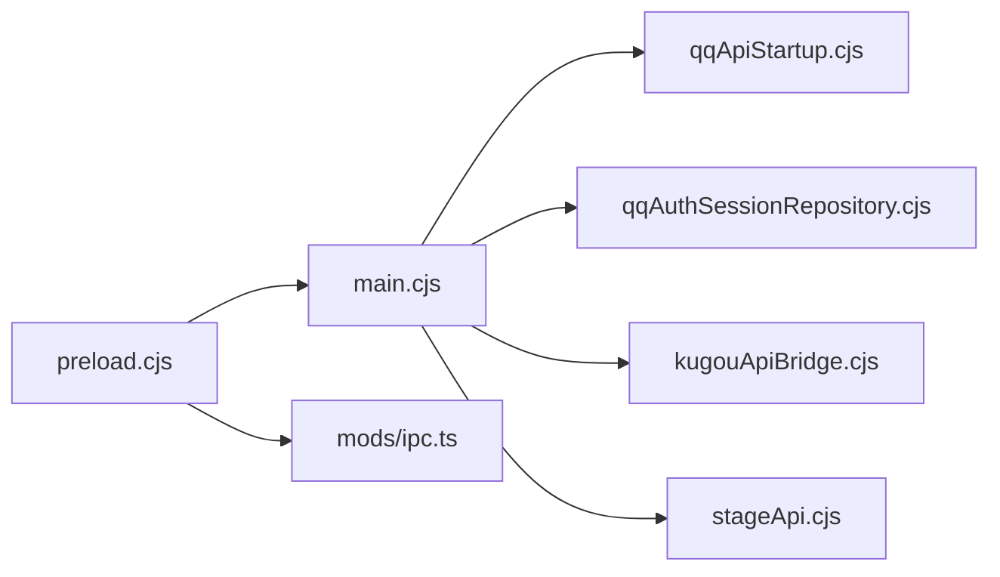

# Electron集成

<cite>
**本文引用的文件**
- [electron/main.cjs](file://electron/main.cjs)
- [electron/preload.cjs](file://electron/preload.cjs)
- [electron/qqApiStartup.cjs](file://electron/qqApiStartup.cjs)
- [electron/qqAuthSessionRepository.cjs](file://electron/qqAuthSessionRepository.cjs)
- [electron/kugouApiBridge.cjs](file://electron/kugouApiBridge.cjs)
- [electron/stageApi.cjs](file://electron/stageApi.cjs)
- [src/mods/ipc.ts](file://src/mods/ipc.ts)
</cite>

## 目录
1. [简介](#简介)
2. [项目结构](#项目结构)
3. [核心组件](#核心组件)
4. [架构总览](#架构总览)
5. [详细组件分析](#详细组件分析)
6. [依赖关系分析](#依赖关系分析)
7. [性能考量](#性能考量)
8. [故障排查指南](#故障排查指南)
9. [结论](#结论)
10. [附录](#附录)

## 简介
本文件聚焦于 QQ音乐在 Electron 环境中的集成实现，覆盖主进程启动与配置、IPC 通信机制、原生能力调用、QQ音乐 API 服务的启动流程（初始化、端口配置、健康检查）、渲染进程通信协议（消息格式、错误处理、性能监控），以及 Windows/macOS/Linux 的平台差异化适配与兼容性策略。文档以仓库实际代码为依据，提供可视化图表与可追溯的源码定位。

## 项目结构
Electron 应用采用“主进程 + 预加载桥 + 渲染进程”的分层架构：
- 主进程负责应用生命周期管理、窗口与系统能力、本地服务（如 QQ 音乐 API、Stage API）启动、IPC 路由与平台适配。
- 预加载脚本通过 contextBridge 暴露安全的最小化 API 给渲染进程。
- 渲染进程通过统一的 IPC 通道调用主进程能力，并订阅状态变更事件。

图示来源
- [electron/main.cjs:1-120](file://electron/main.cjs#L1-L120)
- [electron/preload.cjs:1-120](file://electron/preload.cjs#L1-L120)
- [electron/qqApiStartup.cjs:60-158](file://electron/qqApiStartup.cjs#L60-L158)
- [electron/stageApi.cjs:169-225](file://electron/stageApi.cjs#L169-L225)

章节来源
- [electron/main.cjs:1-120](file://electron/main.cjs#L1-L120)
- [electron/preload.cjs:1-120](file://electron/preload.cjs#L1-L120)

## 核心组件
- 主进程入口与全局初始化：注册自定义协议、证书信任、平台开关、单实例锁、壁纸模式、托盘菜单、更新检查等。
- QQ音乐 API 启动器：在 Electron 主进程中动态加载 @yakult-green-tea/qq-music-api，设置环境变量与认证会话持久化，等待监听成功后暴露端口与健康状态。
- 认证会话仓库：使用 safeStorage 加密保存 QQ 服务端凭据，避免明文落盘；支持 Linux basic_text 降级拒绝。
- 酷狗 API 桥：封装设备标识、Cookie 持久化、登录态维护与操作转发，屏蔽敏感字段到渲染端。
- Stage API：提供本地 HTTP+WebSocket 接口，用于外部工具推送歌词/媒体会话或控制播放队列。
- 预加载桥：将主进程能力以最小权限暴露给渲染进程，包括 QQ/网易云 API 状态查询、端口获取、状态变更事件订阅等。
- 插件系统 IPC：统一封装 mods 相关 IPC，保证非 Electron 环境下降级为安全空实现。

章节来源
- [electron/main.cjs:1-120](file://electron/main.cjs#L1-L120)
- [electron/qqApiStartup.cjs:60-158](file://electron/qqApiStartup.cjs#L60-L158)
- [electron/qqAuthSessionRepository.cjs:1-84](file://electron/qqAuthSessionRepository.cjs#L1-L84)
- [electron/kugouApiBridge.cjs:156-307](file://electron/kugouApiBridge.cjs#L156-L307)
- [electron/stageApi.cjs:169-225](file://electron/stageApi.cjs#L169-L225)
- [electron/preload.cjs:100-170](file://electron/preload.cjs#L100-L170)
- [src/mods/ipc.ts:1-119](file://src/mods/ipc.ts#L1-L119)

## 架构总览
下图展示从渲染进程发起 QQ 音乐 API 状态查询到主进程返回结果的全链路交互，以及 QQ 服务启动的生命周期。

图示来源
- [electron/preload.cjs:128-134](file://electron/preload.cjs#L128-L134)
- [electron/main.cjs:4690-4693](file://electron/main.cjs#L4690-L4693)
- [electron/qqApiStartup.cjs:67-158](file://electron/qqApiStartup.cjs#L67-L158)
- [electron/qqAuthSessionRepository.cjs:28-77](file://electron/qqAuthSessionRepository.cjs#L28-L77)

## 详细组件分析

### 主进程启动与平台适配
- 自定义协议注册与证书信任：为封面资源与模块协议注册特权，针对特定 CDN 域名放宽证书校验。
- Linux 图形栈兼容：根据运行环境与 AppImage 情况选择软件渲染、SwiftShader 或 Wayland 装饰特性。
- macOS GPU 优化：x64 架构下启用忽略 GPU 黑名单、ANGLE GL、GPU 光栅化。
- 壁纸模式与窗口层级：Wayland/X11 通过子进程包装进入桌面层；Windows 通过 helper 将窗口父级设置为 WorkerW，并提供鼠标输入注入与透明性重建。
- 单实例与多窗口：单实例锁、远程遥控窗口、视频导出窗口、主窗口状态持久化与防休眠。

图示来源
- [electron/main.cjs:38-105](file://electron/main.cjs#L38-L105)
- [electron/main.cjs:128-137](file://electron/main.cjs#L128-L137)
- [electron/main.cjs:145-226](file://electron/main.cjs#L145-L226)
- [electron/main.cjs:242-311](file://electron/main.cjs#L242-L311)

章节来源
- [electron/main.cjs:38-137](file://electron/main.cjs#L38-L137)
- [electron/main.cjs:145-311](file://electron/main.cjs#L145-L311)

### QQ音乐 API 服务启动流程
- 环境变量隔离：临时设置 PORT、NODE_ENV、AUTO_OPEN_EXPLORER、QQ_AUTH_STATE_PATH、QQ_DISABLE_UPDATE_CHECK，并在 finally 中恢复，避免污染主进程环境。
- 模块加载与会话注入：require 后可能立即开始监听；在同步栈中注入认证会话仓库，确保首次状态探测前凭据已解密可用。
- 监听等待与错误处理：通过监听 'listening' 与 'error' 事件，区分打包缺失与运行时绑定失败；对后续 socket 错误进行捕获，防止未处理异常导致崩溃。
- 对外暴露：返回端口、状态文件路径、server 实例与关闭方法，供主进程统一管理。

图示来源
- [electron/qqApiStartup.cjs:60-158](file://electron/qqApiStartup.cjs#L60-L158)
- [electron/qqAuthSessionRepository.cjs:28-77](file://electron/qqAuthSessionRepository.cjs#L28-L77)

章节来源
- [electron/qqApiStartup.cjs:60-158](file://electron/qqApiStartup.cjs#L60-L158)
- [electron/qqAuthSessionRepository.cjs:1-84](file://electron/qqAuthSessionRepository.cjs#L1-L84)

### 渲染进程与主进程的 IPC 通信协议
- 消息类型：
  - 查询类：get-qq-port、get-qq-api-status、get-netease-port、get-netease-api-status、kugou-api-status、kugou-api-request。
  - 控制类：window-*（最小化/最大化/全屏/关闭/透明模式/置顶/点击穿透）、app-quit、updates-*、lyric-api-*、obs-browser-source-*、stage-*、whisper-align-*、mods:*。
  - 事件订阅：qq-api-status-changed、netease-api-status-changed、wallpaper-mode-changed、update-status-changed、remote-control-*、stage-session-*、voice-input-state-changed 等。
- 消息格式：
  - invoke/handle 请求通常携带参数列表，返回 Promise 结果。
  - on* 订阅通过 ipcRenderer.on 接收事件，回调函数接收负载数据。
- 错误处理：
  - 主进程对非法来源进行可信校验（isTrustedMainWindowContents/isTrustedRemoteControlContents）。
  - 服务不可用或端口未就绪时返回 null/默认值，渲染侧需做降级处理。
- 性能监控：
  - debugGetState/debugSetState/debugOpenLogs、debugReportRendererMemory、onDebugMemorySample 等用于调试与内存采样。
  - 自动混音模型下载进度、Whisper 对齐进度等通过专用事件上报。

图示来源
- [electron/preload.cjs:128-134](file://electron/preload.cjs#L128-L134)
- [electron/main.cjs:4690-4693](file://electron/main.cjs#L4690-L4693)

章节来源
- [electron/preload.cjs:100-170](file://electron/preload.cjs#L100-L170)
- [electron/main.cjs:4680-4879](file://electron/main.cjs#L4680-L4879)

### 原生功能调用与平台差异
- 音频与缓存：
  - 音频缓存与封面缓存读写、用量统计与清理，通过 IPC 暴露给渲染进程。
- 显示与电源：
  - 播放期间阻止屏幕休眠、语音输入暂停检测、任务栏缩略按钮更新。
- 窗口与系统：
  - 透明背景、置顶、点击穿透、全屏切换、最小化到托盘、退出应用。
- 平台特定：
  - Linux：密码存储后端选择、禁用 Vulkan、Ozone 平台提示、AppImage 下的 SwiftShader。
  - macOS：x64 架构 GPU 优化、忽略 GPU 黑名单、启用 ANGLE GL。
  - Windows：壁纸模式通过 helper 进程、鼠标输入注入、WorkerW 父子关系重建、透明性重建。

章节来源
- [electron/main.cjs:78-105](file://electron/main.cjs#L78-L105)
- [electron/main.cjs:128-137](file://electron/main.cjs#L128-L137)
- [electron/main.cjs:145-311](file://electron/main.cjs#L145-L311)
- [electron/preload.cjs:85-170](file://electron/preload.cjs#L85-L170)

### 插件系统与扩展点
- 插件系统通过 modSystem 暴露能力，预加载桥暴露 mods.* 系列 IPC。
- 渲染侧通过 src/mods/ipc.ts 统一封装，非 Electron 环境安全降级为空实现。
- 支持列出插件、启用/禁用、重载、执行命令、导出进度、FFmpeg 状态、安装 ZIP 插件、打开插件目录等。

章节来源
- [electron/preload.cjs:293-318](file://electron/preload.cjs#L293-L318)
- [src/mods/ipc.ts:1-119](file://src/mods/ipc.ts#L1-L119)

## 依赖关系分析
- 主进程依赖：
  - electron 内置模块（app、BrowserWindow、ipcMain、session、screen、dialog、shell、nativeImage、desktopCapturer、Menu、Tray、nativeTheme、powerSaveBlocker、safeStorage、protocol、net）。
  - 文件系统与网络（fs、http、path、child_process、crypto）。
  - 内部模块：stageApi、modSystem、windowPlaybackHandoff、wallpaperWatchdog、windowsWallpaperController、kugouApiBridge、qqAuthSessionRepository、discordPresence、voiceInputPause、displaySleepBlocker、lyricApi、localCoverAssets、updateChannels、audioCachePrune、analysis/host、debug/debugHost、analysis/modelStore、linuxPasswordStore、themeSanitizer、whisperAlign。
- QQ 音乐 API 启动器依赖：
  - 动态 require 的 qq-music-api 包，以及 safeStorage 与 electron-store。
- 预加载桥依赖：
  - contextBridge、ipcRenderer、webUtils。

图示来源
- [electron/main.cjs:1-29](file://electron/main.cjs#L1-L29)
- [electron/qqApiStartup.cjs:6-7](file://electron/qqApiStartup.cjs#L6-L7)
- [electron/preload.cjs:1-3](file://electron/preload.cjs#L1-L3)
- [src/mods/ipc.ts:1-15](file://src/mods/ipc.ts#L1-L15)

章节来源
- [electron/main.cjs:1-29](file://electron/main.cjs#L1-L29)
- [electron/qqApiStartup.cjs:1-10](file://electron/qqApiStartup.cjs#L1-L10)
- [electron/preload.cjs:1-10](file://electron/preload.cjs#L1-L10)
- [src/mods/ipc.ts:1-15](file://src/mods/ipc.ts#L1-L15)

## 性能考量
- 启动阶段：
  - QQ 音乐 API 启动使用指数退避重试与抖动，避免瞬时失败导致启动阻塞。
  - 仅当真正监听成功才报告“运行中”，避免假阳性状态。
- 运行时：
  - 自动混音模型下载与 Whisper 对齐进度通过事件上报，避免频繁轮询。
  - 音频与封面缓存提供用量统计与清理接口，防止磁盘膨胀。
  - Linux/macOS/Windows 分别启用合适的图形栈与 GPU 选项，减少卡顿与崩溃。
- 资源释放：
  - 视频采集服务空闲回收（ReleaseVideoSourceProviderIfNotInUse），避免残留进程与隐私指示器。
  - 壁纸模式下的 helper 进程心跳与崩溃循环保护，失败自动降级。

[本节为通用指导，不直接分析具体文件]

## 故障排查指南
- QQ 音乐 API 无法启动：
  - 检查端口是否冲突、模块是否安装、环境变量是否正确设置。
  - 查看主进程日志中的 '[QQ API] server error' 输出。
- 认证会话丢失或无效：
  - 确认 safeStorage 可用且未选择 basic_text 后端；Linux 上若不可用会拒绝写入。
  - 检查 electron-store 中对应键是否存在且格式正确。
- 渲染进程无法获取状态：
  - 确认预加载桥已暴露对应方法，主进程已注册相应 ipcMain.handle。
  - 关注状态变更事件是否触发，必要时重新订阅。
- 平台相关问题：
  - Linux：检查图形模式与环境变量（WAYLAND_DISPLAY、APPIMAGE），必要时切换到软件渲染。
  - macOS：确认 x64 架构下 GPU 优化开关生效。
  - Windows：检查壁纸 helper 是否存在、是否成功 attach，必要时重建窗口。

章节来源
- [electron/qqApiStartup.cjs:147-150](file://electron/qqApiStartup.cjs#L147-L150)
- [electron/qqAuthSessionRepository.cjs:10-26](file://electron/qqAuthSessionRepository.cjs#L10-L26)
- [electron/main.cjs:4680-4879](file://electron/main.cjs#L4680-L4879)
- [electron/main.cjs:78-105](file://electron/main.cjs#L78-L105)
- [electron/main.cjs:128-137](file://electron/main.cjs#L128-L137)
- [electron/main.cjs:145-311](file://electron/main.cjs#L145-L311)

## 结论
本项目在 Electron 中实现了稳健的 QQ 音乐 API 集成：通过主进程启动器隔离环境变量、注入认证会话、等待监听成功并暴露端口与健康状态；通过预加载桥向渲染进程提供最小化、安全的 IPC 接口；结合平台特定的图形栈与窗口层级适配，保障跨平台体验。同时，完善的错误处理、状态事件与性能监控机制，使应用具备高可用性与可观测性。

[本节为总结，不直接分析具体文件]

## 附录
- 关键 IPC 通道速查：
  - QQ 音乐：get-qq-port、get-qq-api-status、qq-api-status-changed。
  - 网易云：get-netease-port、get-netease-api-status、netease-api-status-changed。
  - 窗口控制：window-minimize、window-toggle-maximize、window-toggle-fullscreen、window-close、window-get/set-transparent-mode、window-get/set-click-through、window-get/set-always-on-top。
  - 更新：updates-get-status、updates-check、updates-mark-seen、updates-open-release-page、updates-download、updates-quit-and-install、update-status-changed。
  - 歌词：lyric-api-get-status、lyric-api-set-enabled、lyric-api-publish、lyric-api-status-changed。
  - OBS：obs-browser-source-get-status、obs-browser-source-set-enabled、obs-browser-source-regenerate-token、obs-browser-source-publish-config/clock/audio、obs-browser-source-status-changed。
  - 舞台：stage-get-status、stage-set-enabled、stage-regenerate-token、stage-clear-state、stage-publish-player-snapshot、stage-complete-external-play/player-control/player-queue、stage-session-updated/cleared、stage-external-play-request/player-control-request/player-queue-request。
  - 插件：folia-mods:list、set-enabled、reload、invoke、export-cancel、push-runtime-snapshot、ffmpeg-status、open-directory、install-zip、state-changed、export-progress、log。
  - Whisper：whisper-align-get-status、get-models、download-model、transcribe、cancel、prepare-audio、install-cli、install-ffmpeg、fetch-audio、progress、download-progress、install-progress、install-ffmpeg-progress。

[本节为参考信息，不直接分析具体文件]