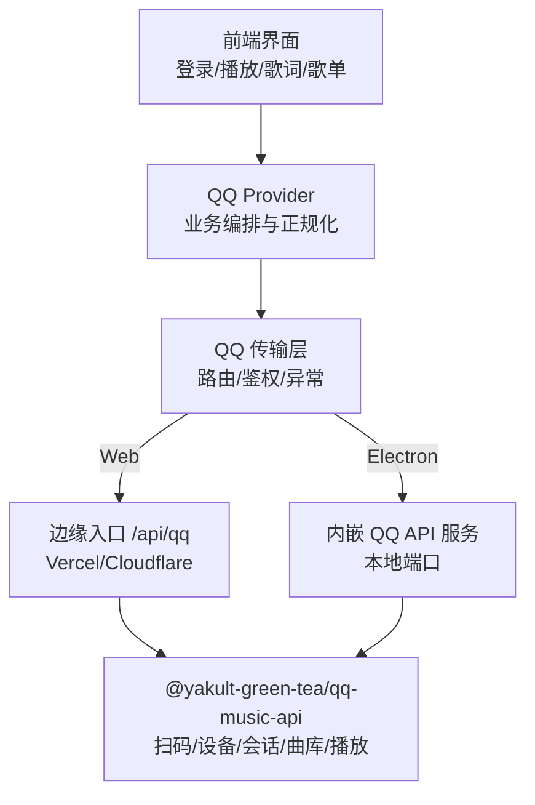
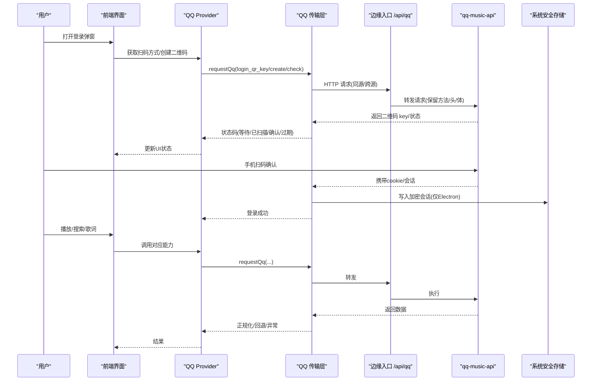
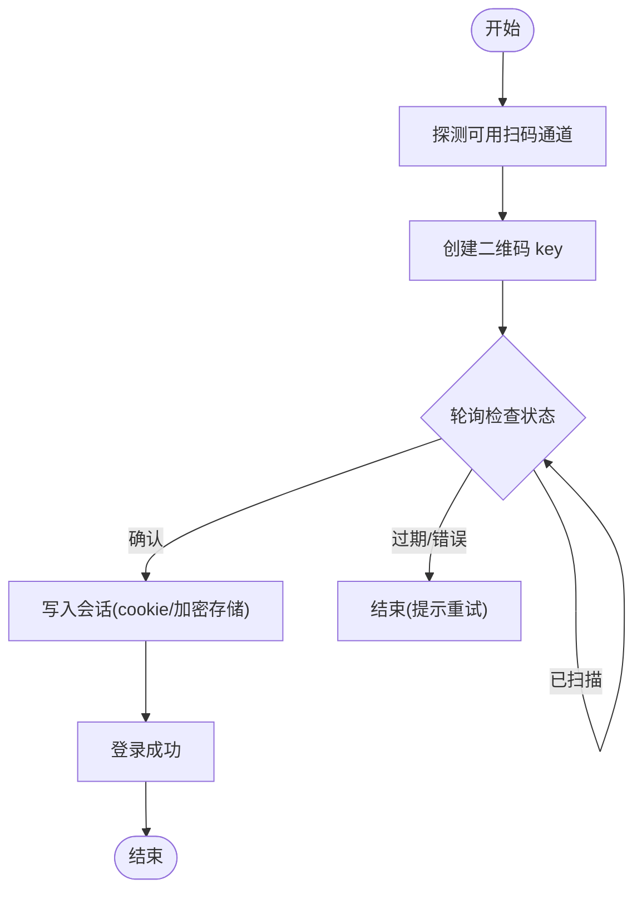
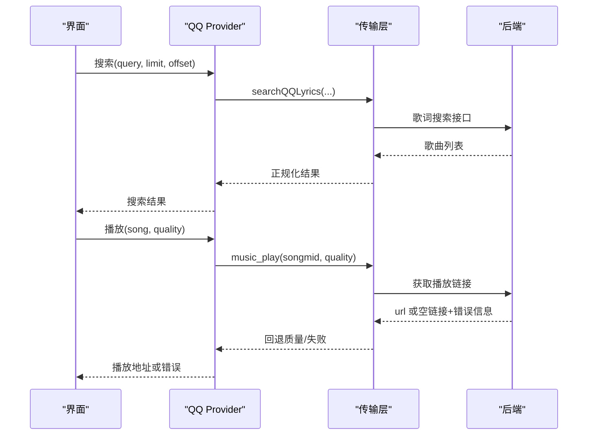
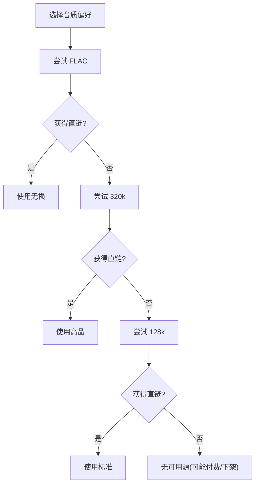
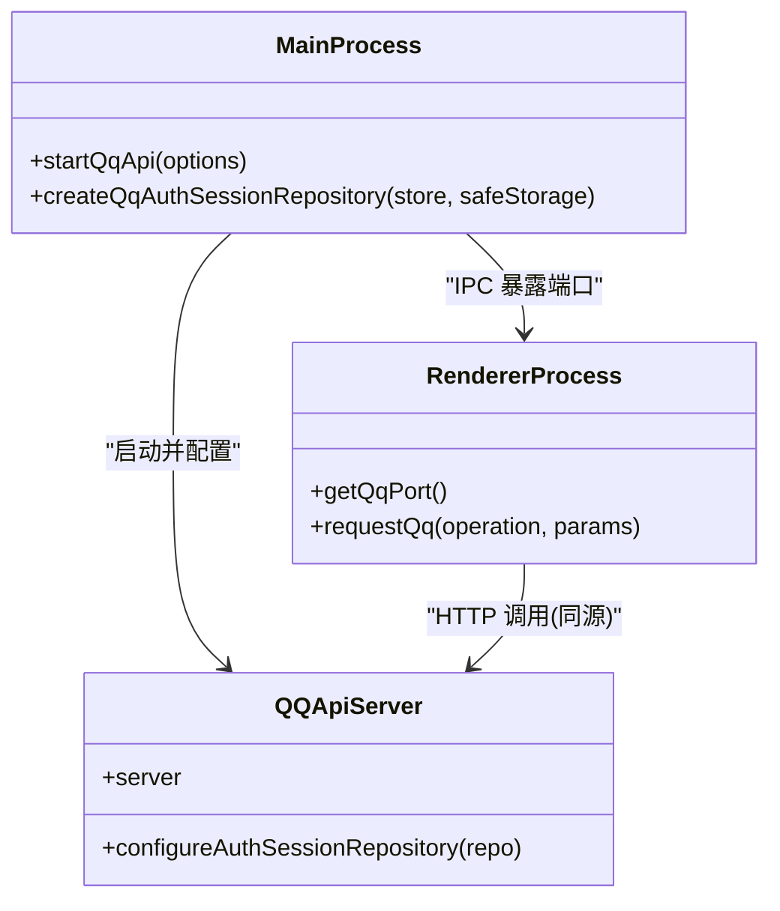
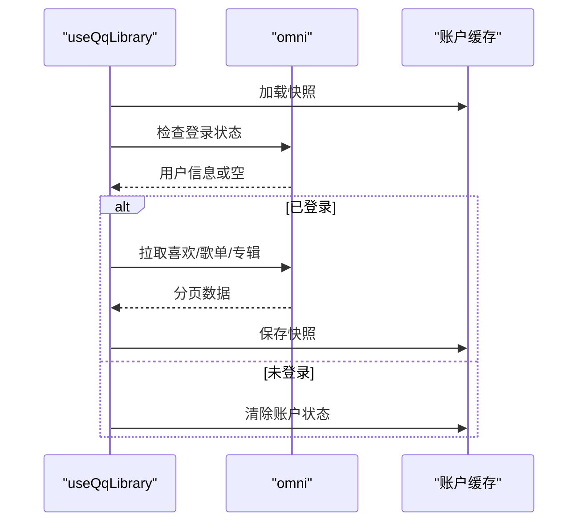
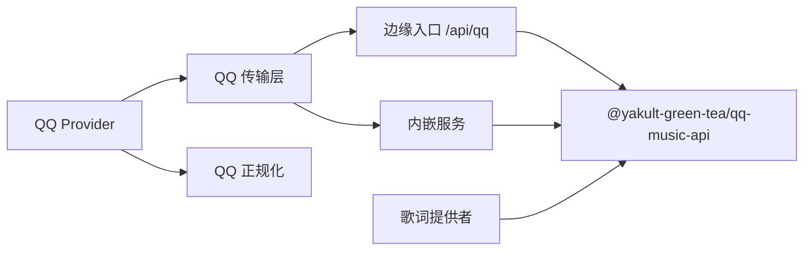

# QQ音乐集成

<cite>
**本文引用的文件**
- [api/qq.js](file://api/qq.js)
- [api-ts/qq.ts](file://api-ts/qq.ts)
- [electron/qqApiStartup.cjs](file://electron/qqApiStartup.cjs)
- [electron/qqAuthSessionRepository.cjs](file://electron/qqAuthSessionRepository.cjs)
- [src/services/onlineMusic/qqProvider.ts](file://src/services/onlineMusic/qqProvider.ts)
- [src/services/onlineMusic/qqTransport.ts](file://src/services/onlineMusic/qqTransport.ts)
- [src/hooks/useQqLibrary.ts](file://src/hooks/useQqLibrary.ts)
- [src/hooks/useOnlineProviderQrLogin.ts](file://src/hooks/useOnlineProviderQrLogin.ts)
- [src/services/onlineMusic/qqNormalize.ts](file://src/services/onlineMusic/qqNormalize.ts)
- [src/utils/lyrics/providers/qqLyricProvider.ts](file://src/utils/lyrics/providers/qqLyricProvider.ts)
- [electron/main.cjs](file://electron/main.cjs)
- [docs/qq-music-deployment.md](file://docs/qq-music-deployment.md)
</cite>

## 目录
1. [简介](#简介)
2. [项目结构](#项目结构)
3. [核心组件](#核心组件)
4. [架构总览](#架构总览)
5. [详细组件分析](#详细组件分析)
6. [依赖关系分析](#依赖关系分析)
7. [性能考虑](#性能考虑)
8. [故障排查指南](#故障排查指南)
9. [结论](#结论)
10. [附录](#附录)

## 简介
本技术文档系统性梳理 Folia 对 QQ 音乐的集成方案，覆盖认证流程（扫码登录、设备授权、会话管理）、API 封装（搜索、播放、歌词获取、MV 观看等）、数字专辑与付费歌曲处理、Electron 主进程通信机制、错误处理策略以及性能优化建议。文档面向具备不同技术背景的读者，既提供高层架构图，也给出代码级流程图与类图，便于快速定位问题与扩展功能。

## 项目结构
QQ 音乐相关能力由“前端 Provider + 传输层 + 后端服务”三部分构成：
- 前端 Provider：统一对外暴露 QQ 音乐能力（搜索、播放、歌词、用户库、收藏、专辑、歌手等），并负责数据正规化与业务编排。
- 传输层：抽象请求路由、鉴权头/查询串注入、同源/跨源差异处理、上游状态码解析与异常转换。
- 后端服务：Electron 内嵌或 Web 部署的 qq-music-api，承载扫码登录、设备授权与会话持久化；Vercel/Cloudflare 通过扁平入口转发到 Edge Runtime。

图表来源
- [api/qq.js:1-31](file://api/qq.js#L1-L31)
- [api-ts/qq.ts:1-38](file://api-ts/qq.ts#L1-L38)
- [electron/qqApiStartup.cjs:67-158](file://electron/qqApiStartup.cjs#L67-L158)
- [src/services/onlineMusic/qqProvider.ts:593-664](file://src/services/onlineMusic/qqProvider.ts#L593-L664)
- [src/services/onlineMusic/qqTransport.ts:16-37](file://src/services/onlineMusic/qqTransport.ts#L16-L37)

章节来源
- [api/qq.js:1-31](file://api/qq.js#L1-L31)
- [api-ts/qq.ts:1-38](file://api-ts/qq.ts#L1-L38)
- [electron/qqApiStartup.cjs:67-158](file://electron/qqApiStartup.cjs#L67-L158)
- [src/services/onlineMusic/qqProvider.ts:593-664](file://src/services/onlineMusic/qqProvider.ts#L593-L664)
- [src/services/onlineMusic/qqTransport.ts:16-37](file://src/services/onlineMusic/qqTransport.ts#L16-L37)

## 核心组件
- QQ Provider：聚合搜索、播放、歌词、用户库、专辑/歌手等能力，负责质量回退、去重、正规化与可用性探测。
- QQ 传输层：维护操作名到路径映射、同源/跨源鉴权策略、上游拒绝码识别、会话持久化与清理。
- Electron 启动器：在 Electron 主进程中启动内嵌 qq-music-api，安全注入环境变量，等待监听并捕获端口。
- 会话仓库：使用 Electron safeStorage 加密保存服务端凭据（musickey、refresh_key、设备上下文），渲染端仅持有不透明 cookie/token。
- 歌词提供者：通过 u.y.qq.com 代理或直接访问，解密 QRC 歌词，支持逐字歌词与合唱效果。
- 部署入口：Vercel/Cloudflare 扁平入口将 path 重写为后端路径，透传方法与头部，保证 Edge Runtime 零 node 依赖。

章节来源
- [src/services/onlineMusic/qqProvider.ts:28-222](file://src/services/onlineMusic/qqProvider.ts#L28-L222)
- [src/services/onlineMusic/qqTransport.ts:16-245](file://src/services/onlineMusic/qqTransport.ts#L16-L245)
- [electron/qqApiStartup.cjs:67-158](file://electron/qqApiStartup.cjs#L67-L158)
- [electron/qqAuthSessionRepository.cjs:28-77](file://electron/qqAuthSessionRepository.cjs#L28-L77)
- [src/utils/lyrics/providers/qqLyricProvider.ts:21-66](file://src/utils/lyrics/providers/qqLyricProvider.ts#L21-L66)
- [api/qq.js:1-31](file://api/qq.js#L1-L31)
- [api-ts/qq.ts:1-38](file://api-ts/qq.ts#L1-L38)

## 架构总览
下图展示从前端到后端的完整调用链，包括扫码登录、播放、歌词获取与用户库同步。

图表来源
- [src/hooks/useOnlineProviderQrLogin.ts:77-159](file://src/hooks/useOnlineProviderQrLogin.ts#L77-L159)
- [src/services/onlineMusic/qqProvider.ts:278-388](file://src/services/onlineMusic/qqProvider.ts#L278-L388)
- [src/services/onlineMusic/qqTransport.ts:153-245](file://src/services/onlineMusic/qqTransport.ts#L153-L245)
- [electron/qqAuthSessionRepository.cjs:35-77](file://electron/qqAuthSessionRepository.cjs#L35-L77)
- [api/qq.js:16-30](file://api/qq.js#L16-L30)

## 详细组件分析

### 认证流程：扫码登录、设备授权与会话管理
- 扫码登录通道发现：Provider 会探测后端声明的通道集合，兼容旧后端回退到硬编码数组。
- 二维码生命周期：前端根据 TTL 控制轮询与超时，避免死码；确认后持久化不透明 cookie。
- 会话管理：
  - Web：cookie 作为不透明令牌，同源时以自定义头传递，跨源时以 query 参数传递。
  - Electron：使用 safeStorage 加密保存服务端凭据，渲染端永不接触明文。
- 登录态校验：通过 login_status 判断是否已登录，未登录或 401 则清理会话并提示重新登录。

图表来源
- [src/services/onlineMusic/qqProvider.ts:297-388](file://src/services/onlineMusic/qqProvider.ts#L297-L388)
- [src/services/onlineMusic/qqTransport.ts:85-109](file://src/services/onlineMusic/qqTransport.ts#L85-L109)
- [electron/qqAuthSessionRepository.cjs:28-77](file://electron/qqAuthSessionRepository.cjs#L28-L77)

章节来源
- [src/services/onlineMusic/qqProvider.ts:278-388](file://src/services/onlineMusic/qqProvider.ts#L278-L388)
- [src/services/onlineMusic/qqTransport.ts:85-109](file://src/services/onlineMusic/qqTransport.ts#L85-L109)
- [electron/qqAuthSessionRepository.cjs:28-77](file://electron/qqAuthSessionRepository.cjs#L28-L77)
- [src/hooks/useOnlineProviderQrLogin.ts:77-159](file://src/hooks/useOnlineProviderQrLogin.ts#L77-L159)

### API 封装：搜索、播放、歌词、MV 观看
- 搜索：复用歌词搜索接口，返回标准化歌曲条目，支持分页与下一页偏移。
- 播放：按质量偏好尝试 flac/320/128 回退；当上游返回空链接但 200 时，标记为上游拒绝（会员/地区下架）。
- 歌词：通过 u.y.qq.com 获取 QRC/翻译/罗马音，解密后解析为时间轴歌词，支持逐字歌词与合唱效果。
- MV 观看：当前 Provider 未直接暴露 MV 播放能力；如需可基于现有 transport 扩展新操作名与页面跳转逻辑。

图表来源
- [src/services/onlineMusic/qqProvider.ts:28-33](file://src/services/onlineMusic/qqProvider.ts#L28-L33)
- [src/services/onlineMusic/qqProvider.ts:171-222](file://src/services/onlineMusic/qqProvider.ts#L171-L222)
- [src/utils/lyrics/providers/qqLyricProvider.ts:93-147](file://src/utils/lyrics/providers/qqLyricProvider.ts#L93-L147)
- [src/utils/lyrics/providers/qqLyricProvider.ts:152-212](file://src/utils/lyrics/providers/qqLyricProvider.ts#L152-L212)

章节来源
- [src/services/onlineMusic/qqProvider.ts:28-222](file://src/services/onlineMusic/qqProvider.ts#L28-L222)
- [src/utils/lyrics/providers/qqLyricProvider.ts:93-212](file://src/utils/lyrics/providers/qqLyricProvider.ts#L93-L212)

### 数字专辑、付费歌曲与无损音质处理
- 数字专辑：专辑详情与曲目通过 album_info 一次性返回，Provider 进行本地切片与正规化，支持专辑封面与发布时间解析。
- 付费歌曲：当上游拒绝播放（会员/地区/下架）时，transport 层仍返回 200 但无 url；Provider 记录 upstreamRefusedPlayLink 并降级或提示不可用。
- 无损音质：quality 偏好映射到 flac/320/128，按顺序尝试直至获得有效直链；若均失败则返回 null 并记录日志。

图表来源
- [src/services/onlineMusic/qqProvider.ts:35-55](file://src/services/onlineMusic/qqProvider.ts#L35-L55)
- [src/services/onlineMusic/qqProvider.ts:171-222](file://src/services/onlineMusic/qqProvider.ts#L171-L222)

章节来源
- [src/services/onlineMusic/qqProvider.ts:35-55](file://src/services/onlineMusic/qqProvider.ts#L35-L55)
- [src/services/onlineMusic/qqProvider.ts:171-222](file://src/services/onlineMusic/qqProvider.ts#L171-L222)
- [src/services/onlineMusic/qqNormalize.ts:233-259](file://src/services/onlineMusic/qqNormalize.ts#L233-L259)

### 与 Electron 主进程的通信机制
- 内嵌服务启动：主进程通过 startQqApi 注入端口与环境变量，加载 qq-music-api，等待监听成功后暴露端口给渲染进程。
- 会话持久化：使用 createQqAuthSessionRepository 将敏感凭据加密保存到 electron-store，Linux basic_text 模式被拒绝以保证安全。
- IPC 桥接：渲染进程通过 window.electron.getQqPort 获取内嵌服务端口，构建 http://127.0.0.1:<port> 作为 base URL。

图表来源
- [electron/qqApiStartup.cjs:67-158](file://electron/qqApiStartup.cjs#L67-L158)
- [electron/qqAuthSessionRepository.cjs:28-77](file://electron/qqAuthSessionRepository.cjs#L28-L77)
- [src/services/onlineMusic/qqTransport.ts:53-83](file://src/services/onlineMusic/qqTransport.ts#L53-L83)

章节来源
- [electron/qqApiStartup.cjs:67-158](file://electron/qqApiStartup.cjs#L67-L158)
- [electron/qqAuthSessionRepository.cjs:28-77](file://electron/qqAuthSessionRepository.cjs#L28-L77)
- [src/services/onlineMusic/qqTransport.ts:53-83](file://src/services/onlineMusic/qqTransport.ts#L53-L83)
- [electron/main.cjs:139-143](file://electron/main.cjs#L139-L143)

### 用户库与账号状态同步
- 账号快照：应用启动时加载缓存的用户、歌单与喜欢歌曲 ID，随后刷新真实状态。
- 歌单/专辑/喜欢：分页拉取并合并，遇到上游限制或网络异常时降级显示并记录错误。
- 登出：清理本地账户快照与 Provider 会话，确保 UI 不再残留认证状态。

图表来源
- [src/hooks/useQqLibrary.ts:35-131](file://src/hooks/useQqLibrary.ts#L35-L131)
- [src/hooks/useQqLibrary.ts:133-233](file://src/hooks/useQqLibrary.ts#L133-L233)

章节来源
- [src/hooks/useQqLibrary.ts:35-233](file://src/hooks/useQqLibrary.ts#L35-L233)

## 依赖关系分析
- Provider 依赖传输层与正规化工具，传输层依赖环境配置与存储，Electron 启动器依赖安全存储与 electron-store。
- 边缘入口与内嵌服务共同对接 qq-music-api，前者用于 Web 部署，后者用于桌面体验。
- 歌词模块独立于 Provider，通过代理或直接访问上游，解密后供播放器消费。

图表来源
- [src/services/onlineMusic/qqProvider.ts:593-664](file://src/services/onlineMusic/qqProvider.ts#L593-L664)
- [src/services/onlineMusic/qqTransport.ts:16-37](file://src/services/onlineMusic/qqTransport.ts#L16-L37)
- [api/qq.js:16-30](file://api/qq.js#L16-L30)
- [electron/qqApiStartup.cjs:67-158](file://electron/qqApiStartup.cjs#L67-L158)
- [src/utils/lyrics/providers/qqLyricProvider.ts:21-66](file://src/utils/lyrics/providers/qqLyricProvider.ts#L21-L66)

章节来源
- [src/services/onlineMusic/qqProvider.ts:593-664](file://src/services/onlineMusic/qqProvider.ts#L593-L664)
- [src/services/onlineMusic/qqTransport.ts:16-37](file://src/services/onlineMusic/qqTransport.ts#L16-L37)
- [api/qq.js:16-30](file://api/qq.js#L16-L30)
- [electron/qqApiStartup.cjs:67-158](file://electron/qqApiStartup.cjs#L67-L158)
- [src/utils/lyrics/providers/qqLyricProvider.ts:21-66](file://src/utils/lyrics/providers/qqLyricProvider.ts#L21-L66)

## 性能考虑
- 预加载与缓存：
  - 歌曲详情请求去重：同一 songmid 并发请求合并，减少重复网络开销。
  - 专辑/歌单本地切片：上游一次返回整张专辑或全部歌单，前端按需切片，降低带宽与渲染压力。
  - 歌词缓存：歌词解密与解析结果可在上层缓存，避免重复计算。
- 并发控制：
  - 二维码轮询采用定时器串行调度，避免重叠请求。
  - 用户库拉取设置上限（如 10000 条），防止无限循环。
- 质量回退：
  - 按 flac→320→128 顺序尝试，尽快命中可用直链，提升首播速度。
- 同源优化：
  - 同源部署使用自定义头传递 sealed token，避免 URL 中泄露；跨源使用 cookie 参数，兼容 CORS。

章节来源
- [src/services/onlineMusic/qqProvider.ts:124-136](file://src/services/onlineMusic/qqProvider.ts#L124-L136)
- [src/services/onlineMusic/qqProvider.ts:464-519](file://src/services/onlineMusic/qqProvider.ts#L464-L519)
- [src/services/onlineMusic/qqProvider.ts:171-222](file://src/services/onlineMusic/qqProvider.ts#L171-L222)
- [src/hooks/useOnlineProviderQrLogin.ts:114-149](file://src/hooks/useOnlineProviderQrLogin.ts#L114-L149)
- [src/services/onlineMusic/qqTransport.ts:101-105](file://src/services/onlineMusic/qqTransport.ts#L101-L105)

## 故障排查指南
- 登录失效：
  - 现象：login_status 返回 401 或无 profile。
  - 处理：清理会话并重试登录；检查 VITE_QQ_API_BASE 与 QQ_SESSION_SECRET 配置。
- 版权限制：
  - 现象：music_play 返回空链接但 HTTP 200。
  - 处理：记录 upstreamRefusedPlayLink，提示用户该歌曲可能需要会员或存在地区限制。
- 网络异常：
  - 现象：fetch 非 2xx 或响应体不可读。
  - 处理：抛出 OnlineProviderError(network/invalid-response)，UI 显示重试按钮。
- 平台差异：
  - Vercel 不支持 QQ 扫码（需 WebSocket 长连接），仅支持微信扫码。
  - Cloudflare 需启用 Durable Object 绑定 QQ_QR_CHANNEL 以支持 QQ 扫码。
- 安全存储：
  - Linux basic_text 模式不被允许，需确保系统密钥环可用。

章节来源
- [src/services/onlineMusic/qqTransport.ts:227-245](file://src/services/onlineMusic/qqTransport.ts#L227-L245)
- [src/services/onlineMusic/qqProvider.ts:179-222](file://src/services/onlineMusic/qqProvider.ts#L179-L222)
- [docs/qq-music-deployment.md:286-305](file://docs/qq-music-deployment.md#L286-L305)
- [electron/qqAuthSessionRepository.cjs:10-26](file://electron/qqAuthSessionRepository.cjs#L10-L26)

## 结论
本项目通过 Provider + Transport + 后端服务的分层设计，实现了 QQ 音乐在 Web 与 Electron 下的统一接入。认证流程兼顾多平台能力差异，播放与歌词模块提供健壮的回退与解析能力，用户库同步确保体验一致性。结合预加载、缓存与并发控制，整体性能与稳定性满足日常使用需求。未来可扩展 MV 观看、更多音质层级与更细粒度的权限提示。

## 附录
- 部署参考：详见部署文档，包含 Vercel/Cloudflare/Docker/Node 的配置与排错要点。
- 环境变量：
  - VITE_QQ_API_BASE：前端请求 QQ API 的地址。
  - QQ_SESSION_SECRET：加密 serverless 登录态。
  - QQ_SESSION_SECRET_PREVIOUS：轮换密钥时的临时验证。
- 安全建议：
  - 不记录或分享敏感凭据与完整 URL。
  - 不在前端暴露密钥，不在公开日志中打印敏感信息。

章节来源
- [docs/qq-music-deployment.md:44-62](file://docs/qq-music-deployment.md#L44-L62)
- [docs/qq-music-deployment.md:286-305](file://docs/qq-music-deployment.md#L286-L305)