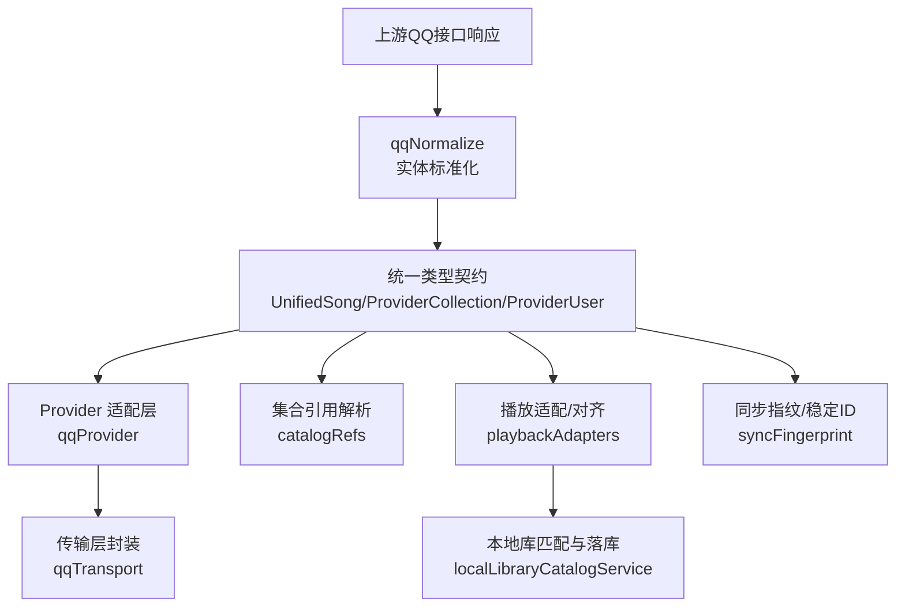
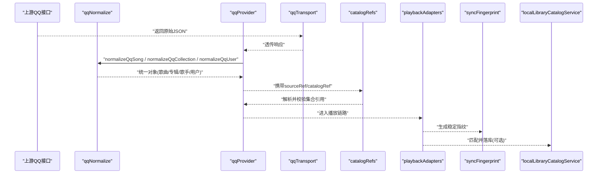
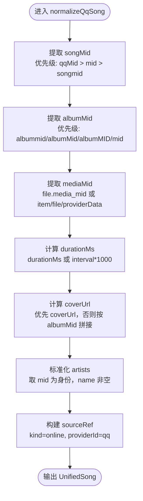
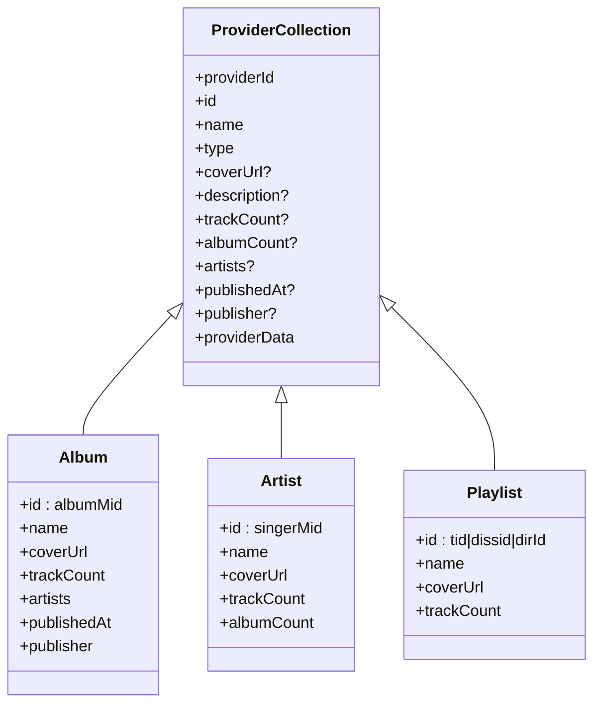
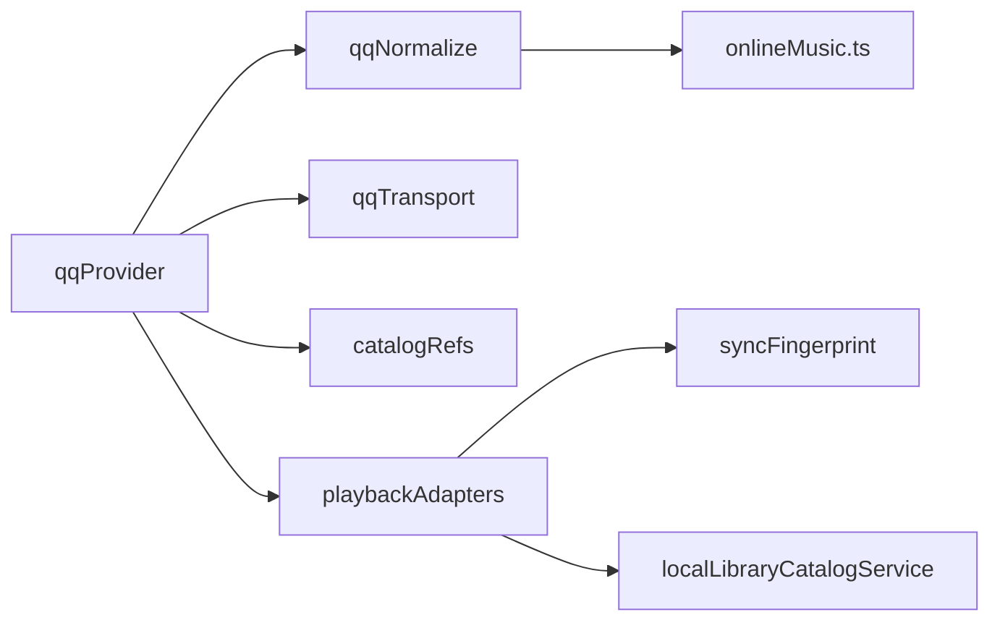

# 数据标准化

<cite>
**本文引用的文件**
- [qqNormalize.ts](file://src/services/onlineMusic/qqNormalize.ts)
- [onlineMusic.ts](file://src/types/onlineMusic.ts)
- [qqProvider.ts](file://src/services/onlineMusic/qqProvider.ts)
- [qqTransport.ts](file://src/services/onlineMusic/qqTransport.ts)
- [catalogRefs.ts](file://src/services/onlineMusic/catalogRefs.ts)
- [playbackAdapters.ts](file://src/services/playbackAdapters.ts)
- [syncFingerprint.ts](file://src/services/sync/syncFingerprint.ts)
- [localLibraryCatalogService.ts](file://src/services/localLibraryCatalogService.ts)
- [coverCache.test.ts](file://test/unit/services/coverCache.test.ts)
- [qqProvider.test.ts](file://test/unit/onlineMusic/qqProvider.test.ts)
</cite>

## 目录
1. [简介](#简介)
2. [项目结构](#项目结构)
3. [核心组件](#核心组件)
4. [架构总览](#架构总览)
5. [详细组件分析](#详细组件分析)
6. [依赖关系分析](#依赖关系分析)
7. [性能考虑](#性能考虑)
8. [故障排查指南](#故障排查指南)
9. [结论](#结论)
10. [附录](#附录)

## 简介
本文件聚焦于QQ音乐数据的标准化处理流程，覆盖歌曲、专辑、歌手、用户等实体的格式转换与字段映射；阐述数据结构一致性保证机制（必填字段验证、可选字段处理、默认值设置）；说明与其他音乐提供商的对齐策略（字段映射表、类型转换函数、兼容性问题处理）；并提供数据质量检查与修复机制（异常数据处理、缺失信息补充、重复数据去重）。

## 项目结构
围绕QQ音乐的标准化，代码主要分布在以下位置：
- 标准化实现：src/services/onlineMusic/qqNormalize.ts
- 统一类型契约：src/types/onlineMusic.ts
- Provider 接入与调用：src/services/onlineMusic/qqProvider.ts
- 传输层与端点映射：src/services/onlineMusic/qqTransport.ts
- 集合引用解析：src/services/onlineMusic/catalogRefs.ts
- 本地/在线元数据对齐：src/services/playbackAdapters.ts
- 指纹与跨源稳定标识：src/services/sync/syncFingerprint.ts
- 本地库匹配与落库：src/services/localLibraryCatalogService.ts
- 缓存与异常降级测试用例：test/unit/services/coverCache.test.ts
- QQ 标准化断言用例：test/unit/onlineMusic/qqProvider.test.ts

**图表来源**
- [qqNormalize.ts:94-192](file://src/services/onlineMusic/qqNormalize.ts#L94-L192)
- [onlineMusic.ts:152-172](file://src/types/onlineMusic.ts#L152-L172)
- [qqProvider.ts:28-62](file://src/services/onlineMusic/qqProvider.ts#L28-L62)
- [qqTransport.ts:29-37](file://src/services/onlineMusic/qqTransport.ts#L29-L37)
- [catalogRefs.ts:68-85](file://src/services/onlineMusic/catalogRefs.ts#L68-L85)
- [playbackAdapters.ts:138-168](file://src/services/playbackAdapters.ts#L138-L168)
- [syncFingerprint.ts:57-77](file://src/services/sync/syncFingerprint.ts#L57-L77)
- [localLibraryCatalogService.ts:42-67](file://src/services/localLibraryCatalogService.ts#L42-L67)

**章节来源**
- [qqNormalize.ts:1-322](file://src/services/onlineMusic/qqNormalize.ts#L1-L322)
- [onlineMusic.ts:1-338](file://src/types/onlineMusic.ts#L1-L338)
- [qqProvider.ts:1-64](file://src/services/onlineMusic/qqProvider.ts#L1-L64)
- [qqTransport.ts:29-56](file://src/services/onlineMusic/qqTransport.ts#L29-L56)
- [catalogRefs.ts:68-85](file://src/services/onlineMusic/catalogRefs.ts#L68-L85)
- [playbackAdapters.ts:138-168](file://src/services/playbackAdapters.ts#L138-L168)
- [syncFingerprint.ts:1-77](file://src/services/sync/syncFingerprint.ts#L1-L77)
- [localLibraryCatalogService.ts:42-67](file://src/services/localLibraryCatalogService.ts#L42-L67)

## 核心组件
- 标准化器（qqNormalize）
  - 将QQ上游原始响应转换为统一的 UnifiedSong、ProviderCollection、ProviderUser。
  - 关键能力：多字段候选选择、空值安全、类型归一、封面URL规范化、时间戳单位统一、集合身份以mid为主键。
- 统一类型契约（onlineMusic.ts）
  - 定义 ProviderCollection、ProviderUser、ProviderCatalogRef、PlaybackSourceRef 等跨模块共享类型，确保各Provider输出一致。
- Provider 适配（qqProvider）
  - 调用标准化器，构造分页结果，维护音质回退策略，提取可播放媒体标识。
- 传输层（qqTransport）
  - 提供端点映射与请求封装，屏蔽上游路径差异。
- 集合引用解析（catalogRefs）
  - 基于 sourceRef 与 catalogRef 进行幂等解析，避免错误导航。
- 播放适配（playbackAdapters）
  - 将本地/在线元数据对齐为统一播放对象，保证UI与播放器消费一致。
- 同步指纹（syncFingerprint）
  - 基于标题、艺人、时长生成稳定指纹，用于主题/歌词等跨设备同步。
- 本地库匹配与落库（localLibraryCatalogService）
  - 将匹配到的在线元数据写入本地数据库，支持保护来源、增量更新。

**章节来源**
- [qqNormalize.ts:94-192](file://src/services/onlineMusic/qqNormalize.ts#L94-L192)
- [onlineMusic.ts:152-172](file://src/types/onlineMusic.ts#L152-L172)
- [qqProvider.ts:28-62](file://src/services/onlineMusic/qqProvider.ts#L28-L62)
- [qqTransport.ts:29-56](file://src/services/onlineMusic/qqTransport.ts#L29-L56)
- [catalogRefs.ts:68-85](file://src/services/onlineMusic/catalogRefs.ts#L68-L85)
- [playbackAdapters.ts:138-168](file://src/services/playbackAdapters.ts#L138-L168)
- [syncFingerprint.ts:57-77](file://src/services/sync/syncFingerprint.ts#L57-L77)
- [localLibraryCatalogService.ts:42-67](file://src/services/localLibraryCatalogService.ts#L42-L67)

## 架构总览
下图展示从上游QQ响应到统一模型，再到下游消费的关键路径。

**图表来源**
- [qqTransport.ts:29-56](file://src/services/onlineMusic/qqTransport.ts#L29-L56)
- [qqProvider.ts:28-62](file://src/services/onlineMusic/qqProvider.ts#L28-L62)
- [qqNormalize.ts:94-192](file://src/services/onlineMusic/qqNormalize.ts#L94-L192)
- [catalogRefs.ts:68-85](file://src/services/onlineMusic/catalogRefs.ts#L68-L85)
- [playbackAdapters.ts:138-168](file://src/services/playbackAdapters.ts#L138-L168)
- [syncFingerprint.ts:57-77](file://src/services/sync/syncFingerprint.ts#L57-L77)
- [localLibraryCatalogService.ts:42-67](file://src/services/localLibraryCatalogService.ts#L42-L67)

## 详细组件分析

### 歌曲标准化（normalizeQqSong）
- 输入：上游 item_song 或已标准化的 SongResult。
- 关键字段映射与规则：
  - 稳定播放标识：优先使用 songMid（来自 qqMid/mid/songmid），同时保留 numeric songId 在 providerData 中。
  - 专辑标识：优先 albumMid（albummid/albumMid/albumMID/mid），再回退数字 id；若存在 catalogRef 则复用。
  - 媒体标识：mediaMid 来自 file.media_mid 或 item.file/mediaMid/providerData。
  - 时长：durationMs 优先，否则 interval*1000，兜底为 0。
  - 封面：coverUrl 优先，否则按 albumMid 拼接标准封面模板。
  - 艺术家：singer/singers/artists 数组，取 mid 作为身份，name 为空时过滤。
  - sourceRef：kind=online, providerId=qq, mediaId=songMid或songId，providerData 包含 songId/songMid/albumMid/mediaMid。
- 一致性保障：
  - 所有文本字段经 text() 清洗；数值经 Number.isFinite 校验；缺失字段不污染输出。
  - 专辑与歌手的 catalogRef 使用 mid 作为稳定键，避免数字 id 导致的页面空白。

**图表来源**
- [qqNormalize.ts:94-153](file://src/services/onlineMusic/qqNormalize.ts#L94-L153)

**章节来源**
- [qqNormalize.ts:94-153](file://src/services/onlineMusic/qqNormalize.ts#L94-L153)
- [qqProvider.test.ts:180-200](file://test/unit/onlineMusic/qqProvider.test.ts#L180-L200)

### 专辑与歌手集合标准化（normalizeQqCollection）
- 类型分流：根据 type 决定走专辑或歌手分支，否则按 playlist 处理。
- 专辑（album）：
  - 身份：albumMid（albumMID/albummid/albumMid/mid），回退已有缓存中的 albumMid。
  - 名称/描述/发行方/发布时间：多字段候选，时间戳兼容日期串与秒级 epoch。
  - 曲目数：total_song_num/totalSongNum/song_num/songNum/songnum/cur_song_num/total/trackCount。
  - 封面：coverUrl/picUrl/albumPic/pic 优先，否则按 albumMid 拼接。
  - 艺术家：singer/singers/artists 或顶层 singerMID/singerName 扁平化。
- 歌手（artist）：
  - 身份：singerMID/singermid/singerMid/mid。
  - 名称/描述/曲目数/专辑数：多字段候选。
  - 封面：coverUrl/singerPic/singerpic/picUrl 优先，否则按 singerMid 拼接。
- 播放列表（playlist）：
  - 身份：tid/dissid/dirId/rawId 的优先级回退。
  - 名称/封面/曲目数：多字段候选。

**图表来源**
- [onlineMusic.ts:152-172](file://src/types/onlineMusic.ts#L152-L172)
- [qqNormalize.ts:232-321](file://src/services/onlineMusic/qqNormalize.ts#L232-L321)

**章节来源**
- [qqNormalize.ts:232-321](file://src/services/onlineMusic/qqNormalize.ts#L232-L321)

### 用户标准化（normalizeQqUser）
- 身份：str_musicid/musicid/uin/id，忽略占位“0”。
- 昵称：nickname/nick/name/userName 多字段候选。
- 头像：avatarUrl 或 info.logo，兼容后端凭据回填字段名。
- 输出：ProviderUser，仅包含必要字段，保持最小化。

**章节来源**
- [qqNormalize.ts:168-192](file://src/services/onlineMusic/qqNormalize.ts#L168-L192)

### 与外部提供商的对齐策略
- 统一类型契约：通过 onlineMusic.ts 定义的 ProviderCollection、ProviderUser、ProviderCatalogRef、PlaybackSourceRef 等，确保不同Provider输出一致。
- 字段映射表（示例）：
  - 歌曲：songMid→mediaId；albumMid→album.id；durationMs→durationMs；coverUrl→coverUrl。
  - 专辑：albumMid→id；publishDate/publictime/pubtime→publishedAt（毫秒）；company→publisher。
  - 歌手：singerMID→id；singerName→name；singer_brief→description。
  - 用户：str_musicid/musicid→id；nickname→nickname；logo/avatarUrl→avatarUrl。
- 类型转换函数：
  - text()：字符串清洗与空值安全。
  - timestamp()/epochSeconds()：时间戳单位统一为毫秒。
  - getOriginalCoverUrl()：封面URL规范化。
- 兼容性问题处理：
  - 数字id与mid并存时，优先mid作为导航键，避免上游拒绝参数导致空白页。
  - 多字段候选选择，降低上游字段变更影响。
  - 集合引用 catalogRef 与 sourceRef 配合，保证幂等与可追溯。

**章节来源**
- [onlineMusic.ts:152-172](file://src/types/onlineMusic.ts#L152-L172)
- [qqNormalize.ts:18-38](file://src/services/onlineMusic/qqNormalize.ts#L18-L38)
- [qqNormalize.ts:194-206](file://src/services/onlineMusic/qqNormalize.ts#L194-L206)
- [catalogRefs.ts:68-85](file://src/services/onlineMusic/catalogRefs.ts#L68-L85)

### 数据结构一致性保证机制
- 必填字段验证：
  - 歌曲：id、name、artists、album、durationMs 必须存在且有效。
  - 专辑/歌手：id、name 必须存在；其他字段可选。
  - 用户：id、nickname 必须存在。
- 可选字段处理：
  - 封面、描述、发布者、发布时间等仅在存在时写入，避免污染。
- 默认值设置：
  - 时长为 0 当无法解析；名称为空时使用“Unknown Song”；艺术家数组为空时过滤。
- 幂等性：
  - 已标准化的对象再次进入标准化器，通过 catalogRef/providerData 恢复稳定身份。

**章节来源**
- [qqNormalize.ts:94-153](file://src/services/onlineMusic/qqNormalize.ts#L94-L153)
- [qqNormalize.ts:232-321](file://src/services/onlineMusic/qqNormalize.ts#L232-L321)
- [qqNormalize.ts:168-192](file://src/services/onlineMusic/qqNormalize.ts#L168-L192)

### 数据质量检查与修复机制
- 异常数据处理：
  - 封面缓存读取失败时删除无效条目，避免产生无效对象URL。
  - 时间戳解析失败时回退为 undefined，不污染输出。
- 缺失信息补充：
  - 封面URL可通过 albumMid/singerMid 拼接标准模板补全。
  - 专辑/歌手艺术家列表可从顶层扁平字段推导。
- 重复数据去重：
  - 基于 catalogRef 与 providerData 的稳定键，避免重复导航与缓存冲突。
  - 本地库匹配时，通过事务批量操作减少重复写入。

**章节来源**
- [coverCache.test.ts:38-66](file://test/unit/services/coverCache.test.ts#L38-L66)
- [qqNormalize.ts:40-54](file://src/services/onlineMusic/qqNormalize.ts#L40-L54)
- [localLibraryCatalogService.ts:42-67](file://src/services/localLibraryCatalogService.ts#L42-L67)

## 依赖关系分析

**图表来源**
- [qqNormalize.ts:1-322](file://src/services/onlineMusic/qqNormalize.ts#L1-L322)
- [onlineMusic.ts:1-338](file://src/types/onlineMusic.ts#L1-L338)
- [qqProvider.ts:1-64](file://src/services/onlineMusic/qqProvider.ts#L1-L64)
- [qqTransport.ts:29-56](file://src/services/onlineMusic/qqTransport.ts#L29-L56)
- [catalogRefs.ts:68-85](file://src/services/onlineMusic/catalogRefs.ts#L68-L85)
- [playbackAdapters.ts:138-168](file://src/services/playbackAdapters.ts#L138-L168)
- [syncFingerprint.ts:57-77](file://src/services/sync/syncFingerprint.ts#L57-L77)
- [localLibraryCatalogService.ts:42-67](file://src/services/localLibraryCatalogService.ts#L42-L67)

**章节来源**
- [qqProvider.ts:1-64](file://src/services/onlineMusic/qqProvider.ts#L1-L64)
- [qqNormalize.ts:1-322](file://src/services/onlineMusic/qqNormalize.ts#L1-L322)
- [onlineMusic.ts:1-338](file://src/types/onlineMusic.ts#L1-L338)

## 性能考虑
- 标准化过程尽量无副作用与轻量计算，避免阻塞主线程。
- 封面URL拼接与解析集中处理，减少重复网络请求。
- 时间戳统一为毫秒，避免后续计算中的单位转换开销。
- 集合引用解析基于稳定键，提升缓存命中率。

[本节为通用指导，无需特定文件来源]

## 故障排查指南
- 封面缓存异常：
  - 现象：IndexedDB 中存储了无效的封面描述。
  - 处理：读取失败时删除该条目，避免创建对象URL。
- 专辑/歌手页面空白：
  - 原因：使用了数字id而非mid作为导航键。
  - 处理：标准化阶段强制使用mid作为身份，并在 catalogRef 中记录。
- 时间戳错位：
  - 原因：上游返回秒级epoch，被误当作毫秒解析。
  - 处理：通过 epochSeconds() 显式乘以1000。

**章节来源**
- [coverCache.test.ts:38-66](file://test/unit/services/coverCache.test.ts#L38-L66)
- [qqNormalize.ts:56-64](file://src/services/onlineMusic/qqNormalize.ts#L56-L64)
- [qqNormalize.ts:194-206](file://src/services/onlineMusic/qqNormalize.ts#L194-L206)

## 结论
本项目通过集中化的标准化器与统一类型契约，实现了QQ音乐数据向内部模型的稳定转换；借助 catalogRef 与 providerData 保证幂等与可追溯；通过多字段候选、类型转换函数与默认值设置，提升了鲁棒性与兼容性；结合缓存与本地库服务，完成了数据质量检查与修复闭环。该方案可扩展至其他音乐提供商，保持一致的数据结构与处理流程。

[本节为总结性内容，无需特定文件来源]

## 附录
- 字段映射表（节选）：
  - 歌曲：songMid→mediaId；albumMid→album.id；durationMs→durationMs；coverUrl→coverUrl。
  - 专辑：albumMid→id；publishDate/publictime/pubtime→publishedAt；company→publisher。
  - 歌手：singerMID→id；singerName→name；singer_brief→description。
  - 用户：str_musicid/musicid→id；nickname→nickname；logo/avatarUrl→avatarUrl。
- 类型转换函数：
  - text()：字符串清洗与空值安全。
  - timestamp()/epochSeconds()：时间戳单位统一为毫秒。
  - getOriginalCoverUrl()：封面URL规范化。
- 兼容性问题处理：
  - 数字id与mid并存时，优先mid作为导航键。
  - 多字段候选选择，降低上游字段变更影响。
  - catalogRef 与 sourceRef 配合，保证幂等与可追溯。

**章节来源**
- [qqNormalize.ts:18-38](file://src/services/onlineMusic/qqNormalize.ts#L18-L38)
- [qqNormalize.ts:194-206](file://src/services/onlineMusic/qqNormalize.ts#L194-L206)
- [catalogRefs.ts:68-85](file://src/services/onlineMusic/catalogRefs.ts#L68-L85)