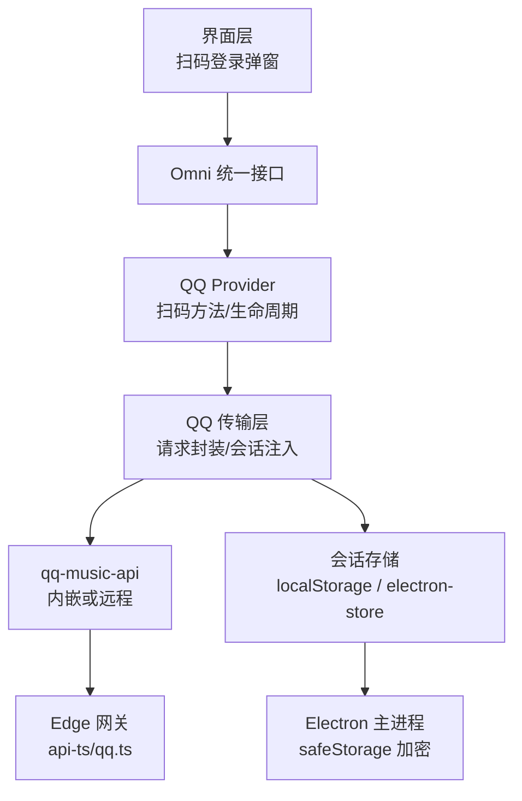
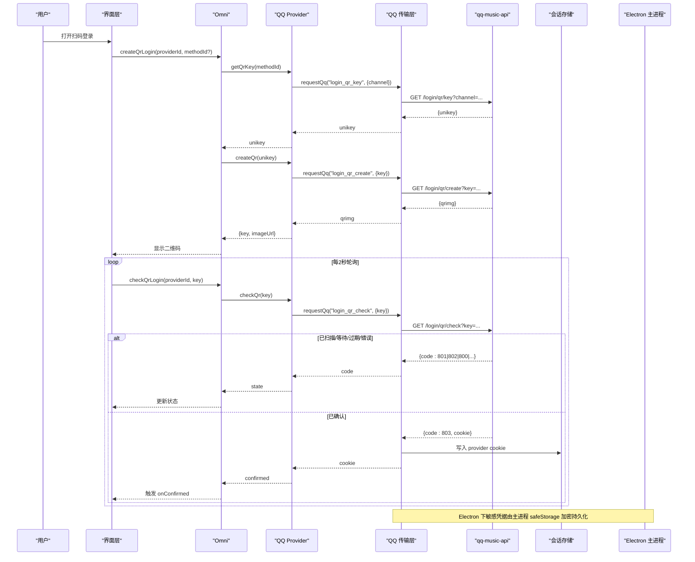
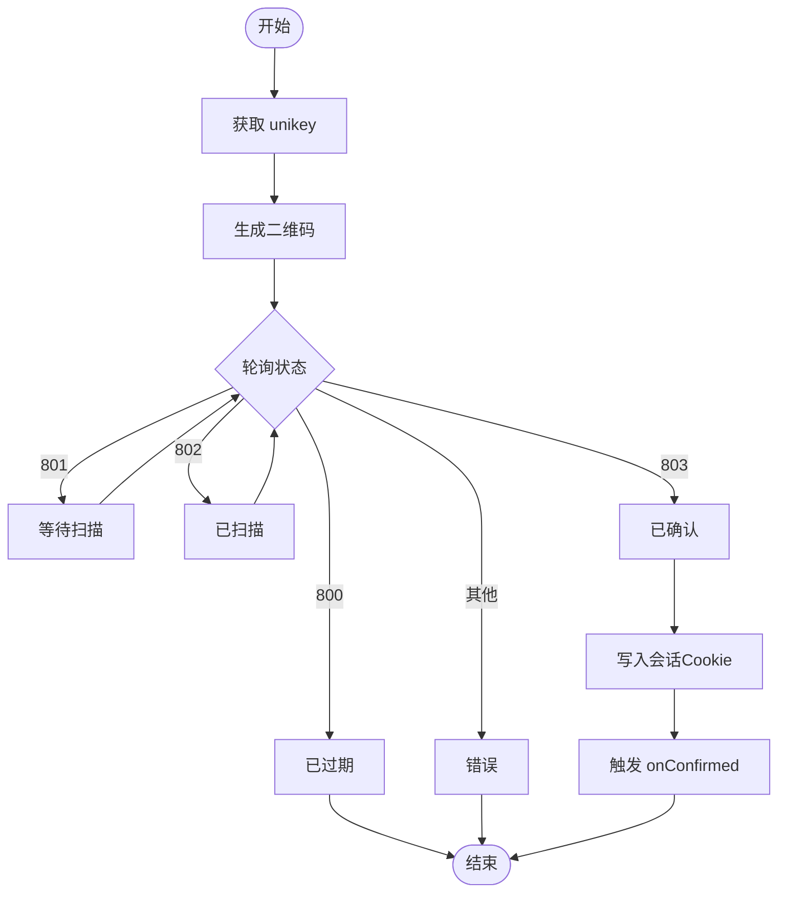
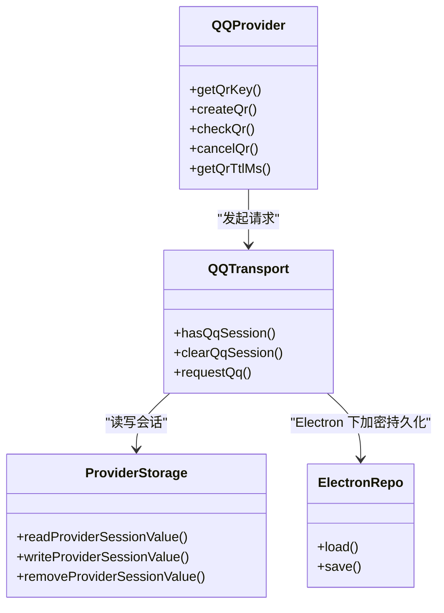
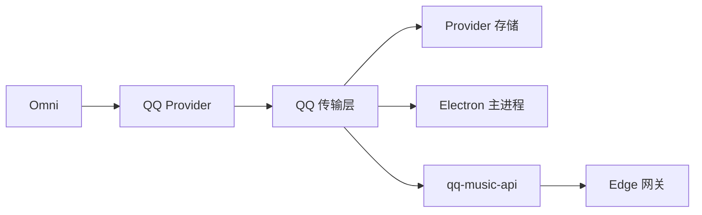

# 认证与安全

<cite>
**本文引用的文件**
- [qqProvider.ts](file://src/services/onlineMusic/qqProvider.ts)
- [qqTransport.ts](file://src/services/onlineMusic/qqTransport.ts)
- [providerStorage.ts](file://src/services/onlineMusic/providerStorage.ts)
- [omni.ts](file://src/services/onlineMusic/omni.ts)
- [useOnlineProviderQrLogin.ts](file://src/hooks/useOnlineProviderQrLogin.ts)
- [qqAuthSessionRepository.cjs](file://electron/qqAuthSessionRepository.cjs)
- [main.cjs](file://electron/main.cjs)
- [qq.ts](file://api-ts/qq.ts)
</cite>

## 目录
1. [简介](#简介)
2. [项目结构](#项目结构)
3. [核心组件](#核心组件)
4. [架构总览](#架构总览)
5. [详细组件分析](#详细组件分析)
6. [依赖关系分析](#依赖关系分析)
7. [性能考虑](#性能考虑)
8. [故障排查指南](#故障排查指南)
9. [结论](#结论)
10. [附录](#附录)

## 简介
本章节面向 QQ 音乐在 Folia 中的认证与安全机制，覆盖扫码登录（QQ 与微信）、设备绑定、Token/会话管理、本地加密存储、跨进程共享、自动续期策略，以及安全最佳实践。重点说明二维码登录的完整流程：二维码生成、状态轮询、确认回调；并对比不同登录方式的差异与适用场景。

## 项目结构
围绕认证与安全的关键代码分布在以下模块：
- 前端 Provider 层：定义 QQ 能力、扫码登录方法、二维码生命周期、登录状态检查等
- 传输层：统一封装对 qq-music-api 的请求、会话 Cookie/Token 注入、同源/跨源策略、错误处理
- 存储层：提供按 Provider 隔离的会话键空间（localStorage），以及 Electron 主进程的加密持久化
- 统一入口 Omni：对外暴露统一的扫码登录接口，屏蔽具体 Provider 差异
- Electron 主进程：使用 safeStorage 对敏感凭据进行系统级加密存储
- API 网关：Vercel Edge 路由转发请求，透传自定义头以携带密封 Token

**图表来源**
- [omni.ts:176-210](file://src/services/onlineMusic/omni.ts#L176-L210)
- [qqProvider.ts:278-388](file://src/services/onlineMusic/qqProvider.ts#L278-L388)
- [qqTransport.ts:166-245](file://src/services/onlineMusic/qqTransport.ts#L166-L245)
- [providerStorage.ts:33-65](file://src/services/onlineMusic/providerStorage.ts#L33-L65)
- [qqAuthSessionRepository.cjs:28-78](file://electron/qqAuthSessionRepository.cjs#L28-L78)
- [main.cjs:139-144](file://electron/main.cjs#L139-L144)
- [qq.ts:20-37](file://api-ts/qq.ts#L20-L37)

**章节来源**
- [omni.ts:176-210](file://src/services/onlineMusic/omni.ts#L176-L210)
- [qqProvider.ts:278-388](file://src/services/onlineMusic/qqProvider.ts#L278-L388)
- [qqTransport.ts:166-245](file://src/services/onlineMusic/qqTransport.ts#L166-L245)
- [providerStorage.ts:33-65](file://src/services/onlineMusic/providerStorage.ts#L33-L65)
- [qqAuthSessionRepository.cjs:28-78](file://electron/qqAuthSessionRepository.cjs#L28-L78)
- [main.cjs:139-144](file://electron/main.cjs#L139-L144)
- [qq.ts:20-37](file://api-ts/qq.ts#L20-L37)

## 核心组件
- QQ Provider：声明扫码登录方式（QQ/微信）、二维码 TTL、二维码创建/轮询/取消、登录状态检查与登出
- QQ 传输层：负责将会话 Cookie/Token 注入请求、同源/跨源策略、401 清理会话、曲库端点状态码校验
- 存储层：按 Provider 命名空间保存会话值；Electron 主进程通过 safeStorage 加密持久化敏感数据
- Omni：统一扫码登录入口，屏蔽 Provider 差异，提供方法列表、TTL、创建/轮询/取消
- Electron 主进程：使用 safeStorage 加密保存 QQ 认证会话信封，拒绝明文后端
- Edge 网关：将路径重写为后端路径，透传 X-QQ-Session 头，保证密封 Token 不落入 URL

**章节来源**
- [qqProvider.ts:278-388](file://src/services/onlineMusic/qqProvider.ts#L278-L388)
- [qqTransport.ts:85-109](file://src/services/onlineMusic/qqTransport.ts#L85-L109)
- [providerStorage.ts:33-65](file://src/services/onlineMusic/providerStorage.ts#L33-L65)
- [omni.ts:176-210](file://src/services/onlineMusic/omni.ts#L176-L210)
- [qqAuthSessionRepository.cjs:10-26](file://electron/qqAuthSessionRepository.cjs#L10-L26)
- [qq.ts:20-37](file://api-ts/qq.ts#L20-L37)

## 架构总览
下图展示了从用户触发扫码到登录成功的端到端调用链，包括二维码生成、轮询、确认回调与会话持久化。

**图表来源**
- [useOnlineProviderQrLogin.ts:77-159](file://src/hooks/useOnlineProviderQrLogin.ts#L77-L159)
- [omni.ts:187-204](file://src/services/onlineMusic/omni.ts#L187-L204)
- [qqProvider.ts:624-650](file://src/services/onlineMusic/qqProvider.ts#L624-L650)
- [qqTransport.ts:200-245](file://src/services/onlineMusic/qqTransport.ts#L200-L245)
- [providerStorage.ts:52-65](file://src/services/onlineMusic/providerStorage.ts#L52-L65)
- [qqAuthSessionRepository.cjs:57-76](file://electron/qqAuthSessionRepository.cjs#L57-L76)

## 详细组件分析

### 扫码登录流程（QQ/微信）
- 方式选择：Provider 声明支持的通道（QQ/微信），若后端仅返回单一通道则隐藏选择器直接走默认通道
- 二维码生成：先获取 unikey，再根据 unikey 生成二维码图片
- 轮询状态：每 2 秒调用 check，映射后端状态码到 waiting/scanned/expired/error/confirmed
- 确认回调：当收到 803 时，传输层将服务端返回的 opaque cookie 写入本地会话存储，随后 Provider 再次落盘一次以确保幂等
- 二维码 TTL：前端显式设置 TTL（略短于后端），避免死轮询；未声明 TTL 的 Provider 交由后端报过期

**图表来源**
- [useOnlineProviderQrLogin.ts:77-159](file://src/hooks/useOnlineProviderQrLogin.ts#L77-L159)
- [qqProvider.ts:364-388](file://src/services/onlineMusic/qqProvider.ts#L364-L388)
- [qqTransport.ts:153-157](file://src/services/onlineMusic/qqTransport.ts#L153-L157)

**章节来源**
- [qqProvider.ts:278-388](file://src/services/onlineMusic/qqProvider.ts#L278-L388)
- [useOnlineProviderQrLogin.ts:77-159](file://src/hooks/useOnlineProviderQrLogin.ts#L77-L159)
- [omni.ts:176-210](file://src/services/onlineMusic/omni.ts#L176-L210)

### 会话存储与管理策略
- 存储位置
  - Web/Electron 渲染进程：使用 localStorage，按 Provider 命名空间存储 opaque cookie（如 qqmusic_session=...）
  - Electron 主进程：使用 safeStorage 加密保存 QQ 认证会话信封（包含 musickey、refresh 等敏感字段），拒绝明文存储
- 跨进程共享
  - 渲染进程只持有不透明 token；敏感信息仅在 main 进程加密持久化，IPC 不传递明文
- 自动续期
  - 每次成功登录后，传输层会写回 cookie；后续请求在同源部署下以自定义头携带密封 token，跨源/外部实例以 query 参数携带整串 cookie
  - 401 响应会清理本地会话，强制重新登录
- 密钥轮换
  - Edge 网关支持新旧两个会话密钥环境变量，便于滚动升级

**图表来源**
- [providerStorage.ts:33-65](file://src/services/onlineMusic/providerStorage.ts#L33-L65)
- [qqTransport.ts:85-109](file://src/services/onlineMusic/qqTransport.ts#L85-L109)
- [qqProvider.ts:624-650](file://src/services/onlineMusic/qqProvider.ts#L624-L650)
- [qqAuthSessionRepository.cjs:28-78](file://electron/qqAuthSessionRepository.cjs#L28-L78)

**章节来源**
- [providerStorage.ts:33-65](file://src/services/onlineMusic/providerStorage.ts#L33-L65)
- [qqTransport.ts:85-109](file://src/services/onlineMusic/qqTransport.ts#L85-L109)
- [qqAuthSessionRepository.cjs:28-78](file://electron/qqAuthSessionRepository.cjs#L28-L78)

### 不同登录方式的实现差异与适用场景
- QQ 扫码 vs 微信扫码
  - 两者均通过同一套 QR 流程，区别在于 channel 参数（后端通道名）
  - Provider 会根据后端声明的通道动态过滤 UI 选项；若仅一个通道则隐藏选择器
  - 适用场景：移动端扫码便捷；微信渠道适合微信生态用户
- 单通道 Provider（如网易云、酷狗）
  - 不提供多通道选择，直接进入单步扫码流程
- 能力发现
  - 启动时探测后端 login_channels，缓存结果；失败时回退到硬编码数组，兼容旧后端

**章节来源**
- [qqProvider.ts:278-358](file://src/services/onlineMusic/qqProvider.ts#L278-L358)
- [omni.ts:176-210](file://src/services/onlineMusic/omni.ts#L176-L210)

### 安全机制与最佳实践
- 敏感信息保护
  - 渲染进程仅持有不透明 session cookie；敏感字段（musickey、refresh 等）在主进程用 safeStorage 加密存储
  - Linux 平台若检测到 basic_text 明文后端，直接拒绝，避免弱加密
- 防重放攻击
  - 所有请求附带 timestamp 参数，降低重放窗口
  - 同源部署使用自定义头 X-QQ-Session 携带密封 token，避免 URL 日志泄露
- 会话劫持防护
  - 401 响应立即清理本地会话，强制重新认证
  - 跨源请求不使用 credentials，避免浏览器自动携带 Cookie 被滥用
- 二维码安全
  - 前端提前设置 TTL（略短于后端），减少无效轮询与资源占用
  - 关闭弹窗时主动 cancel 会话，避免僵尸会话长期存活

**章节来源**
- [qqTransport.ts:101-109](file://src/services/onlineMusic/qqTransport.ts#L101-L109)
- [qqTransport.ts:220-235](file://src/services/onlineMusic/qqTransport.ts#L220-L235)
- [qqAuthSessionRepository.cjs:10-26](file://electron/qqAuthSessionRepository.cjs#L10-L26)
- [qqProvider.ts:360-363](file://src/services/onlineMusic/qqProvider.ts#L360-L363)

## 依赖关系分析
- Omni 作为统一入口，委托具体 Provider 完成扫码流程
- QQ Provider 依赖传输层进行网络请求与会话注入
- 传输层依赖存储层读写会话，并在 Electron 环境下与主进程加密存储协作
- Edge 网关负责路径重写与头部透传，确保密封 token 不被记录在 URL

**图表来源**
- [omni.ts:176-210](file://src/services/onlineMusic/omni.ts#L176-L210)
- [qqProvider.ts:624-650](file://src/services/onlineMusic/qqProvider.ts#L624-L650)
- [qqTransport.ts:200-245](file://src/services/onlineMusic/qqTransport.ts#L200-L245)
- [qq.ts:20-37](file://api-ts/qq.ts#L20-L37)

**章节来源**
- [omni.ts:176-210](file://src/services/onlineMusic/omni.ts#L176-L210)
- [qqProvider.ts:624-650](file://src/services/onlineMusic/qqProvider.ts#L624-L650)
- [qqTransport.ts:200-245](file://src/services/onlineMusic/qqTransport.ts#L200-L245)
- [qq.ts:20-37](file://api-ts/qq.ts#L20-L37)

## 性能考虑
- 轮询频率：固定 2 秒间隔，避免频繁请求造成后端压力
- TTL 控制：前端早于后端超时，减少无效轮询
- 能力发现缓存：login_channels 结果缓存，避免重复探测
- 同源优化：同源部署使用自定义头，避免预检请求开销

[本节为通用指导，无需特定文件引用]

## 故障排查指南
- 无法获取二维码
  - 检查 VITE_QQ_API_BASE 配置或 Electron 内嵌服务端口是否可用
  - 查看 login_channels 是否返回有效通道
- 轮询无响应或一直等待
  - 确认二维码未过期；检查前端 TTL 与后端一致性
  - 检查网络与 CORS 配置（跨源时不应带 credentials）
- 登录后立即失效
  - 检查 401 响应是否触发会话清理
  - 确认同源/跨源模式下 token 传递方式正确（头或 query）
- Electron 下凭据不可用
  - 检查 safeStorage 是否可用且非 basic_text 明文后端

**章节来源**
- [qqTransport.ts:42-83](file://src/services/onlineMusic/qqTransport.ts#L42-L83)
- [qqTransport.ts:220-235](file://src/services/onlineMusic/qqTransport.ts#L220-L235)
- [qqAuthSessionRepository.cjs:10-26](file://electron/qqAuthSessionRepository.cjs#L10-L26)

## 结论
本项目实现了完善的 QQ 音乐认证与安全机制：通过 Omni 统一扫码登录入口、Provider 抽象与传输层封装，结合 Electron 主进程的安全存储与 Edge 网关的头部透传，确保了敏感信息保护、防重放与会话劫持防护。二维码登录流程清晰可控，具备 TTL 管理与主动取消机制，兼顾用户体验与安全性。

[本节为总结性内容，无需特定文件引用]

## 附录
- 关键常量与端点
  - 二维码确认码：803
  - 会话 Cookie 名称：qqmusic_session
  - 自定义头：X-QQ-Session
  - 登录相关端点：/login/qr/key、/login/qr/create、/login/qr/check、/login/qr/cancel、/login/status、/logout

**章节来源**
- [qqTransport.ts:39-40](file://src/services/onlineMusic/qqTransport.ts#L39-L40)
- [qqTransport.ts:85-109](file://src/services/onlineMusic/qqTransport.ts#L85-L109)
- [qqProvider.ts:624-650](file://src/services/onlineMusic/qqProvider.ts#L624-L650)