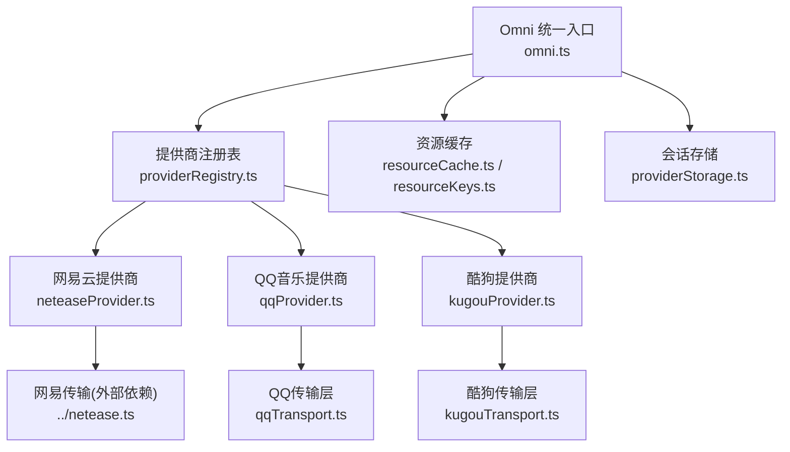
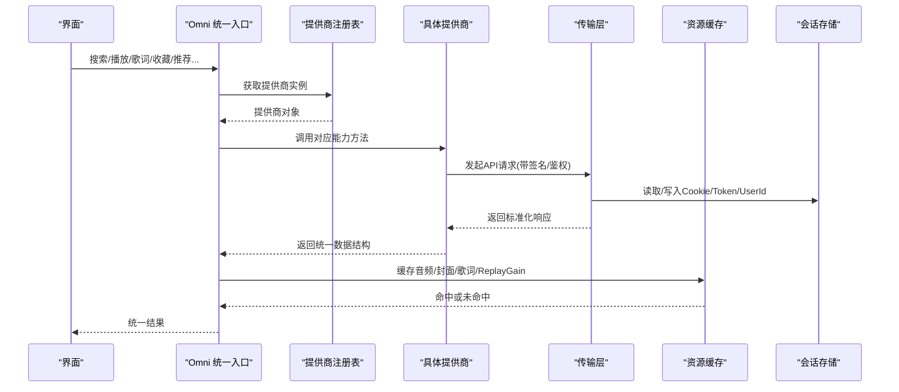
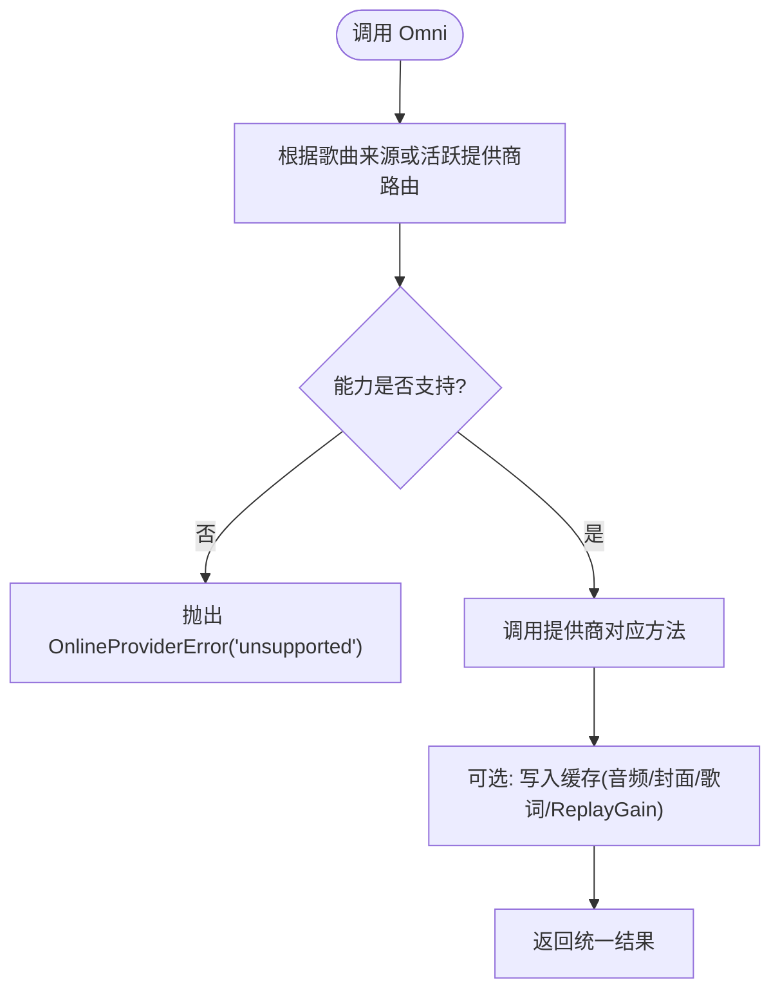
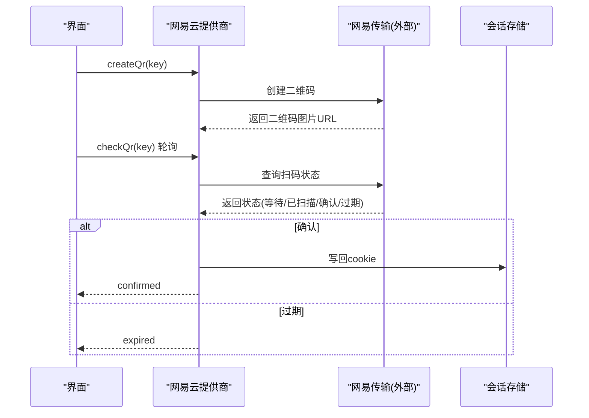
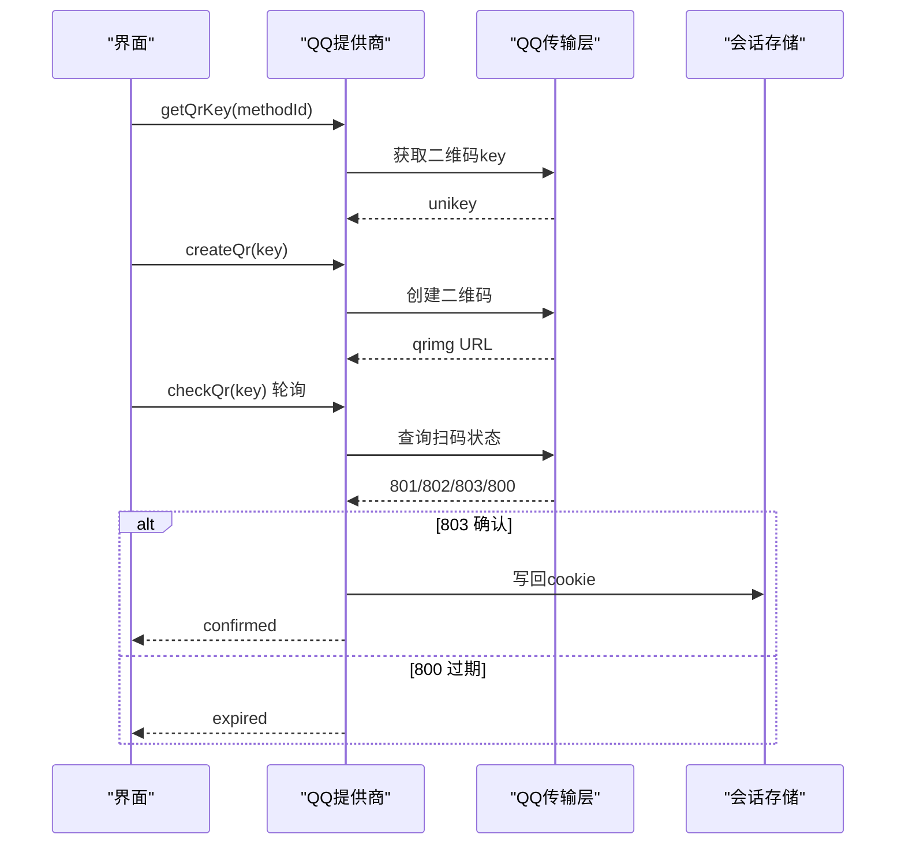
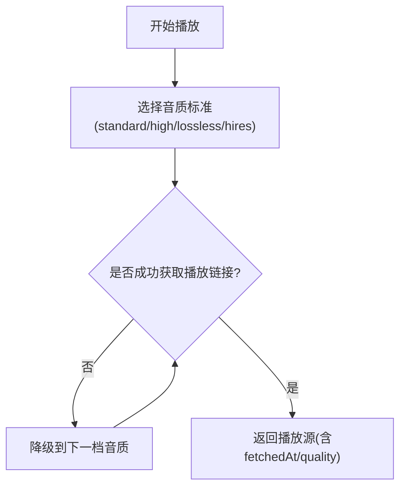
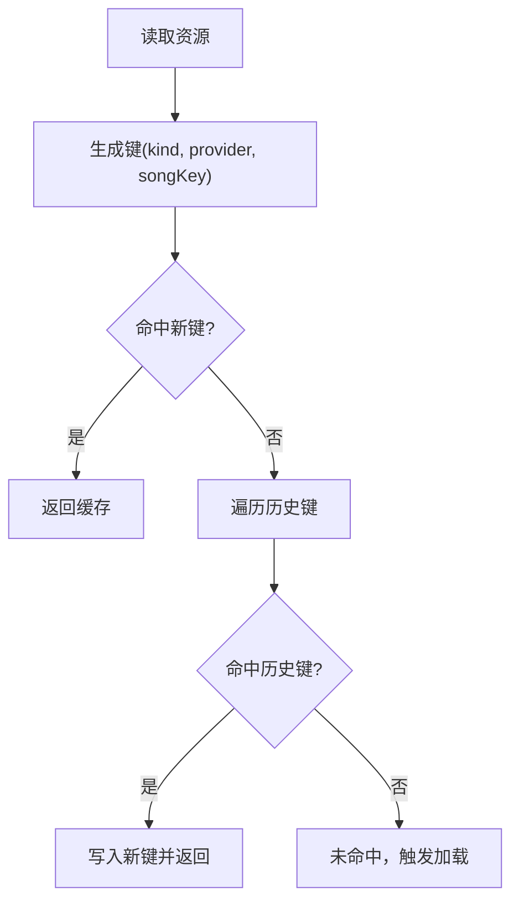
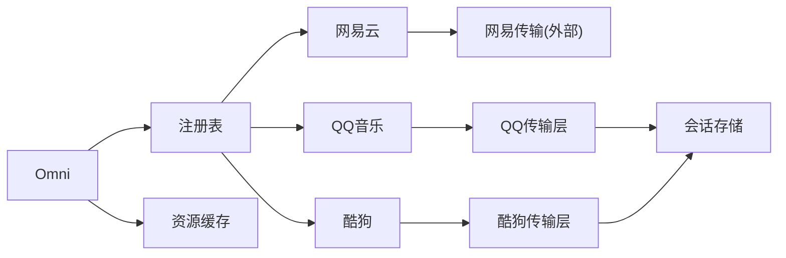

# 在线音乐集成

<cite>
**本文引用的文件**
- [omni.ts](file://src/services/onlineMusic/omni.ts)
- [providerRegistry.ts](file://src/services/onlineMusic/providerRegistry.ts)
- [resourceCache.ts](file://src/services/onlineMusic/resourceCache.ts)
- [resourceKeys.ts](file://src/services/onlineMusic/resourceKeys.ts)
- [neteaseProvider.ts](file://src/services/onlineMusic/neteaseProvider.ts)
- [qqProvider.ts](file://src/services/onlineMusic/qqProvider.ts)
- [kugouProvider.ts](file://src/services/onlineMusic/kugouProvider.ts)
- [kugouTransport.ts](file://src/services/onlineMusic/kugouTransport.ts)
- [qqTransport.ts](file://src/services/onlineMusic/qqTransport.ts)
- [providerStorage.ts](file://src/services/onlineMusic/providerStorage.ts)
- [onlineMusic.ts](file://src/types/onlineMusic.ts)
</cite>

## 目录
1. [简介](#简介)
2. [项目结构](#项目结构)
3. [核心组件](#核心组件)
4. [架构总览](#架构总览)
5. [详细组件分析](#详细组件分析)
6. [依赖关系分析](#依赖关系分析)
7. [性能考虑](#性能考虑)
8. [故障排查指南](#故障排查指南)
9. [结论](#结论)
10. [附录](#附录)

## 简介
本技术文档围绕 Folia Player 的“在线音乐集成”子系统，系统性阐述多提供商统一接口的设计模式与实现细节。重点包括：
- 通过适配器模式屏蔽网易云、QQ音乐、酷狗等第三方服务的 API 差异
- 各提供商认证流程（含扫码登录）与会话管理最佳实践
- 资源缓存策略（歌曲元数据、封面、播放列表、ReplayGain）
- 搜索算法与分页处理
- 错误重试、限流与健壮性设计
- 新增音乐提供商的扩展指南

## 项目结构
在线音乐子系统位于 src/services/onlineMusic 下，采用“统一入口 + 提供商适配层 + 传输层”的分层组织方式：
- 统一入口 omni.ts：对外暴露统一的 Omni 接口，屏蔽具体提供商差异
- 提供商注册表 providerRegistry.ts：集中注册与管理各提供商实例
- 提供商实现 neteaseProvider.ts / qqProvider.ts / kugouProvider.ts：按能力域拆分 search/playback/lyrics/auth/library/catalog/recommendations/mutations 等
- 传输层 kugouTransport.ts / qqTransport.ts：封装 HTTP 请求、签名、会话、鉴权、错误码映射
- 资源缓存 resourceCache.ts / resourceKeys.ts：统一键生成与迁移、音频/封面/歌词/ReplayGain 缓存
- 会话存储 providerStorage.ts：跨环境持久化 Cookie/Token/UserId 等会话值
- 类型定义 onlineMusic.ts：统一的数据模型与能力声明

**图表来源**
- [omni.ts:74-567](file://src/services/onlineMusic/omni.ts#L74-L567)
- [providerRegistry.ts:11-61](file://src/services/onlineMusic/providerRegistry.ts#L11-L61)
- [neteaseProvider.ts:215-495](file://src/services/onlineMusic/neteaseProvider.ts#L215-L495)
- [qqProvider.ts:593-665](file://src/services/onlineMusic/qqProvider.ts#L593-L665)
- [kugouProvider.ts:222-800](file://src/services/onlineMusic/kugouProvider.ts#L222-L800)
- [resourceCache.ts:1-114](file://src/services/onlineMusic/resourceCache.ts#L1-L114)
- [resourceKeys.ts:1-26](file://src/services/onlineMusic/resourceKeys.ts#L1-L26)
- [providerStorage.ts:1-65](file://src/services/onlineMusic/providerStorage.ts#L1-L65)

**章节来源**
- [omni.ts:74-567](file://src/services/onlineMusic/omni.ts#L74-L567)
- [providerRegistry.ts:11-61](file://src/services/onlineMusic/providerRegistry.ts#L11-L61)

## 核心组件
- Omni 统一接口：提供搜索、播放、歌词、收藏、推荐、订阅、播放列表变更等统一方法；内部根据歌曲来源或当前活跃提供商路由到具体实现
- 提供商注册表：集中维护提供商实例，支持动态注册/注销与能力探测
- 传输层：负责网络请求、签名、鉴权、错误码转换、会话持久化
- 资源缓存：统一键生成、历史键迁移、音频/封面/歌词/ReplayGain 缓存读写
- 会话存储：命名空间化的本地存储，避免不同提供商之间冲突

关键职责边界清晰，便于扩展新提供商与维护旧逻辑。

**章节来源**
- [omni.ts:74-567](file://src/services/onlineMusic/omni.ts#L74-L567)
- [providerRegistry.ts:11-61](file://src/services/onlineMusic/providerRegistry.ts#L11-L61)
- [resourceCache.ts:1-114](file://src/services/onlineMusic/resourceCache.ts#L1-L114)
- [providerStorage.ts:1-65](file://src/services/onlineMusic/providerStorage.ts#L1-L65)

## 架构总览
下图展示从 UI 调用 Omni 到具体提供商及传输层的完整调用链，以及缓存与会话的参与点。

**图表来源**
- [omni.ts:74-567](file://src/services/onlineMusic/omni.ts#L74-L567)
- [providerRegistry.ts:11-61](file://src/services/onlineMusic/providerRegistry.ts#L11-L61)
- [kugouTransport.ts:1-200](file://src/services/onlineMusic/kugouTransport.ts#L1-L200)
- [qqTransport.ts:1-200](file://src/services/onlineMusic/qqTransport.ts#L1-L200)
- [resourceCache.ts:1-114](file://src/services/onlineMusic/resourceCache.ts#L1-L114)
- [providerStorage.ts:1-65](file://src/services/onlineMusic/providerStorage.ts#L1-L65)

## 详细组件分析

### 统一接口 Omni
- 作用：聚合所有在线音乐能力，屏蔽提供商差异；提供搜索、播放源解析、歌词、收藏、推荐、订阅、播放列表增删改查等
- 关键机制：
  - 基于歌曲来源或当前活跃提供商进行路由
  - 能力探测：providerSupports 检查 capabilities 字段
  - 请求生命周期保护：withActiveProvider 防止账号切换时响应乱序
  - 分页统一：OmniPage<T> 抽象 hasMore/nextOffset/items
  - 错误处理：OnlineProviderError 携带 code/providerId/cause

**图表来源**
- [omni.ts:74-567](file://src/services/onlineMusic/omni.ts#L74-L567)
- [onlineMusic.ts:31-51](file://src/types/onlineMusic.ts#L31-L51)
- [onlineMusic.ts:181-199](file://src/types/onlineMusic.ts#L181-L199)

**章节来源**
- [omni.ts:74-567](file://src/services/onlineMusic/omni.ts#L74-L567)
- [onlineMusic.ts:31-51](file://src/types/onlineMusic.ts#L31-L51)
- [onlineMusic.ts:181-199](file://src/types/onlineMusic.ts#L181-L199)

### 提供商注册表
- 作用：集中管理提供商实例，提供 get/list/require 等方法
- 特点：
  - 启动时自动注册网易云/QQ/酷狗
  - require* 方法在缺失时抛出 unavailable 错误
  - 支持按歌曲来源快速定位提供商

**章节来源**
- [providerRegistry.ts:11-61](file://src/services/onlineMusic/providerRegistry.ts#L11-L61)

### 网易云音乐提供商
- 能力：搜索、播放、歌词、认证、用户库、歌单、专辑、歌手、推荐、收藏、订阅、个人FM、逐字歌词、云盘、历史推荐等
- 认证流程：
  - 登录状态校验：getLoginStatus 调用后端接口并校验 cookie/code/profile
  - 扫码登录：getQrKey/createQr/checkQr 轮询二维码状态，成功后写回 cookie
- 播放与可用性：
  - getAudioSource 获取播放链接，并提取 ReplayGain
  - getAvailability 标记不可用曲目（版权限制）
  - getReplacement 提供替代曲目
- 歌词：
  - 支持普通歌词与云盘歌词，解析后返回主文本/逐字/翻译/罗马音
  - 合唱段范围解析并缓存
- 用户库与收藏：
  - 获取歌单、喜欢歌曲、收藏专辑、云盘集合
- 推荐：
  - 每日推荐、个人FM、推荐歌单、历史推荐与不喜欢操作

**图表来源**
- [neteaseProvider.ts:297-340](file://src/services/onlineMusic/neteaseProvider.ts#L297-L340)
- [providerStorage.ts:33-54](file://src/services/onlineMusic/providerStorage.ts#L33-L54)

**章节来源**
- [neteaseProvider.ts:215-495](file://src/services/onlineMusic/neteaseProvider.ts#L215-L495)

### QQ音乐提供商
- 能力：搜索、播放、歌词、认证、用户库、歌单、专辑、歌手、逐字歌词、喜欢歌曲、收藏专辑等
- 认证流程：
  - 登录状态：hasQqSession 判断后端会话是否存在，login_status 校验
  - 扫码登录：getQrKey/createQr/checkQr/cancelQr，通道发现 login_channels，前端显示支持的渠道
  - 会话持久化：确认后写回 cookie（密封 token），支持同源/跨源两种传参方式
- 播放与质量降级：
  - 按 quality 优先级尝试 128/320/flac，失败则降级
  - 上游拒绝播放（会员/地区/下架）会返回空链接，需区分网络错误与业务拒绝
- 歌词：复用歌词服务，返回主文本/逐字/翻译/罗马音
- 用户库与收藏：
  - 获取歌单、喜欢歌曲、收藏专辑
- 目录导航：
  - resolveSongCatalogRefs 按需补全 album/singer mid，减少冗余请求

**图表来源**
- [qqProvider.ts:624-651](file://src/services/onlineMusic/qqProvider.ts#L624-L651)
- [qqTransport.ts:85-109](file://src/services/onlineMusic/qqTransport.ts#L85-L109)
- [providerStorage.ts:33-54](file://src/services/onlineMusic/providerStorage.ts#L33-L54)

**章节来源**
- [qqProvider.ts:28-665](file://src/services/onlineMusic/qqProvider.ts#L28-L665)
- [qqTransport.ts:1-200](file://src/services/onlineMusic/qqTransport.ts#L1-L200)

### 酷狗音乐提供商
- 能力：搜索、播放、歌词、认证、用户库、歌单、专辑、歌手、推荐、收藏、订阅、播放列表增删改等
- 认证流程：
  - 设备验证与匿名搜索签名：requestKugouAnonymousSearch 模拟 Android 客户端签名
  - 会话持久化：token/dfid/userid/cookie 写入本地存储
  - VIP 权益：youth_union_vip/youth_day_vip/youth_day_vip_upgrade 自动领取与升级
- 播放与质量降级：
  - 按 standard/high/lossless/hires 优先级尝试，失败降级
  - 播放链接选择：过滤 http/https 协议，避免逗号拼接路径
- 歌词：
  - 通过 search_lyric 获取候选，再 lyric 接口解码 KRC，支持纯音乐检测与逐字歌词
  - 合唱段范围 song_climax 解析并缓存
- 用户库与收藏：
  - 获取歌单、专辑、云盘；识别内置“我喜欢”作为喜欢集合
- 目录导航：
  - resolveSongCatalogRefs 通过 KRM 元数据匹配 hash，补全专辑/歌手信息

**图表来源**
- [kugouProvider.ts:659-670](file://src/services/onlineMusic/kugouProvider.ts#L659-L670)
- [kugouProvider.ts:44-58](file://src/services/onlineMusic/kugouProvider.ts#L44-L58)

**章节来源**
- [kugouProvider.ts:222-800](file://src/services/onlineMusic/kugouProvider.ts#L222-L800)
- [kugouTransport.ts:1-200](file://src/services/onlineMusic/kugouTransport.ts#L1-L200)

### 资源缓存策略
- 键生成：
  - 统一键格式：kind_provider_songKey，封面针对酷狗使用 cover_v2
  - 兼容历史键：网易云云端/非云端旧键迁移到新键
- 缓存项：
  - 音频 Blob：getCachedSongAudioBlob/hasCachedSongAudio
  - 封面：getCachedSongCoverUrl/hasCachedSongCover
  - 歌词：通过通用缓存读写
  - ReplayGain：与音频同生命周期，避免混音音量跳变
- 迁移机制：
  - 首次读取旧键时写入新键，后续走新键
  - 封面迁移失败仅记录警告，不影响主流程

**图表来源**
- [resourceCache.ts:13-34](file://src/services/onlineMusic/resourceCache.ts#L13-L34)
- [resourceCache.ts:36-114](file://src/services/onlineMusic/resourceCache.ts#L36-L114)
- [resourceKeys.ts:8-25](file://src/services/onlineMusic/resourceKeys.ts#L8-L25)

**章节来源**
- [resourceCache.ts:1-114](file://src/services/onlineMusic/resourceCache.ts#L1-L114)
- [resourceKeys.ts:1-26](file://src/services/onlineMusic/resourceKeys.ts#L1-L26)

### 搜索算法与分页
- 网易云：cloudSearch 返回 songs 列表，标准化为 UnifiedSong，计算 total/hasMore/nextOffset
- QQ：复用歌词搜索接口，按页码与 limit 切片，标准化结果
- 酷狗：匿名搜索签名或认证搜索，去重保持排序，标准化结果
- 统一分页：OmniPage<T> 抽象 hasMore/nextOffset/items，上层无需关心提供商差异

**章节来源**
- [neteaseProvider.ts:251-258](file://src/services/onlineMusic/neteaseProvider.ts#L251-L258)
- [qqProvider.ts:28-33](file://src/services/onlineMusic/qqProvider.ts#L28-L33)
- [kugouProvider.ts:645-657](file://src/services/onlineMusic/kugouProvider.ts#L645-L657)
- [omni.ts:151-162](file://src/services/onlineMusic/omni.ts#L151-L162)

### 认证与会话管理最佳实践
- Token/Cookie 持久化：
  - 网易云：登录后写回 cookie
  - QQ：确认后写回密封 token（同源走 header，跨源走 query）
  - 酷狗：token/dfid/userid/cookie 持久化，支持设备验证
- 会话有效性：
  - QQ：login_status 校验，异常视为 auth-required
  - 酷狗：匿名搜索签名与设备验证，必要时清理 dfid
- 错误重试与限流：
  - 播放质量降级：QQ/酷狗按优先级尝试，失败降级
  - 二维码 TTL：QQ 前端提前 5 秒停止轮询，避免死码
  - 通道发现：QQ 后端 login_channels 动态决定可用渠道，失败冷却重试

**章节来源**
- [neteaseProvider.ts:297-340](file://src/services/onlineMusic/neteaseProvider.ts#L297-L340)
- [qqProvider.ts:240-276](file://src/services/onlineMusic/qqProvider.ts#L240-L276)
- [qqProvider.ts:324-358](file://src/services/onlineMusic/qqProvider.ts#L324-L358)
- [kugouTransport.ts:70-104](file://src/services/onlineMusic/kugouTransport.ts#L70-L104)
- [kugouTransport.ts:175-199](file://src/services/onlineMusic/kugouTransport.ts#L175-L199)

### 添加新音乐提供商的开发指南
步骤建议：
1. 定义提供商能力：在 newProvider.capabilities 中声明支持的功能
2. 实现核心方法：
   - search.searchSongs(query, limit, offset) -> OmniPage<UnifiedSong>
   - playback.getAudioSource(song, quality) -> ProviderAudioSource | null
   - lyrics.getLyrics(song, context) -> ProviderLyricsResult
   - auth.getLoginStatus/logout/getQrKey/createQr/checkQr (可选)
   - library.* / catalog.* / recommendations.* / mutations.* (按需)
3. 实现传输层：
   - 封装 HTTP 请求、签名、鉴权、错误码映射
   - 会话持久化：writeProviderSessionValue/readProviderSessionValue
4. 注册提供商：
   - 在 providerRegistry.ts 中 registerOnlineMusicProvider(newProvider)
5. 测试与验证：
   - 覆盖搜索、播放、歌词、收藏、订阅、播放列表变更等场景
   - 验证分页、降级、错误处理、缓存命中

参考现有实现：
- 网易云：neteaseProvider.ts
- QQ音乐：qqProvider.ts + qqTransport.ts
- 酷狗：kugouProvider.ts + kugouTransport.ts

**章节来源**
- [providerRegistry.ts:58-61](file://src/services/onlineMusic/providerRegistry.ts#L58-L61)
- [neteaseProvider.ts:215-495](file://src/services/onlineMusic/neteaseProvider.ts#L215-L495)
- [qqProvider.ts:593-665](file://src/services/onlineMusic/qqProvider.ts#L593-L665)
- [kugouProvider.ts:222-800](file://src/services/onlineMusic/kugouProvider.ts#L222-L800)

## 依赖关系分析
- Omni 依赖提供商注册表与具体提供商实现
- 提供商实现依赖传输层与类型定义
- 传输层依赖会话存储与环境配置
- 资源缓存依赖数据库与媒体缓存服务

**图表来源**
- [omni.ts:74-567](file://src/services/onlineMusic/omni.ts#L74-L567)
- [providerRegistry.ts:11-61](file://src/services/onlineMusic/providerRegistry.ts#L11-L61)
- [kugouTransport.ts:1-200](file://src/services/onlineMusic/kugouTransport.ts#L1-L200)
- [qqTransport.ts:1-200](file://src/services/onlineMusic/qqTransport.ts#L1-L200)
- [resourceCache.ts:1-114](file://src/services/onlineMusic/resourceCache.ts#L1-L114)

**章节来源**
- [omni.ts:74-567](file://src/services/onlineMusic/omni.ts#L74-L567)
- [providerRegistry.ts:11-61](file://src/services/onlineMusic/providerRegistry.ts#L11-L61)

## 性能考虑
- 请求去重：
  - QQ 歌曲详情请求按 songmid 去重，避免重复解析
  - 酷狗推荐卡片与合唱段范围缓存
- 质量降级：
  - QQ/酷狗按优先级尝试音质，失败降级，提升成功率
- 缓存命中：
  - 音频/封面/歌词/ReplayGain 缓存减少重复请求
  - 历史键迁移确保平滑过渡
- 分页优化：
  - 统一 OmniPage 抽象，减少上层复杂度
  - 本地切片与后端分页结合，平衡性能与体验

[本节为通用性能讨论，不直接分析具体文件]

## 故障排查指南
常见问题与定位：
- 认证失败：
  - QQ：login_status 返回 401 或 auth-required，检查会话是否存在
  - 酷狗：设备验证错误，清理 dfid 并重试
- 播放不可用：
  - 网易云：noCopyrightRcmd 标记不可用，尝试替换曲目
  - QQ：上游拒绝播放（会员/地区/下架），区分网络错误与业务拒绝
- 二维码过期：
  - QQ：前端提前 5 秒停止轮询，提示用户重试
  - 网易云：checkQr 返回 800 表示过期
- 缓存问题：
  - 历史键迁移失败仅记录警告，不影响主流程
  - ReplayGain 与音频同生命周期，避免混音音量跳变

**章节来源**
- [qqProvider.ts:240-276](file://src/services/onlineMusic/qqProvider.ts#L240-L276)
- [kugouTransport.ts:175-199](file://src/services/onlineMusic/kugouTransport.ts#L175-L199)
- [neteaseProvider.ts:278-294](file://src/services/onlineMusic/neteaseProvider.ts#L278-L294)
- [resourceCache.ts:76-94](file://src/services/onlineMusic/resourceCache.ts#L76-L94)

## 结论
Folia Player 的在线音乐集成通过 Omni 统一接口与提供商适配器模式，有效屏蔽了网易云、QQ音乐、酷狗等第三方服务的 API 差异。系统具备完善的认证与会话管理、资源缓存策略、搜索与分页处理、错误重试与降级机制，并为新增提供商提供了清晰的扩展路径。整体架构分层清晰、职责明确，具备良好的可维护性与可扩展性。

[本节为总结性内容，不直接分析具体文件]

## 附录
- 类型定义参考：
  - ProviderCapabilities：能力声明
  - ProviderPage：分页抽象
  - ProviderAudioSource：播放源
  - ProviderLyricsResult：歌词结果
  - OnlineProviderError：错误类型

**章节来源**
- [onlineMusic.ts:31-51](file://src/types/onlineMusic.ts#L31-L51)
- [onlineMusic.ts:72-85](file://src/types/onlineMusic.ts#L72-L85)
- [onlineMusic.ts:104-112](file://src/types/onlineMusic.ts#L104-L112)
- [onlineMusic.ts:181-199](file://src/types/onlineMusic.ts#L181-L199)