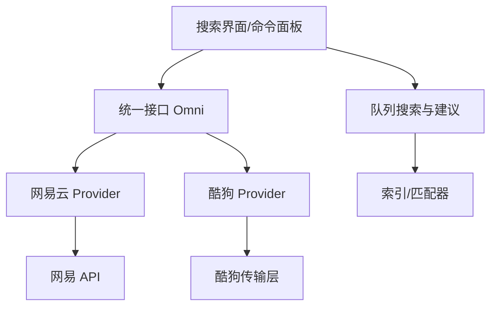
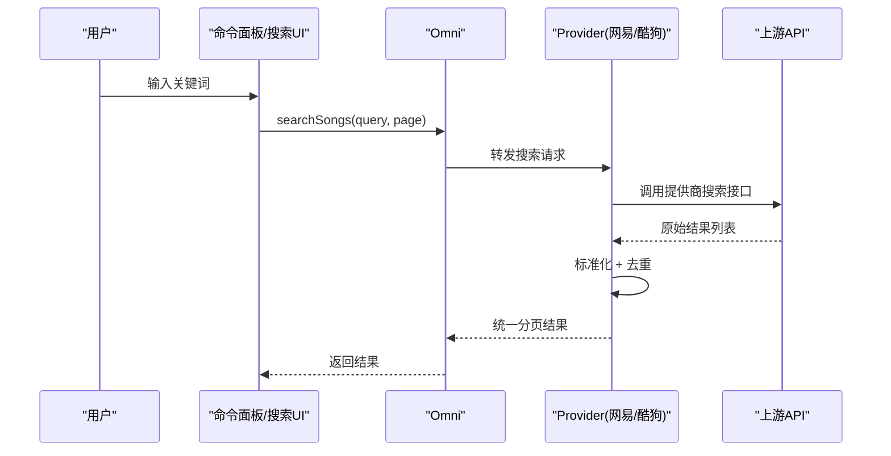
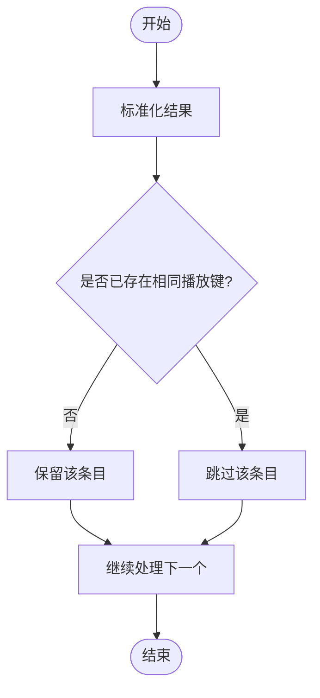
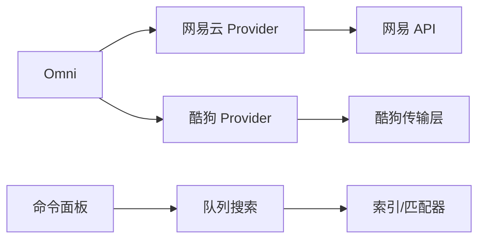
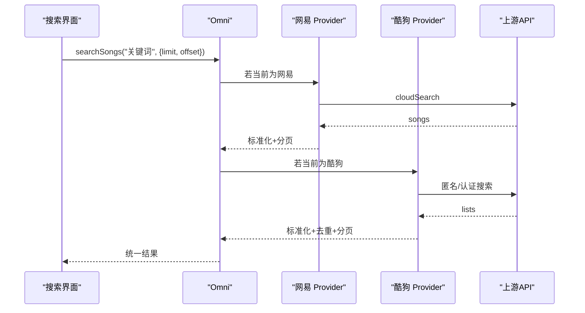

# 关键词处理

<cite>
**本文引用的文件**
- [omni.ts](file://src/services/onlineMusic/omni.ts)
- [neteaseProvider.ts](file://src/services/onlineMusic/neteaseProvider.ts)
- [kugouProvider.ts](file://src/services/onlineMusic/kugouProvider.ts)
- [searchQuery.ts](file://src/utils/lyrics/searchQuery.ts)
- [matchScore.ts](file://src/utils/lyrics/matchScore.ts)
- [syncFingerprint.ts](file://src/services/sync/syncFingerprint.ts)
- [LyricMatchModal.tsx](file://src/components/modal/LyricMatchModal.tsx)
- [command-palette/queueSearch.ts](file://src/components/command-palette/queueSearch.ts)
- [command-palette/queueSearchIndex.ts](file://src/components/command-palette/queueSearchIndex.ts)
- [command-palette/queueSongMatches.ts](file://src/components/command-palette/queueSongMatches.ts)
- [command-palette/commands/searchCommands.ts](file://src/components/command-palette/commands/searchCommands.ts)
</cite>

## 目录
1. [简介](#简介)
2. [项目结构](#项目结构)
3. [核心组件](#核心组件)
4. [架构总览](#架构总览)
5. [详细组件分析](#详细组件分析)
6. [依赖关系分析](#依赖关系分析)
7. [性能考量](#性能考量)
8. [故障排查指南](#故障排查指南)
9. [结论](#结论)
10. [附录](#附录)

## 简介
本文件聚焦于搜索关键词的处理机制与多提供商搜索结果的去重合并策略，覆盖以下方面：
- 文本标准化、分词与同义词扩展等预处理步骤
- 模糊匹配算法（编辑距离、拼音匹配、字符相似度）的实现要点
- 搜索建议功能的技术实现（历史搜索、热门关键词、实时联想）
- 多提供商（网易云音乐、酷狗音乐）搜索结果的去重与合并逻辑，以及重复歌曲与相似结果的智能识别

## 项目结构
围绕“搜索”的关键代码分布在以下位置：
- 统一入口与能力路由：在线音乐统一接口 Omni
- 各提供商适配层：网易云、酷狗
- 歌词与元数据驱动的查询构建：歌词搜索查询工具
- 命令面板中的队列搜索与建议：本地队列检索与提示
- 去重与指纹：用于稳定标识的文本归一化与指纹生成

图表来源
- [omni.ts:151-162](file://src/services/onlineMusic/omni.ts#L151-L162)
- [neteaseProvider.ts:251-257](file://src/services/onlineMusic/neteaseProvider.ts#L251-L257)
- [kugouProvider.ts:868-895](file://src/services/onlineMusic/kugouProvider.ts#L868-L895)
- [command-palette/queueSearch.ts](file://src/components/command-palette/queueSearch.ts)
- [command-palette/queueSearchIndex.ts](file://src/components/command-palette/queueSearchIndex.ts)

章节来源
- [omni.ts:151-162](file://src/services/onlineMusic/omni.ts#L151-L162)
- [neteaseProvider.ts:251-257](file://src/services/onlineMusic/neteaseProvider.ts#L251-L257)
- [kugouProvider.ts:868-895](file://src/services/onlineMusic/kugouProvider.ts#L868-L895)

## 核心组件
- 统一搜索入口 Omni：将搜索请求路由到当前活跃或指定提供商，返回统一分页结果。
- 网易云 Provider：调用云端搜索接口并标准化结果。
- 酷狗 Provider：支持匿名搜索与认证搜索，并对结果进行去重与标准化。
- 歌词搜索查询构建：从歌曲元数据构造更利于匹配的查询串。
- 命令面板队列搜索：对本地队列进行快速检索与智能建议。

章节来源
- [omni.ts:151-162](file://src/services/onlineMusic/omni.ts#L151-L162)
- [neteaseProvider.ts:251-257](file://src/services/onlineMusic/neteaseProvider.ts#L251-L257)
- [kugouProvider.ts:868-895](file://src/services/onlineMusic/kugouProvider.ts#L868-L895)
- [searchQuery.ts:52-71](file://src/utils/lyrics/searchQuery.ts#L52-L71)
- [command-palette/queueSearch.ts](file://src/components/command-palette/queueSearch.ts)

## 架构总览
搜索流程从 UI 发起，经 Omni 路由至具体 Provider；Provider 负责与上游 API 交互、结果标准化与去重；命令面板提供本地队列的即时检索与建议。

图表来源
- [omni.ts:151-162](file://src/services/onlineMusic/omni.ts#L151-L162)
- [neteaseProvider.ts:251-257](file://src/services/onlineMusic/neteaseProvider.ts#L251-L257)
- [kugouProvider.ts:868-895](file://src/services/onlineMusic/kugouProvider.ts#L868-L895)

## 详细组件分析

### 关键词预处理：文本标准化、分词与同义词扩展
- 文本标准化
  - 统一去除多余空白、转小写、规范化分隔符，确保跨源可比性。
  - 在歌词与指纹场景，使用统一的文本归一化函数，避免大小写与空白差异导致的不一致。
- 分词与结构化查询
  - 针对歌词搜索，从标题、艺术家、专辑字段构建结构化查询串，优先保留有助于定位的片段。
  - 当标题包含“艺术家 - 标题”且已单独提供艺术家时，会剔除冗余前缀，提高匹配精度。
- 同义词与别名
  - 通过提供商元数据中的别名字段（如翻译名、别名列表）参与后续匹配或展示，提升容错度。

章节来源
- [searchQuery.ts:8-27](file://src/utils/lyrics/searchQuery.ts#L8-L27)
- [searchQuery.ts:52-71](file://src/utils/lyrics/searchQuery.ts#L52-L71)
- [syncFingerprint.ts:8-12](file://src/services/sync/syncFingerprint.ts#L8-L12)
- [neteaseProvider.ts:152-177](file://src/services/onlineMusic/neteaseProvider.ts#L152-L177)

### 模糊匹配算法：编辑距离、拼音匹配、字符相似度
- 编辑距离
  - 在歌词匹配评分中，采用编辑距离作为核心打分维度之一，衡量候选与目标文本的差异程度。
- 拼音匹配
  - 在歌词匹配上下文中，结合拼音信息辅助匹配（例如 yrc 歌词），增强对音近字词的容忍度。
- 字符相似度
  - 结合语义与字形特征（如 CJK 精确匹配模式）与上下文权重，综合评估相似度。
- 匹配评分聚合
  - 将编辑距离、拼音、相似度等多维分数加权聚合，得到最终匹配得分，供排序与选择使用。

章节来源
- [matchScore.ts](file://src/utils/lyrics/matchScore.ts)
- [searchQuery.ts:4-10](file://src/utils/lyrics/searchQuery.ts#L4-L10)

### 搜索建议：历史搜索、热门关键词、实时联想
- 历史搜索
  - 命令面板维护最近使用的指令与搜索历史，便于快速复用。
- 热门关键词
  - 基于推荐历史或平台热点，提供常用关键词建议。
- 实时联想
  - 在输入过程中，对本地队列与索引进行增量匹配，给出高相关性的条目建议。
- 建议接受与执行
  - 点击建议项可直接填充查询或触发对应动作，减少操作步骤。

章节来源
- [command-palette/commands/searchCommands.ts](file://src/components/command-palette/commands/searchCommands.ts)
- [command-palette/queueSearch.ts](file://src/components/command-palette/queueSearch.ts)
- [command-palette/queueSearchIndex.ts](file://src/components/command-palette/queueSearchIndex.ts)
- [command-palette/queueSongMatches.ts](file://src/components/command-palette/queueSongMatches.ts)

### 多提供商搜索结果的去重与合并
- 网易云音乐
  - 通过云端搜索接口获取结果，标准化为统一模型后返回分页结果。
  - 去重主要依赖提供商侧的唯一标识与分页控制。
- 酷狗音乐
  - 支持匿名搜索与认证搜索两种路径，均对结果进行标准化。
  - 使用“播放身份键”进行去重，保证同一首歌曲只出现一次，同时保持搜索结果排序。
- 合并策略
  - 不同提供商的结果由上层 UI 或 Omni 按页聚合；若需跨源合并，可基于统一歌曲键（providerId:mediaId）进行合并与优先级排序。

图表来源
- [kugouProvider.ts:645-657](file://src/services/onlineMusic/kugouProvider.ts#L645-L657)
- [neteaseProvider.ts:251-257](file://src/services/onlineMusic/neteaseProvider.ts#L251-L257)

章节来源
- [kugouProvider.ts:645-657](file://src/services/onlineMusic/kugouProvider.ts#L645-L657)
- [neteaseProvider.ts:251-257](file://src/services/onlineMusic/neteaseProvider.ts#L251-L257)

### 歌词匹配与最佳匹配选择
- 歌词匹配弹窗
  - 提供搜索输入、加载状态、结果列表与评分展示，支持选择最佳匹配。
- 自动匹配
  - 根据当前播放曲目的元数据（标题、艺术家、时长）构建匹配上下文，调用自动匹配服务选择最佳歌词。
- 评分与时长匹配
  - 结果展示中包含匹配得分与时长匹配徽章，辅助用户判断。

章节来源
- [LyricMatchModal.tsx:330-371](file://src/components/modal/LyricMatchModal.tsx#L330-L371)
- [LyricMatchModal.tsx:400-416](file://src/components/modal/LyricMatchModal.tsx#L400-L416)

## 依赖关系分析
- Omni 依赖各 Provider 的能力声明与搜索实现，屏蔽底层差异。
- 网易云 Provider 依赖网易 API 与歌词处理工具。
- 酷狗 Provider 依赖传输层封装与搜索查询构建工具。
- 命令面板队列搜索依赖索引与匹配器，提供本地快速检索。

图表来源
- [omni.ts:151-162](file://src/services/onlineMusic/omni.ts#L151-L162)
- [neteaseProvider.ts:251-257](file://src/services/onlineMusic/neteaseProvider.ts#L251-L257)
- [kugouProvider.ts:868-895](file://src/services/onlineMusic/kugouProvider.ts#L868-L895)
- [command-palette/queueSearch.ts](file://src/components/command-palette/queueSearch.ts)

章节来源
- [omni.ts:151-162](file://src/services/onlineMusic/omni.ts#L151-L162)
- [neteaseProvider.ts:251-257](file://src/services/onlineMusic/neteaseProvider.ts#L251-L257)
- [kugouProvider.ts:868-895](file://src/services/onlineMusic/kugouProvider.ts#L868-L895)

## 性能考量
- 去重复杂度
  - 使用集合记录已见播放键，时间复杂度近似 O(n)，空间复杂度 O(n)。
- 分页与缓存
  - 各 Provider 支持分页，避免一次性拉取大量数据；部分结果（如合唱区间）有内存缓存。
- 网络请求优化
  - 匿名搜索与认证搜索路径选择，减少不必要的鉴权开销；失败重试与降级策略提升鲁棒性。
- 本地检索
  - 命令面板对本地队列进行增量匹配，降低网络依赖，提升响应速度。

[本节为通用性能讨论，不直接分析具体文件]

## 故障排查指南
- 搜索无结果
  - 检查查询串构建是否正确（是否剔除了冗余前缀）。
  - 确认提供商能力是否启用（Omni 能力检测）。
- 结果重复
  - 检查去重逻辑是否生效（播放键生成与集合判重）。
- 匹配不准确
  - 调整匹配评分权重（编辑距离、拼音、相似度）。
  - 检查歌词处理与解析是否正常。
- 网络异常
  - 查看提供商传输层日志与错误码，确认签名、参数与回退策略。

章节来源
- [kugouProvider.ts:868-895](file://src/services/onlineMusic/kugouProvider.ts#L868-L895)
- [neteaseProvider.ts:251-257](file://src/services/onlineMusic/neteaseProvider.ts#L251-L257)
- [LyricMatchModal.tsx:330-371](file://src/components/modal/LyricMatchModal.tsx#L330-L371)

## 结论
本项目通过统一接口 Omni 抽象多提供商搜索能力，结合标准化的文本预处理、多维度的模糊匹配评分与稳健的去重合并策略，实现了跨源一致的搜索体验。命令面板的本地队列搜索与建议进一步提升了交互效率。未来可在同义词库、拼音映射与相似度模型上持续优化，以进一步提升匹配准确率与用户体验。

[本节为总结，不直接分析具体文件]

## 附录
- 关键流程时序图（搜索）

图表来源
- [omni.ts:151-162](file://src/services/onlineMusic/omni.ts#L151-L162)
- [neteaseProvider.ts:251-257](file://src/services/onlineMusic/neteaseProvider.ts#L251-L257)
- [kugouProvider.ts:868-895](file://src/services/onlineMusic/kugouProvider.ts#L868-L895)