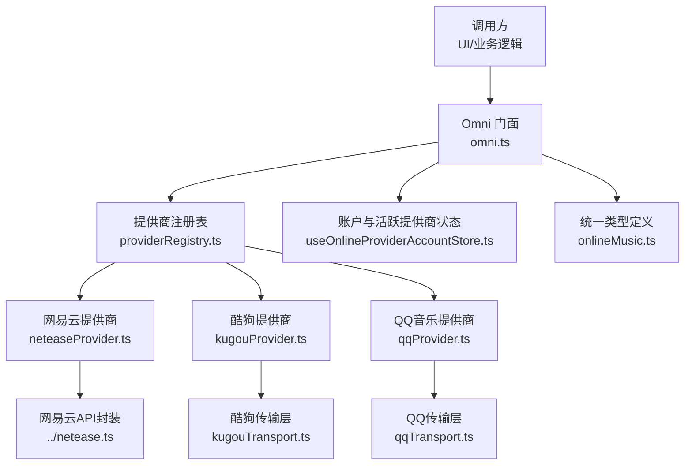
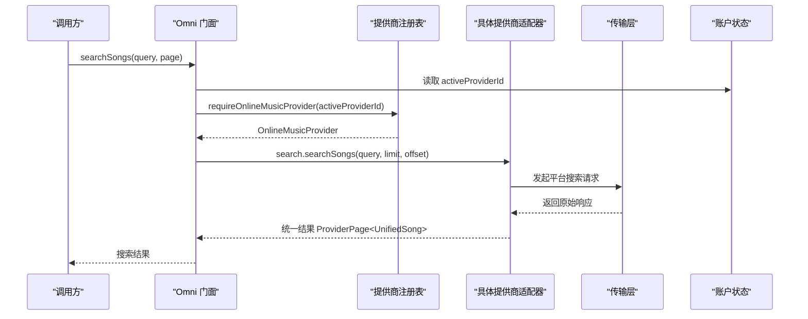
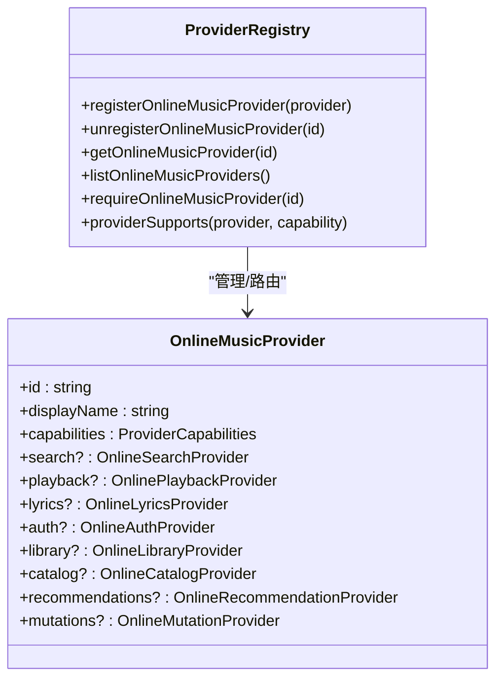
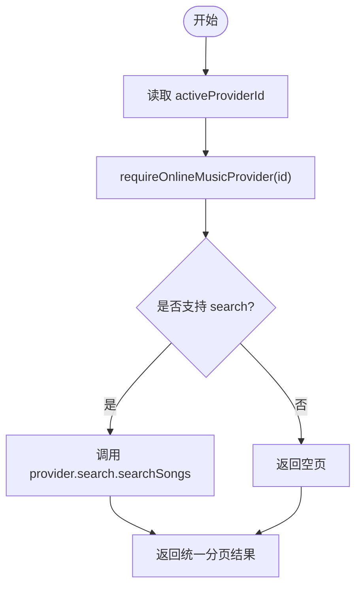
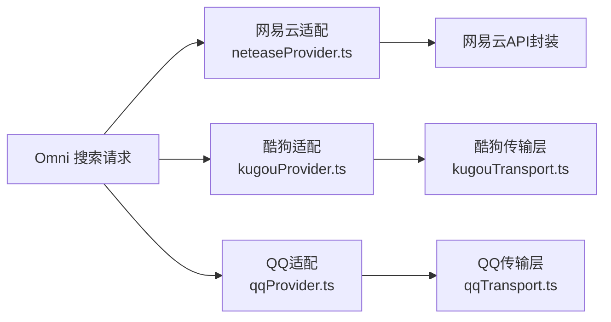
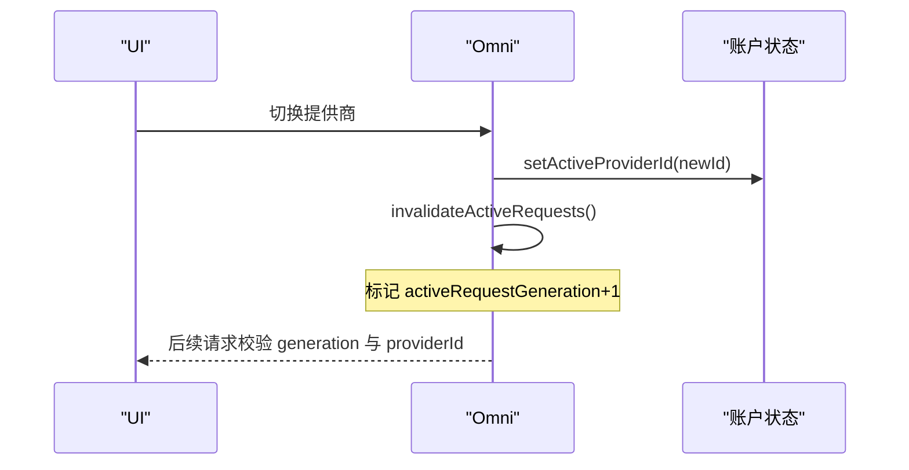
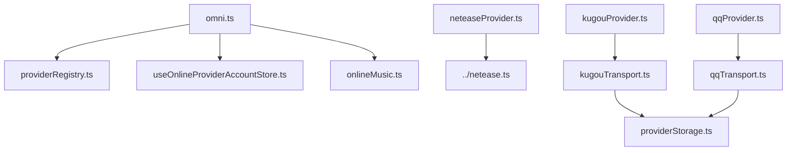

# 多提供商集成

<cite>
**本文引用的文件**
- [providerRegistry.ts](file://src/services/onlineMusic/providerRegistry.ts)
- [omni.ts](file://src/services/onlineMusic/omni.ts)
- [neteaseProvider.ts](file://src/services/onlineMusic/neteaseProvider.ts)
- [kugouProvider.ts](file://src/services/onlineMusic/kugouProvider.ts)
- [qqProvider.ts](file://src/services/onlineMusic/qqProvider.ts)
- [kugouTransport.ts](file://src/services/onlineMusic/kugouTransport.ts)
- [qqTransport.ts](file://src/services/onlineMusic/qqTransport.ts)
- [providerStorage.ts](file://src/services/onlineMusic/providerStorage.ts)
- [useOnlineProviderAccountStore.ts](file://src/stores/useOnlineProviderAccountStore.ts)
- [onlineMusic.ts](file://src/types/onlineMusic.ts)
</cite>

## 目录
1. [简介](#简介)
2. [项目结构](#项目结构)
3. [核心组件](#核心组件)
4. [架构总览](#架构总览)
5. [详细组件分析](#详细组件分析)
6. [依赖关系分析](#依赖关系分析)
7. [性能与并发控制](#性能与并发控制)
8. [故障排查指南](#故障排查指南)
9. [结论](#结论)

## 简介
本文件系统性说明多音乐提供商的统一搜索接口实现，覆盖以下关键点：
- 提供商注册机制、能力检测与动态路由
- 各平台搜索 API 的适配层设计，如何处理差异性与局限性
- 搜索请求的并发控制与错误处理策略，确保稳定性与性能
- 提供商切换时的搜索状态管理与数据一致性保证

该方案通过统一的“Omni”门面对外暴露一致的搜索、播放、歌词、收藏等能力，内部按提供商能力进行路由与适配，屏蔽不同平台的差异。

## 项目结构
围绕在线音乐能力的代码主要位于 services/onlineMusic 目录，包含：
- 统一门面 omni.ts：对外提供统一方法（搜索、播放、歌词、推荐、收藏等）
- 提供商注册表 providerRegistry.ts：集中管理已注册的提供商实例与能力查询
- 具体提供商适配器 neteaseProvider.ts、kugouProvider.ts、qqProvider.ts：各自封装平台差异
- 传输层 kugouTransport.ts、qqTransport.ts：负责网络请求、会话、鉴权、错误归一化
- 存储与账户状态 providerStorage.ts、useOnlineProviderAccountStore.ts：持久化会话与当前活跃提供商
- 类型定义 onlineMusic.ts：统一的数据模型与能力声明

图表来源
- [omni.ts:74-162](file://src/services/onlineMusic/omni.ts#L74-L162)
- [providerRegistry.ts:11-60](file://src/services/onlineMusic/providerRegistry.ts#L11-L60)
- [kugouProvider.ts:1-31](file://src/services/onlineMusic/kugouProvider.ts#L1-L31)
- [qqProvider.ts:1-20](file://src/services/onlineMusic/qqProvider.ts#L1-L20)
- [neteaseProvider.ts:215-258](file://src/services/onlineMusic/neteaseProvider.ts#L215-L258)

章节来源
- [omni.ts:74-162](file://src/services/onlineMusic/omni.ts#L74-L162)
- [providerRegistry.ts:11-60](file://src/services/onlineMusic/providerRegistry.ts#L11-L60)

## 核心组件
- Omni 门面：统一入口，屏蔽提供商差异，提供 searchSongs、searchProviderSongs、getAudioSource、getLyrics、收藏/歌单操作等
- 提供商注册表：维护 Map<providerId, OnlineMusicProvider>，支持注册/注销/查询/能力判断
- 提供商适配器：每个平台实现 OnlineMusicProvider 接口，封装各自的搜索、播放、歌词、认证、库与目录能力
- 传输层：统一处理网络请求、会话、鉴权、错误码映射、重试与降级
- 账户与状态：维护 activeProviderId、各提供商账号快照（用户、收藏、刷新状态），用于动态路由与一致性

章节来源
- [omni.ts:74-162](file://src/services/onlineMusic/omni.ts#L74-L162)
- [providerRegistry.ts:11-60](file://src/services/onlineMusic/providerRegistry.ts#L11-L60)
- [useOnlineProviderAccountStore.ts:17-30](file://src/stores/useOnlineProviderAccountStore.ts#L17-L30)
- [onlineMusic.ts:297-316](file://src/types/onlineMusic.ts#L297-L316)

## 架构总览
Omni 作为门面，根据当前活跃提供商或歌曲所属提供商进行动态路由；各提供商适配器将平台差异转换为统一数据结构；传输层负责网络与鉴权；账户状态提供上下文。

图表来源
- [omni.ts:151-162](file://src/services/onlineMusic/omni.ts#L151-L162)
- [providerRegistry.ts:21-33](file://src/services/onlineMusic/providerRegistry.ts#L21-L33)
- [kugouProvider.ts:646-657](file://src/services/onlineMusic/kugouProvider.ts#L646-L657)
- [qqProvider.ts:28-33](file://src/services/onlineMusic/qqProvider.ts#L28-L33)
- [neteaseProvider.ts:251-258](file://src/services/onlineMusic/neteaseProvider.ts#L251-L258)

## 详细组件分析

### 提供商注册与能力检测
- 注册机制：在模块加载时自动注册网易云、酷狗、QQ音乐三个提供商，便于后续通过 ID 获取
- 能力检测：通过 capabilities 字段声明支持的能力（如 search、playback、lyrics、auth、mutations 等），Omni 在调用前检查能力并做降级处理
- 动态路由：根据 activeProviderId 或歌曲 sourceRef.providerId 选择目标提供商

图表来源
- [providerRegistry.ts:11-60](file://src/services/onlineMusic/providerRegistry.ts#L11-L60)
- [onlineMusic.ts:297-316](file://src/types/onlineMusic.ts#L297-L316)

章节来源
- [providerRegistry.ts:11-60](file://src/services/onlineMusic/providerRegistry.ts#L11-L60)
- [onlineMusic.ts:31-51](file://src/types/onlineMusic.ts#L31-L51)

### 统一搜索接口与动态路由
- Omni.searchSongs：基于当前活跃提供商执行搜索；若不支持则返回空页
- Omni.searchProviderSongs：指定提供商执行搜索，便于多源聚合或调试
- 路由规则：优先使用 activeProviderId；资源类操作（如播放、歌词）按歌曲 sourceRef 归属提供商路由

图表来源
- [omni.ts:151-162](file://src/services/onlineMusic/omni.ts#L151-L162)
- [providerRegistry.ts:27-38](file://src/services/onlineMusic/providerRegistry.ts#L27-L38)

章节来源
- [omni.ts:151-162](file://src/services/onlineMusic/omni.ts#L151-L162)
- [providerRegistry.ts:27-38](file://src/services/onlineMusic/providerRegistry.ts#L27-L38)

### 各平台搜索适配层设计与差异处理
- 网易云：直接调用云端搜索接口，标准化为统一分页；支持云盘歌词与合唱段信息
- 酷狗：复杂嵌套响应解析，去重与排序保持；匿名搜索签名生成；VIP 权益探测与降级
- QQ音乐：复用歌词搜索通道进行歌曲搜索；质量回退策略；登录通道能力发现与缓存

图表来源
- [neteaseProvider.ts:251-258](file://src/services/onlineMusic/neteaseProvider.ts#L251-L258)
- [kugouProvider.ts:646-657](file://src/services/onlineMusic/kugouProvider.ts#L646-L657)
- [qqProvider.ts:28-33](file://src/services/onlineMusic/qqProvider.ts#L28-L33)
- [kugouTransport.ts:106-173](file://src/services/onlineMusic/kugouTransport.ts#L106-L173)
- [qqProvider.ts:35-55](file://src/services/onlineMusic/qqProvider.ts#L35-L55)

章节来源
- [neteaseProvider.ts:251-258](file://src/services/onlineMusic/neteaseProvider.ts#L251-L258)
- [kugouProvider.ts:646-657](file://src/services/onlineMusic/kugouProvider.ts#L646-L657)
- [qqProvider.ts:28-33](file://src/services/onlineMusic/qqProvider.ts#L28-L33)

### 提供商切换时的搜索状态管理与数据一致性
- 活动请求失效：Omni 使用 activeRequestGeneration 标记，切换提供商后使旧请求失效，避免陈旧结果污染界面
- 账户快照：账户状态包含 collections、likedSongIds、freshness、lastUpdatedAt，刷新后合并并保持引用稳定，减少重渲染
- 数据一致性：对收藏/歌单变更后的刷新失败进行容错记录，不影响主流程；统一错误类型 OnlineProviderError

图表来源
- [omni.ts:61-77](file://src/services/onlineMusic/omni.ts#L61-L77)
- [useOnlineProviderAccountStore.ts:87-95](file://src/stores/useOnlineProviderAccountStore.ts#L87-L95)

章节来源
- [omni.ts:61-77](file://src/services/onlineMusic/omni.ts#L61-L77)
- [useOnlineProviderAccountStore.ts:87-95](file://src/stores/useOnlineProviderAccountStore.ts#L87-L95)

### 错误处理策略
- 统一错误类型：OnlineProviderError 携带 code（如 network、auth-required、unsupported、invalid-response）、消息、提供商ID与原因
- 传输层错误归一：QQ/酷狗传输层将上游不同错误码映射为统一错误，并在必要时清理会话或触发设备验证
- 降级与静默失败：无能力的功能返回空集合或空页，UI 走单步流程；刷新失败仅记录警告，不中断主流程

章节来源
- [onlineMusic.ts:181-199](file://src/types/onlineMusic.ts#L181-L199)
- [kugouTransport.ts:156-173](file://src/services/onlineMusic/kugouTransport.ts#L156-L173)
- [qqTransport.ts:227-243](file://src/services/onlineMusic/qqTransport.ts#L227-L243)

## 依赖关系分析
- Omni 依赖 providerRegistry 获取提供商实例，依赖 useOnlineProviderAccountStore 获取活跃提供商与账户快照
- 各提供商适配器依赖对应传输层进行网络请求与鉴权
- 类型系统由 onlineMusic.ts 统一约束，确保跨模块一致

图表来源
- [omni.ts:23-35](file://src/services/onlineMusic/omni.ts#L23-L35)
- [kugouProvider.ts:20-31](file://src/services/onlineMusic/kugouProvider.ts#L20-L31)
- [qqProvider.ts:13-20](file://src/services/onlineMusic/qqProvider.ts#L13-L20)
- [kugouTransport.ts:1-4](file://src/services/onlineMusic/kugouTransport.ts#L1-L4)
- [qqTransport.ts:1-3](file://src/services/onlineMusic/qqTransport.ts#L1-L3)

章节来源
- [omni.ts:23-35](file://src/services/onlineMusic/omni.ts#L23-L35)
- [kugouProvider.ts:20-31](file://src/services/onlineMusic/kugouProvider.ts#L20-L31)
- [qqProvider.ts:13-20](file://src/services/onlineMusic/qqProvider.ts#L13-L20)

## 性能与并发控制
- 活动请求失效：切换提供商时通过 activeRequestGeneration 使旧请求快速失败，避免无用计算与UI闪烁
- 本地去重与缓存：
  - 酷狗推荐卡片结果缓存，避免重复拉取
  - 专辑/歌手元数据请求合并，防止重复解析
  - 合唱段范围缓存，减少重复网络请求
- 质量回退：QQ音乐按 quality 优先级尝试多个后端质量，提高成功率
- 分页优化：各提供商统一返回 hasMore/nextOffset，前端按需拉取，避免一次性加载过多数据

章节来源
- [omni.ts:61-77](file://src/services/onlineMusic/omni.ts#L61-L77)
- [kugouProvider.ts:298-308](file://src/services/onlineMusic/kugouProvider.ts#L298-L308)
- [kugouProvider.ts:364-396](file://src/services/onlineMusic/kugouProvider.ts#L364-L396)
- [kugouProvider.ts:676-706](file://src/services/onlineMusic/kugouProvider.ts#L676-L706)
- [qqProvider.ts:35-55](file://src/services/onlineMusic/qqProvider.ts#L35-L55)

## 故障排查指南
- 搜索结果为空：检查提供商是否声明 search 能力；确认 activeProviderId 是否正确；查看传输层是否配置了正确的 API Base
- 登录相关错误：QQ/网易云二维码流程中，注意后端返回的状态码与过期时间；必要时清理会话并重试
- 播放链接为空：QQ音乐可能返回空 URL 表示不可播放；检查质量回退链路与账号权限
- 收藏/歌单刷新失败：刷新失败会设置 freshness=error 并记录日志，可重试；主流程不受影响

章节来源
- [omni.ts:151-162](file://src/services/onlineMusic/omni.ts#L151-L162)
- [qqProvider.ts:240-267](file://src/services/onlineMusic/qqProvider.ts#L240-L267)
- [kugouTransport.ts:216-221](file://src/services/onlineMusic/kugouTransport.ts#L216-L221)
- [qqTransport.ts:159-164](file://src/services/onlineMusic/qqTransport.ts#L159-L164)

## 结论
该多提供商统一搜索接口通过 Omni 门面、提供商注册表与传输层抽象，有效屏蔽了各平台差异，提供了稳定的搜索、播放、歌词与收藏能力。通过能力检测、动态路由、活动请求失效与本地缓存/去重，系统在多提供商环境下具备良好的稳定性与性能。未来可扩展更多提供商，只需实现 OnlineMusicProvider 接口并注册即可无缝接入。