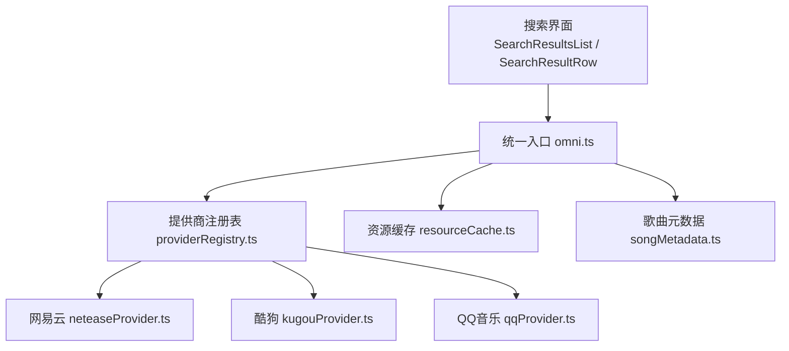
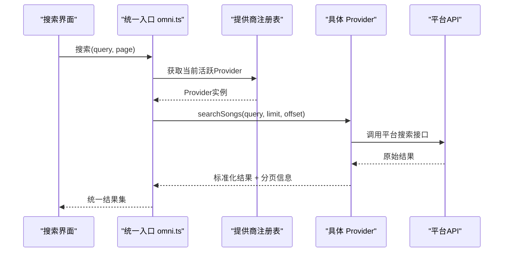
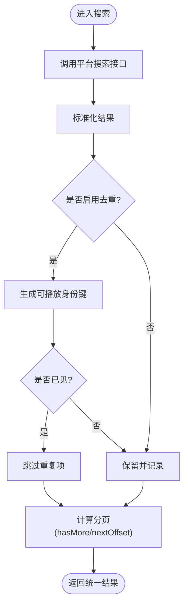
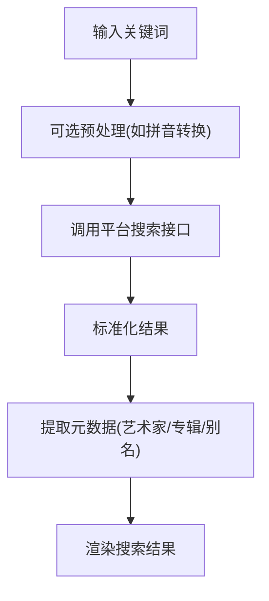
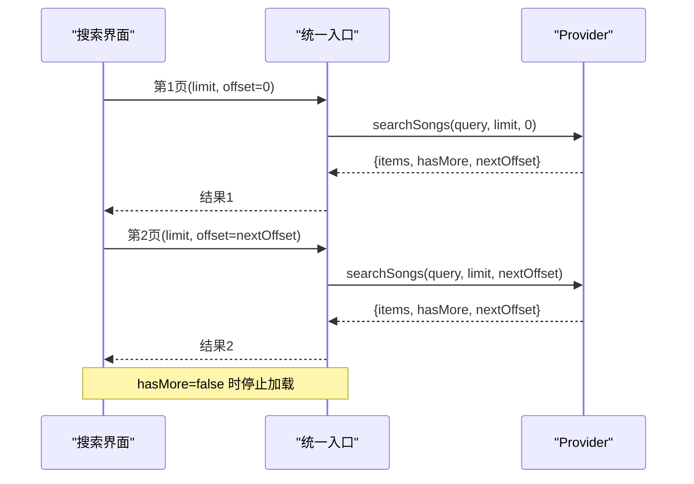
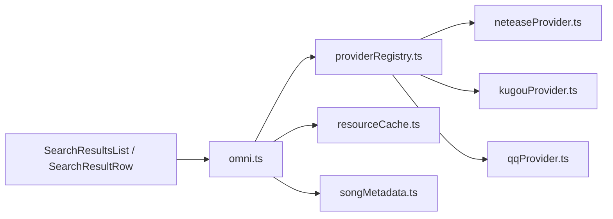

# 搜索算法实现

<cite>
**本文引用的文件**
- [omni.ts](file://src/services/onlineMusic/omni.ts)
- [providerRegistry.ts](file://src/services/onlineMusic/providerRegistry.ts)
- [neteaseProvider.ts](file://src/services/onlineMusic/neteaseProvider.ts)
- [kugouProvider.ts](file://src/services/onlineMusic/kugouProvider.ts)
- [qqProvider.ts](file://src/services/onlineMusic/qqProvider.ts)
- [resourceCache.ts](file://src/services/onlineMusic/resourceCache.ts)
- [songMetadata.ts](file://src/services/onlineMusic/songMetadata.ts)
- [SearchResultsList.tsx](file://src/components/app/search/SearchResultsList.tsx)
- [SearchResultRow.tsx](file://src/components/app/search/SearchResultRow.tsx)
- [searchCollectionAdapters.ts](file://src/components/app/search/searchCollectionAdapters.ts)
</cite>

## 目录
1. [简介](#简介)
2. [项目结构](#项目结构)
3. [核心组件](#核心组件)
4. [架构总览](#架构总览)
5. [详细组件分析](#详细组件分析)
6. [依赖关系分析](#依赖关系分析)
7. [性能考量](#性能考量)
8. [故障排查指南](#故障排查指南)
9. [结论](#结论)
10. [附录](#附录)

## 简介
本技术文档聚焦在线音乐搜索算法的实现，围绕多提供商搜索结果的去重与合并、关键词智能匹配（模糊匹配、拼音、歌手别名）、多维度排序评分、分页加载与无限滚动、以及搜索性能优化与用户体验增强等主题展开。文档基于仓库中的在线音乐服务层与各平台 Provider 的具体实现进行解析，确保读者既能理解整体架构，也能深入关键算法细节。

## 项目结构
在线搜索能力由“统一入口 Omni”聚合各平台 Provider（网易云、酷狗、QQ音乐），并通过注册表管理。UI 层通过统一的搜索接口获取结果，并在列表中进行展示与交互。资源缓存与元数据工具为搜索结果的稳定性与一致性提供支撑。

图表来源
- [omni.ts:151-162](file://src/services/onlineMusic/omni.ts#L151-L162)
- [providerRegistry.ts:11-33](file://src/services/onlineMusic/providerRegistry.ts#L11-L33)
- [neteaseProvider.ts:251-257](file://src/services/onlineMusic/neteaseProvider.ts#L251-L257)
- [kugouProvider.ts:645-657](file://src/services/onlineMusic/kugouProvider.ts#L645-L657)
- [qqProvider.ts:28-33](file://src/services/onlineMusic/qqProvider.ts#L28-L33)
- [resourceCache.ts:13-34](file://src/services/onlineMusic/resourceCache.ts#L13-L34)
- [songMetadata.ts:10-28](file://src/services/onlineMusic/songMetadata.ts#L10-L28)

章节来源
- [omni.ts:151-162](file://src/services/onlineMusic/omni.ts#L151-L162)
- [providerRegistry.ts:11-33](file://src/services/onlineMusic/providerRegistry.ts#L11-L33)

## 核心组件
- 统一入口 Omni：对外暴露搜索、播放、歌词、收藏等能力，屏蔽多提供商差异；负责按当前活跃 Provider 路由请求，并处理分页参数。
- 提供商注册表：集中管理各 Provider 的注册、查询与能力检测，保证扩展性与可替换性。
- 平台 Provider：
  - 网易云：直接调用云端搜索接口，返回标准化结果与分页信息。
  - 酷狗：对原始结果进行去重（基于可播放标识）与规范化，保障排序稳定。
  - QQ音乐：复用歌词搜索能力作为歌曲搜索入口，并进行结果标准化。
- 资源缓存与元数据：为音频、封面、响度等信息提供缓存迁移与读取；统一提取歌曲元数据用于显示与匹配。

章节来源
- [omni.ts:151-162](file://src/services/onlineMusic/omni.ts#L151-L162)
- [providerRegistry.ts:11-33](file://src/services/onlineMusic/providerRegistry.ts#L11-L33)
- [neteaseProvider.ts:251-257](file://src/services/onlineMusic/neteaseProvider.ts#L251-L257)
- [kugouProvider.ts:645-657](file://src/services/onlineMusic/kugouProvider.ts#L645-L657)
- [qqProvider.ts:28-33](file://src/services/onlineMusic/qqProvider.ts#L28-L33)
- [resourceCache.ts:13-34](file://src/services/onlineMusic/resourceCache.ts#L13-L34)
- [songMetadata.ts:10-28](file://src/services/onlineMusic/songMetadata.ts#L10-L28)

## 架构总览
搜索流程从 UI 发起，经 Omni 路由到当前活跃 Provider，再由具体 Provider 调用后端 API 获取结果并标准化。不同 Provider 在去重、分页、元数据补全等方面各有策略，最终统一返回给 UI 展示。

图表来源
- [omni.ts:151-162](file://src/services/onlineMusic/omni.ts#L151-L162)
- [providerRegistry.ts:21-33](file://src/services/onlineMusic/providerRegistry.ts#L21-L33)
- [neteaseProvider.ts:251-257](file://src/services/onlineMusic/neteaseProvider.ts#L251-L257)
- [kugouProvider.ts:645-657](file://src/services/onlineMusic/kugouProvider.ts#L645-L657)
- [qqProvider.ts:28-33](file://src/services/onlineMusic/qqProvider.ts#L28-L33)

## 详细组件分析

### 多提供商搜索结果的去重与合并
- 网易云：搜索直接返回标准化结果，分页由服务端 total 控制；未在前端做额外去重逻辑。
- 酷狗：使用“可播放身份键”进行去重，保留首次出现的顺序，从而维持搜索排名稳定性。
- QQ音乐：复用歌词搜索接口作为歌曲搜索入口，结果标准化后交由上层处理。

图表来源
- [kugouProvider.ts:645-657](file://src/services/onlineMusic/kugouProvider.ts#L645-L657)
- [neteaseProvider.ts:251-257](file://src/services/onlineMusic/neteaseProvider.ts#L251-L257)
- [qqProvider.ts:28-33](file://src/services/onlineMusic/qqProvider.ts#L28-L33)

章节来源
- [kugouProvider.ts:645-657](file://src/services/onlineMusic/kugouProvider.ts#L645-L657)
- [neteaseProvider.ts:251-257](file://src/services/onlineMusic/neteaseProvider.ts#L251-L257)
- [qqProvider.ts:28-33](file://src/services/onlineMusic/qqProvider.ts#L28-L33)

### 搜索关键词的智能匹配机制
- 模糊匹配：各 Provider 的搜索由后端完成，前端主要进行结果标准化与展示。
- 拼音搜索：本项目未在前端实现拼音转换；若需支持，可在调用搜索前将中文转换为拼音再传入后端。
- 歌手别名识别：通过歌曲元数据工具统一提取艺术家、专辑、别名等信息，辅助后续匹配与展示。

图表来源
- [songMetadata.ts:10-28](file://src/services/onlineMusic/songMetadata.ts#L10-L28)
- [neteaseProvider.ts:251-257](file://src/services/onlineMusic/neteaseProvider.ts#L251-L257)
- [qqProvider.ts:28-33](file://src/services/onlineMusic/qqProvider.ts#L28-L33)

章节来源
- [songMetadata.ts:10-28](file://src/services/onlineMusic/songMetadata.ts#L10-L28)

### 搜索结果排序算法与评分体系
- 排序来源：当前实现优先保持平台返回的原始排序（尤其是酷狗的去重保留首现顺序）。
- 评分维度：未在代码中实现前端自定义评分；如需引入相关性、热度、质量等多维评分，可在标准化后增加评分阶段，再进行排序。
- 可扩展点：在 Omni 或 Provider 层插入评分函数，结合元数据（时长、清晰度、版权状态等）与业务权重进行打分。

章节来源
- [kugouProvider.ts:645-657](file://src/services/onlineMusic/kugouProvider.ts#L645-L657)

### 分页加载与无限滚动
- 分页协议：每个 Provider 返回 items、hasMore、nextOffset，部分还包含 total。
- 无限滚动：UI 层根据 hasMore 与 nextOffset 继续拉取下一页；当 hasMore 为 false 时停止。
- 边界处理：空页终止翻页、总数缺失时的降级策略在各 Provider 中均有体现。

图表来源
- [omni.ts:151-162](file://src/services/onlineMusic/omni.ts#L151-L162)
- [neteaseProvider.ts:251-257](file://src/services/onlineMusic/neteaseProvider.ts#L251-L257)
- [kugouProvider.ts:639-643](file://src/services/onlineMusic/kugouProvider.ts#L639-L643)
- [qqProvider.ts:28-33](file://src/services/onlineMusic/qqProvider.ts#L28-L33)

章节来源
- [omni.ts:151-162](file://src/services/onlineMusic/omni.ts#L151-L162)
- [neteaseProvider.ts:251-257](file://src/services/onlineMusic/neteaseProvider.ts#L251-L257)
- [kugouProvider.ts:639-643](file://src/services/onlineMusic/kugouProvider.ts#L639-L643)
- [qqProvider.ts:28-33](file://src/services/onlineMusic/qqProvider.ts#L28-L33)

### 搜索性能优化策略
- 索引构建：前端不维护本地索引；依赖后端搜索能力。可在未来引入本地倒排索引以加速建议与历史匹配。
- 缓存预热：资源缓存（音频、封面、响度）在访问时回填旧键到新键，减少重复请求与网络开销。
- 异步加载：Provider 内部对推荐、歌词、合唱区间等采用并发与缓存策略，避免阻塞主流程。
- 去重与降载：酷狗侧去重减少冗余渲染；QQ音乐对详情请求进行同 mid 去重，降低重复网络调用。

章节来源
- [resourceCache.ts:13-34](file://src/services/onlineMusic/resourceCache.ts#L13-L34)
- [kugouProvider.ts:645-657](file://src/services/onlineMusic/kugouProvider.ts#L645-L657)
- [qqProvider.ts:124-136](file://src/services/onlineMusic/qqProvider.ts#L124-L136)

### 搜索用户体验优化
- 搜索建议：可通过在输入阶段调用轻量级建议接口（例如歌词搜索或热门词）来增强体验；当前搜索入口复用歌词搜索能力。
- 历史记录：可在 Omni 层记录最近搜索词，并提供快速选择；当前未内置历史存储。
- 热门搜索：可在启动时预取热门词列表，或在用户输入时动态提示；需要结合后端热词接口实现。

章节来源
- [qqProvider.ts:28-33](file://src/services/onlineMusic/qqProvider.ts#L28-L33)

## 依赖关系分析
- Omni 依赖注册表获取 Provider，再调用其搜索能力；Provider 之间相互独立，便于扩展与维护。
- 资源缓存与元数据工具被 Omni 与 Provider 共同使用，提升一致性与性能。
- UI 层仅依赖统一接口，解耦了具体平台差异。

图表来源
- [omni.ts:151-162](file://src/services/onlineMusic/omni.ts#L151-L162)
- [providerRegistry.ts:11-33](file://src/services/onlineMusic/providerRegistry.ts#L11-L33)
- [resourceCache.ts:13-34](file://src/services/onlineMusic/resourceCache.ts#L13-L34)
- [songMetadata.ts:10-28](file://src/services/onlineMusic/songMetadata.ts#L10-L28)

章节来源
- [omni.ts:151-162](file://src/services/onlineMusic/omni.ts#L151-L162)
- [providerRegistry.ts:11-33](file://src/services/onlineMusic/providerRegistry.ts#L11-L33)

## 性能考量
- 去重策略：酷狗侧基于可播放身份键去重，避免重复渲染与无效请求。
- 并发与缓存：推荐、歌词、合唱区间等采用 Promise 缓存，减少重复网络请求。
- 分页优化：合理设置 limit 与 offset，避免一次性加载过多数据导致 UI 卡顿。
- 资源命中：音频、封面、响度等资源命中缓存后可显著降低延迟与带宽消耗。

章节来源
- [kugouProvider.ts:645-657](file://src/services/onlineMusic/kugouProvider.ts#L645-L657)
- [resourceCache.ts:13-34](file://src/services/onlineMusic/resourceCache.ts#L13-L34)

## 故障排查指南
- 搜索无结果：检查 Provider 是否支持搜索能力，确认当前活跃 Provider 是否正确。
- 分页异常：核对 hasMore 与 nextOffset 的计算逻辑，确保空页时正确终止。
- 重复结果：确认去重键生成是否稳定，必要时调整去重策略。
- 资源加载失败：查看缓存迁移与回退逻辑，确认旧键是否能正确迁移到新键。

章节来源
- [omni.ts:151-162](file://src/services/onlineMusic/omni.ts#L151-L162)
- [resourceCache.ts:13-34](file://src/services/onlineMusic/resourceCache.ts#L13-L34)

## 结论
本项目通过 Omni 统一入口与各 Provider 的解耦设计，实现了跨平台的在线音乐搜索能力。去重与分页策略在不同 Provider 中有差异化实现，保证了结果的准确性与性能。未来可在前端引入更丰富的智能匹配（如拼音、别名归一化）与多维评分排序，进一步提升搜索体验。

## 附录
- 相关 UI 组件：
  - SearchResultsList：负责结果列表渲染与分页加载。
  - SearchResultRow：单行结果展示与交互。
  - searchCollectionAdapters：适配集合类数据的搜索与展示。

章节来源
- [SearchResultsList.tsx](file://src/components/app/search/SearchResultsList.tsx)
- [SearchResultRow.tsx](file://src/components/app/search/SearchResultRow.tsx)
- [searchCollectionAdapters.ts](file://src/components/app/search/searchCollectionAdapters.ts)