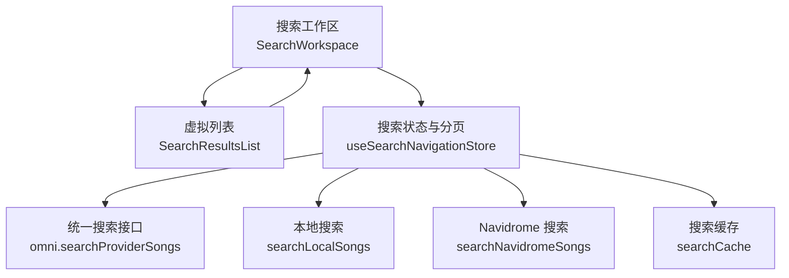
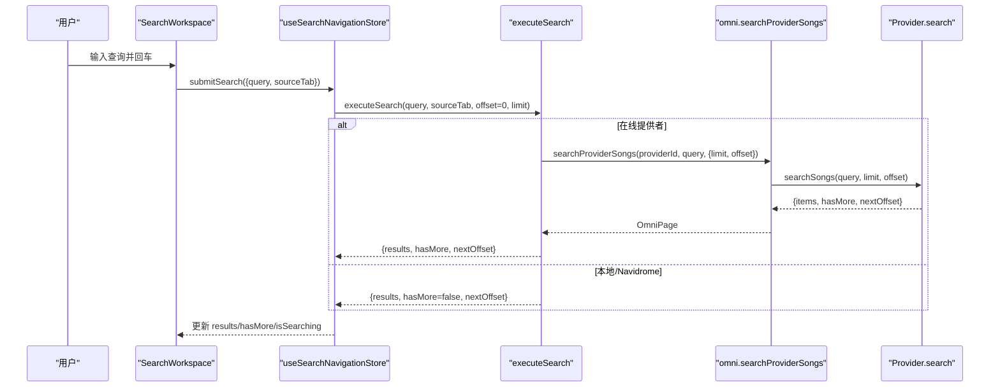
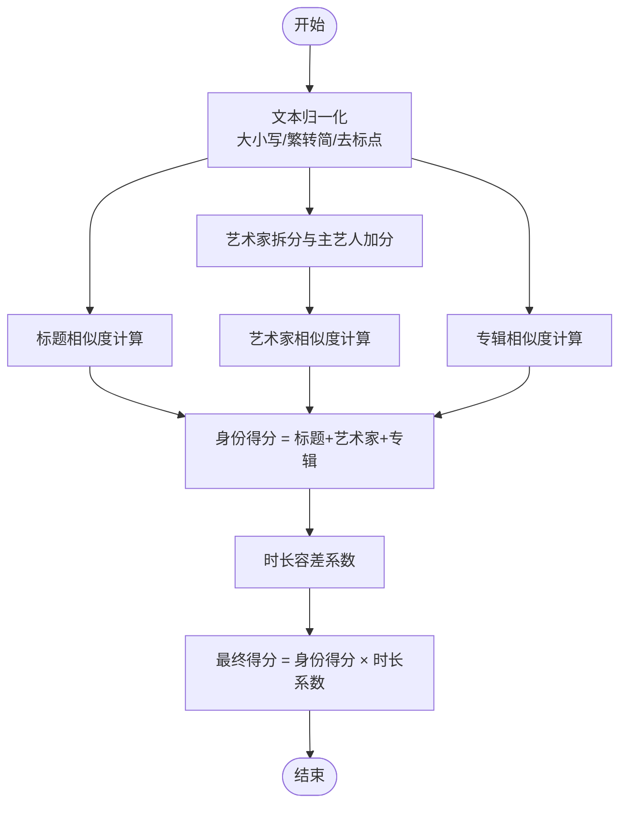
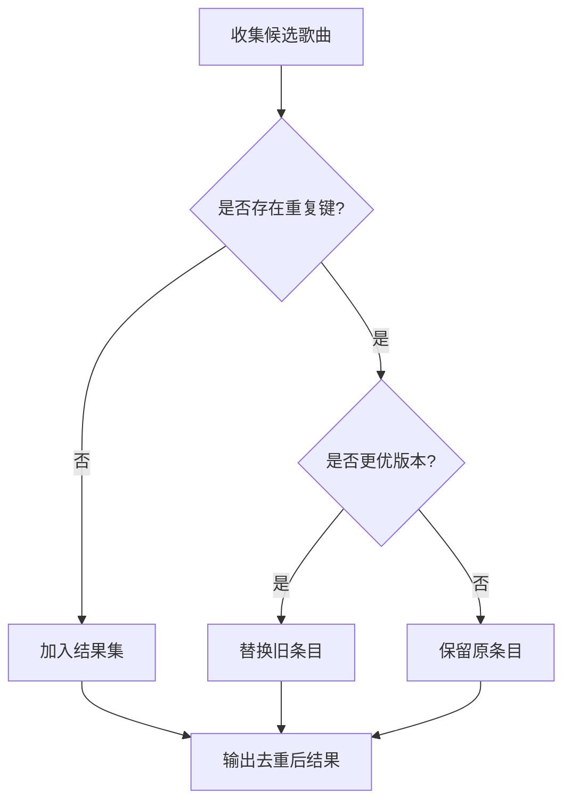
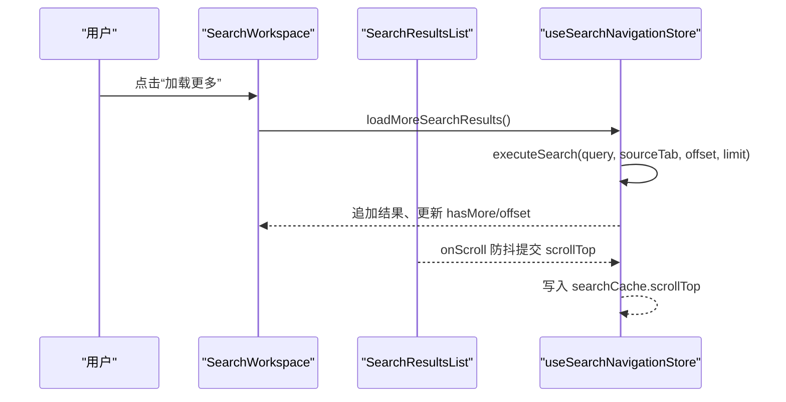
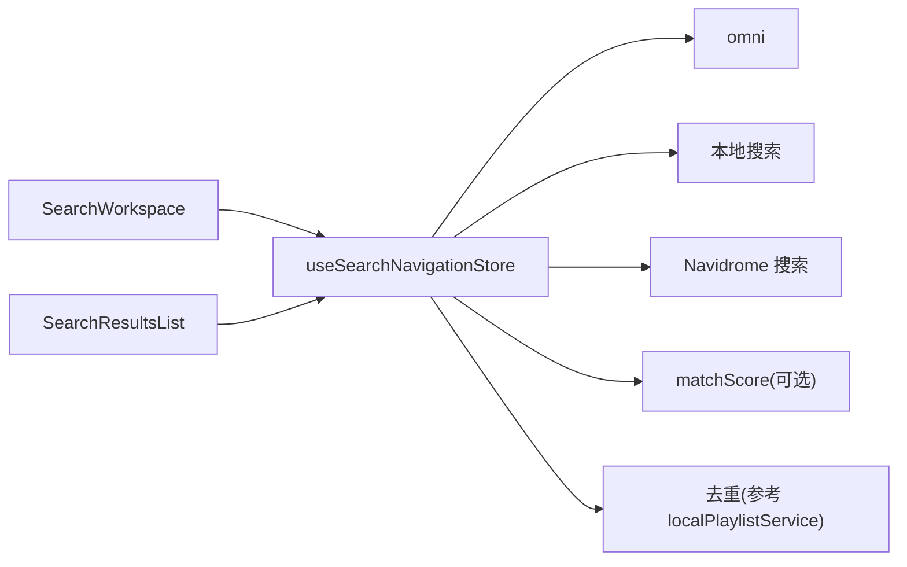

# 结果排序

<cite>
**本文引用的文件**
- [SearchWorkspace.tsx](file://src/components/app/search/SearchWorkspace.tsx)
- [SearchResultsList.tsx](file://src/components/app/search/SearchResultsList.tsx)
- [useSearchNavigationStore.ts](file://src/stores/useSearchNavigationStore.ts)
- [omni.ts](file://src/services/onlineMusic/omni.ts)
- [matchScore.ts](file://src/utils/lyrics/matchScore.ts)
- [localPlaylistService.ts](file://src/services/localPlaylistService.ts)
</cite>

## 目录
1. [简介](#简介)
2. [项目结构](#项目结构)
3. [核心组件](#核心组件)
4. [架构总览](#架构总览)
5. [详细组件分析](#详细组件分析)
6. [依赖关系分析](#依赖关系分析)
7. [性能考虑](#性能考虑)
8. [故障排查指南](#故障排查指南)
9. [结论](#结论)
10. [附录](#附录)

## 简介
本文件聚焦于搜索结果排序与展示的核心实现，涵盖：
- 多维度排序因子：相关性评分、质量权重、用户偏好等
- 去重算法：如何识别和处理重复或相似的音乐条目
- 性能优化：增量排序、缓存排序结果、懒加载等
- 分页加载与无限滚动：确保大量搜索结果的高效展示

## 项目结构
搜索功能由“工作区 + 列表 + 状态管理 + 在线服务聚合”组成：
- SearchWorkspace：搜索入口、来源切换、错误重试、加载更多按钮
- SearchResultsList：基于 react-window 的虚拟列表，负责滚动位置同步与节流
- useSearchNavigationStore：搜索状态、分页、缓存、执行搜索与加载更多
- omni：统一的多音乐提供商搜索接口（searchSongs / searchProviderSongs）
- matchScore：歌词/元数据匹配评分（可用于本地与在线结果的相似度评估）
- localPlaylistService：本地导入场景的去重与优选逻辑（可作为参考）

**图表来源**
- [SearchWorkspace.tsx:90-233](file://src/components/app/search/SearchWorkspace.tsx#L90-L233)
- [SearchResultsList.tsx:52-71](file://src/components/app/search/SearchResultsList.tsx#L52-L71)
- [useSearchNavigationStore.ts:150-166](file://src/stores/useSearchNavigationStore.ts#L150-L166)
- [omni.ts:151-162](file://src/services/onlineMusic/omni.ts#L151-L162)

**章节来源**
- [SearchWorkspace.tsx:90-233](file://src/components/app/search/SearchWorkspace.tsx#L90-L233)
- [SearchResultsList.tsx:52-71](file://src/components/app/search/SearchResultsList.tsx#L52-L71)
- [useSearchNavigationStore.ts:150-166](file://src/stores/useSearchNavigationStore.ts#L150-L166)
- [omni.ts:151-162](file://src/services/onlineMusic/omni.ts#L151-L162)

## 核心组件
- 搜索工作区（SearchWorkspace）
  - 提供搜索输入、来源标签页切换、错误重试、加载更多
  - 通过 store 控制 isSearching、isLoadingMore、hasMore、scrollTop 等状态
- 搜索结果列表（SearchResultsList）
  - 使用 react-window 进行虚拟渲染，设置固定行高与 overscanCount
  - 滚动位置防抖提交，避免频繁状态更新
- 搜索导航存储（useSearchNavigationStore）
  - 维护搜索查询、来源、结果、分页 offset/limit、是否还有更多
  - 搜索缓存 key 为 “来源:查询(小写)”；支持恢复上次滚动位置
  - 执行搜索：本地/Navidrome/在线提供者三种路径
  - 加载更多：仅对在线提供者启用，按 hasMore/nextOffset 追加结果

**章节来源**
- [SearchWorkspace.tsx:90-233](file://src/components/app/search/SearchWorkspace.tsx#L90-L233)
- [SearchResultsList.tsx:26-71](file://src/components/app/search/SearchResultsList.tsx#L26-L71)
- [useSearchNavigationStore.ts:150-166](file://src/stores/useSearchNavigationStore.ts#L150-L166)
- [useSearchNavigationStore.ts:245-301](file://src/stores/useSearchNavigationStore.ts#L245-L301)
- [useSearchNavigationStore.ts:303-361](file://src/stores/useSearchNavigationStore.ts#L303-L361)

## 架构总览
搜索请求从 UI 进入 store，store 根据来源路由到不同执行器：
- 本地：字符串包含匹配（标题/艺术家/专辑），无分页
- Navidrome：调用后端 API，返回固定数量，无分页
- 在线：通过 omni 调用具体 provider 的 search，支持分页 with hasMore/nextOffset

**图表来源**
- [SearchWorkspace.tsx:112-115](file://src/components/app/search/SearchWorkspace.tsx#L112-L115)
- [useSearchNavigationStore.ts:245-301](file://src/stores/useSearchNavigationStore.ts#L245-L301)
- [useSearchNavigationStore.ts:150-166](file://src/stores/useSearchNavigationStore.ts#L150-L166)
- [omni.ts:151-162](file://src/services/onlineMusic/omni.ts#L151-L162)

## 详细组件分析

### 排序与评分机制
- 在线搜索结果排序
  - 当前实现将排序委托给各在线提供商的 search 接口，前端不直接对结果做二次排序。
  - 可通过 provider 能力扩展自定义排序策略（例如结合本地质量分）。
- 本地/Navidrome 搜索结果
  - 本地：按字段包含匹配过滤，未做复杂排序。
  - Navidrome：直接映射后端返回结果，未在前端排序。
- 相似度评分（可用于后续排序增强）
  - 标题、艺术家、专辑三维度加权评分，结合时长容差系数，输出 0-100 分数。
  - 适用于自动匹配、候选项筛选与排序辅助。

**图表来源**
- [matchScore.ts:12-16](file://src/utils/lyrics/matchScore.ts#L12-L16)
- [matchScore.ts:38-81](file://src/utils/lyrics/matchScore.ts#L38-L81)
- [matchScore.ts:92-114](file://src/utils/lyrics/matchScore.ts#L92-L114)
- [matchScore.ts:119-153](file://src/utils/lyrics/matchScore.ts#L119-L153)
- [matchScore.ts:155-207](file://src/utils/lyrics/matchScore.ts#L155-L207)

**章节来源**
- [matchScore.ts:12-16](file://src/utils/lyrics/matchScore.ts#L12-L16)
- [matchScore.ts:38-81](file://src/utils/lyrics/matchScore.ts#L38-L81)
- [matchScore.ts:92-114](file://src/utils/lyrics/matchScore.ts#L92-L114)
- [matchScore.ts:119-153](file://src/utils/lyrics/matchScore.ts#L119-L153)
- [matchScore.ts:155-207](file://src/utils/lyrics/matchScore.ts#L155-L207)

### 去重算法与相似条目处理
- 在线搜索结果去重
  - 当前未在 store 层对在线搜索结果做显式去重；若需去重，可在合并结果时基于唯一键（如 providerId + mediaId）构建 Set 过滤。
- 本地导入去重（参考实现）
  - 通过“重复键”生成规范歌曲映射，选择更优版本（如添加时间、ID 比较），用于修复播放列表中的重复条目。
  - 该模式可借鉴到搜索结果合并阶段，以消除跨源重复。

**图表来源**
- [localPlaylistService.ts:81-97](file://src/services/localPlaylistService.ts#L81-L97)

**章节来源**
- [localPlaylistService.ts:81-97](file://src/services/localPlaylistService.ts#L81-L97)

### 分页加载与无限滚动
- 分页参数
  - 默认 limit 为 30；offset 初始为 0；在线提供者返回 hasMore 与 nextOffset。
- 加载更多
  - 当 hasMore 为真且非本地/Navidrome 时，点击“加载更多”触发 loadMoreSearchResults，追加结果并更新 offset。
- 虚拟列表与滚动位置
  - 使用 react-window 固定行高与 overscanCount，减少渲染开销。
  - 滚动位置防抖提交（120ms），并在组件卸载时提交最新位置，保证缓存一致性。

**图表来源**
- [SearchWorkspace.tsx:217-231](file://src/components/app/search/SearchWorkspace.tsx#L217-L231)
- [SearchResultsList.tsx:62-70](file://src/components/app/search/SearchResultsList.tsx#L62-L70)
- [useSearchNavigationStore.ts:303-361](file://src/stores/useSearchNavigationStore.ts#L303-L361)

**章节来源**
- [SearchWorkspace.tsx:217-231](file://src/components/app/search/SearchWorkspace.tsx#L217-L231)
- [SearchResultsList.tsx:62-70](file://src/components/app/search/SearchResultsList.tsx#L62-L70)
- [useSearchNavigationStore.ts:303-361](file://src/stores/useSearchNavigationStore.ts#L303-L361)

### 用户偏好与质量权重
- 当前搜索流程未直接读取用户偏好（如最近播放、收藏）参与排序。
- 可扩展点：
  - 在 omni 层或 provider 层引入个性化排序信号（如近期播放频率、收藏标记）。
  - 在本地/Navidrome 结果中，结合本地库质量信息（如音质、封面完整性）进行二次打分。

[本节为概念性说明，不直接分析具体文件]

## 依赖关系分析
- SearchWorkspace 依赖 useSearchNavigationStore 的状态与动作
- SearchResultsList 依赖 react-window 进行虚拟化渲染
- useSearchNavigationStore 依赖 omni 进行在线搜索，依赖本地与 Navidrome 服务
- matchScore 提供相似度评分工具，可用于后续排序增强
- localPlaylistService 提供去重范式，可迁移至搜索结果合并阶段

**图表来源**
- [SearchWorkspace.tsx:90-233](file://src/components/app/search/SearchWorkspace.tsx#L90-L233)
- [SearchResultsList.tsx:52-71](file://src/components/app/search/SearchResultsList.tsx#L52-L71)
- [useSearchNavigationStore.ts:150-166](file://src/stores/useSearchNavigationStore.ts#L150-L166)
- [matchScore.ts:155-207](file://src/utils/lyrics/matchScore.ts#L155-L207)
- [localPlaylistService.ts:81-97](file://src/services/localPlaylistService.ts#L81-L97)

**章节来源**
- [SearchWorkspace.tsx:90-233](file://src/components/app/search/SearchWorkspace.tsx#L90-L233)
- [SearchResultsList.tsx:52-71](file://src/components/app/search/SearchResultsList.tsx#L52-L71)
- [useSearchNavigationStore.ts:150-166](file://src/stores/useSearchNavigationStore.ts#L150-L166)
- [matchScore.ts:155-207](file://src/utils/lyrics/matchScore.ts#L155-L207)
- [localPlaylistService.ts:81-97](file://src/services/localPlaylistService.ts#L81-L97)

## 性能考虑
- 虚拟列表与滚动优化
  - 固定行高与 overscanCount 提升长列表渲染性能
  - 滚动位置防抖提交，降低状态更新频率
- 分页与增量加载
  - 仅在线提供者启用分页，避免一次性加载大量数据
  - 使用 hasMore/nextOffset 控制加载边界
- 缓存策略
  - 搜索缓存保存 results、hasMore、offset、scrollTop，支持快速恢复
  - 建议增加“结果排序缓存”，避免重复排序计算
- 懒加载与预取
  - 列表项按需渲染，图片等资源可延迟加载
  - 建议在 provider 层实现结果预取与缓存，减少网络抖动影响

[本节为通用性能建议，不直接分析具体文件]

## 故障排查指南
- 搜索失败
  - 检查 store 中 searchError 与 isSearching 状态
  - 确认 omni 调用是否抛出异常（如不支持的能力）
- 加载更多无效
  - 检查 hasMore 是否为真；sourceTab 是否为在线提供者
  - 确认 offset 是否正确递增
- 滚动位置丢失
  - 检查 SearchResultsList 的 onScroll 防抖逻辑是否正常触发
  - 确认 store 的 setSearchScrollTop 是否写入 searchCache

**章节来源**
- [useSearchNavigationStore.ts:245-301](file://src/stores/useSearchNavigationStore.ts#L245-L301)
- [useSearchNavigationStore.ts:303-361](file://src/stores/useSearchNavigationStore.ts#L303-L361)
- [SearchResultsList.tsx:62-70](file://src/components/app/search/SearchResultsList.tsx#L62-L70)

## 结论
- 当前搜索排序主要依赖在线提供商的内置排序；本地与 Navidrome 结果为简单过滤或直返。
- 相似度评分工具已具备，可无缝接入排序增强。
- 分页加载与虚拟列表保障了大规模结果的高效展示。
- 去重逻辑可借鉴本地导入方案，扩展到搜索结果合并阶段。
- 建议后续引入用户偏好与质量权重，进一步提升排序相关性与用户体验。

## 附录
- 关键常量与配置
  - 默认搜索限制：30
  - 滚动防抖时间：120ms
  - 虚拟列表行高：76px，overscanCount：6

[本节为补充信息，不直接分析具体文件]