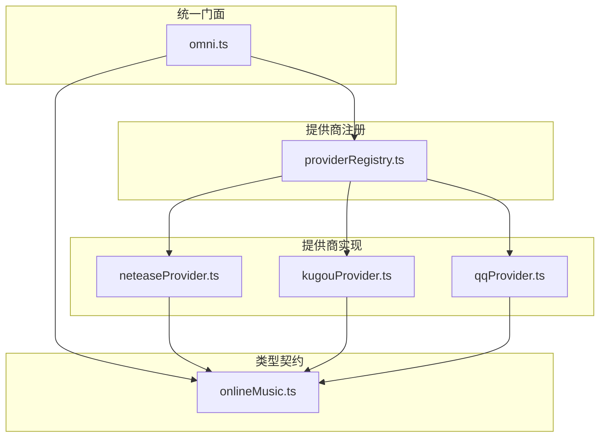
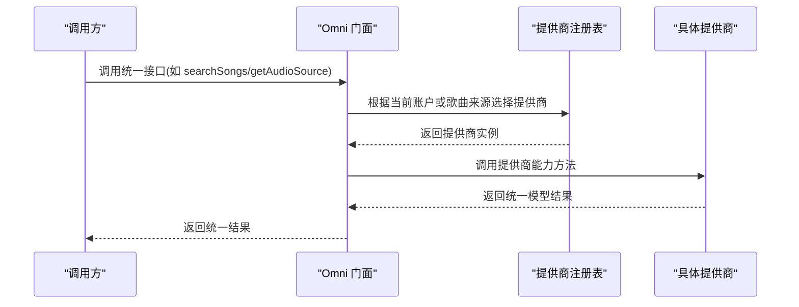
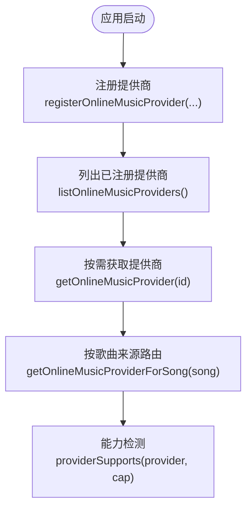
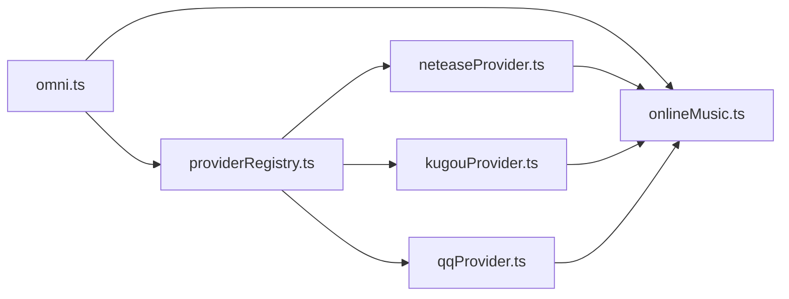

# 统一接口设计

<cite>
**本文引用的文件**
- [omni.ts](file://src/services/onlineMusic/omni.ts)
- [providerRegistry.ts](file://src/services/onlineMusic/providerRegistry.ts)
- [onlineMusic.ts](file://src/types/onlineMusic.ts)
- [kugouProvider.ts](file://src/services/onlineMusic/kugouProvider.ts)
- [neteaseProvider.ts](file://src/services/onlineMusic/neteaseProvider.ts)
- [qqProvider.ts](file://src/services/onlineMusic/qqProvider.ts)
- [kugou-omni-capability-alignment.md](file://docs/kugou-omni-capability-alignment.md)
</cite>

## 目录
1. [简介](#简介)
2. [项目结构](#项目结构)
3. [核心组件](#核心组件)
4. [架构总览](#架构总览)
5. [详细组件分析](#详细组件分析)
6. [依赖关系分析](#依赖关系分析)
7. [性能考量](#性能考量)
8. [故障排查指南](#故障排查指南)
9. [结论](#结论)
10. [附录：API参考与使用示例](#附录api参考与使用示例)

## 简介
本技术文档围绕 Folia Player 的在线音乐统一接口（Omni）展开，系统性解析其适配器模式、提供商注册与动态加载机制、能力检测系统、统一数据模型以及完整 API 参考。通过 Omni 层屏蔽不同音乐服务（网易云、酷狗、QQ 等）的 API 差异，为上层 UI 与业务逻辑提供一致、可扩展、可测试的统一访问入口。

## 项目结构
在线音乐相关代码主要位于 src/services/onlineMusic 与 src/types/onlineMusic.ts：
- omni.ts：统一门面（Facade），对外暴露搜索、播放、收藏、歌单、推荐、歌词等能力。
- providerRegistry.ts：提供商注册表，负责提供商实例的注册、查找、能力判定与按歌曲路由到具体提供商。
- 各 Provider 实现：neteaseProvider.ts、kugouProvider.ts、qqProvider.ts，分别实现网易云、酷狗、QQ 的具体适配逻辑。
- onlineMusic.ts：定义统一的类型契约（如 UnifiedSong、OmniCollection、OmniUser、ProviderCapabilities 等）。

图表来源
- [omni.ts:74-564](file://src/services/onlineMusic/omni.ts#L74-L564)
- [providerRegistry.ts:11-61](file://src/services/onlineMusic/providerRegistry.ts#L11-L61)
- [onlineMusic.ts:31-316](file://src/types/onlineMusic.ts#L31-L316)

章节来源
- [omni.ts:74-564](file://src/services/onlineMusic/omni.ts#L74-L564)
- [providerRegistry.ts:11-61](file://src/services/onlineMusic/providerRegistry.ts#L11-L61)
- [onlineMusic.ts:31-316](file://src/types/onlineMusic.ts#L31-L316)

## 核心组件
- Omni 门面：集中封装所有跨提供商的统一操作，包括搜索、登录、收藏、歌单管理、推荐、歌词、音源获取、可用性检查与替换等。
- 提供商注册表：维护提供商 Map，支持注册/注销、按 ID 获取、按歌曲路由、能力检测。
- 提供商适配器：每个音乐服务实现 OnlineMusicProvider 接口，将各自 API 返回的数据转换为统一模型，并实现对应能力模块（search/playback/lyrics/auth/library/catalog/recommendations/mutations）。
- 类型契约：定义统一数据结构与能力声明，确保各提供商遵循一致的契约。

章节来源
- [omni.ts:74-564](file://src/services/onlineMusic/omni.ts#L74-L564)
- [providerRegistry.ts:11-61](file://src/services/onlineMusic/providerRegistry.ts#L11-L61)
- [onlineMusic.ts:31-316](file://src/types/onlineMusic.ts#L31-L316)

## 架构总览
Omni 采用“门面 + 适配器”的架构：
- 调用方仅与 Omni 交互，不感知底层提供商差异。
- 提供商通过注册表动态加载，新增提供商只需实现 OnlineMusicProvider 并注册。
- 能力检测基于 ProviderCapabilities，Omni 在调用前进行能力校验，避免无效调用。
- 统一数据模型（UnifiedSong、OmniCollection、OmniUser 等）贯穿全链路，屏蔽各平台字段差异。

图表来源
- [omni.ts:151-162](file://src/services/onlineMusic/omni.ts#L151-L162)
- [providerRegistry.ts:21-48](file://src/services/onlineMusic/providerRegistry.ts#L21-L48)
- [onlineMusic.ts:297-316](file://src/types/onlineMusic.ts#L297-L316)

## 详细组件分析

### Omni 门面（统一接口）
- 作用：对外暴露统一 API，内部路由到具体提供商，处理分页、缓存、错误与能力检测。
- 关键能力：
  - 搜索：searchSongs/searchProviderSongs
  - 认证：getLoginStatus/logout/createQrLogin/checkQrLogin/cancelQrLogin
  - 收藏与歌单：toggleSongLike/addSongToPlaylist/updateCollectionTracks/getPlaylistsForSong
  - 推荐：getHomeFeed/getPersonalFm/getDailySongs/getRecommendationHistory*
  - 音源与歌词：getAudioSource/getLyrics/getChorusRanges
  - 可用性：getSongAvailability/getSongReplacement
  - 目录导航：getCollectionTracks/getAlbumDetail/getArtistDetail/getArtistSongs/getArtistAlbums
- 活动请求失效：通过 activeRequestGeneration 防止账号切换后旧响应覆盖新状态。

章节来源
- [omni.ts:61-77](file://src/services/onlineMusic/omni.ts#L61-L77)
- [omni.ts:151-162](file://src/services/onlineMusic/omni.ts#L151-L162)
- [omni.ts:164-210](file://src/services/onlineMusic/omni.ts#L164-L210)
- [omni.ts:212-267](file://src/services/onlineMusic/omni.ts#L212-L267)
- [omni.ts:269-335](file://src/services/onlineMusic/omni.ts#L269-L335)
- [omni.ts:337-403](file://src/services/onlineMusic/omni.ts#L337-L403)
- [omni.ts:405-441](file://src/services/onlineMusic/omni.ts#L405-L441)
- [omni.ts:443-563](file://src/services/onlineMusic/omni.ts#L443-L563)

### 提供商注册与动态加载
- 注册表维护 Map<OnlineProviderId, OnlineMusicProvider>，启动时自动注册 netease、kugou、qq。
- 提供 getOnlineMusicProvider、requireOnlineMusicProvider、listOnlineMusicProviders。
- 按歌曲路由：getOnlineMusicProviderForSong 从 SongResult.sourceRef 提取 providerId。
- 能力检测：providerSupports(provider, capability) 判断是否具备某能力。

图表来源
- [providerRegistry.ts:11-61](file://src/services/onlineMusic/providerRegistry.ts#L11-L61)

章节来源
- [providerRegistry.ts:11-61](file://src/services/onlineMusic/providerRegistry.ts#L11-L61)

### 能力检测系统（providerSupports）
- 能力由提供商在 capabilities 中声明，Omni 在调用前通过 providerSupports 检查。
- 常见能力：search、playback、lyrics、auth、userLibrary、playlists、albums、artists、recommendations、mutations、personalFmModes、wordByWordLyrics、userCloud、historyRecommendations、playlistSubscription、playlistTrackMutations、likes、userAlbums。
- 未声明能力时，Omni 会返回空页或抛出 OnlineProviderError('unsupported', ...)，保证健壮性。

章节来源
- [onlineMusic.ts:31-51](file://src/types/onlineMusic.ts#L31-L51)
- [providerRegistry.ts:35-38](file://src/services/onlineMusic/providerRegistry.ts#L35-L38)
- [omni.ts:55-57](file://src/services/onlineMusic/omni.ts#L55-L57)

### 统一数据模型
- UnifiedSong：统一歌曲模型，包含 id、name、artists、album、durationMs、sourceRef（kind/providerId/mediaId/providerData）等。
- OmniCollection：统一集合模型，type 可为 playlist/album/artist/radio/cloud 等，包含 coverUrl、description、trackCount、isLiked、providerData 等。
- OmniUser：统一用户模型，包含 id、nickname、avatarUrl、backgroundUrl、vipType。
- 其他：OmniPage<T>、OmniAudioSource、OmniLyricsResult、OmniSongAvailability、OmniSongReplacement、OmniHistoryEntry、ChorusRange 等。

章节来源
- [onlineMusic.ts:19-29](file://src/types/onlineMusic.ts#L19-L29)
- [onlineMusic.ts:72-172](file://src/types/onlineMusic.ts#L72-L172)
- [onlineMusic.ts:174-187](file://src/types/onlineMusic.ts#L174-L187)
- [onlineMusic.ts:201-283](file://src/types/onlineMusic.ts#L201-L283)
- [onlineMusic.ts:318-337](file://src/types/onlineMusic.ts#L318-L337)

### 提供商适配器实现要点
- 网易云（neteaseProvider）：
  - 能力全面：search/playback/lyrics/auth/library/catalog/recommendations/mutations 均实现。
  - 统一模型：normalizeNeteaseSong/normalizeCollection/normalizeUser。
  - 歌词：支持主文本、逐字歌词、翻译、罗马音，及副歌区间。
  - 推荐：每日推荐、私人 FM、历史推荐、不喜欢歌曲。
  - 收藏与歌单：likeSong/updatePlaylistTracks/subscribePlaylist/subscribeAlbum。
- 酷狗（kugouProvider）：
  - 能力对齐：搜索、登录、用户歌单、专辑、歌手、推荐、歌词、音源、订阅状态等。
  - 特殊处理：虚拟推荐卡片、云盘曲目、收藏“我喜欢”歌单映射、KRC 歌词解析、副歌区间。
  - 无法完整实现：歌曲可用性与版权替代、歌曲页面 URL。
- QQ（qqProvider）：
  - 搜索复用歌词搜索能力；音源质量回退策略；收藏列表特殊目录 dirId=201。
  - 目录引用延迟解析：resolveQqSongCatalogRefs 仅在需要导航时补全 mid。

章节来源
- [neteaseProvider.ts:215-495](file://src/services/onlineMusic/neteaseProvider.ts#L215-L495)
- [kugouProvider.ts:222-285](file://src/services/onlineMusic/kugouProvider.ts#L222-L285)
- [kugou-omni-capability-alignment.md:13-51](file://docs/kugou-omni-capability-alignment.md#L13-L51)
- [qqProvider.ts:28-33](file://src/services/onlineMusic/qqProvider.ts#L28-L33)
- [qqProvider.ts:171-200](file://src/services/onlineMusic/qqProvider.ts#L171-L200)
- [qqProvider.ts:138-169](file://src/services/onlineMusic/qqProvider.ts#L138-L169)

### 扩展新音乐服务提供商的步骤
1. 实现 OnlineMusicProvider 接口，至少实现 normalizeSong，并根据能力逐步实现 search/playback/lyrics/auth/library/catalog/recommendations/mutations。
2. 在 providerRegistry.ts 末尾调用 registerOnlineMusicProvider(newProvider)。
3. 在 capabilities 中声明支持的能力，Omni 将据此进行能力检测。
4. 如需二维码登录，实现 auth.getQrLoginMethods/resolveQrLoginMethods/getQrKey/createQr/checkQr/cancelQr/getQrTtlMs。
5. 单元测试验证统一模型转换与能力路径。

章节来源
- [providerRegistry.ts:58-61](file://src/services/onlineMusic/providerRegistry.ts#L58-L61)
- [onlineMusic.ts:297-316](file://src/types/onlineMusic.ts#L297-L316)

## 依赖关系分析
- Omni 依赖 providerRegistry 获取提供商实例，并通过 providerSupports 进行能力检测。
- 各 Provider 依赖各自的 Transport（如 neteaseApi、requestKugou、requestQq）与工具函数（如 lyrics 解析、封面尺寸处理、ReplayGain 转换）。
- 类型契约 onlineMusic.ts 被 Omni 与各 Provider 共同依赖，确保数据一致性。

图表来源
- [omni.ts:28-34](file://src/services/onlineMusic/omni.ts#L28-L34)
- [providerRegistry.ts:5-7](file://src/services/onlineMusic/providerRegistry.ts#L5-L7)
- [onlineMusic.ts:318-337](file://src/types/onlineMusic.ts#L318-L337)

章节来源
- [omni.ts:28-34](file://src/services/onlineMusic/omni.ts#L28-L34)
- [providerRegistry.ts:5-7](file://src/services/onlineMusic/providerRegistry.ts#L5-L7)
- [onlineMusic.ts:318-337](file://src/types/onlineMusic.ts#L318-L337)

## 性能考量
- 分页与批量：Omni 对歌单刷新采用循环分页（limit=50，上限1000），避免一次性拉取过多数据。
- 缓存与去重：
  - 推荐卡片缓存（kugouRecommendationTrackCache）。
  - 目录元数据请求合并（kugouCatalogMetadataRequests）。
  - QQ 歌曲详情请求去重（qqSongDetailRequests）。
- 质量回退：QQ 按 quality 优先级尝试不同码率，失败则降级。
- ReplayGain 保存：在获取音源时记录 track gain，供后续播放均衡使用。

章节来源
- [omni.ts:222-267](file://src/services/onlineMusic/omni.ts#L222-L267)
- [kugouProvider.ts:298-308](file://src/services/onlineMusic/kugouProvider.ts#L298-L308)
- [kugouProvider.ts:364-396](file://src/services/onlineMusic/kugouProvider.ts#L364-L396)
- [qqProvider.ts:124-136](file://src/services/onlineMusic/qqProvider.ts#L124-L136)
- [qqProvider.ts:35-55](file://src/services/onlineMusic/qqProvider.ts#L35-L55)
- [omni.ts:409-417](file://src/services/onlineMusic/omni.ts#L409-L417)

## 故障排查指南
- 常见错误类型：
  - OnlineProviderError：code 包括 auth-required、unsupported、unavailable、not-playable、network、invalid-response。
  - DOMException AbortError：账号切换导致旧请求响应被丢弃。
- 排查步骤：
  1. 确认提供商已注册且能力声明正确。
  2. 检查 providerSupports 是否返回 true。
  3. 查看具体 Provider 的错误日志与返回值结构。
  4. 对于二维码登录，确认 getQrTtlMs 与 checkQr 的状态流转。
  5. 对于收藏/歌单变更，确认 canAddSongToPlaylist/canLikeSong/canSubscribeCollection 返回 true。

章节来源
- [onlineMusic.ts:181-199](file://src/types/onlineMusic.ts#L181-L199)
- [omni.ts:63-72](file://src/services/onlineMusic/omni.ts#L63-L72)
- [omni.ts:55-57](file://src/services/onlineMusic/omni.ts#L55-L57)
- [neteaseProvider.ts:297-340](file://src/services/onlineMusic/neteaseProvider.ts#L297-L340)

## 结论
Omni 通过适配器模式与统一数据模型，成功屏蔽了多音乐服务的 API 差异，提供了稳定、可扩展的统一接口。能力检测与提供商注册机制使得新增服务变得简单且安全。未来可继续完善能力覆盖（如酷狗的可用性/替代歌曲）、优化缓存策略与错误提示，提升用户体验与可维护性。

## 附录：API参考与使用示例

### 搜索
- 方法：omni.searchSongs(query, page)、omni.searchProviderSongs(providerId, query, page)
- 行为：若提供商不支持 search，返回空页。
- 示例：调用 omni.searchSongs("周杰伦", { limit: 20, offset: 0 })

章节来源
- [omni.ts:151-162](file://src/services/onlineMusic/omni.ts#L151-L162)

### 播放与音源
- 方法：omni.canPlaySong(song)、omni.getAudioSource(song, quality)、omni.getSongDetail(providerId, id)
- 行为：根据提供商 playback 能力获取音源，记录 ReplayGain。
- 示例：const source = await omni.getAudioSource(song, 'lossless')

章节来源
- [omni.ts:405-417](file://src/services/onlineMusic/omni.ts#L405-L417)
- [omni.ts:401-403](file://src/services/onlineMusic/omni.ts#L401-L403)

### 收藏与不喜欢
- 方法：omni.isSongLiked(song)、omni.toggleSongLike(song)、omni.likeSong(song, liked)、omni.dislikeSong(song)
- 行为：更新本地账户缓存，必要时刷新歌单。
- 示例：await omni.toggleSongLike(song)

章节来源
- [omni.ts:107-132](file://src/services/onlineMusic/omni.ts#L107-L132)
- [omni.ts:534-546](file://src/services/onlineMusic/omni.ts#L534-L546)

### 歌单管理
- 方法：omni.getUserPlaylists(userId, page)、omni.addSongToPlaylist(song, playlist)、omni.updateCollectionTracks(collection, operation, tracks)
- 行为：校验 mutations 与 playlistTrackMutations 能力，变更后刷新歌单。
- 示例：await omni.addSongToPlaylist(song, playlist)

章节来源
- [omni.ts:212-220](file://src/services/onlineMusic/omni.ts#L212-L220)
- [omni.ts:495-532](file://src/services/onlineMusic/omni.ts#L495-L532)

### 推荐与历史
- 方法：omni.getHomeFeed(limit)、omni.getPersonalFm(options)、omni.getDailySongs(refresh)、omni.getRecommendationHistory()/Dates/Songs()
- 行为：并行获取个人 FM、每日推荐、推荐歌单。
- 示例：const { personalFm, dailySongs } = await omni.getHomeFeed(35)

章节来源
- [omni.ts:365-399](file://src/services/onlineMusic/omni.ts#L365-L399)

### 歌词与副歌区间
- 方法：omni.getLyrics(song, context)、omni.getChorusRanges(song)
- 行为：获取歌词并解析副歌区间，支持多语言与逐字歌词。
- 示例：const lyrics = await omni.getLyrics(song, { userId })

章节来源
- [omni.ts:419-433](file://src/services/onlineMusic/omni.ts#L419-L433)

### 可用性检查与替代
- 方法：omni.getSongAvailability(song)、omni.getSongReplacement(song)
- 行为：查询歌曲是否可播放，必要时返回替代歌曲。
- 示例：const avail = omni.getSongAvailability(song)

章节来源
- [omni.ts:435-441](file://src/services/onlineMusic/omni.ts#L435-L441)

### 目录导航
- 方法：omni.getCollectionTracks(collection, page)、omni.getAlbumDetail(collection)、omni.getArtistDetail(collection)、omni.getArtistSongs(collection, page)、omni.getArtistAlbums(collection, page)
- 行为：根据 collection.type 路由到对应 catalog 方法。
- 示例：const tracks = await omni.getCollectionTracks(playlist, { limit: 50, offset: 0 })

章节来源
- [omni.ts:443-475](file://src/services/onlineMusic/omni.ts#L443-L475)

### 订阅与收藏状态
- 方法：omni.canSubscribeCollection(collection)、omni.subscribe(collection, subscribed)、omni.getSubscriptionStatus(collection)
- 行为：校验 playlistSubscription 能力，执行订阅/取消订阅。
- 示例：await omni.subscribe(album, true)

章节来源
- [omni.ts:324-335](file://src/services/onlineMusic/omni.ts#L324-L335)
- [omni.ts:477-493](file://src/services/onlineMusic/omni.ts#L477-L493)