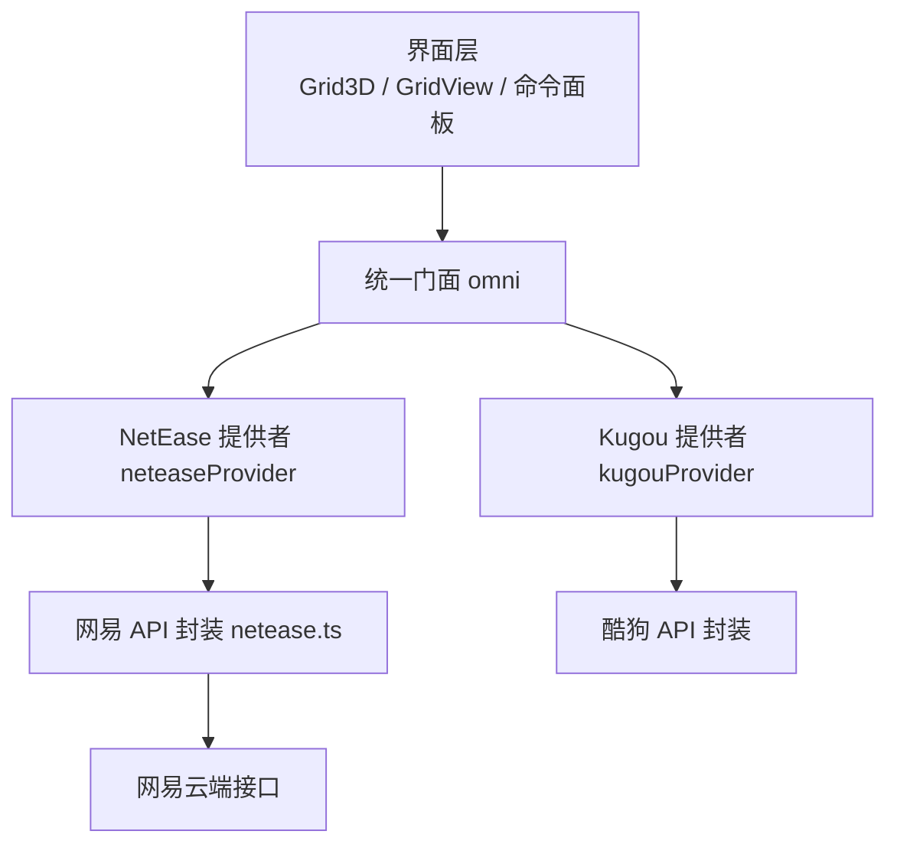
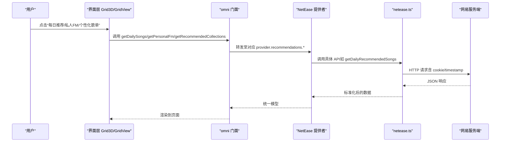
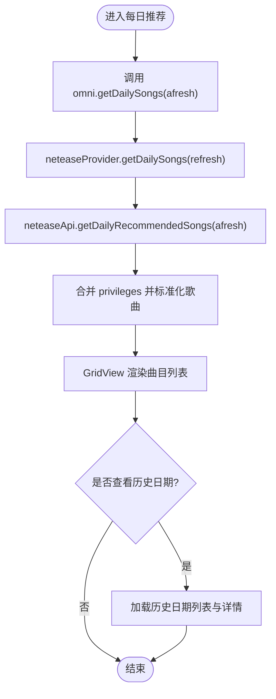
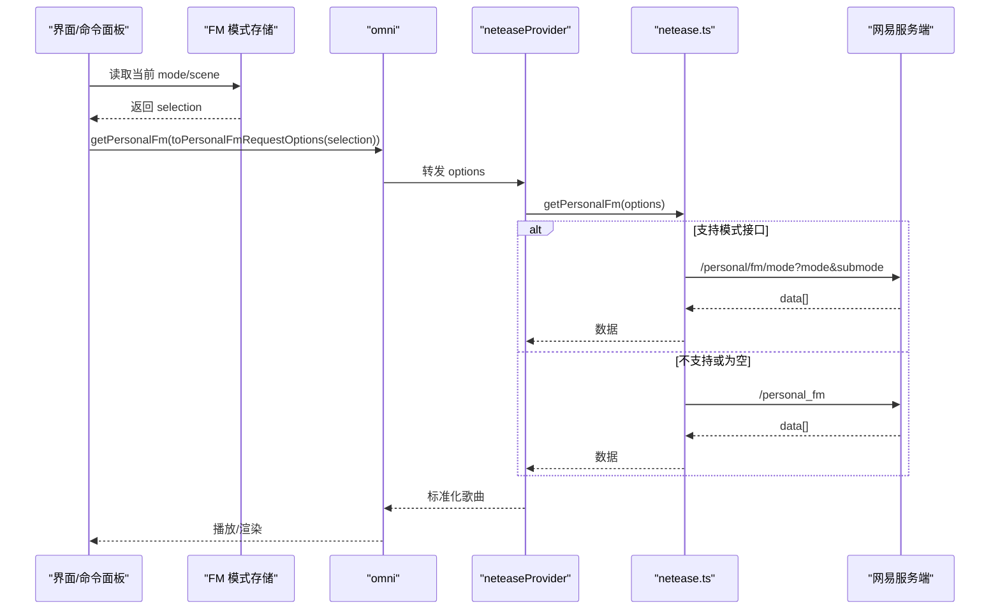
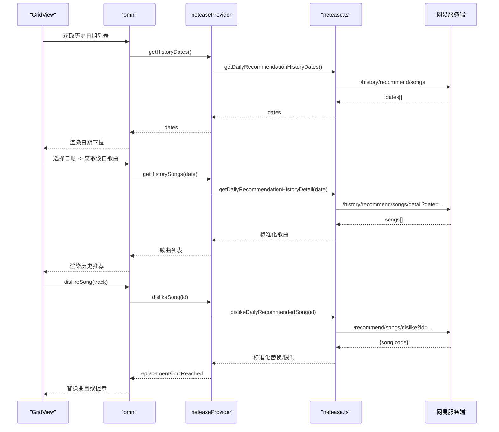
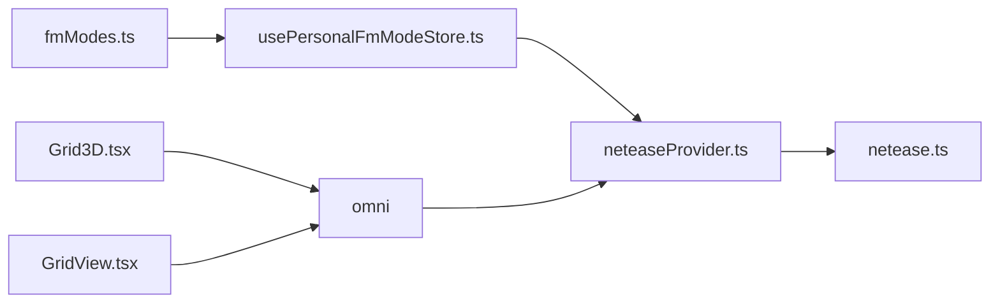

# 推荐系统

<cite>
**本文引用的文件**
- [src/services/netease.ts](file://src/services/netease.ts)
- [src/services/onlineMusic/neteaseProvider.ts](file://src/services/onlineMusic/neteaseProvider.ts)
- [src/services/onlineMusic/fmModes.ts](file://src/services/onlineMusic/fmModes.ts)
- [src/stores/usePersonalFmModeStore.ts](file://src/stores/usePersonalFmModeStore.ts)
- [src/types/onlineMusic.ts](file://src/types/onlineMusic.ts)
- [src/components/Grid3D.tsx](file://src/components/Grid3D.tsx)
- [src/components/GridView.tsx](file://src/components/GridView.tsx)
- [src/components/command-palette/commands/fmModeCommand.ts](file://src/components/command-palette/commands/fmModeCommand.ts)
- [src/components/command-palette/surfaces/FmModeSurfaceView.tsx](file://src/components/command-palette/surfaces/FmModeSurfaceView.tsx)
- [test/unit/services/neteaseDailyRecommendations.test.ts](file://test/unit/services/neteaseDailyRecommendations.test.ts)
</cite>

## 目录
1. [简介](#简介)
2. [项目结构](#项目结构)
3. [核心组件](#核心组件)
4. [架构总览](#架构总览)
5. [详细组件分析](#详细组件分析)
6. [依赖关系分析](#依赖关系分析)
7. [性能考量](#性能考量)
8. [故障排查指南](#故障排查指南)
9. [结论](#结论)
10. [附录：API 使用与参数说明](#附录api-使用与参数说明)

## 简介
本文件系统性梳理本项目中网易云音乐推荐功能的实现，覆盖每日推荐、私人 FM、个性化歌单等能力，并解释历史推荐记录的查询与管理。重点包括：
- getDailySongs：获取每日推荐歌曲（支持刷新）
- getPersonalFm：获取私人 FM 歌曲（支持模式/场景切换）
- getRecommendedCollections：获取个性化推荐歌单集合
- 历史推荐记录：日期列表与指定日期的详情回放
- 私人 FM 模式切换机制与偏好对结果的影响

## 项目结构
推荐功能由“前端展示层 + 统一门面 + 提供者适配层 + 网易 API 封装”构成：
- 展示层：首页卡片、网格视图、命令面板的 FM 模式选择器
- 统一门面：omni 聚合各提供者的推荐能力
- 提供者适配层：neteaseProvider/kugouProvider 将上游返回标准化为统一模型
- 网易 API 封装：netease.ts 负责网络请求、鉴权、数据归一化

图表来源
- [src/components/Grid3D.tsx:421-451](file://src/components/Grid3D.tsx#L421-L451)
- [src/components/GridView.tsx:1103-1127](file://src/components/GridView.tsx#L1103-L1127)
- [src/services/onlineMusic/neteaseProvider.ts:442-466](file://src/services/onlineMusic/neteaseProvider.ts#L442-L466)
- [src/services/netease.ts:738-803](file://src/services/netease.ts#L738-L803)

章节来源
- [src/components/Grid3D.tsx:421-451](file://src/components/Grid3D.tsx#L421-L451)
- [src/components/GridView.tsx:1103-1127](file://src/components/GridView.tsx#L1103-L1127)
- [src/services/onlineMusic/neteaseProvider.ts:442-466](file://src/services/onlineMusic/neteaseProvider.ts#L442-L466)
- [src/services/netease.ts:738-803](file://src/services/netease.ts#L738-L803)

## 核心组件
- 网易 API 封装（netease.ts）
  - 每日推荐：getDailyRecommendedSongs(afresh)
  - 私人 FM：getPersonalFm(options)
  - 个性化歌单：getPersonalizedPlaylists(limit)
  - 历史推荐：getDailyRecommendationHistoryDates()、getDailyRecommendationHistoryDetail(date)
  - 不喜欢替换：dislikeDailyRecommendedSong(songId)
- NetEase 提供者（neteaseProvider.ts）
  - 将 API 返回映射为统一歌曲/集合模型
  - 暴露 recommendations 接口：getDailySongs、getPersonalFm、getRecommendedCollections、历史相关、dislikeSong
- 私人 FM 模式与场景（fmModes.ts）
  - 定义模式 ID、场景分类、默认选择、标签与关键词
  - 规范化选择、转换为请求选项
- 模式状态存储（usePersonalFmModeStore.ts）
  - 持久化当前选择的 mode/scene，并提供 toPersonalFmRequestOptions
- 类型契约（types/onlineMusic.ts）
  - PersonalFmRequestOptions、OnlineRecommendationProvider 等统一接口

章节来源
- [src/services/netease.ts:738-803](file://src/services/netease.ts#L738-L803)
- [src/services/onlineMusic/neteaseProvider.ts:442-466](file://src/services/onlineMusic/neteaseProvider.ts#L442-L466)
- [src/services/onlineMusic/fmModes.ts:1-164](file://src/services/onlineMusic/fmModes.ts#L1-L164)
- [src/stores/usePersonalFmModeStore.ts:1-54](file://src/stores/usePersonalFmModeStore.ts#L1-L54)
- [src/types/onlineMusic.ts:266-283](file://src/types/onlineMusic.ts#L266-L283)

## 架构总览
下图展示了从用户操作到后端接口的完整调用链，以及数据如何被标准化和呈现。

图表来源
- [src/components/Grid3D.tsx:421-451](file://src/components/Grid3D.tsx#L421-L451)
- [src/components/GridView.tsx:1103-1127](file://src/components/GridView.tsx#L1103-L1127)
- [src/services/onlineMusic/neteaseProvider.ts:442-466](file://src/services/onlineMusic/neteaseProvider.ts#L442-L466)
- [src/services/netease.ts:738-803](file://src/services/netease.ts#L738-L803)

## 详细组件分析

### 每日推荐（getDailySongs）
- 入口
  - 界面：Grid3D 构建“每日推荐”卡片；GridView 加载并显示曲目
  - 门面：omni.getDailySongs(refresh?)
  - 提供者：neteaseProvider.recommendations.getDailySongs(refresh)
  - API：neteaseApi.getDailyRecommendedSongs(afresh)
- 关键行为
  - 支持 afresh=true 刷新当日推荐
  - 合并 privileges 信息，统一歌曲模型
  - 失败时 UI 捕获错误并提示
- 历史关联
  - 可通过历史日期下拉切换到历史推荐列表
  - 历史日期列表与详情分别通过 history 接口获取

图表来源
- [src/components/Grid3D.tsx:421-451](file://src/components/Grid3D.tsx#L421-L451)
- [src/components/GridView.tsx:1103-1127](file://src/components/GridView.tsx#L1103-L1127)
- [src/services/onlineMusic/neteaseProvider.ts:442-466](file://src/services/onlineMusic/neteaseProvider.ts#L442-L466)
- [src/services/netease.ts:762-769](file://src/services/netease.ts#L762-L769)

章节来源
- [src/components/Grid3D.tsx:421-451](file://src/components/Grid3D.tsx#L421-L451)
- [src/components/GridView.tsx:1103-1127](file://src/components/GridView.tsx#L1103-L1127)
- [src/services/onlineMusic/neteaseProvider.ts:442-466](file://src/services/onlineMusic/neteaseProvider.ts#L442-L466)
- [src/services/netease.ts:762-769](file://src/services/netease.ts#L762-L769)
- [test/unit/services/neteaseDailyRecommendations.test.ts:37-69](file://test/unit/services/neteaseDailyRecommendations.test.ts#L37-L69)

### 私人 FM（getPersonalFm）与模式切换
- 入口
  - 界面：Grid3D 卡片直接播放；GridView 作为电台加载；命令面板可切换模式/场景
  - 门面：omni.getPersonalFm(options?)
  - 提供者：neteaseProvider.recommendations.getPersonalFm(options)
  - API：neteaseApi.getPersonalFm(options)
- 模式与场景
  - 模式：DEFAULT、FAMILIAR、EXPLORE、PUZZLE_MODE_RCMD、SCENE_RCMD
  - 场景：按 mood/activity/genre/language 分类，仅 SCENE_RCMD 携带 submode
  - 选择持久化：usePersonalFmModeStore 本地存储，读取后转为请求选项
- 回退策略
  - 若模式接口不可用或无数据，自动回退到传统 /personal_fm
- 影响
  - 不同模式/场景会改变推荐曲风与内容分布（例如“助眠”“运动”“摇滚”等）

图表来源
- [src/stores/usePersonalFmModeStore.ts:1-54](file://src/stores/usePersonalFmModeStore.ts#L1-L54)
- [src/services/onlineMusic/fmModes.ts:1-164](file://src/services/onlineMusic/fmModes.ts#L1-L164)
- [src/services/onlineMusic/neteaseProvider.ts:447-451](file://src/services/onlineMusic/neteaseProvider.ts#L447-L451)
- [src/services/netease.ts:738-760](file://src/services/netease.ts#L738-L760)
- [src/components/command-palette/commands/fmModeCommand.ts:1-29](file://src/components/command-palette/commands/fmModeCommand.ts#L1-L29)
- [src/components/command-palette/surfaces/FmModeSurfaceView.tsx:1-31](file://src/components/command-palette/surfaces/FmModeSurfaceView.tsx#L1-L31)

章节来源
- [src/stores/usePersonalFmModeStore.ts:1-54](file://src/stores/usePersonalFmModeStore.ts#L1-L54)
- [src/services/onlineMusic/fmModes.ts:1-164](file://src/services/onlineMusic/fmModes.ts#L1-L164)
- [src/services/onlineMusic/neteaseProvider.ts:447-451](file://src/services/onlineMusic/neteaseProvider.ts#L447-L451)
- [src/services/netease.ts:738-760](file://src/services/netease.ts#L738-L760)
- [src/components/command-palette/commands/fmModeCommand.ts:1-29](file://src/components/command-palette/commands/fmModeCommand.ts#L1-L29)
- [src/components/command-palette/surfaces/FmModeSurfaceView.tsx:1-31](file://src/components/command-palette/surfaces/FmModeSurfaceView.tsx#L1-L31)

### 个性化歌单（getRecommendedCollections）
- 入口
  - 界面：Grid3D 聚合“个性化歌单”卡片
  - 门面：omni.getHomeFeed(limit) 内部并行拉取 personalFm/daily/recommendedCollections
  - 提供者：neteaseProvider.recommendations.getRecommendedCollections(limit)
  - API：neteaseApi.getPersonalizedPlaylists(limit)
- 数据
  - 返回推荐歌单列表，包含封面、描述、创作者等信息
  - 提供者将其标准化为统一集合模型

章节来源
- [src/components/Grid3D.tsx:421-451](file://src/components/Grid3D.tsx#L421-L451)
- [src/services/onlineMusic/neteaseProvider.ts:453-455](file://src/services/onlineMusic/neteaseProvider.ts#L453-L455)
- [src/services/netease.ts:801-803](file://src/services/netease.ts#L801-L803)

### 历史推荐记录（查询与管理）
- 查询
  - 获取历史日期列表：neteaseApi.getDailyRecommendationHistoryDates()
  - 获取某日详情：neteaseApi.getDailyRecommendationHistoryDetail(date)
  - 提供者层：getHistoryEntries/getHistoryDates/getHistorySongs
- 管理
  - 在每日推荐视图中，支持“不喜欢”以替换曲目
  - dislikeDailyRecommendedSong(songId) 返回替换歌曲或达到上限提示
  - 界面处理：GridView 根据返回结果更新列表或提示“今日已无更多推荐”

图表来源
- [src/services/netease.ts:771-799](file://src/services/netease.ts#L771-L799)
- [src/services/onlineMusic/neteaseProvider.ts:457-478](file://src/services/onlineMusic/neteaseProvider.ts#L457-L478)
- [src/components/GridView.tsx:1339-1395](file://src/components/GridView.tsx#L1339-L1395)

章节来源
- [src/services/netease.ts:771-799](file://src/services/netease.ts#L771-L799)
- [src/services/onlineMusic/neteaseProvider.ts:457-478](file://src/services/onlineMusic/neteaseProvider.ts#L457-L478)
- [src/components/GridView.tsx:1339-1395](file://src/components/GridView.tsx#L1339-L1395)
- [test/unit/services/neteaseDailyRecommendations.test.ts:99-114](file://test/unit/services/neteaseDailyRecommendations.test.ts#L99-L114)

## 依赖关系分析
- 耦合与内聚
  - neteaseProvider 与 netease.ts 高内聚：前者专注数据映射，后者专注网络与鉴权
  - fmModes.ts 与 usePersonalFmModeStore.ts 解耦：模式定义与状态管理分离，便于扩展
  - 界面层通过 omni 抽象，屏蔽提供者差异，提升可替换性
- 外部依赖
  - 网易云端接口：/recommend/songs、/personal/fm/mode、/personal_fm、/personalized、/history/recommend/songs
  - Cookie/匿名会话：fetchWithCreds 自动附加 cookie，保证鉴权
- 潜在循环依赖
  - 未见明显循环引用；模块间通过类型与函数接口通信

图表来源
- [src/services/onlineMusic/fmModes.ts:1-164](file://src/services/onlineMusic/fmModes.ts#L1-L164)
- [src/stores/usePersonalFmModeStore.ts:1-54](file://src/stores/usePersonalFmModeStore.ts#L1-L54)
- [src/services/onlineMusic/neteaseProvider.ts:442-466](file://src/services/onlineMusic/neteaseProvider.ts#L442-L466)
- [src/services/netease.ts:738-803](file://src/services/netease.ts#L738-L803)
- [src/components/Grid3D.tsx:421-451](file://src/components/Grid3D.tsx#L421-L451)
- [src/components/GridView.tsx:1103-1127](file://src/components/GridView.tsx#L1103-L1127)

章节来源
- [src/services/onlineMusic/fmModes.ts:1-164](file://src/services/onlineMusic/fmModes.ts#L1-L164)
- [src/stores/usePersonalFmModeStore.ts:1-54](file://src/stores/usePersonalFmModeStore.ts#L1-L54)
- [src/services/onlineMusic/neteaseProvider.ts:442-466](file://src/services/onlineMusic/neteaseProvider.ts#L442-L466)
- [src/services/netease.ts:738-803](file://src/services/netease.ts#L738-L803)
- [src/components/Grid3D.tsx:421-451](file://src/components/Grid3D.tsx#L421-L451)
- [src/components/GridView.tsx:1103-1127](file://src/components/GridView.tsx#L1103-L1127)

## 性能考量
- 并发拉取：omni.getHomeFeed 并行请求 personalFm、daily、recommendedCollections，减少首屏等待
- 接口回退：当 /personal/fm/mode 不可用时自动回退 /personal_fm，避免空结果
- 数据归一化：合并 privileges 与多字段兼容，降低上层判断复杂度
- 缓存与去重：未引入额外缓存层，但通过 timestamp 控制动态数据刷新频率

[本节为通用指导，不直接分析具体文件]

## 故障排查指南
- 无法获取每日推荐
  - 检查 VITE_NETEASE_API_BASE 配置与网络连通
  - 确认 fetchWithCreds 能正确附加 cookie
  - 参考测试用例验证接口路径与数据结构
- 私人 FM 模式无效
  - 确认当前 provider 支持 personalFmModes
  - 检查 mode/scene 是否合法（normalizePersonalFmSelection 会降级）
  - 观察控制台警告：模式请求失败时会回退默认 FM
- 历史推荐为空
  - 检查 /history/recommend/songs 返回的 dates 是否为空
  - 确认 date 格式与编码是否正确
- 不喜欢替换失败
  - 关注 code 432 表示已达上限
  - 界面应提示“今日已无更多推荐”

章节来源
- [src/services/netease.ts:57-123](file://src/services/netease.ts#L57-L123)
- [src/services/netease.ts:738-760](file://src/services/netease.ts#L738-L760)
- [src/services/onlineMusic/neteaseProvider.ts:472-478](file://src/services/onlineMusic/neteaseProvider.ts#L472-L478)
- [src/components/GridView.tsx:1359-1395](file://src/components/GridView.tsx#L1359-L1395)
- [test/unit/services/neteaseDailyRecommendations.test.ts:37-69](file://test/unit/services/neteaseDailyRecommendations.test.ts#L37-L69)

## 结论
本项目通过清晰的分层与统一的类型契约，实现了网易云音乐的推荐能力：
- 每日推荐支持刷新与历史回溯
- 私人 FM 支持模式/场景切换，具备健壮的回退机制
- 个性化歌单以集合形式呈现，便于浏览与播放
- 历史推荐记录提供完整的查询与管理闭环
整体设计具备良好的可扩展性与容错性，便于接入其他在线音乐提供商。

[本节为总结性内容，不直接分析具体文件]

## 附录：API 使用与参数说明
- getDailySongs(refresh?: boolean)
  - 用途：获取每日推荐歌曲
  - 参数：refresh 为 true 时强制刷新当日推荐
  - 返回：标准化歌曲数组
  - 参考：neteaseProvider.getDailySongs、neteaseApi.getDailyRecommendedSongs
- getPersonalFm(options?: PersonalFmRequestOptions)
  - 用途：获取私人 FM 歌曲
  - 参数：
    - mode: DEFAULT | FAMILIAR | EXPLORE | PUZZLE_MODE_RCMD | SCENE_RCMD
    - submode: 仅在 SCENE_RCMD 有效，对应场景 ID（如 SLEEP_HELP、EXERCISE 等）
  - 行为：优先尝试 /personal/fm/mode，失败回退 /personal_fm
  - 参考：fmModes.ts、usePersonalFmModeStore.ts、neteaseApi.getPersonalFm
- getRecommendedCollections(limit?: number)
  - 用途：获取个性化推荐歌单集合
  - 参数：limit 控制返回数量
  - 返回：标准化集合数组
  - 参考：neteaseApi.getPersonalizedPlaylists
- 历史推荐
  - 日期列表：getDailyRecommendationHistoryDates()
  - 详情：getDailyRecommendationHistoryDetail(date)
  - 不喜欢替换：dislikeDailyRecommendedSong(songId)
  - 参考：neteaseApi 对应方法与提供者适配层

章节来源
- [src/services/onlineMusic/neteaseProvider.ts:442-478](file://src/services/onlineMusic/neteaseProvider.ts#L442-L478)
- [src/services/netease.ts:738-803](file://src/services/netease.ts#L738-L803)
- [src/services/onlineMusic/fmModes.ts:1-164](file://src/services/onlineMusic/fmModes.ts#L1-L164)
- [src/stores/usePersonalFmModeStore.ts:1-54](file://src/stores/usePersonalFmModeStore.ts#L1-L54)
- [src/types/onlineMusic.ts:266-283](file://src/types/onlineMusic.ts#L266-L283)