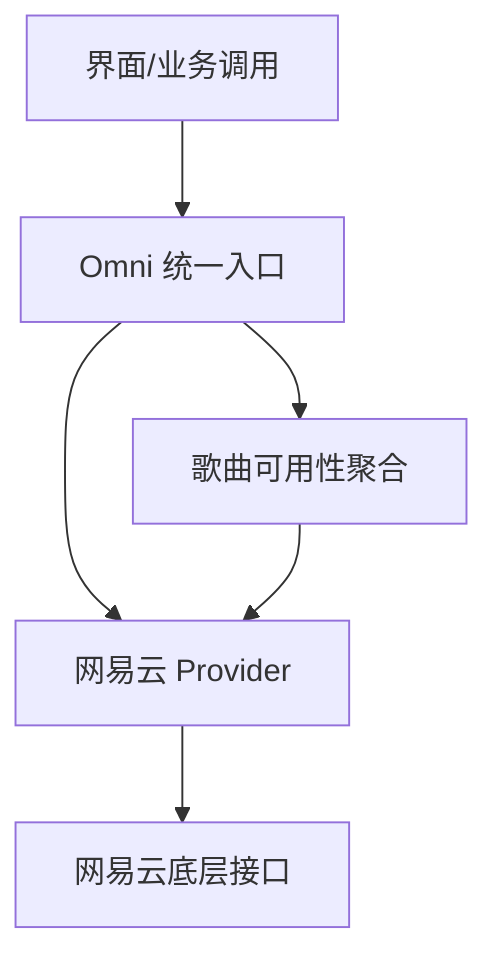
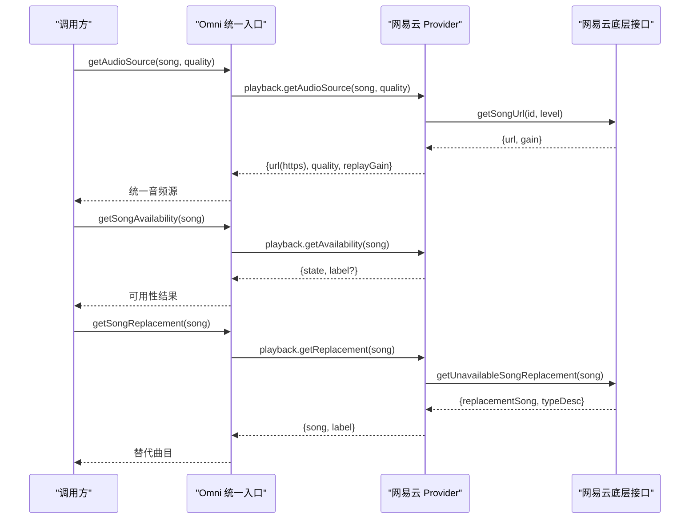
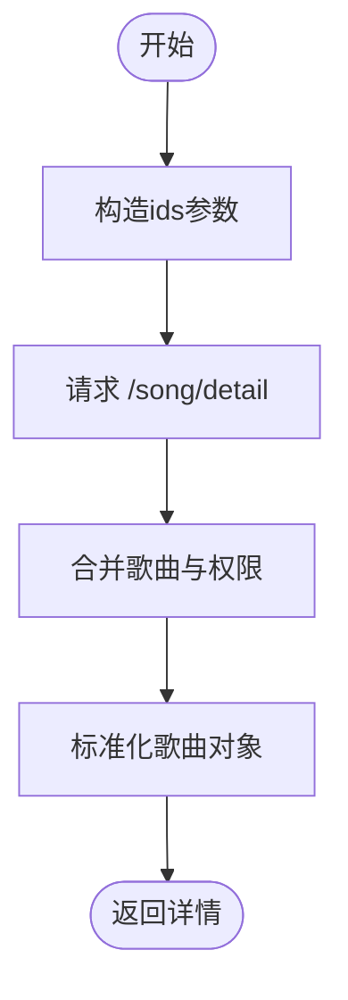
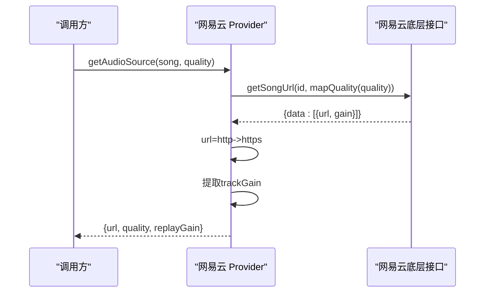
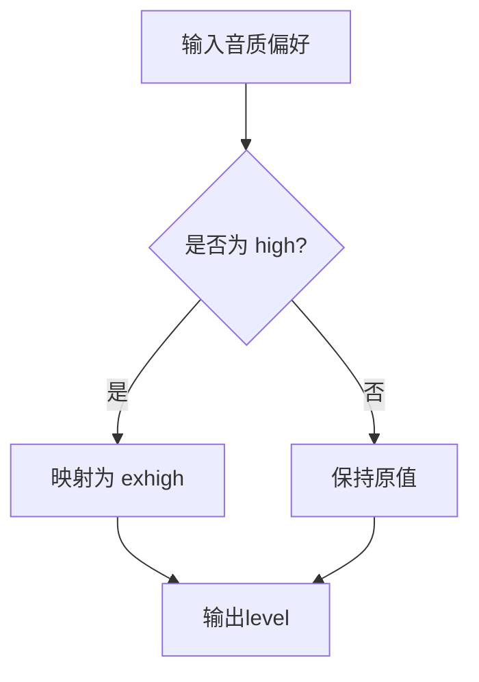
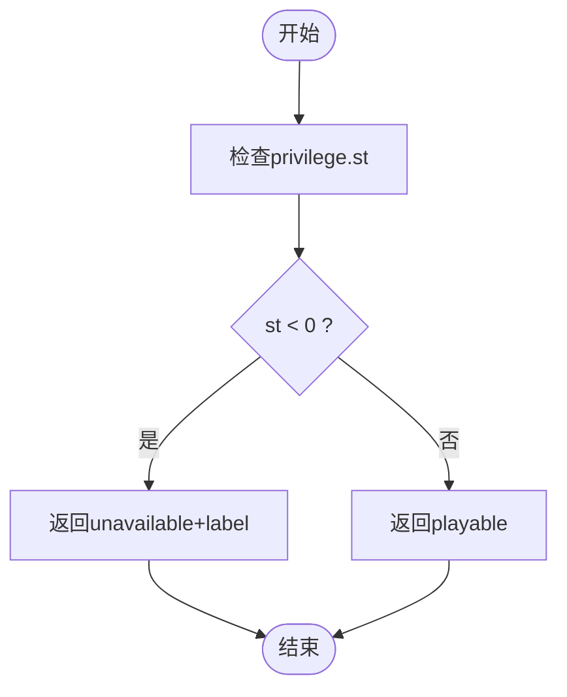
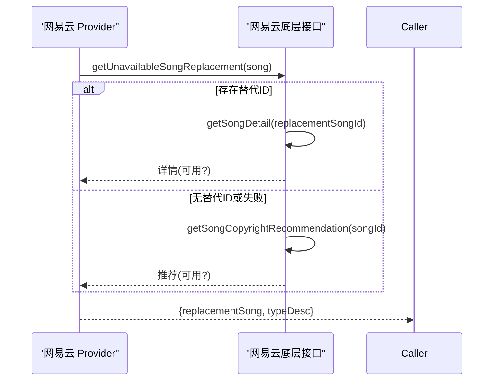
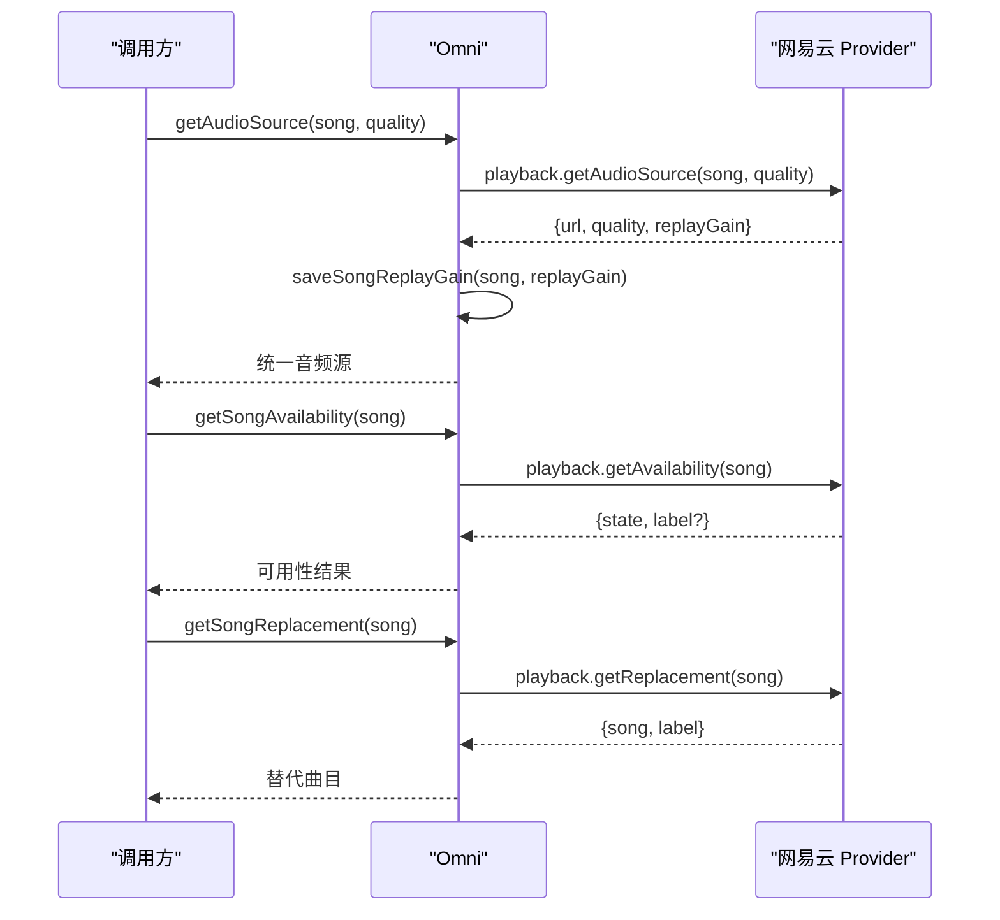
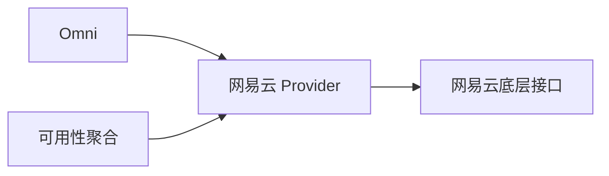

# 播放与音源

<cite>
**本文引用的文件**
- [src/services/netease.ts](file://src/services/netease.ts)
- [src/services/onlineMusic/neteaseProvider.ts](file://src/services/onlineMusic/neteaseProvider.ts)
- [src/services/onlineMusic/songAvailability.ts](file://src/services/onlineMusic/songAvailability.ts)
- [src/services/onlineMusic/omni.ts](file://src/services/onlineMusic/omni.ts)
- [src/types/onlineMusic.ts](file://src/types/onlineMusic.ts)
</cite>

## 目录
1. [简介](#简介)
2. [项目结构](#项目结构)
3. [核心组件](#核心组件)
4. [架构总览](#架构总览)
5. [详细组件分析](#详细组件分析)
6. [依赖关系分析](#依赖关系分析)
7. [性能考虑](#性能考虑)
8. [故障排查指南](#故障排查指南)
9. [结论](#结论)

## 简介
本文件聚焦网易云音乐在应用中的播放能力，围绕歌曲详情获取、音频源解析、音质选择、版权检查与替代方案等关键环节进行系统化说明。重点解释以下播放相关 API 的实现逻辑：
- getSongDetail：获取歌曲详情并合并权限信息
- getAudioSource：根据音质偏好获取可播放的音频 URL 与安全处理
- getAvailability：判断歌曲是否可播放（版权、地区、VIP 等）
- getReplacement：当原曲不可用时，尝试获取可替代曲目

同时，文档会梳理不同音质标准（standard、exhigh）的映射关系，以及音频 URL 的安全转换策略，并给出可用性检查机制与异常处理建议。

## 项目结构
围绕播放能力的代码主要分布在以下模块：
- 网易云底层接口封装：负责与网易云后端交互、Cookie/会话管理、URL 安全化、歌词与版权推荐等
- 网易云 Provider：将底层接口适配为统一的在线音乐提供者接口，暴露播放、歌词、收藏、歌单等能力
- 统一入口 Omni：对外提供跨供应商的统一调用门面，屏蔽差异
- 可用性聚合：基于歌曲来源自动路由到对应 Provider 的可用性判断与替代方案

**图表来源**
- [src/services/onlineMusic/omni.ts:401-441](file://src/services/onlineMusic/omni.ts#L401-L441)
- [src/services/onlineMusic/neteaseProvider.ts:259-295](file://src/services/onlineMusic/neteaseProvider.ts#L259-L295)
- [src/services/netease.ts:396-469](file://src/services/netease.ts#L396-L469)
- [src/services/onlineMusic/songAvailability.ts:12-36](file://src/services/onlineMusic/songAvailability.ts#L12-L36)

**章节来源**
- [src/services/netease.ts:1-123](file://src/services/netease.ts#L1-L123)
- [src/services/onlineMusic/neteaseProvider.ts:1-495](file://src/services/onlineMusic/neteaseProvider.ts#L1-L495)
- [src/services/onlineMusic/songAvailability.ts:1-37](file://src/services/onlineMusic/songAvailability.ts#L1-L37)
- [src/services/onlineMusic/omni.ts:1-567](file://src/services/onlineMusic/omni.ts#L1-L567)
- [src/types/onlineMusic.ts:1-338](file://src/types/onlineMusic.ts#L1-L338)

## 核心组件
- 网易云底层接口（netease.ts）
  - 负责会话 Cookie 注入、匿名 Cookie 获取、时间戳防缓存、HTTPS 强制转换、歌曲详情与权限合并、版权推荐与替代曲目获取、歌词处理等
- 网易云 Provider（neteaseProvider.ts）
  - 将底层接口包装为 OnlineMusicProvider，实现 getSongDetail、getAudioSource、getAvailability、getReplacement 等播放能力
- 统一入口（omni.ts）
  - 对外暴露 omni.getAudioSource、omni.getSongAvailability、omni.getSongReplacement 等统一方法，并在获取音源时持久化 ReplayGain
- 可用性聚合（songAvailability.ts）
  - 根据歌曲来源自动路由到对应 Provider 的可用性判断与替代方案

**章节来源**
- [src/services/netease.ts:396-469](file://src/services/netease.ts#L396-L469)
- [src/services/onlineMusic/neteaseProvider.ts:259-295](file://src/services/onlineMusic/neteaseProvider.ts#L259-L295)
- [src/services/onlineMusic/omni.ts:409-441](file://src/services/onlineMusic/omni.ts#L409-L441)
- [src/services/onlineMusic/songAvailability.ts:12-36](file://src/services/onlineMusic/songAvailability.ts#L12-L36)

## 架构总览
播放链路从上层调用进入 Omni，再路由到具体 Provider（此处为网易云），最终由底层 netease.ts 完成与后端的真实请求。可用性检查与替代方案贯穿其中，确保用户在不同版权/地区/VIP 场景下获得最佳体验。

**图表来源**
- [src/services/onlineMusic/omni.ts:409-441](file://src/services/onlineMusic/omni.ts#L409-L441)
- [src/services/onlineMusic/neteaseProvider.ts:259-295](file://src/services/onlineMusic/neteaseProvider.ts#L259-L295)
- [src/services/netease.ts:396-469](file://src/services/netease.ts#L396-L469)

## 详细组件分析

### 歌曲详情获取：getSongDetail
- 功能要点
  - 通过网易云底层接口获取歌曲详情，并将返回的歌曲列表与权限列表合并，使每首歌携带 privilege 字段，便于后续可用性判断
  - 支持单曲或多曲 ID 批量查询
- 关键流程
  - 构造 ids 参数并请求 /song/detail
  - 合并 songs 与 privileges，按 id 对齐或顺序对齐
  - 标准化歌曲对象，包含专辑、封面、时长、别名、翻译名、来源类型、费用、无版权推荐、资源状态、权限等

**图表来源**
- [src/services/netease.ts:396-401](file://src/services/netease.ts#L396-L401)
- [src/services/netease.ts:209-242](file://src/services/netease.ts#L209-L242)
- [src/services/netease.ts:244-304](file://src/services/netease.ts#L244-L304)

**章节来源**
- [src/services/netease.ts:396-401](file://src/services/netease.ts#L396-L401)
- [src/services/netease.ts:209-242](file://src/services/netease.ts#L209-L242)
- [src/services/netease.ts:244-304](file://src/services/netease.ts#L244-L304)

### 音频源解析：getAudioSource
- 功能要点
  - 根据音质偏好获取可播放的音频 URL，并进行 HTTPS 强制转换
  - 提取回放增益（ReplayGain）信息并持久化，供后续音量一致性使用
- 音质映射
  - standard -> standard
  - high -> exhigh
  - 其他值透传（如 lossless/hires，视后端支持情况）
- 关键流程
  - 调用网易云 getSongUrl，传入 song.id 与 level（经 mapQuality 转换）
  - 取 data[0].url，若为空则返回 null
  - 将 http 前缀替换为 https，避免混合内容问题
  - 提取 gain 并转换为 trackGain，写入返回对象

**图表来源**
- [src/services/onlineMusic/neteaseProvider.ts:265-277](file://src/services/onlineMusic/neteaseProvider.ts#L265-L277)
- [src/services/netease.ts:666-672](file://src/services/netease.ts#L666-L672)

**章节来源**
- [src/services/onlineMusic/neteaseProvider.ts:265-277](file://src/services/onlineMusic/neteaseProvider.ts#L265-L277)
- [src/services/netease.ts:666-672](file://src/services/netease.ts#L666-L672)
- [src/types/onlineMusic.ts:79-85](file://src/types/onlineMusic.ts#L79-L85)

### 音质选择：standard 与 exhigh 的映射
- 映射规则
  - standard 保持为 standard
  - high 映射为 exhigh（320k），用于保证 VIP 歌曲能拿到有效签名链接
  - 其他值直接透传，交由后端决定
- 设计动机
  - 某些 VIP 内容在 standard 级别可能无法返回有效链接，因此默认倾向更高音质以提升成功率
  - randomCNIP=true 与 https=true 提升受限曲目访问成功率并避免混合内容问题

**图表来源**
- [src/services/onlineMusic/neteaseProvider.ts:28-32](file://src/services/onlineMusic/neteaseProvider.ts#L28-L32)
- [src/services/netease.ts:666-672](file://src/services/netease.ts#L666-L672)

**章节来源**
- [src/services/onlineMusic/neteaseProvider.ts:28-32](file://src/services/onlineMusic/neteaseProvider.ts#L28-L32)
- [src/services/netease.ts:666-672](file://src/services/netease.ts#L666-L672)

### 版权检查与可用性：getAvailability
- 功能要点
  - 基于歌曲的 privilege.st 字段判断是否标记为不可用
  - 若不可用，返回 unavailable 并提供可选标签（如无版权推荐描述）
- 关键逻辑
  - isSongMarkedUnavailable：当 privilege.st < 0 时认为不可用
  - getSongUnavailableTagText：优先使用 noCopyrightRcmd.typeDesc 作为提示文本
  - Provider 层 getAvailability：根据上述判断返回 state 与 label

**图表来源**
- [src/services/netease.ts:306-328](file://src/services/netease.ts#L306-L328)
- [src/services/onlineMusic/neteaseProvider.ts:278-286](file://src/services/onlineMusic/neteaseProvider.ts#L278-L286)

**章节来源**
- [src/services/netease.ts:306-328](file://src/services/netease.ts#L306-L328)
- [src/services/onlineMusic/neteaseProvider.ts:278-286](file://src/services/onlineMusic/neteaseProvider.ts#L278-L286)

### 替代曲目：getReplacement
- 功能要点
  - 当歌曲不可用时，尝试获取可替代曲目，优先使用 noCopyrightRcmd.songId 对应的详情
  - 若失败或该字段不存在，则回退到版权推荐接口 /song/copyright/rcmd
  - 在非 Electron 环境下对版权推荐接口能力进行缓存判断，避免重复失败请求
- 关键流程
  - 若存在 replacementSongId，先尝试获取其详情并校验可用性
  - 否则调用版权推荐接口，成功后记录能力并返回替代曲目
  - 捕获错误并向上抛出或返回 null

**图表来源**
- [src/services/netease.ts:409-469](file://src/services/netease.ts#L409-L469)
- [src/services/onlineMusic/neteaseProvider.ts:287-294](file://src/services/onlineMusic/neteaseProvider.ts#L287-L294)

**章节来源**
- [src/services/netease.ts:409-469](file://src/services/netease.ts#L409-L469)
- [src/services/onlineMusic/neteaseProvider.ts:287-294](file://src/services/onlineMusic/neteaseProvider.ts#L287-L294)

### 统一入口：Omni 的播放能力
- getAudioSource
  - 调用 Provider 的 getAudioSource，并在返回中持久化 ReplayGain，供后续播放阶段使用
- getSongAvailability
  - 调用 Provider 的 getAvailability，返回统一的状态与可选标签
- getSongReplacement
  - 调用 Provider 的 getReplacement，返回替代曲目及描述

**图表来源**
- [src/services/onlineMusic/omni.ts:409-441](file://src/services/onlineMusic/omni.ts#L409-L441)
- [src/services/onlineMusic/neteaseProvider.ts:259-295](file://src/services/onlineMusic/neteaseProvider.ts#L259-L295)

**章节来源**
- [src/services/onlineMusic/omni.ts:409-441](file://src/services/onlineMusic/omni.ts#L409-L441)
- [src/services/onlineMusic/neteaseProvider.ts:259-295](file://src/services/onlineMusic/neteaseProvider.ts#L259-L295)

### 安全性与格式转换
- HTTPS 强制转换
  - 所有音频 URL 在返回前将 http 前缀替换为 https，避免混合内容导致播放失败
- 会话与 Cookie
  - 登录态 Cookie 与匿名 Cookie 自动注入，必要时追加 timestamp 防止动态数据缓存
  - 遇到 301/401/403 时清理匿名 Cookie，避免无效会话影响后续请求
- 音质参数增强
  - 使用 randomCNIP=true 提高受限曲目访问成功率
  - https=true 确保返回链接协议安全

**章节来源**
- [src/services/netease.ts:57-123](file://src/services/netease.ts#L57-L123)
- [src/services/netease.ts:125-128](file://src/services/netease.ts#L125-L128)
- [src/services/netease.ts:666-672](file://src/services/netease.ts#L666-L672)

## 依赖关系分析
- 耦合关系
  - Omni 依赖 Provider 抽象，屏蔽各供应商差异
  - 网易云 Provider 依赖 netease.ts 提供的底层接口
  - 可用性聚合依赖 Provider 的具体实现，解耦 UI 与供应商细节
- 外部依赖
  - 网易云后端接口（/song/detail、/song/url/v1、/song/copyright/rcmd 等）
  - Electron 环境检测（决定是否启用特定能力缓存）

**图表来源**
- [src/services/onlineMusic/omni.ts:401-441](file://src/services/onlineMusic/omni.ts#L401-L441)
- [src/services/onlineMusic/neteaseProvider.ts:259-295](file://src/services/onlineMusic/neteaseProvider.ts#L259-L295)
- [src/services/onlineMusic/songAvailability.ts:12-36](file://src/services/onlineMusic/songAvailability.ts#L12-L36)

**章节来源**
- [src/services/onlineMusic/omni.ts:401-441](file://src/services/onlineMusic/omni.ts#L401-L441)
- [src/services/onlineMusic/neteaseProvider.ts:259-295](file://src/services/onlineMusic/neteaseProvider.ts#L259-L295)
- [src/services/onlineMusic/songAvailability.ts:12-36](file://src/services/onlineMusic/songAvailability.ts#L12-L36)

## 性能考虑
- 接口复用与缓存
  - 非 Electron 环境下对版权推荐接口能力进行布尔缓存，减少重复失败请求
  - 高潮段落（chorus ranges）在 Provider 层使用 Map 缓存，避免重复网络请求
- 音质选择策略
  - 默认倾向 exhigh 以提高 VIP 内容成功率，减少因音质过低导致的无效链接
- 会话优化
  - 仅对登录、用户、歌单详情等端点添加 timestamp，避免不必要的缓存失效
  - 自动注入 Cookie 并处理匿名 Cookie，降低鉴权失败率

**章节来源**
- [src/services/netease.ts:66-77](file://src/services/netease.ts#L66-L77)
- [src/services/netease.ts:455-462](file://src/services/netease.ts#L455-L462)
- [src/services/onlineMusic/neteaseProvider.ts:98-116](file://src/services/onlineMusic/neteaseProvider.ts#L98-L116)

## 故障排查指南
- 常见问题
  - 音频 URL 为空：检查 getSongUrl 返回值，确认音质映射与后端支持；必要时降级或更换音质
  - 混合内容警告：确认 URL 已转换为 https；检查浏览器或 Electron 环境设置
  - 版权限制提示：查看 privilege.st 与 noCopyrightRcmd.typeDesc，必要时使用替代曲目
  - 登录态失效：检查 Cookie 注入与 301/401/403 处理逻辑，必要时重新登录
- 调试建议
  - 打印 getAudioSource 返回的 url、quality、replayGain
  - 检查 getAvailability 的 state 与 label
  - 验证 getReplacement 是否成功返回替代曲目

**章节来源**
- [src/services/netease.ts:118-123](file://src/services/netease.ts#L118-L123)
- [src/services/netease.ts:306-328](file://src/services/netease.ts#L306-L328)
- [src/services/onlineMusic/neteaseProvider.ts:265-295](file://src/services/onlineMusic/neteaseProvider.ts#L265-L295)

## 结论
本项目通过分层设计与统一入口，实现了网易云音乐的稳定播放能力。歌曲详情获取、音频源解析、音质选择与版权检查形成完整闭环，并在不可用场景下提供替代曲目。HTTPS 强制转换与会话管理提升了播放成功率与用户体验。未来可进一步优化音质回退策略与缓存机制，以应对更多复杂版权与网络环境。