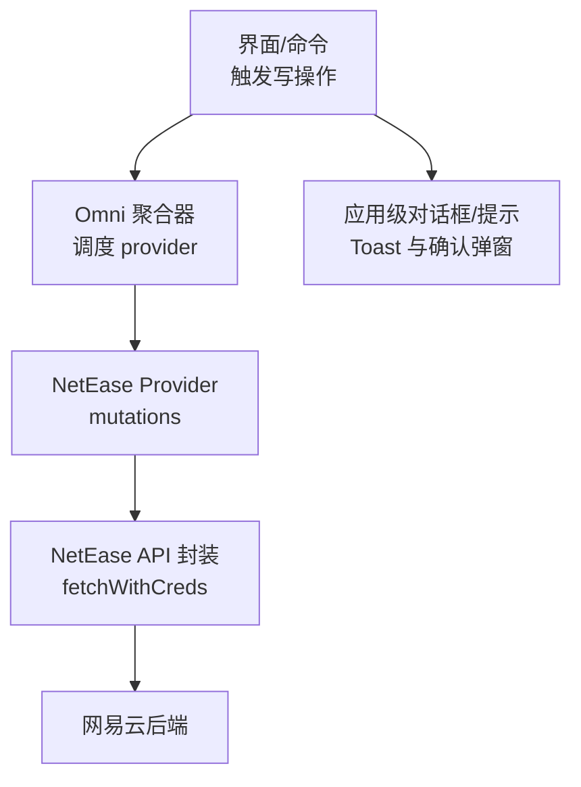
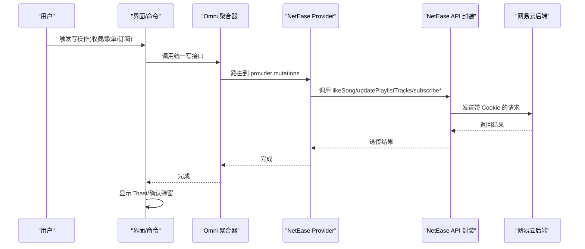
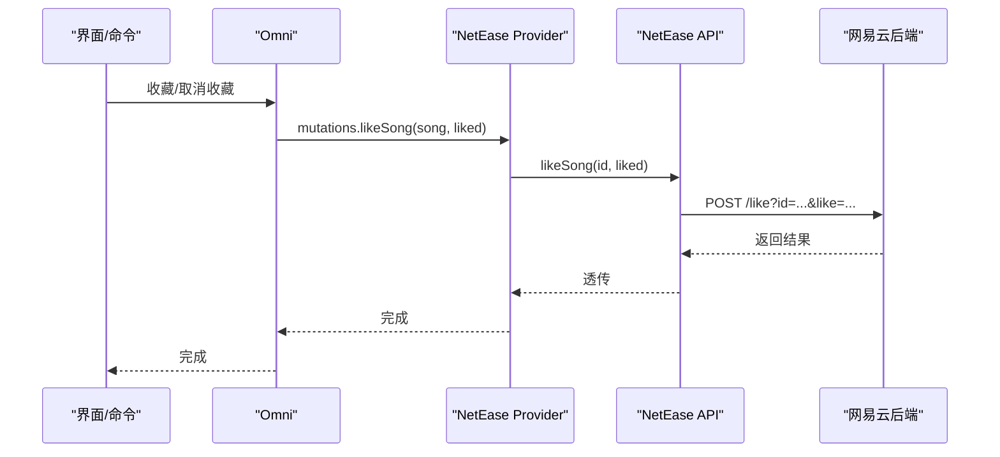
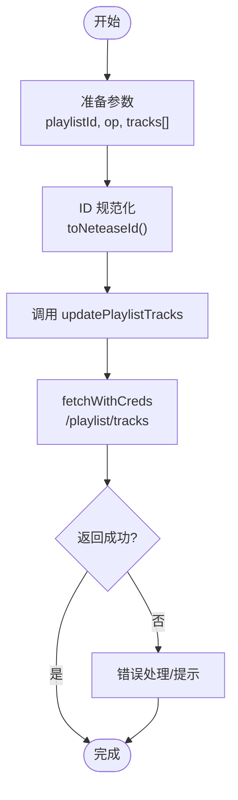
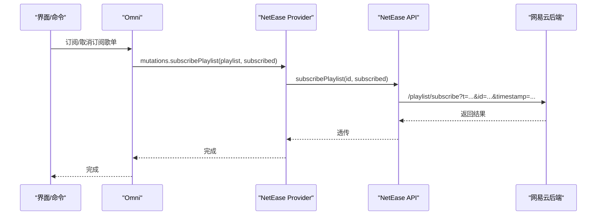
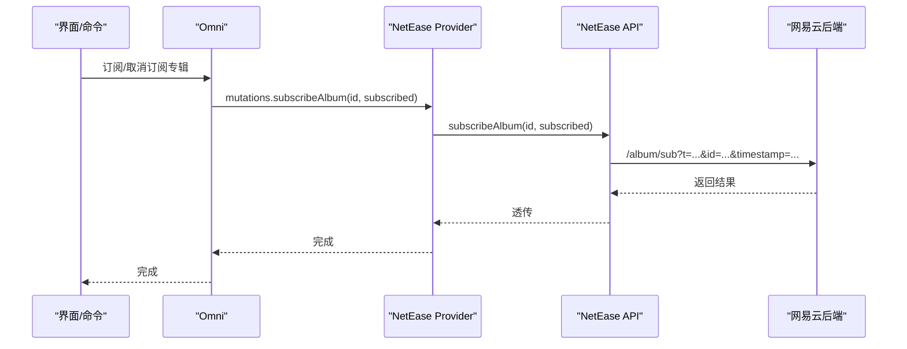
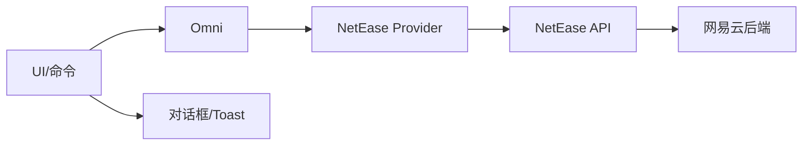

# 数据修改

<cite>
**本文引用的文件**
- [src/services/netease.ts](file://src/services/netease.ts)
- [src/services/onlineMusic/neteaseProvider.ts](file://src/services/onlineMusic/neteaseProvider.ts)
- [src/services/onlineMusic/omni.ts](file://src/services/onlineMusic/omni.ts)
- [src/components/app/dialogs/buildAppDialogsModel.ts](file://src/components/app/dialogs/buildAppDialogsModel.ts)
- [src/components/app/dialogs/AppDialogs.tsx](file://src/components/app/dialogs/AppDialogs.tsx)
- [src/hooks/usePlaybackInteractionBridge.ts](file://src/hooks/usePlaybackInteractionBridge.ts)
</cite>

## 目录
1. [简介](#简介)
2. [项目结构](#项目结构)
3. [核心组件](#核心组件)
4. [架构总览](#架构总览)
5. [详细组件分析](#详细组件分析)
6. [依赖关系分析](#依赖关系分析)
7. [性能考虑](#性能考虑)
8. [故障排查指南](#故障排查指南)
9. [结论](#结论)

## 简介
本章节聚焦网易云音乐的数据修改能力，覆盖歌曲收藏、歌单操作与专辑订阅等写操作。重点说明 likeSong、updatePlaylistTracks、subscribePlaylist、subscribeAlbum 的实现路径、调用链、错误处理与用户反馈机制，并总结批量操作的优化策略（请求合并、重试、状态同步）。

## 项目结构
围绕“数据修改”的关键代码分布在三层：
- 底层 API 封装层：负责与网易云后端交互，统一鉴权、Cookie 注入与参数构造。
- Provider 适配层：将底层 API 暴露为统一的 OnlineMusicProvider 接口，屏蔽平台差异。
- 上层编排与 UI：通过 Omni 聚合器与对话框模型，驱动具体写操作并展示结果。

图表来源
- [src/services/onlineMusic/omni.ts:480-507](file://src/services/onlineMusic/omni.ts#L480-L507)
- [src/services/onlineMusic/neteaseProvider.ts:480-493](file://src/services/onlineMusic/neteaseProvider.ts#L480-L493)
- [src/services/netease.ts:541-582](file://src/services/netease.ts#L541-L582)
- [src/services/netease.ts:809-817](file://src/services/netease.ts#L809-L817)
- [src/components/app/dialogs/AppDialogs.tsx:18-41](file://src/components/app/dialogs/AppDialogs.tsx#L18-L41)

章节来源
- [src/services/netease.ts:541-582](file://src/services/netease.ts#L541-L582)
- [src/services/netease.ts:809-817](file://src/services/netease.ts#L809-L817)
- [src/services/onlineMusic/neteaseProvider.ts:480-493](file://src/services/onlineMusic/neteaseProvider.ts#L480-L493)
- [src/services/onlineMusic/omni.ts:480-507](file://src/services/onlineMusic/omni.ts#L480-L507)
- [src/components/app/dialogs/AppDialogs.tsx:18-41](file://src/components/app/dialogs/AppDialogs.tsx#L18-L41)

## 核心组件
- NetEase API 封装：提供 likeSong、updatePlaylistTracks、subscribePlaylist、subscribeAlbum 等写方法，统一通过 fetchWithCreds 发起请求，自动附加 Cookie 与必要的时间戳。
- NetEase Provider：在 mutations 中实现 likeSong、updatePlaylistTracks、subscribePlaylist、subscribeAlbum，将通用入参转换为网易云 ID 并调用底层 API。
- Omni 聚合器：根据集合类型路由到对应 provider 的 mutations，对外暴露 subscribe、updateCollectionTracks 等统一入口。
- 对话框与提示：集中渲染 Toast 与确认弹窗，用于成功/失败/信息类反馈。

章节来源
- [src/services/netease.ts:541-582](file://src/services/netease.ts#L541-L582)
- [src/services/netease.ts:809-817](file://src/services/netease.ts#L809-L817)
- [src/services/onlineMusic/neteaseProvider.ts:480-493](file://src/services/onlineMusic/neteaseProvider.ts#L480-L493)
- [src/services/onlineMusic/omni.ts:480-507](file://src/services/onlineMusic/omni.ts#L480-L507)
- [src/components/app/dialogs/buildAppDialogsModel.ts:64-149](file://src/components/app/dialogs/buildAppDialogsModel.ts#L64-L149)
- [src/components/app/dialogs/AppDialogs.tsx:18-41](file://src/components/app/dialogs/AppDialogs.tsx#L18-L41)

## 架构总览
下图展示了从 UI 到后端的完整写操作链路，包括收藏、歌单增删与订阅/取消订阅。

图表来源
- [src/services/onlineMusic/omni.ts:480-507](file://src/services/onlineMusic/omni.ts#L480-L507)
- [src/services/onlineMusic/neteaseProvider.ts:480-493](file://src/services/onlineMusic/neteaseProvider.ts#L480-L493)
- [src/services/netease.ts:541-582](file://src/services/netease.ts#L541-L582)
- [src/services/netease.ts:809-817](file://src/services/netease.ts#L809-L817)
- [src/components/app/dialogs/AppDialogs.tsx:18-41](file://src/components/app/dialogs/AppDialogs.tsx#L18-L41)

## 详细组件分析

### likeSong（歌曲收藏/取消收藏）
- 调用路径：UI/命令 → Omni → neteaseProvider.mutations.likeSong → neteaseApi.likeSong → fetchWithCreds → 网易云后端。
- 关键逻辑：
  - Provider 将传入的歌曲对象或 ID 转为数字 ID，再调用底层 API。
  - 底层 API 拼接 /like?id=...&like=true|false 并附带 Cookie。
- 典型使用：播放交互桥接中的“不喜欢/取消喜欢”场景会调用 dislikeSong，而收藏由 likeSong 控制。

图表来源
- [src/services/onlineMusic/neteaseProvider.ts:480-493](file://src/services/onlineMusic/neteaseProvider.ts#L480-L493)
- [src/services/netease.ts:541-543](file://src/services/netease.ts#L541-L543)

章节来源
- [src/services/onlineMusic/neteaseProvider.ts:480-493](file://src/services/onlineMusic/neteaseProvider.ts#L480-L493)
- [src/services/netease.ts:541-543](file://src/services/netease.ts#L541-L543)
- [src/hooks/usePlaybackInteractionBridge.ts:198](file://src/hooks/usePlaybackInteractionBridge.ts#L198)

### updatePlaylistTracks（歌单增删歌曲）
- 调用路径：UI/命令 → Omni.updateCollectionTracks → neteaseProvider.mutations.updatePlaylistTracks → neteaseApi.updatePlaylistTracks → fetchWithCreds。
- 关键逻辑：
  - 支持批量 tracks 数组，Provider 会将每个 track 的 id 转为数字 ID。
  - 底层 API 拼接 /playlist/tracks?op=add|del&pid=...&tracks=...&timestamp=...。
- 注意：该接口对 tracks 进行逗号分隔拼接，适合批量提交。

图表来源
- [src/services/onlineMusic/omni.ts:495-507](file://src/services/onlineMusic/omni.ts#L495-L507)
- [src/services/onlineMusic/neteaseProvider.ts:484-488](file://src/services/onlineMusic/neteaseProvider.ts#L484-L488)
- [src/services/netease.ts:579-582](file://src/services/netease.ts#L579-L582)

章节来源
- [src/services/onlineMusic/omni.ts:495-507](file://src/services/onlineMusic/omni.ts#L495-L507)
- [src/services/onlineMusic/neteaseProvider.ts:484-488](file://src/services/onlineMusic/neteaseProvider.ts#L484-L488)
- [src/services/netease.ts:579-582](file://src/services/netease.ts#L579-L582)

### subscribePlaylist（收藏/取消收藏歌单）
- 调用路径：UI/命令 → Omni.subscribe → neteaseProvider.mutations.subscribePlaylist → neteaseApi.subscribePlaylist → fetchWithCreds。
- 关键逻辑：
  - 根据 subscribed 布尔值设置 t=1（订阅）或 t=2（取消订阅）。
  - 请求携带 timestamp 避免缓存。

图表来源
- [src/services/onlineMusic/omni.ts:482-493](file://src/services/onlineMusic/omni.ts#L482-L493)
- [src/services/onlineMusic/neteaseProvider.ts:489-491](file://src/services/onlineMusic/neteaseProvider.ts#L489-L491)
- [src/services/netease.ts:809-812](file://src/services/netease.ts#L809-L812)

章节来源
- [src/services/onlineMusic/omni.ts:482-493](file://src/services/onlineMusic/omni.ts#L482-L493)
- [src/services/onlineMusic/neteaseProvider.ts:489-491](file://src/services/onlineMusic/neteaseProvider.ts#L489-L491)
- [src/services/netease.ts:809-812](file://src/services/netease.ts#L809-L812)

### subscribeAlbum（收藏/取消收藏专辑）
- 调用路径：UI/命令 → Omni.subscribe → neteaseProvider.mutations.subscribeAlbum → neteaseApi.subscribeAlbum → fetchWithCreds。
- 关键逻辑：
  - 根据 subscribed 设置 t=1 或 t=2。
  - 请求 /album/sub?t=...&id=...&timestamp=...。

图表来源
- [src/services/onlineMusic/omni.ts:482-493](file://src/services/onlineMusic/omni.ts#L482-L493)
- [src/services/onlineMusic/neteaseProvider.ts:492-493](file://src/services/onlineMusic/neteaseProvider.ts#L492-L493)
- [src/services/netease.ts:814-817](file://src/services/netease.ts#L814-L817)

章节来源
- [src/services/onlineMusic/omni.ts:482-493](file://src/services/onlineMusic/omni.ts#L482-L493)
- [src/services/onlineMusic/neteaseProvider.ts:492-493](file://src/services/onlineMusic/neteaseProvider.ts#L492-L493)
- [src/services/netease.ts:814-817](file://src/services/netease.ts#L814-L817)

### 批量操作与性能优化策略
- 请求合并：
  - 歌单增删接口支持 tracks 数组，Provider 会将多个 track ID 拼接为逗号分隔字符串一次性提交，减少网络往返。
  - 参考路径：[updatePlaylistTracks:579-582](file://src/services/netease.ts#L579-L582)、[Provider 转换:484-488](file://src/services/onlineMusic/neteaseProvider.ts#L484-L488)。
- 错误重试：
  - 当前写操作未内置显式重试逻辑；建议在调用侧（如命令或业务层）对瞬时错误实施指数退避重试，并结合幂等性保证。
- 状态同步：
  - 写操作完成后，建议刷新相关列表或订阅状态（例如重新拉取歌单详情或收藏列表），确保前端状态与后端一致。
  - 可结合动态详情接口（如 playlist/detail/dynamic、album/detail/dynamic）快速校验订阅状态变化。
  - 参考路径：[动态详情接口:819-825](file://src/services/netease.ts#L819-L825)。

章节来源
- [src/services/netease.ts:579-582](file://src/services/netease.ts#L579-L582)
- [src/services/onlineMusic/neteaseProvider.ts:484-488](file://src/services/onlineMusic/neteaseProvider.ts#L484-L488)
- [src/services/netease.ts:819-825](file://src/services/netease.ts#L819-L825)

### 操作结果的反馈处理与用户提示
- 统一提示组件：
  - 应用级对话框模型集中管理 statusToast，支持 success/info/error 三类消息，并通过 AppDialogs 渲染。
  - 参考路径：[构建对话框模型:64-149](file://src/components/app/dialogs/buildAppDialogsModel.ts#L64-L149)、[Toast 渲染:18-41](file://src/components/app/dialogs/AppDialogs.tsx#L18-L41)。
- 常见流程：
  - 写操作成功后，调用 setStatusMsg({ type: 'success', text }) 显示成功提示。
  - 写操作失败时，捕获异常并显示错误提示，必要时引导用户重试或检查网络/登录状态。
- 注意事项：
  - 对于需要用户确认的操作（如取消收藏），可在对话框中提供取消按钮，提升用户体验。

章节来源
- [src/components/app/dialogs/buildAppDialogsModel.ts:64-149](file://src/components/app/dialogs/buildAppDialogsModel.ts#L64-L149)
- [src/components/app/dialogs/AppDialogs.tsx:18-41](file://src/components/app/dialogs/AppDialogs.tsx#L18-L41)

## 依赖关系分析
- 耦合与内聚：
  - Omni 仅依赖 provider 的能力声明（capabilities），保持高内聚低耦合。
  - Provider 仅依赖 neteaseApi 的写方法，屏蔽平台细节。
  - neteaseApi 专注于 HTTP 请求与 Cookie 管理，职责单一。
- 外部依赖：
  - 网易云后端接口（/like、/playlist/tracks、/playlist/subscribe、/album/sub）。
  - Electron/Web 环境下的 fetch 与 Cookie 传递。

图表来源
- [src/services/onlineMusic/omni.ts:480-507](file://src/services/onlineMusic/omni.ts#L480-L507)
- [src/services/onlineMusic/neteaseProvider.ts:480-493](file://src/services/onlineMusic/neteaseProvider.ts#L480-L493)
- [src/services/netease.ts:541-582](file://src/services/netease.ts#L541-L582)
- [src/services/netease.ts:809-817](file://src/services/netease.ts#L809-L817)

章节来源
- [src/services/onlineMusic/omni.ts:480-507](file://src/services/onlineMusic/omni.ts#L480-L507)
- [src/services/onlineMusic/neteaseProvider.ts:480-493](file://src/services/onlineMusic/neteaseProvider.ts#L480-L493)
- [src/services/netease.ts:541-582](file://src/services/netease.ts#L541-L582)
- [src/services/netease.ts:809-817](file://src/services/netease.ts#L809-L817)

## 性能考虑
- 请求合并：
  - 歌单增删接口支持批量 tracks，减少多次网络往返。
  - 参考路径：[updatePlaylistTracks:579-582](file://src/services/netease.ts#L579-L582)。
- 时间戳防缓存：
  - 写操作与部分读操作添加 timestamp 参数，避免浏览器/CDN 缓存导致的状态不一致。
  - 参考路径：[fetchWithCreds 时间戳逻辑:66-77](file://src/services/netease.ts#L66-L77)。
- Cookie 管理：
  - 自动附加 cookie 查询参数，确保跨站/同源场景下会话有效。
  - 参考路径：[Cookie 注入:82-113](file://src/services/netease.ts#L82-L113)。
- 并发与限流：
  - 批量操作建议在调用侧控制并发度，避免短时间内大量请求导致服务端限流。
- 状态一致性：
  - 写操作后通过动态详情接口或列表刷新，确保前端状态与后端一致。
  - 参考路径：[动态详情接口:819-825](file://src/services/netease.ts#L819-L825)。

章节来源
- [src/services/netease.ts:66-77](file://src/services/netease.ts#L66-L77)
- [src/services/netease.ts:82-113](file://src/services/netease.ts#L82-L113)
- [src/services/netease.ts:579-582](file://src/services/netease.ts#L579-L582)
- [src/services/netease.ts:819-825](file://src/services/netease.ts#L819-L825)

## 故障排查指南
- 常见问题定位：
  - 认证失败：检查 Cookie 是否有效，关注 301/401/403 等状态码。
  - 网络错误：检查 fetch 超时与 CORS 配置。
  - 状态不同步：写操作后刷新相关列表或订阅状态。
- 调试建议：
  - 在调用处增加日志记录，打印请求参数与响应。
  - 使用动态详情接口验证订阅状态变化。
  - 对失败请求实施重试与降级策略。

章节来源
- [src/services/netease.ts:82-113](file://src/services/netease.ts#L82-L113)
- [src/services/netease.ts:819-825](file://src/services/netease.ts#L819-L825)

## 结论
本项目通过分层设计实现了网易云音乐的写操作能力：底层 API 封装负责鉴权与请求构造，Provider 提供统一接口，Omni 聚合器按集合类型路由到具体 provider。批量操作通过接口参数合并减少网络开销，状态同步通过动态详情接口保障一致性。用户反馈通过统一的对话框与 Toast 组件呈现，提升体验。建议在调用侧补充重试与并发控制，以进一步提升健壮性与性能。