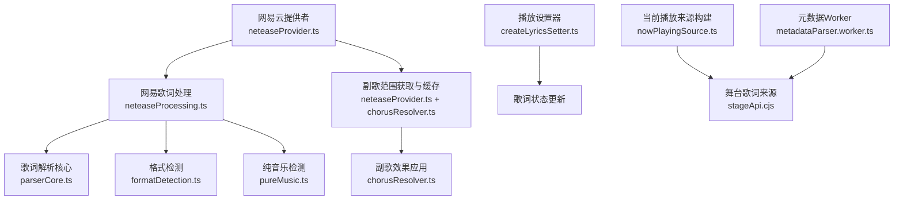
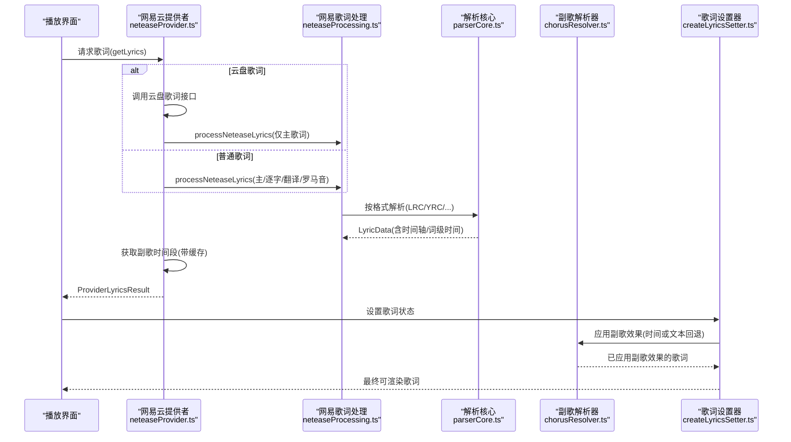
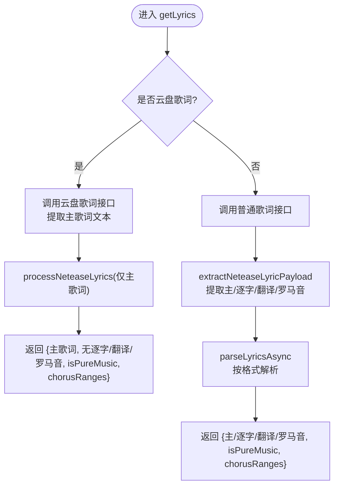
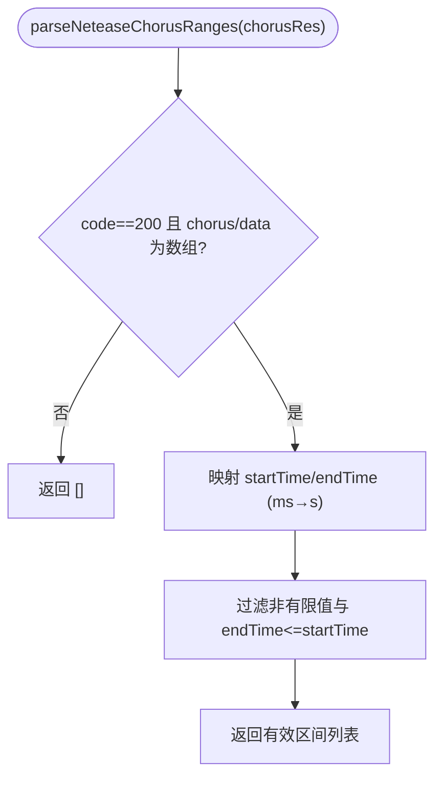
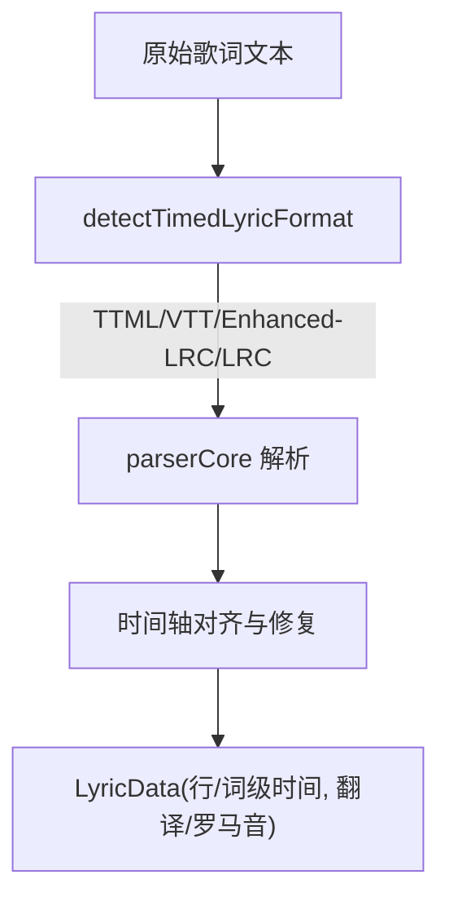
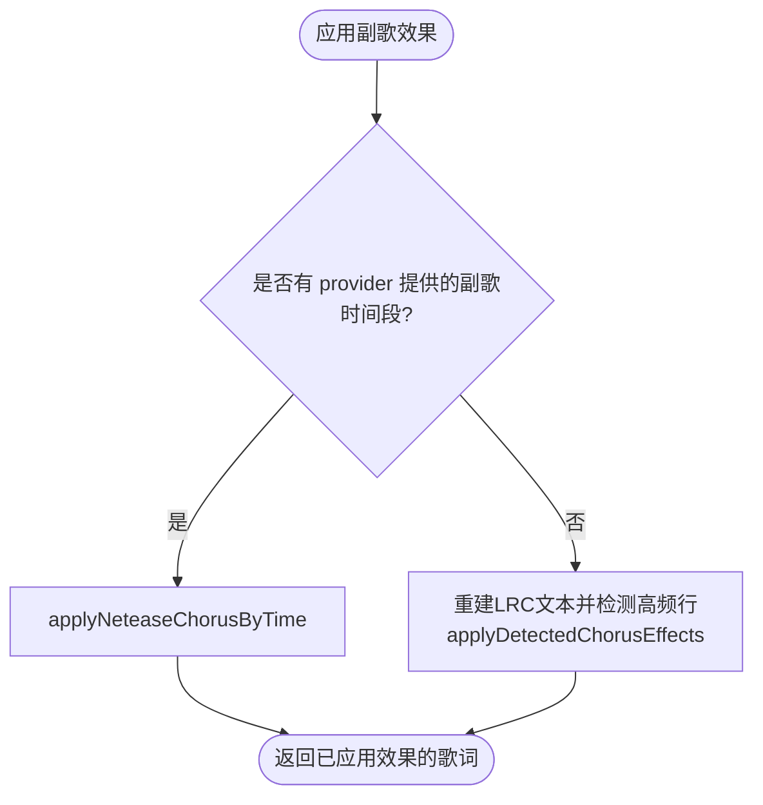
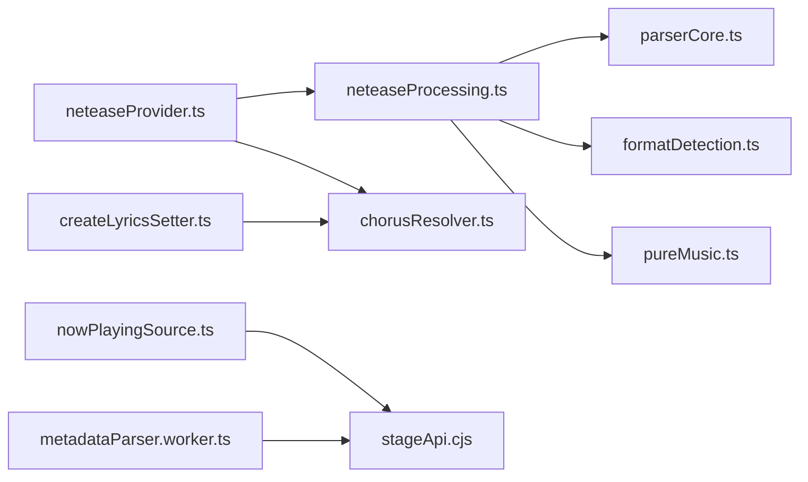

# 歌词系统

<cite>
**本文引用的文件**
- [neteaseProvider.ts](file://src/services/onlineMusic/neteaseProvider.ts)
- [neteaseProcessing.ts](file://src/utils/lyrics/neteaseProcessing.ts)
- [chorusResolver.ts](file://src/utils/lyrics/chorusResolver.ts)
- [formatDetection.ts](file://src/utils/lyrics/formatDetection.ts)
- [pureMusic.ts](file://src/utils/lyrics/pureMusic.ts)
- [parserCore.ts](file://src/utils/lyrics/parserCore.ts)
- [lrcParser.ts](file://src/utils/lrcParser.ts)
- [yrcParser.ts](file://src/utils/yrcParser.ts)
- [chorusDetector.ts](file://src/utils/chorusDetector.ts)
- [createLyricsSetter.ts](file://src/components/app/playback/createLyricsSetter.ts)
- [nowPlayingSource.ts](file://src/utils/lyrics/nowPlayingSource.ts)
- [stageApi.cjs](file://electron/stageApi.cjs)
- [metadataParser.worker.ts](file://src/workers/metadataParser.worker.ts)
</cite>

## 目录
1. [简介](#简介)
2. [项目结构](#项目结构)
3. [核心组件](#核心组件)
4. [架构总览](#架构总览)
5. [详细组件分析](#详细组件分析)
6. [依赖关系分析](#依赖关系分析)
7. [性能考量](#性能考量)
8. [故障排查指南](#故障排查指南)
9. [结论](#结论)
10. [附录](#附录)

## 简介
本文件系统性说明网易云音乐歌词能力在工程中的实现，覆盖普通歌词、逐字歌词（YRC）、翻译歌词、罗马音歌词的获取与处理；深入解析 getLyrics 函数对云盘歌词与普通歌词的不同分支；详解 parseNeteaseChorusRanges 副歌时间段识别与缓存机制；并介绍歌词格式转换、时间轴对齐、纯音乐检测等高级功能。

## 项目结构
围绕歌词能力的关键代码分布在以下位置：
- 在线提供者层：网易云歌词获取与结果组装
- 歌词处理层：网易歌词提取、解析、纯音乐判断、副歌范围应用
- 播放与渲染层：歌词设置、时间偏移、字幕格式转换、舞台歌词来源构建

图表来源
- [neteaseProvider.ts:179-213](file://src/services/onlineMusic/neteaseProvider.ts#L179-L213)
- [neteaseProcessing.ts:44-97](file://src/utils/lyrics/neteaseProcessing.ts#L44-L97)
- [parserCore.ts:467-921](file://src/utils/lyrics/parserCore.ts#L467-L921)
- [formatDetection.ts:17-58](file://src/utils/lyrics/formatDetection.ts#L17-L58)
- [pureMusic.ts:5-39](file://src/utils/lyrics/pureMusic.ts#L5-L39)
- [chorusResolver.ts:31-65](file://src/utils/lyrics/chorusResolver.ts#L31-L65)
- [createLyricsSetter.ts:78-94](file://src/components/app/playback/createLyricsSetter.ts#L78-L94)
- [nowPlayingSource.ts:8-40](file://src/utils/lyrics/nowPlayingSource.ts#L8-L40)
- [stageApi.cjs:70-108](file://electron/stageApi.cjs#L70-L108)
- [metadataParser.worker.ts:54-76](file://src/workers/metadataParser.worker.ts#L54-L76)

章节来源
- [neteaseProvider.ts:179-213](file://src/services/onlineMusic/neteaseProvider.ts#L179-L213)
- [neteaseProcessing.ts:44-97](file://src/utils/lyrics/neteaseProcessing.ts#L44-L97)
- [parserCore.ts:467-921](file://src/utils/lyrics/parserCore.ts#L467-L921)
- [formatDetection.ts:17-58](file://src/utils/lyrics/formatDetection.ts#L17-L58)
- [pureMusic.ts:5-39](file://src/utils/lyrics/pureMusic.ts#L5-L39)
- [chorusResolver.ts:31-65](file://src/utils/lyrics/chorusResolver.ts#L31-L65)
- [createLyricsSetter.ts:78-94](file://src/components/app/playback/createLyricsSetter.ts#L78-L94)
- [nowPlayingSource.ts:8-40](file://src/utils/lyrics/nowPlayingSource.ts#L8-L40)
- [stageApi.cjs:70-108](file://electron/stageApi.cjs#L70-L108)
- [metadataParser.worker.ts:54-76](file://src/workers/metadataParser.worker.ts#L54-L76)

## 核心组件
- 网易云提供者（getLyrics）：负责根据歌曲来源选择云盘或普通歌词接口，统一调用处理管线，并附带副歌时间段。
- 网易歌词处理（processNeteaseLyrics / extractNeteaseLyricPayload / parseNeteaseChorusRanges）：从原始响应中提取主歌词、逐字歌词、翻译、罗马音，判断纯音乐，解析为内部 LyricData，并解析副歌区间。
- 歌词解析核心（parserCore）：支持 LRC、增强 LRC、VTT、TTML、YRC、QRC、KRC、awlrc 等多种格式，完成时间轴对齐、词级时间戳、翻译/罗马音对齐。
- 副歌解析与效果（chorusResolver）：优先使用提供商提供的副歌时间段，否则回退到文本频率检测。
- 播放侧设置器（createLyricsSetter）：将处理后的歌词应用到播放状态，必要时再次应用副歌效果。
- 当前播放来源构建（nowPlayingSource）：将外部 Now Playing 载荷转换为本地歌词来源，区分 YRC/QRC/LRC。
- 舞台歌词工具（stageApi.cjs / metadataParser.worker.ts）：时间戳格式化、同步文本转 LRC、格式检测与候选择优。

章节来源
- [neteaseProvider.ts:179-213](file://src/services/onlineMusic/neteaseProvider.ts#L179-L213)
- [neteaseProcessing.ts:26-97](file://src/utils/lyrics/neteaseProcessing.ts#L26-L97)
- [parserCore.ts:467-921](file://src/utils/lyrics/parserCore.ts#L467-L921)
- [chorusResolver.ts:31-65](file://src/utils/lyrics/chorusResolver.ts#L31-L65)
- [createLyricsSetter.ts:78-94](file://src/components/app/playback/createLyricsSetter.ts#L78-L94)
- [nowPlayingSource.ts:8-40](file://src/utils/lyrics/nowPlayingSource.ts#L8-L40)
- [stageApi.cjs:70-108](file://electron/stageApi.cjs#L70-L108)
- [metadataParser.worker.ts:54-76](file://src/workers/metadataParser.worker.ts#L54-L76)

## 架构总览
下图展示从网易云提供者到最终歌词渲染的端到端流程，包括云盘与普通歌词分支、副歌时间段获取与应用、以及多格式解析与对齐。

图表来源
- [neteaseProvider.ts:179-213](file://src/services/onlineMusic/neteaseProvider.ts#L179-L213)
- [neteaseProcessing.ts:44-97](file://src/utils/lyrics/neteaseProcessing.ts#L44-L97)
- [parserCore.ts:467-921](file://src/utils/lyrics/parserCore.ts#L467-L921)
- [chorusResolver.ts:31-65](file://src/utils/lyrics/chorusResolver.ts#L31-L65)
- [createLyricsSetter.ts:78-94](file://src/components/app/playback/createLyricsSetter.ts#L78-L94)

## 详细组件分析

### 网易云提供者：getLyrics 实现逻辑
- 云盘歌词分支：当歌曲来源标记为云盘且提供用户ID时，调用云盘歌词接口，仅提取主歌词文本，走通用处理管线，返回主歌词、无逐字/翻译/罗马音，并附带副歌时间段。
- 普通歌词分支：调用普通歌词接口，若存在“已处理载荷”适配器则优先使用，否则直接使用原始响应；提取主歌词、逐字歌词（YRC）、翻译（优先 ytlrc，其次 tlyric）、罗马音（优先 yromalrc，其次 romalrc），并附带副歌时间段。
- 纯音乐判定：由处理管线基于标志位与文本内容综合判断。

图表来源
- [neteaseProvider.ts:179-213](file://src/services/onlineMusic/neteaseProvider.ts#L179-L213)
- [neteaseProcessing.ts:44-97](file://src/utils/lyrics/neteaseProcessing.ts#L44-L97)

章节来源
- [neteaseProvider.ts:179-213](file://src/services/onlineMusic/neteaseProvider.ts#L179-L213)

### parseNeteaseChorusRanges：副歌时间段识别与缓存
- 输入校验：仅当响应码为成功且包含数组型数据时继续。
- 字段映射：从 chorus 或 data 中读取 startTime/endTime，单位毫秒转秒，过滤无效区间。
- 缓存机制：在提供者层维护 Map 缓存，键为歌曲ID字符串，值为 Promise，避免重复请求；失败时返回空数组并记录警告日志。
- 集成点：getLyrics 在两种分支均会并发获取副歌时间段，供后续应用。

图表来源
- [neteaseProcessing.ts:26-42](file://src/utils/lyrics/neteaseProcessing.ts#L26-L42)
- [neteaseProvider.ts:98-116](file://src/services/onlineMusic/neteaseProvider.ts#L98-L116)

章节来源
- [neteaseProcessing.ts:26-42](file://src/utils/lyrics/neteaseProcessing.ts#L26-L42)
- [neteaseProvider.ts:98-116](file://src/services/onlineMusic/neteaseProvider.ts#L98-L116)

### 歌词格式转换与时间轴对齐
- 格式检测：自动识别 TTML、VTT、增强 LRC、标准 LRC；支持显式扩展名映射（vtt/ttml/qrc/yrc/krc）。
- 解析核心：
  - LRC：行级时间戳，词级时间通过估算或增强标签补齐。
  - YRC/QRC/KRC：词级绝对或相对时间戳，保持词级时序单调递增。
  - awlrc：容器内嵌词级时间，行末音节推导行结束时间。
  - 翻译/罗马音：按行起始时间匹配对齐，保证与主歌词同步。
- 时间轴对齐：确保词级时间不递减，行结束时间不小于最后一个词结束时间；对异常时间进行修正。

图表来源
- [formatDetection.ts:17-58](file://src/utils/lyrics/formatDetection.ts#L17-L58)
- [parserCore.ts:467-921](file://src/utils/lyrics/parserCore.ts#L467-L921)
- [parserCore.ts:1050-1084](file://src/utils/lyrics/parserCore.ts#L1050-L1084)

章节来源
- [formatDetection.ts:17-58](file://src/utils/lyrics/formatDetection.ts#L17-L58)
- [parserCore.ts:467-921](file://src/utils/lyrics/parserCore.ts#L467-L921)
- [parserCore.ts:1050-1084](file://src/utils/lyrics/parserCore.ts#L1050-L1084)

### 纯音乐检测
- 标志位检测：检查源对象中 pureMusic 标志（顶层或各子字段）。
- 文本检测：去除时间标签与 JSON 行后，若包含“纯音乐，请欣赏”提示则判定为纯音乐。
- 影响：当判定为纯音乐时，跳过歌词解析，直接返回空歌词数据。

章节来源
- [pureMusic.ts:5-39](file://src/utils/lyrics/pureMusic.ts#L5-L39)
- [neteaseProcessing.ts:44-77](file://src/utils/lyrics/neteaseProcessing.ts#L44-L77)

### 副歌时间段应用与文本回退
- 优先路径：若提供商提供了副歌时间段，则按时间段对歌词应用副歌效果。
- 回退路径：若无可用时间段，则基于主/逐字歌词文本的频率统计检测高潮段落，并应用效果。
- 播放侧：歌词设置器在设置状态前，若已有缓存的副歌时间段则应用，否则执行文本回退。

图表来源
- [chorusResolver.ts:31-65](file://src/utils/lyrics/chorusResolver.ts#L31-L65)
- [createLyricsSetter.ts:78-94](file://src/components/app/playback/createLyricsSetter.ts#L78-L94)
- [chorusDetector.ts:5-50](file://src/utils/chorusDetector.ts#L5-L50)

章节来源
- [chorusResolver.ts:31-65](file://src/utils/lyrics/chorusResolver.ts#L31-L65)
- [createLyricsSetter.ts:78-94](file://src/components/app/playback/createLyricsSetter.ts#L78-L94)
- [chorusDetector.ts:5-50](file://src/utils/chorusDetector.ts#L5-L50)

### 当前播放来源构建与舞台歌词
- nowPlayingSource：根据载荷字段判断是否为网易来源，优先使用卡拉OK歌词（YRC/QRC），否则回退到 LRC；同时携带翻译歌词。
- stageApi.cjs / metadataParser.worker.ts：提供时间戳格式化、同步文本转 LRC、格式检测与候选择优，用于舞台场景下的歌词呈现。

章节来源
- [nowPlayingSource.ts:8-40](file://src/utils/lyrics/nowPlayingSource.ts#L8-L40)
- [stageApi.cjs:70-108](file://electron/stageApi.cjs#L70-L108)
- [metadataParser.worker.ts:54-76](file://src/workers/metadataParser.worker.ts#L54-L76)

## 依赖关系分析
- neteaseProvider 依赖 neteaseProcessing 进行歌词提取与解析，并依赖自身缓存获取副歌时间段。
- neteaseProcessing 依赖 parserCore 进行多格式解析，依赖 formatDetection 进行格式识别，依赖 pureMusic 进行纯音乐判定。
- chorusResolver 依赖 provider 返回的副歌时间段，并在缺失时回退到文本检测。
- createLyricsSetter 消费 ProviderLyricsResult，并在设置阶段应用副歌效果。
- nowPlayingSource 与 stageApi 协作，将外部载荷转换为本地歌词来源。

图表来源
- [neteaseProvider.ts:179-213](file://src/services/onlineMusic/neteaseProvider.ts#L179-L213)
- [neteaseProcessing.ts:44-97](file://src/utils/lyrics/neteaseProcessing.ts#L44-L97)
- [parserCore.ts:467-921](file://src/utils/lyrics/parserCore.ts#L467-L921)
- [formatDetection.ts:17-58](file://src/utils/lyrics/formatDetection.ts#L17-L58)
- [pureMusic.ts:5-39](file://src/utils/lyrics/pureMusic.ts#L5-L39)
- [chorusResolver.ts:31-65](file://src/utils/lyrics/chorusResolver.ts#L31-L65)
- [createLyricsSetter.ts:78-94](file://src/components/app/playback/createLyricsSetter.ts#L78-L94)
- [nowPlayingSource.ts:8-40](file://src/utils/lyrics/nowPlayingSource.ts#L8-L40)
- [stageApi.cjs:70-108](file://electron/stageApi.cjs#L70-L108)
- [metadataParser.worker.ts:54-76](file://src/workers/metadataParser.worker.ts#L54-L76)

章节来源
- [neteaseProvider.ts:179-213](file://src/services/onlineMusic/neteaseProvider.ts#L179-L213)
- [neteaseProcessing.ts:44-97](file://src/utils/lyrics/neteaseProcessing.ts#L44-L97)
- [parserCore.ts:467-921](file://src/utils/lyrics/parserCore.ts#L467-L921)
- [formatDetection.ts:17-58](file://src/utils/lyrics/formatDetection.ts#L17-L58)
- [pureMusic.ts:5-39](file://src/utils/lyrics/pureMusic.ts#L5-L39)
- [chorusResolver.ts:31-65](file://src/utils/lyrics/chorusResolver.ts#L31-L65)
- [createLyricsSetter.ts:78-94](file://src/components/app/playback/createLyricsSetter.ts#L78-L94)
- [nowPlayingSource.ts:8-40](file://src/utils/lyrics/nowPlayingSource.ts#L8-L40)
- [stageApi.cjs:70-108](file://electron/stageApi.cjs#L70-L108)
- [metadataParser.worker.ts:54-76](file://src/workers/metadataParser.worker.ts#L54-L76)

## 性能考量
- 副歌时间段缓存：以歌曲ID为键缓存 Promise，避免重复网络请求，降低延迟与带宽消耗。
- 异步解析：歌词解析通过 workerClient 异步执行，避免阻塞主线程。
- 时间轴对齐优化：解析过程中对词级时间进行单调性校验与修正，减少渲染抖动。
- 文本回退策略：在无副歌时间段时采用轻量文本频率检测，兼顾可用性。

[本节为通用指导，无需特定文件引用]

## 故障排查指南
- 副歌时间段为空：检查提供商是否提供 getChorus 能力；查看缓存是否命中；确认 parseNeteaseChorusRanges 的输入结构与返回值。
- 歌词未显示：确认 isPureMusic 判定是否误判；检查格式检测是否正确；验证 parserCore 是否能解析对应格式。
- 时间轴错位：检查 awlrc 时间戳解析语义（毫秒分数而非小数）；核对词级时间单调性修复逻辑。
- 舞台歌词异常：确认 nowPlayingSource 的载荷字段与 stageApi 的时间戳格式化一致；检查同步文本转 LRC 的条件。

章节来源
- [neteaseProvider.ts:98-116](file://src/services/onlineMusic/neteaseProvider.ts#L98-L116)
- [neteaseProcessing.ts:26-42](file://src/utils/lyrics/neteaseProcessing.ts#L26-L42)
- [parserCore.ts:1050-1084](file://src/utils/lyrics/parserCore.ts#L1050-L1084)
- [nowPlayingSource.ts:8-40](file://src/utils/lyrics/nowPlayingSource.ts#L8-L40)
- [stageApi.cjs:70-108](file://electron/stageApi.cjs#L70-L108)

## 结论
该歌词系统以网易云提供者为核心入口，结合统一的歌词处理管线与多格式解析能力，实现了普通歌词、逐字歌词、翻译歌词、罗马音歌词的完整链路；通过副歌时间段缓存与文本回退策略，提升了鲁棒性与性能；同时借助时间轴对齐与纯音乐检测，保障了渲染质量与用户体验。

[本节为总结性内容，无需特定文件引用]

## 附录
- 常用工具函数路径参考：
  - 歌词解析：[parserCore.ts](file://src/utils/lyrics/parserCore.ts)
  - 格式检测：[formatDetection.ts](file://src/utils/lyrics/formatDetection.ts)
  - 纯音乐检测：[pureMusic.ts](file://src/utils/lyrics/pureMusic.ts)
  - 副歌检测：[chorusDetector.ts](file://src/utils/chorusDetector.ts)
  - 网易处理：[neteaseProcessing.ts](file://src/utils/lyrics/neteaseProcessing.ts)
  - 提供者：[neteaseProvider.ts](file://src/services/onlineMusic/neteaseProvider.ts)
  - 播放设置：[createLyricsSetter.ts](file://src/components/app/playback/createLyricsSetter.ts)
  - 当前播放来源：[nowPlayingSource.ts](file://src/utils/lyrics/nowPlayingSource.ts)
  - 舞台工具：[stageApi.cjs](file://electron/stageApi.cjs), [metadataParser.worker.ts](file://src/workers/metadataParser.worker.ts)

[本节为索引性内容，无需特定文件引用]