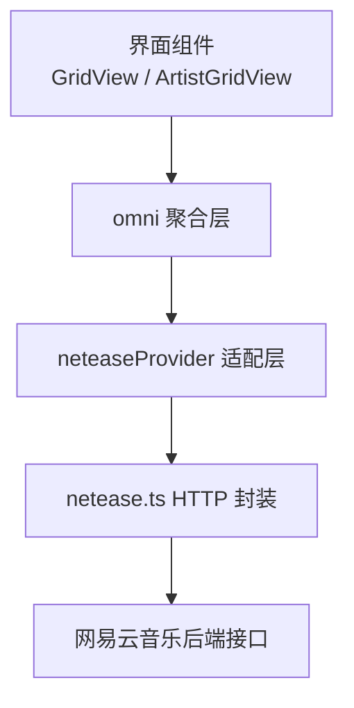
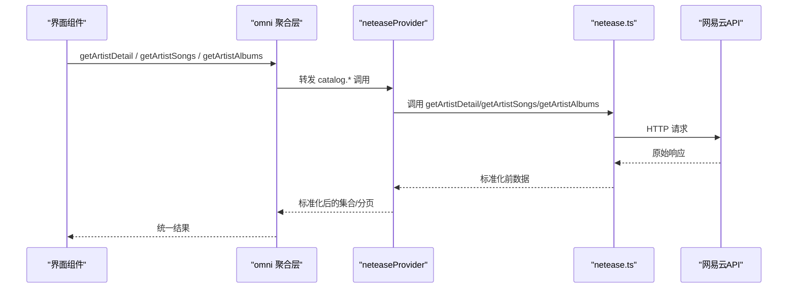
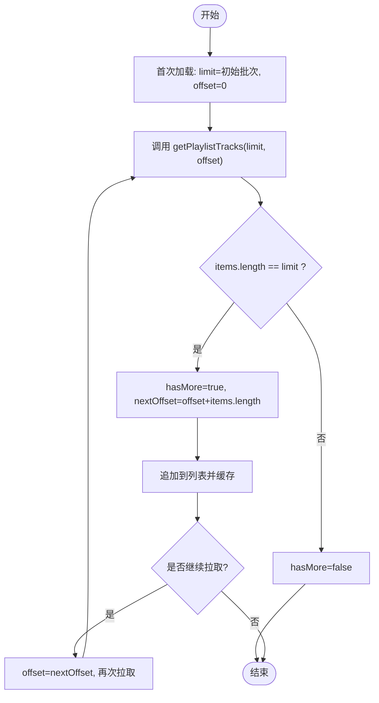
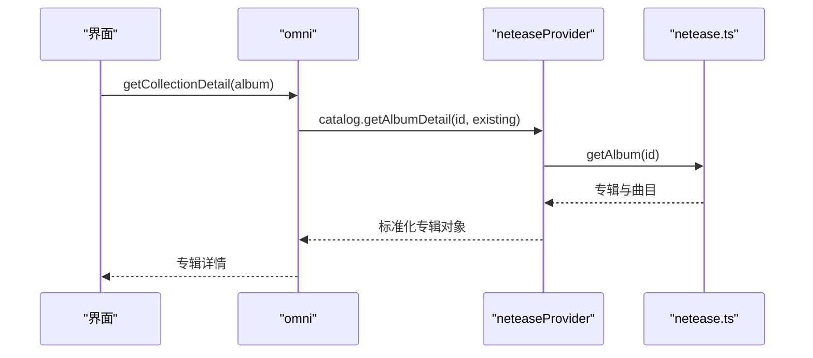
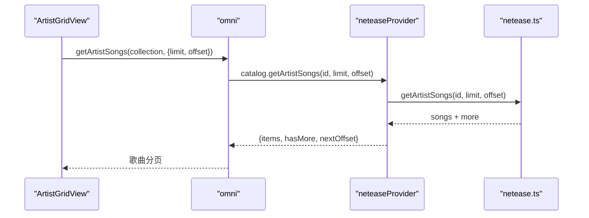
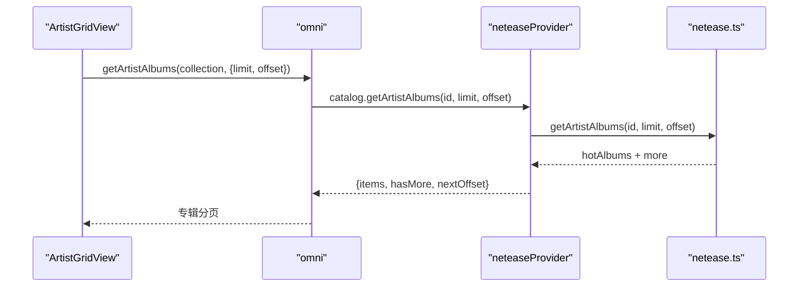
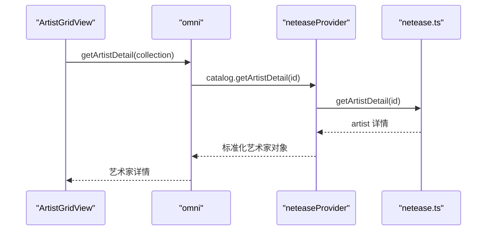
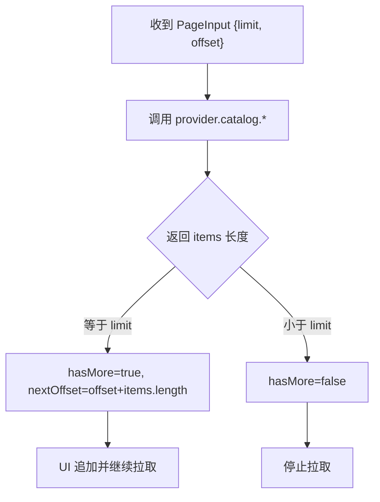
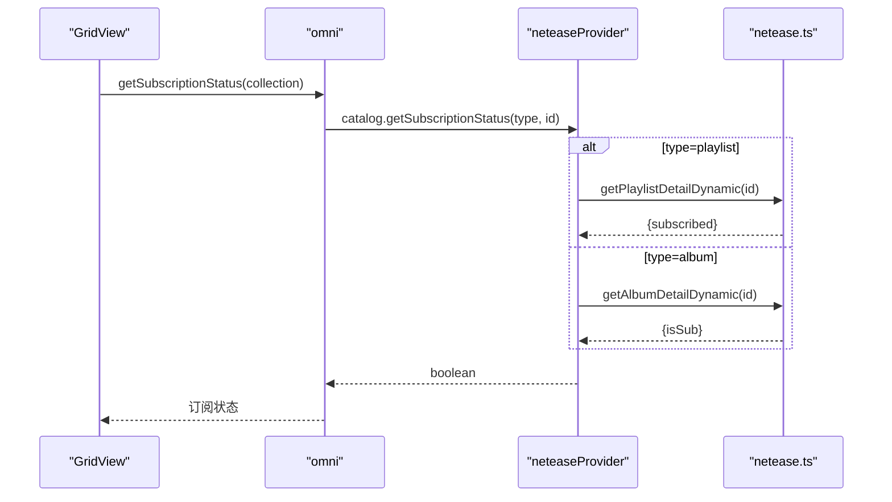
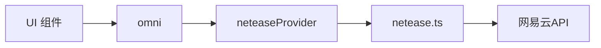

# 目录浏览

<cite>
**本文引用的文件**
- [netease.ts](file://src/services/netease.ts)
- [neteaseProvider.ts](file://src/services/onlineMusic/neteaseProvider.ts)
- [omni.ts](file://src/services/onlineMusic/omni.ts)
- [GridView.tsx](file://src/components/GridView.tsx)
- [ArtistGridView.tsx](file://src/components/ArtistGridView.tsx)
</cite>

## 目录
1. [简介](#简介)
2. [项目结构](#项目结构)
3. [核心组件](#核心组件)
4. [架构总览](#架构总览)
5. [详细组件分析](#详细组件分析)
6. [依赖关系分析](#依赖关系分析)
7. [性能考量](#性能考量)
8. [故障排查指南](#故障排查指南)
9. [结论](#结论)

## 简介
本文件聚焦网易云音乐的“目录浏览”能力，覆盖歌单、专辑、艺术家等内容的获取与展示；深入解析以下API的实现逻辑：getPlaylistTracks、getAlbumDetail、getArtistSongs、getArtistAlbums、getArtistDetail。同时说明分页加载机制（limit、offset、hasMore）以及订阅状态检查与动态信息获取。

## 项目结构
围绕目录浏览的关键代码分布在三层：
- 底层HTTP封装与网易云API调用：netease.ts
- 面向多平台的统一提供者适配层：neteaseProvider.ts
- 跨平台聚合与路由：omni.ts
- 前端展示与分页消费：GridView.tsx、ArtistGridView.tsx

图表来源
- [GridView.tsx:1100-1299](file://src/components/GridView.tsx#L1100-L1299)
- [ArtistGridView.tsx:400-599](file://src/components/ArtistGridView.tsx#L400-L599)
- [omni.ts:460-482](file://src/services/onlineMusic/omni.ts#L460-L482)
- [neteaseProvider.ts:371-441](file://src/services/onlineMusic/neteaseProvider.ts#L371-L441)
- [netease.ts:560-663](file://src/services/netease.ts#L560-L663)

章节来源
- [GridView.tsx:1100-1299](file://src/components/GridView.tsx#L1100-L1299)
- [ArtistGridView.tsx:400-599](file://src/components/ArtistGridView.tsx#L400-L599)
- [omni.ts:460-482](file://src/services/onlineMusic/omni.ts#L460-L482)
- [neteaseProvider.ts:371-441](file://src/services/onlineMusic/neteaseProvider.ts#L371-L441)
- [netease.ts:560-663](file://src/services/netease.ts#L560-L663)

## 核心组件
- netease.ts：提供网易云音乐HTTP请求封装与具体API方法（如歌单曲目、专辑详情、艺术家歌曲/专辑/详情、订阅/动态等）。
- neteaseProvider.ts：将网易云数据标准化为统一的在线音乐提供者接口，实现catalog目录能力（歌单、专辑、艺术家）及订阅状态查询。
- omni.ts：根据当前活跃提供者路由到对应provider的catalog方法，并提供空页、聚合入口。
- GridView.tsx：负责在线歌单/专辑的分页加载、缓存、后台增量拉取、手动加载更多、订阅状态读取。
- ArtistGridView.tsx：艺术家页面，并行拉取艺术家详情与热门歌曲，并加载专辑列表。

章节来源
- [netease.ts:560-663](file://src/services/netease.ts#L560-L663)
- [neteaseProvider.ts:371-441](file://src/services/onlineMusic/neteaseProvider.ts#L371-L441)
- [omni.ts:460-482](file://src/services/onlineMusic/omni.ts#L460-L482)
- [GridView.tsx:1100-1299](file://src/components/GridView.tsx#L1100-L1299)
- [ArtistGridView.tsx:400-599](file://src/components/ArtistGridView.tsx#L400-L599)

## 架构总览
目录浏览的数据流从UI发起，经omni路由至具体provider，再调用netease.ts的HTTP方法访问网易云API，返回后在provider层做标准化，最终由UI进行渲染与分页控制。

图表来源
- [omni.ts:460-482](file://src/services/onlineMusic/omni.ts#L460-L482)
- [neteaseProvider.ts:408-434](file://src/services/onlineMusic/neteaseProvider.ts#L408-L434)
- [netease.ts:610-663](file://src/services/netease.ts#L610-L663)

## 详细组件分析

### 歌单曲目：getPlaylistTracks
- 调用链：GridView -> omni -> neteaseProvider.catalog.getPlaylistTracks -> neteaseApi.getPlaylistTracks
- 行为要点：
  - 通过limit/offset分页拉取曲目，返回items、hasMore、nextOffset。
  - hasMore判断依据：当返回条目数等于limit时认为还有下一页。
  - nextOffset = offset + items.length。
- 展示与分页：
  - 首次加载使用GRID_INITIAL_BATCH_SIZE，后续后台循环以GRID_BACKGROUND_BATCH_SIZE增量拉取，直到达到trackCount或hasMore=false。
  - 支持手动加载更多，批量追加并更新offset与hasMore。

图表来源
- [neteaseProvider.ts:371-376](file://src/services/onlineMusic/neteaseProvider.ts#L371-L376)
- [GridView.tsx:1100-1299](file://src/components/GridView.tsx#L1100-L1299)

章节来源
- [neteaseProvider.ts:371-376](file://src/services/onlineMusic/neteaseProvider.ts#L371-L376)
- [GridView.tsx:1100-1299](file://src/components/GridView.tsx#L1100-L1299)

### 专辑详情：getAlbumDetail
- 调用链：omni.getCollectionDetail -> neteaseProvider.catalog.getAlbumDetail -> neteaseApi.getAlbum
- 行为要点：
  - 获取专辑基本信息（名称、封面、描述、创作者、发布时间、出版方等），并保留已有集合字段回退。
  - 专辑曲目通过getAlbumTracks一次性返回（无分页），hasMore固定为false。
- 展示：用于专辑详情页头部信息与曲目列表。

图表来源
- [neteaseProvider.ts:385-407](file://src/services/onlineMusic/neteaseProvider.ts#L385-L407)
- [netease.ts:584-593](file://src/services/netease.ts#L584-L593)

章节来源
- [neteaseProvider.ts:385-407](file://src/services/onlineMusic/neteaseProvider.ts#L385-L407)
- [netease.ts:584-593](file://src/services/netease.ts#L584-L593)

### 艺术家歌曲：getArtistSongs
- 调用链：ArtistGridView/GridView -> omni.getArtistSongs -> neteaseProvider.catalog.getArtistSongs -> neteaseApi.getArtistSongs
- 行为要点：
  - 支持limit/offset分页，hasMore由服务端more字段决定。
  - nextOffset = offset + items.length。
- 展示：艺术家页面顶部“热门歌曲”列表，默认拉取前若干首。

图表来源
- [ArtistGridView.tsx:400-430](file://src/components/ArtistGridView.tsx#L400-L430)
- [neteaseProvider.ts:408-412](file://src/services/onlineMusic/neteaseProvider.ts#L408-L412)
- [netease.ts:659-663](file://src/services/netease.ts#L659-L663)

章节来源
- [ArtistGridView.tsx:400-430](file://src/components/ArtistGridView.tsx#L400-L430)
- [neteaseProvider.ts:408-412](file://src/services/onlineMusic/neteaseProvider.ts#L408-L412)
- [netease.ts:659-663](file://src/services/netease.ts#L659-L663)

### 艺术家专辑：getArtistAlbums
- 调用链：ArtistGridView/GridView -> omni.getArtistAlbums -> neteaseProvider.catalog.getArtistAlbums -> neteaseApi.getArtistAlbums
- 行为要点：
  - 支持limit/offset分页，hasMore由服务端more字段决定。
  - nextOffset = offset + items.length。
  - 另有getAllArtistAlbums工具函数，按50条一页循环拉取直至more=false，并去重重复页。
- 展示：艺术家页面专辑网格。

图表来源
- [neteaseProvider.ts:413-417](file://src/services/onlineMusic/neteaseProvider.ts#L413-L417)
- [netease.ts:620-651](file://src/services/netease.ts#L620-L651)

章节来源
- [neteaseProvider.ts:413-417](file://src/services/onlineMusic/neteaseProvider.ts#L413-L417)
- [netease.ts:620-651](file://src/services/netease.ts#L620-L651)

### 艺术家详情：getArtistDetail
- 调用链：ArtistGridView -> omni.getArtistDetail -> neteaseProvider.catalog.getArtistDetail -> neteaseApi.getArtistDetail
- 行为要点：
  - 返回艺术家基本信息、封面、描述、曲目数量、专辑数量、别名等。
  - 用于艺术家页面头部信息展示。

图表来源
- [ArtistGridView.tsx:400-430](file://src/components/ArtistGridView.tsx#L400-L430)
- [neteaseProvider.ts:418-434](file://src/services/onlineMusic/neteaseProvider.ts#L418-L434)
- [netease.ts:610-618](file://src/services/netease.ts#L610-L618)

章节来源
- [ArtistGridView.tsx:400-430](file://src/components/ArtistGridView.tsx#L400-L430)
- [neteaseProvider.ts:418-434](file://src/services/onlineMusic/neteaseProvider.ts#L418-L434)
- [netease.ts:610-618](file://src/services/netease.ts#L610-L618)

### 分页加载机制（limit、offset、hasMore）
- 统一分页契约：
  - 输入：PageInput { limit, offset }
  - 输出：OmniPage<T> { items, hasMore, nextOffset }
  - emptyPage(offset) 用于不支持或未实现的兜底。
- 各API分页策略：
  - 歌单曲目：hasMore = items.length === limit；nextOffset = offset + items.length。
  - 专辑曲目：一次性返回，hasMore=false。
  - 艺术家歌曲/专辑：hasMore = response.more；nextOffset = offset + items.length。
  - 用户收藏专辑：hasMore = response.hasMore；nextOffset = offset + items.length。
- 前端消费：
  - 首次加载使用较大批次，随后后台循环增量拉取，直到达到总数或hasMore=false。
  - 手动加载更多时，批量追加并更新offset与hasMore。

图表来源
- [omni.ts:39-60](file://src/services/onlineMusic/omni.ts#L39-L60)
- [neteaseProvider.ts:371-417](file://src/services/onlineMusic/neteaseProvider.ts#L371-L417)
- [GridView.tsx:1100-1299](file://src/components/GridView.tsx#L1100-L1299)

章节来源
- [omni.ts:39-60](file://src/services/onlineMusic/omni.ts#L39-L60)
- [neteaseProvider.ts:371-417](file://src/services/onlineMusic/neteaseProvider.ts#L371-L417)
- [GridView.tsx:1100-1299](file://src/components/GridView.tsx#L1100-L1299)

### 订阅状态检查与动态信息获取
- 订阅状态：
  - 通过omni.getSubscriptionStatus(collection)路由到provider的catalog.getSubscriptionStatus(type, id)。
  - 网易云侧：
    - 歌单：调用playlist/detail/dynamic，返回subscribed字段。
    - 专辑：调用album/detail/dynamic，返回isSub字段。
- 前端展示：
  - GridView在打开在线歌单/专辑时，异步获取订阅状态并显示订阅按钮状态。
- 订阅操作：
  - 支持subscribePlaylist与subscribeAlbum，分别调用playlist/subscribe与album/sub接口。

图表来源
- [omni.ts:477-480](file://src/services/onlineMusic/omni.ts#L477-L480)
- [neteaseProvider.ts:435-440](file://src/services/onlineMusic/neteaseProvider.ts#L435-L440)
- [netease.ts:819-825](file://src/services/netease.ts#L819-L825)
- [GridView.tsx:1277-1305](file://src/components/GridView.tsx#L1277-L1305)

章节来源
- [omni.ts:477-480](file://src/services/onlineMusic/omni.ts#L477-L480)
- [neteaseProvider.ts:435-440](file://src/services/onlineMusic/neteaseProvider.ts#L435-L440)
- [netease.ts:819-825](file://src/services/netease.ts#L819-L825)
- [GridView.tsx:1277-1305](file://src/components/GridView.tsx#L1277-L1305)

## 依赖关系分析
- 低耦合高内聚：
  - netease.ts仅关注HTTP与网易云数据结构转换。
  - neteaseProvider.ts专注将网易云数据映射到统一模型，屏蔽差异。
  - omni.ts作为路由层，避免UI直接依赖具体provider。
  - UI组件只消费统一分页结果与状态。
- 关键依赖链：
  - UI -> omni -> neteaseProvider -> netease.ts -> 网易云API

图表来源
- [omni.ts:460-482](file://src/services/onlineMusic/omni.ts#L460-L482)
- [neteaseProvider.ts:371-441](file://src/services/onlineMusic/neteaseProvider.ts#L371-L441)
- [netease.ts:560-663](file://src/services/netease.ts#L560-L663)

章节来源
- [omni.ts:460-482](file://src/services/onlineMusic/omni.ts#L460-L482)
- [neteaseProvider.ts:371-441](file://src/services/onlineMusic/neteaseProvider.ts#L371-L441)
- [netease.ts:560-663](file://src/services/netease.ts#L560-L663)

## 性能考量
- 分批与后台增量：
  - 首次加载使用较大批次减少往返次数；后台循环小批次增量拉取，避免阻塞主线程。
- 去重与防抖：
  - 后台拉取时对新增项按播放键去重，防止重复插入。
  - 背景拉取加入延时与安全计数，防止死循环。
- 缓存：
  - 每次拉取后将结果写入本地缓存，提升切换体验。
- 资源优化：
  - 专辑曲目一次性返回，避免多次请求。
  - 艺术家热门歌曲仅拉取少量用于展示。

[本节为通用指导，不直接分析具体文件]

## 故障排查指南
- 无法获取订阅状态：
  - 检查网络与Cookie是否正确传递；确认endpoint是否需要timestamp参数。
  - 若返回未登录错误码，清除匿名Cookie并重试。
- 分页卡住或无限循环：
  - 检查hasMore与items.length的关系；确保nextOffset正确递增。
  - 遇到空页立即停止拉取，避免死循环。
- 艺术家专辑重复：
  - 使用getAllArtistAlbums时的去重逻辑，基于专辑ID去重。
- 歌单/专辑详情为空：
  - 校验id有效性；检查返回结构是否包含必要字段。

章节来源
- [netease.ts:57-123](file://src/services/netease.ts#L57-L123)
- [GridView.tsx:1166-1222](file://src/components/GridView.tsx#L1166-L1222)
- [netease.ts:630-651](file://src/services/netease.ts#L630-L651)

## 结论
本项目通过分层设计实现了网易云音乐目录浏览的统一抽象：底层HTTP封装、中间适配层、上层聚合与UI消费。歌单、专辑、艺术家的获取与展示遵循一致的分页契约，结合后台增量拉取与缓存策略，提供良好的用户体验。订阅状态通过动态接口实时获取，保证界面状态与服务端一致。整体架构清晰、可扩展性强，便于接入其他在线音乐提供商。