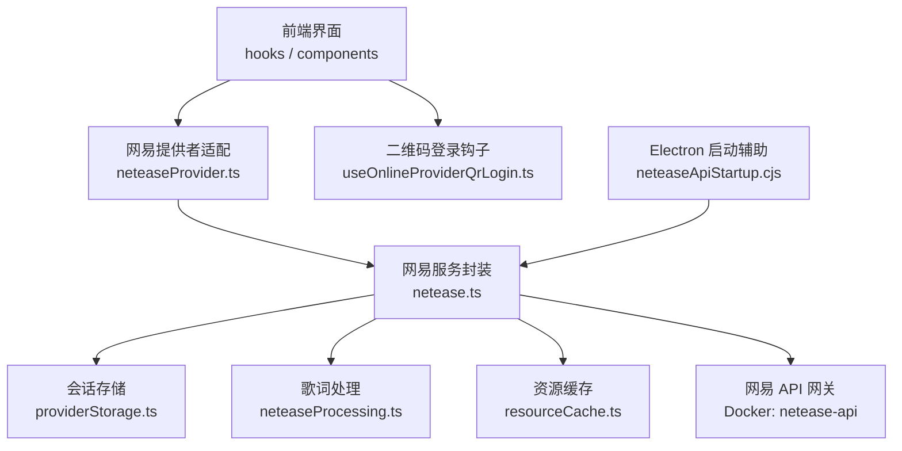
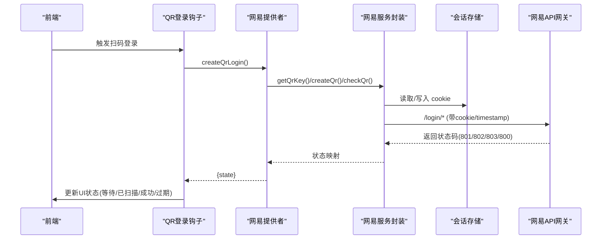
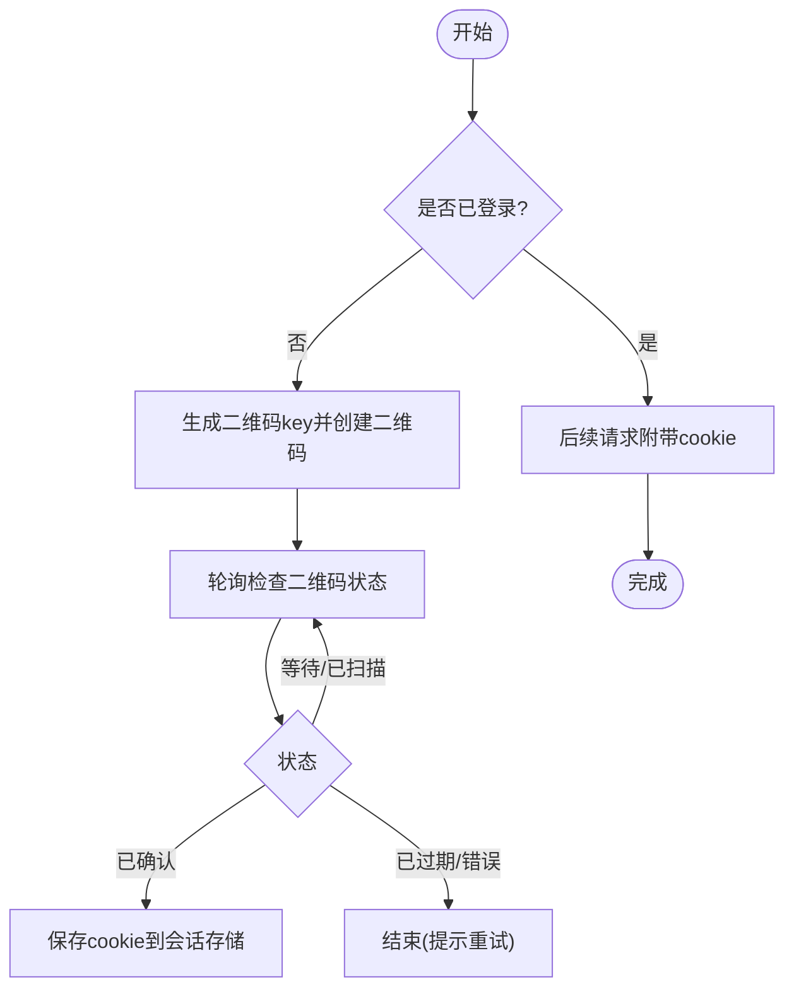
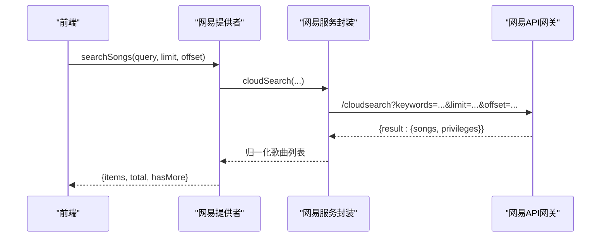
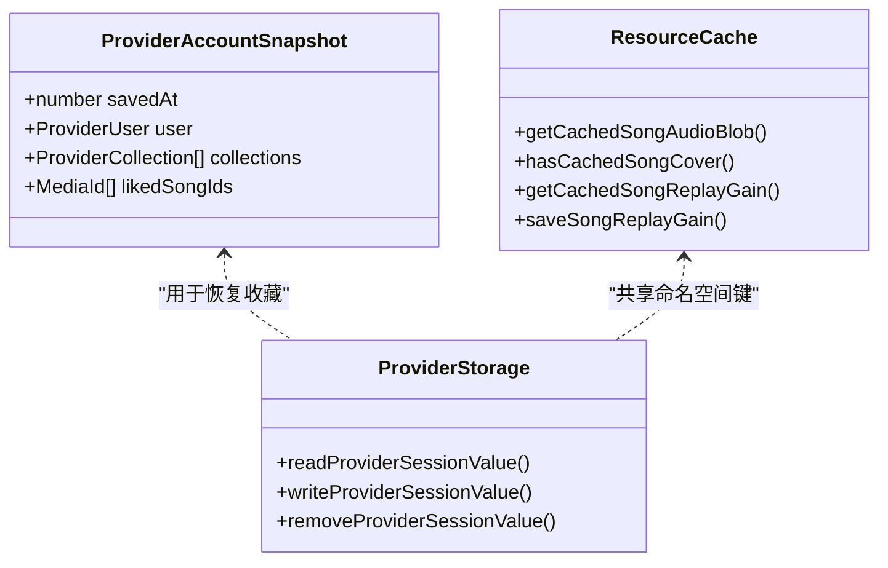
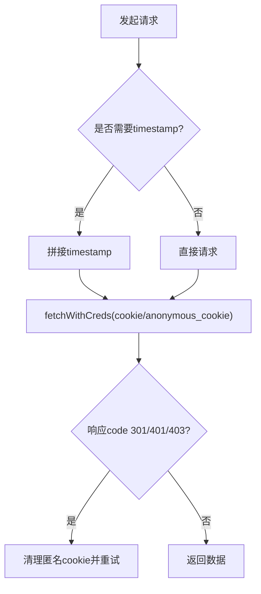
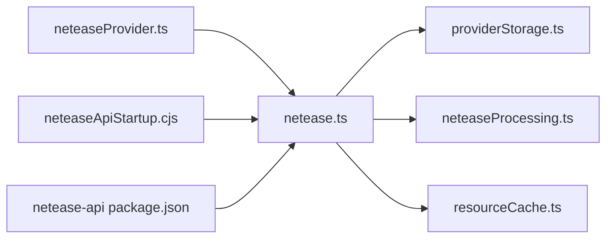

# 网易云音乐集成

<cite>
**本文引用的文件**
- [src/services/netease.ts](file://src/services/netease.ts)
- [src/services/onlineMusic/neteaseProvider.ts](file://src/services/onlineMusic/neteaseProvider.ts)
- [src/utils/lyrics/neteaseProcessing.ts](file://src/utils/lyrics/neteaseProcessing.ts)
- [src/services/onlineMusic/providerStorage.ts](file://src/services/onlineMusic/providerStorage.ts)
- [electron/neteaseApiStartup.cjs](file://electron/neteaseApiStartup.cjs)
- [deploy/docker/netease-api/package.json](file://deploy/docker/netease-api/package.json)
- [src/hooks/useOnlineProviderQrLogin.ts](file://src/hooks/useOnlineProviderQrLogin.ts)
- [src/services/onlineMusic/resourceCache.ts](file://src/services/onlineMusic/resourceCache.ts)
- [src/services/onlineMusic/providerAccountCache.ts](file://src/services/onlineMusic/providerAccountCache.ts)
- [test/unit/onlineMusic/neteaseProvider.test.ts](file://test/unit/onlineMusic/neteaseProvider.test.ts)
</cite>

## 目录
1. [简介](#简介)
2. [项目结构](#项目结构)
3. [核心组件](#核心组件)
4. [架构总览](#架构总览)
5. [详细组件分析](#详细组件分析)
6. [依赖关系分析](#依赖关系分析)
7. [性能考虑](#性能考虑)
8. [故障排查指南](#故障排查指南)
9. [结论](#结论)
10. [附录](#附录)

## 简介
本技术文档围绕网易云音乐集成展开，系统说明认证流程（Cookie 登录、二维码登录、Token 刷新与会话管理）、API 调用方式（搜索、播放、歌词、歌单、推荐、私人 FM、云盘等）、本地状态同步机制（账户刷新时保持收藏连续性）、错误处理与重试策略，以及性能优化实践（请求缓存、批量操作、分页加载）。目标是帮助开发者快速理解并高效维护该集成。

## 项目结构
网易云音乐集成由前端服务层、提供者适配层、歌词处理、会话存储、Electron 启动辅助与 Docker 化 API 组成：
- 服务层：封装 HTTP 请求、鉴权 Cookie 注入、数据归一化、API 聚合
- 提供者适配层：对外暴露统一的 OnlineMusicProvider 接口，屏蔽网易差异
- 歌词处理：解析多格式歌词、纯音乐识别、副歌区间提取
- 会话存储：基于 localStorage 的命名空间键值存储，支持迁移
- Electron 启动辅助：匿名 Token 刷新、xeapi 公钥刷新、指数退避重试
- Docker API：使用增强版网易云 API 库

图表来源
- [src/services/netease.ts:1-123](file://src/services/netease.ts#L1-L123)
- [src/services/onlineMusic/neteaseProvider.ts:215-296](file://src/services/onlineMusic/neteaseProvider.ts#L215-L296)
- [src/utils/lyrics/neteaseProcessing.ts:64-97](file://src/utils/lyrics/neteaseProcessing.ts#L64-L97)
- [src/services/onlineMusic/providerStorage.ts:33-54](file://src/services/onlineMusic/providerStorage.ts#L33-L54)
- [electron/neteaseApiStartup.cjs:55-162](file://electron/neteaseApiStartup.cjs#L55-L162)
- [deploy/docker/netease-api/package.json:1-9](file://deploy/docker/netease-api/package.json#L1-L9)

章节来源
- [src/services/netease.ts:1-123](file://src/services/netease.ts#L1-L123)
- [src/services/onlineMusic/neteaseProvider.ts:215-296](file://src/services/onlineMusic/neteaseProvider.ts#L215-L296)
- [src/utils/lyrics/neteaseProcessing.ts:64-97](file://src/utils/lyrics/neteaseProcessing.ts#L64-L97)
- [src/services/onlineMusic/providerStorage.ts:33-54](file://src/services/onlineMusic/providerStorage.ts#L33-L54)
- [electron/neteaseApiStartup.cjs:55-162](file://electron/neteaseApiStartup.cjs#L55-L162)
- [deploy/docker/netease-api/package.json:1-9](file://deploy/docker/netease-api/package.json#L1-L9)

## 核心组件
- 网易服务封装（netease.ts）
  - 统一 fetchWithCreds：自动附加 cookie、匿名用户 cookie、timestamp 防缓存
  - 数据归一化：歌曲、专辑、歌手、歌单、权限信息、无版权替代方案
  - API 聚合：登录、用户、歌单、专辑、歌手、歌曲详情/URL、歌词、云盘、搜索、每日推荐、私人 FM、历史推荐
- 网易提供者适配（neteaseProvider.ts）
  - 标准化 Song/User/Collection，统一对外能力声明
  - 播放可用性判断与替代曲获取
  - 歌词获取（含云盘歌词与副歌区间）
  - 推荐、收藏、订阅、歌单变更等能力
- 歌词处理（neteaseProcessing.ts）
  - 多源歌词提取、纯音乐检测、yrc/tlyric/romalrc 组合
  - 副歌区间解析与缓存
- 会话存储（providerStorage.ts）
  - 命名空间化的 localStorage 读写，支持旧键迁移
- Electron 启动辅助（neteaseApiStartup.cjs）
  - 匿名 Token 刷新、xeapi 公钥刷新、指数退避重试
- Docker API（package.json）
  - 依赖增强版网易云 API 库

章节来源
- [src/services/netease.ts:1-123](file://src/services/netease.ts#L1-L123)
- [src/services/onlineMusic/neteaseProvider.ts:215-296](file://src/services/onlineMusic/neteaseProvider.ts#L215-L296)
- [src/utils/lyrics/neteaseProcessing.ts:26-97](file://src/utils/lyrics/neteaseProcessing.ts#L26-L97)
- [src/services/onlineMusic/providerStorage.ts:33-54](file://src/services/onlineMusic/providerStorage.ts#L33-L54)
- [electron/neteaseApiStartup.cjs:55-162](file://electron/neteaseApiStartup.cjs#L55-L162)
- [deploy/docker/netease-api/package.json:1-9](file://deploy/docker/netease-api/package.json#L1-L9)

## 架构总览
下图展示从前端到网易 API 的完整链路，包括认证、会话、资源与歌词处理。

图表来源
- [src/hooks/useOnlineProviderQrLogin.ts:77-159](file://src/hooks/useOnlineProviderQrLogin.ts#L77-L159)
- [src/services/onlineMusic/neteaseProvider.ts:297-339](file://src/services/onlineMusic/neteaseProvider.ts#L297-L339)
- [src/services/netease.ts:504-529](file://src/services/netease.ts#L504-L529)
- [src/services/onlineMusic/providerStorage.ts:33-54](file://src/services/onlineMusic/providerStorage.ts#L33-L54)

章节来源
- [src/hooks/useOnlineProviderQrLogin.ts:77-159](file://src/hooks/useOnlineProviderQrLogin.ts#L77-L159)
- [src/services/onlineMusic/neteaseProvider.ts:297-339](file://src/services/onlineMusic/neteaseProvider.ts#L297-L339)
- [src/services/netease.ts:504-529](file://src/services/netease.ts#L504-L529)
- [src/services/onlineMusic/providerStorage.ts:33-54](file://src/services/onlineMusic/providerStorage.ts#L33-L54)

## 详细组件分析

### 认证流程（Cookie 登录、二维码登录、Token 刷新与会话管理）
- Cookie 注入与匿名用户 Cookie
  - 非登录/账号类接口优先尝试匿名用户 Cookie；若返回 301/401/403 则清理匿名 Cookie
  - 登录/账号/登出接口不携带匿名 Cookie，避免污染
  - 关键端点追加 timestamp 防止动态用户数据被缓存
- 二维码登录
  - 前端轮询 checkQr，状态码映射为 waiting/scanned/confirmed/expired/error
  - 成功后持久化 cookie，供后续请求复用
- 会话存储
  - 使用 provider 命名空间键存储 cookie，支持旧键迁移
- Electron 启动辅助
  - 启动阶段刷新 xeapi 公钥与匿名 Token，失败时回退到缓存并保持可用
  - 指数退避重试，避免瞬时网络抖动导致启动失败

图表来源
- [src/services/netease.ts:57-123](file://src/services/netease.ts#L57-L123)
- [src/services/onlineMusic/neteaseProvider.ts:297-339](file://src/services/onlineMusic/neteaseProvider.ts#L297-L339)
- [src/services/onlineMusic/providerStorage.ts:33-54](file://src/services/onlineMusic/providerStorage.ts#L33-L54)
- [electron/neteaseApiStartup.cjs:122-162](file://electron/neteaseApiStartup.cjs#L122-L162)

章节来源
- [src/services/netease.ts:57-123](file://src/services/netease.ts#L57-L123)
- [src/services/onlineMusic/neteaseProvider.ts:297-339](file://src/services/onlineMusic/neteaseProvider.ts#L297-L339)
- [src/services/onlineMusic/providerStorage.ts:33-54](file://src/services/onlineMusic/providerStorage.ts#L33-L54)
- [electron/neteaseApiStartup.cjs:122-162](file://electron/neteaseApiStartup.cjs#L122-L162)

### API 调用方式（搜索、播放、歌词、歌单、推荐、私人 FM、云盘）
- 搜索
  - cloudSearch：关键词搜索，合并 privileges，返回分页结果
- 播放
  - getSongUrl：默认 exhigh 音质，随机 IP 与 HTTPS 提升成功率
  - getSongDetail：批量获取歌曲详情，合并 privileges
  - 可用性判断与替代曲：根据 privilege.st 标记不可用，尝试通过 detail 或版权推荐接口获取替代版本
- 歌词
  - getLyric/getCloudLyric：标准歌词与云盘歌词
  - 歌词处理：多格式提取、纯音乐识别、翻译/罗马音、副歌区间
- 歌单/专辑/歌手
  - 歌单详情与曲目、专辑详情与曲目、歌手详情与热门专辑/歌曲
- 推荐与私人 FM
  - 每日推荐、历史推荐、私人 FM（支持模式选择，不支持时回退）
- 云盘
  - 获取云盘列表与详情，归一化为云端歌曲类型

图表来源
- [src/services/onlineMusic/neteaseProvider.ts:251-257](file://src/services/onlineMusic/neteaseProvider.ts#L251-L257)
- [src/services/netease.ts:720-727](file://src/services/netease.ts#L720-L727)

章节来源
- [src/services/netease.ts:396-469](file://src/services/netease.ts#L396-L469)
- [src/services/netease.ts:560-715](file://src/services/netease.ts#L560-L715)
- [src/services/netease.ts:720-800](file://src/services/netease.ts#L720-L800)
- [src/services/onlineMusic/neteaseProvider.ts:251-296](file://src/services/onlineMusic/neteaseProvider.ts#L251-L296)
- [src/utils/lyrics/neteaseProcessing.ts:44-97](file://src/utils/lyrics/neteaseProcessing.ts#L44-L97)

### 本地状态同步机制（账户刷新时保持收藏连续性）
- 账户快照
  - 缓存当前用户、收藏的歌单/专辑、收藏歌曲 ID 列表，带版本号与时间戳
  - 在账户刷新后，可基于快照恢复本地收藏状态，保证连续性
- 会话与资源缓存
  - 会话 cookie 跨页面/重启持久化
  - 资源缓存（音频、封面、ReplayGain）按歌曲维度命名，支持旧键迁移

图表来源
- [src/services/onlineMusic/providerAccountCache.ts:10-46](file://src/services/onlineMusic/providerAccountCache.ts#L10-L46)
- [src/services/onlineMusic/providerStorage.ts:6-54](file://src/services/onlineMusic/providerStorage.ts#L6-L54)
- [src/services/onlineMusic/resourceCache.ts:12-94](file://src/services/onlineMusic/resourceCache.ts#L12-L94)

章节来源
- [src/services/onlineMusic/providerAccountCache.ts:10-46](file://src/services/onlineMusic/providerAccountCache.ts#L10-L46)
- [src/services/onlineMusic/providerStorage.ts:6-54](file://src/services/onlineMusic/providerStorage.ts#L6-L54)
- [src/services/onlineMusic/resourceCache.ts:12-94](file://src/services/onlineMusic/resourceCache.ts#L12-L94)

### 网易云特有功能支持（每日推荐、私人 FM、云盘管理）
- 每日推荐
  - 获取当日推荐与历史日期，支持不喜欢某首推荐曲
- 私人 FM
  - 支持模式参数（如场景推荐），不支持时回退到传统 personal_fm
- 云盘管理
  - 获取云盘列表与详情，归一化为云端歌曲类型，支持云盘歌词

章节来源
- [src/services/netease.ts:738-800](file://src/services/netease.ts#L738-L800)
- [src/services/onlineMusic/neteaseProvider.ts:442-479](file://src/services/onlineMusic/neteaseProvider.ts#L442-L479)

### 错误处理与重试机制
- 网络异常与限流
  - 匿名用户 Cookie 失效时自动清理并重试
  - 私人 FM 模式请求失败时回退到默认模式
- 权限验证失败
  - 登录/账号接口返回 301/401/403 视为未登录，清除匿名 Cookie
  - 二维码登录状态码映射为明确的前端状态
- 启动阶段重试
  - 指数退避重试 xeapi 公钥与匿名 Token 刷新，失败时回退到缓存

图表来源
- [src/services/netease.ts:57-123](file://src/services/netease.ts#L57-L123)
- [electron/neteaseApiStartup.cjs:55-79](file://electron/neteaseApiStartup.cjs#L55-L79)

章节来源
- [src/services/netease.ts:57-123](file://src/services/netease.ts#L57-L123)
- [electron/neteaseApiStartup.cjs:55-79](file://electron/neteaseApiStartup.cjs#L55-L79)

### 性能优化策略（请求缓存、批量操作、分页加载）
- 请求缓存
  - 资源缓存：音频、封面、ReplayGain 按歌曲维度缓存，支持旧键迁移
  - 歌词副歌区间缓存：避免重复请求
- 批量操作
  - 歌曲详情/歌单/专辑批量获取，合并 privileges 减少往返
- 分页加载
  - 搜索、歌单、专辑、歌手、云盘均支持 limit/offset 分页
- 音质与链接优化
  - 默认 exhigh 音质，随机 IP 与 HTTPS 提升成功率

章节来源
- [src/services/onlineMusic/resourceCache.ts:12-114](file://src/services/onlineMusic/resourceCache.ts#L12-L114)
- [src/services/netease.ts:396-401](file://src/services/netease.ts#L396-L401)
- [src/services/netease.ts:560-715](file://src/services/netease.ts#L560-L715)
- [src/services/netease.ts:720-800](file://src/services/netease.ts#L720-L800)

## 依赖关系分析
- 组件耦合
  - neteaseProvider 依赖 netease 服务封装与歌词处理
  - netease 服务封装依赖 providerStorage 进行会话管理
  - Electron 启动辅助独立于前端，负责启动阶段的健壮性
- 外部依赖
  - Docker API 使用 @neteasecloudmusicapienhanced/api 提供增强能力

图表来源
- [src/services/onlineMusic/neteaseProvider.ts:215-296](file://src/services/onlineMusic/neteaseProvider.ts#L215-L296)
- [src/services/netease.ts:1-123](file://src/services/netease.ts#L1-L123)
- [src/services/onlineMusic/providerStorage.ts:33-54](file://src/services/onlineMusic/providerStorage.ts#L33-L54)
- [src/utils/lyrics/neteaseProcessing.ts:64-97](file://src/utils/lyrics/neteaseProcessing.ts#L64-L97)
- [src/services/onlineMusic/resourceCache.ts:12-94](file://src/services/onlineMusic/resourceCache.ts#L12-L94)
- [electron/neteaseApiStartup.cjs:55-162](file://electron/neteaseApiStartup.cjs#L55-L162)
- [deploy/docker/netease-api/package.json:1-9](file://deploy/docker/netease-api/package.json#L1-L9)

章节来源
- [src/services/onlineMusic/neteaseProvider.ts:215-296](file://src/services/onlineMusic/neteaseProvider.ts#L215-L296)
- [src/services/netease.ts:1-123](file://src/services/netease.ts#L1-L123)
- [src/services/onlineMusic/providerStorage.ts:33-54](file://src/services/onlineMusic/providerStorage.ts#L33-L54)
- [src/utils/lyrics/neteaseProcessing.ts:64-97](file://src/utils/lyrics/neteaseProcessing.ts#L64-L97)
- [src/services/onlineMusic/resourceCache.ts:12-94](file://src/services/onlineMusic/resourceCache.ts#L12-L94)
- [electron/neteaseApiStartup.cjs:55-162](file://electron/neteaseApiStartup.cjs#L55-L162)
- [deploy/docker/netease-api/package.json:1-9](file://deploy/docker/netease-api/package.json#L1-L9)

## 性能考虑
- 缓存命中优先：音频、封面、ReplayGain 与歌词副歌区间缓存显著降低网络开销
- 批量接口：歌曲详情、歌单、专辑批量获取，合并 privileges，减少往返次数
- 分页加载：搜索、歌单、专辑、歌手、云盘均支持分页，避免一次性拉取大量数据
- 音质与链接优化：exhigh 音质、随机 IP、HTTPS 提升播放成功率与稳定性
- 启动健壮性：指数退避重试与缓存回退确保启动阶段稳定

[本节为通用指导，无需特定文件引用]

## 故障排查指南
- 二维码登录卡住
  - 检查轮询状态码映射是否正确（waiting/scanned/confirmed/expired）
  - 确认 cookie 是否成功持久化
- 播放不可用
  - 检查 privilege.st 是否为负数，尝试获取替代曲
  - 确认 getSongUrl 返回有效 URL
- 歌词缺失
  - 检查歌词处理逻辑是否识别 yrc/tlyric/romalrc
  - 云盘歌词需传入 userId 与 sid
- 启动失败
  - 检查 xeapi 公钥与匿名 Token 刷新是否成功
  - 查看日志中的重试次数与错误信息

章节来源
- [src/services/onlineMusic/neteaseProvider.ts:297-339](file://src/services/onlineMusic/neteaseProvider.ts#L297-L339)
- [src/services/netease.ts:396-469](file://src/services/netease.ts#L396-L469)
- [src/utils/lyrics/neteaseProcessing.ts:44-97](file://src/utils/lyrics/neteaseProcessing.ts#L44-L97)
- [electron/neteaseApiStartup.cjs:55-162](file://electron/neteaseApiStartup.cjs#L55-L162)

## 结论
本项目对网易云音乐的集成实现了完整的认证、API 调用、歌词处理、状态同步与性能优化。通过提供者适配层屏蔽差异，结合稳健的错误处理与重试机制，确保了用户体验与系统稳定性。建议在生产环境中合理配置 API 网关与缓存策略，持续监控错误率与性能指标。

[本节为总结性内容，无需特定文件引用]

## 附录
- 测试用例参考
  - 二维码状态码映射与推荐集合、不可用歌曲替代等场景

章节来源
- [test/unit/onlineMusic/neteaseProvider.test.ts:166-208](file://test/unit/onlineMusic/neteaseProvider.test.ts#L166-L208)