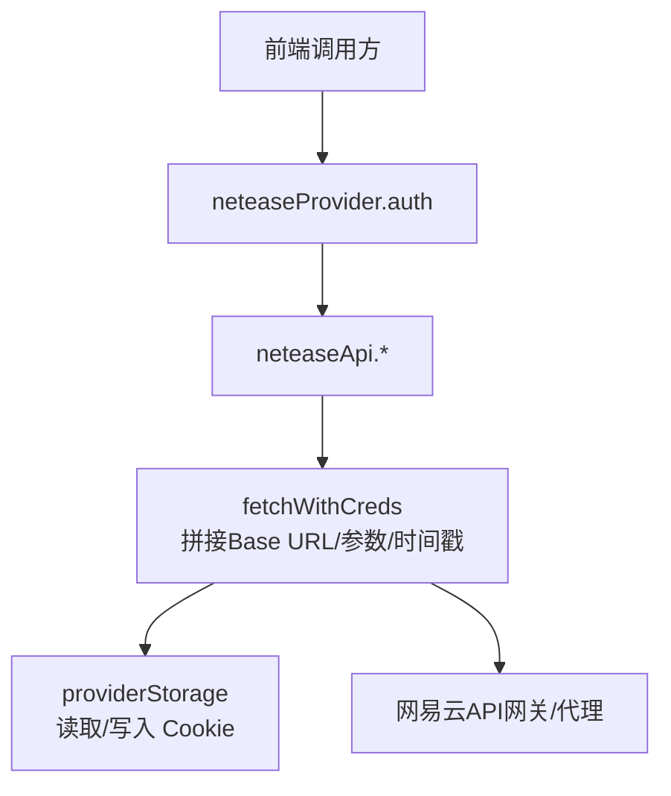
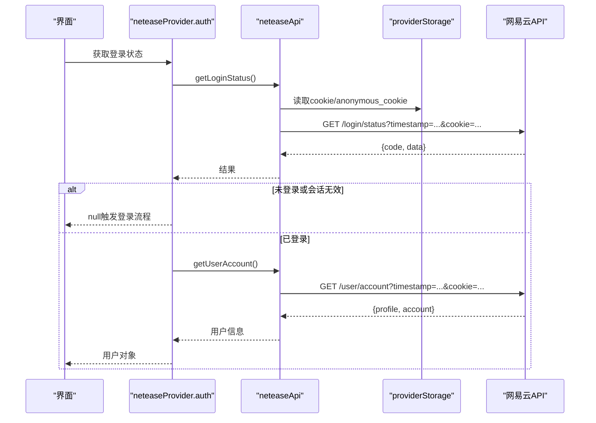
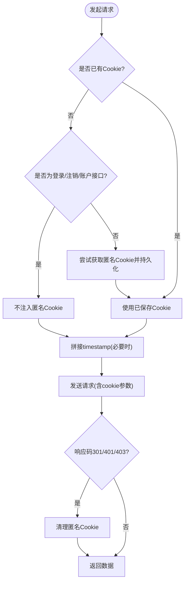
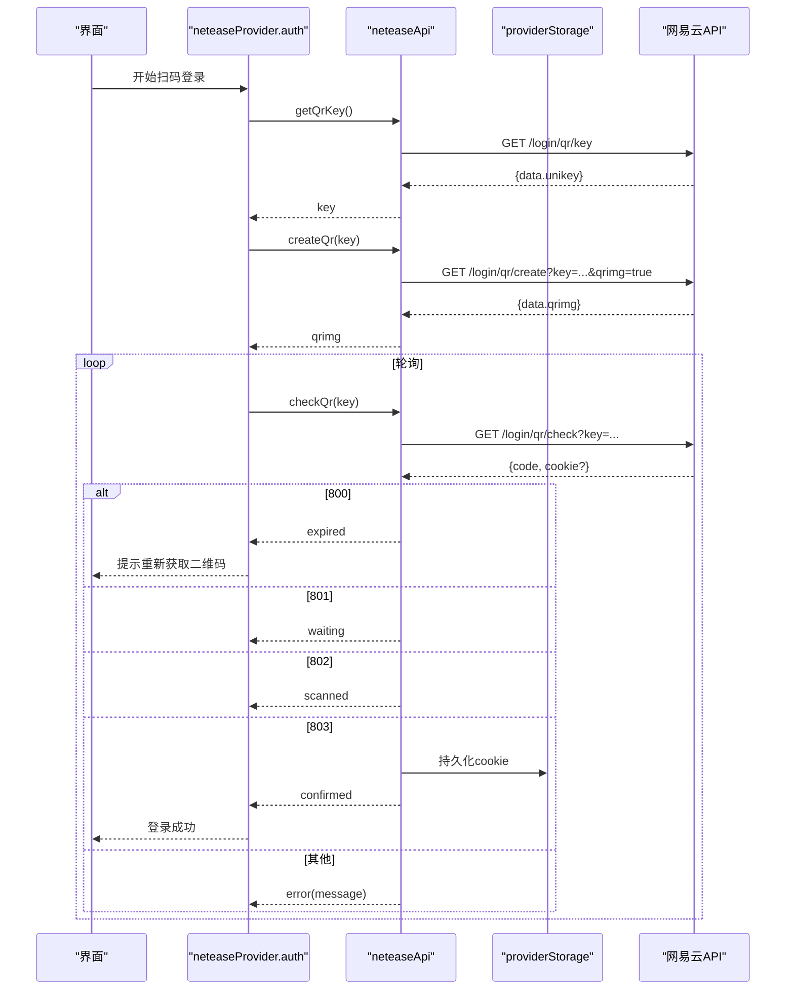
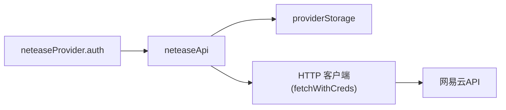

# 认证与授权

<cite>
**本文引用的文件**
- [src/services/netease.ts](file://src/services/netease.ts)
- [src/services/onlineMusic/neteaseProvider.ts](file://src/services/onlineMusic/neteaseProvider.ts)
- [src/services/onlineMusic/providerStorage.ts](file://src/services/onlineMusic/providerStorage.ts)
- [src/services/repositories/sessionRepository.ts](file://src/services/repositories/sessionRepository.ts)
</cite>

## 目录
1. [简介](#简介)
2. [项目结构](#项目结构)
3. [核心组件](#核心组件)
4. [架构总览](#架构总览)
5. [详细组件分析](#详细组件分析)
6. [依赖关系分析](#依赖关系分析)
7. [性能考虑](#性能考虑)
8. [故障排查指南](#故障排查指南)
9. [结论](#结论)

## 简介
本章节聚焦网易云音乐在本项目中的认证与授权机制，覆盖以下主题：
- Cookie 登录流程、二维码扫码登录、Token（Cookie）自动刷新与会话维护
- 登录状态检测、过期检测与自动重连策略
- 认证错误处理策略（网络超时、验证码失效、账号被封禁等）
- 核心认证 API 的实现细节与 HTTP 状态码含义：getLoginStatus、getQrKey、createQr、checkQr

## 项目结构
本项目将网易云音乐的认证能力集中在服务层与提供者层：
- netease.ts：封装底层 HTTP 请求、Cookie/匿名会话注入、时间戳防缓存、URL 规范化等通用逻辑，并暴露认证相关方法。
- neteaseProvider.ts：面向上层业务提供统一的“在线音乐提供者”接口，其中 auth 子模块实现登录状态查询、二维码登录流程、登出等。
- providerStorage.ts：提供按 Provider 命名空间的本地存储读写，用于持久化 Cookie 与匿名 Cookie。
- sessionRepository.ts：应用级会话数据仓库（主要用于播放会话），与在线音乐 Cookie 分离，避免混淆。

图表来源
- [src/services/netease.ts:57-123](file://src/services/netease.ts#L57-L123)
- [src/services/onlineMusic/neteaseProvider.ts:297-339](file://src/services/onlineMusic/neteaseProvider.ts#L297-L339)
- [src/services/onlineMusic/providerStorage.ts:33-64](file://src/services/onlineMusic/providerStorage.ts#L33-L64)

章节来源
- [src/services/netease.ts:12-123](file://src/services/netease.ts#L12-L123)
- [src/services/onlineMusic/neteaseProvider.ts:297-339](file://src/services/onlineMusic/neteaseProvider.ts#L297-L339)
- [src/services/onlineMusic/providerStorage.ts:1-65](file://src/services/onlineMusic/providerStorage.ts#L1-L65)

## 核心组件
- 统一请求封装 fetchWithCreds
  - 动态选择 API Base（Electron 桥或环境变量）
  - 为敏感端点追加 timestamp 防止缓存
  - 自动注入 Cookie：优先使用已保存的 Cookie；否则在需要时获取匿名 Cookie
  - 对特定响应码清理匿名 Cookie，避免污染后续请求
- 认证 API 封装
  - getLoginStatus、getUserAccount、logout
  - getQrKey、createQr、checkQr
- 提供者层认证抽象
  - getLoginStatus：双重校验（登录状态 + 账户信息），失败返回 null 触发重新登录
  - 二维码登录：getQrKey → createQr → checkQr 轮询，根据 code 映射状态
  - 登出：调用 logout

章节来源
- [src/services/netease.ts:504-538](file://src/services/netease.ts#L504-L538)
- [src/services/onlineMusic/neteaseProvider.ts:297-339](file://src/services/onlineMusic/neteaseProvider.ts#L297-L339)

## 架构总览
下图展示从 UI 到网易云 API 的认证链路，包括 Cookie 注入、匿名会话降级、以及二维码扫码登录的状态流转。

图表来源
- [src/services/netease.ts:57-123](file://src/services/netease.ts#L57-L123)
- [src/services/netease.ts:522-538](file://src/services/netease.ts#L522-L538)
- [src/services/onlineMusic/neteaseProvider.ts:297-317](file://src/services/onlineMusic/neteaseProvider.ts#L297-L317)

## 详细组件分析

### Cookie 登录与会话管理
- Cookie 来源与优先级
  - 优先使用已持久化的 Cookie（key: netease_cookie）
  - 若当前请求非登录/注销/账户类接口且无 Cookie，则尝试获取匿名 Cookie（key: netease_anonymous_cookie），并在首次获取后持久化
  - 当收到 301/401/403 且之前未持有 Cookie 时，清理匿名 Cookie，避免误用
- 请求参数与缓存控制
  - 登录、用户、歌单详情等端点强制追加 timestamp，避免浏览器/CDN 缓存导致的数据陈旧
  - 所有请求以 credentials: include 发送，确保跨域场景下 Cookie 可被正确携带（取决于服务端配置）
- 会话持久化
  - Cookie 通过 providerStorage 读写，键名按 Provider 隔离，避免多平台冲突
  - 匿名 Cookie 同样按 Provider 隔离，便于独立失效与迁移

图表来源
- [src/services/netease.ts:57-123](file://src/services/netease.ts#L57-L123)
- [src/services/onlineMusic/providerStorage.ts:33-64](file://src/services/onlineMusic/providerStorage.ts#L33-L64)

章节来源
- [src/services/netease.ts:57-123](file://src/services/netease.ts#L57-L123)
- [src/services/onlineMusic/providerStorage.ts:1-65](file://src/services/onlineMusic/providerStorage.ts#L1-L65)

### 二维码扫码登录流程
- 步骤
  - getQrKey：获取一次性 key
  - createQr：生成二维码图片地址
  - checkQr：轮询检查扫码状态，根据 code 映射状态
- 状态码与处理
  - 800：二维码过期，需重新获取 key 并生成新二维码
  - 801：等待扫码
  - 802：已扫码，待确认
  - 803：已确认，同时返回 cookie，客户端持久化后视为登录成功
  - 其他：错误态，携带 message 提示

图表来源
- [src/services/netease.ts:510-519](file://src/services/netease.ts#L510-L519)
- [src/services/onlineMusic/neteaseProvider.ts:319-339](file://src/services/onlineMusic/neteaseProvider.ts#L319-L339)

章节来源
- [src/services/netease.ts:510-519](file://src/services/netease.ts#L510-L519)
- [src/services/onlineMusic/neteaseProvider.ts:319-339](file://src/services/onlineMusic/neteaseProvider.ts#L319-L339)

### Token（Cookie）自动刷新与会话维护
- 自动刷新策略
  - 每次请求前优先读取已持久化的 Cookie；若无 Cookie 且非登录/注销/账户接口，则尝试获取匿名 Cookie 并持久化
  - 当收到 301/401/403 且此前未持有 Cookie 时，清理匿名 Cookie，避免继续使用失效的匿名会话
- 登录状态维护
  - getLoginStatus 返回 data.profile 存在且 code 不在 [301, 401, 403] 视为已登录
  - 进一步调用 getUserAccount 校验账户一致性，不一致则视为未登录
  - 若登录接口返回 cookie，则持久化，供后续请求使用
- 过期检测与自动重连
  - 任何鉴权相关接口返回 301/401/403 均视为会话失效，上层应引导重新登录
  - 对于非鉴权接口，若因 Cookie 失效导致失败，建议重试一次（可选策略），仍失败则提示重新登录

章节来源
- [src/services/netease.ts:57-123](file://src/services/netease.ts#L57-L123)
- [src/services/netease.ts:522-538](file://src/services/netease.ts#L522-L538)
- [src/services/onlineMusic/neteaseProvider.ts:297-317](file://src/services/onlineMusic/neteaseProvider.ts#L297-L317)

### 核心认证 API 实现细节与状态码
- getLoginStatus
  - 路径：/login/status
  - 行为：返回登录状态与用户资料；若 data.profile 存在且 code 不在 [301, 401, 403]，视为已登录
  - 附加：头像与背景图 URL 会被转换为 https
- getQrKey
  - 路径：/login/qr/key
  - 返回：unikey，用于生成二维码
- createQr
  - 路径：/login/qr/create?key={unikey}&qrimg=true
  - 返回：qrimg 二维码图片地址
- checkQr
  - 路径：/login/qr/check?key={unikey}
  - 状态码与含义：
    - 800：二维码过期，需重新获取 key
    - 801：等待扫码
    - 802：已扫码，待确认
    - 803：已确认，返回 cookie，客户端持久化后完成登录
    - 其他：错误，携带 message

章节来源
- [src/services/netease.ts:510-529](file://src/services/netease.ts#L510-L529)
- [src/services/onlineMusic/neteaseProvider.ts:319-339](file://src/services/onlineMusic/neteaseProvider.ts#L319-L339)

### 认证错误的处理策略
- 网络超时/不可达
  - 建议在调用层捕获异常并重试有限次数；若连续失败，提示网络问题
- 验证码失效/二维码过期
  - checkQr 返回 800：提示用户重新获取二维码
- 账号被封禁/权限不足
  - 鉴权相关接口返回 301/401/403：视为会话失效，引导重新登录
  - 业务侧可根据具体错误码进行差异化提示（如封禁、限制访问等）
- 匿名用户失效
  - 在未持有 Cookie 的情况下收到 301/401/403：清理匿名 Cookie，避免污染后续请求

章节来源
- [src/services/netease.ts:57-123](file://src/services/netease.ts#L57-L123)
- [src/services/onlineMusic/neteaseProvider.ts:297-339](file://src/services/onlineMusic/neteaseProvider.ts#L297-L339)

## 依赖关系分析
- neteaseProvider 依赖 neteaseApi 提供的认证与数据接口
- neteaseApi 依赖 providerStorage 进行 Cookie 的读写
- 所有 HTTP 请求通过 fetchWithCreds 统一处理，保证 Cookie、时间戳、URL 规范一致

图表来源
- [src/services/onlineMusic/neteaseProvider.ts:297-339](file://src/services/onlineMusic/neteaseProvider.ts#L297-L339)
- [src/services/netease.ts:57-123](file://src/services/netease.ts#L57-L123)
- [src/services/onlineMusic/providerStorage.ts:33-64](file://src/services/onlineMusic/providerStorage.ts#L33-L64)

章节来源
- [src/services/onlineMusic/neteaseProvider.ts:297-339](file://src/services/onlineMusic/neteaseProvider.ts#L297-L339)
- [src/services/netease.ts:57-123](file://src/services/netease.ts#L57-L123)
- [src/services/onlineMusic/providerStorage.ts:1-65](file://src/services/onlineMusic/providerStorage.ts#L1-L65)

## 性能考虑
- 减少不必要请求：仅在登录、用户、歌单详情等端点追加 timestamp，避免全局加参带来的带宽与缓存破坏
- 匿名 Cookie 懒加载：仅在非鉴权接口且无 Cookie 时获取，降低首次登录开销
- 重复登录态校验：getLoginStatus 与 getUserAccount 双重校验，提高准确性但增加一次额外请求；可在高频场景考虑短时缓存登录态（注意失效策略）

[本节为通用指导，无需引用具体文件]

## 故障排查指南
- 无法获取登录态
  - 检查是否已持久化 Cookie；若未持久化，确认 getLoginStatus 返回的 code 与 data.profile
  - 若返回 301/401/403，说明会话失效，需重新登录
- 二维码登录失败
  - 800：二维码过期，重新获取 key 并生成新二维码
  - 801/802：等待用户操作，保持轮询
  - 803：登录成功，确认 cookie 已持久化
- 匿名用户失效
  - 在未持有 Cookie 的请求中收到 301/401/403：确认匿名 Cookie 已被清理，避免后续请求继续携带失效值
- 网络问题
  - 捕获异常并重试有限次数；若持续失败，提示网络不可达或代理配置问题

章节来源
- [src/services/netease.ts:57-123](file://src/services/netease.ts#L57-L123)
- [src/services/onlineMusic/neteaseProvider.ts:297-339](file://src/services/onlineMusic/neteaseProvider.ts#L297-L339)

## 结论
本项目通过统一的请求封装与提供者抽象，实现了网易云音乐的 Cookie 登录、二维码扫码登录与会话维护。关键要点包括：
- 严格区分登录态与匿名用户态，及时清理失效的匿名 Cookie
- 对鉴权相关接口进行双重校验，确保登录态准确
- 二维码登录流程清晰，状态码映射明确，支持过期与重试
- 通过 timestamp 与 Cookie 注入，兼顾缓存控制与会话传递
- 提供完善的错误处理策略，覆盖网络、验证码、封禁等常见异常

[本节为总结性内容，无需引用具体文件]