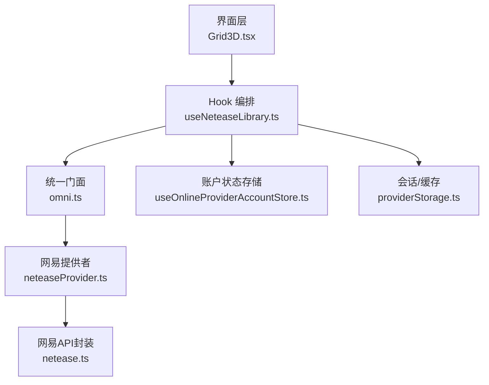
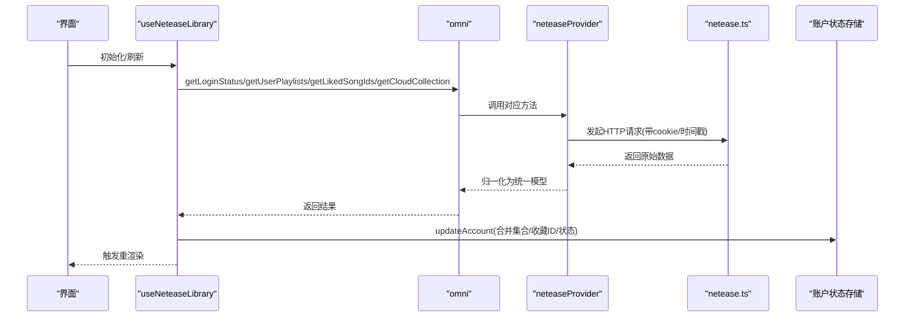
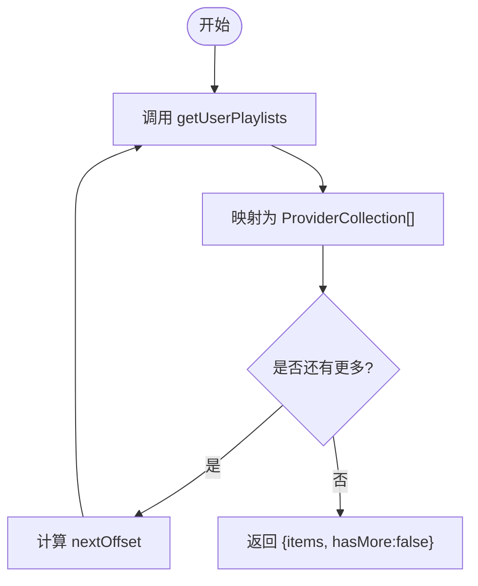
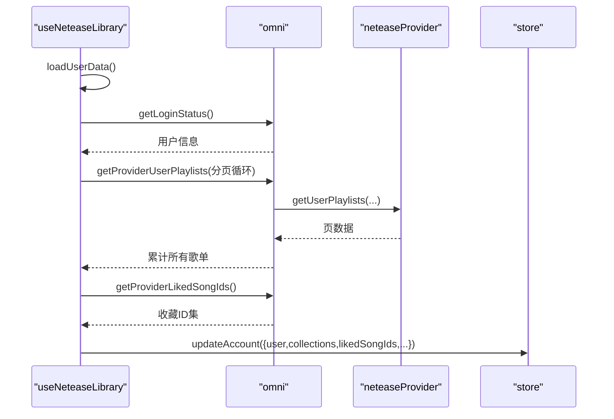
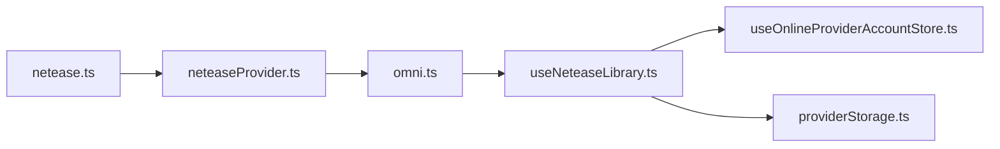

# 音乐库管理

<cite>
**本文引用的文件**
- [src/services/netease.ts](file://src/services/netease.ts)
- [src/services/onlineMusic/neteaseProvider.ts](file://src/services/onlineMusic/neteaseProvider.ts)
- [src/hooks/useNeteaseLibrary.ts](file://src/hooks/useNeteaseLibrary.ts)
- [src/types/onlineMusic.ts](file://src/types/onlineMusic.ts)
- [src/services/onlineMusic/omni.ts](file://src/services/onlineMusic/omni.ts)
- [src/stores/useOnlineProviderAccountStore.ts](file://src/stores/useOnlineProviderAccountStore.ts)
- [src/services/onlineMusic/providerStorage.ts](file://src/services/onlineMusic/providerStorage.ts)
- [src/components/Grid3D.tsx](file://src/components/Grid3D.tsx)
- [src/services/sync/syncCoordinator.ts](file://src/services/sync/syncCoordinator.ts)
</cite>

## 目录
1. [简介](#简介)
2. [项目结构](#项目结构)
3. [核心组件](#核心组件)
4. [架构总览](#架构总览)
5. [详细组件分析](#详细组件分析)
6. [依赖关系分析](#依赖关系分析)
7. [性能考量](#性能考量)
8. [故障排查指南](#故障排查指南)
9. [结论](#结论)
10. [附录：歌单操作API参考](#附录：歌单操作api参考)

## 简介
本文件聚焦于网易云音乐库的管理能力，覆盖个人歌单、收藏歌曲、云盘音乐的获取与操作；解释本地状态与云端数据的同步机制（增量更新、冲突解决、一致性保证）；并给出歌单操作的完整API说明。重点深入实现细节包括 getUserPlaylists、getLikedSongIds、getUserAlbums、getCloudCollection 等核心库管理功能。

## 项目结构
围绕网易云音乐库的模块分层如下：
- 底层网络层：netease.ts 封装网易云 API 调用、鉴权 Cookie、数据归一化、权限合并等。
- 提供者适配层：neteaseProvider.ts 将网易云数据映射为统一的 Provider 模型，暴露 library/catalog/mutations 等能力。
- 统一门面：omni.ts 提供跨提供商的统一接口，供上层 UI 和 Hook 使用。
- 状态与缓存：useOnlineProviderAccountStore.ts 维护账户快照、集合列表、收藏ID集；providerStorage.ts 负责会话与缓存键命名与迁移。
- Hook 编排：useNeteaseLibrary.ts 负责加载、刷新、缓存、清理、登录态处理与用户数据聚合。
- UI 集成：Grid3D.tsx 等界面根据账户状态渲染歌单、云盘、收藏等入口。
- 通用同步：syncCoordinator.ts 提供主题与设置同步（非音乐库），用于理解整体同步模式。

图表来源
- [src/components/Grid3D.tsx:195-218](file://src/components/Grid3D.tsx#L195-L218)
- [src/hooks/useNeteaseLibrary.ts:118-193](file://src/hooks/useNeteaseLibrary.ts#L118-L193)
- [src/services/onlineMusic/omni.ts:212-220](file://src/services/onlineMusic/omni.ts#L212-L220)
- [src/services/onlineMusic/neteaseProvider.ts:342-369](file://src/services/onlineMusic/neteaseProvider.ts#L342-L369)
- [src/services/netease.ts:549-598](file://src/services/netease.ts#L549-L598)
- [src/stores/useOnlineProviderAccountStore.ts:87-126](file://src/stores/useOnlineProviderAccountStore.ts#L87-L126)
- [src/services/onlineMusic/providerStorage.ts:6-64](file://src/services/onlineMusic/providerStorage.ts#L6-L64)

章节来源
- [src/components/Grid3D.tsx:195-218](file://src/components/Grid3D.tsx#L195-L218)
- [src/hooks/useNeteaseLibrary.ts:118-193](file://src/hooks/useNeteaseLibrary.ts#L118-L193)
- [src/services/onlineMusic/neteaseProvider.ts:342-369](file://src/services/onlineMusic/neteaseProvider.ts#L342-L369)
- [src/services/netease.ts:549-598](file://src/services/netease.ts#L549-L598)
- [src/stores/useOnlineProviderAccountStore.ts:87-126](file://src/stores/useOnlineProviderAccountStore.ts#L87-L126)
- [src/services/onlineMusic/providerStorage.ts:6-64](file://src/services/onlineMusic/providerStorage.ts#L6-L64)

## 核心组件
- 网易API封装（netease.ts）
  - 负责鉴权Cookie注入、匿名Cookie回退、时间戳防抖、HTTPS转换、歌曲权限合并、云盘歌曲归一化、版权不可用替代曲推荐等。
  - 关键能力：登录状态、用户信息、歌单列表与详情、专辑、艺术家、歌词、云盘、搜索、每日推荐、FM等。
- 网易提供者（neteaseProvider.ts）
  - 将网易数据映射到统一 Provider 模型，暴露 library（歌单/收藏/专辑/云盘）、catalog（曲目/专辑/艺术家）、recommendations、mutations（点赞/加歌/订阅）等。
- 统一门面（omni.ts）
  - 对外提供 providerId 无关的接口，如 getUserPlaylists、getLikedSongIds、getUserAlbums、getCloudCollection 等。
- Hook（useNeteaseLibrary.ts）
  - 负责加载/刷新用户数据、分页拉取全部歌单、云盘入口、收藏ID集，持久化账户快照，错误与过期处理，缓存清理与手动同步。
- 账户状态存储（useOnlineProviderAccountStore.ts）
  - 维护账户状态、集合列表、收藏ID集，支持增量 reconcile 保持UI稳定引用，云盘集合位置固定。
- 会话与缓存（providerStorage.ts）
  - 提供按提供商隔离的会话键与缓存键，兼容旧键迁移。

章节来源
- [src/services/netease.ts:57-123](file://src/services/netease.ts#L57-L123)
- [src/services/netease.ts:209-304](file://src/services/netease.ts#L209-L304)
- [src/services/netease.ts:549-598](file://src/services/netease.ts#L549-L598)
- [src/services/onlineMusic/neteaseProvider.ts:342-369](file://src/services/onlineMusic/neteaseProvider.ts#L342-L369)
- [src/services/onlineMusic/omni.ts:212-220](file://src/services/onlineMusic/omni.ts#L212-L220)
- [src/hooks/useNeteaseLibrary.ts:41-64](file://src/hooks/useNeteaseLibrary.ts#L41-L64)
- [src/stores/useOnlineProviderAccountStore.ts:41-85](file://src/stores/useOnlineProviderAccountStore.ts#L41-L85)
- [src/services/onlineMusic/providerStorage.ts:6-64](file://src/services/onlineMusic/providerStorage.ts#L6-L64)

## 架构总览
下图展示了从UI到网易云API的数据流与职责边界：

图表来源
- [src/hooks/useNeteaseLibrary.ts:118-193](file://src/hooks/useNeteaseLibrary.ts#L118-L193)
- [src/services/onlineMusic/omni.ts:212-220](file://src/services/onlineMusic/omni.ts#L212-L220)
- [src/services/onlineMusic/neteaseProvider.ts:342-369](file://src/services/onlineMusic/neteaseProvider.ts#L342-L369)
- [src/services/netease.ts:57-123](file://src/services/netease.ts#L57-L123)
- [src/stores/useOnlineProviderAccountStore.ts:96-113](file://src/stores/useOnlineProviderAccountStore.ts#L96-L113)

## 详细组件分析

### 网易API封装（netease.ts）
- 鉴权与会话
  - 自动选择 Electron 桥或环境变量配置后端地址。
  - 对登录、用户、歌单详情等动态数据追加 timestamp 避免缓存。
  - 优先使用已保存 cookie，否则尝试匿名注册获取匿名 cookie，并在 301/401/403 时清理。
- 数据归一化与权限
  - 统一歌曲字段、专辑封面HTTPS化、艺术家数组规范化。
  - 通过 privileges 合并歌曲权限，标记不可用与替代曲推荐。
- 核心库相关接口
  - 用户歌单：getUserPlaylists(uid, limit, offset)
  - 收藏歌曲：getLikedSongs(uid)
  - 收藏专辑：getFavoriteAlbums(limit, offset)
  - 云盘：getUserCloud(limit, offset)、getUserCloudDetail(ids)
  - 歌单详情与曲目：getPlaylistDetail(id)、getPlaylistTracks(id, limit, offset)
  - 专辑与艺术家：getAlbum(id)、getArtistDetail(id)、getArtistAlbums(id, limit, offset)
  - 歌词与FM/推荐：getLyric、getChorus、getPersonalFm、getDailyRecommendedSongs 等

章节来源
- [src/services/netease.ts:23-55](file://src/services/netease.ts#L23-L55)
- [src/services/netease.ts:57-123](file://src/services/netease.ts#L57-L123)
- [src/services/netease.ts:209-304](file://src/services/netease.ts#L209-L304)
- [src/services/netease.ts:549-598](file://src/services/netease.ts#L549-L598)
- [src/services/netease.ts:686-714](file://src/services/netease.ts#L686-L714)

### 网易提供者（neteaseProvider.ts）
- 能力声明
  - capabilities 包含 userLibrary、playlists、albums、userCloud、playlistTrackMutations、likes 等。
- 库管理实现
  - getUserPlaylists：调用 neteaseApi.getUserPlaylists，映射为 ProviderCollection 列表，计算 hasMore/nextOffset。
  - getLikedSongIds：调用 neteaseApi.getLikedSongs，返回 ids 数组。
  - getUserAlbums：调用 neteaseApi.getFavoriteAlbums，映射为专辑集合。
  - getCloudCollection：调用 neteaseApi.getUserCloud(1,0) 判断是否存在云盘，构造虚拟集合（id=-100，specialType=cloud）。
- 目录与变更
  - catalog.getPlaylistTracks/getCloudTracks/getAlbumTracks 等读取曲目。
  - mutations.likeSong/updatePlaylistTracks/subscribePlaylist/subscribeAlbum 执行写操作。

图表来源
- [src/services/onlineMusic/neteaseProvider.ts:342-346](file://src/services/onlineMusic/neteaseProvider.ts#L342-L346)

章节来源
- [src/services/onlineMusic/neteaseProvider.ts:215-239](file://src/services/onlineMusic/neteaseProvider.ts#L215-L239)
- [src/services/onlineMusic/neteaseProvider.ts:342-369](file://src/services/onlineMusic/neteaseProvider.ts#L342-L369)
- [src/services/onlineMusic/neteaseProvider.ts:480-493](file://src/services/onlineMusic/neteaseProvider.ts#L480-L493)

### Hook 编排（useNeteaseLibrary.ts）
- 数据加载流程
  - 启动时优先从账户快照恢复用户、歌单、云盘、收藏ID集，并标记 stale/fresh。
  - 后台异步刷新：重新拉取登录状态、全部歌单（分页循环）、云盘入口、收藏ID集，成功后写入快照并更新 store。
- 增量与一致性
  - 使用 omni 提供的分页接口，累积所有歌单；云盘集合单独处理。
  - 通过 store.reconcileProviderCollections 保持集合对象引用稳定，减少UI抖动。
- 错误与过期
  - 捕获异常并区分“认证过期”与“网络/服务错误”，必要时清理本地状态。
- 缓存与清理
  - 提供清除缓存、查看缓存大小、手动同步等功能。

图表来源
- [src/hooks/useNeteaseLibrary.ts:118-193](file://src/hooks/useNeteaseLibrary.ts#L118-L193)
- [src/services/onlineMusic/omni.ts:212-220](file://src/services/onlineMusic/omni.ts#L212-L220)
- [src/services/onlineMusic/neteaseProvider.ts:342-350](file://src/services/onlineMusic/neteaseProvider.ts#L342-L350)
- [src/stores/useOnlineProviderAccountStore.ts:96-113](file://src/stores/useOnlineProviderAccountStore.ts#L96-L113)

章节来源
- [src/hooks/useNeteaseLibrary.ts:41-64](file://src/hooks/useNeteaseLibrary.ts#L41-L64)
- [src/hooks/useNeteaseLibrary.ts:118-193](file://src/hooks/useNeteaseLibrary.ts#L118-L193)
- [src/hooks/useNeteaseLibrary.ts:195-250](file://src/hooks/useNeteaseLibrary.ts#L195-L250)
- [src/hooks/useNeteaseLibrary.ts:258-309](file://src/hooks/useNeteaseLibrary.ts#L258-L309)

### 账户状态存储（useOnlineProviderAccountStore.ts）
- 数据结构
  - accounts[providerId] = { status, user, collections, likedSongIds, hydration, freshness, lastUpdatedAt, error }
- 增量合并
  - reconcileProviderCollections 基于 providerId:type:id 键比较快照，相等则复用旧引用，避免UI重排。
  - placeCloudCollectionSecond 确保云盘集合始终位于第二位，提升体验一致性。
- 更新与清理
  - updateAccount 支持部分补丁；clearAccount 重置为匿名态。

章节来源
- [src/stores/useOnlineProviderAccountStore.ts:33-85](file://src/stores/useOnlineProviderAccountStore.ts#L33-L85)
- [src/stores/useOnlineProviderAccountStore.ts:87-126](file://src/stores/useOnlineProviderAccountStore.ts#L87-L126)

### 会话与缓存（providerStorage.ts）
- 命名空间
  - 会话键：online_provider:{providerId}:{key}
  - 缓存键：online_provider_{providerId}_{key}
- 迁移兼容
  - getProviderCacheWithLegacyMigration 先读新键，再读旧键并回填新键。
  - readProviderSessionValue/removeProviderSessionValue 同样支持旧键迁移与清理。

章节来源
- [src/services/onlineMusic/providerStorage.ts:6-64](file://src/services/onlineMusic/providerStorage.ts#L6-L64)

### 界面集成（Grid3D.tsx）
- 根据 activeProviderSummary 决定可用能力（播放列表、专辑、推荐等）。
- 网易账号视图下，将 playlists 与 cloudPlaylist 合并为 activeCollections，便于网格展示。

章节来源
- [src/components/Grid3D.tsx:195-218](file://src/components/Grid3D.tsx#L195-L218)

## 依赖关系分析
- 耦合与内聚
  - netease.ts 低耦合地封装HTTP与数据归一化，被 neteaseProvider.ts 复用。
  - neteaseProvider.ts 对内聚了网易特有的映射逻辑，并通过 omni 暴露统一接口。
  - useNeteaseLibrary.ts 作为编排层，协调 omni、store、storage，降低UI直接依赖。
- 外部依赖
  - 网易云API（通过环境变量或Electron桥访问）。
  - 浏览器/Node环境差异（localStorage、window.electron）。
- 潜在循环依赖
  - 当前分层清晰，未见循环导入迹象。

图表来源
- [src/services/netease.ts:549-598](file://src/services/netease.ts#L549-L598)
- [src/services/onlineMusic/neteaseProvider.ts:342-369](file://src/services/onlineMusic/neteaseProvider.ts#L342-L369)
- [src/services/onlineMusic/omni.ts:212-220](file://src/services/onlineMusic/omni.ts#L212-L220)
- [src/hooks/useNeteaseLibrary.ts:118-193](file://src/hooks/useNeteaseLibrary.ts#L118-L193)
- [src/stores/useOnlineProviderAccountStore.ts:96-113](file://src/stores/useOnlineProviderAccountStore.ts#L96-L113)
- [src/services/onlineMusic/providerStorage.ts:6-64](file://src/services/onlineMusic/providerStorage.ts#L6-L64)

章节来源
- [src/services/netease.ts:549-598](file://src/services/netease.ts#L549-L598)
- [src/services/onlineMusic/neteaseProvider.ts:342-369](file://src/services/onlineMusic/neteaseProvider.ts#L342-L369)
- [src/services/onlineMusic/omni.ts:212-220](file://src/services/onlineMusic/omni.ts#L212-L220)
- [src/hooks/useNeteaseLibrary.ts:118-193](file://src/hooks/useNeteaseLibrary.ts#L118-L193)

## 性能考量
- 分页与批量
  - 歌单全量拉取采用分页循环，limit=50，避免单次过大响应。
  - 歌曲权限合并使用 Map 索引，线性扫描后O(1)查找，提升 mergeSongsWithPrivileges 性能。
- 缓存策略
  - 账户快照与集合列表缓存，首次快速渲染，后台静默刷新。
  - 会话Cookie与匿名Cookie持久化，减少重复登录流程。
- 网络优化
  - 对动态数据追加 timestamp 避免缓存命中错误。
  - HTTPS强制转换，减少混合内容问题。
- UI稳定性
  - 集合对象引用重用（reconcileProviderCollections），减少不必要的重渲染。

[本节为通用指导，不直接分析具体文件]

## 故障排查指南
- 无法获取用户数据
  - 检查登录状态与Cookie是否有效；netease.ts 在 301/401/403 时会清理匿名Cookie。
  - 确认 Electron 桥端口或 VITE_NETEASE_API_BASE 配置正确。
- 歌单/收藏为空
  - 检查 getUserPlaylists/getLikedSongIds 返回是否为空；注意分页 hasMore 与 nextOffset。
  - 若为云盘为空，getCloudCollection 会基于 count<=0 返回 null。
- 同步失败
  - useNeteaseLibrary 中 refreshUserData 捕获异常并设置 error/freshness；可触发 handleSyncData 重试。
  - 如需彻底清理，使用 handleClearCache 清除相关缓存键。

章节来源
- [src/services/netease.ts:57-123](file://src/services/netease.ts#L57-L123)
- [src/hooks/useNeteaseLibrary.ts:118-193](file://src/hooks/useNeteaseLibrary.ts#L118-L193)
- [src/hooks/useNeteaseLibrary.ts:258-309](file://src/hooks/useNeteaseLibrary.ts#L258-L309)

## 结论
本项目通过清晰的层次划分实现了网易云音乐库的完整管理能力：底层API封装、提供者适配、统一门面、Hook编排与状态存储各司其职。本地与云端通过快照+后台刷新实现增量更新与一致性保障；集合对象引用重用与云盘位置固定提升了UI稳定性。歌单操作API覆盖创建、编辑、删除与添加/移除歌曲等常见场景，满足日常使用需求。

[本节为总结，不直接分析具体文件]

## 附录：歌单操作API参考
以下API均通过 neteaseProvider.mutations 与 netease.ts 暴露，最终调用网易云接口完成变更。

- 添加歌曲到歌单
  - 调用路径：neteaseProvider.mutations.updatePlaylistTracks('add', playlist, tracks)
  - 底层实现：neteaseApi.updatePlaylistTracks('add', pid, trackIds)
  - 行为：向指定歌单追加歌曲，服务端返回成功即视为完成。
- 移除歌曲从歌单
  - 调用路径：neteaseProvider.mutations.updatePlaylistTracks('del', playlist, tracks)
  - 底层实现：neteaseApi.updatePlaylistTracks('del', pid, trackIds)
  - 行为：从指定歌单移除歌曲。
- 创建歌单
  - 网易云原生未在此处暴露创建接口；如需创建，可在上层扩展调用 /playlist/create 并映射到 mutations.createPlaylist。
- 编辑歌单（名称/描述/封面）
  - 网易云原生未在此处暴露编辑接口；可在上层扩展调用 /playlist/update/detail 并映射到 mutations.updatePlaylistInfo。
- 删除歌单
  - 网易云原生未在此处暴露删除接口；可在上层扩展调用 /playlist/delete 并映射到 mutations.deletePlaylist。

补充：其他库管理API
- 获取个人歌单
  - 调用路径：omni.getProviderUserPlaylists('netease', userId, {limit, offset})
  - 底层实现：neteaseProvider.library.getUserPlaylists -> neteaseApi.getUserPlaylists
- 获取收藏歌曲ID
  - 调用路径：omni.getProviderLikedSongIds('netease', userId)
  - 底层实现：neteaseProvider.library.getLikedSongIds -> neteaseApi.getLikedSongs
- 获取收藏专辑
  - 调用路径：omni.getProviderUserAlbums('netease', userId, {limit, offset})
  - 底层实现：neteaseProvider.library.getUserAlbums -> neteaseApi.getFavoriteAlbums
- 获取云盘集合
  - 调用路径：omni.getProviderCloudCollection('netease', user)
  - 底层实现：neteaseProvider.library.getCloudCollection -> neteaseApi.getUserCloud(1,0)

章节来源
- [src/services/onlineMusic/neteaseProvider.ts:480-493](file://src/services/onlineMusic/neteaseProvider.ts#L480-L493)
- [src/services/netease.ts:579-582](file://src/services/netease.ts#L579-L582)
- [src/services/onlineMusic/neteaseProvider.ts:342-369](file://src/services/onlineMusic/neteaseProvider.ts#L342-L369)
- [src/services/onlineMusic/omni.ts:212-220](file://src/services/onlineMusic/omni.ts#L212-L220)
- [src/services/onlineMusic/omni.ts:341-355](file://src/services/onlineMusic/omni.ts#L341-L355)