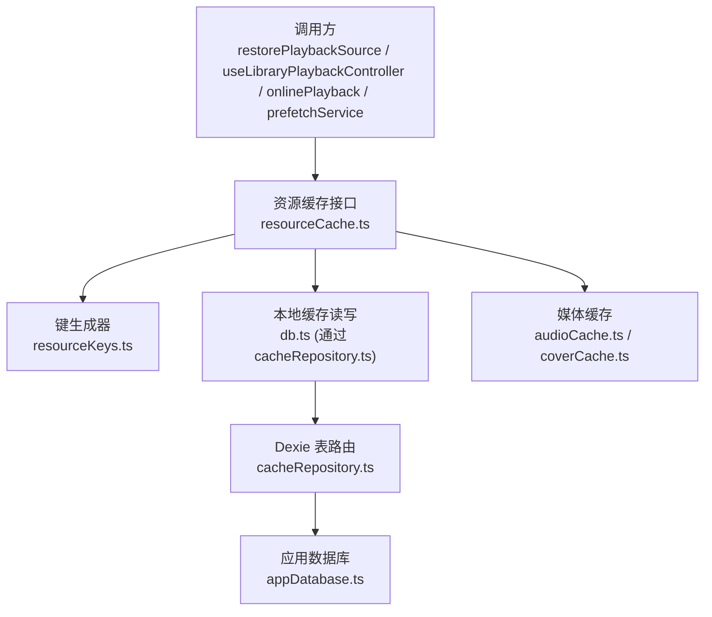
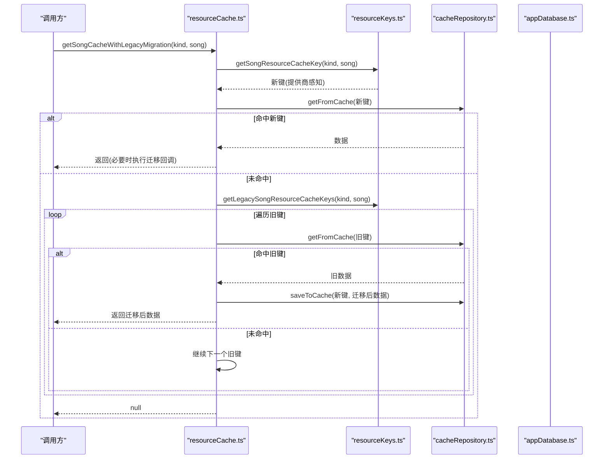
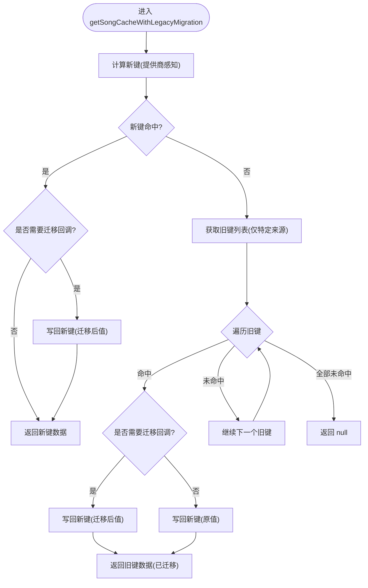
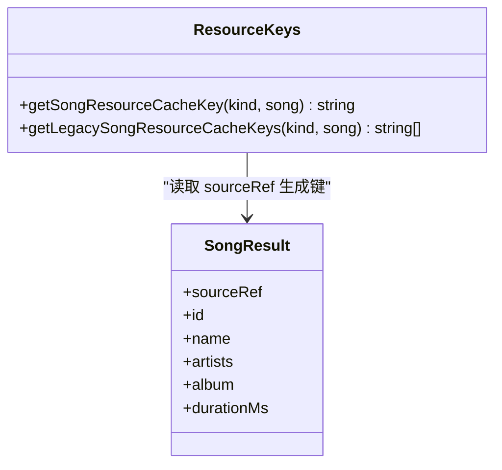
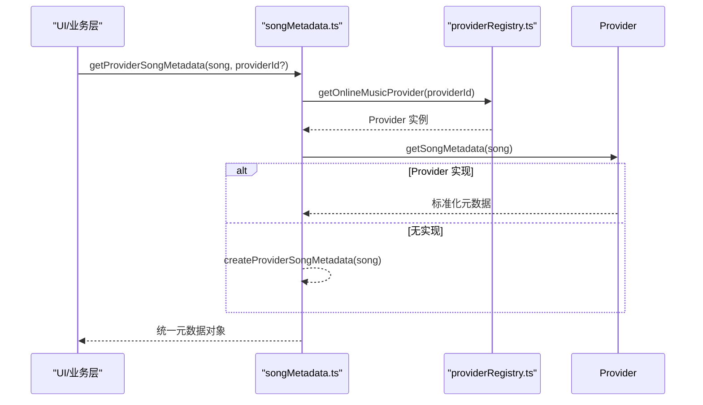
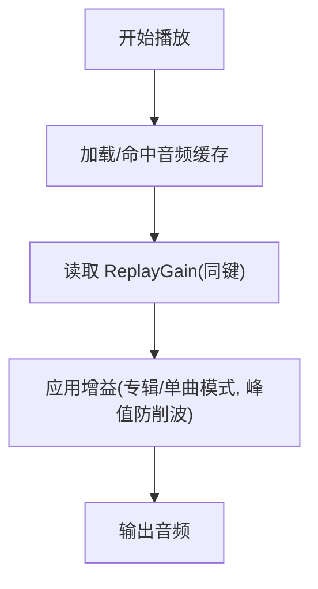
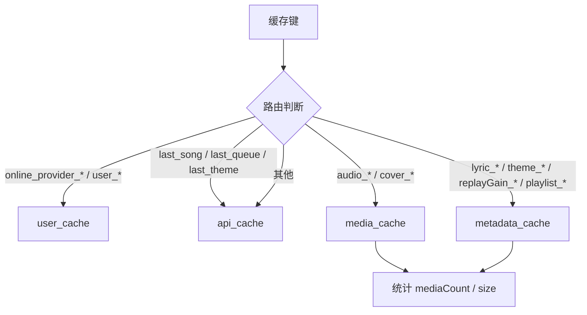
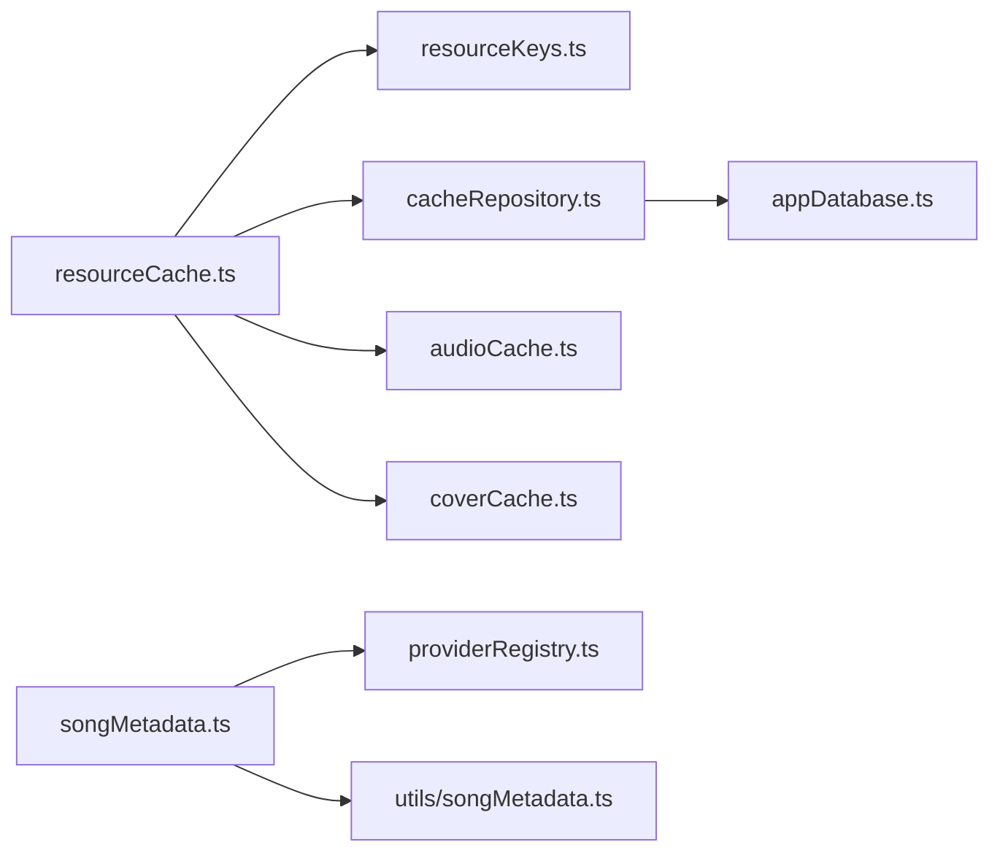

# 元数据缓存

<cite>
**本文引用的文件**
- [resourceCache.ts](file://src/services/onlineMusic/resourceCache.ts)
- [resourceKeys.ts](file://src/services/onlineMusic/resourceKeys.ts)
- [songMetadata.ts](file://src/services/onlineMusic/songMetadata.ts)
- [replayGain.ts](file://src/utils/replayGain.ts)
- [cacheRepository.ts](file://src/services/repositories/cacheRepository.ts)
- [appDatabase.ts](file://src/services/appDatabase.ts)
- [restorePlaybackSource.ts](file://src/components/app/playback/restorePlaybackSource.ts)
- [useLibraryPlaybackController.ts](file://src/hooks/useLibraryPlaybackController.ts)
- [onlinePlayback.ts](file://src/services/onlinePlayback.ts)
- [prefetchService.ts](file://src/services/prefetchService.ts)
- [resourceCacheMigration.test.ts](file://test/unit/onlineMusic/resourceCacheMigration.test.ts)
</cite>

## 目录
1. [简介](#简介)
2. [项目结构](#项目结构)
3. [核心组件](#核心组件)
4. [架构总览](#架构总览)
5. [详细组件分析](#详细组件分析)
6. [依赖关系分析](#依赖关系分析)
7. [性能考量](#性能考量)
8. [故障排查指南](#故障排查指南)
9. [结论](#结论)
10. [附录](#附录)

## 简介
本文件系统性说明歌曲元数据的缓存机制，覆盖标题、艺术家、专辑等基础信息的读取与展示路径，重点阐述资源（音频、歌词、封面、主题、ReplayGain）的缓存策略、键生成规则与版本迁移机制。文档还解释为何 ReplayGain 需要与音频生命周期保持一致，并给出缓存更新策略（定时刷新、变更检测、冲突解决）的实现建议与落地方案。

## 项目结构
围绕“在线音乐资源缓存”的关键代码分布在以下模块：
- 资源缓存入口与迁移：src/services/onlineMusic/resourceCache.ts
- 资源键生成与旧键兼容：src/services/onlineMusic/resourceKeys.ts
- 提供商感知元数据解析：src/services/onlineMusic/songMetadata.ts
- 存储路由与清理统计：src/services/repositories/cacheRepository.ts
- 数据库定义与版本事件：src/services/appDatabase.ts
- 消费方调用点（播放恢复、库播放控制、在线播放、预取服务）：restorePlaybackSource.ts、useLibraryPlaybackController.ts、onlinePlayback.ts、prefetchService.ts
- 单元测试验证迁移行为：test/unit/onlineMusic/resourceCacheMigration.test.ts

**图表来源**
- [resourceCache.ts:13-34](file://src/services/onlineMusic/resourceCache.ts#L13-L34)
- [resourceKeys.ts:8-25](file://src/services/onlineMusic/resourceKeys.ts#L8-L25)
- [cacheRepository.ts:29-79](file://src/services/repositories/cacheRepository.ts#L29-L79)
- [appDatabase.ts:26-108](file://src/services/appDatabase.ts#L26-L108)

**章节来源**
- [resourceCache.ts:1-114](file://src/services/onlineMusic/resourceCache.ts#L1-L114)
- [resourceKeys.ts:1-26](file://src/services/onlineMusic/resourceKeys.ts#L1-L26)
- [cacheRepository.ts:1-190](file://src/services/repositories/cacheRepository.ts#L1-L190)
- [appDatabase.ts:1-113](file://src/services/appDatabase.ts#L1-L113)

## 核心组件
- 资源缓存与迁移：提供按资源类型（音频、歌词、封面、主题、ReplayGain）的统一读取入口，并在首次命中旧键时自动迁移到新键。
- 键生成器：基于歌曲源引用生成“提供商感知”的缓存键；对酷狗封面使用版本化键名以隔离格式变更。
- 元数据解析：在提供商边界将历史字段归一化为统一的结构，供上层稳定消费。
- 存储路由：根据键前缀将条目路由到不同 Dexie 表，支持跨表迁移与清理统计。
- 数据库层：声明表结构与版本升级事件，触发页面重载以完成 schema 切换。

**章节来源**
- [resourceCache.ts:13-94](file://src/services/onlineMusic/resourceCache.ts#L13-L94)
- [resourceKeys.ts:8-25](file://src/services/onlineMusic/resourceKeys.ts#L8-L25)
- [songMetadata.ts:10-51](file://src/services/onlineMusic/songMetadata.ts#L10-L51)
- [cacheRepository.ts:29-79](file://src/services/repositories/cacheRepository.ts#L29-L79)
- [appDatabase.ts:26-108](file://src/services/appDatabase.ts#L26-L108)

## 架构总览
下图展示了从调用方到存储层的完整链路，包括旧键迁移与提供商感知键的使用。

**图表来源**
- [resourceCache.ts:13-34](file://src/services/onlineMusic/resourceCache.ts#L13-L34)
- [resourceKeys.ts:8-25](file://src/services/onlineMusic/resourceKeys.ts#L8-L25)
- [cacheRepository.ts:57-79](file://src/services/repositories/cacheRepository.ts#L57-L79)
- [appDatabase.ts:26-108](file://src/services/appDatabase.ts#L26-L108)

## 详细组件分析

### 资源缓存与迁移（getSongCacheWithLegacyMigration）
- 功能要点
  - 优先读取“提供商感知”的新键；若命中则可选地执行迁移回调（例如歌词渲染提示迁移），如发生变更写回新键。
  - 若新键未命中，则依次尝试旧键集合（仅针对网易云来源），命中后将数据迁移至新键并返回。
  - 对于音频与封面，另有专用函数处理 Blob/URL 的迁移与写入。
- 设计动机
  - 避免全局扫描或启动期迁移，采用“读时迁移”降低冷启动成本。
  - 保证后续访问直接命中新键，提升一致性。

**图表来源**
- [resourceCache.ts:13-34](file://src/services/onlineMusic/resourceCache.ts#L13-L34)
- [resourceKeys.ts:18-25](file://src/services/onlineMusic/resourceKeys.ts#L18-L25)

**章节来源**
- [resourceCache.ts:13-34](file://src/services/onlineMusic/resourceCache.ts#L13-L34)
- [resourceCacheMigration.test.ts:37-71](file://test/unit/onlineMusic/resourceCacheMigration.test.ts#L37-L71)

### 键生成规则与版本管理
- 新键规则
  - 由“资源类型_歌曲键”构成；歌曲键来自统一的播放器键生成逻辑。
  - 对酷狗封面使用“cover_v2”作为版本化键名前缀，以隔离封面格式/尺寸等变更带来的不一致。
- 旧键兼容
  - 仅当来源为网易云时，构造旧键集合（含云端变体与普通 ID）。
  - 读时迁移：首次命中旧键即写回新键，后续访问不再走旧键。

**图表来源**
- [resourceKeys.ts:8-25](file://src/services/onlineMusic/resourceKeys.ts#L8-L25)

**章节来源**
- [resourceKeys.ts:1-26](file://src/services/onlineMusic/resourceKeys.ts#L1-L26)

### 元数据解析与展示
- 提供商边界归一化：在 provider 入口处将历史字段转换为统一结构，暴露稳定的 artists、album、durationMs、coverUrl 等。
- 便捷方法：提供获取艺术家标签、专辑标签、时长、封面 URL、歌曲页 URL 的方法，屏蔽底层差异。

**图表来源**
- [songMetadata.ts:10-51](file://src/services/onlineMusic/songMetadata.ts#L10-L51)
- [utils/songMetadata.ts:12-31](file://src/utils/songMetadata.ts#L12-L31)

**章节来源**
- [songMetadata.ts:10-51](file://src/services/onlineMusic/songMetadata.ts#L10-L51)
- [utils/songMetadata.ts:1-32](file://src/utils/songMetadata.ts#L1-L32)

### ReplayGain 缓存策略与生命周期
- 存储位置：与音频同键空间（replayGain_歌曲键），与音频、歌词、封面并列。
- 原因：ReplayGain 随音频 URL 到达，而媒体缓存会复用音频 URL 避免重复请求。若在缓存命中时缺失 ReplayGain，会导致整张专辑内音量突变（部分曲目 0dB，另一首突然变化），破坏听感。因此必须与音频生命周期一致。
- 读写接口：提供获取与保存 ReplayGain 的封装，确保与资源键一致。

**图表来源**
- [resourceCache.ts:76-94](file://src/services/onlineMusic/resourceCache.ts#L76-L94)
- [replayGain.ts:25-52](file://src/utils/replayGain.ts#L25-L52)

**章节来源**
- [resourceCache.ts:76-94](file://src/services/onlineMusic/resourceCache.ts#L76-L94)
- [replayGain.ts:1-53](file://src/utils/replayGain.ts#L1-L53)

### 存储路由、清理与统计
- 路由规则：根据键前缀将条目路由到 api_cache、user_cache、media_cache、metadata_cache 四张表。
- 读时迁移：当条目已从 api_cache 迁移到其他表时，读取路径会尝试旧表并写回新表，同时删除旧记录。
- 清理能力：支持按类别清理（播放列表、歌词、封面、媒体、分析）、按前缀清理、全量清理；统计包含媒体计数与大小。
- ReplayGain 清理：与音频一起清理，避免残留无效增益。

**图表来源**
- [cacheRepository.ts:29-43](file://src/services/repositories/cacheRepository.ts#L29-L43)
- [cacheRepository.ts:142-157](file://src/services/repositories/cacheRepository.ts#L142-L157)

**章节来源**
- [cacheRepository.ts:29-190](file://src/services/repositories/cacheRepository.ts#L29-L190)

### 调用方集成点
- 播放恢复：恢复歌词缓存并执行迁移。
- 库播放控制：在切换歌曲时读取歌词缓存并迁移。
- 在线播放：在播放流程中读取歌词缓存并迁移。
- 预取服务：预取阶段读取歌词缓存并迁移。

**章节来源**
- [restorePlaybackSource.ts:28-262](file://src/components/app/playback/restorePlaybackSource.ts#L28-L262)
- [useLibraryPlaybackController.ts:35-246](file://src/hooks/useLibraryPlaybackController.ts#L35-L246)
- [onlinePlayback.ts:13-93](file://src/services/onlinePlayback.ts#L13-L93)
- [prefetchService.ts:18-240](file://src/services/prefetchService.ts#L18-L240)

## 依赖关系分析
- resourceCache.ts 依赖 resourceKeys.ts 生成键，并依赖 db.ts（经 cacheRepository.ts）进行持久化，以及 audioCache/coverCache 处理二进制资源。
- cacheRepository.ts 依赖 appDatabase.ts 的多表结构，负责路由、迁移与清理。
- songMetadata.ts 依赖 providerRegistry 与 utils/songMetadata 做元数据归一化。
- 各调用方通过统一的缓存接口获取资源，屏蔽了底层迁移细节。

**图表来源**
- [resourceCache.ts:1-114](file://src/services/onlineMusic/resourceCache.ts#L1-L114)
- [cacheRepository.ts:1-190](file://src/services/repositories/cacheRepository.ts#L1-L190)
- [songMetadata.ts:1-52](file://src/services/onlineMusic/songMetadata.ts#L1-L52)

**章节来源**
- [resourceCache.ts:1-114](file://src/services/onlineMusic/resourceCache.ts#L1-L114)
- [cacheRepository.ts:1-190](file://src/services/repositories/cacheRepository.ts#L1-L190)
- [songMetadata.ts:1-52](file://src/services/onlineMusic/songMetadata.ts#L1-L52)

## 性能考量
- 读时迁移：仅在首次访问旧键时执行迁移，避免启动开销与批量扫描。
- 键命中顺序：先查新键，再查旧键，减少不必要迁移。
- 独立清理：音频与封面分别清理，允许“有音频无封面”的正常状态，按需回填封面而不必重取音频。
- ReplayGain 与音频同生命周期：避免专辑内音量跳变导致的体验问题，也避免重建昂贵的分析结果。

[本节为通用指导，不直接分析具体文件]

## 故障排查指南
- 迁移未生效
  - 检查是否命中旧键路径；确认来源是否为网易云且键前缀匹配。
  - 查看 readCacheEntry 的跨表迁移逻辑是否被触发。
- 封面迁移失败
  - 从旧 URL 拉取 blob 写入新键可能因网络或权限失败，关注控制台警告。
- ReplayGain 缺失
  - 确认是否与音频同键存储；检查是否在清理媒体时误删。
- 数据库版本变更
  - 监听 versionchange 事件，确保页面重载以完成 schema 切换。

**章节来源**
- [cacheRepository.ts:57-79](file://src/services/repositories/cacheRepository.ts#L57-L79)
- [resourceCache.ts:96-113](file://src/services/onlineMusic/resourceCache.ts#L96-L113)
- [appDatabase.ts:100-108](file://src/services/appDatabase.ts#L100-L108)

## 结论
该缓存体系通过“提供商感知键 + 读时迁移”的方式，既保证了向后兼容，又实现了渐进式升级；结合细粒度的存储路由与清理能力，兼顾了性能与可维护性。ReplayGain 与音频同生命周期存储的设计，有效避免了专辑内音量突变的问题。建议在后续迭代中继续保持“读时迁移”的策略，并在必要时引入显式的失效策略（如基于内容哈希或时间戳）以增强一致性。

[本节为总结性内容，不直接分析具体文件]

## 附录

### 缓存更新策略建议（定时刷新、变更检测、冲突解决）
- 定时刷新
  - 对歌词、封面等非强实时资源，可在用户主动刷新或后台空闲时按前缀批量刷新，并保留旧键直到新键成功写入。
- 变更检测
  - 对在线资源，结合提供商提供的版本号或更新时间戳；本地存储时附带 etag/last-modified，命中时进行条件请求。
- 冲突解决
  - 多端或多进程场景下，采用“最后写入胜出”或“基于版本号合并”的策略；对关键元数据（如专辑信息）可引入人工校验入口。
- 失效与清理
  - 依据资源类别与用途，定期清理过期条目；对媒体类资源按容量阈值进行 LRU 淘汰。

[本节为概念性建议，不直接分析具体文件]