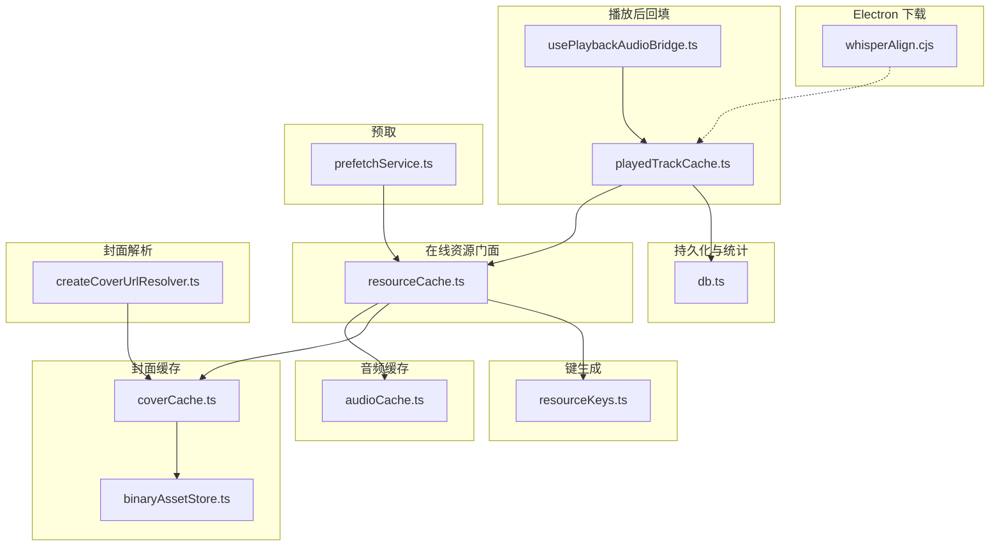
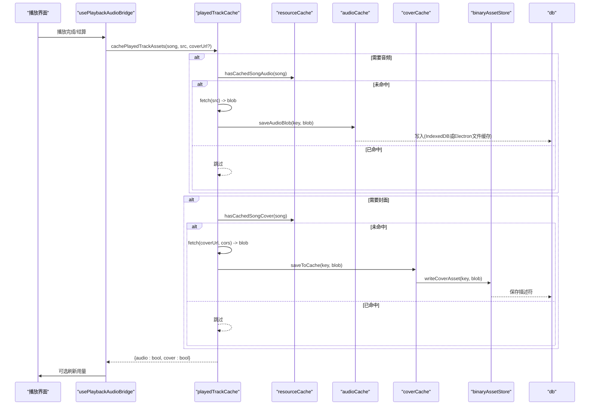
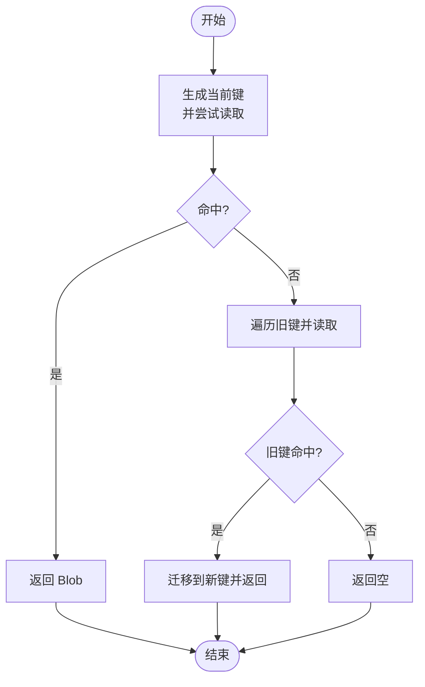
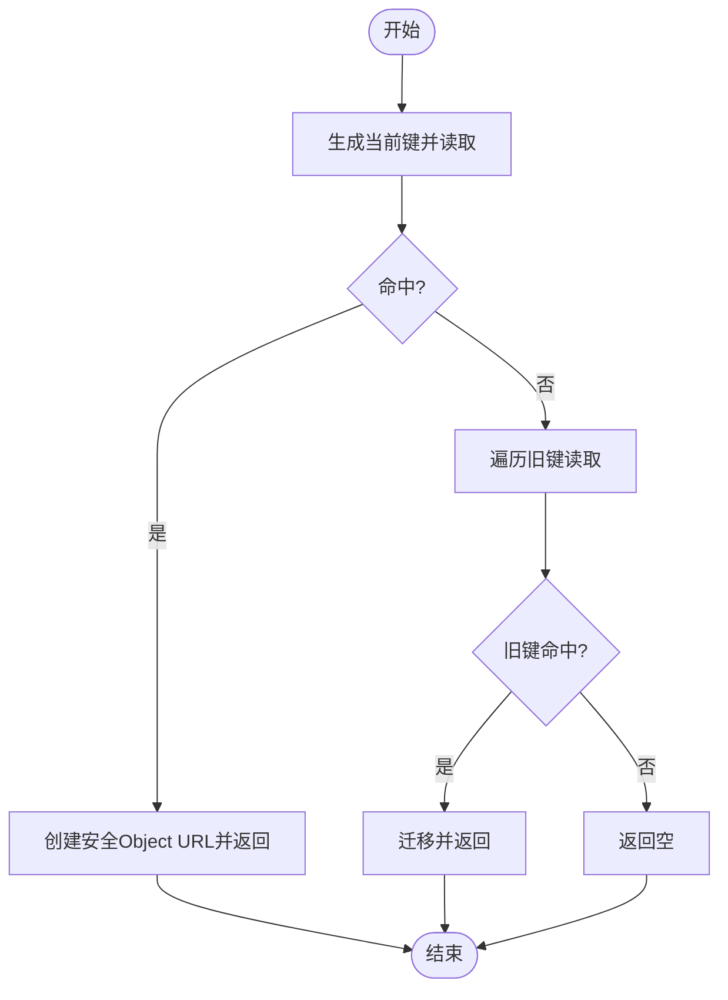
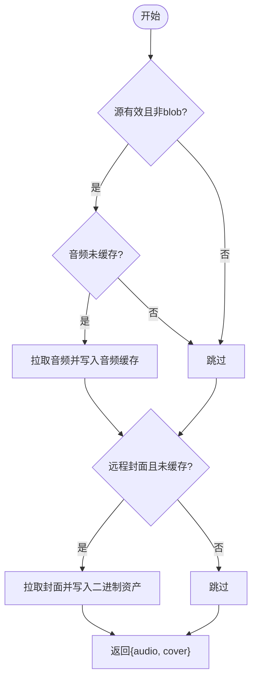
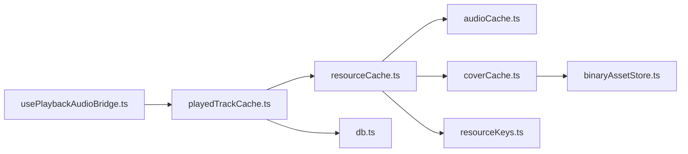

# 媒体资源缓存

<cite>
**本文引用的文件**
- [src/services/onlineMusic/resourceCache.ts](file://src/services/onlineMusic/resourceCache.ts)
- [src/services/audioCache.ts](file://src/services/audioCache.ts)
- [src/services/coverCache.ts](file://src/services/coverCache.ts)
- [src/services/binaryAssetStore.ts](file://src/services/binaryAssetStore.ts)
- [src/services/db.ts](file://src/services/db.ts)
- [src/services/playedTrackCache.ts](file://src/services/playedTrackCache.ts)
- [src/hooks/usePlaybackAudioBridge.ts](file://src/hooks/usePlaybackAudioBridge.ts)
- [src/components/app/playback/createCoverUrlResolver.ts](file://src/components/app/playback/createCoverUrlResolver.ts)
- [src/services/onlineMusic/resourceKeys.ts](file://src/services/onlineMusic/resourceKeys.ts)
- [src/services/prefetchService.ts](file://src/services/prefetchService.ts)
- [electron/whisperAlign.cjs](file://electron/whisperAlign.cjs)
- [test/unit/playback/playedTrackCache.test.ts](file://test/unit/playback/playedTrackCache.test.ts)
</cite>

## 目录
1. [简介](#简介)
2. [项目结构](#项目结构)
3. [核心组件](#核心组件)
4. [架构总览](#架构总览)
5. [详细组件分析](#详细组件分析)
6. [依赖关系分析](#依赖关系分析)
7. [性能考虑](#性能考虑)
8. [故障排查指南](#故障排查指南)
9. [结论](#结论)
10. [附录](#附录)

## 简介
本文件系统性说明媒体资源（音频与封面图片）的缓存策略，重点覆盖：
- 已播放歌曲的音频与封面如何分别写入并独立管理。
- getCachedSongAudioBlob 与 hasCachedSongAudio 的实现机制与回退路径。
- 封面图片的 URL 缓存与 Blob 缓存逻辑，以及 getCachedSongCoverUrl 的处理流程。
- 清理策略：audio 与 cover 两类缓存按类别独立修剪。
- 性能优化建议：分块下载、断点续传、并发控制等可落地的方案。

## 项目结构
围绕媒体资源缓存的关键模块如下：
- 在线资源缓存门面：resourceCache.ts（统一对外提供歌曲级音频/封面/回放增益的读取与迁移）。
- 音频缓存实现：audioCache.ts（Electron 文件缓存优先，回退 IndexedDB；写时通知监听者）。
- 封面缓存实现：coverCache.ts + binaryAssetStore.ts（OPFS/Electron 二进制存储，IndexedDB 仅存描述符）。
- 持久化与统计：db.ts（分类统计、按类清理、IndexedDB 读写封装）。
- 播放后回填：playedTrackCache.ts（完整播放后将音频与封面分别回填到对应缓存）。
- 播放桥接：usePlaybackAudioBridge.ts（触发回填、刷新用量显示）。
- 封面解析：createCoverUrlResolver.ts（优先使用本地缓存封面 URL）。
- 键生成：resourceKeys.ts（按来源与版本生成稳定键）。
- 预取服务：prefetchService.ts（URL 有效性、质量匹配、避免重复拉取）。
- Electron 侧下载工具：whisperAlign.cjs（流式下载、进度回调、超时处理）。

图表来源
- [src/services/onlineMusic/resourceCache.ts:1-114](file://src/services/onlineMusic/resourceCache.ts#L1-L114)
- [src/services/audioCache.ts:1-121](file://src/services/audioCache.ts#L1-L121)
- [src/services/coverCache.ts:1-129](file://src/services/coverCache.ts#L1-L129)
- [src/services/binaryAssetStore.ts:1-174](file://src/services/binaryAssetStore.ts#L1-L174)
- [src/services/db.ts:1-200](file://src/services/db.ts#L1-L200)
- [src/services/playedTrackCache.ts:1-75](file://src/services/playedTrackCache.ts#L1-L75)
- [src/hooks/usePlaybackAudioBridge.ts:168-235](file://src/hooks/usePlaybackAudioBridge.ts#L168-L235)
- [src/components/app/playback/createCoverUrlResolver.ts:1-17](file://src/components/app/playback/createCoverUrlResolver.ts#L1-L17)
- [src/services/onlineMusic/resourceKeys.ts:1-26](file://src/services/onlineMusic/resourceKeys.ts#L1-L26)
- [src/services/prefetchService.ts:119-184](file://src/services/prefetchService.ts#L119-L184)
- [electron/whisperAlign.cjs:1150-1193](file://electron/whisperAlign.cjs#L1150-L1193)

章节来源
- [src/services/onlineMusic/resourceCache.ts:1-114](file://src/services/onlineMusic/resourceCache.ts#L1-L114)
- [src/services/audioCache.ts:1-121](file://src/services/audioCache.ts#L1-L121)
- [src/services/coverCache.ts:1-129](file://src/services/coverCache.ts#L1-L129)
- [src/services/binaryAssetStore.ts:1-174](file://src/services/binaryAssetStore.ts#L1-L174)
- [src/services/db.ts:1-200](file://src/services/db.ts#L1-L200)
- [src/services/playedTrackCache.ts:1-75](file://src/services/playedTrackCache.ts#L1-L75)
- [src/hooks/usePlaybackAudioBridge.ts:168-235](file://src/hooks/usePlaybackAudioBridge.ts#L168-L235)
- [src/components/app/playback/createCoverUrlResolver.ts:1-17](file://src/components/app/playback/createCoverUrlResolver.ts#L1-L17)
- [src/services/onlineMusic/resourceKeys.ts:1-26](file://src/services/onlineMusic/resourceKeys.ts#L1-L26)
- [src/services/prefetchService.ts:119-184](file://src/services/prefetchService.ts#L119-L184)
- [electron/whisperAlign.cjs:1150-1193](file://electron/whisperAlign.cjs#L1150-L1193)

## 核心组件
- 在线资源门面（resourceCache.ts）
  - 提供 getCachedSongAudioBlob、hasCachedSongAudio、hasCachedSongCover、getCachedSongCoverUrl 等统一入口。
  - 自动兼容旧版网易键，先读新键，再遍历旧键并迁移。
- 音频缓存（audioCache.ts）
  - Electron 环境优先：通过 IPC 存取文件缓存；非 Electron 回退到 IndexedDB。
  - 写操作 saveAudioBlob 会广播 onAudioCached 事件，供其他模块感知“媒体已就绪”。
  - 支持按设置限制大小进行修剪（mediaCacheLimitGb）。
- 封面缓存（coverCache.ts + binaryAssetStore.ts）
  - 封面以二进制资产形式存储于 OPFS 或 Electron 文件缓存，IndexedDB 仅保存描述符（后端类型、大小、更新时间）。
  - getCachedCoverUrl 会尝试从二进制资产读取，不存在则创建安全 Object URL；hasCachedCover 只检查是否存在而不产生 URL。
  - 提供 clearCoverAssets、getCoverAssetUsage 等能力。
- 播放后回填（playedTrackCache.ts）
  - 对完整播放的歌曲，分别判断音频与封面是否缺失，按需拉取并写入各自缓存。
  - 严格区分 audio 与 cover 两类缓存，避免互相阻塞。
- 播放桥接（usePlaybackAudioBridge.ts）
  - 在播放完成或自动混音结算时调用 cachePlayedTrackAssets，并在面板可见时刷新用量。
- 封面解析（createCoverUrlResolver.ts）
  - 优先返回本地缓存的封面 URL，否则回退到远程元数据中的安全 URL。
- 键生成（resourceKeys.ts）
  - 基于来源与版本生成稳定的缓存键，如 kugou 封面使用 cover_v2。
- 预取服务（prefetchService.ts）
  - 校验 URL 有效期与音质匹配，避免对已缓存歌曲重复拉取。
- Electron 下载（whisperAlign.cjs）
  - 流式下载、进度回调、超时处理，为后续分块/续传提供基础。

章节来源
- [src/services/onlineMusic/resourceCache.ts:1-114](file://src/services/onlineMusic/resourceCache.ts#L1-L114)
- [src/services/audioCache.ts:1-121](file://src/services/audioCache.ts#L1-L121)
- [src/services/coverCache.ts:1-129](file://src/services/coverCache.ts#L1-L129)
- [src/services/binaryAssetStore.ts:1-174](file://src/services/binaryAssetStore.ts#L1-L174)
- [src/services/playedTrackCache.ts:1-75](file://src/services/playedTrackCache.ts#L1-L75)
- [src/hooks/usePlaybackAudioBridge.ts:168-235](file://src/hooks/usePlaybackAudioBridge.ts#L168-L235)
- [src/components/app/playback/createCoverUrlResolver.ts:1-17](file://src/components/app/playback/createCoverUrlResolver.ts#L1-L17)
- [src/services/onlineMusic/resourceKeys.ts:1-26](file://src/services/onlineMusic/resourceKeys.ts#L1-L26)
- [src/services/prefetchService.ts:119-184](file://src/services/prefetchService.ts#L119-L184)
- [electron/whisperAlign.cjs:1150-1193](file://electron/whisperAlign.cjs#L1150-L1193)

## 架构总览
下图展示一次“完整播放后回填”的端到端流程，包括音频与封面两条独立路径。

图表来源
- [src/hooks/usePlaybackAudioBridge.ts:168-235](file://src/hooks/usePlaybackAudioBridge.ts#L168-L235)
- [src/services/playedTrackCache.ts:1-75](file://src/services/playedTrackCache.ts#L1-L75)
- [src/services/onlineMusic/resourceCache.ts:1-114](file://src/services/onlineMusic/resourceCache.ts#L1-L114)
- [src/services/audioCache.ts:1-121](file://src/services/audioCache.ts#L1-L121)
- [src/services/coverCache.ts:1-129](file://src/services/coverCache.ts#L1-L129)
- [src/services/binaryAssetStore.ts:1-174](file://src/services/binaryAssetStore.ts#L1-L174)
- [src/services/db.ts:1-200](file://src/services/db.ts#L1-L200)

## 详细组件分析

### 音频缓存：getCachedSongAudioBlob 与 hasCachedSongAudio
- 目标
  - 提供歌曲级音频的读取与存在性检查，兼容旧键，优先 Electron 文件缓存，回退 IndexedDB。
- 关键流程
  - resourceCache.getCachedSongAudioBlob：生成当前键，尝试读取；若为空，遍历旧键并迁移到新键。
  - audioCache.hasCachedAudio：Electron 环境先查 IPC，再查 IndexedDB；无效条目清理。
  - audioCache.saveAudioBlob：Electron 环境写入文件缓存并携带上限；非 Electron 写入 IndexedDB；写后广播 onAudioCached。
- 复杂度
  - 读取：O(1) 次 IPC/IndexedDB 访问（含旧键遍历常数项）。
  - 写入：O(n) 字节拷贝（Blob→ArrayBuffer），受限于存储后端 I/O。
- 错误处理
  - 迁移失败静默忽略；IPC 不可用时回退 IndexedDB；无效条目自动清理。
- 性能影响
  - Electron 文件缓存减少内存占用；IndexedDB 作为兜底保证跨平台可用。

图表来源
- [src/services/onlineMusic/resourceCache.ts:36-58](file://src/services/onlineMusic/resourceCache.ts#L36-L58)
- [src/services/audioCache.ts:39-81](file://src/services/audioCache.ts#L39-L81)

章节来源
- [src/services/onlineMusic/resourceCache.ts:36-58](file://src/services/onlineMusic/resourceCache.ts#L36-L58)
- [src/services/audioCache.ts:39-81](file://src/services/audioCache.ts#L39-L81)

### 封面缓存：getCachedSongCoverUrl 与 hasCachedSongCover
- 目标
  - 提供封面 URL 的读取与存在性检查，优先二进制资产（OPFS/Electron），IndexedDB 仅存描述符。
- 关键流程
  - resourceCache.getCachedSongCoverUrl：生成当前键，读取；若为空，遍历旧键并迁移。
  - coverCache.getCachedCoverUrl：读取二进制资产，不存在则创建安全 Object URL；无效条目清理。
  - coverCache.hasCachedCover：仅检查是否存在，不产生 URL。
- 复杂度
  - 读取：O(1) 次文件/IndexedDB 访问；Object URL 创建 O(1)。
  - 写入：writeCoverAsset 将 Blob 写入文件系统，IndexedDB 仅写描述符。
- 错误处理
  - 二进制资产校验失败删除；Electron 桥不可用回退 OPFS；fetch 失败记录警告并回退原始 URL。
- 性能影响
  - 二进制资产避免 IndexedDB 大对象开销；Object URL 生命周期由调用方管理。

图表来源
- [src/services/onlineMusic/resourceCache.ts:96-113](file://src/services/onlineMusic/resourceCache.ts#L96-L113)
- [src/services/coverCache.ts:44-80](file://src/services/coverCache.ts#L44-L80)
- [src/services/binaryAssetStore.ts:82-140](file://src/services/binaryAssetStore.ts#L82-L140)

章节来源
- [src/services/onlineMusic/resourceCache.ts:96-113](file://src/services/onlineMusic/resourceCache.ts#L96-L113)
- [src/services/coverCache.ts:44-80](file://src/services/coverCache.ts#L44-L80)
- [src/services/binaryAssetStore.ts:82-140](file://src/services/binaryAssetStore.ts#L82-L140)

### 播放后回填：cachePlayedTrackAssets
- 目标
  - 对完整播放的歌曲，分别回填音频与封面，互不阻塞。
- 关键逻辑
  - 音频：若源不是 blob: 且未命中缓存，则拉取并写入音频缓存。
  - 封面：若非本地歌曲且为 https 远程封面且未命中缓存，则拉取并写入封面二进制资产。
  - 返回写入结果，便于上层决定是否刷新用量。
- 边界情况
  - blob: 源表示本次会话已有字节，无需重拉音频，但仍可能回填封面。
  - 本地歌曲的封面已由库路径写入，此处不重复。
- 测试覆盖
  - 双缓存均缺失、仅缺封面、仅缺音频、下载失败等场景均有单测验证。

图表来源
- [src/services/playedTrackCache.ts:30-75](file://src/services/playedTrackCache.ts#L30-L75)
- [test/unit/playback/playedTrackCache.test.ts:51-119](file://test/unit/playback/playedTrackCache.test.ts#L51-L119)

章节来源
- [src/services/playedTrackCache.ts:30-75](file://src/services/playedTrackCache.ts#L30-L75)
- [test/unit/playback/playedTrackCache.test.ts:51-119](file://test/unit/playback/playedTrackCache.test.ts#L51-L119)

### 封面解析：createCoverUrlResolver
- 目标
  - 优先返回本地缓存的封面 URL，否则回退到远程元数据的安全 URL。
- 行为
  - 若传入 cachedCoverUrl 存在则直接返回；否则从歌曲元数据获取并转为安全 URL。
- 使用场景
  - 播放界面渲染封面时，确保优先使用本地缓存以提升加载速度。

章节来源
- [src/components/app/playback/createCoverUrlResolver.ts:1-17](file://src/components/app/playback/createCoverUrlResolver.ts#L1-L17)

### 键生成：resourceKeys
- 目标
  - 根据来源与版本生成稳定的缓存键，避免不同来源或版本冲突。
- 规则
  - 对 kugou 的封面使用 cover_v2 变体；其他来源使用标准键名。
  - 兼容旧版网易键用于迁移。

章节来源
- [src/services/onlineMusic/resourceKeys.ts:1-26](file://src/services/onlineMusic/resourceKeys.ts#L1-L26)

## 依赖关系分析
- 耦合度
  - resourceCache 作为门面，低耦合地组合 audioCache 与 coverCache。
  - playedTrackCache 依赖 resourceCache 的存在性检查与 db 写入，解耦具体存储实现。
  - coverCache 依赖 binaryAssetStore 进行二进制资产落地，db 仅存描述符。
- 外部依赖
  - Electron IPC：音频与封面文件缓存、统计、清理。
  - OPFS：浏览器端二进制资产存储。
  - IndexedDB：通用缓存与描述符存储。
- 循环依赖
  - 未发现循环导入；各层职责清晰。

图表来源
- [src/services/playedTrackCache.ts:1-75](file://src/services/playedTrackCache.ts#L1-L75)
- [src/services/onlineMusic/resourceCache.ts:1-114](file://src/services/onlineMusic/resourceCache.ts#L1-L114)
- [src/services/audioCache.ts:1-121](file://src/services/audioCache.ts#L1-L121)
- [src/services/coverCache.ts:1-129](file://src/services/coverCache.ts#L1-L129)
- [src/services/binaryAssetStore.ts:1-174](file://src/services/binaryAssetStore.ts#L1-L174)
- [src/services/db.ts:1-200](file://src/services/db.ts#L1-L200)
- [src/hooks/usePlaybackAudioBridge.ts:168-235](file://src/hooks/usePlaybackAudioBridge.ts#L168-L235)

## 性能考虑
- 现有优化
  - 音频缓存优先 Electron 文件缓存，降低内存占用；IndexedDB 回退保障兼容性。
  - 封面采用二进制资产存储，IndexedDB 仅存描述符，减少大对象开销。
  - 播放后回填分离 audio 与 cover，避免相互阻塞。
  - 预取服务校验 URL 有效期与音质，避免重复拉取。
- 建议优化
  - 分块下载：对大体积音频/封面使用 Range 请求，结合 electron/whisperAlign.cjs 的流式下载能力，提升弱网稳定性。
  - 断点续传：记录已下载字节与 ETag/Last-Modified，网络中断后继续下载，减少重复流量。
  - 并发控制：限制同时进行的下载任务数，避免带宽争用导致播放卡顿。
  - 缓存预热：在队列切换前对下一首进行预取，利用空闲带宽提前填充缓存。
  - 自适应质量：根据网络状况动态选择音质，平衡流畅度与清晰度。
  - 对象 URL 管理：及时释放不再使用的 Object URL，防止内存泄漏。

[本节为通用指导，不直接分析具体文件]

## 故障排查指南
- 常见问题
  - 封面无法加载：检查二进制资产是否损坏，必要时调用 clearCoverAssets 清理并重新拉取。
  - 音频无法播放：确认 Electron 音频缓存是否可用，或回退到 IndexedDB；检查 onAudioCached 事件是否触发。
  - 用量不更新：确认 usePlaybackAudioBridge 中缓存写入后是否刷新用量显示。
- 定位方法
  - 查看 console 日志中的缓存相关提示（如“[Cache] ...”）。
  - 使用 getCacheUsageByCategory 获取分类用量，定位问题类别。
  - 通过 test/unit/playback/playedTrackCache.test.ts 中的用例思路复现边界场景。

章节来源
- [src/services/db.ts:150-184](file://src/services/db.ts#L150-L184)
- [src/services/coverCache.ts:95-99](file://src/services/coverCache.ts#L95-L99)
- [src/services/audioCache.ts:100-121](file://src/services/audioCache.ts#L100-L121)
- [src/hooks/usePlaybackAudioBridge.ts:168-235](file://src/hooks/usePlaybackAudioBridge.ts#L168-L235)
- [test/unit/playback/playedTrackCache.test.ts:106-119](file://test/unit/playback/playedTrackCache.test.ts#L106-L119)

## 结论
本项目媒体资源缓存采用分层设计：在线资源门面统一对外，音频与封面分别实现，底层存储兼顾 Electron 与浏览器环境。播放后回填严格分离两类缓存，确保彼此独立修剪与恢复。通过二进制资产、IndexedDB 描述符、预取校验与用量统计，系统在可用性、性能与可维护性之间取得良好平衡。未来可在分块下载、断点续传、并发控制等方面进一步增强鲁棒性与效率。

[本节为总结，不直接分析具体文件]

## 附录
- 关键函数速查
  - getCachedSongAudioBlob：读取歌曲音频，兼容旧键，优先 Electron 缓存。
  - hasCachedSongAudio：检查音频是否存在，兼容旧键。
  - hasCachedSongCover：检查封面是否存在，兼容旧键。
  - getCachedSongCoverUrl：读取封面 URL，兼容旧键，优先二进制资产。
  - cachePlayedTrackAssets：播放后回填音频与封面，互不阻塞。
  - saveAudioBlob：写入音频缓存，支持上限修剪与事件通知。
  - writeCoverAsset：写入封面二进制资产，支持 OPFS/Electron。
  - clearCacheByCategory：按类别清理缓存（media/cover 等）。

章节来源
- [src/services/onlineMusic/resourceCache.ts:36-113](file://src/services/onlineMusic/resourceCache.ts#L36-L113)
- [src/services/audioCache.ts:39-121](file://src/services/audioCache.ts#L39-L121)
- [src/services/coverCache.ts:44-129](file://src/services/coverCache.ts#L44-L129)
- [src/services/binaryAssetStore.ts:82-174](file://src/services/binaryAssetStore.ts#L82-L174)
- [src/services/playedTrackCache.ts:30-75](file://src/services/playedTrackCache.ts#L30-L75)
- [src/services/db.ts:150-184](file://src/services/db.ts#L150-L184)