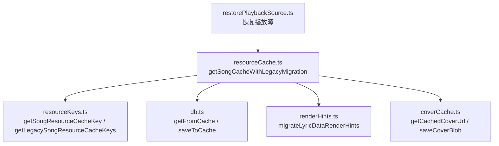
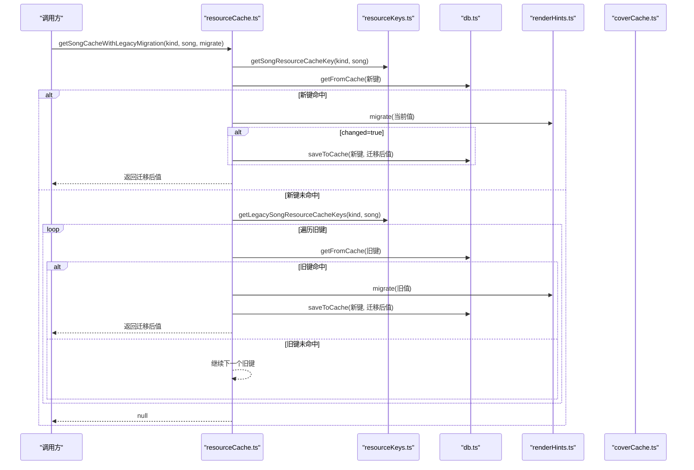
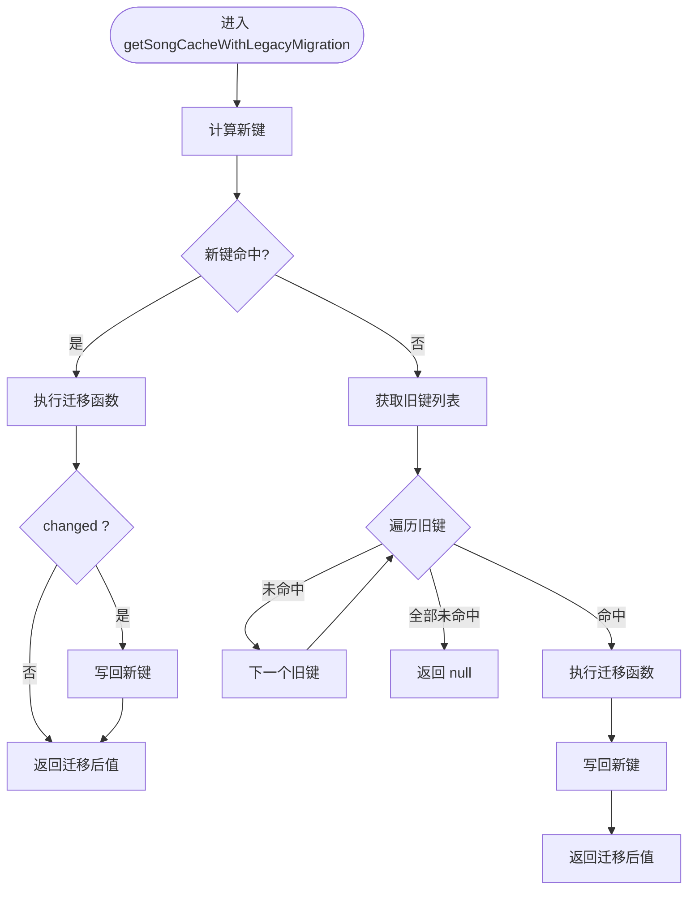
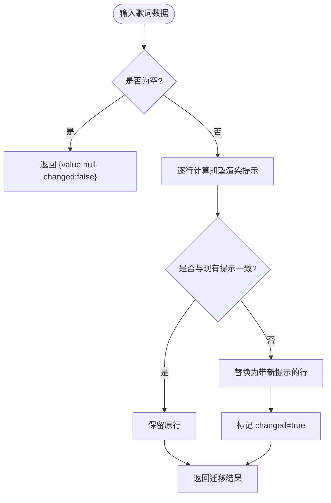
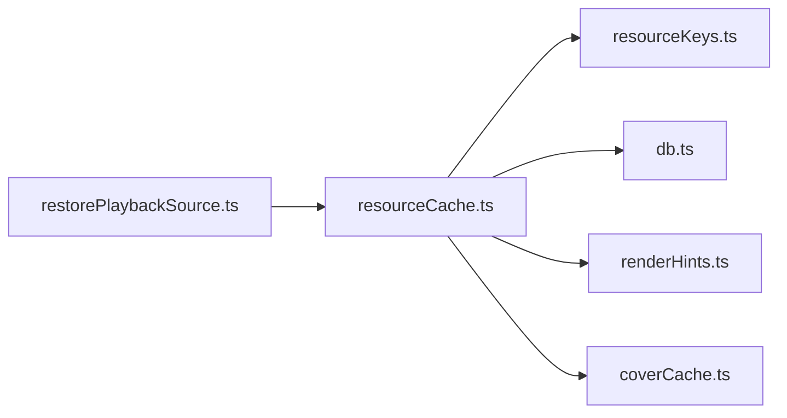

# 缓存迁移机制

<cite>
**本文引用的文件**
- [resourceCache.ts](file://src/services/onlineMusic/resourceCache.ts)
- [renderHints.ts](file://src/utils/lyrics/renderHints.ts)
- [storageMigration.ts](file://src/utils/lyrics/storageMigration.ts)
- [resourceKeys.ts](file://src/services/onlineMusic/resourceKeys.ts)
- [db.ts](file://src/services/db.ts)
- [coverCache.ts](file://src/services/coverCache.ts)
- [restorePlaybackSource.ts](file://src/components/app/playback/restorePlaybackSource.ts)
</cite>

## 目录
1. [简介](#简介)
2. [项目结构](#项目结构)
3. [核心组件](#核心组件)
4. [架构总览](#架构总览)
5. [详细组件分析](#详细组件分析)
6. [依赖关系分析](#依赖关系分析)
7. [性能考量](#性能考量)
8. [故障排查指南](#故障排查指南)
9. [结论](#结论)
10. [附录](#附录)

## 简介
本文件系统性说明本项目中“缓存迁移机制”的设计与实现，重点围绕 getSongCacheWithLegacyMigration 函数的工作原理、MigrationResult 接口的设计目的、从旧版网易云音乐缓存格式到新版的提供商感知键格式的迁移流程、数据完整性与一致性保障、错误处理与回滚策略，以及迁移监控与日志记录的最佳实践。目标是让非专业读者也能理解并安全地维护该机制。

## 项目结构
与缓存迁移相关的代码主要分布在以下模块：
- 在线资源缓存与迁移入口：src/services/onlineMusic/resourceCache.ts
- 歌词渲染提示迁移工具：src/utils/lyrics/renderHints.ts
- 本地歌曲匹配歌词载体迁移：src/utils/lyrics/storageMigration.ts
- 缓存键生成与旧键兼容：src/services/onlineMusic/resourceKeys.ts
- 通用缓存读写与带迁移读取封装：src/services/db.ts
- 封面缓存与写入（含迁移落盘）：src/services/coverCache.ts
- 播放恢复时调用迁移读取歌词：src/components/app/playback/restorePlaybackSource.ts

图示来源
- [resourceCache.ts:13-34](file://src/services/onlineMusic/resourceCache.ts#L13-L34)
- [resourceKeys.ts:8-25](file://src/services/onlineMusic/resourceKeys.ts#L8-L25)
- [db.ts:77-115](file://src/services/db.ts#L77-L115)
- [renderHints.ts:216-239](file://src/utils/lyrics/renderHints.ts#L216-L239)
- [coverCache.ts:96-108](file://src/services/coverCache.ts#L96-L108)
- [restorePlaybackSource.ts:260-276](file://src/components/app/playback/restorePlaybackSource.ts#L260-L276)

章节来源
- [resourceCache.ts:1-114](file://src/services/onlineMusic/resourceCache.ts#L1-L114)
- [resourceKeys.ts:1-26](file://src/services/onlineMusic/resourceKeys.ts#L1-L26)
- [db.ts:77-115](file://src/services/db.ts#L77-L115)
- [renderHints.ts:1-244](file://src/utils/lyrics/renderHints.ts#L1-L244)
- [coverCache.ts:90-129](file://src/services/coverCache.ts#L90-L129)
- [restorePlaybackSource.ts:260-297](file://src/components/app/playback/restorePlaybackSource.ts#L260-L297)

## 核心组件
- getSongCacheWithLegacyMigration：统一读取歌曲资源的缓存，优先命中新版提供商感知键；若未命中则尝试旧版网易云键，并在命中后执行迁移逻辑写回新键，保证后续访问直接命中新键。
- MigrationResult：描述一次迁移的结果，包含迁移后的值与是否发生变化的标记，便于上层决定是否持久化。
- 歌词渲染提示迁移：将旧版歌词数据结构中的行级渲染提示补齐或修正为最新计算规则，确保可视化器行为一致。
- 键生成与兼容：根据歌曲来源生成新的提供商感知键，同时提供旧版网易云键列表用于兼容读取。
- 数据库层迁移封装：提供 getFromCacheWithMigration，对任意键进行读取-迁移-写回封装，失败不阻断主流程。
- 封面缓存迁移：在读取旧版封面URL时，拉取并保存为新格式，避免重复网络请求。

章节来源
- [resourceCache.ts:13-34](file://src/services/onlineMusic/resourceCache.ts#L13-L34)
- [renderHints.ts:28-31](file://src/utils/lyrics/renderHints.ts#L28-L31)
- [renderHints.ts:216-239](file://src/utils/lyrics/renderHints.ts#L216-L239)
- [resourceKeys.ts:8-25](file://src/services/onlineMusic/resourceKeys.ts#L8-L25)
- [db.ts:102-115](file://src/services/db.ts#L102-L115)
- [coverCache.ts:96-108](file://src/services/coverCache.ts#L96-L108)

## 架构总览
整体迁移流程遵循“先读新键，再读旧键，命中即迁移写回新键”的策略，结合幂等的迁移函数与健壮的错误处理，确保用户无感升级且数据安全。

图示来源
- [resourceCache.ts:13-34](file://src/services/onlineMusic/resourceCache.ts#L13-L34)
- [resourceKeys.ts:8-25](file://src/services/onlineMusic/resourceKeys.ts#L8-L25)
- [db.ts:77-115](file://src/services/db.ts#L77-L115)
- [renderHints.ts:216-239](file://src/utils/lyrics/renderHints.ts#L216-L239)

## 详细组件分析

### getSongCacheWithLegacyMigration 工作原理
- 目标：以最小侵入方式完成从旧版网易云缓存到新版提供商感知键的迁移，同时保持向后兼容。
- 步骤：
  - 计算新键：基于歌曲来源与类型生成新键。
  - 优先读取新键：若存在，执行迁移函数（如歌词渲染提示补全），仅在 changed=true 时写回新键。
  - 回退读取旧键：若新键不存在，按顺序尝试旧版网易云键（包括云端变体）。
  - 迁移写回：一旦命中旧键，执行迁移并将结果写回新键，后续访问直接命中新键。
  - 未命中：返回空值，由上层决定重新获取。

图示来源
- [resourceCache.ts:13-34](file://src/services/onlineMusic/resourceCache.ts#L13-L34)
- [resourceKeys.ts:18-25](file://src/services/onlineMusic/resourceKeys.ts#L18-L25)

章节来源
- [resourceCache.ts:13-34](file://src/services/onlineMusic/resourceCache.ts#L13-L34)

### MigrationResult 接口设计目的
- 作用：统一表达“迁移结果”，包含迁移后的值与是否变更的布尔标志。
- 优势：
  - 幂等性：迁移函数可多次运行而不改变最终结果。
  - 写回优化：仅当 changed=true 时才触发写操作，减少不必要的 I/O。
  - 可观测性：上层可根据 changed 统计迁移率，辅助监控。

章节来源
- [renderHints.ts:28-31](file://src/utils/lyrics/renderHints.ts#L28-L31)

### 歌词渲染提示迁移（migrateLyricDataRenderHints）
- 功能：为歌词行补充或修正渲染提示（如 timingClass、lineTransitionMode、wordRevealMode、renderEndTime 等），确保可视化器在不同版本下表现一致。
- 过程：
  - 逐行计算期望的渲染提示。
  - 对比现有提示，若不一致则更新并标记 changed。
  - 返回迁移后的歌词数据及变更标志。

图示来源
- [renderHints.ts:186-206](file://src/utils/lyrics/renderHints.ts#L186-L206)
- [renderHints.ts:216-239](file://src/utils/lyrics/renderHints.ts#L216-L239)

章节来源
- [renderHints.ts:186-206](file://src/utils/lyrics/renderHints.ts#L186-L206)
- [renderHints.ts:216-239](file://src/utils/lyrics/renderHints.ts#L216-L239)

### 本地歌曲匹配歌词载体迁移（migrateMatchedLyricsCarrierRenderHints）
- 功能：针对本地歌曲对象中包含的 matchedLyrics，递归应用歌词渲染提示迁移。
- 特点：
  - 若无 matchedLyrics，直接返回不变。
  - 若有变更，构造新的载体对象并标记 changed。

章节来源
- [storageMigration.ts:8-37](file://src/utils/lyrics/storageMigration.ts#L8-L37)

### 键生成与旧键兼容（resourceKeys）
- 新键：基于歌曲来源引用与资源类型生成，特殊情况下（如酷狗封面）使用版本化键名。
- 旧键：仅当来源为网易云时，返回可能的旧键列表（包括云端变体与媒体ID直链）。

章节来源
- [resourceKeys.ts:8-25](file://src/services/onlineMusic/resourceKeys.ts#L8-L25)

### 封面缓存迁移（getCachedSongCoverUrl）
- 流程：
  - 优先读取新键封面URL。
  - 若未命中，尝试旧键；命中后通过 fetch 获取 Blob 并保存为新键，避免重复网络请求。
  - 写回失败时记录警告但不中断主流程。

章节来源
- [resourceCache.ts:96-113](file://src/services/onlineMusic/resourceCache.ts#L96-L113)
- [coverCache.ts:96-108](file://src/services/coverCache.ts#L96-L108)

### 播放恢复时的迁移读取
- 场景：恢复播放源时，优先从缓存加载歌词，并使用迁移函数确保渲染提示完整。
- 效果：用户无感获得一致的歌词显示体验，同时逐步将旧缓存迁移至新键。

章节来源
- [restorePlaybackSource.ts:260-276](file://src/components/app/playback/restorePlaybackSource.ts#L260-L276)

## 依赖关系分析
- resourceCache.ts 依赖：
  - resourceKeys.ts：生成新旧键。
  - db.ts：读写缓存与迁移封装。
  - renderHints.ts：歌词渲染提示迁移。
  - coverCache.ts：封面缓存读写与迁移。
- 耦合与内聚：
  - 高内聚：迁移逻辑集中在 renderHints.ts 与 storageMigration.ts。
  - 低耦合：resourceCache.ts 通过抽象迁移函数与键生成函数解耦具体迁移细节。
- 外部依赖：
  - 浏览器 IndexedDB/文件系统（通过 db.ts 与 coverCache.ts 封装）。
  - 网络请求（封面迁移时 fetch）。

图示来源
- [resourceCache.ts:1-114](file://src/services/onlineMusic/resourceCache.ts#L1-L114)
- [resourceKeys.ts:1-26](file://src/services/onlineMusic/resourceKeys.ts#L1-L26)
- [db.ts:77-115](file://src/services/db.ts#L77-L115)
- [renderHints.ts:186-239](file://src/utils/lyrics/renderHints.ts#L186-L239)
- [coverCache.ts:96-108](file://src/services/coverCache.ts#L96-L108)
- [restorePlaybackSource.ts:260-276](file://src/components/app/playback/restorePlaybackSource.ts#L260-L276)

章节来源
- [resourceCache.ts:1-114](file://src/services/onlineMusic/resourceCache.ts#L1-L114)
- [resourceKeys.ts:1-26](file://src/services/onlineMusic/resourceKeys.ts#L1-L26)
- [db.ts:77-115](file://src/services/db.ts#L77-L115)
- [renderHints.ts:186-239](file://src/utils/lyrics/renderHints.ts#L186-L239)
- [coverCache.ts:96-108](file://src/services/coverCache.ts#L96-L108)
- [restorePlaybackSource.ts:260-276](file://src/components/app/playback/restorePlaybackSource.ts#L260-L276)

## 性能考量
- 延迟迁移：仅在首次访问旧键时进行迁移写回，避免启动时批量迁移带来的卡顿。
- 幂等迁移：迁移函数可重复执行，不会因多次调用产生副作用。
- 条件写回：仅当 changed=true 时触发写操作，降低 I/O 压力。
- 封面迁移：命中旧键后一次性拉取并保存，后续不再重复网络请求。
- 异步写回：db.ts 中的迁移写回采用 .catch 捕获异常，避免阻塞主流程。

[本节为通用指导，无需特定文件来源]

## 故障排查指南
- 常见问题定位：
  - 迁移写回失败：检查 db.ts 中的 getFromCacheWithMigration 与 resourceCache.ts 中的封面迁移写回日志。
  - 旧键未命中：确认 resourceKeys.ts 的 getLegacySongResourceCacheKeys 是否正确识别网易云来源与变体。
  - 歌词渲染不一致：检查 renderHints.ts 的迁移逻辑是否覆盖所有字段。
- 错误处理策略：
  - 非致命错误：记录警告日志，不中断主流程（如封面写回失败）。
  - 致命错误：抛出异常或返回空值，由上层重试或降级。
- 回滚机制：
  - 迁移幂等：允许重复迁移，无需显式回滚。
  - 失败保护：写回失败不影响读取旧键，保证可用性。
- 监控与日志：
  - 关键路径日志：迁移写回失败、封面迁移失败、缓存清理失败等。
  - 指标建议：统计 changed 比例、迁移耗时、失败次数，便于容量规划与问题定位。

章节来源
- [db.ts:102-115](file://src/services/db.ts#L102-L115)
- [resourceCache.ts:104-113](file://src/services/onlineMusic/resourceCache.ts#L104-L113)
- [coverCache.ts:96-108](file://src/services/coverCache.ts#L96-L108)

## 结论
本项目通过 getSongCacheWithLegacyMigration 实现了平滑、幂等、健壮的缓存迁移机制。借助 MigrationResult 接口与分层迁移函数，系统在保持向后兼容的同时，逐步将旧版网易云缓存迁移至新版提供商感知键格式。错误处理与日志记录确保了迁移过程的安全性与可观测性。建议在后续迭代中增加更细粒度的监控指标，以便更好地评估迁移效果与性能影响。

[本节为总结性内容，无需特定文件来源]

## 附录
- 最佳实践建议：
  - 迁移函数应保持幂等与纯函数特性。
  - 写回操作应异步且容错，避免阻塞主流程。
  - 对关键路径添加结构化日志，便于问题追踪。
  - 定期评估迁移率与性能指标，持续优化。

[本节为通用指导，无需特定文件来源]