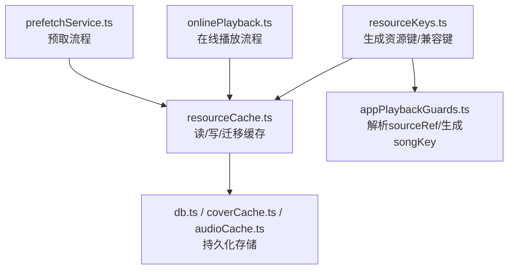
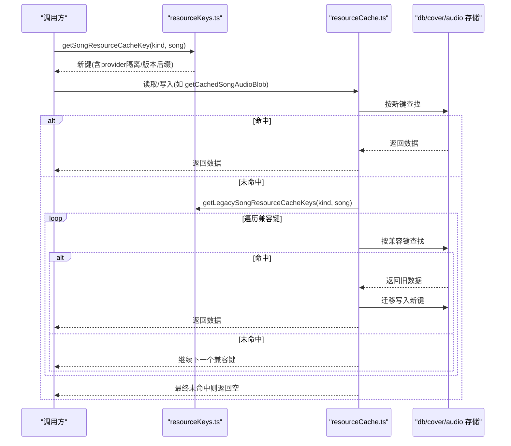
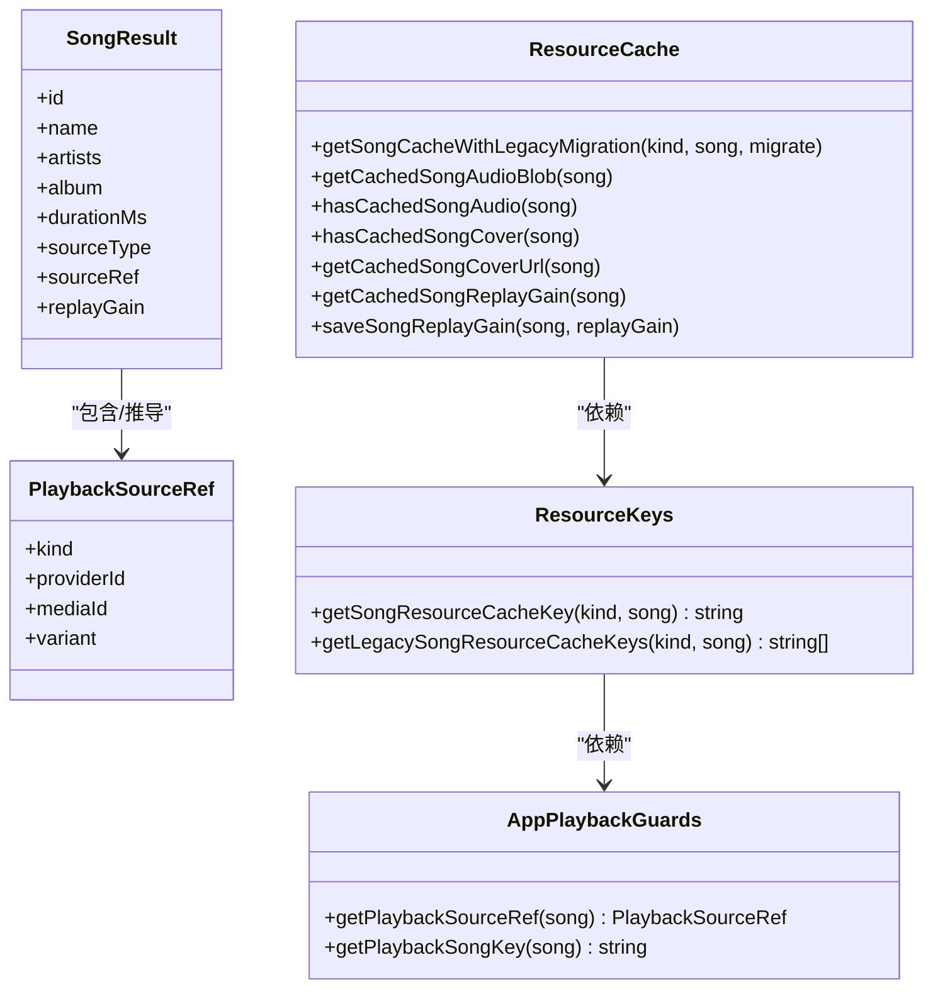
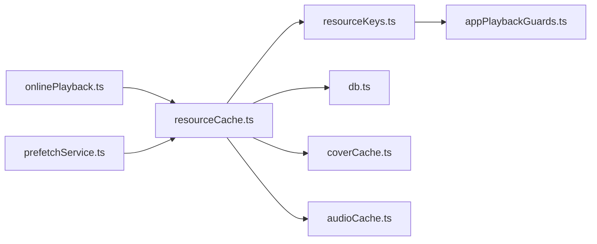

# 缓存键生成算法

<cite>
**本文引用的文件**
- [resourceKeys.ts](file://src/services/onlineMusic/resourceKeys.ts)
- [resourceCache.ts](file://src/services/onlineMusic/resourceCache.ts)
- [appPlaybackGuards.ts](file://src/utils/appPlaybackGuards.ts)
- [onlineMusic.ts](file://src/types/onlineMusic.ts)
- [types.ts](file://src/types.ts)
- [db.ts](file://src/services/db.ts)
- [coverCache.ts](file://src/services/coverCache.ts)
- [audioCache.ts](file://src/services/audioCache.ts)
- [onlinePlayback.ts](file://src/services/onlinePlayback.ts)
- [prefetchService.ts](file://src/services/prefetchService.ts)
</cite>

## 目录
1. [简介](#简介)
2. [项目结构](#项目结构)
3. [核心组件](#核心组件)
4. [架构总览](#架构总览)
5. [详细组件分析](#详细组件分析)
6. [依赖关系分析](#依赖关系分析)
7. [性能考量](#性能考量)
8. [故障排查指南](#故障排查指南)
9. [结论](#结论)
10. [附录](#附录)

## 简介
本文件聚焦于在线歌曲资源的缓存键生成算法，系统性解析 getSongResourceCacheKey 的设计原理与实现细节，覆盖 audio、lyric、cover、theme、replayGain 等资源类型的唯一标识生成策略；解释 legacy key 的兼容机制（getLegacySongResourceCacheKeys），说明旧版缓存格式的向后迁移路径；梳理命名规范与版本控制策略，确保不同提供商之间的资源隔离和数据一致性；最后给出缓存键设计的最佳实践与扩展指南。

## 项目结构
围绕缓存键生成的关键代码位于在线音乐服务层与播放源工具层：
- 资源键生成与兼容键映射：src/services/onlineMusic/resourceKeys.ts
- 资源缓存读写与迁移：src/services/onlineMusic/resourceCache.ts
- 播放源识别与统一键生成：src/utils/appPlaybackGuards.ts
- 类型定义（ReplayGainInfo、SongResult、PlaybackSourceRef 等）：src/types.ts、src/types/onlineMusic.ts
- 底层缓存存取与清理：src/services/db.ts、src/services/coverCache.ts、src/services/audioCache.ts
- 使用方（在线播放、预取）：src/services/onlinePlayback.ts、src/services/prefetchService.ts

图表来源
- [resourceKeys.ts:8-25](file://src/services/onlineMusic/resourceKeys.ts#L8-L25)
- [resourceCache.ts:12-114](file://src/services/onlineMusic/resourceCache.ts#L12-L114)
- [appPlaybackGuards.ts:49-96](file://src/utils/appPlaybackGuards.ts#L49-L96)
- [db.ts:77-115](file://src/services/db.ts#L77-L115)
- [onlinePlayback.ts:21-51](file://src/services/onlinePlayback.ts#L21-L51)
- [prefetchService.ts:159-238](file://src/services/prefetchService.ts#L159-L238)

章节来源
- [resourceKeys.ts:8-25](file://src/services/onlineMusic/resourceKeys.ts#L8-L25)
- [resourceCache.ts:12-114](file://src/services/onlineMusic/resourceCache.ts#L12-L114)
- [appPlaybackGuards.ts:49-96](file://src/utils/appPlaybackGuards.ts#L49-L96)
- [db.ts:77-115](file://src/services/db.ts#L77-L115)
- [onlinePlayback.ts:21-51](file://src/services/onlinePlayback.ts#L21-L51)
- [prefetchService.ts:159-238](file://src/services/prefetchService.ts#L159-L238)

## 核心组件
- 资源键生成器：根据资源种类与歌曲来源信息生成稳定、可区分、可扩展的键名。
- 兼容键生成器：为网易云旧版格式提供兼容键集合，支持“cloud”变体与裸 mediaId。
- 播放源解析器：从 SongResult 推导 PlaybackSourceRef，并生成跨来源一致的 songKey。
- 资源缓存封装：对音频、封面、歌词、主题、重放增益等资源的读取、写入与迁移逻辑进行统一封装。

章节来源
- [resourceKeys.ts:8-25](file://src/services/onlineMusic/resourceKeys.ts#L8-L25)
- [appPlaybackGuards.ts:49-96](file://src/utils/appPlaybackGuards.ts#L49-L96)
- [resourceCache.ts:12-114](file://src/services/onlineMusic/resourceCache.ts#L12-L114)

## 架构总览
下图展示了缓存键在读取/写入时的调用链路与数据流，包括新键优先、旧键回退与迁移写入的关键分支。

图表来源
- [resourceKeys.ts:8-25](file://src/services/onlineMusic/resourceKeys.ts#L8-L25)
- [resourceCache.ts:12-114](file://src/services/onlineMusic/resourceCache.ts#L12-L114)
- [db.ts:77-115](file://src/services/db.ts#L77-L115)

## 详细组件分析

### 资源键生成：getSongResourceCacheKey
- 输入：资源种类 kind（audio/lyric/cover/theme/replayGain）、歌曲对象 SongResult。
- 处理：
  - 通过 getPlaybackSourceRef(song) 解析出 sourceRef，包含 kind、providerId、mediaId、variant 等。
  - 针对 cover 资源且来源为在线且 providerId 为 kugou 时，将 kind 升级为 cover_v2，以体现版本差异。
  - 拼接 versionedKind 与 getPlaybackSongKey(song) 得到最终键。
- 输出：形如 “kind_online:providerId:mediaId” 或 “kind_v2_online:providerId:mediaId” 的稳定字符串。

设计要点
- 提供商隔离：songKey 中内嵌 providerId，避免多提供商同名 ID 冲突。
- 版本控制：对特定 provider 的特定资源（如酷狗封面）引入 _v2 后缀，便于后续演进而不破坏历史键。
- 统一性：所有资源共用同一套键生成规则，利于管理与维护。

章节来源
- [resourceKeys.ts:8-16](file://src/services/onlineMusic/resourceKeys.ts#L8-L16)
- [appPlaybackGuards.ts:49-96](file://src/utils/appPlaybackGuards.ts#L49-L96)

### 兼容键生成：getLegacySongResourceCacheKeys
- 适用场景：网易云旧版缓存格式，可能缺少 sourceRef 或仅保留裸 mediaId。
- 处理：
  - 仅当 sourceRef.kind === 'online' 且 providerId === 'netease' 时生效。
  - 若为 cloud 变体（variant === 'cloud'），额外生成 “kind_cloud_mediaId”。
  - 始终生成 “kind_mediaId” 作为兜底兼容键。
- 输出：兼容键数组，供读取时顺序尝试。

兼容性策略
- 先查新键，再依次尝试兼容键，命中后自动迁移写入新键，保证后续访问直接命中新键。
- 对封面资源，兼容键命中后会拉取远程 URL 并转存为二进制到新的 cover 缓存，提升稳定性。

章节来源
- [resourceKeys.ts:18-25](file://src/services/onlineMusic/resourceKeys.ts#L18-L25)
- [resourceCache.ts:12-114](file://src/services/onlineMusic/resourceCache.ts#L12-L114)

### 播放源解析与歌曲键：getPlaybackSourceRef / getPlaybackSongKey
- getPlaybackSourceRef：
  - 优先使用 song.sourceRef；否则根据 isStage/isLocal/isNavidrome 及 legacy 字段（sourceType/t）推断 online/local/navidrome/stage 来源。
  - 对网易云云端歌曲补充 variant: 'cloud'。
- getPlaybackSongKey：
  - online 来源：生成 “online:providerId:mediaId”。
  - 其他来源：生成 “kind:mediaId”。
- 作用：为资源键提供稳定的歌曲身份标识，确保队列操作、缓存键在不同来源间无冲突。

章节来源
- [appPlaybackGuards.ts:49-96](file://src/utils/appPlaybackGuards.ts#L49-L96)

### 资源缓存封装：resourceCache.ts
- 通用迁移读取：getSongCacheWithLegacyMigration
  - 先按新键读取；若命中则可选执行数据迁移并回写。
  - 未命中则遍历兼容键，命中后迁移写入新键并返回。
- 音频缓存：getCachedSongAudioBlob / hasCachedSongAudio
  - 新键优先，兼容键回退，命中后迁移至新键。
- 封面缓存：hasCachedSongCover / getCachedSongCoverUrl
  - 新键优先，兼容键回退；封面兼容命中会拉取 URL 并转为二进制存入新键。
- ReplayGain 缓存：getCachedSongReplayGain / saveSongReplayGain
  - 与音频同生命周期，按新键存储，避免离线回放时增益丢失导致音量跳变。

章节来源
- [resourceCache.ts:12-114](file://src/services/onlineMusic/resourceCache.ts#L12-L114)

### 使用方集成：onlinePlayback.ts 与 prefetchService.ts
- onlinePlayback.ts：
  - 优先从本地缓存获取音频 Blob，必要时恢复 ReplayGain 信息，保证离线播放体验一致。
- prefetchService.ts：
  - 预取阶段记录音频 URL、质量、时间戳与 ReplayGain；若质量不匹配则丢弃 URL 但保留其他元数据，避免误用过期链接。

章节来源
- [onlinePlayback.ts:21-51](file://src/services/onlinePlayback.ts#L21-L51)
- [prefetchService.ts:145-238](file://src/services/prefetchService.ts#L145-L238)

### 类图：核心类型与函数关系

图表来源
- [resourceKeys.ts:8-25](file://src/services/onlineMusic/resourceKeys.ts#L8-L25)
- [appPlaybackGuards.ts:49-96](file://src/utils/appPlaybackGuards.ts#L49-L96)
- [resourceCache.ts:12-114](file://src/services/onlineMusic/resourceCache.ts#L12-L114)
- [onlineMusic.ts:19-29](file://src/types/onlineMusic.ts#L19-L29)
- [types.ts:1099-1131](file://src/types.ts#L1099-L1131)

## 依赖关系分析
- resourceKeys.ts 依赖 appPlaybackGuards.ts 提供的 sourceRef 解析与 songKey 生成。
- resourceCache.ts 依赖 resourceKeys.ts 生成键，并组合 db.ts、coverCache.ts、audioCache.ts 完成持久化。
- onlinePlayback.ts 与 prefetchService.ts 消费 resourceCache.ts 的能力，形成完整的读取/写入闭环。
- 类型层面，PlaybackSourceRef 与 SongResult 是键生成与兼容迁移的基础契约。

图表来源
- [resourceKeys.ts:8-25](file://src/services/onlineMusic/resourceKeys.ts#L8-L25)
- [resourceCache.ts:12-114](file://src/services/onlineMusic/resourceCache.ts#L12-L114)
- [db.ts:77-115](file://src/services/db.ts#L77-L115)
- [onlinePlayback.ts:21-51](file://src/services/onlinePlayback.ts#L21-L51)
- [prefetchService.ts:159-238](file://src/services/prefetchService.ts#L159-L238)

章节来源
- [resourceKeys.ts:8-25](file://src/services/onlineMusic/resourceKeys.ts#L8-L25)
- [resourceCache.ts:12-114](file://src/services/onlineMusic/resourceCache.ts#L12-L114)
- [db.ts:77-115](file://src/services/db.ts#L77-L115)
- [onlinePlayback.ts:21-51](file://src/services/onlinePlayback.ts#L21-L51)
- [prefetchService.ts:159-238](file://src/services/prefetchService.ts#L159-L238)

## 性能考量
- 键空间最小化：基于 providerId 与 mediaId 的键长度可控，避免过长键带来的索引与序列化开销。
- 一次迁移多次命中：兼容键命中后立即迁移到新键，后续读取直接命中新键，降低重复 IO。
- 封面二进制化：兼容键命中后将远程 URL 转换为二进制存储，减少网络请求与失效风险。
- 预取质量校验：预取时对音频 URL 的质量与时效进行校验，避免错误缓存污染。
- 分离缓存类别：音频、封面、歌词等分别管理，便于独立清理与容量控制。

[本节为通用指导，无需具体文件引用]

## 故障排查指南
- 无法命中缓存
  - 检查是否使用了正确的资源种类（audio/lyric/cover/theme/replayGain）。
  - 确认歌曲的 sourceRef 是否正确解析（尤其是网易云 cloud 变体）。
  - 查看兼容键是否被正确生成与尝试。
- 兼容迁移失败
  - 检查数据库/存储层异常日志（db.ts 中的错误捕获）。
  - 确认封面 URL 拉取与二进制转换是否成功。
- 音质不匹配
  - 预取阶段会因 quality 不匹配丢弃 URL，需重新获取或调整预取参数。
- ReplayGain 缺失
  - 离线播放时若未恢复 ReplayGain，可能导致音量突变；确保保存与读取链路完整。

章节来源
- [db.ts:77-115](file://src/services/db.ts#L77-L115)
- [resourceCache.ts:96-114](file://src/services/onlineMusic/resourceCache.ts#L96-L114)
- [prefetchService.ts:145-154](file://src/services/prefetchService.ts#L145-L154)

## 结论
该缓存键生成方案通过“提供商隔离 + 版本后缀 + 兼容键回退”的组合策略，实现了多来源、多版本资源的安全隔离与平滑迁移。新键优先、旧键回退并在首次命中时迁移写入的设计，既保证了向后兼容，又提升了长期运行效率。配合统一的类型契约与分层存储，系统能够在复杂业务场景下保持高可用性与一致性。

[本节为总结，无需具体文件引用]

## 附录

### 命名规范与版本控制策略
- 基本格式：{kind | kind_vN}_{songKey}
- songKey：
  - online 来源：online:{providerId}:{mediaId}
  - 其他来源：{kind}:{mediaId}
- 版本控制：
  - 针对特定 provider 的特定资源（如酷狗封面）引入 v2 后缀，用于渐进式升级。
  - 网易云 cloud 变体通过兼容键保留历史行为。

章节来源
- [resourceKeys.ts:8-25](file://src/services/onlineMusic/resourceKeys.ts#L8-L25)
- [appPlaybackGuards.ts:49-96](file://src/utils/appPlaybackGuards.ts#L49-L96)

### 最佳实践与扩展指南
- 新增资源种类
  - 在 SongResourceKind 中添加新种类，并确保在各类缓存封装中支持读写。
- 新增提供商
  - 确保 getPlaybackSourceRef 能正确解析新 providerId；如需特殊版本策略，可在 getSongResourceCacheKey 中扩展版本后缀。
- 迁移策略
  - 对任何破坏性变更，采用“新键优先 + 兼容键回退 + 命中即迁移”的模式，避免用户侧感知。
- 数据一致性
  - 对强关联资源（如音频与 ReplayGain）使用相同 songKey 前缀，便于批量清理与一致性校验。
- 性能优化
  - 对大体积资源（如封面）优先使用二进制存储；对临时 URL 增加时效与质量校验。

章节来源
- [resourceKeys.ts:8-25](file://src/services/onlineMusic/resourceKeys.ts#L8-L25)
- [resourceCache.ts:12-114](file://src/services/onlineMusic/resourceCache.ts#L12-L114)
- [onlineMusic.ts:19-29](file://src/types/onlineMusic.ts#L19-L29)
- [types.ts:1099-1131](file://src/types.ts#L1099-L1131)