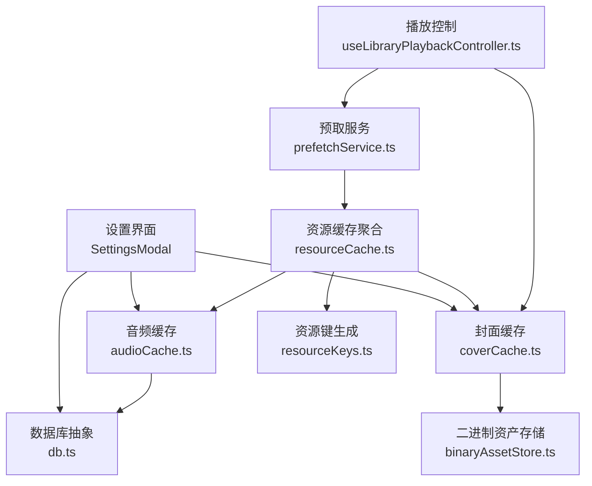
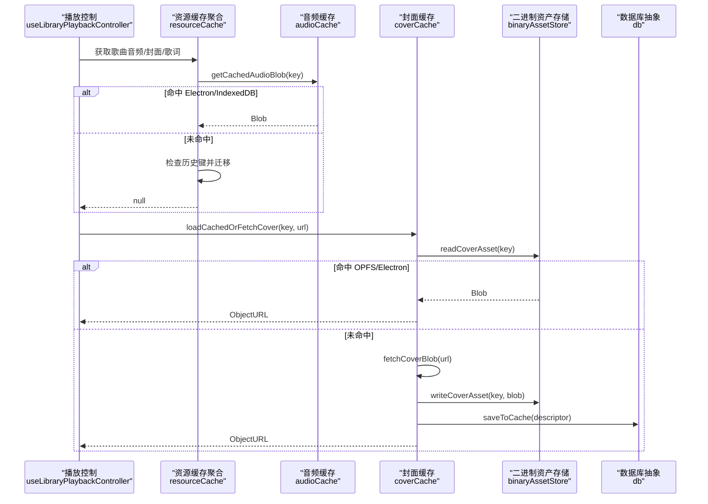
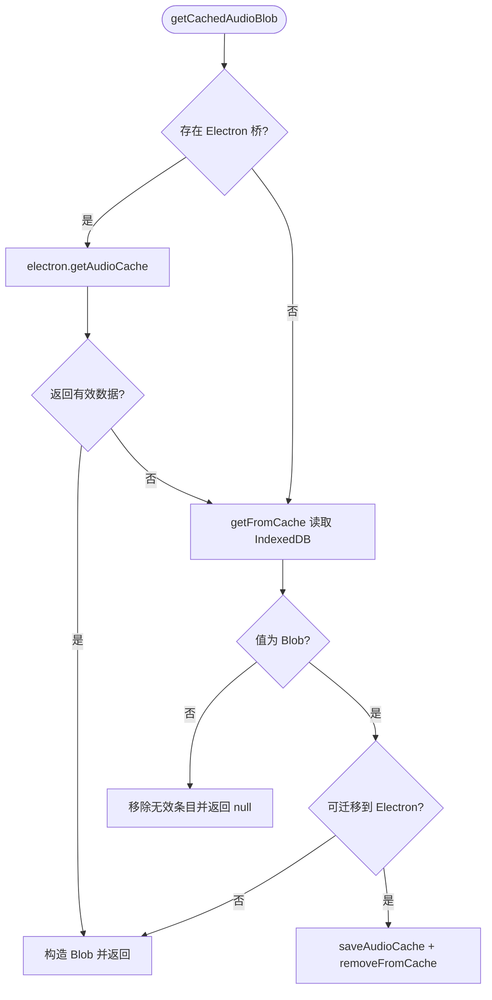
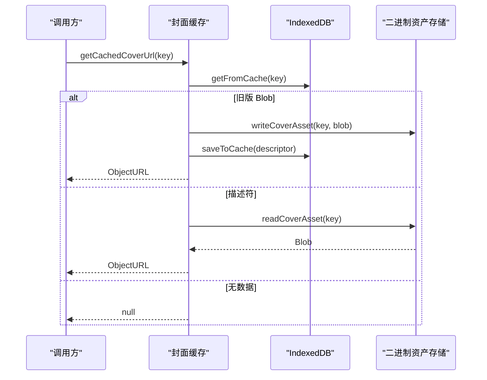
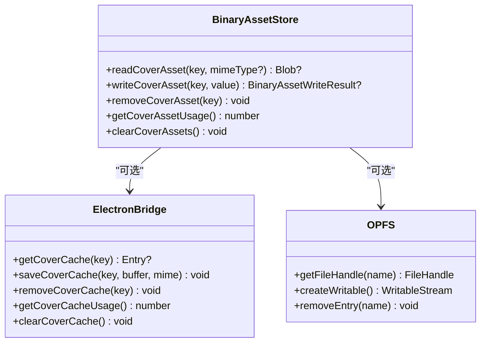
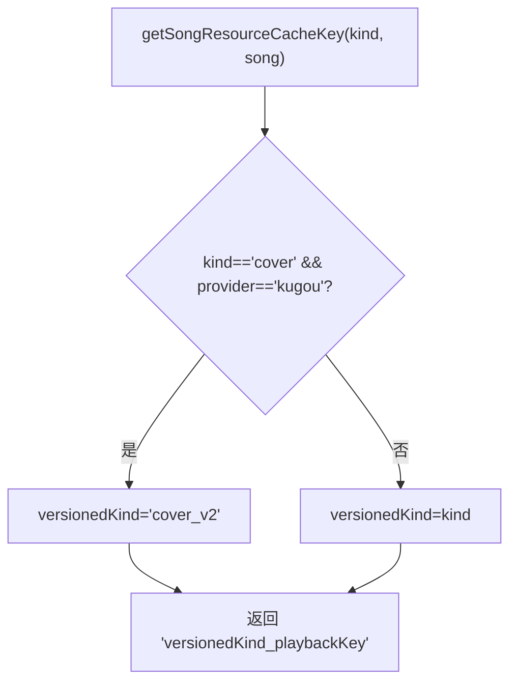
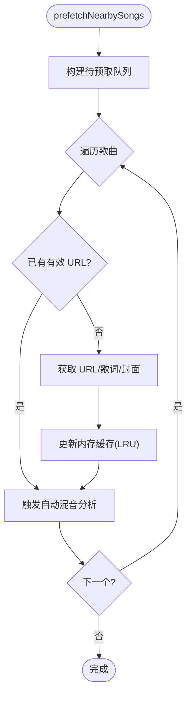
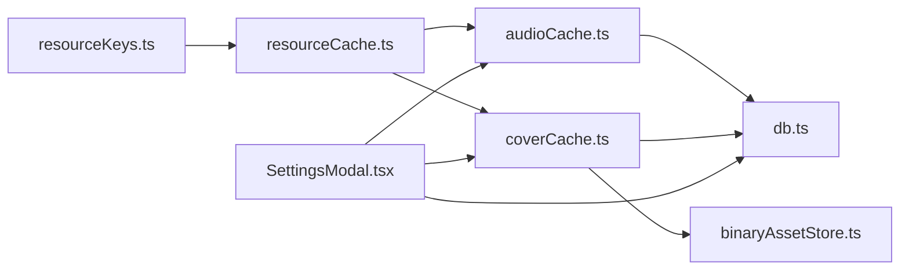

# 资源缓存策略

<cite>
**本文引用的文件**
- [src/services/audioCache.ts](file://src/services/audioCache.ts)
- [src/services/coverCache.ts](file://src/services/coverCache.ts)
- [src/services/binaryAssetStore.ts](file://src/services/binaryAssetStore.ts)
- [src/services/db.ts](file://src/services/db.ts)
- [src/services/onlineMusic/resourceCache.ts](file://src/services/onlineMusic/resourceCache.ts)
- [src/services/onlineMusic/resourceKeys.ts](file://src/services/onlineMusic/resourceKeys.ts)
- [src/services/prefetchService.ts](file://src/services/prefetchService.ts)
- [src/hooks/useLibraryPlaybackController.ts](file://src/hooks/useLibraryPlaybackController.ts)
- [src/components/modal/SettingsModal.tsx](file://src/components/modal/SettingsModal.tsx)
- [src/components/remote/useRemoteCoverArt.ts](file://src/components/remote/useRemoteCoverArt.ts)
- [test/unit/services/coverCache.test.ts](file://test/unit/services/coverCache.test.ts)
</cite>

## 目录
1. [简介](#简介)
2. [项目结构](#项目结构)
3. [核心组件](#核心组件)
4. [架构总览](#架构总览)
5. [详细组件分析](#详细组件分析)
6. [依赖关系分析](#依赖关系分析)
7. [性能考量](#性能考量)
8. [故障排查指南](#故障排查指南)
9. [结论](#结论)
10. [附录](#附录)

## 简介
本技术文档围绕在线音乐资源的缓存策略，系统阐述多级缓存架构与协作机制：内存缓存、IndexedDB（浏览器端）与外部存储（Electron 文件系统或 OPFS）的层次化设计；覆盖歌曲元数据、封面图片、歌词、播放列表等资源的差异化缓存规则；并深入解析缓存键生成算法、更新与失效策略、预加载与 LRU 淘汰、压缩与持久化、以及监控与调试工具的使用。目标是帮助开发者理解并优化 Folia 播放器在跨平台环境下的资源访问性能与稳定性。

## 项目结构
本项目将缓存能力拆分为多个职责清晰的模块：
- 音频缓存：统一封装 Electron 与 IndexedDB 的读取/写入，支持容量上限与迁移。
- 封面缓存：二进制资产通过 Electron 桥或 OPFS 落盘，索引仅保存轻量描述符。
- 资源键与聚合：按“来源+歌曲”生成稳定键，兼容历史网易云键。
- 预取服务：基于队列窗口预取 URL、歌词、封面，带 TTL 与 LRU 清理。
- 设置与清理：提供按类别清理与用量统计，联动各层缓存。

**图示来源**
- [src/components/modal/SettingsModal.tsx:737-786](file://src/components/modal/SettingsModal.tsx#L737-L786)
- [src/services/db.ts:77-184](file://src/services/db.ts#L77-L184)
- [src/services/coverCache.ts:44-127](file://src/services/coverCache.ts#L44-L127)
- [src/services/audioCache.ts:39-121](file://src/services/audioCache.ts#L39-L121)
- [src/services/binaryAssetStore.ts:82-173](file://src/services/binaryAssetStore.ts#L82-L173)
- [src/services/prefetchService.ts:92-154](file://src/services/prefetchService.ts#L92-L154)
- [src/services/onlineMusic/resourceCache.ts:36-114](file://src/services/onlineMusic/resourceCache.ts#L36-L114)
- [src/services/onlineMusic/resourceKeys.ts:8-25](file://src/services/onlineMusic/resourceKeys.ts#L8-L25)
- [src/hooks/useLibraryPlaybackController.ts:604-656](file://src/hooks/useLibraryPlaybackController.ts#L604-L656)

**章节来源**
- [src/components/modal/SettingsModal.tsx:737-786](file://src/components/modal/SettingsModal.tsx#L737-L786)
- [src/services/db.ts:77-184](file://src/services/db.ts#L77-L184)
- [src/services/coverCache.ts:44-127](file://src/services/coverCache.ts#L44-L127)
- [src/services/audioCache.ts:39-121](file://src/services/audioCache.ts#L39-L121)
- [src/services/binaryAssetStore.ts:82-173](file://src/services/binaryAssetStore.ts#L82-L173)
- [src/services/prefetchService.ts:92-154](file://src/services/prefetchService.ts#L92-L154)
- [src/services/onlineMusic/resourceCache.ts:36-114](file://src/services/onlineMusic/resourceCache.ts#L36-L114)
- [src/services/onlineMusic/resourceKeys.ts:8-25](file://src/services/onlineMusic/resourceKeys.ts#L8-L25)
- [src/hooks/useLibraryPlaybackController.ts:604-656](file://src/hooks/useLibraryPlaybackController.ts#L604-L656)

## 核心组件
- 音频缓存（audioCache.ts）
  - 优先走 Electron 音频缓存桥，回退到 IndexedDB Blob。
  - 写路径支持容量上限（GB），并在写入后广播“已缓存”事件，供自动混音等模块消费。
  - 提供 has/get/save 三件套，保证读多写少场景下的高效命中。
- 封面缓存（coverCache.ts）
  - 读取时若发现旧版 Blob，则迁移至二进制资产存储，并在索引中保存描述符。
  - 提供 loadCachedOrFetchCover、saveCoverBlob、removeCachedCover 等接口。
  - 对特定域名进行代理转发以解决 CORS。
- 二进制资产存储（binaryAssetStore.ts）
  - 统一 Electron 桥与 OPFS 两种后端，文件名由 key 的 SHA-256 哈希决定，避免逻辑键泄露到文件系统。
  - 提供读写、删除、用量统计与全量清理。
- 资源键与聚合（resourceKeys.ts, resourceCache.ts）
  - 按来源与歌曲生成稳定键，兼容历史网易云键，并提供 getSongCacheWithLegacyMigration 做一次性迁移。
  - 聚合音频、封面、ReplayGain 的缓存查询与写入。
- 预取服务（prefetchService.ts）
  - 维护内存中的预取缓存，包含 URL、歌词、封面、ReplayGain，带 TTL 与 LRU 淘汰。
  - 根据队列窗口预取前后若干首歌的“轻资源”，降低切换延迟。
- 设置与清理（SettingsModal.tsx, db.ts）
  - 提供按类别清理（媒体、封面、歌词、播放列表、分析）与全部清理。
  - 统计各层缓存用量，支持选择缓存目录（Electron）。

**章节来源**
- [src/services/audioCache.ts:39-121](file://src/services/audioCache.ts#L39-L121)
- [src/services/coverCache.ts:23-127](file://src/services/coverCache.ts#L23-L127)
- [src/services/binaryAssetStore.ts:40-173](file://src/services/binaryAssetStore.ts#L40-L173)
- [src/services/onlineMusic/resourceKeys.ts:8-25](file://src/services/onlineMusic/resourceKeys.ts#L8-L25)
- [src/services/onlineMusic/resourceCache.ts:12-114](file://src/services/onlineMusic/resourceCache.ts#L12-L114)
- [src/services/prefetchService.ts:24-154](file://src/services/prefetchService.ts#L24-L154)
- [src/components/modal/SettingsModal.tsx:737-786](file://src/components/modal/SettingsModal.tsx#L737-L786)
- [src/services/db.ts:128-184](file://src/services/db.ts#L128-L184)

## 架构总览
下图展示从播放控制到各层缓存的调用链路与数据流。

**图示来源**
- [src/hooks/useLibraryPlaybackController.ts:604-656](file://src/hooks/useLibraryPlaybackController.ts#L604-L656)
- [src/services/onlineMusic/resourceCache.ts:36-114](file://src/services/onlineMusic/resourceCache.ts#L36-L114)
- [src/services/audioCache.ts:39-121](file://src/services/audioCache.ts#L39-L121)
- [src/services/coverCache.ts:82-127](file://src/services/coverCache.ts#L82-L127)
- [src/services/binaryAssetStore.ts:82-130](file://src/services/binaryAssetStore.ts#L82-L130)
- [src/services/db.ts:77-91](file://src/services/db.ts#L77-L91)

## 详细组件分析

### 音频缓存（audioCache.ts）
- 读取优先级：Electron 音频缓存 > IndexedDB Blob。
- 迁移：首次读取 IndexedDB 音频时尝试迁移到 Electron 文件缓存，失败则保留原样。
- 容量控制：写入时传入 GB 级上限，由主进程负责裁剪。
- 事件通知：写入成功后广播 cacheKey，供自动混音等模块感知。

**图示来源**
- [src/services/audioCache.ts:39-121](file://src/services/audioCache.ts#L39-L121)

**章节来源**
- [src/services/audioCache.ts:39-121](file://src/services/audioCache.ts#L39-L121)

### 封面缓存（coverCache.ts）
- 读取流程：先查 IndexedDB，若为旧版 Blob 则迁移至二进制资产存储，并更新索引为描述符。
- 网络回退：若无本地封面，则通过代理或直连下载，再写入二进制资产存储与索引。
- 安全 URL：使用 createSafeObjectUrl 生成安全的对象 URL，避免泄漏。
- 清理：同时删除索引与二进制资产。

**图示来源**
- [src/services/coverCache.ts:44-127](file://src/services/coverCache.ts#L44-L127)
- [src/services/binaryAssetStore.ts:82-130](file://src/services/binaryAssetStore.ts#L82-L130)
- [src/services/db.ts:77-91](file://src/services/db.ts#L77-L91)

**章节来源**
- [src/services/coverCache.ts:23-127](file://src/services/coverCache.ts#L23-L127)
- [test/unit/services/coverCache.test.ts:38-66](file://test/unit/services/coverCache.test.ts#L38-L66)

### 二进制资产存储（binaryAssetStore.ts）
- 后端选择：优先 Electron 桥，否则使用 OPFS。
- 文件名：key 经 SHA-256 哈希后作为文件名，避免逻辑键暴露。
- 校验：写入前验证 MIME 类型与大小，读取时校验有效性，异常时清理损坏条目。
- 管理：提供用量统计与全量清理。

**图示来源**
- [src/services/binaryAssetStore.ts:24-173](file://src/services/binaryAssetStore.ts#L24-L173)

**章节来源**
- [src/services/binaryAssetStore.ts:40-173](file://src/services/binaryAssetStore.ts#L40-L173)

### 资源键与聚合（resourceKeys.ts, resourceCache.ts）
- 键生成：结合来源与歌曲标识，针对酷狗封面使用版本化键 cover_v2。
- 历史兼容：网易云旧键在一次读取时迁移到新键，减少重复网络请求。
- 聚合接口：提供音频、封面、ReplayGain 的统一查询与写入。

**图示来源**
- [src/services/onlineMusic/resourceKeys.ts:8-25](file://src/services/onlineMusic/resourceKeys.ts#L8-L25)

**章节来源**
- [src/services/onlineMusic/resourceKeys.ts:8-25](file://src/services/onlineMusic/resourceKeys.ts#L8-L25)
- [src/services/onlineMusic/resourceCache.ts:12-114](file://src/services/onlineMusic/resourceCache.ts#L12-L114)

### 预取服务（prefetchService.ts）
- 窗口策略：向前预取 2 首，向后预取 1 首，确保切歌即时可用。
- 内容范围：URL、歌词、封面、ReplayGain，均为“轻资源”。
- 过期策略：URL 有效期 20 分钟，到期后重新获取。
- 内存 LRU：超过阈值时淘汰最久未使用的条目。
- 非阻塞执行：使用 requestIdleCallback 调度，避免阻塞主线程。

**图示来源**
- [src/services/prefetchService.ts:35-154](file://src/services/prefetchService.ts#L35-L154)
- [src/services/prefetchService.ts:405-493](file://src/services/prefetchService.ts#L405-L493)

**章节来源**
- [src/services/prefetchService.ts:24-154](file://src/services/prefetchService.ts#L24-L154)
- [src/services/prefetchService.ts:405-493](file://src/services/prefetchService.ts#L405-L493)

### 播放控制集成（useLibraryPlaybackController.ts）
- 封面加载：启动播放时优先从缓存加载封面，必要时拉取并缓存。
- 主题恢复：根据歌曲恢复上次主题状态。
- 歌词处理：根据本地/在线来源合并歌词，支持手动覆盖与清除。

**章节来源**
- [src/hooks/useLibraryPlaybackController.ts:604-656](file://src/hooks/useLibraryPlaybackController.ts#L604-L656)
- [src/hooks/useLibraryPlaybackController.ts:1136-1152](file://src/hooks/useLibraryPlaybackController.ts#L1136-L1152)

### 背景配色缓存（useRemoteCoverArt.ts）
- 内存 LRU：按 trackKey 或 coverUrl 缓存提取的颜色，限制最大数量。
- 预读邻居：提前为上一首/下一首计算颜色，提升切换体验。

**章节来源**
- [src/components/remote/useRemoteCoverArt.ts:30-134](file://src/components/remote/useRemoteCoverArt.ts#L30-L134)

## 依赖关系分析
- 低耦合：各缓存模块通过统一的 db.ts 抽象与 binaryAssetStore.ts 解耦具体存储后端。
- 键一致性：resourceKeys.ts 集中管理键生成，避免分散导致的不一致。
- 事件驱动：audioCache 写入后广播事件，下游无需轮询即可响应。
- 兼容性：resourceCache 提供历史键迁移，平滑升级。

**图示来源**
- [src/services/onlineMusic/resourceKeys.ts:8-25](file://src/services/onlineMusic/resourceKeys.ts#L8-L25)
- [src/services/onlineMusic/resourceCache.ts:12-114](file://src/services/onlineMusic/resourceCache.ts#L12-L114)
- [src/services/audioCache.ts:39-121](file://src/services/audioCache.ts#L39-L121)
- [src/services/coverCache.ts:44-127](file://src/services/coverCache.ts#L44-L127)
- [src/services/binaryAssetStore.ts:82-173](file://src/services/binaryAssetStore.ts#L82-L173)
- [src/services/db.ts:77-184](file://src/services/db.ts#L77-L184)
- [src/components/modal/SettingsModal.tsx:737-786](file://src/components/modal/SettingsModal.tsx#L737-L786)

**章节来源**
- [src/services/onlineMusic/resourceKeys.ts:8-25](file://src/services/onlineMusic/resourceKeys.ts#L8-L25)
- [src/services/onlineMusic/resourceCache.ts:12-114](file://src/services/onlineMusic/resourceCache.ts#L12-L114)
- [src/services/audioCache.ts:39-121](file://src/services/audioCache.ts#L39-L121)
- [src/services/coverCache.ts:44-127](file://src/services/coverCache.ts#L44-L127)
- [src/services/binaryAssetStore.ts:82-173](file://src/services/binaryAssetStore.ts#L82-L173)
- [src/services/db.ts:77-184](file://src/services/db.ts#L77-L184)
- [src/components/modal/SettingsModal.tsx:737-786](file://src/components/modal/SettingsModal.tsx#L737-L786)

## 性能考量
- LRU 淘汰
  - 预取内存缓存：超过阈值时淘汰最久未使用项，避免内存膨胀。
  - 背景配色缓存：限制 Map 大小，防止长期运行占用过多内存。
- 压缩与持久化
  - 封面二进制资产直接落盘（OPFS/Electron），索引仅存描述符，减少 IndexedDB 压力。
  - 音频缓存优先 Electron 文件缓存，降低浏览器内存占用。
- 预加载策略
  - 基于队列窗口的轻资源预取，显著降低切歌延迟。
  - 邻居封面颜色预计算，提升背景切换流畅度。
- 容量控制
  - 音频缓存写入时携带 GB 级上限，由主进程负责裁剪，避免无限增长。
- 网络优化
  - 封面请求对特定域名走代理，规避 CORS 问题。
  - 预取 URL 带 TTL，过期即刷新，避免使用失效链接。

[本节为通用性能建议，不直接分析具体文件]

## 故障排查指南
- 封面缓存异常
  - 现象：读取不到封面或报错。
  - 排查：检查 IndexedDB 是否存在旧版 Blob，是否成功迁移至二进制资产存储；确认 OPFS/Electron 桥可用。
  - 参考：测试用例验证了无效值清理与迁移行为。
- 音频缓存未命中
  - 现象：每次播放都重新下载。
  - 排查：确认 Electron 桥是否可用；检查 IndexedDB 是否有 Blob；查看写入后是否触发缓存事件。
- 预取失效
  - 现象：切歌卡顿。
  - 排查：检查预取窗口配置、URL TTL、LRU 淘汰是否过于激进；确认队列变化时是否正确清理并重预取。
- 清理缓存
  - 操作：通过设置界面按类别清理或一键清理；确认各层缓存均被清空。

**章节来源**
- [test/unit/services/coverCache.test.ts:38-66](file://test/unit/services/coverCache.test.ts#L38-L66)
- [src/services/audioCache.ts:39-121](file://src/services/audioCache.ts#L39-L121)
- [src/services/prefetchService.ts:499-544](file://src/services/prefetchService.ts#L499-L544)
- [src/components/modal/SettingsModal.tsx:737-786](file://src/components/modal/SettingsModal.tsx#L737-L786)
- [src/services/db.ts:128-184](file://src/services/db.ts#L128-L184)

## 结论
Folia 的资源缓存体系采用“内存 + IndexedDB + 外部存储”的多级架构，兼顾性能与可靠性。通过稳定的键生成、历史兼容迁移、预取与 LRU 淘汰、以及 Electron/OPFS 的后端适配，实现了跨平台的稳定高效。设置与清理工具提供了完善的运维能力，便于监控与调优。建议在后续迭代中继续优化预取窗口、TTL 策略与容量裁剪算法，进一步提升用户体验。

[本节为总结性内容，不直接分析具体文件]

## 附录
- 关键配置项
  - 预取窗口：向前 2、向后 1。
  - URL 有效期：20 分钟。
  - 预取缓存上限：200 项。
  - 音频缓存上限：用户可配置 GB 级上限。
- 最佳实践
  - 使用资源键聚合接口统一访问缓存，避免分散实现。
  - 在队列变化时及时清理并重预取，避免陈旧数据。
  - 封面优先落盘，索引仅存描述符，降低存储压力。
  - 利用缓存事件驱动下游逻辑，避免轮询。

[本节为补充信息，不直接分析具体文件]