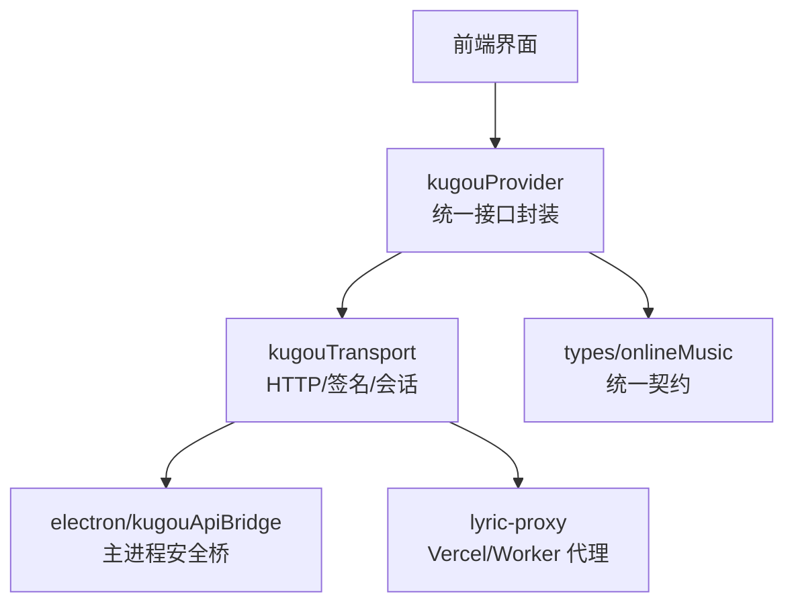
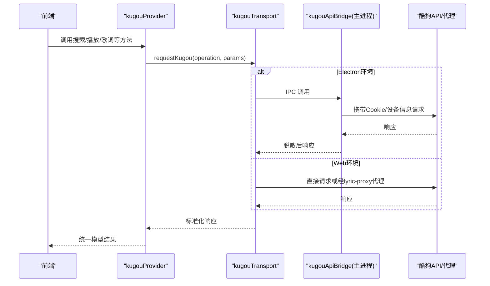
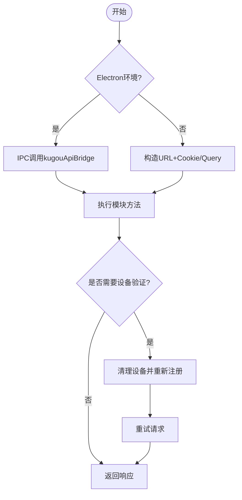
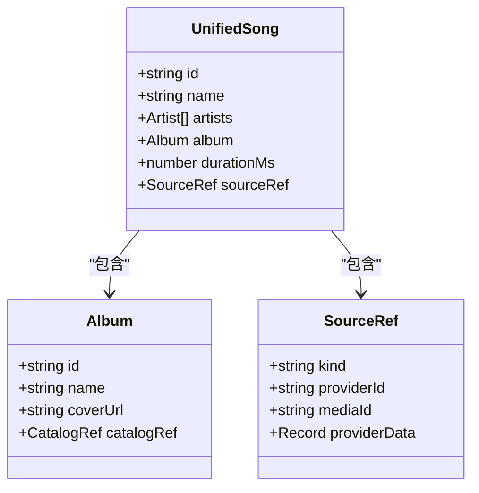
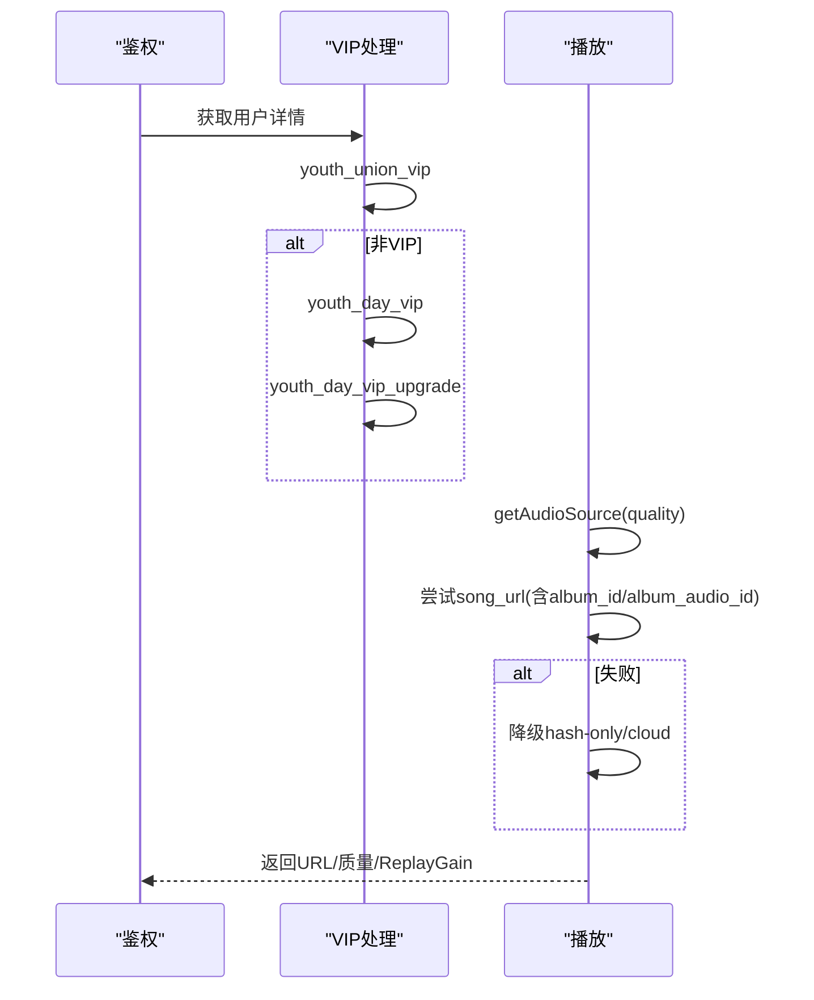
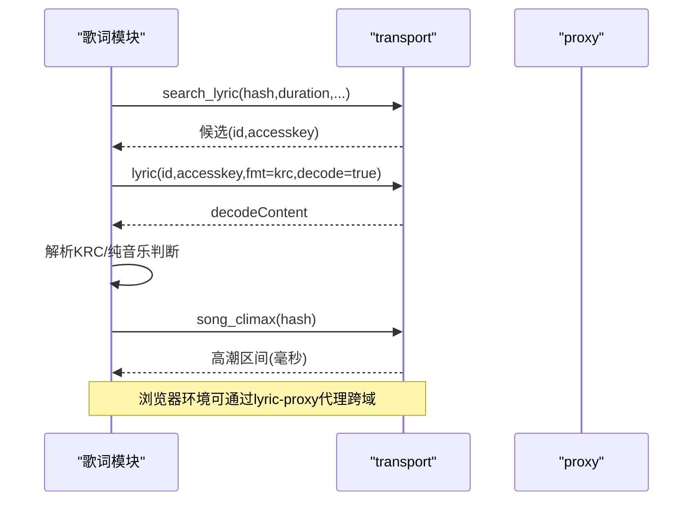
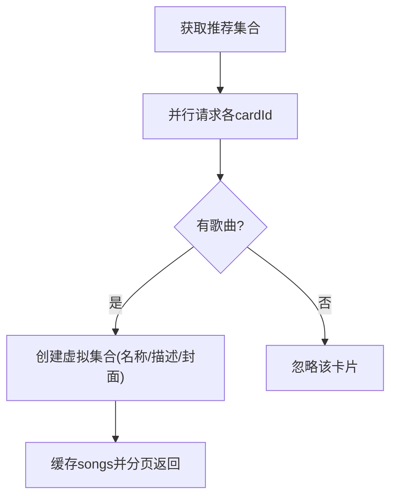
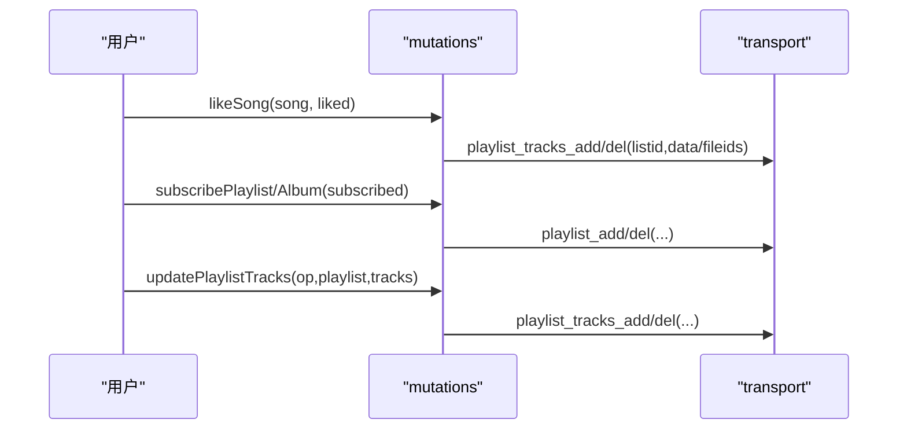
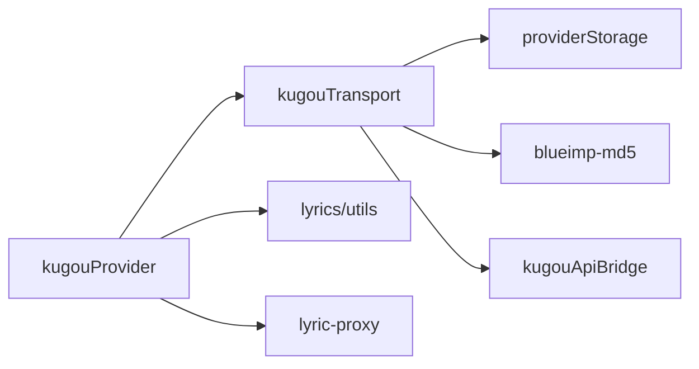
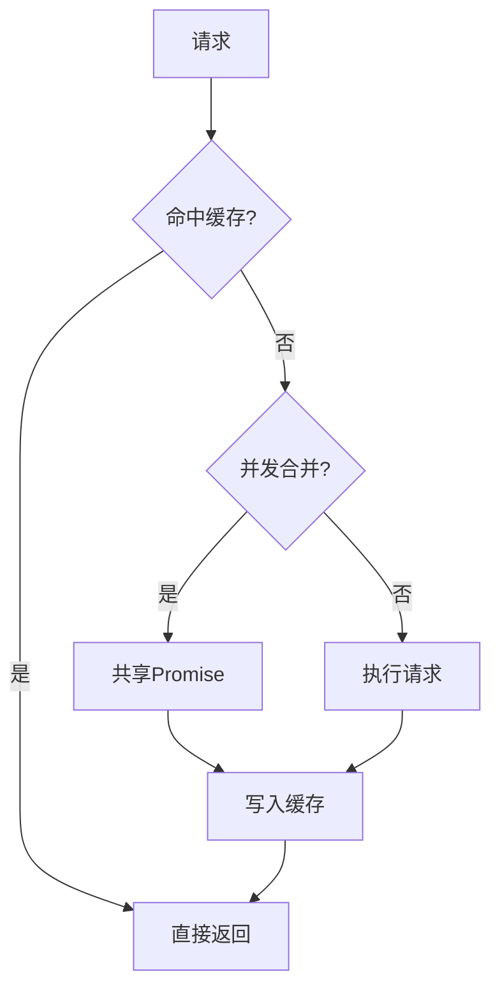

# API调用实现

<cite>
**本文引用的文件**
- [kugouProvider.ts](file://src/services/onlineMusic/kugouProvider.ts)
- [kugouTransport.ts](file://src/services/onlineMusic/kugouTransport.ts)
- [kugouApiBridge.cjs](file://electron/kugouApiBridge.cjs)
- [lyric-proxy.js](file://api/lyric-proxy.js)
- [lyric-proxy.ts](file://worker/lyric-proxy.ts)
- [onlineMusic.ts](file://src/types/onlineMusic.ts)
</cite>

## 目录
1. [简介](#简介)
2. [项目结构](#项目结构)
3. [核心组件](#核心组件)
4. [架构总览](#架构总览)
5. [详细组件分析](#详细组件分析)
6. [依赖关系分析](#依赖关系分析)
7. [性能与缓存](#性能与缓存)
8. [故障排查](#故障排查)
9. [结论](#结论)
10. [附录：API方法参考](#附录api方法参考)

## 简介
本文件系统性说明酷狗音乐（KuGou）在 Folia 中的 API 调用实现，覆盖请求构建、响应处理、数据转换、VIP/付费内容、歌词与翻译、推荐卡片、专辑元数据、收藏与下载等能力。同时给出完整的 API 方法参考与调用示例路径，并解释请求缓存机制与性能优化策略（并发控制、结果复用）。

## 项目结构
围绕酷狗音乐的实现主要分布在以下模块：
- 在线音乐提供者层：负责将酷狗原始响应统一为内部模型，并提供搜索、播放、歌词、收藏、推荐等能力。
- 传输层：封装 HTTP 请求、签名、设备注册、会话持久化、代理转发等。
- Electron 桥接：在主进程安全地持有并注入认证凭据，避免泄露到渲染进程。
- 歌词代理：在浏览器环境通过 Vercel/Cloudflare Worker 代理跨域访问歌词服务。
- 类型定义：统一的在线音乐接口契约。

**图表来源**
- [kugouProvider.ts:849-1365](file://src/services/onlineMusic/kugouProvider.ts#L849-L1365)
- [kugouTransport.ts:21-57](file://src/services/onlineMusic/kugouTransport.ts#L21-L57)
- [kugouApiBridge.cjs:9-45](file://electron/kugouApiBridge.cjs#L9-L45)
- [lyric-proxy.js:34-39](file://api/lyric-proxy.js#L34-L39)
- [lyric-proxy.ts:30-35](file://worker/lyric-proxy.ts#L30-L35)
- [onlineMusic.ts:31-51](file://src/types/onlineMusic.ts#L31-L51)

**章节来源**
- [kugouProvider.ts:849-1365](file://src/services/onlineMusic/kugouProvider.ts#L849-L1365)
- [kugouTransport.ts:21-57](file://src/services/onlineMusic/kugouTransport.ts#L21-L57)
- [kugouApiBridge.cjs:9-45](file://electron/kugouApiBridge.cjs#L9-L45)
- [lyric-proxy.js:34-39](file://api/lyric-proxy.js#L34-L39)
- [lyric-proxy.ts:30-35](file://worker/lyric-proxy.ts#L30-L35)
- [onlineMusic.ts:31-51](file://src/types/onlineMusic.ts#L31-L51)

## 核心组件
- kugouProvider：对外暴露统一的 OnlineMusicProvider 接口，包含搜索、播放、歌词、用户库、收藏、推荐、订阅、历史推荐等能力；负责将酷狗原始数据结构标准化为 UnifiedSong、ProviderCollection、ProviderUser 等。
- kugouTransport：集中管理所有酷狗操作名与端点映射，提供 requestKugou、requestKugouAnonymousSearch、设备注册、会话持久化、Web 后端路由或 Electron IPC 路由。
- electron/kugouApiBridge：在主进程加载 kugoumusicapi，维护加密的 Cookie/Token/DeviceId，自动处理设备验证失败重试，并向渲染进程返回脱敏后的响应体。
- lyric-proxy：在浏览器环境下通过 Vercel/Cloudflare Worker 代理跨域访问酷狗歌词相关域名，过滤敏感头并添加 CORS。
- types/onlineMusic：定义统一的在线音乐能力、分页、音频源、歌词、收藏、用户等类型。

**章节来源**
- [kugouProvider.ts:849-1365](file://src/services/onlineMusic/kugouProvider.ts#L849-L1365)
- [kugouTransport.ts:21-57](file://src/services/onlineMusic/kugouTransport.ts#L21-L57)
- [kugouApiBridge.cjs:156-306](file://electron/kugouApiBridge.cjs#L156-L306)
- [lyric-proxy.js:43-108](file://api/lyric-proxy.js#L43-L108)
- [lyric-proxy.ts:8-110](file://worker/lyric-proxy.ts#L8-L110)
- [onlineMusic.ts:31-51](file://src/types/onlineMusic.ts#L31-L51)

## 架构总览
整体流程：
- 前端调用 kugouProvider 的方法（如搜索、获取播放链接、获取歌词等）。
- kugouProvider 根据场景选择是否使用已登录会话或匿名签名搜索，并通过 kugouTransport.requestKugou 发起请求。
- 在 Electron 环境中，请求由主进程的 kugouApiBridge 执行，自动注入设备标识与 Cookie，并在需要时触发设备注册与重试。
- 在非 Electron 环境，请求经配置的 Web 后端或直接通过 lyric-proxy 代理跨域访问。
- 响应被标准化为统一模型，供上层使用。

**图表来源**
- [kugouProvider.ts:868-986](file://src/services/onlineMusic/kugouProvider.ts#L868-L986)
- [kugouTransport.ts:224-266](file://src/services/onlineMusic/kugouTransport.ts#L224-L266)
- [kugouApiBridge.cjs:227-306](file://electron/kugouApiBridge.cjs#L227-L306)
- [lyric-proxy.js:43-108](file://api/lyric-proxy.js#L43-L108)

## 详细组件分析

### 请求构建与发送
- 操作名与端点映射：集中定义于 KUGOU_OPERATIONS 与 ENDPOINTS，便于扩展与维护。
- 会话与设备：
  - Electron：通过 kugouApiBridge 维护加密 Cookie/Token/dfid，自动检测并处理“需要设备验证”的错误码，必要时重新注册设备并重试。
  - Web：从 providerStorage 读取 cookie/token/userid/dfid，拼接为查询参数或 Cookie 头；若检测到设备验证错误，清理本地设备标识并重新注册。
- 匿名搜索：在未登录状态下，使用 Android 风格的签名构造匿名搜索请求，通过 lyric-proxy 绕过跨域限制。

**图表来源**
- [kugouTransport.ts:70-74](file://src/services/onlineMusic/kugouTransport.ts#L70-L74)
- [kugouTransport.ts:175-199](file://src/services/onlineMusic/kugouTransport.ts#L175-L199)
- [kugouTransport.ts:224-266](file://src/services/onlineMusic/kugouTransport.ts#L224-L266)
- [kugouApiBridge.cjs:247-306](file://electron/kugouApiBridge.cjs#L247-L306)

**章节来源**
- [kugouTransport.ts:21-57](file://src/services/onlineMusic/kugouTransport.ts#L21-L57)
- [kugouTransport.ts:106-173](file://src/services/onlineMusic/kugouTransport.ts#L106-L173)
- [kugouTransport.ts:224-266](file://src/services/onlineMusic/kugouTransport.ts#L224-L266)
- [kugouApiBridge.cjs:156-306](file://electron/kugouApiBridge.cjs#L156-L306)

### 响应处理与数据转换
- 通用解包：dataOf/listOf/songListOf/valueOf/hashOf/coverOf 等工具函数适配酷狗多变的响应结构，提取列表、封面、哈希等字段。
- 歌曲标准化：normalizeKugouSong 将多种字段映射为 UnifiedSong，包括标题、艺人、专辑、时长、来源引用与 providerData。
- 专辑/艺人/歌单标准化：normalizeCollection 统一专辑、歌单、艺人的元数据，支持别名、发布时间、播放量、拥有者标记等。
- 元数据增强：resolveKugouSongCatalogRefs 基于 hash 匹配 KRM 元数据，回填专辑 ID、艺人信息与封面。

**图表来源**
- [kugouProvider.ts:222-285](file://src/services/onlineMusic/kugouProvider.ts#L222-L285)
- [kugouProvider.ts:542-592](file://src/services/onlineMusic/kugouProvider.ts#L542-L592)
- [kugouProvider.ts:412-445](file://src/services/onlineMusic/kugouProvider.ts#L412-L445)

**章节来源**
- [kugouProvider.ts:34-152](file://src/services/onlineMusic/kugouProvider.ts#L34-L152)
- [kugouProvider.ts:222-285](file://src/services/onlineMusic/kugouProvider.ts#L222-L285)
- [kugouProvider.ts:542-592](file://src/services/onlineMusic/kugouProvider.ts#L542-L592)
- [kugouProvider.ts:412-445](file://src/services/onlineMusic/kugouProvider.ts#L412-L445)

### VIP与付费内容处理
- 青年VIP自动领取：在登录状态检查时尝试 youth_union_vip，若非VIP则调用 youth_day_vip 与 youth_day_vip_upgrade 领取并升级。
- VIP类型归一化：normalizeKugouVipType 兼容直接 vip_type 与业务VIP数组 busi_vip。
- 播放降级：getAudioSource 按 quality 优先级尝试 song_url/metadata/hash-only/cloud 等多种变体，失败时降级直至找到可播放 URL。

**图表来源**
- [kugouProvider.ts:491-540](file://src/services/onlineMusic/kugouProvider.ts#L491-L540)
- [kugouProvider.ts:903-985](file://src/services/onlineMusic/kugouProvider.ts#L903-L985)

**章节来源**
- [kugouProvider.ts:461-540](file://src/services/onlineMusic/kugouProvider.ts#L461-L540)
- [kugouProvider.ts:903-985](file://src/services/onlineMusic/kugouProvider.ts#L903-L985)

### 歌词与高潮片段
- 歌词获取：先通过 search_lyric 匹配候选，再调用 lyric 接口获取解码后的 KRC；识别纯音乐文本并返回 wordByWordText。
- 高潮片段：song_climax 返回毫秒级区间，转换为秒级 ChorusRange 并缓存。
- 歌词代理：在浏览器中通过 lyric-proxy 代理跨域访问酷狗域名，过滤敏感头并添加 CORS。

**图表来源**
- [kugouProvider.ts:708-757](file://src/services/onlineMusic/kugouProvider.ts#L708-L757)
- [kugouProvider.ts:676-706](file://src/services/onlineMusic/kugouProvider.ts#L676-L706)
- [lyric-proxy.js:43-108](file://api/lyric-proxy.js#L43-L108)
- [lyric-proxy.ts:8-110](file://worker/lyric-proxy.ts#L8-L110)

**章节来源**
- [kugouProvider.ts:708-757](file://src/services/onlineMusic/kugouProvider.ts#L708-L757)
- [kugouProvider.ts:676-706](file://src/services/onlineMusic/kugouProvider.ts#L676-L706)
- [lyric-proxy.js:43-108](file://api/lyric-proxy.js#L43-L108)
- [lyric-proxy.ts:8-110](file://worker/lyric-proxy.ts#L8-L110)

### 推荐卡片与历史推荐
- 推荐卡片：top_card_youth 拉取多个推荐卡片（VIP专属、私人好歌、小众宝藏等），缓存 normalized songs 并按虚拟集合分页。
- 历史推荐：everyday_history 支持 list/song 模式，缓存日期与名称映射，支持 dislike 替换当前曲。

**图表来源**
- [kugouProvider.ts:287-362](file://src/services/onlineMusic/kugouProvider.ts#L287-L362)
- [kugouProvider.ts:1223-1280](file://src/services/onlineMusic/kugouProvider.ts#L1223-L1280)

**章节来源**
- [kugouProvider.ts:287-362](file://src/services/onlineMusic/kugouProvider.ts#L287-L362)
- [kugouProvider.ts:1223-1280](file://src/services/onlineMusic/kugouProvider.ts#L1223-L1280)

### 收藏、订阅与播放列表
- 收藏：likeSong 通过 playlist_tracks_add/del 操作“我喜欢”歌单（内置特殊ID/name识别）。
- 订阅歌单/专辑：subscribePlaylist/subscribeAlbum 通过 playlist_add/del 完成订阅与取消订阅，需传入 creatorUserId/listId/gid 等上下文。
- 播放列表增删：updatePlaylistTracks 批量追加或删除曲目。

**图表来源**
- [kugouProvider.ts:1282-1363](file://src/services/onlineMusic/kugouProvider.ts#L1282-L1363)

**章节来源**
- [kugouProvider.ts:1282-1363](file://src/services/onlineMusic/kugouProvider.ts#L1282-L1363)

## 依赖关系分析
- kugouProvider 依赖 kugouTransport 进行网络请求，依赖 utils/lyrics 进行歌词解析与匹配，依赖 coverUrl/songMetadata 等工具。
- kugouTransport 依赖 providerStorage 读写会话值，依赖 blueimp-md5 生成签名。
- electron/kugouApiBridge 依赖 kugoumusicapi 模块，依赖 Electron safeStorage 加密存储。
- lyric-proxy 作为中间件，仅允许特定域名（酷狗、QQ等）并过滤敏感头。

**图表来源**
- [kugouProvider.ts:1-31](file://src/services/onlineMusic/kugouProvider.ts#L1-L31)
- [kugouTransport.ts:1-4](file://src/services/onlineMusic/kugouTransport.ts#L1-L4)
- [kugouApiBridge.cjs:156-192](file://electron/kugouApiBridge.cjs#L156-L192)
- [lyric-proxy.js:34-39](file://api/lyric-proxy.js#L34-L39)

**章节来源**
- [kugouProvider.ts:1-31](file://src/services/onlineMusic/kugouProvider.ts#L1-L31)
- [kugouTransport.ts:1-4](file://src/services/onlineMusic/kugouTransport.ts#L1-L4)
- [kugouApiBridge.cjs:156-192](file://electron/kugouApiBridge.cjs#L156-L192)
- [lyric-proxy.js:34-39](file://api/lyric-proxy.js#L34-L39)

## 性能与缓存
- 推荐卡片缓存：kugouRecommendationTrackCache 按 cardId 缓存 normalized songs，避免重复请求。
- 元数据去重请求：kugouCatalogMetadataRequests 对同一 lookupId 的请求进行 Promise 合并，防止并发重复。
- 高潮片段缓存：kugouChorusRangesCache 按 hash 缓存 chorus ranges。
- 搜索结果去重：normalizeKugouSearchSongs 基于 playback key 去重，保持排序。
- 播放质量降级：按 qualityFallbacks 顺序尝试不同音质与请求变体，提高成功率。
- 并发控制：推荐卡片获取使用 Promise.all 并行拉取多个卡片，提升首屏速度。

**图表来源**
- [kugouProvider.ts:298-308](file://src/services/onlineMusic/kugouProvider.ts#L298-L308)
- [kugouProvider.ts:364-396](file://src/services/onlineMusic/kugouProvider.ts#L364-L396)
- [kugouProvider.ts:676-706](file://src/services/onlineMusic/kugouProvider.ts#L676-L706)
- [kugouProvider.ts:645-657](file://src/services/onlineMusic/kugouProvider.ts#L645-L657)
- [kugouProvider.ts:903-985](file://src/services/onlineMusic/kugouProvider.ts#L903-L985)
- [kugouProvider.ts:1232-1247](file://src/services/onlineMusic/kugouProvider.ts#L1232-L1247)

**章节来源**
- [kugouProvider.ts:298-308](file://src/services/onlineMusic/kugouProvider.ts#L298-L308)
- [kugouProvider.ts:364-396](file://src/services/onlineMusic/kugouProvider.ts#L364-L396)
- [kugouProvider.ts:676-706](file://src/services/onlineMusic/kugouProvider.ts#L676-L706)
- [kugouProvider.ts:645-657](file://src/services/onlineMusic/kugouProvider.ts#L645-L657)
- [kugouProvider.ts:903-985](file://src/services/onlineMusic/kugouProvider.ts#L903-L985)
- [kugouProvider.ts:1232-1247](file://src/services/onlineMusic/kugouProvider.ts#L1232-L1247)

## 故障排查
- 设备验证失败：当服务端返回 errcode=20028 或消息包含“本次请求需要验证”，会清理设备标识并重新注册设备后重试。
- 无可用播放链接：记录日志并降级尝试其他音质与请求变体；最终无法获取时返回 null。
- 歌词代理跨域：确保目标域名在白名单内；CORS 头由代理添加；404 针对特定数据库域名返回 204。
- 登录状态异常：检查 userid/token/dfid 是否存在；Electron 模式下凭据不写入渲染进程存储。

**章节来源**
- [kugouTransport.ts:70-74](file://src/services/onlineMusic/kugouTransport.ts#L70-L74)
- [kugouTransport.ts:175-199](file://src/services/onlineMusic/kugouTransport.ts#L175-L199)
- [kugouTransport.ts:224-266](file://src/services/onlineMusic/kugouTransport.ts#L224-L266)
- [kugouProvider.ts:903-985](file://src/services/onlineMusic/kugouProvider.ts#L903-L985)
- [lyric-proxy.js:34-39](file://api/lyric-proxy.js#L34-L39)
- [lyric-proxy.ts:30-35](file://worker/lyric-proxy.ts#L30-L35)

## 结论
本项目通过分层设计将酷狗 API 的复杂性封装在 provider 与 transport 层，结合 Electron 桥接的安全凭据管理与 lyric-proxy 的跨域代理，实现了稳定可靠的搜索、播放、歌词、收藏、推荐等功能。通过多级缓存、并发合并与质量降级策略，显著提升了性能与可用性。后续可扩展更多酷狗特色能力（如概念版VIP、个性化FM等）并保持统一接口契约。

## 附录：API方法参考
以下为酷狗 Provider 提供的核心方法与其用途说明（以路径引用代替具体代码）：

- 搜索
  - 搜索歌曲：search.searchSongs(query, limit, offset)
    - 未登录：使用匿名签名搜索（requestKugouAnonymousSearch）
    - 已登录：使用 authenticated 搜索（search）
    - 参考路径：[kugouProvider.ts:868-895](file://src/services/onlineMusic/kugouProvider.ts#L868-L895)

- 播放
  - 获取歌曲详情：playback.getSongDetail(id)
    - 参考路径：[kugouProvider.ts:897-902](file://src/services/onlineMusic/kugouProvider.ts#L897-L902)
  - 获取音频源：playback.getAudioSource(song, quality)
    - 支持 cloud/metadata/hash-only 变体与质量降级
    - 参考路径：[kugouProvider.ts:903-985](file://src/services/onlineMusic/kugouProvider.ts#L903-L985)

- 歌词
  - 获取歌词：lyrics.getLyrics(song)
    - 支持 KRC 解码与纯音乐识别
    - 参考路径：[kugouProvider.ts:725-757](file://src/services/onlineMusic/kugouProvider.ts#L725-L757)
  - 获取高潮片段：lyrics.getChorusRanges(songId)
    - 参考路径：[kugouProvider.ts:676-706](file://src/services/onlineMusic/kugouProvider.ts#L676-L706)

- 用户库与收藏
  - 获取歌单：library.getUserPlaylists(userId, limit, offset)
    - 参考路径：[kugouProvider.ts:1060-1075](file://src/services/onlineMusic/kugouProvider.ts#L1060-L1075)
  - 获取专辑：library.getUserAlbums(userId, limit, offset)
    - 参考路径：[kugouProvider.ts:1076-1085](file://src/services/onlineMusic/kugouProvider.ts#L1076-L1085)
  - 获取喜欢歌曲ID：library.getLikedSongIds(userId)
    - 参考路径：[kugouProvider.ts:1086-1099](file://src/services/onlineMusic/kugouProvider.ts#L1086-L1099)
  - 收藏/取消收藏：mutations.likeSong(song, liked)
    - 参考路径：[kugouProvider.ts:1284-1301](file://src/services/onlineMusic/kugouProvider.ts#L1284-L1301)

- 目录与详情
  - 歌单详情：catalog.getPlaylistDetail(id, existingCollection)
    - 参考路径：[kugouProvider.ts:1125-1149](file://src/services/onlineMusic/kugouProvider.ts#L1125-L1149)
  - 专辑详情：catalog.getAlbumDetail(id, existingCollection)
    - 参考路径：[kugouProvider.ts:1150-1173](file://src/services/onlineMusic/kugouProvider.ts#L1150-L1173)
  - 专辑曲目：catalog.getAlbumTracks(id, limit, offset, collection)
    - 参考路径：[kugouProvider.ts:1174-1190](file://src/services/onlineMusic/kugouProvider.ts#L1174-L1190)
  - 歌手歌曲/专辑/详情：catalog.getArtistSongs/getArtistAlbums/getArtistDetail
    - 参考路径：[kugouProvider.ts:1191-1206](file://src/services/onlineMusic/kugouProvider.ts#L1191-L1206)

- 推荐与历史
  - 每日推荐：recommendations.getDailySongs()
    - 参考路径：[kugouProvider.ts:1223-1227](file://src/services/onlineMusic/kugouProvider.ts#L1223-L1227)
  - 私人FM：recommendations.getPersonalFm()
    - 参考路径：[kugouProvider.ts:1228-1231](file://src/services/onlineMusic/kugouProvider.ts#L1228-L1231)
  - 推荐卡片集合：recommendations.getRecommendedCollections(limit)
    - 参考路径：[kugouProvider.ts:1232-1247](file://src/services/onlineMusic/kugouProvider.ts#L1232-L1247)
  - 历史推荐条目/日期/歌曲：recommendations.getHistoryEntries/getHistoryDates/getHistorySongs
    - 参考路径：[kugouProvider.ts:1248-1271](file://src/services/onlineMusic/kugouProvider.ts#L1248-L1271)

- 订阅与变更
  - 订阅/取消订阅歌单：mutations.subscribePlaylist(playlist, subscribed)
    - 参考路径：[kugouProvider.ts:1313-1331](file://src/services/onlineMusic/kugouProvider.ts#L1313-L1331)
  - 订阅/取消订阅专辑：mutations.subscribeAlbum(id, subscribed)
    - 参考路径：[kugouProvider.ts:1332-1362](file://src/services/onlineMusic/kugouProvider.ts#L1332-L1362)
  - 批量更新歌单曲目：mutations.updatePlaylistTracks(operation, playlist, tracks)
    - 参考路径：[kugouProvider.ts:1302-1312](file://src/services/onlineMusic/kugouProvider.ts#L1302-L1312)

- 传输与代理
  - 操作名与端点：KUGOU_OPERATIONS/ENDPOINTS
    - 参考路径：[kugouTransport.ts:7-57](file://src/services/onlineMusic/kugouTransport.ts#L7-L57)
  - 匿名搜索：requestKugouAnonymousSearch(keyword, page, pagesize)
    - 参考路径：[kugouTransport.ts:106-173](file://src/services/onlineMusic/kugouTransport.ts#L106-L173)
  - 统一请求：requestKugou(operation, params)
    - 参考路径：[kugouTransport.ts:224-266](file://src/services/onlineMusic/kugouTransport.ts#L224-L266)
  - 歌词代理：lyric-proxy（Vercel/Worker）
    - 参考路径：[lyric-proxy.js:43-108](file://api/lyric-proxy.js#L43-L108), [lyric-proxy.ts:8-110](file://worker/lyric-proxy.ts#L8-L110)

- 类型契约
  - 在线音乐能力、分页、音频源、歌词、收藏、用户等类型
    - 参考路径：[onlineMusic.ts:31-51](file://src/types/onlineMusic.ts#L31-L51), [onlineMusic.ts:72-112](file://src/types/onlineMusic.ts#L72-L112), [onlineMusic.ts:131-172](file://src/types/onlineMusic.ts#L131-L172)