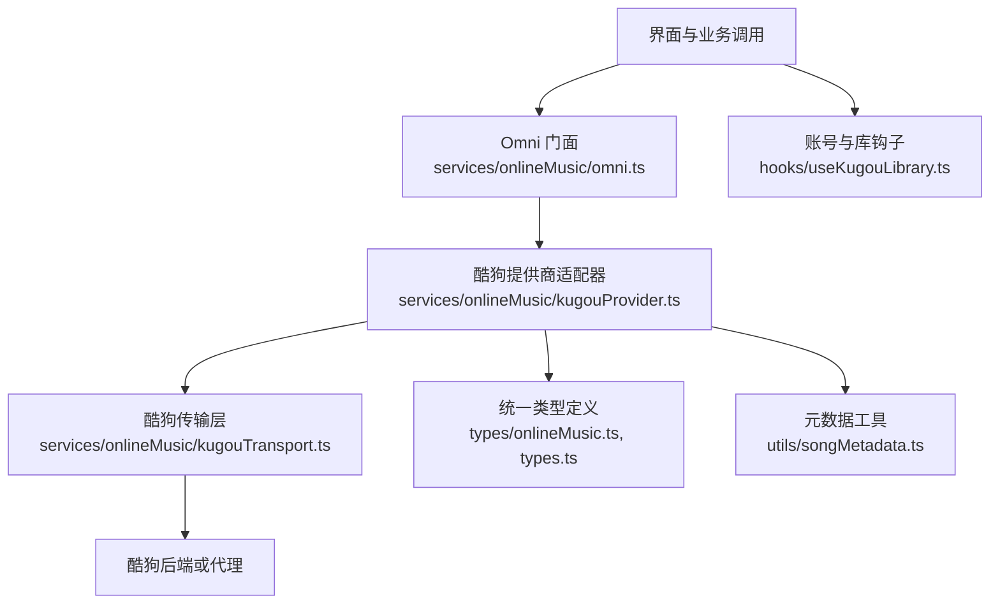
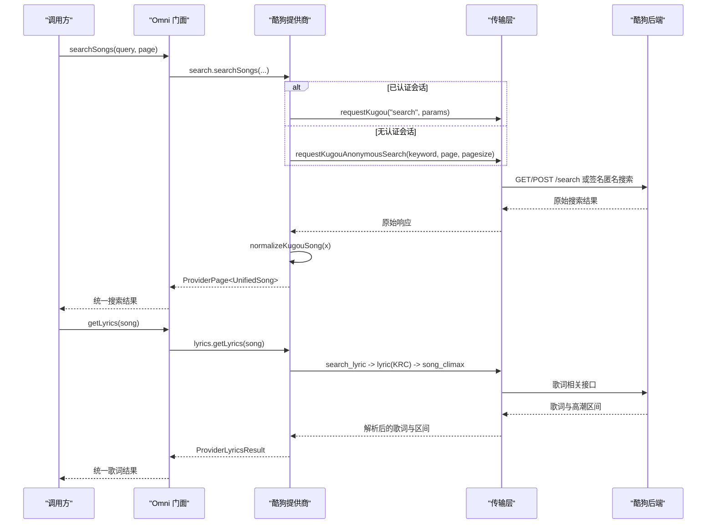
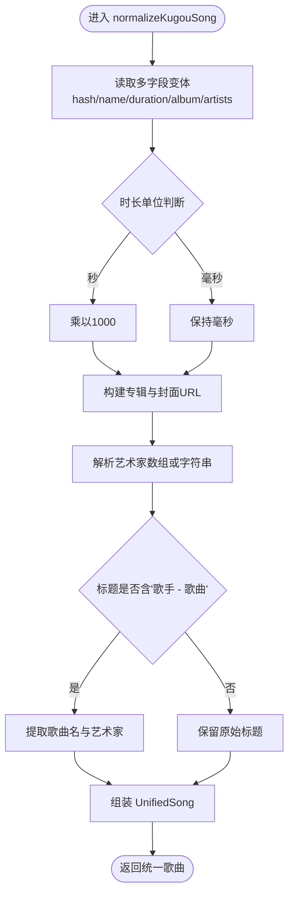
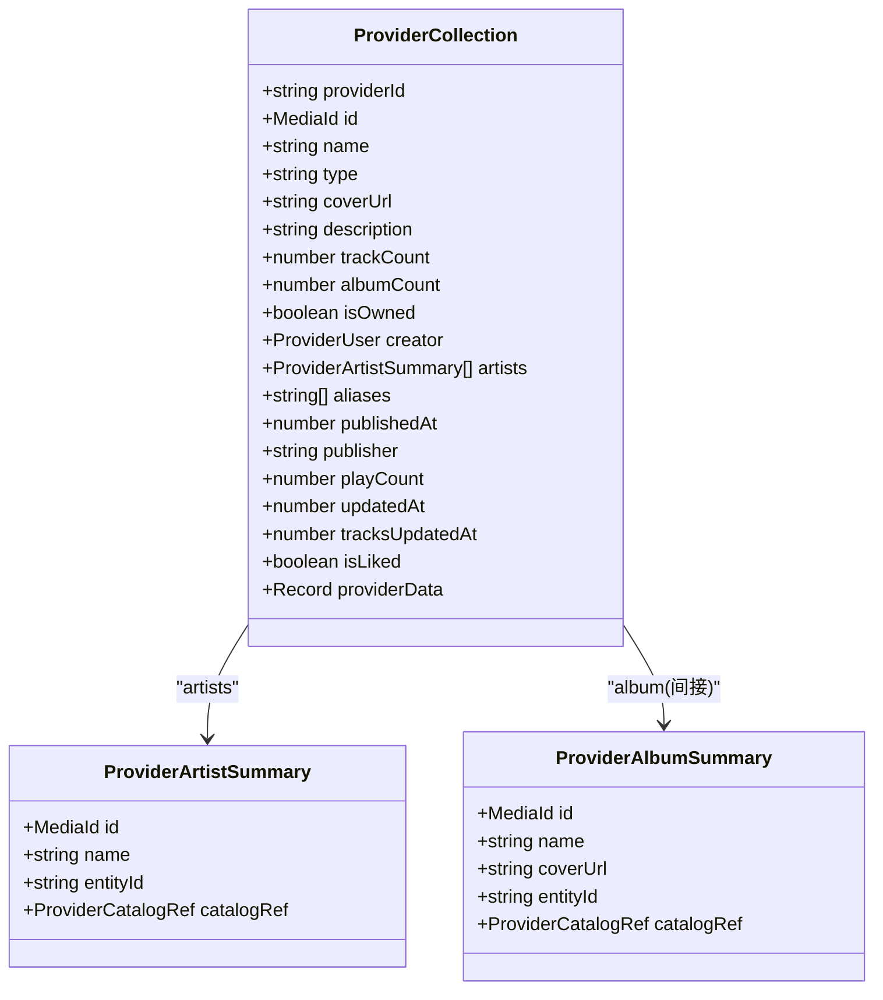
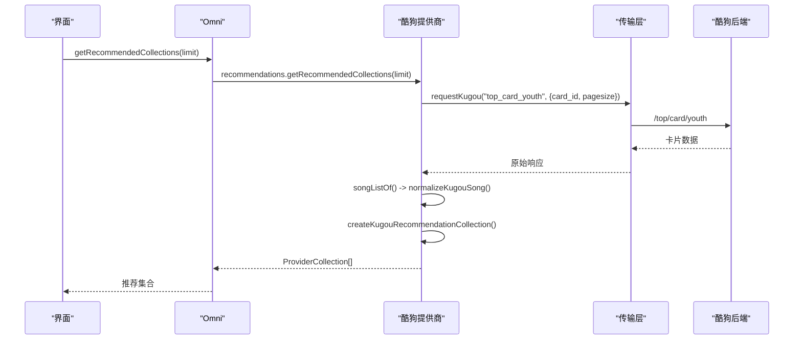
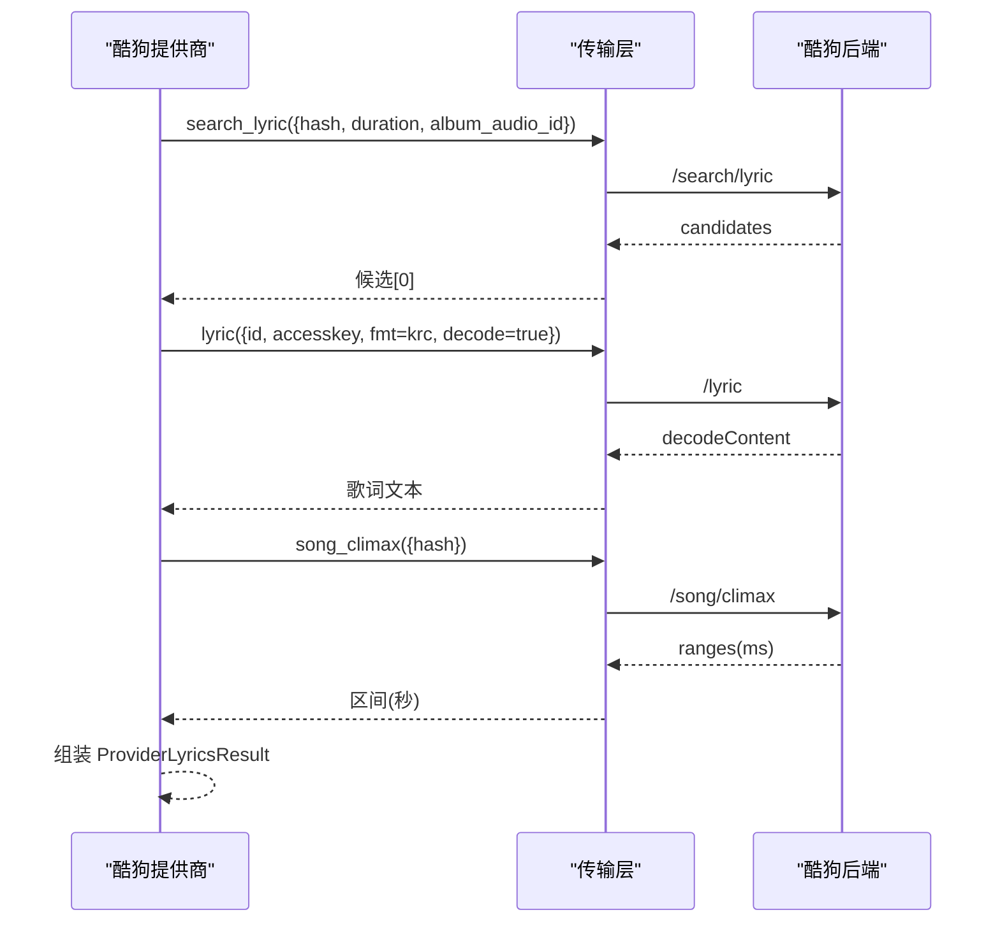
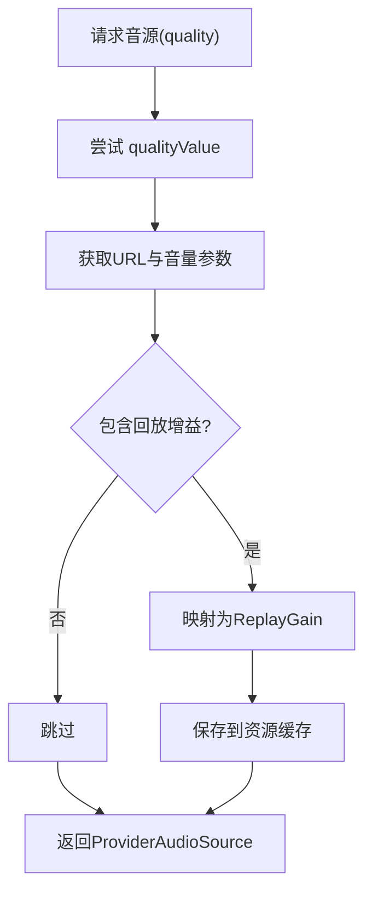
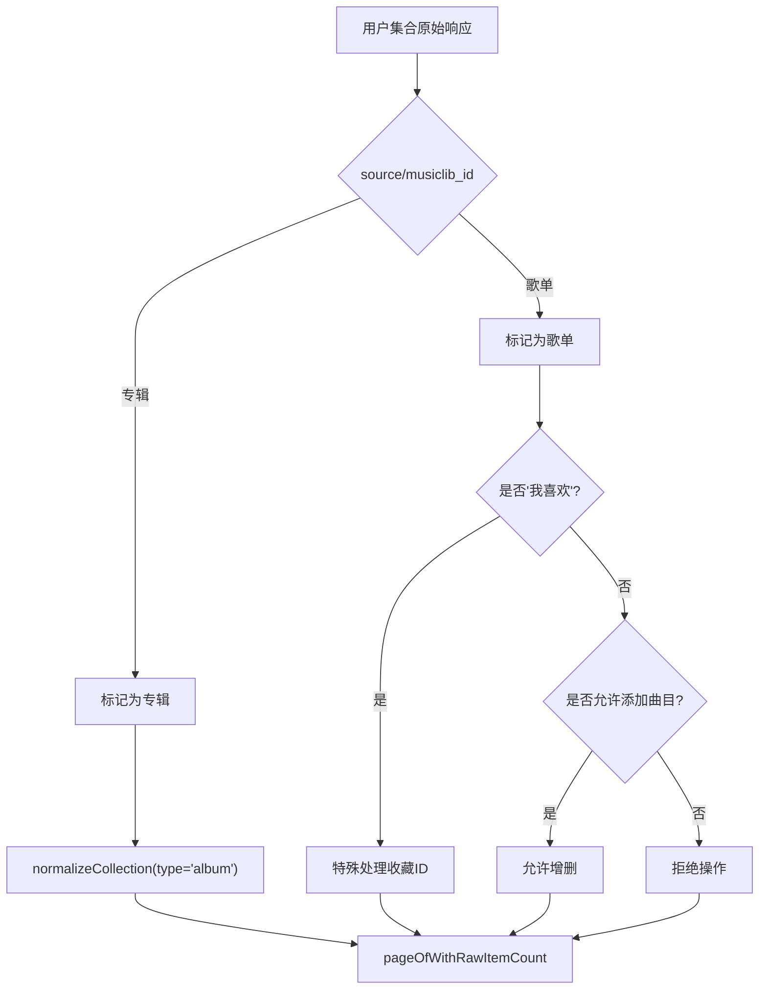
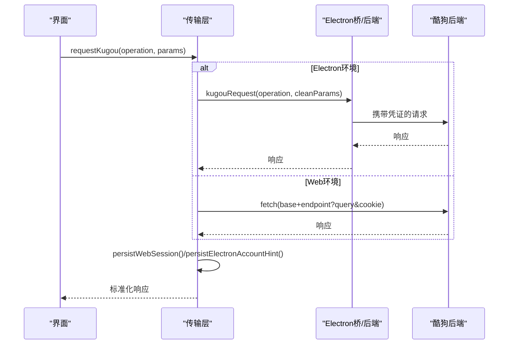
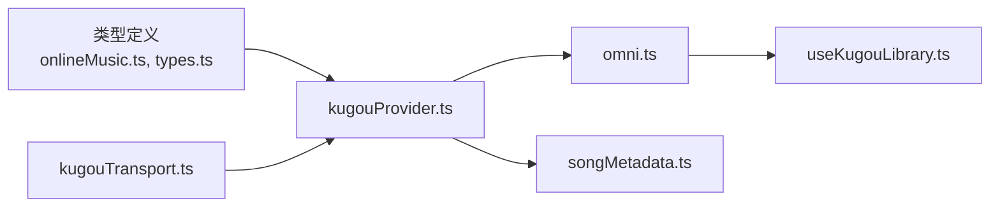

# 数据标准化

<cite>
**本文引用的文件**
- [kugouProvider.ts](file://src/services/onlineMusic/kugouProvider.ts)
- [kugouTransport.ts](file://src/services/onlineMusic/kugouTransport.ts)
- [omni.ts](file://src/services/onlineMusic/omni.ts)
- [onlineMusic.ts](file://src/types/onlineMusic.ts)
- [types.ts](file://src/types.ts)
- [songMetadata.ts](file://src/utils/songMetadata.ts)
- [useKugouLibrary.ts](file://src/hooks/useKugouLibrary.ts)
- [kugou-omni-capability-alignment.md](file://docs/kugou-omni-capability-alignment.md)
- [kugouProvider.test.ts](file://test/unit/onlineMusic/kugouProvider.test.ts)
</cite>

## 目录
1. [简介](#简介)
2. [项目结构](#项目结构)
3. [核心组件](#核心组件)
4. [架构总览](#架构总览)
5. [详细组件分析](#详细组件分析)
6. [依赖关系分析](#依赖关系分析)
7. [性能考虑](#性能考虑)
8. [故障排查指南](#故障排查指南)
9. [结论](#结论)
10. [附录：数据映射规则与复杂场景处理](#附录数据映射规则与复杂场景处理)

## 简介
本文件系统性说明酷狗音乐数据的标准化处理流程，覆盖歌曲、专辑、艺术家等核心实体的格式转换；解释新旧接口、嵌套数据结构、推荐卡片、用户收藏集合等复杂场景的统一抽象；给出完整的数据映射规则与错误恢复机制。整体以“提供商适配器 + 统一传输层 + Omni 门面”的分层设计实现跨平台、跨版本兼容。

## 项目结构
围绕酷狗数据标准化的关键代码分布在以下位置：
- 提供商适配器：负责将酷狗原始响应转换为应用内部统一模型（UnifiedSong、ProviderCollection、ProviderUser 等）
- 传输层：封装网络请求、签名、设备校验、会话持久化、Electron IPC 路由
- Omni 门面：对外暴露统一能力入口，屏蔽提供商差异
- 类型定义：统一模型与能力契约
- 工具与钩子：元数据构建、账号状态管理、库刷新等

**图表来源**
- [omni.ts:74-156](file://src/services/onlineMusic/omni.ts#L74-L156)
- [kugouProvider.ts:222-285](file://src/services/onlineMusic/kugouProvider.ts#L222-L285)
- [kugouTransport.ts:224-266](file://src/services/onlineMusic/kugouTransport.ts#L224-L266)
- [onlineMusic.ts:297-316](file://src/types/onlineMusic.ts#L297-L316)
- [songMetadata.ts:12-31](file://src/utils/songMetadata.ts#L12-L31)
- [useKugouLibrary.ts:40-86](file://src/hooks/useKugouLibrary.ts#L40-L86)

**章节来源**
- [kugouProvider.ts:1-120](file://src/services/onlineMusic/kugouProvider.ts#L1-L120)
- [kugouTransport.ts:1-68](file://src/services/onlineMusic/kugouTransport.ts#L1-L68)
- [omni.ts:1-73](file://src/services/onlineMusic/omni.ts#L1-L73)
- [onlineMusic.ts:1-51](file://src/types/onlineMusic.ts#L1-L51)
- [songMetadata.ts:1-31](file://src/utils/songMetadata.ts#L1-L31)
- [useKugouLibrary.ts:31-86](file://src/hooks/useKugouLibrary.ts#L31-L86)

## 核心组件
- 统一模型与能力契约
  - UnifiedSong、ProviderCollection、ProviderUser、ProviderPage、ChorusRange 等类型定义了跨提供商一致的数据结构
  - OnlineMusicProvider 接口声明搜索、播放、歌词、认证、库、目录、推荐、变更等能力
- 酷狗提供商适配器
  - normalizeKugouSong：将多种字段变体（如 FileHash/SongName/Duration、audio_info/audioInfo/base 等）归一为 UnifiedSong
  - normalizeArtists / normalizeCollection / normalizeUser：统一艺术家、合集、用户信息
  - 推荐卡片虚拟列表：top_card_youth 返回的卡片被包装为 ProviderCollection，trackCount 来自缓存歌曲数
  - 歌词与副歌区间：search_lyric + lyric(KRC) + song_climax 组合获取词与高潮段
  - 音源与回放增益：song_url/user_cloud_url 返回 URL 与 volume/volume_peak 等映射为 ReplayGain
- 传输层
  - requestKugou：在 Electron IPC 与 Web 后端之间路由，自动附加 cookie/timestamp，处理设备验证失败重试
  - requestKugouAnonymousSearch：无登录态时通过签名匿名搜索
  - 会话持久化：token、userid、dfid、cookie 的读写与迁移清理
- Omni 门面
  - 统一入口：searchSongs、getAudioSource、getLyrics、getRecommendationHistory、updateCollectionTracks 等
  - 能力探测与空页回退：当某提供商未实现某能力时返回空结果或抛出明确错误
- 元数据工具
  - createProviderSongMetadata：从 UnifiedSong 构建 provider-neutral 的元数据对象，供匹配、指纹、展示使用

**章节来源**
- [onlineMusic.ts:5-51](file://src/types/onlineMusic.ts#L5-L51)
- [onlineMusic.ts:72-172](file://src/types/onlineMusic.ts#L72-L172)
- [onlineMusic.ts:297-316](file://src/types/onlineMusic.ts#L297-L316)
- [kugouProvider.ts:163-285](file://src/services/onlineMusic/kugouProvider.ts#L163-L285)
- [kugouProvider.ts:287-362](file://src/services/onlineMusic/kugouProvider.ts#L287-L362)
- [kugouProvider.ts:676-757](file://src/services/onlineMusic/kugouProvider.ts#L676-L757)
- [kugouTransport.ts:106-173](file://src/services/onlineMusic/kugouTransport.ts#L106-L173)
- [kugouTransport.ts:187-266](file://src/services/onlineMusic/kugouTransport.ts#L187-L266)
- [omni.ts:151-162](file://src/services/onlineMusic/omni.ts#L151-L162)
- [omni.ts:409-428](file://src/services/onlineMusic/omni.ts#L409-L428)
- [songMetadata.ts:12-31](file://src/utils/songMetadata.ts#L12-L31)

## 架构总览
下图展示了从调用方到最终数据标准化的端到端流程，包括搜索、推荐、歌词、音源与元数据构建的关键路径。

**图表来源**
- [omni.ts:151-162](file://src/services/onlineMusic/omni.ts#L151-L162)
- [omni.ts:419-428](file://src/services/onlineMusic/omni.ts#L419-L428)
- [kugouProvider.ts:645-657](file://src/services/onlineMusic/kugouProvider.ts#L645-L657)
- [kugouProvider.ts:708-757](file://src/services/onlineMusic/kugouProvider.ts#L708-L757)
- [kugouTransport.ts:106-173](file://src/services/onlineMusic/kugouTransport.ts#L106-L173)
- [kugouTransport.ts:224-266](file://src/services/onlineMusic/kugouTransport.ts#L224-L266)

## 详细组件分析

### 歌曲数据标准化（normalizeKugouSong）
- 多字段兼容：支持 FileHash/hash/audio_hash/kgHash、SongName/songname/audio_name、Duration/timelen/timeLength 等
- 时长单位归一：秒与毫秒智能识别，小于阈值按秒处理
- 专辑与封面：album_info/albumInfo/album 多层嵌套，封面模板 {size} 替换为固定尺寸并转为 HTTPS
- 艺术家：Singers/singerinfo/authors/artists 数组或字符串拆分，生成统一艺术家列表并附带 catalogRef
- 唯一标识：以 hash 作为 id，providerData 保留 mixSongId、albumAudioId、catalogLookupId、albumId、fileId 等
- 标题清洗：当仅存在 “歌手 - 歌曲” 形式时，尝试分离出歌曲名与艺术家列表

**图表来源**
- [kugouProvider.ts:222-285](file://src/services/onlineMusic/kugouProvider.ts#L222-L285)
- [kugouProvider.ts:163-220](file://src/services/onlineMusic/kugouProvider.ts#L163-L220)
- [kugouProvider.ts:88-103](file://src/services/onlineMusic/kugouProvider.ts#L88-L103)

**章节来源**
- [kugouProvider.ts:222-285](file://src/services/onlineMusic/kugouProvider.ts#L222-L285)
- [kugouProvider.test.ts:95-140](file://test/unit/onlineMusic/kugouProvider.test.ts#L95-L140)

### 专辑与艺术家信息标准化
- 专辑：从 album_info/albumInfo/album/base 中抽取 album_id/albumName/name，生成 catalogRef
- 艺术家：优先使用结构化数组（author_id/authorName），否则按分隔符拆分字符串，生成临时 id
- 时间戳：publish_time/release_date/year/update_time 等统一解析为 UTC 时间
- 合集元数据：name/description/trackCount/playCount/publisher/updatedAt/tracksUpdatedAt/isLiked 等

**图表来源**
- [onlineMusic.ts:114-172](file://src/types/onlineMusic.ts#L114-L172)
- [kugouProvider.ts:542-592](file://src/services/onlineMusic/kugouProvider.ts#L542-L592)

**章节来源**
- [kugouProvider.ts:542-592](file://src/services/onlineMusic/kugouProvider.ts#L542-L592)
- [onlineMusic.ts:114-172](file://src/types/onlineMusic.ts#L114-L172)

### 推荐列表与虚拟歌单
- top_card_youth：根据 card_id 加载推荐卡片，内部缓存歌曲列表，包装为 ProviderCollection，标记 virtualRecommendation=true
- 分页：基于缓存歌曲进行切片，提供 hasMore/nextOffset
- 名称与描述：从 response 的 card_name/module_name/title 等字段提取

**图表来源**
- [kugouProvider.ts:287-362](file://src/services/onlineMusic/kugouProvider.ts#L287-L362)
- [kugouTransport.ts:224-266](file://src/services/onlineMusic/kugouTransport.ts#L224-L266)
- [omni.ts:365-378](file://src/services/onlineMusic/omni.ts#L365-L378)

**章节来源**
- [kugouProvider.ts:287-362](file://src/services/onlineMusic/kugouProvider.ts#L287-L362)

### 歌词与副歌区间
- 歌词：search_lyric 获取候选，lyric(fmt=krc, decode=true) 获取服务器解码内容，解析为结构化歌词
- 纯音乐检测：isPureMusicLyricText 判断是否为纯音乐文本
- 副歌区间：song_climax 返回毫秒级 start_time/end_time，统一转换为秒

**图表来源**
- [kugouProvider.ts:708-757](file://src/services/onlineMusic/kugouProvider.ts#L708-L757)
- [kugouProvider.ts:676-706](file://src/services/onlineMusic/kugouProvider.ts#L676-L706)
- [kugouTransport.ts:224-266](file://src/services/onlineMusic/kugouTransport.ts#L224-L266)

**章节来源**
- [kugouProvider.ts:708-757](file://src/services/onlineMusic/kugouProvider.ts#L708-L757)
- [kugouProvider.test.ts:142-200](file://test/unit/onlineMusic/kugouProvider.test.ts#L142-L200)

### 音源与回放增益
- 质量降级策略：standard/high/lossless/hires 对应不同 qualityValue，按 fallbacks 顺序尝试
- 云盘与在线：song_url 与 user_cloud_url 分别处理，providerData.variant 区分
- 回放增益：volume/volume_peak 转换为 trackGain/trackPeak，保存至资源缓存

**图表来源**
- [kugouProvider.ts:659-670](file://src/services/onlineMusic/kugouProvider.ts#L659-L670)
- [omni.ts:409-417](file://src/services/onlineMusic/omni.ts#L409-L417)

**章节来源**
- [kugouProvider.ts:967-985](file://src/services/onlineMusic/kugouProvider.ts#L967-L985)
- [kugouProvider.test.ts:404-441](file://test/unit/onlineMusic/kugouProvider.test.ts#L404-L441)

### 用户收藏集合与混合结果
- 混合类型识别：source=2 或存在 musiclib_id 视为专辑，否则为歌单
- “我喜欢”识别：名称匹配或 listid=2，用于收藏歌曲 ID 推导
- 可添加性限制：排除内置“我喜欢”与特定 listId，避免不可变集合
- 分页计数：使用 rawItemCount 推进分页，而非过滤后数量

**图表来源**
- [kugouProvider.ts:596-637](file://src/services/onlineMusic/kugouProvider.ts#L596-L637)
- [kugouProvider.ts:776-800](file://src/services/onlineMusic/kugouProvider.ts#L776-L800)

**章节来源**
- [kugouProvider.ts:596-637](file://src/services/onlineMusic/kugouProvider.ts#L596-L637)
- [kugouProvider.ts:776-800](file://src/services/onlineMusic/kugouProvider.ts#L776-L800)

### 认证与会话管理
- Electron IPC：优先使用 window.electron.kugouRequest，剥离敏感参数（token/dfid/cookie）
- Web 后端：通过 VITE_KUGOU_API_BASE 配置，自动附加 cookie 与 timestamp
- 设备验证：errcode=20028 或消息包含验证提示时，清除 dfid 并重新 register_dev
- 账号快照：登录后更新 userid、token、dfid，退出时清理

**图表来源**
- [kugouTransport.ts:216-266](file://src/services/onlineMusic/kugouTransport.ts#L216-L266)
- [kugouTransport.ts:70-92](file://src/services/onlineMusic/kugouTransport.ts#L70-L92)
- [kugouTransport.ts:175-199](file://src/services/onlineMusic/kugouTransport.ts#L175-L199)

**章节来源**
- [kugouTransport.ts:216-266](file://src/services/onlineMusic/kugouTransport.ts#L216-L266)
- [useKugouLibrary.ts:40-86](file://src/hooks/useKugouLibrary.ts#L40-L86)

## 依赖关系分析
- 类型依赖：所有标准化输出均遵循 onlineMusic.ts 中的 Provider* 类型与 types.ts 中的 SongResult/LyricData 等
- 模块耦合：
  - kugouProvider 依赖 kugouTransport 进行网络访问
  - omni 聚合各提供商能力，调用 kugouProvider 的具体实现
  - useKugouLibrary 通过 omni 管理账号状态与库刷新
- 外部依赖：
  - blueimp-md5：匿名搜索签名
  - 环境变量：VITE_KUGOU_API_BASE
  - Electron IPC：window.electron.kugouRequest

**图表来源**
- [onlineMusic.ts:297-316](file://src/types/onlineMusic.ts#L297-L316)
- [kugouProvider.ts:1-31](file://src/services/onlineMusic/kugouProvider.ts#L1-L31)
- [kugouTransport.ts:1-19](file://src/services/onlineMusic/kugouTransport.ts#L1-L19)
- [omni.ts:1-35](file://src/services/onlineMusic/omni.ts#L1-L35)
- [useKugouLibrary.ts:31-86](file://src/hooks/useKugouLibrary.ts#L31-L86)
- [songMetadata.ts:1-31](file://src/utils/songMetadata.ts#L1-L31)

**章节来源**
- [kugouProvider.ts:1-31](file://src/services/onlineMusic/kugouProvider.ts#L1-L31)
- [kugouTransport.ts:1-19](file://src/services/onlineMusic/kugouTransport.ts#L1-L19)
- [omni.ts:1-35](file://src/services/onlineMusic/omni.ts#L1-L35)
- [useKugouLibrary.ts:31-86](file://src/hooks/useKugouLibrary.ts#L31-L86)
- [songMetadata.ts:1-31](file://src/utils/songMetadata.ts#L1-L31)

## 性能考虑
- 推荐卡片缓存：kugouRecommendationTrackCache 避免重复拉取同一卡片的歌曲
- 目录元数据请求去重：kugouCatalogMetadataRequests 防止并发重复请求
- 副歌区间缓存：kugouChorusRangesCache 减少重复网络请求
- 分页优化：pageOfWithRawItemCount 使用原始计数推进，避免过滤导致的错位
- 音质降级：按 fallbacks 顺序尝试，提高成功率

[本节为通用指导，不直接分析具体文件]

## 故障排查指南
- 网络错误：OnlineProviderError 携带 code/message/providerId，便于定位
- 设备验证失败：errcode=20028 或消息包含“需要验证”，自动清理 dfid 并重新注册设备
- VIP 权益异常：youth_union_vip/youth_day_vip 失败时记录 warn 并降级
- 歌词解析失败：decodeContent 为空或非预期格式时返回空歌词，isPureMusic 标记
- 音源不可用：quality 降级后仍失败，记录 attemptedQualities 并返回 null

**章节来源**
- [kugouTransport.ts:156-173](file://src/services/onlineMusic/kugouTransport.ts#L156-L173)
- [kugouTransport.ts:259-266](file://src/services/onlineMusic/kugouTransport.ts#L259-L266)
- [kugouProvider.ts:491-540](file://src/services/onlineMusic/kugouProvider.ts#L491-L540)
- [kugouProvider.ts:726-757](file://src/services/onlineMusic/kugouProvider.ts#L726-L757)
- [kugouProvider.ts:967-985](file://src/services/onlineMusic/kugouProvider.ts#L967-L985)

## 结论
通过“提供商适配器 + 传输层 + Omni 门面”的分层设计，酷狗音乐数据在新旧接口、嵌套结构、推荐卡片、用户收藏等复杂场景下实现了统一的内部模型。标准化流程涵盖歌曲、专辑、艺术家、歌词、音源与回放增益，具备完善的错误恢复与性能优化机制。文档同时明确了能力对齐现状与未实现项，为后续扩展提供清晰指引。

[本节为总结，不直接分析具体文件]

## 附录：数据映射规则与复杂场景处理

### 歌曲字段映射要点
- 标识：FileHash/hash/audio_hash/kgHash -> UnifiedSong.id (大写)
- 标题：SongName/songname/audio_name/ori_audio_name -> UnifiedSong.name
- 时长：Duration/timelen/timeLength -> 秒/毫秒识别 -> durationMs
- 专辑：album_info/albumInfo/album/base -> album.id/name/coverUrl/catalogRef
- 艺术家：Singers/singerinfo/authors/artists -> artists[]，字符串按分隔符拆分
- 提供者数据：mixSongId/albumAudioId/catalogLookupId/albumId/fileId -> providerData

**章节来源**
- [kugouProvider.ts:222-285](file://src/services/onlineMusic/kugouProvider.ts#L222-L285)
- [kugouProvider.test.ts:95-140](file://test/unit/onlineMusic/kugouProvider.test.ts#L95-L140)

### 复杂场景处理
- 混合搜索结果：normalizeKugouSearchSongs 去重并保持排序
- 虚拟推荐列表：createKugouRecommendationCollection 包装为 ProviderCollection，virtualRecommendation=true
- 用户收藏集合：getKugouUserCollectionType 区分专辑/歌单，isKugouLikedPlaylist 识别“我喜欢”
- 目录引用解析：resolveKugouSongCatalogRefs 通过 krm_audio 补充 album/artist/canonical ids

**章节来源**
- [kugouProvider.ts:645-657](file://src/services/onlineMusic/kugouProvider.ts#L645-L657)
- [kugouProvider.ts:320-362](file://src/services/onlineMusic/kugouProvider.ts#L320-L362)
- [kugouProvider.ts:596-637](file://src/services/onlineMusic/kugouProvider.ts#L596-L637)
- [kugouProvider.ts:411-445](file://src/services/onlineMusic/kugouProvider.ts#L411-L445)

### 能力对齐与限制
- 已对齐：搜索、认证、用户歌单、专辑/歌手详情、每日推荐、私人 FM、推荐歌单、历史推荐、歌单增删、订阅状态推导
- 未完整实现：歌曲可用性与版权替代、歌曲页面 URL

**章节来源**
- [kugou-omni-capability-alignment.md:13-51](file://docs/kugou-omni-capability-alignment.md#L13-L51)