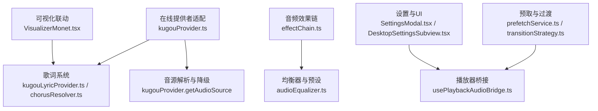
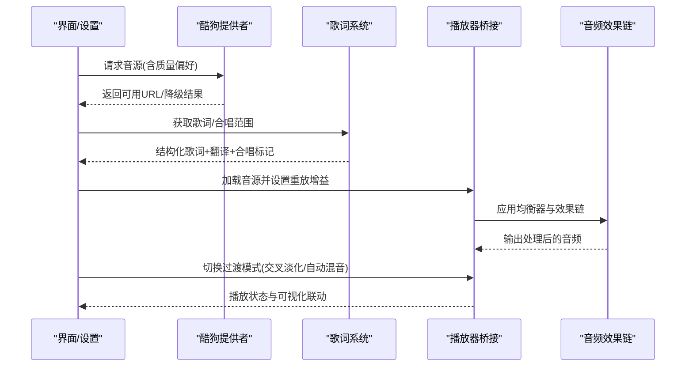
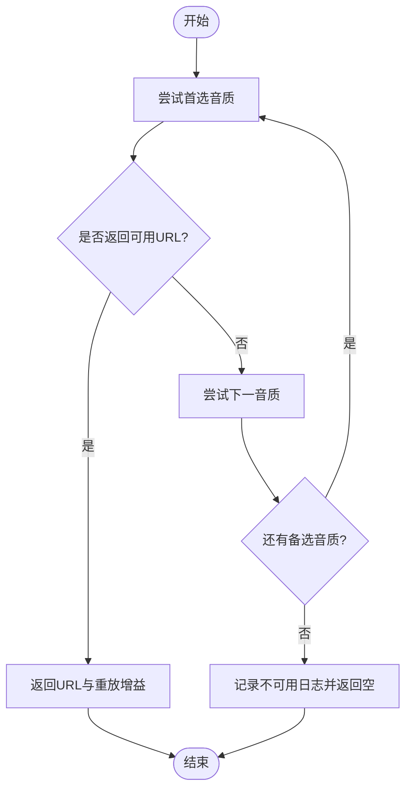
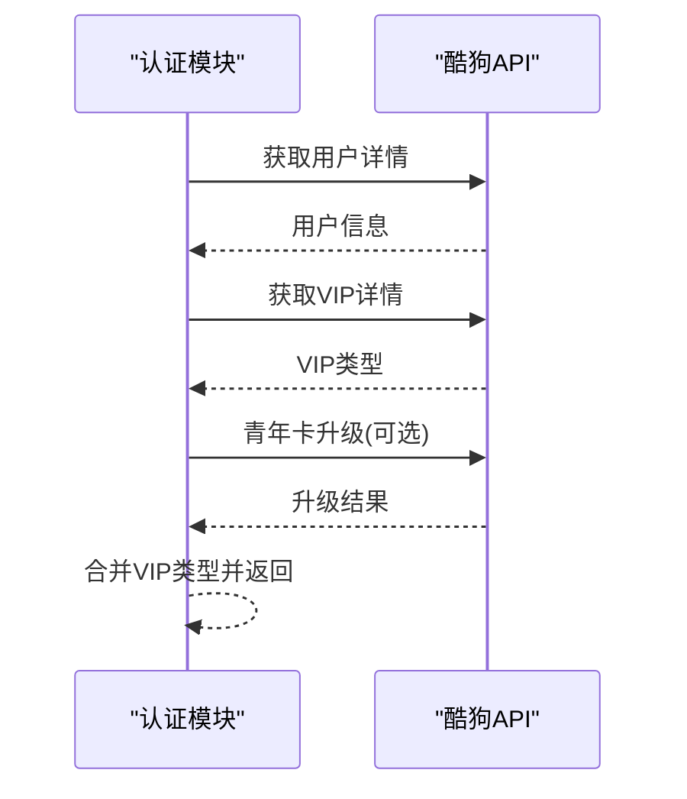
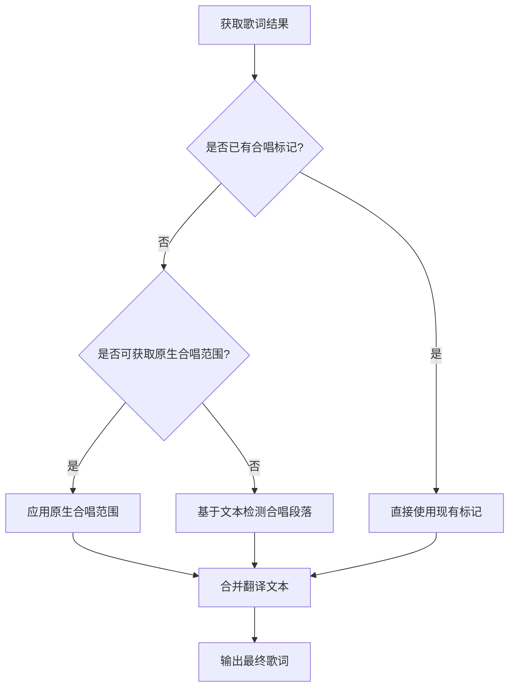
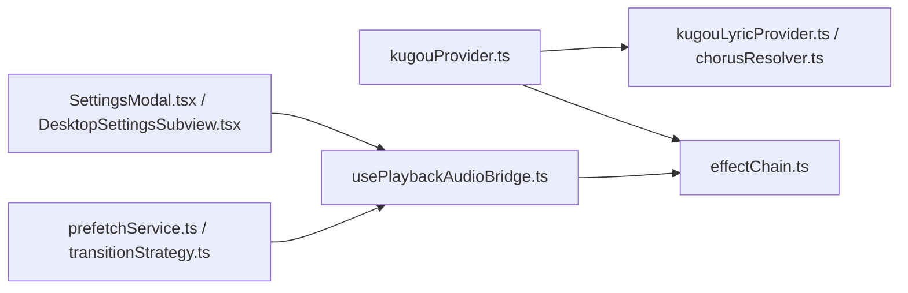

# 特色功能

<cite>
**本文引用的文件**
- [kugouProvider.ts](file://src/services/onlineMusic/kugouProvider.ts)
- [kugouTransport.ts](file://src/services/onlineMusic/kugouTransport.ts)
- [kugouLyricProvider.ts](file://src/utils/lyrics/providers/kugouLyricProvider.ts)
- [chorusResolver.ts](file://src/utils/lyrics/chorusResolver.ts)
- [autoMatchBestLyric.ts](file://src/utils/lyrics/autoMatchBestLyric.ts)
- [effectChain.ts](file://src/services/audioEffects/effectChain.ts)
- [audioEqualizer.ts](file://src/utils/audioEqualizer.ts)
- [usePlaybackAudioBridge.ts](file://src/hooks/usePlaybackAudioBridge.ts)
- [prefetchService.ts](file://src/services/prefetchService.ts)
- [transitionStrategy.ts](file://src/services/automix/transitionStrategy.ts)
- [kugou-omni-capability-alignment.md](file://docs/kugou-omni-capability-alignment.md)
- [SettingsModal.tsx](file://src/components/modal/SettingsModal.tsx)
- [DesktopSettingsSubview.tsx](file://src/components/modal/settings/DesktopSettingsSubview.tsx)
- [VisualizerMonet.tsx](file://src/components/visualizer/monet/VisualizerMonet.tsx)
- [NavidromeLyricAdapter.ts](file://src/utils/lyrics/adapters/NavidromeLyricAdapter.ts)
- [metadataParser.worker.ts](file://src/workers/metadataParser.worker.ts)
- [localMusicService.ts](file://src/services/localMusicService.ts)
- [qqProvider.ts](file://src/services/onlineMusic/qqProvider.ts)
</cite>

## 目录
1. [简介](#简介)
2. [项目结构](#项目结构)
3. [核心组件](#核心组件)
4. [架构总览](#架构总览)
5. [详细组件分析](#详细组件分析)
6. [依赖关系分析](#依赖关系分析)
7. [性能考量](#性能考量)
8. [故障排查指南](#故障排查指南)
9. [结论](#结论)
10. [附录：功能开关与配置选项](#附录：功能开关与配置选项)

## 简介
本章节聚焦酷狗音乐在该项目中的独特能力集成，包括歌词翻译、高音质播放、车载模式（桌面端特性）、VIP专属内容处理、合唱片段识别、歌曲推荐与个性化服务、以及音效增强等扩展能力的接入方式。文档同时提供功能开关与配置项的使用说明，帮助开发者与用户快速定位并启用相关能力。

## 项目结构
围绕酷狗能力，代码主要分布在以下区域：
- 在线音乐提供者适配层：负责搜索、登录、歌单、音源解析、歌词获取与合唱范围解析
- 歌词系统：多格式解析、自动匹配、合唱标记、翻译文本融合
- 音频效果链与均衡器：后级音效、动态压缩、混响、噪声、立体声宽度等
- 预取与过渡策略：自动混音、跨曲过渡、节拍网格预取
- 设置与UI：更新检查、主题、字幕显示、可视化联动

图表来源
- [kugouProvider.ts:900-985](file://src/services/onlineMusic/kugouProvider.ts#L900-L985)
- [kugouLyricProvider.ts:1-34](file://src/utils/lyrics/providers/kugouLyricProvider.ts#L1-L34)
- [chorusResolver.ts:1-66](file://src/utils/lyrics/chorusResolver.ts#L1-L66)
- [effectChain.ts:1-94](file://src/services/audioEffects/effectChain.ts#L1-L94)
- [audioEqualizer.ts:1-227](file://src/utils/audioEqualizer.ts#L1-L227)
- [prefetchService.ts:58-91](file://src/services/prefetchService.ts#L58-L91)
- [transitionStrategy.ts:1-26](file://src/services/automix/transitionStrategy.ts#L1-L26)
- [usePlaybackAudioBridge.ts:195-235](file://src/hooks/usePlaybackAudioBridge.ts#L195-L235)
- [SettingsModal.tsx:565-600](file://src/components/modal/SettingsModal.tsx#L565-L600)
- [DesktopSettingsSubview.tsx:310-328](file://src/components/modal/settings/DesktopSettingsSubview.tsx#L310-L328)
- [VisualizerMonet.tsx:254-275](file://src/components/visualizer/monet/VisualizerMonet.tsx#L254-L275)

章节来源
- [kugouProvider.ts:1-200](file://src/services/onlineMusic/kugouProvider.ts#L1-L200)
- [kugouLyricProvider.ts:1-34](file://src/utils/lyrics/providers/kugouLyricProvider.ts#L1-L34)
- [chorusResolver.ts:1-66](file://src/utils/lyrics/chorusResolver.ts#L1-L66)
- [effectChain.ts:1-94](file://src/services/audioEffects/effectChain.ts#L1-L94)
- [audioEqualizer.ts:1-227](file://src/utils/audioEqualizer.ts#L1-L227)
- [prefetchService.ts:58-91](file://src/services/prefetchService.ts#L58-L91)
- [transitionStrategy.ts:1-26](file://src/services/automix/transitionStrategy.ts#L1-L26)
- [usePlaybackAudioBridge.ts:195-235](file://src/hooks/usePlaybackAudioBridge.ts#L195-L235)
- [SettingsModal.tsx:565-600](file://src/components/modal/SettingsModal.tsx#L565-L600)
- [DesktopSettingsSubview.tsx:310-328](file://src/components/modal/settings/DesktopSettingsSubview.tsx#L310-L328)
- [VisualizerMonet.tsx:254-275](file://src/components/visualizer/monet/VisualizerMonet.tsx#L254-L275)

## 核心组件
- 酷狗提供者适配：统一封装搜索、登录、歌单、专辑、歌手、每日推荐、私人FM、云盘曲目、音源获取与歌词获取；支持质量回退、URL规范化、封面尺寸标准化、元数据归一化
- 歌词系统：KRC解密、多格式检测、逐词/时间轴歌词解析、合唱范围应用、翻译文本融合、自动最佳匹配
- 音频效果链：后置EQ之后的饱和、比特压缩、颤音、噪声、立体声宽度、动态压缩与混响，参数平滑过渡
- 均衡器与预设：十段均衡、内置/自定义槽位、效果参数归一化与持久化
- 预取与过渡：根据过渡模式决定是否预取节拍网格，自动混音或固定时长交叉淡化
- 设置与UI：更新检查开关、通道选择、字幕内容模式、可视化联动

章节来源
- [kugouProvider.ts:900-985](file://src/services/onlineMusic/kugouProvider.ts#L900-L985)
- [kugouLyricProvider.ts:1-34](file://src/utils/lyrics/providers/kugouLyricProvider.ts#L1-L34)
- [chorusResolver.ts:1-66](file://src/utils/lyrics/chorusResolver.ts#L1-L66)
- [effectChain.ts:1-94](file://src/services/audioEffects/effectChain.ts#L1-L94)
- [audioEqualizer.ts:1-227](file://src/utils/audioEqualizer.ts#L1-L227)
- [prefetchService.ts:58-91](file://src/services/prefetchService.ts#L58-L91)
- [transitionStrategy.ts:1-26](file://src/services/automix/transitionStrategy.ts#L1-L26)

## 架构总览
下图展示从“在线提供者”到“歌词系统”再到“播放器与效果链”的端到端流程，以及设置对行为的影响。

图表来源
- [kugouProvider.ts:900-985](file://src/services/onlineMusic/kugouProvider.ts#L900-L985)
- [kugouLyricProvider.ts:1-34](file://src/utils/lyrics/providers/kugouLyricProvider.ts#L1-L34)
- [chorusResolver.ts:1-66](file://src/utils/lyrics/chorusResolver.ts#L1-L66)
- [usePlaybackAudioBridge.ts:195-235](file://src/hooks/usePlaybackAudioBridge.ts#L195-L235)
- [effectChain.ts:1-94](file://src/services/audioEffects/effectChain.ts#L1-L94)
- [transitionStrategy.ts:1-26](file://src/services/automix/transitionStrategy.ts#L1-L26)

## 详细组件分析

### 高音质播放与权限降级
- 质量回退策略：按偏好顺序尝试不同质量（如无损→FLAC→320），失败则继续降级直至可播放
- 请求变体：优先使用包含专辑ID与专辑音频ID的请求；若失败则仅用hash重试，提高成功率
- URL规范化：处理逗号分隔的多候选URL，提取有效http(s)地址
- 重放增益：从响应中提取音量与峰值信息，用于后续一致性响度控制
- VIP与权限：当接口返回权限错误时，记录错误码并降级；未满足条件时不抛出阻断性异常，保证体验连续性

图表来源
- [kugouProvider.ts:900-985](file://src/services/onlineMusic/kugouProvider.ts#L900-L985)

章节来源
- [kugouProvider.ts:900-985](file://src/services/onlineMusic/kugouProvider.ts#L900-L985)
- [kugouProvider.test.ts:470-530](file://test/unit/onlineMusic/kugouProvider.test.ts#L470-L530)

### VIP专属内容处理逻辑
- 登录状态与VIP类型：通过用户详情与VIP详情接口获取用户信息与VIP类型；若青年卡升级成功但VIP类型为0，则修正为1以反映权益
- 升级流程：调用青年日VIP升级接口，失败时记录错误但不中断登录流程
- 权限检查与降级：播放阶段遇到权限错误时，记录错误码并降级音质或返回不可用；不向用户抛出阻断性错误

图表来源
- [kugouProvider.ts:991-1034](file://src/services/onlineMusic/kugouProvider.ts#L991-L1034)
- [kugouProvider.ts:517-543](file://src/services/onlineMusic/kugouProvider.ts#L517-L543)

章节来源
- [kugouProvider.ts:991-1034](file://src/services/onlineMusic/kugouProvider.ts#L991-L1034)
- [kugouProvider.ts:517-543](file://src/services/onlineMusic/kugouProvider.ts#L517-L543)
- [kugouProvider.test.ts:342-364](file://test/unit/onlineMusic/kugouProvider.test.ts#L342-L364)

### 歌词翻译与合唱片段识别
- 歌词解析：支持KRC解密、LRC/VTT/TTML/YRC/KRC等多格式检测与解析
- 翻译文本：从多种来源（内嵌、结构化、第三方）提取翻译文本，并在渲染时按需显示
- 合唱范围：优先使用提供商提供的合唱时间范围；若无，则基于文本启发式检测并应用合唱效果
- 自动匹配：结合歌曲元数据与提供商候选，选择最佳歌词结果，必要时触发Whisper对齐

图表来源
- [kugouLyricProvider.ts:1-34](file://src/utils/lyrics/providers/kugouLyricProvider.ts#L1-L34)
- [chorusResolver.ts:1-66](file://src/utils/lyrics/chorusResolver.ts#L1-L66)
- [autoMatchBestLyric.ts:23-61](file://src/utils/lyrics/autoMatchBestLyric.ts#L23-L61)

章节来源
- [kugouLyricProvider.ts:1-34](file://src/utils/lyrics/providers/kugouLyricProvider.ts#L1-L34)
- [chorusResolver.ts:1-66](file://src/utils/lyrics/chorusResolver.ts#L1-L66)
- [autoMatchBestLyric.ts:23-61](file://src/utils/lyrics/autoMatchBestLyric.ts#L23-L61)

### 车载模式与桌面端特性
- 桌面端更新检查：提供开关与通道选择，便于企业环境或特定发布渠道管理
- 窗口与显示：支持透明背景、始终置顶、壁纸模式等桌面端特性，提升车载或大屏场景下的可用性
- 设置面板：集中管理更新检查、语言、字幕内容模式、透明度等选项

章节来源
- [SettingsModal.tsx:565-600](file://src/components/modal/SettingsModal.tsx#L565-L600)
- [DesktopSettingsSubview.tsx:310-328](file://src/components/modal/settings/DesktopSettingsSubview.tsx#L310-L328)

### 歌曲推荐算法与个性化服务
- 每日推荐与私人FM：通过对应接口获取推荐列表与FM曲目，并映射为标准集合
- 历史推荐：支持查询历史日期与歌曲，便于回溯与收藏
- 虚拟歌单：将推荐卡片转换为虚拟歌单，便于统一浏览与管理

章节来源
- [kugou-omni-capability-alignment.md:13-36](file://docs/kugou-omni-capability-alignment.md#L13-L36)

### 与第三方服务的集成方案
- 音效增强：通过后级效果链实现饱和、比特压缩、颤音、噪声、立体声宽度、动态压缩与混响，参数平滑过渡，避免卡顿
- 音频分析：自动混音模式下根据过渡策略预取节拍网格，提升衔接自然度
- 其他平台：QQ音乐提供者同样具备质量回退与播放链接安全化处理，体现一致的降级策略

章节来源
- [effectChain.ts:1-94](file://src/services/audioEffects/effectChain.ts#L1-L94)
- [prefetchService.ts:58-91](file://src/services/prefetchService.ts#L58-L91)
- [transitionStrategy.ts:1-26](file://src/services/automix/transitionStrategy.ts#L1-L26)
- [qqProvider.ts:181-215](file://src/services/onlineMusic/qqProvider.ts#L181-L215)

## 依赖关系分析
- 提供者与歌词系统：提供者负责获取原始歌词与合唱范围，歌词系统进行解析、合并与效果应用
- 播放器与效果链：播放器桥接负责加载音源、设置重放增益，并将音频路由至效果链进行后处理
- 设置与UI：设置项影响更新检查、字幕显示、过渡模式、透明度等，进而改变播放与渲染行为
- 预取与过渡：根据模式决定是否预取节拍网格，影响自动混音的衔接质量

图表来源
- [kugouProvider.ts:900-985](file://src/services/onlineMusic/kugouProvider.ts#L900-L985)
- [kugouLyricProvider.ts:1-34](file://src/utils/lyrics/providers/kugouLyricProvider.ts#L1-L34)
- [chorusResolver.ts:1-66](file://src/utils/lyrics/chorusResolver.ts#L1-L66)
- [effectChain.ts:1-94](file://src/services/audioEffects/effectChain.ts#L1-L94)
- [usePlaybackAudioBridge.ts:195-235](file://src/hooks/usePlaybackAudioBridge.ts#L195-L235)
- [prefetchService.ts:58-91](file://src/services/prefetchService.ts#L58-L91)
- [transitionStrategy.ts:1-26](file://src/services/automix/transitionStrategy.ts#L1-L26)
- [SettingsModal.tsx:565-600](file://src/components/modal/SettingsModal.tsx#L565-L600)
- [DesktopSettingsSubview.tsx:310-328](file://src/components/modal/settings/DesktopSettingsSubview.tsx#L310-L328)

章节来源
- [kugouProvider.ts:900-985](file://src/services/onlineMusic/kugouProvider.ts#L900-L985)
- [effectChain.ts:1-94](file://src/services/audioEffects/effectChain.ts#L1-L94)
- [usePlaybackAudioBridge.ts:195-235](file://src/hooks/usePlaybackAudioBridge.ts#L195-L235)
- [prefetchService.ts:58-91](file://src/services/prefetchService.ts#L58-L91)
- [transitionStrategy.ts:1-26](file://src/services/automix/transitionStrategy.ts#L1-L26)
- [SettingsModal.tsx:565-600](file://src/components/modal/SettingsModal.tsx#L565-L600)
- [DesktopSettingsSubview.tsx:310-328](file://src/components/modal/settings/DesktopSettingsSubview.tsx#L310-L328)

## 性能考量
- 音源降级：按质量优先级尝试，减少无效请求与等待时间
- 歌词解析：多格式检测与Worker解析，避免主线程阻塞
- 效果链参数平滑：使用参数斜坡避免突变导致的听感抖动
- 预取节拍网格：仅在需要时预取，降低不必要的计算开销
- 重放增益：从响应或元数据中获取，确保响度一致，减少用户手动调节

章节来源
- [kugouProvider.ts:900-985](file://src/services/onlineMusic/kugouProvider.ts#L900-L985)
- [effectChain.ts:1-94](file://src/services/audioEffects/effectChain.ts#L1-L94)
- [prefetchService.ts:58-91](file://src/services/prefetchService.ts#L58-L91)
- [metadataParser.worker.ts:207-238](file://src/workers/metadataParser.worker.ts#L207-L238)

## 故障排查指南
- 音源不可用：检查质量回退日志与错误码，确认是否为权限限制或网络问题
- 歌词缺失：确认提供商是否返回合唱范围；若无，查看文本检测是否生效
- 音效异常：检查效果链是否启用，参数是否越界；重置为默认值验证
- 更新检查失败：确认开关与通道设置，检查网络代理与证书配置

章节来源
- [kugouProvider.ts:900-985](file://src/services/onlineMusic/kugouProvider.ts#L900-L985)
- [chorusResolver.ts:1-66](file://src/utils/lyrics/chorusResolver.ts#L1-L66)
- [effectChain.ts:1-94](file://src/services/audioEffects/effectChain.ts#L1-L94)
- [SettingsModal.tsx:565-600](file://src/components/modal/SettingsModal.tsx#L565-L600)

## 结论
本项目在酷狗音乐能力上实现了高质量播放、权限降级、歌词翻译与合唱识别、推荐与个性化、音效增强与自动混音等核心特性。通过清晰的提供者适配、歌词系统与效果链解耦，以及设置驱动的灵活配置，既保证了用户体验的一致性，也为扩展与维护提供了良好基础。

## 附录：功能开关与配置选项
- 更新检查与通道：可在设置中开启/关闭更新检查，并选择发布通道
- 字幕内容模式：支持显示翻译、原文或隐藏，影响可视化歌词轨道
- 过渡模式：交叉淡化或自动混音，影响曲间衔接策略
- 透明度与壁纸模式：桌面端特性，适合车载或大屏场景
- 均衡器与效果：十段均衡、内置/自定义槽位、效果参数归一化与持久化

章节来源
- [SettingsModal.tsx:565-600](file://src/components/modal/SettingsModal.tsx#L565-L600)
- [DesktopSettingsSubview.tsx:310-328](file://src/components/modal/settings/DesktopSettingsSubview.tsx#L310-L328)
- [VisualizerMonet.tsx:254-275](file://src/components/visualizer/monet/VisualizerMonet.tsx#L254-L275)
- [audioEqualizer.ts:1-227](file://src/utils/audioEqualizer.ts#L1-L227)
- [transitionStrategy.ts:1-26](file://src/services/automix/transitionStrategy.ts#L1-L26)