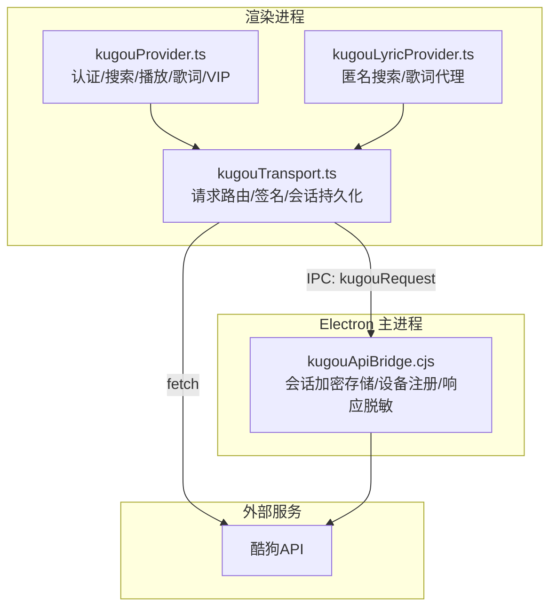
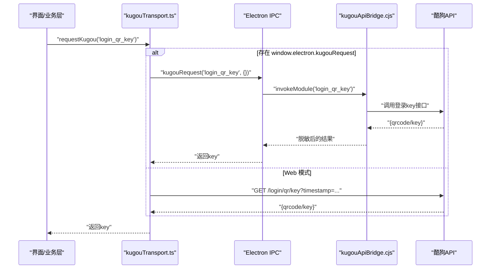
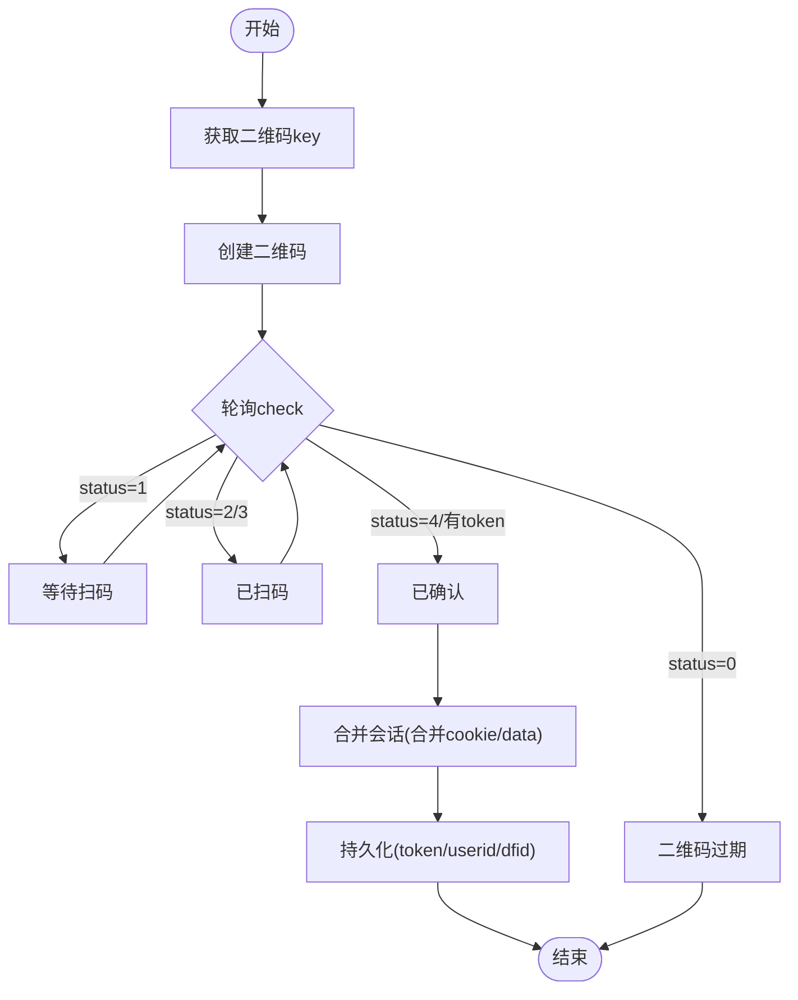
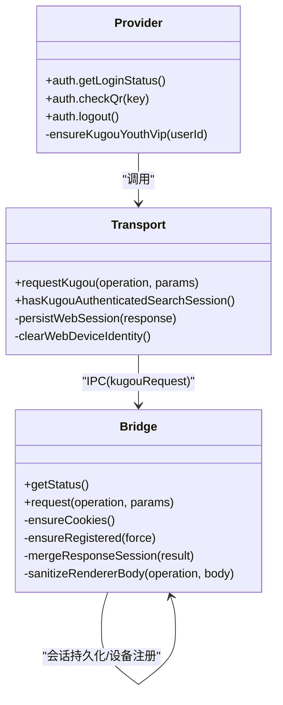
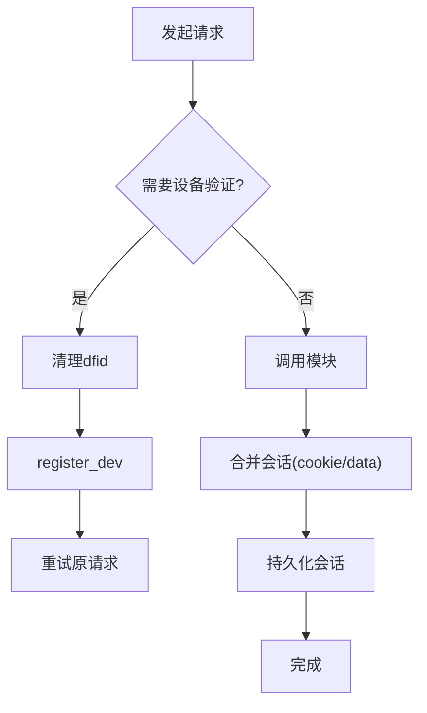
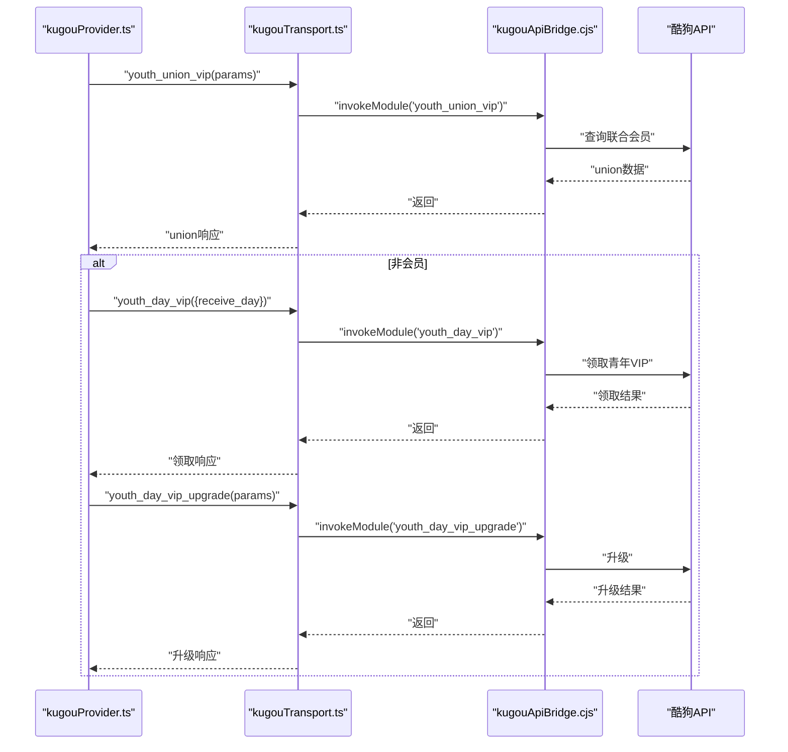
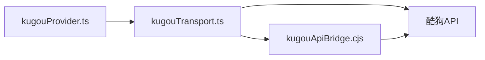

# 用户认证

<cite>
**本文引用的文件**
- [electron/kugouApiBridge.cjs](file://electron/kugouApiBridge.cjs)
- [src/services/onlineMusic/kugouTransport.ts](file://src/services/onlineMusic/kugouTransport.ts)
- [src/services/onlineMusic/kugouProvider.ts](file://src/services/onlineMusic/kugouProvider.ts)
- [test/unit/electron/kugouApiBridge.test.ts](file://test/unit/electron/kugouApiBridge.test.ts)
- [test/unit/onlineMusic/kugouTransport.test.ts](file://test/unit/onlineMusic/kugouTransport.test.ts)
- [src/utils/lyrics/providers/kugouLyricProvider.ts](file://src/utils/lyrics/providers/kugouLyricProvider.ts)
</cite>

## 目录
1. [简介](#简介)
2. [项目结构](#项目结构)
3. [核心组件](#核心组件)
4. [架构总览](#架构总览)
5. [详细组件分析](#详细组件分析)
6. [依赖关系分析](#依赖关系分析)
7. [性能考虑](#性能考虑)
8. [故障排查指南](#故障排查指南)
9. [结论](#结论)
10. [附录](#附录)

## 简介
本文件系统性说明酷狗音乐在 Folia Player 中的用户认证流程，覆盖登录方式、权限验证、会话管理、Token 存储与自动刷新、失效处理、VIP 会员（青年 VIP）自动领取与升级机制，以及 Electron 主进程桥接如何增强 Web 端认证能力。文档同时提供错误处理策略与调试方法，帮助开发者快速定位并解决网络错误、账号异常、权限不足等问题。

## 项目结构
围绕酷狗认证的代码主要分布在以下位置：
- Electron 主进程桥接：负责安全地持久化会话、注入设备标识、统一调用酷狗 API，并对返回体进行脱敏。
- Web 传输层：封装请求路由、签名、Cookie/Token 持久化、设备校验失败重试等逻辑。
- 提供者层：对外暴露统一的认证、搜索、播放、歌词、收藏、推荐等能力，并在登录状态检查时尝试自动领取青年 VIP。
- 歌词代理：用于匿名搜索和歌词获取的独立实现，使用签名参数绕过跨域限制。

**图表来源**
- [src/services/onlineMusic/kugouTransport.ts:223-266](file://src/services/onlineMusic/kugouTransport.ts#L223-L266)
- [electron/kugouApiBridge.cjs:156-305](file://electron/kugouApiBridge.cjs#L156-L305)
- [src/services/onlineMusic/kugouProvider.ts:849-1059](file://src/services/onlineMusic/kugouProvider.ts#L849-L1059)
- [src/utils/lyrics/providers/kugouLyricProvider.ts:83-147](file://src/utils/lyrics/providers/kugouLyricProvider.ts#L83-L147)

**章节来源**
- [src/services/onlineMusic/kugouTransport.ts:223-266](file://src/services/onlineMusic/kugouTransport.ts#L223-L266)
- [electron/kugouApiBridge.cjs:156-305](file://electron/kugouApiBridge.cjs#L156-L305)
- [src/services/onlineMusic/kugouProvider.ts:849-1059](file://src/services/onlineMusic/kugouProvider.ts#L849-L1059)
- [src/utils/lyrics/providers/kugouLyricProvider.ts:83-147](file://src/utils/lyrics/providers/kugouLyricProvider.ts#L83-L147)

## 核心组件
- Electron 主进程桥接（kugouApiBridge.cjs）
  - 安全存储：使用 Electron safeStorage 对会话进行加密持久化；若不可用则降级为内存会话，避免明文泄露。
  - 设备注册：维护 dfid 等设备标识，必要时重新注册以通过设备校验。
  - 操作白名单：仅允许预定义的操作模块，防止任意 URL 调用。
  - 响应脱敏：向渲染进程返回的数据中移除 token、dfid、cookie 等敏感字段。
  - 会话合并：从响应 cookie 或 data 中更新 token、userid、dfid 并持久化。
- Web 传输层（kugouTransport.ts）
  - 路由映射：将操作名映射到具体路径，如 /login/qr/check、/song/url、/top/card/youth 等。
  - 会话持久化：Web 模式下将 cookie、token、userid、dfid 写入本地存储；Electron 模式仅保留非敏感 userid 作为提示。
  - 设备校验重试：当返回需要设备验证的错误码或消息时，清理旧设备标识并重新注册后重试。
  - 匿名搜索：构造 Android 风格签名，直接访问复杂搜索接口或通过代理。
- 提供者层（kugouProvider.ts）
  - 认证流程：二维码登录 key/create/check、用户详情、登出。
  - 搜索：优先使用已认证会话搜索，否则回退到匿名签名搜索。
  - 播放：按质量降级策略获取音频源，支持云歌单与元数据两种路径。
  - 歌词：基于 album_audio_id/mixSongId 查找候选，再拉取解码后的歌词与高潮区间。
  - VIP 自动领取：登录后尝试 union_vip，若非会员则领取 youth_day_vip 并升级，成功后标记为有效。
- 歌词代理（kugouLyricProvider.ts）
  - 独立实现匿名搜索与歌词获取，使用签名与代理规避跨域问题。

**章节来源**
- [electron/kugouApiBridge.cjs:70-126](file://electron/kugouApiBridge.cjs#L70-L126)
- [electron/kugouApiBridge.cjs:150-305](file://electron/kugouApiBridge.cjs#L150-L305)
- [src/services/onlineMusic/kugouTransport.ts:21-57](file://src/services/onlineMusic/kugouTransport.ts#L21-L57)
- [src/services/onlineMusic/kugouTransport.ts:76-104](file://src/services/onlineMusic/kugouTransport.ts#L76-L104)
- [src/services/onlineMusic/kugouTransport.ts:106-173](file://src/services/onlineMusic/kugouTransport.ts#L106-L173)
- [src/services/onlineMusic/kugouTransport.ts:175-214](file://src/services/onlineMusic/kugouTransport.ts#L175-L214)
- [src/services/onlineMusic/kugouTransport.ts:216-266](file://src/services/onlineMusic/kugouTransport.ts#L216-L266)
- [src/services/onlineMusic/kugouProvider.ts:447-540](file://src/services/onlineMusic/kugouProvider.ts#L447-L540)
- [src/services/onlineMusic/kugouProvider.ts:849-1059](file://src/services/onlineMusic/kugouProvider.ts#L849-L1059)
- [src/utils/lyrics/providers/kugouLyricProvider.ts:83-147](file://src/utils/lyrics/providers/kugouLyricProvider.ts#L83-L147)

## 架构总览
下图展示认证相关的关键交互：渲染进程通过传输层选择 IPC 或 Web 后端；Electron 主进程桥接负责安全会话和设备注册；提供者层在登录状态检查时触发青年 VIP 领取流程。

**图表来源**
- [src/services/onlineMusic/kugouTransport.ts:223-266](file://src/services/onlineMusic/kugouTransport.ts#L223-L266)
- [electron/kugouApiBridge.cjs:227-245](file://electron/kugouApiBridge.cjs#L227-L245)

**章节来源**
- [src/services/onlineMusic/kugouTransport.ts:223-266](file://src/services/onlineMusic/kugouTransport.ts#L223-L266)
- [electron/kugouApiBridge.cjs:227-245](file://electron/kugouApiBridge.cjs#L227-L245)

## 详细组件分析

### 登录流程（二维码登录）
- 步骤
  - 获取二维码 key：调用 login_qr_key。
  - 创建二维码：调用 login_qr_create，可携带 qrimg 获取图片。
  - 轮询确认：调用 login_qr_check，根据 status 判断过期、等待、已扫描、已确认。
  - 会话建立：成功确认后，桥接或 Web 传输层会合并 cookie/data 中的 token、userid、dfid 并持久化。
- 关键细节
  - Electron 模式：敏感字段不进入渲染进程存储，仅保留 userid 作为提示；所有 token/dfid 保存在主进程加密存储中。
  - Web 模式：cookie/token/userid/dfid 写入本地存储，后续请求附带 cookie。
  - 设备校验失败：若返回 errcode=20028 或包含“本次请求需要验证”，则清理 dfid 并重新注册后重试。

**图表来源**
- [src/services/onlineMusic/kugouProvider.ts:1039-1058](file://src/services/onlineMusic/kugouProvider.ts#L1039-L1058)
- [electron/kugouApiBridge.cjs:194-208](file://electron/kugouApiBridge.cjs#L194-L208)
- [src/services/onlineMusic/kugouTransport.ts:187-199](file://src/services/onlineMusic/kugouTransport.ts#L187-L199)

**章节来源**
- [src/services/onlineMusic/kugouProvider.ts:1039-1058](file://src/services/onlineMusic/kugouProvider.ts#L1039-L1058)
- [electron/kugouApiBridge.cjs:194-208](file://electron/kugouApiBridge.cjs#L194-L208)
- [src/services/onlineMusic/kugouTransport.ts:187-199](file://src/services/onlineMusic/kugouTransport.ts#L187-L199)

### 权限验证与会话管理
- 认证状态检测
  - 若存在 Electron 传输且无 userid，则视为未登录；否则调用 user_detail 获取用户信息。
  - 在 Electron 模式下，hasKugouAuthenticatedSearchSession 仅依据 userid 判断是否具备认证搜索能力。
- 会话持久化
  - Electron：使用 safeStorage 加密保存会话信封（版本+cookies），失败时降级为内存会话并记录警告。
  - Web：将 cookie/token/userid/dfid 写入本地存储；登出时清除这些键。
- 设备标识管理
  - 首次或校验失败时调用 register_dev 生成 dfid；失败时删除旧 dfid 并重新注册。

**图表来源**
- [electron/kugouApiBridge.cjs:268-305](file://electron/kugouApiBridge.cjs#L268-L305)
- [src/services/onlineMusic/kugouTransport.ts:94-104](file://src/services/onlineMusic/kugouTransport.ts#L94-L104)
- [src/services/onlineMusic/kugouTransport.ts:175-214](file://src/services/onlineMusic/kugouTransport.ts#L175-L214)
- [src/services/onlineMusic/kugouProvider.ts:991-1038](file://src/services/onlineMusic/kugouProvider.ts#L991-L1038)

**章节来源**
- [electron/kugouApiBridge.cjs:268-305](file://electron/kugouApiBridge.cjs#L268-L305)
- [src/services/onlineMusic/kugouTransport.ts:94-104](file://src/services/onlineMusic/kugouTransport.ts#L94-L104)
- [src/services/onlineMusic/kugouTransport.ts:175-214](file://src/services/onlineMusic/kugouTransport.ts#L175-L214)
- [src/services/onlineMusic/kugouProvider.ts:991-1038](file://src/services/onlineMusic/kugouProvider.ts#L991-L1038)

### Token 存储、自动刷新与失效处理
- 存储位置
  - Electron：safeStorage 加密保存 V2 会话信封；若平台不可用或选择 basic_text 后端，则拒绝保存并降级。
  - Web：本地存储 cookie/token/userid/dfid。
- 自动刷新
  - 每次请求后 mergeResponseSession 会从 cookie 或 data 中更新 token/userid/dfid 并持久化。
  - 设备校验失败时自动清理 dfid 并重新注册，随后重试原请求。
- 失效处理
  - 登出时移除 AUTH_COOKIE_KEYS 对应的键（token、userid、user_id、dfid）。
  - Web 模式下 clearWebDeviceIdentity 会移除 dfid 并清理 cookie 中对应项。

**图表来源**
- [electron/kugouApiBridge.cjs:150-179](file://electron/kugouApiBridge.cjs#L150-L179)
- [electron/kugouApiBridge.cjs:247-266](file://electron/kugouApiBridge.cjs#L247-L266)
- [electron/kugouApiBridge.cjs:286-305](file://electron/kugouApiBridge.cjs#L286-L305)
- [src/services/onlineMusic/kugouTransport.ts:259-266](file://src/services/onlineMusic/kugouTransport.ts#L259-L266)

**章节来源**
- [electron/kugouApiBridge.cjs:150-179](file://electron/kugouApiBridge.cjs#L150-L179)
- [electron/kugouApiBridge.cjs:247-266](file://electron/kugouApiBridge.cjs#L247-L266)
- [electron/kugouApiBridge.cjs:286-305](file://electron/kugouApiBridge.cjs#L286-L305)
- [src/services/onlineMusic/kugouTransport.ts:259-266](file://src/services/onlineMusic/kugouTransport.ts#L259-L266)

### VIP 会员系统（青年 VIP 自动领取与升级）
- 流程
  - 登录后调用 youth_union_vip 查询联合会员状态。
  - 若非会员，调用 youth_day_vip 领取当日青年 VIP，并立即调用 youth_day_vip_upgrade 升级。
  - 若领取/升级成功，则在登录状态检查时将 vipType 置为有效。
- 时间基准
  - 使用 Asia/Shanghai 时区格式化 receive_day，确保与酷狗服务端一致。
- 容错
  - 任何一步失败均记录警告并返回 false，不影响整体登录流程。

**图表来源**
- [src/services/onlineMusic/kugouProvider.ts:491-540](file://src/services/onlineMusic/kugouProvider.ts#L491-L540)
- [electron/kugouApiBridge.cjs:9-45](file://electron/kugouApiBridge.cjs#L9-L45)

**章节来源**
- [src/services/onlineMusic/kugouProvider.ts:491-540](file://src/services/onlineMusic/kugouProvider.ts#L491-L540)
- [electron/kugouApiBridge.cjs:9-45](file://electron/kugouApiBridge.cjs#L9-L45)

### Electron 主进程桥接机制
- 作用
  - 统一入口：将渲染进程的 requestKugou 调用转发到主进程，避免敏感数据进入渲染进程。
  - 安全存储：使用 safeStorage 加密保存会话；若不可用则降级为内存会话并记录警告。
  - 设备注册：维护 dfid，必要时强制重新注册。
  - 响应脱敏：对 login_qr_check/register_dev 返回体移除 token/dfid/cookie。
- 测试覆盖
  - 凭证吸收与复用、登出清理、设备校验失败重试、操作白名单、KRM 元数据走认证会话、加密会话恢复、Linux basic_text 降级等场景均有单元测试覆盖。

**章节来源**
- [electron/kugouApiBridge.cjs:51-68](file://electron/kugouApiBridge.cjs#L51-L68)
- [electron/kugouApiBridge.cjs:70-126](file://electron/kugouApiBridge.cjs#L70-L126)
- [electron/kugouApiBridge.cjs:213-245](file://electron/kugouApiBridge.cjs#L213-L245)
- [test/unit/electron/kugouApiBridge.test.ts:51-209](file://test/unit/electron/kugouApiBridge.test.ts#L51-L209)

### 认证异常与解决方案
- 网络错误
  - Web 模式：请求失败抛出 OnlineProviderError，携带 network 类型与状态码；匿名搜索失败同样抛出。
  - Electron 模式：IPC 失败直接抛出错误，不会回退到 Web 模式。
- 账号异常
  - 设备校验失败：errcode=20028 或包含“本次请求需要验证”时，清理 dfid 并重新注册后重试。
  - 登录状态检查失败：捕获异常并记录警告，保持登录流程健壮。
- 权限不足
  - 未认证搜索：若无 token/userid/dfid，则使用匿名签名搜索；否则走认证搜索。
  - VIP 领取失败：记录警告并继续，不影响其他功能。

**章节来源**
- [src/services/onlineMusic/kugouTransport.ts:156-173](file://src/services/onlineMusic/kugouTransport.ts#L156-L173)
- [src/services/onlineMusic/kugouTransport.ts:249-266](file://src/services/onlineMusic/kugouTransport.ts#L249-L266)
- [test/unit/onlineMusic/kugouTransport.test.ts:67-88](file://test/unit/onlineMusic/kugouTransport.test.ts#L67-L88)
- [test/unit/onlineMusic/kugouTransport.test.ts:200-219](file://test/unit/onlineMusic/kugouTransport.test.ts#L200-L219)
- [src/services/onlineMusic/kugouProvider.ts:1004-1017](file://src/services/onlineMusic/kugouProvider.ts#L1004-L1017)

## 依赖关系分析
- 耦合与内聚
  - 传输层与提供者层解耦：提供者仅依赖 requestKugou 抽象，便于切换 IPC/Web。
  - 桥接与 API 库解耦：通过 apiLoader 注入，便于测试替换。
- 外部依赖
  - 酷狗 API：登录、搜索、播放、歌词、VIP 等接口。
  - Electron safeStorage：加密存储会话。
- 潜在循环依赖
  - 当前结构清晰，未发现循环依赖。

**图表来源**
- [src/services/onlineMusic/kugouProvider.ts:849-1059](file://src/services/onlineMusic/kugouProvider.ts#L849-L1059)
- [src/services/onlineMusic/kugouTransport.ts:223-266](file://src/services/onlineMusic/kugouTransport.ts#L223-L266)
- [electron/kugouApiBridge.cjs:227-245](file://electron/kugouApiBridge.cjs#L227-L245)

**章节来源**
- [src/services/onlineMusic/kugouProvider.ts:849-1059](file://src/services/onlineMusic/kugouProvider.ts#L849-L1059)
- [src/services/onlineMusic/kugouTransport.ts:223-266](file://src/services/onlineMusic/kugouTransport.ts#L223-L266)
- [electron/kugouApiBridge.cjs:227-245](file://electron/kugouApiBridge.cjs#L227-L245)

## 性能考虑
- 减少敏感数据传输：Electron 模式下不在渲染进程存储 token/dfid，降低泄露风险与存储开销。
- 设备校验重试一次：仅在需要验证时清理 dfid 并重试，避免频繁注册。
- 缓存优化：推荐卡片与元数据请求有局部缓存，减少重复网络请求。
- 质量降级：播放时按质量优先级尝试，提高成功率并减少无效请求。

[本节为通用指导，无需特定文件引用]

## 故障排查指南
- 常见问题
  - 无法登录：检查 Electron safeStorage 是否可用；若 Linux 选择 basic_text 后端，将无法持久化但可临时运行。
  - 设备校验失败：确认 register_dev 返回 dfid；若失败，检查网络与接口可用性。
  - 搜索受限：确认是否具备认证会话（userid）；若无则使用匿名搜索。
  - VIP 领取失败：查看日志中的 youth-day-vip 与 upgrade 错误码，确认账户资格与时区。
- 调试方法
  - 启用日志：关注 [KuGouProvider] 与 [KuGouSession] 前缀的日志输出。
  - 单元测试：参考 electron 与 transport 的测试用例，模拟 IPC 与 fetch 行为验证流程。
  - 断点观察：在 requestKugou、mergeResponseSession、ensureRegistered 处设置断点，检查会话合并与设备注册。

**章节来源**
- [electron/kugouApiBridge.cjs:51-68](file://electron/kugouApiBridge.cjs#L51-L68)
- [electron/kugouApiBridge.cjs:194-208](file://electron/kugouApiBridge.cjs#L194-L208)
- [src/services/onlineMusic/kugouProvider.ts:1004-1017](file://src/services/onlineMusic/kugouProvider.ts#L1004-L1017)
- [test/unit/electron/kugouApiBridge.test.ts:185-209](file://test/unit/electron/kugouApiBridge.test.ts#L185-L209)

## 结论
Folia Player 对酷狗音乐的认证体系实现了安全、健壮且可扩展的设计：Electron 主进程桥接负责敏感数据的安全存储与设备管理，Web 传输层提供灵活的请求路由与重试机制，提供者层统一对外暴露认证、搜索、播放、歌词与 VIP 能力。通过完善的错误处理与单元测试覆盖，系统在多种环境下保持稳定运行。建议在生产环境中始终启用 Electron 模式以获得更好的安全性与体验。

[本节为总结性内容，无需特定文件引用]

## 附录
- 关键操作映射
  - 登录：login_qr_key、login_qr_create、login_qr_check
  - 用户：user_detail、user_vip_detail
  - VIP：youth_union_vip、youth_day_vip、youth_day_vip_upgrade
  - 播放：audio、song_url、user_cloud_url
  - 歌词：search_lyric、lyric
  - 收藏：user_playlist、playlist_track_all、playlist_add/del/tracks_add/tracks_del
  - 推荐：everyday_recommend、personal_fm、top_card_youth、everyday_history

**章节来源**
- [electron/kugouApiBridge.cjs:9-45](file://electron/kugouApiBridge.cjs#L9-L45)
- [src/services/onlineMusic/kugouTransport.ts:21-57](file://src/services/onlineMusic/kugouTransport.ts#L21-L57)
- [src/services/onlineMusic/kugouProvider.ts:849-1059](file://src/services/onlineMusic/kugouProvider.ts#L849-L1059)