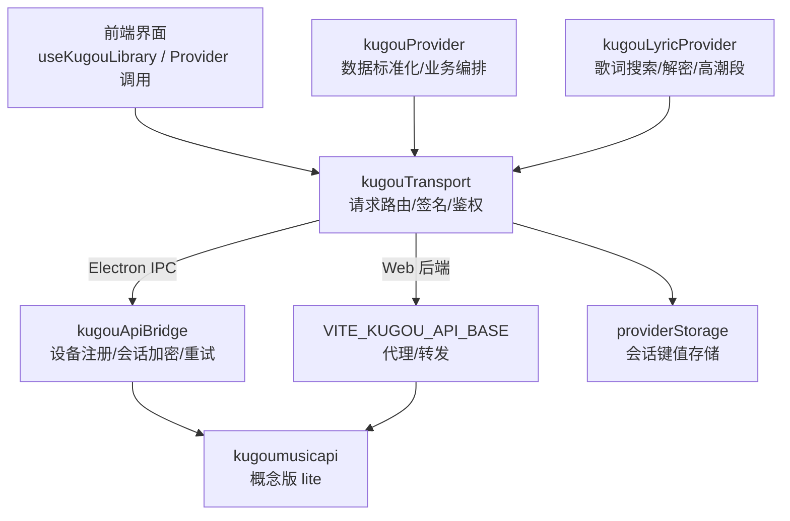
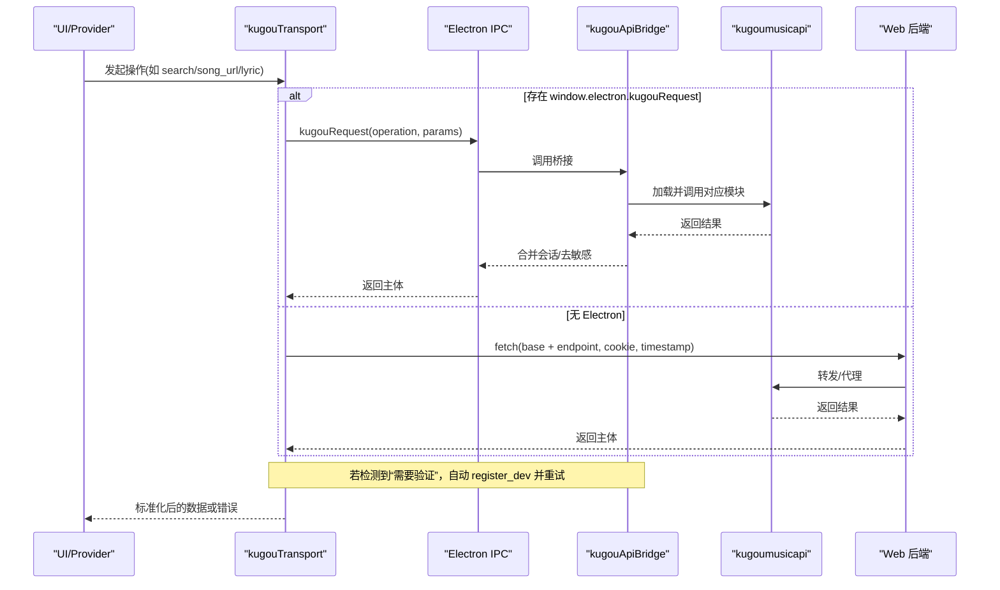
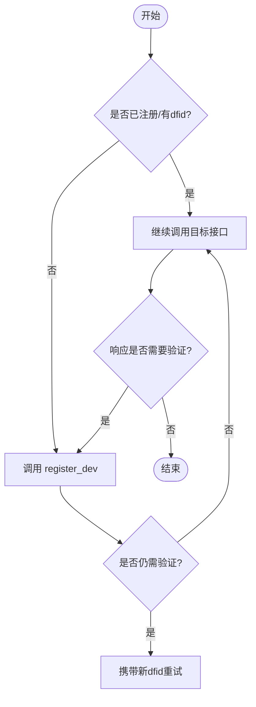
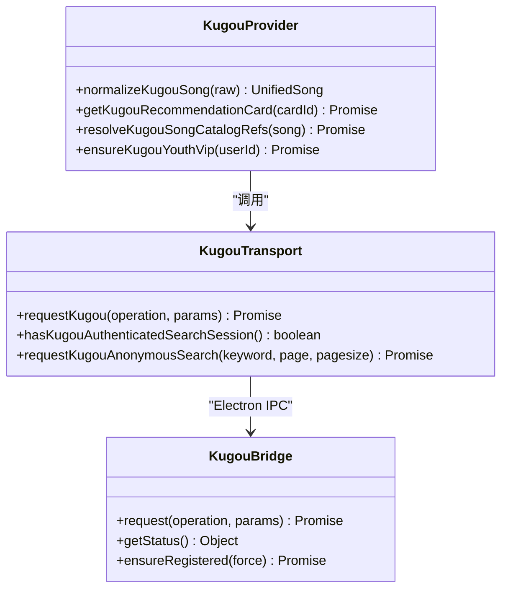
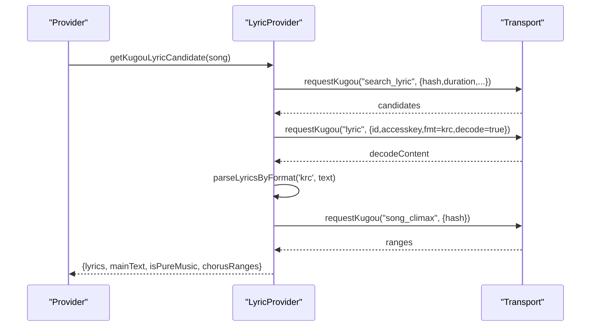
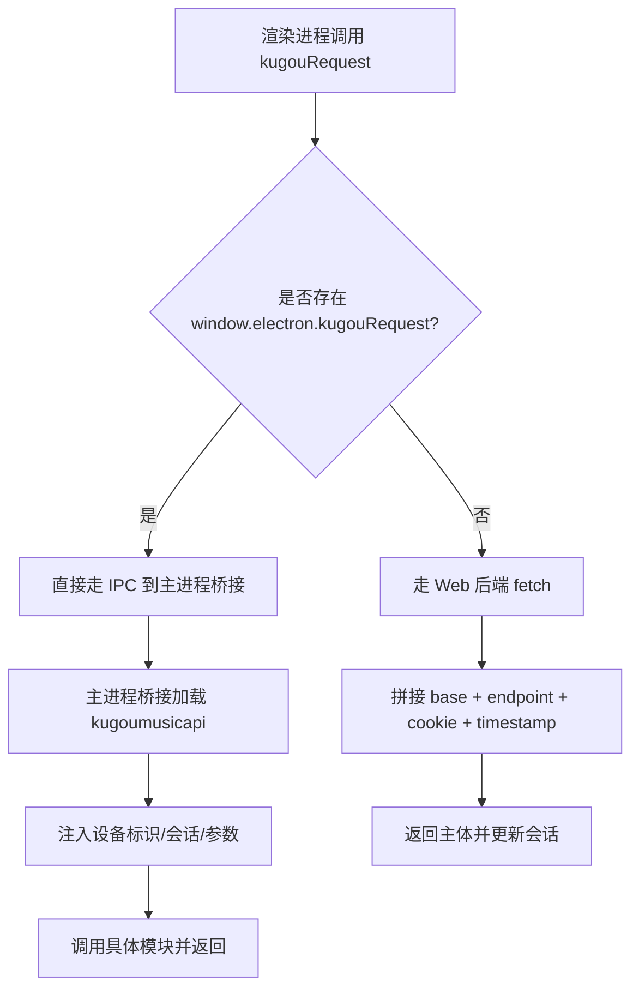
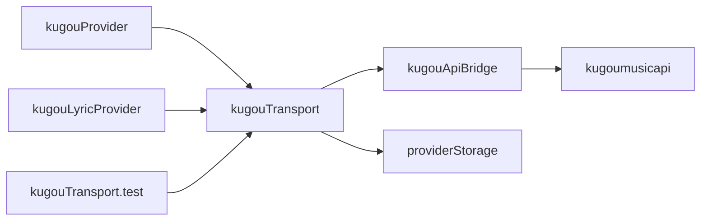

# 酷狗音乐集成

<cite>
**本文引用的文件**
- [electron/kugouApiBridge.cjs](file://electron/kugouApiBridge.cjs)
- [src/services/onlineMusic/kugouTransport.ts](file://src/services/onlineMusic/kugouTransport.ts)
- [src/services/onlineMusic/kugouProvider.ts](file://src/services/onlineMusic/kugouProvider.ts)
- [src/hooks/useKugouLibrary.ts](file://src/hooks/useKugouLibrary.ts)
- [src/utils/lyrics/providers/kugouLyricProvider.ts](file://src/utils/lyrics/providers/kugouLyricProvider.ts)
- [src/services/onlineMusic/providerStorage.ts](file://src/services/onlineMusic/providerStorage.ts)
- [docs/ku-go-api-docs.md](file://docs/ku-go-api-docs.md)
- [docs/kugou-omni-capability-alignment.md](file://docs/kugou-omni-capability-alignment.md)
- [deploy/docker/kugou-api/package.json](file://deploy/docker/kugou-api/package.json)
- [test/unit/onlineMusic/kugouTransport.test.ts](file://test/unit/onlineMusic/kugouTransport.test.ts)
</cite>

## 目录
1. [简介](#简介)
2. [项目结构](#项目结构)
3. [核心组件](#核心组件)
4. [架构总览](#架构总览)
5. [详细组件分析](#详细组件分析)
6. [依赖关系分析](#依赖关系分析)
7. [性能考虑](#性能考虑)
8. [故障排查指南](#故障排查指南)
9. [结论](#结论)
10. [附录](#附录)

## 简介
本技术文档围绕酷狗音乐在 Folia 播放器中的集成方案，系统阐述认证机制、会话管理、API 调用方式（搜索、歌词、播放链接解析、VIP 处理）、Electron 主进程桥接、错误处理策略与性能优化实践。内容基于仓库中实际代码实现与接口文档对齐说明，确保可追溯、可落地。

## 项目结构
- Electron 主进程侧提供安全、加密的酷狗 API 桥接，负责设备注册、登录态持久化、敏感信息隔离与自动重试。
- Web/渲染进程通过统一传输层 kugouTransport 路由到 Electron IPC 或配置的 Web 后端，封装签名、Cookie、鉴权判断与异常重试。
- Provider 层 kugouProvider 将酷狗原始数据标准化为应用内统一模型，并实现推荐卡片、歌单、专辑、歌手、云盘、收藏等能力。
- 歌词模块 kugouLyricProvider 提供 KRC/KRC+高潮段、纯音乐识别、歌词搜索与下载解密。
- 存储层 providerStorage 提供命名空间化的会话缓存迁移与读写。
- 文档 ku-go-api-docs.md 与 kugou-omni-capability-alignment.md 描述接口清单与能力对齐情况。

**图示来源**
- [src/services/onlineMusic/kugouTransport.ts:21-57](file://src/services/onlineMusic/kugouTransport.ts#L21-L57)
- [electron/kugouApiBridge.cjs:156-306](file://electron/kugouApiBridge.cjs#L156-L306)
- [src/services/onlineMusic/kugouProvider.ts:222-285](file://src/services/onlineMusic/kugouProvider.ts#L222-L285)
- [src/utils/lyrics/providers/kugouLyricProvider.ts:83-147](file://src/utils/lyrics/providers/kugouLyricProvider.ts#L83-L147)
- [src/services/onlineMusic/providerStorage.ts:33-64](file://src/services/onlineMusic/providerStorage.ts#L33-L64)

**章节来源**
- [src/services/onlineMusic/kugouTransport.ts:1-267](file://src/services/onlineMusic/kugouTransport.ts#L1-L267)
- [electron/kugouApiBridge.cjs:1-315](file://electron/kugouApiBridge.cjs#L1-L315)
- [src/services/onlineMusic/kugouProvider.ts:1-800](file://src/services/onlineMusic/kugouProvider.ts#L1-L800)
- [src/utils/lyrics/providers/kugouLyricProvider.ts:1-376](file://src/utils/lyrics/providers/kugouLyricProvider.ts#L1-L376)
- [src/services/onlineMusic/providerStorage.ts:1-65](file://src/services/onlineMusic/providerStorage.ts#L1-L65)
- [docs/ku-go-api-docs.md:208-800](file://docs/ku-go-api-docs.md#L208-L800)
- [docs/kugou-omni-capability-alignment.md:1-51](file://docs/kugou-omni-capability-alignment.md#L1-L51)

## 核心组件
- 认证与会话
  - Electron 桥接：设备标识生成、dfid 获取、登录态加密持久化、响应 Cookie 合并、登出清理、设备验证失败自动重试。
  - Web 传输：Cookie/token/userid/dfid 组装、匿名搜索签名、已认证搜索判定、失败重试与降级。
- 数据标准化与业务编排
  - 歌曲、专辑、歌单、歌手、推荐卡片、云盘、收藏等数据的统一映射与分页处理。
  - VIP 权益检查与领取流程（联合 VIP、日领 VIP、升级）。
- 歌词能力
  - 歌词候选搜索、KRC 下载与解密、纯音乐文本识别、高潮段范围解析与应用。
- 存储与迁移
  - 命名空间化的会话键，支持旧键迁移与清理；Electron 模式下避免敏感信息落入渲染进程存储。

**章节来源**
- [electron/kugouApiBridge.cjs:51-126](file://electron/kugouApiBridge.cjs#L51-L126)
- [electron/kugouApiBridge.cjs:128-179](file://electron/kugouApiBridge.cjs#L128-L179)
- [electron/kugouApiBridge.cjs:194-245](file://electron/kugouApiBridge.cjs#L194-L245)
- [electron/kugouApiBridge.cjs:247-306](file://electron/kugouApiBridge.cjs#L247-L306)
- [src/services/onlineMusic/kugouTransport.ts:70-104](file://src/services/onlineMusic/kugouTransport.ts#L70-L104)
- [src/services/onlineMusic/kugouTransport.ts:107-173](file://src/services/onlineMusic/kugouTransport.ts#L107-L173)
- [src/services/onlineMusic/kugouTransport.ts:187-214](file://src/services/onlineMusic/kugouTransport.ts#L187-L214)
- [src/services/onlineMusic/kugouTransport.ts:224-267](file://src/services/onlineMusic/kugouTransport.ts#L224-L267)
- [src/services/onlineMusic/kugouProvider.ts:447-540](file://src/services/onlineMusic/kugouProvider.ts#L447-L540)
- [src/utils/lyrics/providers/kugouLyricProvider.ts:34-65](file://src/utils/lyrics/providers/kugouLyricProvider.ts#L34-L65)
- [src/utils/lyrics/providers/kugouLyricProvider.ts:291-376](file://src/utils/lyrics/providers/kugouLyricProvider.ts#L291-L376)
- [src/services/onlineMusic/providerStorage.ts:14-64](file://src/services/onlineMusic/providerStorage.ts#L14-L64)

## 架构总览
下图展示从 UI 到最终 API 调用的完整链路，包括 Electron IPC 与 Web 后端的分流、设备验证重试、以及数据标准化与歌词处理分支。

**图示来源**
- [src/services/onlineMusic/kugouTransport.ts:224-267](file://src/services/onlineMusic/kugouTransport.ts#L224-L267)
- [electron/kugouApiBridge.cjs:181-245](file://electron/kugouApiBridge.cjs#L181-L245)
- [electron/kugouApiBridge.cjs:247-306](file://electron/kugouApiBridge.cjs#L247-L306)

## 详细组件分析

### 认证与会话管理
- 设备注册与身份
  - 生成 lite-client 设备标识（GUID/MID/MAC/WebGL），首次请求前确保 dfid 存在。
  - 检测“本次请求需要验证”错误码或消息，触发重新注册并自动重试。
- 会话持久化
  - Electron：使用 safeStorage 加密保存 V2 信封（版本、cookies），拒绝明文 backend，必要时回退内存副本。
  - Web：维护 cookie/token/userid/dfid 字符串，按命名空间写入 localStorage，并在每次响应后更新。
- 登出与清理
  - 移除 token/dfid/cookie 等敏感字段，仅保留 userid 作为非敏感提示。
  - 清理旧键，防止遗留凭证泄露。

**图示来源**
- [electron/kugouApiBridge.cjs:150-179](file://electron/kugouApiBridge.cjs#L150-L179)
- [electron/kugouApiBridge.cjs:247-306](file://electron/kugouApiBridge.cjs#L247-L306)
- [src/services/onlineMusic/kugouTransport.ts:70-104](file://src/services/onlineMusic/kugouTransport.ts#L70-L104)
- [src/services/onlineMusic/kugouTransport.ts:187-214](file://src/services/onlineMusic/kugouTransport.ts#L187-L214)
- [src/services/onlineMusic/kugouTransport.ts:259-267](file://src/services/onlineMusic/kugouTransport.ts#L259-L267)

**章节来源**
- [electron/kugouApiBridge.cjs:51-126](file://electron/kugouApiBridge.cjs#L51-L126)
- [electron/kugouApiBridge.cjs:128-179](file://electron/kugouApiBridge.cjs#L128-L179)
- [electron/kugouApiBridge.cjs:194-245](file://electron/kugouApiBridge.cjs#L194-L245)
- [electron/kugouApiBridge.cjs:247-306](file://electron/kugouApiBridge.cjs#L247-L306)
- [src/services/onlineMusic/kugouTransport.ts:70-104](file://src/services/onlineMusic/kugouTransport.ts#L70-L104)
- [src/services/onlineMusic/kugouTransport.ts:187-214](file://src/services/onlineMusic/kugouTransport.ts#L187-L214)
- [src/services/onlineMusic/kugouTransport.ts:224-267](file://src/services/onlineMusic/kugouTransport.ts#L224-L267)

### 酷狗 API 调用与数据标准化
- 统一入口
  - kugouTransport 定义操作集合与端点映射，支持 Electron IPC 与 Web 后端两种通道。
  - 匿名搜索通过复杂搜索接口并计算签名，绕过跨域限制。
- 数据标准化
  - 歌曲：提取 hash、mixSongId、albumAudioId、标题/艺人/时长/封面等，构造统一模型。
  - 歌单/专辑/歌手：多字段兼容解析，支持混合用户库分页与总数推导。
  - 推荐卡片：将 top_card_youth 结果包装为虚拟歌单，便于电台/推荐场景消费。
- VIP 处理
  - 查询联合 VIP，若非 VIP 则尝试领取一天 VIP 并升级，记录状态用于后续播放权限判断。

**图示来源**
- [src/services/onlineMusic/kugouProvider.ts:222-285](file://src/services/onlineMusic/kugouProvider.ts#L222-L285)
- [src/services/onlineMusic/kugouProvider.ts:287-362](file://src/services/onlineMusic/kugouProvider.ts#L287-L362)
- [src/services/onlineMusic/kugouProvider.ts:447-540](file://src/services/onlineMusic/kugouProvider.ts#L447-L540)
- [src/services/onlineMusic/kugouTransport.ts:21-57](file://src/services/onlineMusic/kugouTransport.ts#L21-L57)
- [src/services/onlineMusic/kugouTransport.ts:107-173](file://src/services/onlineMusic/kugouTransport.ts#L107-L173)
- [electron/kugouApiBridge.cjs:156-306](file://electron/kugouApiBridge.cjs#L156-L306)

**章节来源**
- [src/services/onlineMusic/kugouProvider.ts:1-800](file://src/services/onlineMusic/kugouProvider.ts#L1-L800)
- [src/services/onlineMusic/kugouTransport.ts:1-267](file://src/services/onlineMusic/kugouTransport.ts#L1-L267)
- [electron/kugouApiBridge.cjs:1-315](file://electron/kugouApiBridge.cjs#L1-L315)

### 歌词获取与高潮段
- 歌词搜索与下载
  - 根据歌曲 hash、时长、专辑音频 ID 搜索候选，选择最佳候选后下载 KRC。
  - 支持明文与 KRC 两种格式，KRC 解密失败时回退为普通时间轴文本。
- 高潮段
  - 通过 song_climax 获取毫秒级起止时间，转换为秒级范围并应用到歌词渲染。
- 纯音乐识别
  - 对歌词文本进行纯音乐特征判断，避免无效渲染。

**图示来源**
- [src/services/onlineMusic/kugouProvider.ts:708-757](file://src/services/onlineMusic/kugouProvider.ts#L708-L757)
- [src/utils/lyrics/providers/kugouLyricProvider.ts:291-376](file://src/utils/lyrics/providers/kugouLyricProvider.ts#L291-L376)
- [src/services/onlineMusic/kugouTransport.ts:21-57](file://src/services/onlineMusic/kugouTransport.ts#L21-L57)

**章节来源**
- [src/services/onlineMusic/kugouProvider.ts:708-757](file://src/services/onlineMusic/kugouProvider.ts#L708-L757)
- [src/utils/lyrics/providers/kugouLyricProvider.ts:34-65](file://src/utils/lyrics/providers/kugouLyricProvider.ts#L34-L65)
- [src/utils/lyrics/providers/kugouLyricProvider.ts:83-147](file://src/utils/lyrics/providers/kugouLyricProvider.ts#L83-L147)
- [src/utils/lyrics/providers/kugouLyricProvider.ts:291-376](file://src/utils/lyrics/providers/kugouLyricProvider.ts#L291-L376)

### 与 Electron 主进程的桥接机制
- 安全优先
  - 仅在 Electron 环境下启用 IPC，避免将 token/dfid/cookie 写入渲染进程存储。
  - 使用 safeStorage 加密保存会话，拒绝不安全的存储后端。
- 自动重试
  - 检测到设备验证失败时，自动执行 register_dev 并带上新 dfid 重试。
- 能力探测
  - getStatus 暴露可用性与认证状态，供 UI 控制登录入口与功能可见性。

**图示来源**
- [src/services/onlineMusic/kugouTransport.ts:224-267](file://src/services/onlineMusic/kugouTransport.ts#L224-L267)
- [electron/kugouApiBridge.cjs:181-245](file://electron/kugouApiBridge.cjs#L181-L245)
- [electron/kugouApiBridge.cjs:268-306](file://electron/kugouApiBridge.cjs#L268-L306)

**章节来源**
- [electron/kugouApiBridge.cjs:51-126](file://electron/kugouApiBridge.cjs#L51-L126)
- [electron/kugouApiBridge.cjs:156-306](file://electron/kugouApiBridge.cjs#L156-L306)
- [src/services/onlineMusic/kugouTransport.ts:224-267](file://src/services/onlineMusic/kugouTransport.ts#L224-L267)

### 特色功能集成方案
- 歌词翻译
  - 当前实现未包含歌词翻译逻辑；可在歌词解析后接入第三方翻译服务，结合高潮段进行同步显示。
- 音效增强
  - 应用内均衡器与效果链独立于酷狗音源；可在播放前对音源进行本地处理，不影响酷狗 API 调用。
- 车载模式
  - 可通过设置项切换 UI 布局与交互；播放链路仍复用现有在线播放适配，无需修改酷狗集成。

[本节为概念性说明，不直接分析具体文件]

## 依赖关系分析
- 外部依赖
  - kugoumusicapi：概念版 lite 平台，用于设备注册、登录、搜索、音源、歌词等接口。
- 内部依赖
  - providerStorage：会话键值存储与迁移。
  - omni：统一入口与能力声明（参考对齐文档）。
  - 测试用例：覆盖传输层行为、IPC 偏好、匿名搜索签名、不可用状态等。

**图示来源**
- [deploy/docker/kugou-api/package.json:1-8](file://deploy/docker/kugou-api/package.json#L1-L8)
- [src/services/onlineMusic/kugouTransport.ts:21-57](file://src/services/onlineMusic/kugouTransport.ts#L21-L57)
- [src/services/onlineMusic/providerStorage.ts:33-64](file://src/services/onlineMusic/providerStorage.ts#L33-L64)
- [test/unit/onlineMusic/kugouTransport.test.ts:1-220](file://test/unit/onlineMusic/kugouTransport.test.ts#L1-L220)

**章节来源**
- [deploy/docker/kugou-api/package.json:1-8](file://deploy/docker/kugou-api/package.json#L1-L8)
- [src/services/onlineMusic/kugouTransport.ts:1-267](file://src/services/onlineMusic/kugouTransport.ts#L1-L267)
- [src/services/onlineMusic/providerStorage.ts:1-65](file://src/services/onlineMusic/providerStorage.ts#L1-L65)
- [test/unit/onlineMusic/kugouTransport.test.ts:1-220](file://test/unit/onlineMusic/kugouTransport.test.ts#L1-L220)

## 性能考虑
- 请求合并
  - 目录元数据请求合并：同一 lookupId 的请求在 Promise 完成前共享，避免重复网络开销。
- 结果缓存
  - 推荐卡片歌曲列表缓存 Map，减少重复拉取。
  - 高潮段范围缓存，按歌曲 hash 缓存 Promise。
- 异步加载
  - 懒加载 kugoumusicapi，首次 IPC 调用时才初始化，降低启动成本。
  - 歌词下载与解析在独立流程中进行，避免阻塞主流程。
- 分页与限流友好
  - 合理 pagesize，避免过大单次负载；对高频接口（如推荐）采用缓存与分页组合。

**章节来源**
- [src/services/onlineMusic/kugouProvider.ts:287-362](file://src/services/onlineMusic/kugouProvider.ts#L287-L362)
- [src/services/onlineMusic/kugouProvider.ts:364-396](file://src/services/onlineMusic/kugouProvider.ts#L364-L396)
- [src/services/onlineMusic/kugouProvider.ts:676-706](file://src/services/onlineMusic/kugouProvider.ts#L676-L706)
- [electron/kugouApiBridge.cjs:181-192](file://electron/kugouApiBridge.cjs#L181-L192)

## 故障排查指南
- 设备验证失败
  - 现象：返回 errcode=20028 或消息包含“本次请求需要验证”。
  - 处理：自动调用 register_dev 刷新 dfid 并重试；检查 safeStorage 可用性。
- 网络异常
  - 现象：HTTP 非 2xx 或 JSON 解析失败。
  - 处理：抛出 OnlineProviderError，携带 code/network/message/provider；上层捕获并降级。
- 版权限制/无音源
  - 现象：song_url 返回空或受限音质。
  - 处理：按质量回退策略尝试不同音质；当前未实现替代曲，需提示用户。
- 登录态失效
  - 现象：user_detail 或受保护接口返回未认证。
  - 处理：清理会话并引导重新登录；Electron 模式下确保敏感字段被移除。
- 传输不可用
  - 现象：既无 Electron IPC 也无 VITE_KUGOU_API_BASE。
  - 处理：getKugouTransportAvailability 返回 not-configured；UI 禁用相关功能。

**章节来源**
- [src/services/onlineMusic/kugouTransport.ts:70-104](file://src/services/onlineMusic/kugouTransport.ts#L70-L104)
- [src/services/onlineMusic/kugouTransport.ts:156-173](file://src/services/onlineMusic/kugouTransport.ts#L156-L173)
- [src/services/onlineMusic/kugouTransport.ts:249-267](file://src/services/onlineMusic/kugouTransport.ts#L249-L267)
- [electron/kugouApiBridge.cjs:51-68](file://electron/kugouApiBridge.cjs#L51-L68)
- [electron/kugouApiBridge.cjs:247-306](file://electron/kugouApiBridge.cjs#L247-L306)
- [docs/kugou-omni-capability-alignment.md:39-51](file://docs/kugou-omni-capability-alignment.md#L39-L51)

## 结论
该集成以安全、健壮、可扩展为核心目标：通过 Electron 桥接保障会话安全与自动重试，通过传输层统一抽象屏蔽环境差异，通过 Provider 层完成数据标准化与业务编排，并通过歌词模块提供高质量歌词体验。配合缓存、合并与分页策略，整体性能与稳定性满足生产需求。未来可在歌词翻译、版权替代等方面进一步增强。

## 附录
- 接口能力对齐
  - 搜索、登录、歌单、专辑、歌手、云盘、收藏、音源、歌词、推荐、历史推荐等均已在 Provider 中实现或组合实现。
  - 部分能力（如歌曲可用性/替代、歌曲页面 URL）因接口限制暂未完整实现。
- 部署与运行
  - Docker 镜像依赖 kugoumusicapi v1.6.0，建议固定版本以保证接口一致性。
  - Web 模式需配置 VITE_KUGOU_API_BASE，否则视为不可用。

**章节来源**
- [docs/kugou-omni-capability-alignment.md:13-51](file://docs/kugou-omni-capability-alignment.md#L13-L51)
- [deploy/docker/kugou-api/package.json:1-8](file://deploy/docker/kugou-api/package.json#L1-L8)
- [src/services/onlineMusic/kugouTransport.ts:59-68](file://src/services/onlineMusic/kugouTransport.ts#L59-L68)